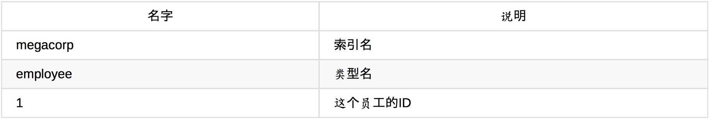

# Elasticsearch学习笔记
## Elastic技术栈
简称ELK
* E Elasticsearch 分布式搜索引擎，可以做分析，可以水平收缩，动态扩容，restful api
* L Logstash 数据接入端
* K Kibana 前端可视化分析平台，报表展示
* Beats 更轻量级的数据接入端，相比Logstash，系统资源消耗更少
* X-Pack es官方的商业扩展包，收费的
    * Security 权限控制，可精确到字段
    * Alerting 通知，定制感兴趣的数据，出现后发送通知到指定的第三方通知系统，如邮件、短信
    * ML 非监督型面向持续性数据的机器学习，自动学习和训练，持续监测，自动发现异常数据
    * Monitoring 监控，如硬件方面、jvm方面
    * Reporting 数据导出，如导出pdf，cvs等
    * Graph 图分析，自动挖掘数据，建立数据之间的关系
* Elastic Cloud 官方的云环境，包括了X-Pack
* ECE 私有云 
* Elasticsearch-Hadoop 支持hadoop和spark


## ES
* 启动命令 bin/elasticsearch
* 配置文件 config
* 默认端口 9200
* cat命令
浏览器访问127.0.0.1:9200/_cat 显示快速接口列表
    * _cat/health 集群状态
    * _cat/plugins 已安装插件
* 插件安装 bin/elasticsearch-plugin install file://本地路径，如安装x-pack 
* 输入输出 es的输入输出使用json格式，通过restful api访问，可直接用Kibana的devtools访问，GET查询，POST增加，PUT修改，DELETE删除
    * es restful api的url分三层，如twitter/doc/1，其中twitter是索引，doc是类型，1是id，分布对应es的_index,_type,_id，不指定id时会随机生成
    * GET twitter/doc/1 精确获取指定文档
    * GET twitter/_search 获取twitter下所有文档 
        可指定查寻条件
        * 单条件查询 {"query":{"match":{"字段名":"字段值"}}}
        * 多条件查询，即and {"bool":{"must":[{"match":{"字段名":"字段值"}},{"match":{"字段名2":"字段值2"}}]}}
        * 条件取反，即not {"bool":{"must-not":[{"match":{"字段名":"字段值"}}]}}
        * 可选，即or {"bool":{"should":[{"match":{"字段名":"字段值"}},{"match":{"字段名2":"字段值2"}}]}}
    * 条数查询 twitter/_search，参数同search
    * 设置索引分片数 
        PUT twitter
        {"settings":{"number_of_shards":1}}
        设置分片数为1
    
    * 批量插入数据 POST _bulk 
        * 数据格式为{index:{_index:"a",_type:"doc",_id:"不指定随机生成"}}{数据json串} 
        * 注意一条数据分两个json串，第一行是index，第二行是内容
    
    * 设置经纬度 twitter/doc/_mapping
        * 具体api查看文档 
    * 聚合统计
        * 范围统计：如年龄字段范围为10-80，使用聚合统计，统计出10-20，20-40，40-60，60-80的条数，可使用range选项
        * 按字段值分组：如统计每个年龄的人数，用terms
    
    * 分析器 twitter/_analyze
        * 通过{"analyzer":"分析器类型"}来设置查询时具体的分析器，如standard，simple等，可以用来做分词，具体参考api 
        * 通过{"tokenizer":"???","filter":["???"]}结合使用来设置过滤器，如大小写转换等，其中tokenizer用来做分词，filter用来做过滤，注意filter是数据，可以设置多个
        
### 综述
Elasticsearch是**面向文档**(document oriented)的，这意味着它可以存储整个对象或文档(document)。然而它不仅仅是存 储，还会索引(index)每个文档的内容使之可以被搜索。在Elasticsearch中，你可以对文档（而非成行成列的数据）进行索 引、搜索、排序、过滤。这种理解数据的方式与以往完全不同，这也是Elasticsearch能够执行复杂的全文搜索的原因之一。

### 名词解释
#### 集群和节点
一个**节点**(node)就是一个Elasticsearch实例，而一个**集群**(cluster)由一个或多个节点组成，它们具有相同的 **cluster.name**（通过配置文件配置） ， 它们协同工作，分享数据和负载。当加入新的节点或者删除一个节点时，集群就会感知到并平衡数据。

集群中一个节点会被选举为**主节点**(master),它将**临时**管理集群级别的一些变更，例如新建或删除索引、增加或移除节点等。 **主节点不参与文档级别的变更或搜索**，这意味着在流量增长的时候，该主节点不会成为集群的瓶颈。任何节点都可以成为主 节点。我们例子中的集群只有一个节点，所以它会充当主节点的角色。

客户端能够与集群中的**任何节点**通信，**包括主节点**。每一个节点**都**知道文档存在于哪个节点上，它们可以**转发**请求到相应的节点上。我们访问的节点负责**收集各节点返回的数据**，最后一起返回给客户端。这一切都由Elasticsearch处理。
##### 查看和修改集群名称
访问9200端口后通过cluster_name字段查看。
修改集群名通过config/elasticsearch.yml文件来修改，修改后需重启节点。

##### 集群健康
集群健康有三种状 态： green 、 yellow 或 red 。
* green：所有主要分片和复制分片都可用
* yellow：所有主要分片可用，但不是所有复制分片都可用
* red：不是所有的主要分片都可用

健康状态通过`GET /_cluster/health`查看，在结果的status字段中显示
         
#### 索引
为了将数据添加到Elasticsearch，我们需要索引(index)——一个存储关联数据的地方。实际上，**索引只是一个用来指向一个或多个分片(shards)的“逻辑命名空间(logical namespace)”**.

一个分片(shard)是一个最小级别“工作单元(worker unit)”,它只是保存了索引中所有数据的一部分。分片就是一个Lucene实例，并且它本身就是一个完整的搜索引擎。我们的文档存储在分片中，并且在分片中被索引，但是我们的**应用程序不会直接与分片通信**，取而代之的是，**直接与索引通信**。

##### 分片
分片是Elasticsearch在集群中分发数据的关键。把分片想象成数据的容器。文档存储在分片中，然后分片分配到你集群中的节点上。当你的集群扩容或缩小，Elasticsearch将会自动在你的节点间迁移分片，以使集群保持平衡。

主分片的数量决定了索引最多能存储多少数据。

理论上主分片能存储的数据大小是没有限制的，限制取决于你实际的使用情况。分片的最大容量完全取决于你的使用状况：硬件存储的大小、文档的大小和复杂度、如何索引和查询你的文档，以及你期望的响应时间。

复制分片只是主分片的一个副本，它可以防止硬件故障导致的数据丢失，同时**可以提供读请求**，比如搜索或者从别的shard取回文档。

当索引创建完成的时候，**主分片的数量就固定了**，但是复制分片的数量可以随时调整。

##### 创建索引与设置分片命令
创建索引blogs，并设置主分片为3个，每个主分片1个复制分片。
```json
PUT /blogs
{
  "settings": {
    "number_of_shards": 3,
    "number_of_replicas": 1
  }
}
```
**注意**
- number_of_replicas的意思是每个主分片有几个复制分片，而不是总共多少个复制分片
- 当集群只有一个节点的时候（例如开发环境），设置复制分片没有意义，即使设置了es也会让复制分片的状态为不可用，因为在**同一个节点上保存相同的数据副本是没有必要的**，如果这个节点故障了，那所有的数据副本也会丢失。
- 默认5个主分片。
- 主分片数量一旦索引创建好之后就不可更改，复制分片数量可动态修改。

##### 复制分片数量修改命令

```json
PUT/blogs/_settings
{
  "number_of_replicas": 2
}
```


### java API
Elasticsearch为Java用户提供了两种内置客户端：

#### 节点客户端(node client)
节点客户端以**无数据节点**(none data node)身份加入集群，换言之，它自己不存储任何数据，但是它知道数据在集群中的具 体位置，并且能够直接转发请求到对应的节点上。

#### 传输客户端(Transport client)
这个更轻量的传输客户端能够发送请求到远程集群。它自己**不加入集群**，只是简单转发请求给集群中的节点。

两个Java客户端都通过9300端口与集群交互，使用Elasticsearch传输协议(Elasticsearch Transport Protocol)。集群中的节点 之间也通过**9300**端口进行通信。如果此端口未开放，你的节点将不能组成集群。

### RESTful API 
其他所有程序语言都可以使用RESTful API，通过**9200**端口的与Elasticsearch进行通信

#### 新增

```json
PUT /megacorp/employee/1 
{
  "first_name": "John",
  "last_name": "Smith",
  "age": 25,
  "about": "I love to go rock climbing",
  "interests": [
    "sports",
    "music"
  ]
}
```

path: /megacorp/employee/1 包含三部分信息：



#### 查询
##### 按id查

```
GET /megacorp/employee/1
```
返回数据：
原始JSON文档包含在 _source 字段中。
```json
{
  "_index": "megacorp",
  "_type": "employee",
  "_id": "1",
  "_version": 1,
  "found": true,
  "_source": {
    "first_name": "John",
    "last_name": "Smith",
    "age": 25,
    "about": "I love to go rock climbing",
    "interests": [
      "sports",
      "music"
    ]
  }
}
```
请求结果不管查没查到数据都有json返回，通过found字段来判断是否命中，true时表示命中，false表示未命中。

> **pretty**
    请求url后面加?pretty后es会对返回json串进行美化，但source字段不会美化，会保持增加时的格式。另外当加上?pretty后，如果未命中，http相应的状态码会变成404，而不是200

##### 查所有
用_search代替id
```
GET /megacorp/employee/_search
```
> 注意：
响应内容不仅会告诉我们哪些文档被匹配到，而且这些文档内容完整的被包含在其中—我们在给用户展示搜索结果时 需要用到的所有信息都有了。

##### 查包含关键字

使用 _search 关键字，然后将查询语句传递给参数 q=
查last_name字段包含Smith的文档
```
GET /megacorp/employee/_search?q=last_name:Smith
```

##### 只返回指定字段
通常， GET 请求将返回文档的全部，存储在 _source 参数中。但是可能你感兴趣的字段只是 title 。请求个别字段可以使用 _source 参数。多个字段可以使用逗号分隔：

`GET /website/blog/123?_source=title,text`

或者你只想得到 _source 字段而不要其他的元数据，你可以这样请求：
`GET /website/blog/123/_source`

#### 删除

```
DELETE /megacorp/employee/1
```

#### 是否存在

```
HEAD  /megacorp/employee/1
```

#### 更新

已存在的文档再次PUT就是更新

### DSL查询语句
DSL(Domain Specific Language特定领域语言)以JSON请求体的形式出现。
#### 简单查询
查last_name字段包含Smith的文档，与RESTful api里的_search?q=last_name:Smith
同样的功能
```json
GET/megacorp/employee/_search{
  "query": {
    "match": {
      "last_name": "Smith"
    }
  }
}
```

#### 过滤器

```json
GET/megacorp/employee/_search
{
  "query": {
    "filtered": {
      "filter": {
        "range": {
          "age": {
            "gt": 30
          }
        }
      },
      "query": {
        "match": {
          "last_name": "smith"
        }
      }
    }
  }
}
```

#### 全文搜索
从 about 字段中搜索"rock climbing"
```json
GET/megacorp/employee/_search
{
  "query": {
    "match": {
      "about": "rock climbing"
    }
  }
}
```

返回结果：

```json
{
...
"hits": {
    "total": "max_score": "hits": [
      2,
      0.16273327,
      {
        ..."_score": 0.16273327,
        <1>"_source": {
          "first_name": "John",
          "last_name": "Smith",
          "age": 25,
          "about": "I love to go rock climbing",
          "interests": [
            "sports",
            "music"
          ]
        }
      },
      {
        ..."_score": 0.016878016,
        <2>"_source": {
          "first_name": "Jane",
          "last_name": "Smith",
          "age": 32,
          "about": "I like to collect rock albums",
          "interests": [
            "music"
          ]
        }
      }
    ]
  }
}
```
默认情况下，Elasticsearch**根据结果相关性评分来对结果集进行排序**，所谓的「结果相关性评分」就是文档与查询条件的**匹配程度**。很显然，排名第一的 John Smith 的 about 字段明确的写到“rock climbing”。

但是为什么 Jane Smith 也会出现在结果里呢？原因是**“rock”在她的 abuot 字段中被提及了**。因为只有“rock”被提及 而“climbing”没有，所以她的 **_score 要低于John**。

#### 短语搜索
上面的全文搜索的例子里，使用match搜索rock climbing时进行了分词，es会分布搜索rock 和climbing这两个词，当我需要搜索rock climbing这一个短语时，需使用match_phrase。
phrase是短语的意思

```json
GET/megacorp/employee/_search
{
  "query": {
    "match_phrase": {
      "about": "rock climbing"
    }
  }
}
```

#### 高亮搜索结果

```json
GET/megacorp/employee/_search
{
  "query": {
    "match_phrase": {
      "about": "rock climbing"
    }
  },
  "highlight": {
    "fields": {
      "about": {}
    }
  }
}
```
返回结果中会有一个新的部分叫做 highlight ，这里包含了来 自 about 字段中的文本，并且用 <em></em> 来标识匹配到的单词。

```json
"highlight": {
  "about": [
    "I love to go <em>rock</em> <em>climbing</em>"
  ]
}
```

#### 聚合查询

```json
GET/megacorp/employee/_search
{
  "aggs": {
    "all_interests": {
      "terms": {
        "field": "interests"
      }
    }
  }
}
```
* aggs表示使用聚合操作，aggs可单独使用，也可与普通查询query条件同时使用，对query的查询结果进行聚合。aggs还可以嵌套使用，对父aggs的结果进行再次聚合。
* all_interests表示查询结果里用all_interests字段表示聚合结果
* terms节点表示要聚合的条件，field表示用interests字段聚合

返回结果：

```json
{
  ...
  "hits": {
    ...
  },
  "aggregations": {
    "all_interests": {
      "buckets": [
        {
          "key": "music",
          "doc_count": 2
        },
        {
          "key": "forestry",
          "doc_count": 1
        },
        {
          "key": "sports",
          "doc_count": 1
        }
      ]
    }
  }
}
```

##### 与普通查询同时使用

```json
GET/megacorp/employee/_search
{
  "query": {
    "match": {
      "last_name": "smith"
    }
  },
  "aggs": {
    "all_interests": {
      "terms": {
        "field": "interests"
      }
    }
  }
}
```

##### aggs嵌套使用

```json
GET/megacorp/employee/_search
{
  "aggs": {
    "all_interests": {
      "terms": {
        "field": "interests"
      },
      "aggs": {
        "avg_age": {
          "avg": {
            "field": "age"
          }
        }
      }
    }
  }
}
```

### ES数据类型与关系型数据库对应关系


Elasticsearch集群可以包含多个索引(indices[index的复数])（数据库），每一个索引可以包含多个类型(types)（表），每一个类型包含多 个文档(documents)（行），然后每个文档包含多个字段(Fields)（列）。

### ES中的索引
「索引」含义的区分

你可能已经注意到索引(index)这个词在Elasticsearch中有着不同的含义，所以有必要在此做一下区分:

- 索引（名词） 如上文所述，一个索引(index)就像是传统关系数据库中的数据库，它是相关文档存储的地方， index的复数是indices 或indexes。 
- 索引（动词） 「索引一个文档」表示把一个文档存储到索引（名词）里，以便它可以被检索或者查询。这很像 SQL中的 INSERT 关键字，差别是，如果文档已经存在，新的文档将覆盖旧的文档。 
- 倒排索引 传统数据库为特定列增加一个索引，例如B-Tree索引来加速检索。Elasticsearch和Lucene使用一种叫做**倒排索引(inverted index)**的数据结构来达到相同目的。

在Elasticsearch中，每一个字段的数据都是**默认**被索引的。也就是说，每个字段专门有一个反向索引用于快速检索。而且， 与其它数据库不同，它可以在同一个查询中利用所有的这些反向索引，以惊人的速度返回结果。

### ES的分布式
#### ES分布式的特性
Elasticsearch致力于隐藏分布式系统的复杂性。以下这些操作都是在底层自动完成的：
* 将你的文档分区到不同的容器或者分片(shards)中，它们可以存在于一个或多个节点中。 
* 将分片均匀的分配到各个节点，对索引和搜索做负载均衡。 
* 冗余每一个分片，防止硬件故障造成的数据丢失。 
* 将集群中任意一个节点上的请求路由到相应数据所在的节点。 
* 无论是增加节点，还是移除节点，分片都可以做到无缝的扩展和迁移。

#### 增加节点
ES增加节点不需要配置master，slave之类的，只要节点的cluster.name一致，且各节点间网络是通的，就能自动发现并加入集群。
> 一个节点可以启用多个ES实例
> 如果节点加入集群失败，检查日志找出哪里出了问题。这可能是网络广播被禁用，或者防火墙阻止了节点通信。

ES集群加入新节点后，会自动对索引分片进行重新分配，包括主分片和复制分片。

#### 分片数设置建议
* 分片本身就是一个完整成熟的搜索引擎，它可以使用单一节点的所有资源。例如使用6个分片（3个主分片和三个复制分片）可以扩展最多到6个节点，每个节点上有一个分片，这样就可以**100%**使用每个节点的资源了。
* 不增加节点，单纯的只增加复制分片数不会提高性能，因为每个分片能够使用的节点资源比重反而会减少。需要增加硬件来提高吞吐量。

#### 分片大小设置建议
避免有非常大的分片，因为大的分片可能会对集群从故障中恢复的能力产生负面影响。 对于多大的分片没有固定的限制，但是分片大小为**50GB**通常被界定为适用于各种用例的限制。

#### 丢失节点
当ES节点故障导致下线时，如果主节点故障，其他节点会选举出一个新的主节点。
因为有复制分片的存在，所以节点下线不会导致es数据丢失，如果主分片丢失了，复制分片中的一个会**瞬间**被提升为主分片。
当节点丢失时不会触发分片的重新分片，只会把集群状态改为yello，因为复制分片数与索引定义的不一致。
当故障节点重新加入集群后，如果依旧有旧节点的拷贝，ES将会尝试再利用它们，它只会复制在故障期间数据变更的部分，如果拷贝已丢失，则会触发分片的重新分配。

### ES中的数据
#### 文档
ES中的文档相当于关系型数据库的一行，键(key)是字段(field)或属性(property)的名字，值 (value)可以是字符串、数字、Bool类型、另一个对象、值数组或者其他特殊类型，比如表示日期的字符串或者表示地理位置的对象。
##### ES文档示例


##### 元数据
一个文档不只有数据。它还包含了元数据(metadata)——关于文档的信息。三个必须的元数据节点是：
* _index 文档存储的地方
* _type 文档代表的对象的类
* _id 文档的唯一标识

文档通过以上3个元数据来检索，如RESTful请求的/megacorp/employee/1，url里的参数分别代表/{index}/{type}/{id}

其他元数据：
* _version Elasticsearch中每个文档都有版本号，每当文档变化（包括删除）都会使 _version增加

##### 自动生成ID

通过post方法不指定id时，es会自动生成id。

```shell
POST /website/blog/
```
注意URL只包含index和type两级，没有id，且请求方式是post而不是put。
自动生成的id为随机生成的字符串。

---

## Kibana
* 启动命令 bin/kibana
* 配置
    * config/kibana.yml
    * es路径配置 elasticsearch.hosts: ["http://localhost:9200"]
    * es用户名、密码：elasticsearch.username: "user" 
    elasticsearch.password: "pass"
        * 启用x-pack后才需要配置，不启用的话es没有权限管理
* DevTools restful直接访问es
    * GET / 访问es根目录，与浏览器直接访问127.0.0.1:9200一样的效果
    
    