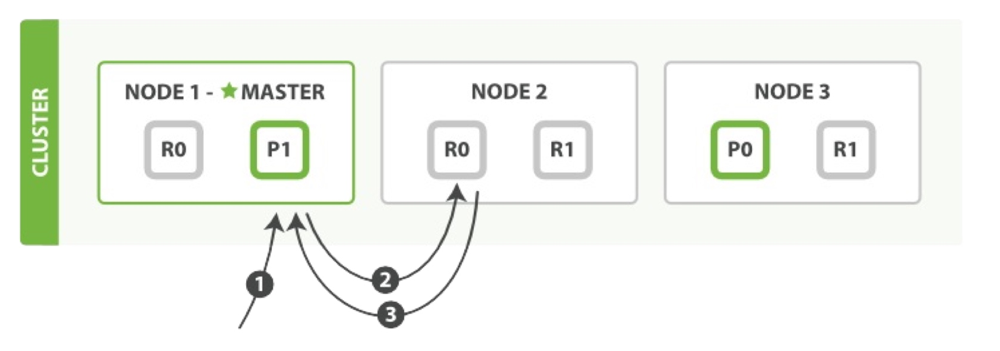

# Elastic技术栈
简称ELK
* E Elasticsearch 分布式搜索引擎，可以做分析，可以水平收缩，动态扩容，restful api
* L Logstash 数据接入端
* K Kibana 前端可视化分析平台，报表展示
* Beats 更轻量级的数据接入端，相比Logstash，系统资源消耗更少
* X-Pack es官方的商业扩展包，收费的
    * Security 权限控制，可精确到字段
    * Alerting 通知，定制感兴趣的数据，出现后发送通知到指定的第三方通知系统，如邮件、短信
    * ML 非监督型面向持续性数据的机器学习，自动学习和训练，持续监测，自动发现异常数据
    * Monitoring 监控，如硬件方面、jvm方面
    * Reporting 数据导出，如导出pdf，cvs等
    * Graph 图分析，自动挖掘数据，建立数据之间的关系
* Elastic Cloud 官方的云环境，包括了X-Pack
* ECE 私有云 
* Elasticsearch-Hadoop 支持hadoop和spark


# ES
* 启动命令 bin/elasticsearch
* 配置文件 config
* 默认端口 9200
* cat命令
浏览器访问127.0.0.1:9200/_cat 显示快速接口列表
    * _cat/health 集群状态
    * _cat/plugins 已安装插件
* 插件安装 bin/elasticsearch-plugin install file://本地路径，如安装x-pack 
* 输入输出 es的输入输出使用json格式，通过restful api访问，可直接用Kibana的devtools访问，GET查询，POST增加，PUT修改，DELETE删除
    * es restful api的url分三层，如twitter/doc/1，其中twitter是索引，doc是类型，1是id，分布对应es的_index,_type,_id，不指定id时会随机生成
    * GET twitter/doc/1 精确获取指定文档
    * GET twitter/_search 获取twitter下所有文档 
        可指定查寻条件
        * 单条件查询 {"query":{"match":{"字段名":"字段值"}}}
        * 多条件查询，即and {"bool":{"must":[{"match":{"字段名":"字段值"}},{"match":{"字段名2":"字段值2"}}]}}
        * 条件取反，即not {"bool":{"must-not":[{"match":{"字段名":"字段值"}}]}}
        * 可选，即or {"bool":{"should":[{"match":{"字段名":"字段值"}},{"match":{"字段名2":"字段值2"}}]}}
    * 条数查询 twitter/_search，参数同search
    * 设置索引分片数 
        PUT twitter
        {"settings":{"number_of_shards":1}}
        设置分片数为1
    
    * 批量插入数据 POST _bulk 
        * 数据格式为{index:{_index:"a",_type:"doc",_id:"不指定随机生成"}}{数据json串} 
        * 注意一条数据分两个json串，第一行是index，第二行是内容
    
    * 设置经纬度 twitter/doc/_mapping
        * 具体api查看文档 
    * 聚合统计
        * 范围统计：如年龄字段范围为10-80，使用聚合统计，统计出10-20，20-40，40-60，60-80的条数，可使用range选项
        * 按字段值分组：如统计每个年龄的人数，用terms
    
    * 分析器 twitter/_analyze
        * 通过{"analyzer":"分析器类型"}来设置查询时具体的分析器，如standard，simple等，可以用来做分词，具体参考api 
        * 通过{"tokenizer":"???","filter":["???"]}结合使用来设置过滤器，如大小写转换等，其中tokenizer用来做分词，filter用来做过滤，注意filter是数据，可以设置多个
        
## 综述
Elasticsearch是**面向文档**(document oriented)的，这意味着它可以存储整个对象或文档(document)。然而它不仅仅是存 储，还会索引(index)每个文档的内容使之可以被搜索。在Elasticsearch中，你可以对文档（而非成行成列的数据）进行索 引、搜索、排序、过滤。这种理解数据的方式与以往完全不同，这也是Elasticsearch能够执行复杂的全文搜索的原因之一。

## 名词解释
### 集群和节点
一个**节点**(node)就是一个Elasticsearch实例，而一个**集群**(cluster)由一个或多个节点组成，它们具有相同的 **cluster.name**（通过配置文件配置） ， 它们协同工作，分享数据和负载。当加入新的节点或者删除一个节点时，集群就会感知到并平衡数据。

集群中一个节点会被选举为**主节点**(master),它将**临时**管理集群级别的一些变更，例如新建或删除索引、增加或移除节点等。 **主节点不参与文档级别的变更或搜索**，这意味着在流量增长的时候，该主节点不会成为集群的瓶颈。任何节点都可以成为主 节点。我们例子中的集群只有一个节点，所以它会充当主节点的角色。

客户端能够与集群中的**任何节点**通信，**包括主节点**。每一个节点**都**知道文档存在于哪个节点上，它们可以**转发**请求到相应的节点上。我们访问的节点负责**收集各节点返回的数据**，最后一起返回给客户端。这一切都由Elasticsearch处理。
#### 查看和修改集群名称
访问9200端口后通过cluster_name字段查看。
修改集群名通过config/elasticsearch.yml文件来修改，修改后需重启节点。

#### 集群健康
集群健康有三种状 态： green 、 yellow 或 red 。
* green：所有主要分片和复制分片都可用
* yellow：所有主要分片可用，但不是所有复制分片都可用
* red：不是所有的主要分片都可用

健康状态通过`GET /_cluster/health`查看，在结果的status字段中显示
         
### 索引
为了将数据添加到Elasticsearch，我们需要索引(index)——一个存储关联数据的地方。实际上，**索引只是一个用来指向一个或多个分片(shards)的“逻辑命名空间(logical namespace)”**.

一个分片(shard)是一个最小级别“工作单元(worker unit)”,它只是保存了索引中所有数据的一部分。分片就是一个Lucene实例，并且它本身就是一个完整的搜索引擎。我们的文档存储在分片中，并且在分片中被索引，但是我们的**应用程序不会直接与分片通信**，取而代之的是，**直接与索引通信**。

#### 分片
分片是Elasticsearch在集群中分发数据的关键。把分片想象成数据的容器。文档存储在分片中，然后分片分配到你集群中的节点上。当你的集群扩容或缩小，Elasticsearch将会自动在你的节点间迁移分片，以使集群保持平衡。

主分片的数量决定了索引最多能存储多少数据。

理论上主分片能存储的数据大小是没有限制的，限制取决于你实际的使用情况。分片的最大容量完全取决于你的使用状况：硬件存储的大小、文档的大小和复杂度、如何索引和查询你的文档，以及你期望的响应时间。

复制分片只是主分片的一个副本，它可以防止硬件故障导致的数据丢失，同时**可以提供读请求**，比如搜索或者从别的shard取回文档。

当索引创建完成的时候，**主分片的数量就固定了**，但是复制分片的数量可以随时调整。

#### 创建索引与设置分片
创建索引blogs，并设置主分片为3个，每个主分片1个复制分片。
```json
PUT /blogs
{
  "settings": {
    "number_of_shards": 3,
    "number_of_replicas": 1
  }
}
```
**注意**
- number_of_replicas的意思是每个主分片有几个复制分片，而不是总共多少个复制分片
- 当集群只有一个节点的时候（例如开发环境），设置复制分片没有意义，即使设置了es也会让复制分片的状态为不可用，因为在**同一个节点上保存相同的数据副本是没有必要的**，如果这个节点故障了，那所有的数据副本也会丢失。
- 默认5个主分片。
- 主分片数量一旦索引创建好之后就不可更改，复制分片数量可动态修改。

#### 修改分片数量

```json
PUT /blogs/_settings
{
  "number_of_replicas": 2
}
```

#### 删除索引

```json
DELETE /blogs
```

## java API
Elasticsearch为Java用户提供了两种内置客户端：

### 节点客户端(node client)
节点客户端以**无数据节点**(none data node)身份加入集群，换言之，它自己不存储任何数据，但是它知道数据在集群中的具 体位置，并且能够直接转发请求到对应的节点上。

### 传输客户端(Transport client)
这个更轻量的传输客户端能够发送请求到远程集群。它自己**不加入集群**，只是简单转发请求给集群中的节点。

两个Java客户端都通过9300端口与集群交互，使用Elasticsearch传输协议(Elasticsearch Transport Protocol)。集群中的节点 之间也通过**9300**端口进行通信。如果此端口未开放，你的节点将不能组成集群。

## RESTful API 
其他所有程序语言都可以使用RESTful API，通过**9200**端口的与Elasticsearch进行通信

### 新增

```json
PUT /megacorp/employee/1 
{
  "first_name": "John",
  "last_name": "Smith",
  "age": 25,
  "about": "I love to go rock climbing",
  "interests": [
    "sports",
    "music"
  ]
}
```

path: /megacorp/employee/1 包含三部分信息：


#### 不替换旧文档
使用PUT请求，当文档已经存在时，默认会覆盖原有的，并将版本号+1，如果不想覆盖原有的，可以在请求后面加create参数，两种添加方式：
1. 使用 op_type 查询参数

    `PUT /website/blog/123?op_type=create`
2. URL后加/_create 做为端点

    `PUT /website/blog/123/_create`
使用create后，如果成功创建了新文档，返回201，如果文档已存在创建失败，返回409

```json
{
"error" : "DocumentAlreadyExistsException[[website][4] [blog][123]: document already exists]", 
"status" : 409
}
```

### 查询
#### 按id查

```
GET /megacorp/employee/1
```
返回数据：
原始JSON文档包含在 _source 字段中。
```json
{
  "_index": "megacorp",
  "_type": "employee",
  "_id": "1",
  "_version": 1,
  "found": true,
  "_source": {
    "first_name": "John",
    "last_name": "Smith",
    "age": 25,
    "about": "I love to go rock climbing",
    "interests": [
      "sports",
      "music"
    ]
  }
}
```
请求结果不管查没查到数据都有json返回，通过found字段来判断是否命中，true时表示命中，false表示未命中。

> **pretty**
    请求url后面加?pretty后es会对返回json串进行美化，但source字段不会美化，会保持增加时的格式。另外当加上?pretty后，如果未命中，http相应的状态码会变成404，而不是200

#### 查所有
用_search代替id
```
GET /megacorp/employee/_search
```
> 注意：
响应内容不仅会告诉我们哪些文档被匹配到，而且这些文档内容完整的被包含在其中—我们在给用户展示搜索结果时 需要用到的所有信息都有了。

#### 查包含关键字

使用 _search 关键字，然后将查询语句传递给参数 q=
查last_name字段包含Smith的文档
```
GET /megacorp/employee/_search?q=last_name:Smith
```

#### 只返回指定字段
通常， GET 请求将返回文档的全部，存储在 _source 参数中。但是可能你感兴趣的字段只是 title 。请求个别字段可以使用 _source 参数。多个字段可以使用逗号分隔：

`GET /website/blog/123?_source=title,text`
或者请求体json里加_source节点：

```json
{
  "_source": [
    "gmtModified"
  ],
  "query": {
    "range": {
      "gmtModified": {
        "lt": 1590253982322
      }
    }
  }
}
```

如果**只想得到 _source 字段而不要其他的元数据**，你可以这样请求：
`GET /website/blog/123/_source`

#### 文档是否存在
使用HEAD代替GET来检查文档是否存在
`curl -i -XHEAD http://localhost:9200/website/blog/123`
HEAD 请求不会返回响应体，只有HTTP头：

```
HTTP/1.1 200 OK 
Content-Type: text/plain; charset=UTF-8 
Content-Length: 0
```

如果不存在返回 404

#### 设置超时时间
`GET /_search?timeout=10ms`
如果响应速度比完整的结果更重要，你可以定 义 timeout 参数为 10 或者 10ms （10毫秒），或者 1s （1秒）
> 注意timeout不是断路器，timeout不会停止执行查询，它仅仅告诉你目前顺利返回结果的节点然后关闭连接。在后台，其他分片可能依旧执行查询，尽管结果已经被发送。

#### 多index和多type同时查询

| url | 说明 |
| --- | --- |
|/_search|在所有索引的所有类型中搜索|
|/gb/_search|在索引 gb 的所有类型中搜索|
|/gb,us/_search|在索引 gb 和 us 的所有类型中搜索|
|/g*,u*/_search|在以 g 或 u 开头的索引的所有类型中搜索|
|/gb/user/_search|在索引 gb 的类型 user 中搜索|
|/gb,us/user,tweet/_search|在索引 gb 和 us 的类型为 user 和 tweet 中搜索|
|/_all/user,tweet/_search|在所有索引的 user 和 tweet 中搜索 search types and in all indices|

> 搜索一个索引有5个主分片和5个索引各有一个分片事实上是一样的。

#### 分页

```shell
#查前5条
GET /_search?size=5
#查6到10
GET /_search?size=5&from=5
#查11到15
GET /_search?size=5&from=10
```

> 警惕深度分页，es是分布式的，请求节点归集所有节点的结果并排序之后返回分页结果，注意是所有数据，举例来说：假设在一个有5个主分片的索引中搜索。当我们请求结果的第一页（结果 1到10）时，每个分片产生自己最顶端10个结果然后返回它们给请求节点(requesting node)，它再排序这所有的50个 结果以选出顶端的10个结果。
现在假设我们请求第1000页—结果10001到10010。工作方式都相同，不同的是每个分片都必须产生顶端的10010个 结果。然后请求节点排序这50050个结果并丢弃50040个！

### 删除
#### 删除指定id
```
DELETE /megacorp/employee/1
```
如果文档被找到，Elasticsearch将返回 200 OK 状态码和以下响应体。注意 _version 数字已经增加了。

```json
{
  "found": true,
  "_index": "website",
  "_type": "blog",
  "_id": "123",
  "_version": 3
}
```

如果文档未找到，我们将得到一个 404 Not Found 状态码，响应体是这样的：

```json
{
  "found": false,
  "_index": "website",
  "_type": "blog",
  "_id": "123",
  "_version": 4
}
```

尽管文档不存在—— "found" 的值是 false —— _version 依旧增加了。这是内部记录的一部分，它确保在多节点间不同操作 可以有正确的顺序。

#### 按查询条件删除

```
POST DELETE /megacorp/employee/_delete_by_query
然后带查询条件json串
```

### 是否存在

```
HEAD  /megacorp/employee/1
```

### 更新

#### 全部更新
已存在的文档再次**PUT**就是全部更新
文档在Elasticsearch中是不可变的。
在内部，Elasticsearch会标记旧文档为删除并添加了一个完整的新文档。旧版本文档不会立即消失，但你也不能去访问它。Elasticsearch会在你继续索引更多数据时清理被删除的文档。

#### 局部更新
局部更新使用**update**。
这个API 似乎 允许你修改文档的局部，但事实上Elasticsearch 遵循与之前所说完全相同的过程，这个过程如下：
1. 从旧文档中检索JSON
2. 修改它
3. 删除旧文档
4. 索引新文档

唯一的不同是 update API完成这一过程只需要一个客户端请求既可，不再需要 get 和 index 请求了。

update时存在的字段被覆盖，不存在的字段会添加。

```shell
POST /website/blog/1/_update
{
  "doc": {
    "tags": [
      "testing"
    ],
    "views": 0
  }
}
```
注意上例中的doc是指更新文档，而不是doc字段，tag和views节点才是具体字段的值，
而在新增数据put的时候却不需要doc节点

### 批量添删改查

#### 批量查询
合并多个请求可以避免每个请求单独的网络开销。使用multi-get或者 mget API来同时检索多个文档。

```shell
GET/_mget
{
  #mget API参数是一个docs数组，数组的每个节点定义一个文档的_index、_type、_id元数据
  "docs": [
    {
      "_index": "website",
      "_type": "blog",
      "_id": 2
    },
    {
      "_index": "website",
      "_type": "pageviews",
      "_id": 1,
      "_source": "views"
    }
  ]
}
```

相应体也是一个doc数组

```shell
{
  "docs": [
    {
      "_index": "website",
      "_id": "2",
      "_type": "blog",
      "found": true,
      "_source": {
        "text": "This is a piece of cake...",
        "title": "My first external blog entry"
      },
      "_version": 10
    },
    {
      "_index": "website",
      "_id": "1",
      "_type": "pageviews",
      "found": true,
      "_version": 2,
      "_source": {
        "views": 2
      }
    }
  ]
}
```

如果你想检索的文档在同一个 _index 中（甚至在同一个 _type 中），你就可以在URL中定义一个默认的 /_index 或 者 /_index/_type 。

```shell
#查website/blog
GET/website/blog/_mget
{
  "docs": [
     #id为2
    {"_id": 2},
    #type为pageviews，id为1
    {"_type": "pageviews","_id": 1}
    ]
  }
```

如果所有文档具有相同_index和_type，你可以通过简单的ids数组来代替完整的docs数组

```shell
GET /website/blog/_mget
{ "ids" : [ "2", "1" ] }
```

> 注意：
尽管前面提到有一个文档没有被找到，但HTTP请求状态码还是 200 。事实上，就算所有文档都找不到，请求也还是返 回 200 ，原因是 mget 请求本身成功了。如果想知道每个文档是否都成功了，你需要检查 found 标志。

#### 批量添删改
批量添删改使用bulk API
bulk 请求体如下，注意\n，通过\n来区分不同请求：

```shell
{ action: { metadata }}\n 
{ request body }\n 
{ action: { metadata }}\n 
{ request body }\n
...
```
action/metadata这一行定义了文档行为(what action)发生在哪个文档(which document)之上。
请求体(request body)由文档的 _source 组成——文档所包含的一些字段以及其值。index和 create 操作必须包含请求体行，因为必须提供文档用来索引。

两个重要的点需要注意：
* 每行必须以 "\n" 符号结尾，**包括最后一行**。这些都是作为每行有效的分离而做的标记。
* 每一行的数据不能包含未被转义的换行符，它们会干扰分析——这意味着JSON不能被美化打印。

请求demo：

```shell
POST /_bulk 
#delete操作后面没有请求体行
{ "delete": { "_index": "website", "_type": "blog", "_id": "123" }}\n
{ "create": { "_index": "website", "_type": "blog", "_id": "123" }}\n
{ "title": "My first blog post" }\n
{ "index": { "_index": "website", "_type": "blog" }}\n
{ "title": "My second blog post" }\n
{ "update": { "_index": "website", "_type": "blog", "_id": "123", "_retry_on_conflict" : 3} }\n
{ "doc" : {"title" : "My updated blog post"} }\n
```

响应包含一个 items 数组，它罗列了每一个请求的结果，结果的顺序与我们请求的顺序相同：
```shell
{
  "took": 4,
  #false表示全部成功，当true时需要遍历items的status字段找出非200的来定位失败数据
  "errors": false,
  "items": [
    {
      "delete": {
        "_index": "website",
        "_type": "blog",
        "_id": "123",
        "_version": 2,
        #当不是200时表示操作失败
        "status": 200,
        "found": true
      }
    },
    {
      "create": {
        "_index": "website",
        "_type": "blog",
        "_id": "123",
        "_version": 3,
        "status": 201
      }
    },
    {
      create": { "_index": "website", "_type": "blog", "_id": "EiwfApScQiiy7TIKFxRCTw", "_version": 1, "status": 201 }}, { update": {
        "_index": "website",
        "_type": "blog",
        "_id": "123",
        "_version": 4,
        "status": 200
      }
    }"  "
  ]
}
}
```

每个子请求都被独立的执行，所以一个子请求的错误并不影响其它请求。如果任何一个请求失败，顶层的 error 标记将被设 置为 true，换句话说**bulk请求不是原子操作**

你可能在同一个 index 下的同一个 type 里批量索引日志数据。为每个文档指定相同的元数据是多余的。就像 mget API， bulk 请求也可以在URL中使用 /_index 或 /_index/_type :

```shell
POST /website/_bulk 
{ "index": { "_type": "log" }}\n
{ "event": "User logged in" }\n
```

```shell
POST /website/log/_bulk 
{ "index": {}}\n
{ "event": "User logged in" }\n
{ "index": { "_type": "blog" }}\n
{ "title": "Overriding the default type"}\n
```

一次请求数据体大小并不是一个固定的数字，根据硬件、文档的大小和复杂度以及索引和搜索的负载，最好保持在**5-15MB**大小间。

##### 为什么用换行而不是json数组
批量中每个引用的文档属于不同的主分片，每个分片可能被分布于集群中的某个节点上。这意味着批量中的每个操作 (action)需要被转发到对应的分片和节点上。 如果每个单独的请求被包装到JSON数组中，那意味着我们需要：
1. 解析JSON为数组（包括文档数据，可能非常大）
2. 检查每个请求决定应该到哪个分片上
3. 为每个分片创建一个请求的数组
4. 序列化这些数组为内部传输格式
5. 发送请求到每个分片

这可行，但需要大量的RAM来承载本质上相同的数据，还要创建更多的数据结构使得JVM花更多的时间执行垃圾回收。 
取而代之的，Elasticsearch则是从**网络缓冲区**中一行一行的直接读取数据。它使用换行符识别和解析action/metadata行，以决定哪些分片来处理这个请求。 这些行请求**直接转发**到对应的分片上。这些没有冗余复制，没有多余的数据结构。整个请求过程使用最小的内存在进行。

### 使用Groovy脚本
> 6.0之后的版本已经不支持使用Groovy，包括python和js都不支持了，只支持painless

当需要进行一些复杂的操作，如将原有的值+1时，使用Groovy会比使用api先查再更新方便很多，而且也能防止并发

使用Groovy脚本demo：

```shell
POST/website/blog/1/_update
{
  #将views值加1
  "script": "ctx._source.views+=1"
  #有可能文档不存在，此时更新会失败，upsert的作用就是当文档不存在时新建一个文档并将
  #views赋值为1，然后进行上面的script操作
  "upsert": { "views": 1 }
}
```
脚本能够使用 update API改变 _source 字段的内容，它在脚本内部以 ctx._source 表示


```shell
POST/website/blog/1/_update
{
  #定义tags+=new_tag，此处new_tag为变量
  "script": "ctx._source.tags+=new_tag",
  #为变量new_tag赋值
  "params": {
    "new_tag": "search"
  }
}
```

```shell
POST/website/blog/1/_update
{
  #指定操作(ctx.op)为当views为1时delete其他值不做任何操作
  "script": "ctx.op = ctx._source.views == count ? 'delete' : 'none'",
  "params": {
    "count": 1
  }
}
```

### 修改和删除的并发控制

Elasticsearch使用乐观锁来进行并发控制，假设冲突不经常发生，也不区块化访问，然而，如果在读写过程中数据发生了变化，更新操作将失败。这时候由程序决定在失败后如何解决冲突。实际情况中，可以重新尝试更新，刷新数据（重新读取）或者直接反馈给用户。

#### 执行顺序无关的更新
例如，两个进程都要增加页面浏览量，增加的顺序我们并不关心——如果 冲突发生，我们唯一要做的仅仅是重新尝试更新既可。
这些可以通过 retry_on_conflict 参数设置重试次数来自动完成，这样 update 操作将会在发生错误前重试——这个值默认为0。

```shell
#在错误发生时重试更新5次
POST/website/pageviews/1/_update?retry_on_conflict=5
{
  "script": "ctx._source.views+=1",
  "upsert": {
    "views": 0
  }
}
```

#### 执行顺序相关的更新

ES通过在发送更新或删除请求时指定修改的数据的版本号来做并发校验，当当前数据版本与请求修改的版本不一致时，ES会返回409

```json
PUT /website/blog/1?version=1
{
  "title": "My first blog entry",
  "text": "Starting to get the hang of this..."
}
```

#### 使用外部版本控制系统

在Elasticsearch的查询字 符串后面添加 version_type=external 来使用外部版本号。版本号必须是整数，大于零小于 9.2e+18 ——Java中的正的 long 。 外部版本号与内部版本号在处理的时候有些不同。它不再检查 _version 是否与请求中指定的一致，而是检查是否小 于指定的版本。如果请求成功，外部版本号就会被存储到 _version 中。 外部版本号不仅在索引和删除请求中指定，也可以在创建(create)新文档中指定。

```json
PUT/website/blog/2?version=5&version_type=external
{
  "title": "My first external blog entry",
  "text": "Starting to get the hang of this..."
}
```

### 分词结果查询

[参考文档](https://www.jianshu.com/p/40e33c84693d)

#### 写时分词查询
```json
//注意url是到index级，到type级的话就变成写id为_analyze的数据了
POST test/_analyze
{
  "field": "msg",
  "text": "Eating an apple a day keeps doctor away"
}
```

#### 设置写时分词器
写时分词器需要在 mapping 中指定，而且一经指定就不能再修改，若要修改必须新建索引。如下所示我们新建一个名为ms_english 的字段，指定其分词器为 english：

```json
PUT test/_mapping/doc
{
  "properties": {
    "msg_english":{
      "type":"text",
      "analyzer": "english"
    }
  }
}
```

#### 读时分词查询
如果不单独设置分词器，则读时分词器验证与写时分词器验证方法一致，如单独设置了读时分词器，则使用analyzer字段指定分词器，且不知道读时验证的field字段

```json
POST test/_analyze
  {
    //没有field字段
    "text":"eating",
    //单独指定分词器
    "analyzer":"english"
  }
```

#### 设置读时分词器
读时分词器默认与写时分词器默认保持一致，然后 ES 允许读时分词器单独设置，如下所示：

```json
POST test/_search
  {
    "query":{
      "match":{
        "msg":{
          "query": "eating",
          //指定读时分词器
          "analyzer": "english"
        }
      }
    }
  }
```

## DSL查询语句
DSL(Domain Specific Language特定领域语言)以JSON请求体的形式出现。

### 简单查询
查last_name字段包含Smith的文档，与RESTful api里的_search?q=last_name:Smith
同样的功能
注意是**POST**，因为携带交互数据的 GET 请求并不被广泛支持（ES权威指南里的原话，我的理解是get方式不能携带复杂的请求json）
```json
POST /megacorp/employee/_search
{
  "query": {
    "match": {
      "last_name": "Smith"
    }
  }
}
```

### 范围查询

**使用range关键字**
text类型的加上keyword关键字
```json
{
  "query": {
    "range": {
      "pubTime.keyword": {
        "lt": "2019-06-11 20:14:44"
      }
    }
  }
}
```
数值类型的，直接查询

```json
{
    "query": {
        "range" : {
            "age": {
                "gte":18,
                "lt":30
            }
        }
    }
}
```


### 过滤器

```json
GET /megacorp/employee/_search
{
  "query": {
    "filtered": {
      "filter": {
        "range": {
          "age": {
            "gt": 30
          }
        }
      },
      "query": {
        "match": {
          "last_name": "smith"
        }
      }
    }
  }
}
```

### 全文搜索
从 about 字段中搜索"rock climbing"
```json
GET /megacorp/employee/_search
{
  "query": {
    "match": {
      "about": "rock climbing"
    }
  }
}
```

返回结果：

```json
{
...
"hits": {
    "total": "max_score": "hits": [
      2,
      0.16273327,
      {
        ..."_score": 0.16273327,
        "_source": {
          "first_name": "John",
          "last_name": "Smith",
          "age": 25,
          "about": "I love to go rock climbing",
          "interests": [
            "sports",
            "music"
          ]
        }
      },
      {
        ..."_score": 0.016878016,
        "_source": {
          "first_name": "Jane",
          "last_name": "Smith",
          "age": 32,
          "about": "I like to collect rock albums",
          "interests": [
            "music"
          ]
        }
      }
    ]
  }
}
```
默认情况下，Elasticsearch**根据结果相关性评分来对结果集进行排序**，所谓的「结果相关性评分」就是文档与查询条件的**匹配程度**。很显然，排名第一的 John Smith 的 about 字段明确的写到“rock climbing”。

但是为什么 Jane Smith 也会出现在结果里呢？原因是**“rock”在她的 abuot 字段中被提及了**。因为只有“rock”被提及 而“climbing”没有，所以她的 **_score 要低于John**。

### 短语搜索
上面的全文搜索的例子里，使用match搜索rock climbing时进行了分词，es会分布搜索rock 和climbing这两个词，当我需要搜索rock climbing这一个短语时，需使用match_phrase。
phrase是短语的意思

```json
GET /megacorp/employee/_search
{
  "query": {
    "match_phrase": {
      "about": "rock climbing"
    }
  }
}
```

### 高亮搜索结果

```json
GET /megacorp/employee/_search
{
  "query": {
    "match_phrase": {
      "about": "rock climbing"
    }
  },
  "highlight": {
    "fields": {
      "about": {}
    }
  }
}
```
返回结果中会有一个新的部分叫做 highlight ，这里包含了来 自 about 字段中的文本，并且用 <em></em> 来标识匹配到的单词。

```json
"highlight": {
  "about": [
    "I love to go <em>rock</em> <em>climbing</em>"
  ]
}
```

### 聚合查询

```json
GET /megacorp/employee/_search
{
  "aggs": {
    "all_interests": {
      "terms": {
        "field": "interests"
      }
    }
  }
}
```
* aggs表示使用聚合操作，aggs可单独使用，也可与普通查询query条件同时使用，对query的查询结果进行聚合。aggs还可以嵌套使用，对父aggs的结果进行再次聚合。
* all_interests表示查询结果里用all_interests字段表示聚合结果
* terms节点表示要聚合的条件，field表示用interests字段聚合

返回结果：

```json
{
  ...
  "hits": {
    ...
  },
  "aggregations": {
    "all_interests": {
      "buckets": [
        {
          "key": "music",
          "doc_count": 2
        },
        {
          "key": "forestry",
          "doc_count": 1
        },
        {
          "key": "sports",
          "doc_count": 1
        }
      ]
    }
  }
}
```

#### 与普通查询同时使用

```json
GET/megacorp/employee/_search
{
  "query": {
    "match": {
      "last_name": "smith"
    }
  },
  "aggs": {
    "all_interests": {
      "terms": {
        "field": "interests"
      }
    }
  }
}
```

#### aggs嵌套使用

```json
GET/megacorp/employee/_search
{
  "aggs": {
    "all_interests": {
      "terms": {
        "field": "interests"
      },
      "aggs": {
        "avg_age": {
          "avg": {
            "field": "age"
          }
        }
      }
    }
  }
}
```

### function_score 自定义score

[function_score官方文档](https://www.elastic.co/guide/en/elasticsearch/reference/current/query-dsl-function-score-query.html)

function_score主要用来对文档进行重新打分，改变结果的排序
es内置了几种预先定义好了的函数：

1. weight：对每份文档适用一个简单的提升，且该提升不会被归约：当weight为2时，结果为2 * _score。
2. field_value_factor：使用文档中某个字段的值来改变_score，比如将受欢迎程度或者投票数量考虑在内。
3. random_score：使用一致性随机分值计算来对每个用户采用不同的结果排序方式，对相同用户仍然使用相同的排序方式。
4. Decay Functions：衰减函数，衰减函数是利用从给定的原点到某个用户数字类型字段的值的距离的衰减进行打分的。这类似于一个范围查询，而且边缘是光滑的。
    es内部支持的衰减函数有gauss（高斯）、exp（指数）、linear（线性）
5. script_score：使用自定义的脚本来完全控制分值计算逻辑。

个性话打分主要使用script_score

使用script_score需要配置es启用脚本功能：

```shell
script.inline: on
script.enfine.groovy.inline.aggs: on
script.indexed: on
script.file: on
```

#### es内置函数 field_value_factor

```json
POST 
{
  "query": {
    "function_score": {
      //查询条件
      "query": {
        "match": {
          "title": "aaa"
        }
      },
      "field_value_factor": {
        //设置用来计算的字段
        "field": "views",
        //用来设置计算方式 log1p为es内置的计算公式，表示log(x+1)
        "modifier": "log1p",
        //设置因子 因子的作用是用来乘modifier公式计算的结果，然后根据boost_mode来计算最终得分
        "factor": 0.1
      },
      //设置最终得分的计算方式，sum表示公式计算的结果和原始score相加
      "boost_mode": "sum",
      //公式结果的最大值，field_value_factor函数的结果是多少，它绝不会大于1.5，只是对函数的结果有所限制，并不是最终的_score
      "max_boost": 1.5 
    }
  },
  //高亮字段
  "highlight": {
    "fields": {
      "title": {}
    }
  },
  //排序方式
  "sort": {
    "_score": {
      "order": "desc"
    }
  }
}
```

#### modifiers值

| 值 | 含义 |
| --- | --- |
|none(默认值) |啥都不干
|log |log10 x|
|log1p |log10(x+1)|
|log2p |log10(x+2)|
|ln |loge x|
|ln1p |loge(x+1)|
|ln2p |loge(x+2)|
|square |平方|
|sqrt |开根号|
|reciprocal |倒数 1/x|

#### boost_mode值
boost_mode是用来对公式计算结果与原始score来进行计算的操作

| 值 | 含义（懒得敲中文了，直接贴官网说明） |
| --- | --- |
|multiply|query score and function score is multiplied (default)|
|replace|only function score is used, the query score is ignored|
|sum|query score and function score are added|
|avg|average|
|max|max of query score and function score|
|min|min of query score and function score|

#### score_mode值
score_mode是当查询存在多个公式时，用来对多个公式的值进行规约之后与原始score来进行计算的操作

| 值 | 含义 |
| --- | --- |
| multiply | scores are multiplied (default) |
|sum |scores are summed |
| avg| scores are averaged|
| first| the first function that has a matching filter is applied|
| max|maximum score is used |
| min| minimum score is used|

#### 自定义脚本 script_score
如推荐系统等通常计算公式都比较复杂，es自带的公式不能满足需求，此时就需要使用自定义函数了

```json
//使用script_score节点替换上面demo里的field_value_factor节点
"script_score": {
        //使用groovy脚本，默认groovy，可以省略
        "lang": "groovy",
        "script": {
          //定义脚本需要用到的参数
          "params": {
            "timestamp": 100
          },
          //定义脚本，注意使用params节点的参数需要加params.，使用文档里的字段用doc['字段名'].value
          "source": "_score + doc['views'].value + params.timestamp"
        }
      }
```

#### java实现
1. field_value_factor
    ```java
    SearchRequestBuilder searchRequestBuilder = esClient.client
    .prepareSearch({index}).setTypes({type});
    BoolQueryBuilder queryBuilder = QueryBuilders.boolQuery()
    .should(QueryBuilders.matchPhraseQuery("name", keyWord));
    Map<String, Object> params = new HashMap<>();
    FieldValueFactorFunctionBuilder fieldQuery = new FieldValueFactorFunctionBuilder(
    "score");
    // 额外分数=log(1+score)
    fieldQuery.factor(0.1f);
    fieldQuery.modifier(FieldValueFactorFunction.Modifier.LOG1P);
    // 最终分数=_score+额外分数
    FunctionScoreQueryBuilder functionScoreQueryBuilder = QueryBuilders
    .functionScoreQuery(queryBuilder, fieldQuery)
    .boostMode(CombineFunction.SUM);
    //根据分值倒序排列
    searchRequestBuilder.addSort("_score", SortOrder.DESC);
    searchRequestBuilder.setQuery(functionScoreQueryBuilder);
    //设置获取位置个数
    searchRequestBuilder.setFrom(0).setSize(100);
    //设置查询分片,防止震荡问题,生产中可以用 用户id 填入,对同一个用户保证多次查询结果相同
    searchRequestBuilder.setPreference("233");
    ```

1. script_score

    ```java
    Map<String,Object> params = new HashMap<String,Object>();
    params.put("timestamp",1460768428541L);
    FunctionScoreQueryBuilder query = 
        QueryBuilders.functionScoreQuery(QueryBuilders.boolQuery()
            .should(QueryBuilders.matchQuery("title", "航母"))
        ).add(ScoreFunctionBuilders.scriptFunction(
            new Script("(_score + 1/(timestamp-doc['timestamp'].value.toDouble()+1))/2"
                ,ScriptType.INLINE,"groovy",params))
        ).scoreMode("first")
        .boostMode(CombineFunction.REPLACE);
    
    ```

#### 使用自定义脚本文件
[es6.0关于支持的脚本的说明](https://www.elastic.co/guide/en/elasticsearch/reference/6.0/breaking_60_scripting_changes.html#_file_scripts_removed)
~~支持的脚本语言有groovy，js，mvel（1.3.0废弃），python等。
脚本文件**必须放在在配置文件conf/scripts目录下**，如config/scripts/calculate.python，如果文件路径是config/scripts/group1/group2/test.py则引用名称为group1_group2_test~~


6.0版本之后的es只支持painless(毕竟是亲儿子)，而且不支持通过file执行指定服务器上的脚本了

如果在6.0里使用自定义脚本，需要先通过_scripts节点把脚本post到es，然后查询时通过指定id来执行

1. 上传脚本

    ```json
    POST _scripts/test
    {
      "script": {
        "lang": "painless",
        //调用文档里字段值的话使用doc['field_name'].value格式
        "source": "Math.log(_score * 2)"
      }
    }
    ```
    上传完之后可通过get查看脚本内容
    
2. 调用自定义脚本

    ```json
    GET /customer/_search
    {
        "query": {
            "function_score": {
                "query": {
                    "match": {
                        "name": "Mark"
                    }
                },
                "script_score": {
                  "script": {
                    "id": "test"
                  }
                }
            }
        }
    }
    ```

> 同script_score一样，如果脚本里要使用自定义参数，需要用params节点传递参数值，脚本里用params.xxx来获取值
    
### boosting query 降权
boosting query可用来对查询结果集里符合指定查询条件的结果进行降权处理
demo：

```json
POST
{
  "query": {
    "boosting": {
      //positive指定查询条件
      "positive": {
        "term": {
          "field1": "value1"
        }
      },
      //negative指定降权条件
      "negative": {
        "term": {
          "field2": "value2"
        }
      },
      //negative_boost设置降权系数，_score * negative_boost为negative结果集的得分
      "negative_boost": 0.2
    }
  }
}
```
    
[参考文档](https://blog.csdn.net/dm_vincent/article/details/42134905)

### 自定义排序字段
[参考文档](https://www.jianshu.com/p/34ce4c359ec3)

## ES数据类型与关系型数据库对应关系


Elasticsearch集群可以包含多个索引(indices[index的复数])（数据库），每一个索引可以包含多个类型(types)（表），每一个类型包含多 个文档(documents)（行），然后每个文档包含多个字段(Fields)（列）。

## ES中的索引
「索引」含义的区分

你可能已经注意到索引(index)这个词在Elasticsearch中有着不同的含义，所以有必要在此做一下区分:

- 索引（名词） 如上文所述，一个索引(index)就像是传统关系数据库中的数据库，它是相关文档存储的地方， index的复数是indices 或indexes。 
- 索引（动词） 「索引一个文档」表示把一个文档存储到索引（名词）里，以便它可以被检索或者查询。这很像 SQL中的 INSERT 关键字，差别是，如果文档已经存在，新的文档将覆盖旧的文档。 
- 倒排索引 传统数据库为特定列增加一个索引，例如B-Tree索引来加速检索。Elasticsearch和Lucene使用一种叫做**倒排索引(inverted index)**的数据结构来达到相同目的。

在Elasticsearch中，每一个字段的数据都是**默认**被索引的。也就是说，每个字段专门有一个反向索引用于快速检索。而且， 与其它数据库不同，它可以在同一个查询中利用所有的这些反向索引，以惊人的速度返回结果。

## ES的分布式
### ES分布式的特性
Elasticsearch致力于隐藏分布式系统的复杂性。以下这些操作都是在底层自动完成的：
* 将你的文档分区到不同的容器或者分片(shards)中，它们可以存在于一个或多个节点中。 
* 将分片均匀的分配到各个节点，对索引和搜索做负载均衡。 
* 冗余每一个分片，防止硬件故障造成的数据丢失。 
* 将集群中任意一个节点上的请求路由到相应数据所在的节点。 
* 无论是增加节点，还是移除节点，分片都可以做到无缝的扩展和迁移。

### 增加节点
ES增加节点不需要配置master，slave之类的，只要节点的cluster.name一致，且各节点间网络是通的，就能自动发现并加入集群。
> 一个节点可以启用多个ES实例
> 如果节点加入集群失败，检查日志找出哪里出了问题。这可能是网络广播被禁用，或者防火墙阻止了节点通信。

ES集群加入新节点后，会自动对索引分片进行重新分配，包括主分片和复制分片。

### 分片数设置建议
* 分片本身就是一个完整成熟的搜索引擎，它可以使用单一节点的所有资源。例如使用6个分片（3个主分片和三个复制分片）可以扩展最多到6个节点，每个节点上有一个分片，这样就可以**100%**使用每个节点的资源了。
* 不增加节点，单纯的只增加复制分片数不会提高性能，因为每个分片能够使用的节点资源比重反而会减少。需要增加硬件来提高吞吐量。

### 分片大小设置建议
避免有非常大的分片，因为大的分片可能会对集群从故障中恢复的能力产生负面影响。 对于多大的分片没有固定的限制，但是分片大小为**50GB**通常被界定为适用于各种用例的限制。

### 丢失节点
当ES节点故障导致下线时，如果主节点故障，其他节点会选举出一个新的主节点。
因为有复制分片的存在，所以节点下线不会导致es数据丢失，如果主分片丢失了，复制分片中的一个会**瞬间**被提升为主分片。
当节点丢失时不会触发分片的重新分片，只会把集群状态改为yello，因为复制分片数与索引定义的不一致。
当故障节点重新加入集群后，如果依旧有旧节点的拷贝，ES将会尝试再利用它们，它只会复制在故障期间数据变更的部分，如果拷贝已丢失，则会触发分片的重新分配。

### 如何定位文档所在分片
很简单，分区间hash之后分片数求余：

`shard = hash(routing) % number_of_primary_shards`

routing 值是一个任意字符串，它默认是 _id 但也可以自定义。这个 routing 字符串通过哈希函数生成一个数字，然后除以主切片的数量得到一个余数(remainder)，余数的范围永远是 0 到 number_of_primary_shards - 1 ，这个数字就是特定文档所 在的分片。
这也解释了为什么**主分片的数量只能在创建索引时定义且不能修改**：如果主分片的数量在未来改变了，所有先前的路由值就失效了，文档也就永远找不到了。

### 增删改查在集群中的操作
#### 写操作
新建、索引和删除请求都是写(write)操作，它们必须在主分片上成功完成才能复制到相关的复制分片上。


上图表示数据有两个主分片，每个主分片两个复制分片，当写操作发生时的步骤是：
1. 客户端给 Node 1 发送新建、索引或删除请求。
2. 节点使用文档的 _id 确定文档属于分片 0 。它转发请求到 Node 3 ，分片 0 位于这个节点上。
3. Node 3 在主分片上执行请求，如果成功，它转发请求到相应的位于 Node 1 和 Node 2 的复制节点上。当所有的复制节点 报告成功， Node 3 报告成功到请求的节点，请求的节点再报告给客户端。

写操作的几个重要控制参数：
* ~~replication~~ 
    该参数在2.0.0版本后已经被废弃
    控制主分区写入操作完成后是先同步给复制分区还是先返回客户端结果
    默认值sync，先同步数据再返回客户端，async的话为先返回客户端，然后es后台同步数据
    > async 复制可能会因为在不等待其它分片就 绪的情况下发送过多的请求而使Elasticsearch过载。
    
* ~~consistency~~
    consistency参数在5.0.0版本已经被弃用
    设置写入数据时多少活动分片可用才允许数据写入主分片，活动分片不够规定数量，也就不能索引或删除任何文档。
    consistency 允许的值为 one （只有一个主分片）， all （所有主分片和复制分片）或者默认的 quorum（过半)分片。
    quorum计算公式：
    `int( (primary + number_of_replicas) / 2 ) + 1`
    primary表示分区数量，number_of_replicas表示建索引时设置的复制分片的数量，而不是现在活动的复制节点的数量
    如一个索引有3个主分片，每个分片1个复制分片，则总共有6个分片，根据公式，quorum就是((3+1)/2)+1 = 3，当少于3个可用分片时，写操作就会失败
    > 新索引默认有 1 个复制分片，这意味着为了满足 quorum 的要求需要两个活动的分片。当然，这个默认设置将阻止我们 在单一节点集群中进行操作。为了避开这个问题，规定数量只有**在 number_of_replicas 大于一时才生效**。
    
* timeout 
    设置分片不足时es等待新分片出现的时间，默认1分钟，通过timeout修改默认值，100 表示100毫秒， 30s 表示30秒
    
#### 读操作


读操作流程：
1. 客户端给 Node 1 发送get请求。
2. 节点使用文档的 _id 确定文档属于分片 0 。分片 0 对应的复制分片在三个节点上都有。此时，它转发请求到 Node 2 。
3. Node 2 返回endangered给 Node 1 然后返回给客户端。

对于读请求，为了平衡负载，请求节点会**为每个请求选择不同的分片**——它会**循环**所有分片副本。 
可能的情况是，一个被索引的文档已经存在于主分片上却还没来得及同步到复制分片上。这时复制分片会报告文档未找到， 主分片会成功返回文档。一旦索引请求成功返回给用户，文档则在主分片和复制分片都是可用的。

#### 局部更新


局部更新操作步骤：
1. 客户端给 Node 1 发送更新请求。
2. 它转发请求到主分片所在节点 Node 3 。
3. Node 3 从主分片检索出文档，修改 _source 字段的JSON，然后在主分片上重建索引。如果有其他进程修改了文档，它以 retry_on_conflict 设置的次数重复步骤3，都未成功则放弃。 
4. 如果 Node 3 成功更新文档，它同时转发文档的新版本到 Node 1 和 Node 2 上的复制节点以重建索引。当所有复制节点报

告成功， Node 3 返回成功给请求节点，然后返回给客户端。

## ES中的数据

### 文档
ES中的文档相当于关系型数据库的一行，键(key)是字段(field)或属性(property)的名字，值 (value)可以是字符串、数字、Bool类型、另一个对象、值数组或者其他特殊类型，比如表示日期的字符串或者表示地理位置的对象。

#### ES文档示例


#### 元数据
一个文档不只有数据。它还包含了元数据(metadata)——关于文档的信息。三个必须的元数据节点是：
* _index 文档存储的地方
* _type 文档代表的对象的类
* _id 文档的唯一标识

文档通过以上3个元数据来检索，如RESTful请求的/megacorp/employee/1，url里的参数分别代表/{index}/{type}/{id}

其他元数据：
* _version Elasticsearch中每个文档都有版本号，每当文档变化（包括删除）都会使 _version增加

#### 自动生成ID

通过post方法不指定id时，es会自动生成id。

```shell
POST /website/blog/
```
注意URL只包含index和type两级，没有id，且请求方式是post而不是put。
自动生成的id为随机生成的字符串。

#### 查看es中索引字段的映射关系
通过get方式访问/索引名/_mapping查索引映射关系，/索引名/_mapping/类型名 查看类型映射关系
`GET /website/_mapping/blog`
返回结果：

```json
{
  "website": {
    "mappings": {
      "blog": {
        "properties": {
          "doc": {
            "properties": {
              "tags": {
                "type": "text",
                "fields": {
                  "keyword": {
                    "type": "keyword",
                    "ignore_above": 256
                  }
                }
              },
              "views": {
                "type": "long"
              }
            }
          },
          "tags": {
            "type": "text",
            "fields": {
              "keyword": {
                "type": "keyword",
                "ignore_above": 256
              }
            }
          },
          "title": {
            "type": "text",
            "fields": {
              "keyword": {
                "type": "keyword",
                "ignore_above": 256
              }
            }
          },
          "views": {
            "type": "long"
          }
        }
      }
    }
  }
}
```

> get方式是查询，put方式就是修改映射了，如分词结果查询章节的设置分词器
### 字段类型

[参考文档](https://blog.csdn.net/kris1025/article/details/81279339)

|一级分类|二级分类|具体类型|
| --- | --- | --- |
|核心类型|字符串类型|string,text,keyword|
|整数类型| |integer,long,short,byte|
|浮点类型| |double,float,half_float,scaled_float|
|逻辑类型| |boolean|
|日期类型| |date|
|范围类型| |range|
|二进制类型| |binary|
|复合类型|数组类型|array|
|对象类型| |object|
|嵌套类型| |nested|
|地理类型|地理坐标类型|geo_point|
|地理地图| |geo_shape|
|特殊类型|IP类型|ip|
|范围类型| |completion|
|令牌计数类型| |token_count|
|附件类型| |attachment|
|抽取类型| |percolator|

#### 设置字段类型
> 注意：字段类型只能在创建索引时指定，一旦创建，就不能更改

创建索引时设置：
```json
//创建test索引
PUT test/
{
  "mappings": {
    "blog": {
      "properties": {
        "name": {
          "type": "text"
        }
      }
    }
  }
}
```

添加新字段时设置：

```json

```

#### keyword

es对keyword不会进行分词

#### text

text类型的数据存es时，es会自动分词建立倒排索引


## 9200和9300端口的区别
9200作为Http协议，主要用于外部通讯

9300作为Tcp协议，jar之间就是通过tcp协议通讯

ES集群之间是通过9300进行通讯

---

## 常用语句
### 清空索引

```
POST indexName/_delete_by_query
{
  "query": { 
    "match_all": {
    }
  }
}
```
有时候因为数据量较大删除到一半就返回结果了，不要慌，继续发送命令，多执行几次就好了。

### 删除索引

```
DELETE /indexName
```

---

# Kibana
* 启动命令 bin/kibana
* 配置
    * config/kibana.yml
    * es路径配置 elasticsearch.hosts: ["http://localhost:9200"]
    * es用户名、密码：elasticsearch.username: "user" 
    elasticsearch.password: "pass"
        * 启用x-pack后才需要配置，不启用的话es没有权限管理
* DevTools restful直接访问es
    * GET / 访问es根目录，与浏览器直接访问127.0.0.1:9200一样的效果
    
# filebeat

## 配置

```yml
# inputs
filebeat.inputs:
- type: log
  enabled: true
  encoding: utf-8
  # 文件路径，可配多个，可使用*通配符
  paths:
    - /mnt/disk8/etl/logs/crawler/crawler_info.log
  # 定义字段，logstach能取到，output也能取到
  fields:
      user:
        index:
          name: crawler
  # 覆盖根节点数据        
  fields_under_root: true
  # 多行合并配置
  # 匹配第一行的正则
  multiline.pattern: '^[0-9]{4}-[0-9]{2}-[0-9]{2}'
  # 默认是false，匹配pattern的行合并到上一行；true，不匹配pattern的行合并到上一行
  multiline.negate: true
  # after 或 before，合并到上一行的末尾或开头
  multiline.match: after
  # 下面两个配置，默认也是注释的，没特殊要求可以不管它
  # 合并最大行，默认500
  max_lines: 500
  # 一次合并事件的超时时间，默认5s，防止合并消耗太多时间甚至卡死
  timeout: 5s

# 多个日志，和上一个的区别是fields配置不同
- type: log
  enabled: true
  # [可选]
  encoding: utf-8
  paths:
    - /mnt/disk8/etl/logs/cms/cms_info.log
  fields:
    user:
      index:
        name: cms
  fields_under_root: true
  multiline.pattern: '^[0-9]{4}-[0-9]{2}-[0-9]{2}'
  multiline.negate: true
  multiline.match: after

# processors [可选]
# filebeat对于收集的每行日志都封装成event， event 发送到 output 之前，可在配置文件中定义processors去处理 event。
processors:
  - add_fields:
      target: "user"
      fields:
        group: app
        project: etl
        #index.name: crawler
        log.alias: online

# output kafka 默认json 格式输出
output.kafka:
  version: 0.11.0.2
  # initial brokers for reading cluster metadata
  hosts: ["172.16.0.106:9092","172.16.0.105:9092","172.16.0.107:9092"]

  # message topic selection + partitioning
  topic: 'elk-logs'
  partition.round_robin:
    reachable_only: false
  required_acks: 0
  compression: gzip
  # 限制一条日志的最大bytes
  max_message_bytes: 1000000
```

## 启动命令

```shell
nohup ./filebeat -e -c log-app-etl-crawler.yml > logs/filebeat.log 2>&1 &
```
注意：非root用户启动遇到了自动退出的情况，没查到原因，root启动正常

## grok

java日志用：
```
%{TIMESTAMP_ISO8601:log.timestamp}%{SPACE}%{LOGLEVEL:log.level}%{SPACE}\[(?<log.thread>.*?)\]%{SPACE}(?<log.class>.*?)\:(?<log.line>\d*)%{SPACE}\-%{SPACE}(?<log.message>(?m).*)
```

[filebeat yml配置参考](https://www.cnblogs.com/0916m/p/12349529.html)

    