# 面试题
## ArrayList和LinkedList的大致区别
1. ArrayList是实现了基于动态数组的数据结构，LinkedList基于链表的数据结构。 
2. 对于随机访问get和set，ArrayList觉得优于LinkedList，因为LinkedList要移动指针。 
3. 对于新增和删除操作add和remove，LinedList比较占优势，因为ArrayList要移动数据。 


## HashMap 源码解读(TreeMap. LinkedHashMap) 
hashmap 允许 空值 和 空key, 非线程安全的,不保证存储顺序 
初始容量 和 负载因子(0.75) 
结构化改变,增加或者删除必须是同步的, 单纯的改变值不需要同步 
获取遍历器的时候,多线程的结构的改变,不是通过遍历器的remove方法的结构改变,都是在遍历器的时候 抛出异常,但是这个不能保证,只能是测试使用 
根据hashcode排序,相同comparable的根据comparable排序 
treeNode是正常节点的2倍 . 
树节点往往是根节点, iterator.remove才可能不是根节点,但是可以根据treenode.root恢复 
容量必须是2的倍数,默认为16,最大为2^30 
一个桶的元素>=8 就从list 变为 tree,<=6就从tree变为list 
桶数量到64的时候里面的桶才会被树形化 
4*8的元素在同一个节点的时候,会被重新更新size大小 
hashBinNode hashCode是key和value的异或
## heap 和 stack 的区别 
stack: 先进后出 
函数调用栈,有结构,查询快,线程独占的,存储引用和基本类型

heap: 
先进先出,没有结构,查询慢,线程共享的,存储数值,等待垃圾回收

方法区, 存储static唯一变量, 被所有线程共享

http://image.beekka.com/blog/201311/bg2013112905.jpg

http://www.cnblogs.com/lewis0077/p/5143268.html

java基础 
基本类型: byte short int double float long boolean char
快速排序: 
http://baike.baidu.com/li nk?url=pqzkGbx5-idKz3_VJ1FtAS2O3SJZhsNWset3-0Tcme_d1XlFErKA50VexUcLCxW46cD8VaxhoQHkiHX6-4sJrYbP5aj77RiCCHd09uJQR0_NQoLMTwS6vxTrC-6Ti-ZDJquSjF3VoUzm9Cnoq3blGK

单例模式(单例三个) 
http://www.cnblogs.com/yinxiaoqiexuxing/p/5605338.html 方法4

枚举实现单例模式: 
http://www.cnblogs.com/yangzhilong/p/6148639.html

StringBuffer 线程安全和 StringBuilder非线程安全 
Builder 设计模式

适配器模式(比如实体类装换): 
http://blog.csdn.net/jiangxishidayuan/article/details/51050431

Composite组合模式: 树形 
http://blog.csdn.net/jiangxishidayuan/article/details/51045451

Observer观察者模式: 区别对待观察者, java默认的观察者接口 
http://blog.csdn.net/jiangxishidayuan/article/details/51045236

装饰器模式(装饰器和被装饰对象接口相同): 
http://blog.csdn.net/jiangxishidayuan/article/details/51965416

桥接模式: 
http://blog.csdn.net/jiangxishidayuan/article/details/51944928 
短信邮件 发送 紧急消息, 普通消息, 进行桥接

责任链模式: 
Shiro的权限框架 
http://blog.csdn.net/jiangxishidayuan/article/details/51953648

Iterator 模式: 
自己写的分段List,Set迭代器 
http://blog.csdn.net/jiangxishidayuan/article/details/51954773

Command 命令模式: 
http://blog.csdn.net/jiangxishidayuan/article/details/51957617

策略模式: 
http://blog.csdn.net/jiangxishidayuan/article/details/51967015

工厂方法:导出不同格式的文件 
一个产品的时候, 返回不同的工厂

抽象工厂:不同格式的文件,前 缀也不同 
多个产品,返回不同的工厂

代理模式: 
java 动态代理 
http://blog.csdn.net/jiangxishidayuan/article/details/51942658

状态模式: 
Spring 状态框架 
http://blog.csdn.net/jiangxishidayuan/article/details/52003154

JVM 垃圾回收算法:

计数器法, 标记清除, 标记整理, copy 算法 (对象区和空闲区互相换), 
java中可作为GC Root的对象有 
1.虚拟机栈中引用的对象（本地变量表） 
2.方法区中静态属性引用的对象 
3. 方法区中常量引用的对象 
4.本地方法栈中引用的对象（Native对象） 
分代算法: 
年轻代,年老代, 永久代

http://www.cnblogs.com/andy-zcx/p/5522836.html

类加载机制: 
http://www.cnblogs.com/ITtangtang/p/3978102.html

AOP: 
http://www.jb51.net/article/81788.htm

依赖注入: 
http://blog.csdn.net/u010330043/article/details/51287113

排序算法(jdk sort): 
http://blog.csdn.net/hguisu/article/details/7776068/ 
https://img-blog.csdn.net/20170205225535033?watermark/2/text/aHR0cDovL2Jsb2cuY3Nkbi5uZXQvdTAxMDg1MzI2MQ==/font/5a6L5L2T/fontsize/400/fill/I0JBQkFCMA==/dissolve/70/gravity/SouthEast

ln A B B是链接, A是实质文件

java内存模型:(调试工具) 
http://blog.csdn.net/u012152619/article/details/46968883

tomcat调优: 
http://blog.csdn.net/jiangguilong2000/article/details/12523771 
jvm参数, 连接数, 线程数,缓冲池,数据库连接池

自旋锁: 
http://blog.csdn.net/sunmenggmail/article/details/8105279

@transanal 
http://blog.csdn.net/gdfgdfk/article/details/50329859

数据结构: 
树形遍历: http://www.cr173.com/html/18891_1.html 
堆排序: 
AVL: 
红黑树: 
B-树:

乐观锁和悲观锁(CAS): 
http://www.javaweb1024.com/java/JavaWebzhongji/2015/09/06/847.html

版本号和时间戳实现乐观锁

Volatile 原理: 
http://www.cnblogs.com/zhengbin/p/5654805.html

JVM 卡顿调优: 
-Xincgc 
开启增量gc（默认为关闭）；这有助于减少长时间GC时应用程序出现的停顿；但由于可能和应用程序并发执行，所以会降低CPU对应用的处理能力 
java 8: 
http://www.cnblogs.com/moonandstar08/p/5001914.html

分布式锁: 略

ConcurrentHashMap:略

TreeMap: 
http://blog.csdn.net/chenssy/article/details/26668941

java发现死锁: 
jstack -l pid 列举出线程

线程状态: 
java.lang.Thread.State

线程池: 
http://blog.csdn.net/sd0902/article/details/8395677

kafka 和 redis

http:三次握手 
http://www.cnblogs.com/maybe2030/p/4781555.html

负载均衡, 断路器, 服务注册原理

Spring 循环依赖：

Spring cache

链接

http://note.youdao.com/noteshare?id=845baac77faa10ec21932a7b3eb0063f

---
## Java EE组件

JDBC:  Java 数据库连接，没有数据库的支持怎么能叫企业级应用？

JNDI :  Java 命名和目录接口，通过一个名称就可以定位到一个数据源，连jdbc连接都不用了

RMI：  远程过程调用，让一个机器上的java 对象可以调用另外一个机器上的java 对象 ，你们不是要分布式吗？

JMS :   Java 消息服务，可以使用消息队列了，这不是企业级应用非常需要的吗？

JTA：  Java 事务管理，支持分布式事务，能在访问、更新多个数据库的时候，仍然保证事务，还是分布式。

Java mail : 收发邮件也是必不可少的啊。

---
## POJO
POJO (Plain Old Java Object)：普通java对象，是相对EJB来说的，EJB中一个bean需要定义N多与业务无关的方法，如下图：

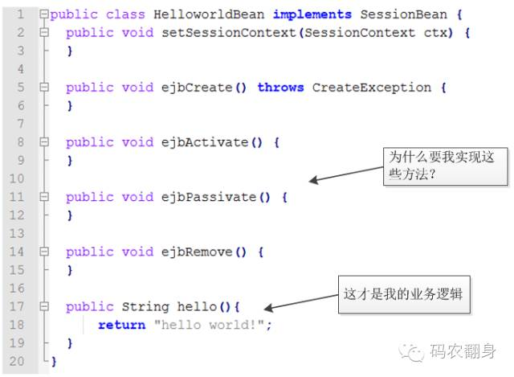

而POJO一个bean是这样的：
```java
public class HelloworldBean{
    public String hello(){
        return "hello world"
    }
}
```
Spring 框架顺应了POJO的潮流，提供了一个spring 的容器来管理这些POJO, 好玩的是也叫做bean 。

对于一个Bean 来说，如果你依赖别的Bean , 只需要声明即可，spring 容器负责把依赖的bean 给“注入进去“，起初大家称之为控制反转(IoC)

后来 Martin flower 给这种方式起来个更好的名字，叫“依赖注入”。

如果一个Bean 需要一些像事务，日志，安全这样的通用的服务，也是只需要声明即可，spring 容器在运行时能够动态的“织入”这些服务，这叫AOP。 

---
## HashMap的源码，实现原理，JDK8中对HashMap做了怎样的优化
### 1、HashMap的源码，实现原理，JDK8中对HashMap做了怎样的优化？
在JDK1.6，JDK1.7中，HashMap采用位桶+链表实现，即使用链表处理冲突，同一hash值的链表都存储在一个链表里。但是当位于一个桶中的元素较多，即hash值相等的元素较多时，通过key值依次查找的效率较低。**而JDK1.8中，HashMap采用位桶+链表+红黑树实现**，当链表长度超过阈值（8）时，将链表转换为红黑树，这样大大减少了查找时间。

简单说下HashMap的实现原理：

首先有一个每个元素都是链表（可能表述不准确）的数组，当添加一个元素（key-value）时，就首先计算元素key的hash值，以此确定插入数组中的位置，但是可能存在同一hash值的元素已经被放在数组同一位置了，这时就添加到同一hash值的元素的后面，他们在数组的同一位置，但是形成了链表，同一各链表上的Hash值是相同的，所以说数组存放的是链表。而当链表长度太长时，链表就转换为红黑树，这样大大提高了查找的效率。

当链表数组的容量超过初始容量的0.75时，再散列将链表数组扩大2倍，把原链表数组的搬移到新的数组中

即HashMap的原理图是：
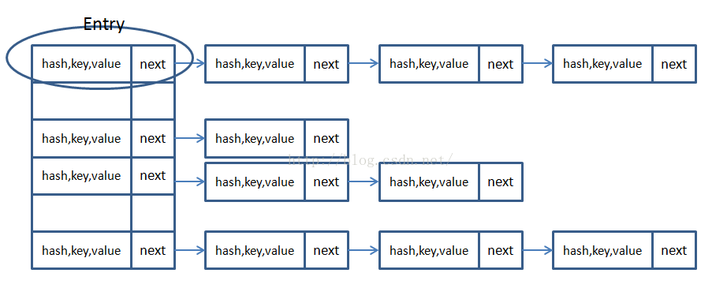


### 一，JDK1.8中的涉及到的数据结构

#### 1. 位桶数组

```java
transient Node<k,v>[] table;//存储（位桶）的数组</k,v>  
```
#### 2. 数组元素Node<K,V>实现了Entry接口
```java
//Node是单向链表，它实现了Map.Entry接口  
static class Node<k,v> implements Map.Entry<k,v> {  
    final int hash;  
    final K key;  
    V value;  
    Node<k,v> next;  
    //构造函数Hash值 键 值 下一个节点  
    Node(int hash, K key, V value, Node<k,v> next) {  
        this.hash = hash;  
        this.key = key;  
        this.value = value;  
        this.next = next;  
    }  
   
    public final K getKey()        { return key; }  
    public final V getValue()      { return value; }  
    public final String toString() { return key + = + value; }  
   
    public final int hashCode() {  
        return Objects.hashCode(key) ^ Objects.hashCode(value);  
    }  
   
    public final V setValue(V newValue) {  
        V oldValue = value;  
        value = newValue;  
        return oldValue;  
    }  
    //判断两个node是否相等,若key和value都相等，返回true。可以与自身比较为true  
    public final boolean equals(Object o) {  
        if (o == this)  
            return true;  
        if (o instanceof Map.Entry) {  
            Map.Entry<!--?,?--> e = (Map.Entry<!--?,?-->)o;  
            if (Objects.equals(key, e.getKey()) &&  
                Objects.equals(value, e.getValue()))  
                return true;  
        }  
        return false;  
    }  
```
    
#### 3. 红黑树
```java
//红黑树  
static final class TreeNode<k,v> extends LinkedHashMap.Entry<k,v> {  
    TreeNode<k,v> parent;  // 父节点  
    TreeNode<k,v> left; //左子树  
    TreeNode<k,v> right;//右子树  
    TreeNode<k,v> prev;    // needed to unlink next upon deletion  
    boolean red;    //颜色属性  
    TreeNode(int hash, K key, V val, Node<k,v> next) {  
        super(hash, key, val, next);  
    }  
   
    //返回当前节点的根节点  
    final TreeNode<k,v> root() {  
        for (TreeNode<k,v> r = this, p;;) {  
            if ((p = r.parent) == null)  
                return r;  
            r = p;  
        }  
    }  
```
    
### 二，源码中的数据域

加载因子（默认0.75）：为什么需要使用加载因子，为什么需要扩容呢？因为如果填充比很大，说明利用的空间很多，如果一直不进行扩容的话，链表就会越来越长，这样查找的效率很低，因为链表的长度很大（当然最新版本使用了红黑树后会改进很多），扩容之后，将原来链表数组的**每一个链表分成奇偶两个子链表**分别挂在新链表数组的散列位置，这样就减少了每个链表的长度，增加查找效率

HashMap本来是以空间换时间，所以填充比没必要太大。但是填充比太小又会导致空间浪费。如果关注内存，填充比可以稍大，如果主要关注查找性能，填充比可以稍小。

```java
public class HashMap<k,v> extends AbstractMap<k,v> implements Map<k,v>, Cloneable, Serializable {  
    private static final long serialVersionUID = 362498820763181265L;  
    static final int DEFAULT_INITIAL_CAPACITY = 1 << 4; // aka 16  
    static final int MAXIMUM_CAPACITY = 1 << 30;//最大容量  
    static final float DEFAULT_LOAD_FACTOR = 0.75f;//填充比  
    //当add一个元素到某个位桶，其链表长度达到8时将链表转换为红黑树  
    static final int TREEIFY_THRESHOLD = 8;  
    static final int UNTREEIFY_THRESHOLD = 6;  
    static final int MIN_TREEIFY_CAPACITY = 64;  
    transient Node<k,v>[] table;//存储元素的数组  
    transient Set<map.entry<k,v>> entrySet;  
    transient int size;//存放元素的个数  
    transient int modCount;//被修改的次数fast-fail机制  
    int threshold;//临界值 当实际大小(容量*填充比)超过临界值时，会进行扩容   
    final float loadFactor;//填充比（......后面略）  
```
    
### 三，HashMap的构造函数
HashMap的构造方法有4种，主要涉及到的参数有，指定初始容量，指定填充比和用来初始化的Map

```java
//构造函数1  
public HashMap(int initialCapacity, float loadFactor) {  
    //指定的初始容量非负  
    if (initialCapacity < 0)  
        throw new IllegalArgumentException(Illegal initial capacity:  +  
                                           initialCapacity);  
    //如果指定的初始容量大于最大容量,置为最大容量  
    if (initialCapacity > MAXIMUM_CAPACITY)  
        initialCapacity = MAXIMUM_CAPACITY;  
    //填充比为正  
    if (loadFactor <= 0 || Float.isNaN(loadFactor))  
        throw new IllegalArgumentException(Illegal load factor:  +  
                                           loadFactor);  
    this.loadFactor = loadFactor;  
    this.threshold = tableSizeFor(initialCapacity);//新的扩容临界值  
}  
   
//构造函数2  
public HashMap(int initialCapacity) {  
    this(initialCapacity, DEFAULT_LOAD_FACTOR);  
}  
   
//构造函数3  
public HashMap() {  
    this.loadFactor = DEFAULT_LOAD_FACTOR; // all other fields defaulted  
}  
   
//构造函数4用m的元素初始化散列映射  
public HashMap(Map<!--? extends K, ? extends V--> m) {  
    this.loadFactor = DEFAULT_LOAD_FACTOR;  
    putMapEntries(m, false);  
}  
```

### 四，HashMap的存取机制
#### 1，HashMap如何getValue值，看源码

```java
public V get(Object key) {  
        Node<K,V> e;  
        return (e = getNode(hash(key), key)) == null ? null : e.value;  
    }  
      /** 
     * Implements Map.get and related methods 
     * 
     * @param hash hash for key 
     * @param key the key 
     * @return the node, or null if none 
     */  
    final Node<K,V> getNode(int hash, Object key) {  
        Node<K,V>[] tab;//Entry对象数组  
    Node<K,V> first,e; //在tab数组中经过散列的第一个位置  
    int n;  
    K k;  
    /*找到插入的第一个Node，方法是hash值和n-1相与，tab[(n - 1) & hash]*/  
    //也就是说在一条链上的hash值相同的  
        if ((tab = table) != null && (n = tab.length) > 0 &&(first = tab[(n - 1) & hash]) != null) {  
    /*检查第一个Node是不是要找的Node*/  
            if (first.hash == hash && // always check first node  
                ((k = first.key) == key || (key != null && key.equals(k))))//判断条件是hash值要相同，key值要相同  
                return first;  
      /*检查first后面的node*/  
            if ((e = first.next) != null) {  
                if (first instanceof TreeNode)  
                    return ((TreeNode<K,V>)first).getTreeNode(hash, key);  
                /*遍历后面的链表，找到key值和hash值都相同的Node*/  
                do {  
                    if (e.hash == hash &&  
                        ((k = e.key) == key || (key != null && key.equals(k))))  
                        return e;  
                } while ((e = e.next) != null);  
            }  
        }  
        return null;  
    }  
```
    
get(key)方法时获取key的hash值，计算hash&(n-1)得到在链表数组中的位置first=tab[hash&(n-1)],先判断first的key是否与参数key相等，不等就遍历后面的链表找到相同的key值返回对应的Value值即可
#### 2，HashMap如何put(key，value);看源码

```java
public V put(K key, V value) {  
        return putVal(hash(key), key, value, false, true);  
    }  
     /** 
     * Implements Map.put and related methods 
     * 
     * @param hash hash for key 
     * @param key the key 
     * @param value the value to put 
     * @param onlyIfAbsent if true, don't change existing value 
     * @param evict if false, the table is in creation mode. 
     * @return previous value, or null if none 
     */  
final V putVal(int hash, K key, V value, boolean onlyIfAbsent,  
                   boolean evict) {  
        Node<K,V>[] tab;   
    Node<K,V> p;   
    int n, i;  
        if ((tab = table) == null || (n = tab.length) == 0)  
            n = (tab = resize()).length;  
    /*如果table的在（n-1）&hash的值是空，就新建一个节点插入在该位置*/  
        if ((p = tab[i = (n - 1) & hash]) == null)  
            tab[i] = newNode(hash, key, value, null);  
    /*表示有冲突,开始处理冲突*/  
        else {  
            Node<K,V> e;   
        K k;  
    /*检查第一个Node，p是不是要找的值*/  
            if (p.hash == hash &&((k = p.key) == key || (key != null && key.equals(k))))  
                e = p;  
            else if (p instanceof TreeNode)  
                e = ((TreeNode<K,V>)p).putTreeVal(this, tab, hash, key, value);  
            else {  
                for (int binCount = 0; ; ++binCount) {  
        /*指针为空就挂在后面*/  
                    if ((e = p.next) == null) {  
                        p.next = newNode(hash, key, value, null);  
               //如果冲突的节点数已经达到8个，看是否需要改变冲突节点的存储结构，　　　　　　　　　　　　　  
　　　　　　　　　　　　//treeifyBin首先判断当前hashMap的长度，如果不足64，只进行  
                        //resize，扩容table，如果达到64，那么将冲突的存储结构为红黑树  
                        if (binCount >= TREEIFY_THRESHOLD - 1) // -1 for 1st  
                            treeifyBin(tab, hash);  
                        break;  
                    }  
        /*如果有相同的key值就结束遍历*/  
                    if (e.hash == hash &&((k = e.key) == key || (key != null && key.equals(k))))  
                        break;  
                    p = e;  
                }  
            }  
    /*就是链表上有相同的key值*/  
            if (e != null) { // existing mapping for key，就是key的Value存在  
                V oldValue = e.value;  
                if (!onlyIfAbsent || oldValue == null)  
                    e.value = value;  
                afterNodeAccess(e);  
                return oldValue;//返回存在的Value值  
            }  
        }  
        ++modCount;  
     /*如果当前大小大于门限，门限原本是初始容量*0.75*/  
        if (++size > threshold)  
            resize();//扩容两倍  
        afterNodeInsertion(evict);  
        return null;  
    }  
```
下面简单说下添加键值对put(key,value)的过程：
1，判断键值对数组tab[]是否为空或为null，否则以默认大小resize()；
2，根据键值key计算hash值得到插入的数组索引i，如果tab[i]==null，直接新建节点添加，否则转入3
3，判断当前数组中处理hash冲突的方式为链表还是红黑树(check第一个节点类型即可),分别处理
### 五，HasMap的扩容机制resize();

构造hash表时，如果不指明初始大小，默认大小为16（即Node数组大小16），如果Node[]数组中的元素达到（填充比*Node.length）重新调整HashMap大小 变为原来2倍大小,扩容很耗时

```java
 /** 
    * Initializes or doubles table size.  If null, allocates in 
    * accord with initial capacity target held in field threshold. 
    * Otherwise, because we are using power-of-two expansion, the 
    * elements from each bin must either stay at same index, or move 
    * with a power of two offset in the new table. 
    * 
    * @return the table 
    */  
   final Node<K,V>[] resize() {  
       Node<K,V>[] oldTab = table;  
       int oldCap = (oldTab == null) ? 0 : oldTab.length;  
       int oldThr = threshold;  
       int newCap, newThr = 0;  
      
/*如果旧表的长度不是空*/  
       if (oldCap > 0) {  
           if (oldCap >= MAXIMUM_CAPACITY) {  
               threshold = Integer.MAX_VALUE;  
               return oldTab;  
           }  
/*把新表的长度设置为旧表长度的两倍，newCap=2*oldCap*/  
           else if ((newCap = oldCap << 1) < MAXIMUM_CAPACITY &&  
                    oldCap >= DEFAULT_INITIAL_CAPACITY)  
      /*把新表的门限设置为旧表门限的两倍，newThr=oldThr*2*/  
               newThr = oldThr << 1; // double threshold  
       }  
    /*如果旧表的长度的是0，就是说第一次初始化表*/  
       else if (oldThr > 0) // initial capacity was placed in threshold  
           newCap = oldThr;  
       else {               // zero initial threshold signifies using defaults  
           newCap = DEFAULT_INITIAL_CAPACITY;  
           newThr = (int)(DEFAULT_LOAD_FACTOR * DEFAULT_INITIAL_CAPACITY);  
       }  
      
      
      
       if (newThr == 0) {  
           float ft = (float)newCap * loadFactor;//新表长度乘以加载因子  
           newThr = (newCap < MAXIMUM_CAPACITY && ft < (float)MAXIMUM_CAPACITY ?  
                     (int)ft : Integer.MAX_VALUE);  
       }  
       threshold = newThr;  
       @SuppressWarnings({"rawtypes","unchecked"})  
/*下面开始构造新表，初始化表中的数据*/  
       Node<K,V>[] newTab = (Node<K,V>[])new Node[newCap];  
       table = newTab;//把新表赋值给table  
       if (oldTab != null) {//原表不是空要把原表中数据移动到新表中      
           /*遍历原来的旧表*/        
           for (int j = 0; j < oldCap; ++j) {  
               Node<K,V> e;  
               if ((e = oldTab[j]) != null) {  
                   oldTab[j] = null;  
                   if (e.next == null)//说明这个node没有链表直接放在新表的e.hash & (newCap - 1)位置  
                       newTab[e.hash & (newCap - 1)] = e;  
                   else if (e instanceof TreeNode)  
                       ((TreeNode<K,V>)e).split(this, newTab, j, oldCap);  
/*如果e后边有链表,到这里表示e后面带着个单链表，需要遍历单链表，将每个结点重*/  
                   else { // preserve order保证顺序  
                ////新计算在新表的位置，并进行搬运  
                       Node<K,V> loHead = null, loTail = null;  
                       Node<K,V> hiHead = null, hiTail = null;  
                       Node<K,V> next;  
                      
                       do {  
                           next = e.next;//记录下一个结点  
          //新表是旧表的两倍容量，实例上就把单链表拆分为两队，  
　　　　　　　　　　　　　//e.hash&oldCap为偶数一队，e.hash&oldCap为奇数一对  
                           if ((e.hash & oldCap) == 0) {  
                               if (loTail == null)  
                                   loHead = e;  
                               else  
                                   loTail.next = e;  
                               loTail = e;  
                           }  
                           else {  
                               if (hiTail == null)  
                                   hiHead = e;  
                               else  
                                   hiTail.next = e;  
                               hiTail = e;  
                           }  
                       } while ((e = next) != null);  
                      
                       if (loTail != null) {//lo队不为null，放在新表原位置  
                           loTail.next = null;  
                           newTab[j] = loHead;  
                       }  
                       if (hiTail != null) {//hi队不为null，放在新表j+oldCap位置  
                           hiTail.next = null;  
                           newTab[j + oldCap] = hiHead;  
                       }  
                   }  
               }  
           }  
       }  
       return newTab;  
   }  
```
### 六，JDK1.8使用红黑树的改进
在java jdk8中对HashMap的源码进行了优化，在jdk7中，HashMap处理“碰撞”的时候，都是采用链表来存储，当碰撞的结点很多时，查询时间是O（n）。
在jdk8中，HashMap处理“碰撞”增加了红黑树这种数据结构，当碰撞结点较少时，采用链表存储，当较大时（>8个），采用红黑树（特点是查询时间是O（logn））存储（有一个阀值控制，大于阀值(8个)，将链表存储转换成红黑树存储）


问题分析：

你可能还知道哈希碰撞会对hashMap的性能带来灾难性的影响。如果多个hashCode()的值落到同一个桶内的时候，这些值是存储到一个链表中的。最坏的情况下，所有的key都映射到同一个桶中，这样hashmap就退化成了一个链表——查找时间从O(1)到O(n)。

随着HashMap的大小的增长，get()方法的开销也越来越大。由于所有的记录都在同一个桶里的超长链表内，平均查询一条记录就需要遍历一半的列表。

JDK1.8HashMap的红黑树是这样解决的：

如果某个桶中的记录过大的话（当前是TREEIFY_THRESHOLD = 8），HashMap会动态的使用一个专门的treemap实现来替换掉它。这样做的结果会更好，是O(logn)，而不是糟糕的O(n)。

它是如何工作的？前面产生冲突的那些KEY对应的记录只是简单的追加到一个链表后面，这些记录只能通过遍历来进行查找。但是超过这个阈值后HashMap开始将列表升级成一个二叉树，使用哈希值作为树的分支变量，如果两个哈希值不等，但指向同一个桶的话，较大的那个会插入到右子树里。如果哈希值相等，HashMap希望key值最好是实现了Comparable接口的，这样它可以按照顺序来进行插入。这对HashMap的key来说并不是必须的，不过如果实现了当然最好。如果没有实现这个接口，在出现严重的哈希碰撞的时候，你就并别指望能获得性能提升了。

### 为什么容量的2的倍数？
注意put方法里的这部分代码
```java
int n, i;  
        if ((tab = table) == null || (n = tab.length) == 0)  
            n = (tab = resize()).length;  
    /*如果table的在（n-1）&hash的值是空，就新建一个节点插入在该位置*/  
        if ((p = tab[i = (n - 1) & hash]) == null)  
            tab[i] = newNode(hash, key, value, null);  
```
tab[i]是新的数组元素的值，而i是通过(n - 1) & hash来计算的，而n的值是tab.length，也就是数组的长度，现在假设分别使用奇数和偶数来做数组长度，当是奇数的时候，n-1是偶数，求与运算是二进制数每位求与的结果，如果是偶数，则后面全是0，此时求与，0和0或者1的与值都是0，而如果是奇数与hash值来求与，则hash值后面几位的原值会保留下来，而不会全变成0，这样就会大大减少索引i相等的机会，也就是减少了把不同的key分到同一个数组索引上的机会
 
---

## HashMap、Hashtable、ConcurrentHashMap的原理与区别
### HashTable

底层数组+链表实现，无论key还是value都不能为null，线程安全，实现线程安全的方式是在修改数据时锁住整个HashTable，效率低，ConcurrentHashMap做了相关优化
初始size为11，扩容：newsize = olesize*2+1
计算index的方法：index = (hash & 0x7FFFFFFF) % tab.length
### HashMap

底层数组+链表实现，可以存储null键和null值，线程不安全
初始size为16，扩容：newsize = oldsize*2，size一定为2的n次幂
扩容针对整个Map，每次扩容时，原来数组中的元素依次重新计算存放位置，并重新插入
插入元素后才判断该不该扩容，有可能无效扩容（插入后如果扩容，如果没有再次插入，就会产生无效扩容）
当Map中元素总数超过Entry数组的75%，触发扩容操作，为了减少链表长度，元素分配更均匀
计算index方法：index = hash & (tab.length – 1)
 

HashMap的初始值还要考虑加载因子:

 哈希冲突：若干Key的哈希值按数组大小取模后，如果落在同一个数组下标上，将组成一条Entry链，对Key的查找需要遍历Entry链上的每个元素执行equals()比较。
加载因子：为了降低哈希冲突的概率，默认当HashMap中的键值对达到数组大小的75%时，即会触发扩容。因此，如果预估容量是100，即需要设定100/0.75＝134的数组大小。
空间换时间：如果希望加快Key查找的时间，还可以进一步降低加载因子，加大初始大小，以降低哈希冲突的概率。
HashMap和Hashtable都是用hash算法来决定其元素的存储，因此HashMap和Hashtable的hash表包含如下属性：

容量（capacity）：hash表中桶的数量
初始化容量（initial capacity）：创建hash表时桶的数量，HashMap允许在构造器中指定初始化容量
尺寸（size）：当前hash表中记录的数量
负载因子（load factor）：负载因子等于“size/capacity”。负载因子为0，表示空的hash表，0.5表示半满的散列表，依此类推。轻负载的散列表具有冲突少、适宜插入与查询的特点（但是使用Iterator迭代元素时比较慢）
除此之外，hash表里还有一个“负载极限”，“负载极限”是一个0～1的数值，“负载极限”决定了hash表的最大填满程度。当hash表中的负载因子达到指定的“负载极限”时，hash表会自动成倍地增加容量（桶的数量），并将原有的对象重新分配，放入新的桶内，这称为rehashing。

HashMap和Hashtable的构造器允许指定一个负载极限，HashMap和Hashtable默认的“负载极限”为0.75，这表明当该hash表的3/4已经被填满时，hash表会发生rehashing。

“负载极限”的默认值（0.75）是时间和空间成本上的一种折中：

较高的“负载极限”可以降低hash表所占用的内存空间，但会增加查询数据的时间开销，而查询是最频繁的操作（HashMap的get()与put()方法都要用到查询）
较低的“负载极限”会提高查询数据的性能，但会增加hash表所占用的内存开销
程序猿可以根据实际情况来调整“负载极限”值。

### ConcurrentHashMap

底层采用**分段**的数组+链表实现，线程安全
通过把整个Map分为N个Segment，可以提供相同的线程安全，但是效率提升N倍，默认提升16倍。(读操作不加锁，由于HashEntry的value变量是 **volatile**的，也能保证读取到最新的值。)
Hashtable的synchronized是针对整张Hash表的，即每次锁住整张表让线程独占，ConcurrentHashMap允许多个修改操作并发进行，其关键在于使用了锁分离技术
有些方法需要跨段，比如size()和containsValue()，它们可能需要锁定整个表而而不仅仅是某个段，这需要按顺序锁定所有段，操作完毕后，又按顺序释放所有段的锁
扩容：段内扩容（段内元素超过该段对应Entry数组长度的75%触发扩容，不会对整个Map进行扩容），插入前检测需不需要扩容，有效避免无效扩容
 

### 总结
Hashtable和HashMap都实现了Map接口，但是Hashtable的实现是基于Dictionary抽象类的。Java5提供了ConcurrentHashMap，它是HashTable的替代，比HashTable的扩展性更好。

HashMap基于哈希思想，实现对数据的读写。当我们将键值对传递给put()方法时，它调用键对象的hashCode()方法来计算hashcode，然后找到bucket位置来存储值对象。当获取对象时，通过键对象的equals()方法找到正确的键值对，然后返回值对象。HashMap使用链表来解决碰撞问题，当发生碰撞时，对象将会储存在链表的下一个节点中。HashMap在每个链表节点中储存键值对对象。当两个不同的键对象的hashcode相同时，它们会储存在同一个bucket位置的链表中，可通过键对象的equals()方法来找到键值对。如果链表大小超过阈值（TREEIFY_THRESHOLD,8），链表就会被改造为树形结构。

在HashMap中，null可以作为键，这样的键只有一个，但可以有一个或多个键所对应的值为null。当get()方法返回null值时，即可以表示HashMap中没有该key，也可以表示该key所对应的value为null。因此，在HashMap中不能由get()方法来判断HashMap中是否存在某个key，应该用containsKey()方法来判断。而在Hashtable中，无论是key还是value都不能为null。

Hashtable是线程安全的，它的方法是同步的，可以直接用在多线程环境中。而HashMap则不是线程安全的，在多线程环境中，需要手动实现同步机制。

Hashtable与HashMap另一个区别是HashMap的迭代器（Iterator）是fail-fast迭代器，而Hashtable的enumerator迭代器不是fail-fast的。所以当有其它线程改变了HashMap的结构（增加或者移除元素），将会抛出ConcurrentModificationException，但迭代器本身的remove()方法移除元素则不会抛出ConcurrentModificationException异常。但这并不是一个一定发生的行为，要看JVM。

先看一下简单的类图：

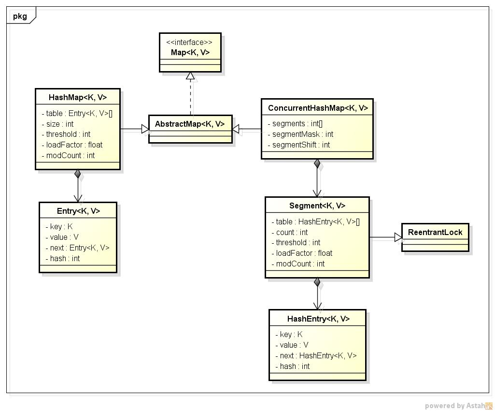


  

从类图中可以看出来在存储结构中ConcurrentHashMap比HashMap多出了一个类Segment，而Segment是一个可重入锁。

ConcurrentHashMap是使用了锁分段技术来保证线程安全的。

锁分段技术：首先将数据分成一段一段的存储，然后给每一段数据配一把锁，当一个线程占用锁访问其中一个段数据的时候，其他段的数据也能被其他线程访问。 

ConcurrentHashMap提供了与Hashtable和SynchronizedMap不同的锁机制。Hashtable中采用的锁机制是一次锁住整个hash表，从而在同一时刻只能由一个线程对其进行操作；而ConcurrentHashMap中则是一次锁住一个桶。

ConcurrentHashMap默认将hash表分为16个桶，诸如get、put、remove等常用操作只锁住当前需要用到的桶。这样，原来只能一个线程进入，现在却能同时有16个写线程执行，并发性能的提升是显而易见的。

---

## 引用传递和值传递的区别
首先对传值和传引用要有个基本的概念

传值：传递的是值的副本。方法中对副本的修改，不会影响到调用方。
传引用：传递的是引用的副本，共用一个内存，会影响到调用方。此时，形参和实参指向同一个内存地址。对引用副本本身（对象地址）的修改，如设置为null，重新指向其他对象，不会影响到调用方。
直接上代码，更好的理解两者的区别。首先看传基本数据类型，如int、long等。

```java
// 基本数据类型
public class ParamChangeValue {    
    public static void main(String[] args) {        
        int s = 1;        
        System.out.println("args = [" + s + "]");        
        change(s);        
        System.out.println("args = [" + s + "]");  
    }    
    private static void change(int i){ 
        i = i* 5;    
    }
}
```

输出：
> args = [1]
args = [1]

从输出的的结果中可以看到原本的s并没有被修改，即传值传递的是值的副本，不会影响到本身。

再来看传对象。
```java
// 对象
public class ObjectChangeValue {    
    public static class Score{        
        private int value; 
        
        public int getValue()  {            
            return value;  
        }  
        
        public void setValue(int value) {
            this.value = value;     
        }    
    } 
    
    public static void main(String[] args) {       
        Score score = new Score();        
        score.setValue(1);        
        System.out.println("args = [" + score.getValue() + "]");                       
        change(score);        
        System.out.println("after args = [" + score.getValue() + "]");   
    }    
   
    private static void change(Score score){  
        score.setValue(2);    
    }
}
```
输出：
> args = [1]
after args = [2]

从结果中我们可以看到score实例的value值被修改了，因为传引用后指向的是同一个地址，修改的实际上也就是这个地址上的值，另外要注意一点的是如果对象被重新创建或赋值为null，即new会重新指向其他对象，不影响其原对象的值。

第三部分：传String、Integer等immutable类型。
```java
// String、Integer、Long等
public class StringChangeValue {    
    public static void main(String[] args) {        
        String s = "test1";        
        System.out.println("args = [" + s + "]");        
        change(s);                
        System.out.println("args = [" + s + "]");    
    } 
    
    private static void change(String i){       
        i = i + " test value";    
    }
}
```
输出：
>args = [test1]
args = [test1]

只要知道String、Integer类是final类型的就明白输出的结果为什么是这样的。

## 按位运算和逻辑运算的区别
接位与和逻辑与（符号为＆＆）运算都可以作用于条件表达 式，但是后者有**短路**功能
如下demo：
```java
boolean a = true;
boolean b = true;
boolean c = (a = (1 == 2)) && (b = (1 == 2));
System.out.println(a);
System.out.println(b);
System.out.println(c);
```
打印结果为false true false
因为a = (1 == 2)为false，此处短路了，后面的b = (1 == 2)不会执行
而如果改成按位与运算
`boolean c = (a = (1 == 2)) && (b = (1 == 2))`
则打印结果为三个false，因为按位运算不会短路


### 总结
基本类型（byte,short,int,long,double,float,char,boolean）为传值；对象类型（Object，数组，容器）为传引用；String、Integer、Double等immutable类型因为类的变量设为**final**属性，无法被修改，只能重新赋值或生成对象。当Integer作为方法参数传递时，**对其赋值会导致原有的引用被指向了方法内的栈地址，失去原有的的地址指向**，所以对赋值后的Integer做任何操作都不会影响原有值。

---

# 泛型
## 泛型的由来
泛型是JDK5引入的，在之前的版本中没有泛型的概念，如集合类的定义可以这样：

```java
//注意此处没有指定集合里元素类型，JDK5之前确实是这样的
List arrayList = new ArrayList();
//list可以加入不同的类型
arrayList.add("aaaa");
arrayList.add(100);

for(int i = 0; i< arrayList.size();i++){
    //此处会报运行时异常java.lang.ClassCastException: java.lang.Integer cannot be cast to java.lang.String
    String item = (String)arrayList.get(i);
    Log.d("泛型测试","item = " + item);
}
```

所以在JDK5之前，需要记住集合的元素的类型，取出时做类型转换，**即使集合里元素类型是一样的，当你方法返回一个集合类型时，别人也不知道你集合里的元素是啥类型的**，因为语法里就没有类型的展现。这就导致**增加使用者的责任，编译器也无法帮忙，在运行时才会抛出Class Cast 异常**。

JDK5加入泛型后，此类问题就解决了，如下图：

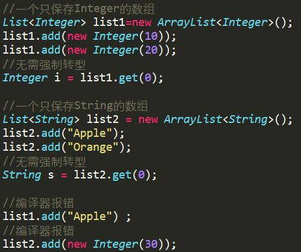

## 泛型的实现
在C++里，每次你去实例化一个泛型/模板类都会生成一个新的类，例如模板类是List ，然后你用int ,double,string, Employee 分别去实例化，那编译的时候，就会生成四个新类出来，例如List_int和List_double，List_string, List_Employee。这样一来得生成很多新的类出来，系统大了会膨胀得要爆炸了。
在java中，不是使用的膨胀法，相反，我们用擦除法。

简单来说就是编译时一个参数化的类型经过擦除后会去除参数，例如`ArrayList<T>` 会被擦除为`ArrayList`，但那我传入的String，Integer等都消失了吗？
不会的，会把他们变成Object ,  例如ArrayList<Integer>其实被擦除成了原始的ArrayList ：

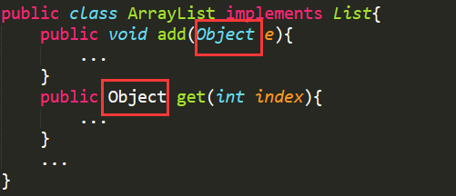

但又有另一个问题，我们通过泛型，本来是不想写那个强制转型转换的，可以直接写成这样 `Integer i = list1.get(0);`   现在类型被擦除，都变成Object了，怎么处理啊？ 

其实很简单，java在编译的时候做了点手脚，加了自动的转型嘛： `Integer i = （Integer）list1.get(0);`

## 泛型方法
通过上面的例子，泛型类的使用和java的实现过程已经明确了，那泛型方法怎么用呢？
例如下面：

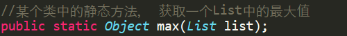

其实很简单，把那个<T>移到方法上去


此时又会出现另一个问题，这个静态的函数是求最大值的，就是说需要对List中的元素比较大小，如果传入的T没有实现Comparable接口，就没法比较大小了！

此时就需要做一个类型的限制，让传入类型T必须是Comparable的子类才行，要不然编译器就报错，使用extends关键字实现，如下图：

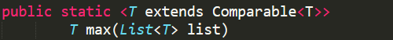

除了extends之外，Java泛型还支持super,   实际上为了更加灵活，上面的Comparable<T> 应该写成Comparable <? super T>

## 泛型和继承
先看下面两张图：

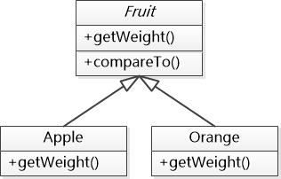

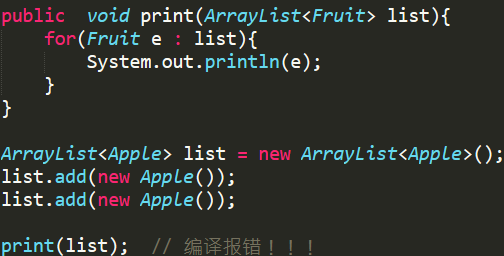

这是怎么回事，print函数能接受的参数不是ArrayList<Fruit>吗？ 当传递一个ArrayList<Apple>为什么出错呢，难道Java的多态不管用了吗？

其实是因为这个Apple 虽然是Fruit的子类，但是 ArrayList<Apple>却不是 ArrayList<Fruit>的子类，实际上他们俩之间是没有关系的，不能做转型操作，所以调用print的时候就报错了。
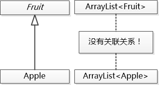

为什么不能让ArrayList<Apple>转成ArrayList<Fruit>呢？

如果可以这么做的话，那么不但可以向这个list中加入Apple, 还可以加入Orange, 泛型就被破坏了

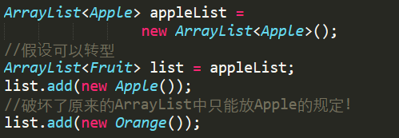

此时就需要用通配符的方式来解决，把函数的输入参数改为改成下面这样：

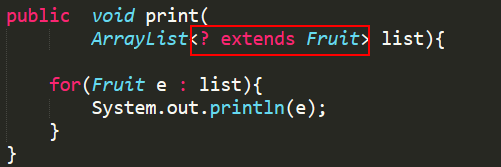

也就是说，传进来的参数，只要是Fruit或者Fruit的子类都可以，这样依赖就可以接收ArrayList<Fruit> 和 ArrayList<Apple> ,ArrayList<Orange> 这样的参数了！

[引自码农翻身Java帝国之泛型](https://mp.weixin.qq.com/s?__biz=MzAxOTc0NzExNg==&mid=2665514015&idx=1&sn=12409f705c6d266e4cd062e78ce50be0&chksm=80d67c5cb7a1f54a68ed83580b63b4acded0df525bb046166db2c00623a6bba0de3c5ad71884&scene=21#wechat_redirect)

---
# 动态代理
## 为什么要用动态代理
在某些函数调用前后加上日志记录
给某些函数加上事务的支持
给某些函数加上权限控制
......

这些需求挺通用的，如果在每个函数中都实现一遍，那重复代码就太多了。 更要命的是有时候代码是别人写的，你只有class 文件，怎么修改？ 怎么加上这些功能？

所以大家就想了一个损招，他们想在XML文件或者什么地方声明一下，比如对于添加日志的需求吧，声明的大意如下：

对于com.coderising这个package下所有以add开头的方法，在执行之前都要调用Logger.startLog()方法，在执行之后都要调用Logger.endLog()方法。

对于增加事务支持的需求，声明的大意如下：

对于所有以DAO结尾的类，所有的方法执行之前都要调用TransactionManager.begin()，执行之后都要调用TransactionManager.commit(), 如果抛出异常的话调用TransactionManager.rollback()。

这就是**AOP**了，能够读取这个XML中的声明，并且能够找到那些需要插入日志的类和方法，接下来就需要修改这些方法了。 但是Java不允许修改一个已经被加载或者正在运行的类，这咋整呢！
## java官方实现
虽然不能修改现有的类，但是可以在运行时动态的创建新的类啊，比如有个类HelloWorld:

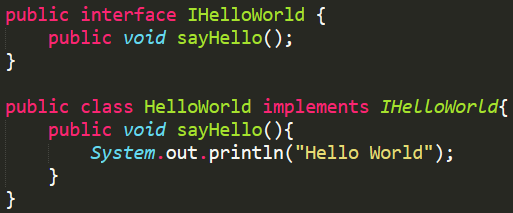

现在的问题是要在sayHello()方法中调用Logger.startLog(), Logger.endLog()添加上日志，但是这个sayHello()方法又不能修改了！

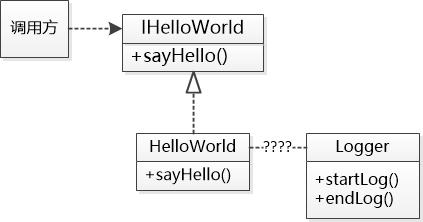

所以可以动态地生成一个新类，让这个类作为HelloWorld的代理去做事情：加上日志功能，如下图，这个HelloWorld代理也实现了IHelloWorld接口。 所以在调用方看来，都是IHelloWorld接口，并不会意识到其实底层其实已经沧海沧田了。”

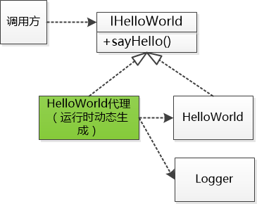

现在能明白这个绿色的HelloWorld代理，但是这个类怎么可能知道把Logger的方法加到什么地方呢？这就是动态代理关键的地方了。

需要写一个类来告诉jvm具体把Logger的代码加到什么地方，这个类必须实现java定义的InvocationHandler接口，该接口中有个叫做invoke的方法就是写扩展代码的地方。  比如这个LoggerHandler： 

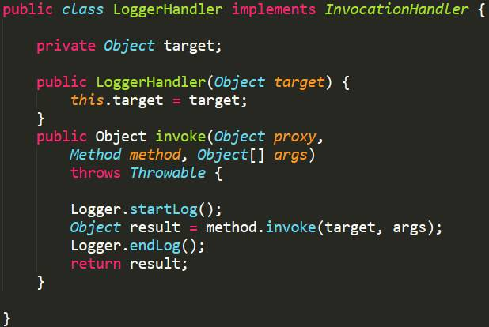

无非就是在调用真正的方法之前先调用Logger.startLog(), 在调用之后在调用Logger.end()，这就是对方法进行拦截了。

LoggerHandler 充当了一个中间层，jvm自动化生成的类$HelloWorld100会调用它，把sayHello这样的方法调用传递给他 （上图中的method变量），于是sayHello()方法就被添加上了Logger的startLog()和endLog()方法。

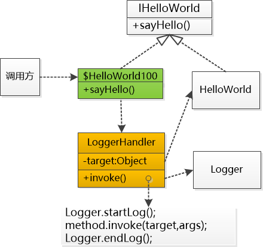

这个Handler不仅仅能作用于IHelloWorld 这个接口和 HelloWorld这个类，那个入参target 是个Object, 这就意味着任何类的实例都可以，当然这些类必须得实现接口。使用LoggerHandler的时候是这样的：

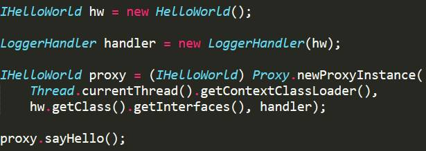

输出：
Start Logging
Hello World
End Logging

如果想对另外一个接口ICalculator和类Calcualtor做代理，也可以复用这个LoggerHandler的类：


折腾了变天，原来魔法是在**Proxy.newProxyInstance(....)**  这里，就是动态地生成了一个类，这个类对开发人员来说是动态生成的，也是看不到源码的。

在运行时，在内存中生成了一个新的类，这个类在调用sayHello() 或者add()方法的时候，其实调用的是LoggerHanlder的invoke 方法，而那个invoke就会拦截真正的方法调用，添加日志功能了！ 

## CGLib的动态代理实现
Code Generation Library简称CGLib，体现了技术的本质，就是一个代码生成的工具。

具体实现参考码农翻身的这片文章：
[从兄弟到父子：动态代理在民间是怎么玩的？](https://mp.weixin.qq.com/s?__biz=MzAxOTc0NzExNg==&mid=2665513980&idx=1&sn=a7d6145b13270d1768dc416dbc3b3cbd&chksm=80d67bbfb7a1f2a9c01e7fe1eb2b3319ecc0d210a88a1decd1c4d4e1d32e50327c60fa5b45c8&scene=21#wechat_redirect)

CGLib和官方的动态代理的区别是官方动态生成的类和被代理类是实现了同一个接口，即兄弟关系，而CGLib动态生成的类是被代理类的子类，是父子关系。另外CGlib采用的是ASM来实现的对字节码的操作。

## 官方和CGLib动态代理的比较
- Jdk代理生成的代理类只有一个，因而其编译速度是非常快的；而由于被代理的目标类是动态传入代理类中的，Jdk代理的执行效率相对来说低一点，这也是Jdk代理被称为动态代理的原因。

- Cglib代理需要为每个目标类生成相应的子类，因而在实际运行过程中，其可能会生成非常多的子类，过多的子类始终不是太好的，因为这影响了虚拟机编译类的效率；但由于在调用过程中，代理类的方法是已经静态编译生成了的，因而Cglib代理的执行效率相对来说高一些。

## spring AOP动态代理的实现
spring中实现AOPJDK代理和CGLIB代理两种模式都用了

JDK动态代理只针对实现了接口的类生成代理
CGlib代理针对类实现代理，主要是指定的类生成的一个子类，覆盖其中所有的方法，该类的方法不能声明为final
如果目标没有实现接口，则会默认采用cglib代理

可通过配置强制spring使用CGLib
在spring配置文件中加入`<aop:aspectj-autoproxy proxy-target-class="true"/>
`

---
# 注解
## 基础定义
- **注解**有点像加强版的注释，这个“注释”不但有一定的格式，还有特定的含义，这样别的工具就可以读取它来做事情了。

- **元数据**，就是描述数据的数据了，换句话说可以给其他数据提供描述性信息，例如Java类中的某个方法，可以认为是一种数据，如果我的@Override 一旦被用到这个方法上，那就意味着要覆盖父类/接口的方法了，于是我的@Override 就给这个方法提供了额外的信息。但是在源代码中写个@Override 似乎也没什么用处。

    所以这只是元数据,  它给其他数据（如Java方法）提供了信息，但是怎么样利用这些信息那就不归注解管了。
    
    比如@Override ，由编译器来管，当编译这个Java 文件的时候，它就会检查被@Override 修饰的方法是否和父类的方法和参数相同，如果不同，就会报错了。
    
## 注解定义
注解定义语法如下：

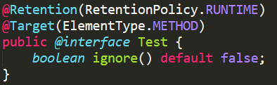


上图定义了一个叫做Test的注解，它有个ignore方法，一会儿再说他的用途了，这个注解是应用在方法上的 `@Target(ElementType.METHOD)`，在运行时起作用`@Retention(RetentionPolicy.RUNTIME)`。

@Target，@Retention 这称为元注解，可以认为是注解的注解。
- @Target表示该注解的应用目标，可以是类、方法、 方法参数等等
- @Retention表示这个注解要保留到什么时候，可以只在源码中，或者class 文件中，或者是运行时。”

## 注解的使用
下图代码展示了自定义注解Test的使用。
自定义的注解和JDK内置的注解都差不多，@Test修饰了方法，表示这个方法可以作为测试用例来运行，@Test(ignore=true)则表示虽然这是个测试方法，但是暂时忽略，不用运行。

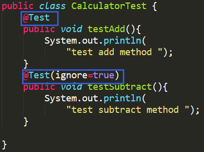


@Test注解的定义和使用，只是定义了行为语义，怎么样实现这个行为呢？  

我们可以在运行时通过反射的方式取出方法的注解，如果这个注解是@Test，并且没有被ignore ，那就可以通过反射去执行这个方法了，是不是很简单？

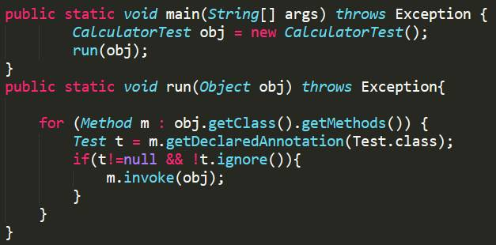

---
# 事务
## 什么是事务
举个通俗的例子你就明白了， 假设A要给B转账100块钱， A的数据库账户要扣掉100块， B的账户要增加100块， 这就涉及到两个操作， 这两个操作要么全部完成，要么一个都不做，只有这样才能保证数据的一致性， 这就是一个事务。事务有4个特性： 原子性(Atomicity) ，一致性(Consistency）, 隔离性（Isolation） , 持久性（Durability) , 简称ACID。

JDBC会把对数据库的操作认为是一个事务， 当然也可以设置成手工的方式， 手工地提交和回滚事务。不管哪种方式，都是非常简单的。
## 两阶段提交 强一致性
### 为什么要有两阶段提交
JDBC事务只是在单个数据库中有用， 如果需要跨数据库怎么办？例如分库了， 比如我的账号存在数据库A,  你的账号在数据库B, 那转账的时候怎么办？ 怎么实现什么ACID ? 此时就需要用到两阶段提交了。
### 两阶段提交流程
**阶段1**： 全局的事务管理器向各个数据库发出准备消息。 各个数据库需要在本地把一切都准备好，执行操作，锁住资源， 记录redo/undo 日志， 但是并不提交， 总而言之，要进入一个时刻准备提交或回滚的状态， 然后向全局事务管理器报告是否准备好了。

**阶段2**： 如果所有的数据库都报告说准备好了， 那全局的事务管理器就下命令： 提交， 这时候各个数据库才真正提交 ， 由于之前已经万事具备，只欠东风，只需要快速完成本地提交即可；
如果有任何一个数据库报告说没准备好， 事务管理器就下命令： 放弃， 这时候各个数据库要执行回滚操作， 并且释放各种在阶段1锁住的资源。

流程图如下：

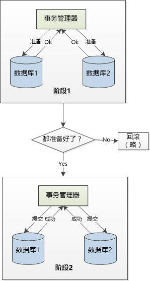

阶段1就是让大家都准备好，阶段2就是迅速提交。
两阶段提交就是**JAT（Java Transaction API）**了
这个JTA规范用起来也比较简单， 只要获得一个UserTransaction 就可以操作了，程序员根本不用关系底层的协议细节：

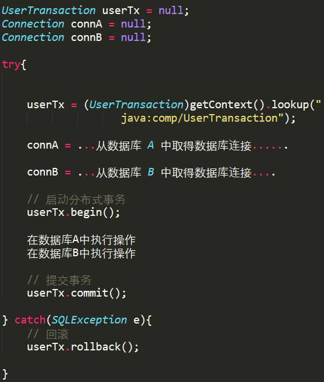
### 两阶段提交的缺点
但是一旦涉及到分布式，事情就不会那么简单，任何地方都有失败的可能。

比如在第二阶段，那个事务管理器要是出了问题怎么办？ 人家各个数据库还在等着你发命令呢？ 你迟迟不发命令，大家都阻塞在那里，不知所措，到底是提交呢？还是不提交呢， 我这里还锁着资源呢， 迟迟不能释放，多耽误事啊 ！　

还是第二阶段，事务管理器发出的提交命令由于网络问题，数据库１收到了，数据库２没收到，这两个数据库就处于不一致状态了， 该怎么处理？

为了让两个数据库保证实时的一致性（强一致性）， 为了达到这个目标，JTA付出的代价太高了。 我们现在不想这么干了。 我们可以忍受一段时间的不一致，只有**最终一致**就行。 比方说A给B转100元， A 中的钱已经扣除， 但是B中不会实时地增加，过段时间能保证增加就行了。
此时就要使用三阶段提交了。

## 两阶段提交的改进：三阶段提交
三阶段提交与二阶段提交的不同是在两阶段提交的准备阶段和提交阶段之间，插入**预提交阶段**，使三阶段提交拥有CanCommit、PreCommit、DoCommit三个阶段。
PreCommit是一个缓冲，保证了在最后提交阶段之前各参与节点的状态是一致的。
### 三阶段提交的缺点
如果进入PreCommit后，事务管理器发出的是取消请求，假设只有一个执行者收到并进行了取消操作，
而其他对于系统状态未知的执行者会继续提交，此时系统状态发生不一致性。

## BASE模型 最终一致性
#####方案1 依赖消息队列
过程如下图：

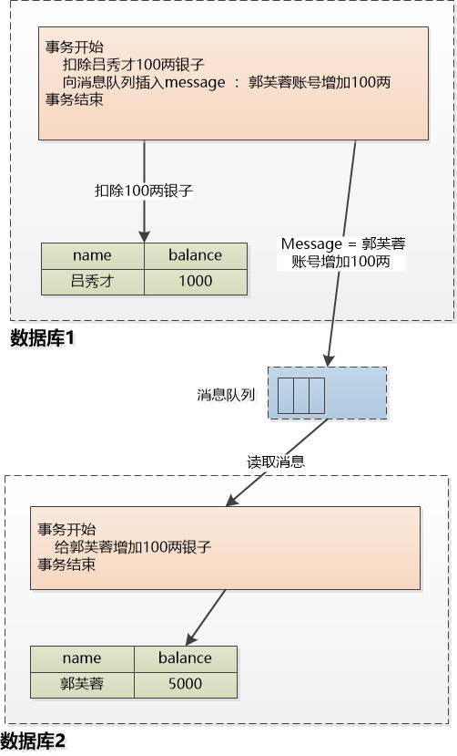

- 优点：对于高并发的场景，转账的时候扣完钱， 向消息队列插入消息，事务就结束了， 根本不用什么两阶段提交， 性能很好
- 缺点：事务需要管理数据库和消息队列，消息队列如果不支持事务的话需要很复杂的逻辑来进行异常处理

### 方案2 依赖事件表
过程如下图：

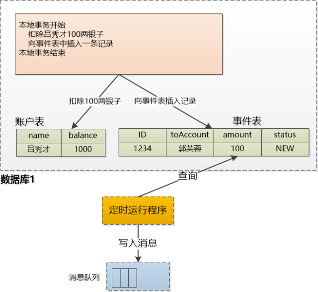

与方案1不同的是添加一个‘事件表’， 转账开始的时候，把吕秀才的100两银子扣除， 同时还向事件表插入一行记录： 需要向郭芙蓉转100两， 由于这两个表是在同一个数据库中，所以直接使用本地事务就行。不用什么分布式事务。

定时任务从事件表中取出记录， 向MQ写入消息， 然后把记录的状态改成‘DONE’， 这样下次就不用再去取去处理了。

但定时运行程序也有问题， 比如说它读了数据，向消息队列写入了消息， 还没来得及把事件表的status 改为 ‘DONE’ 就崩溃了，等到定时运行程序重启以后，岂不再次读取， 再次向MQ写入消息，这样郭芙蓉不就得到了200两银子，整个系统就不一致了。

此时就需要幂等性发挥作用了，定时运行的程序可以出错，可以向消息队列写入多次 ‘给郭芙蓉账号增加100两银子’ 这样的消息， 但是郭芙蓉那边在执行的时候， 肯定也要判断之前是否执行过了， 如果没有的话就增加， 如果执行过了就简单的抛弃这个消息即可。 

此方案是由Dan Pritchet总结的，称之为BASE模型。

---
# NIO
NIO主要有三大核心部分：Channel(通道)，Buffer(缓冲区), Selector。传统IO基于字节流和字符流进行操作，而NIO基于Channel和Buffer(缓冲区)进行操作，数据总是从通道读取到缓冲区中，或者从缓冲区写入到通道中。Selector(选择区)用于监听多个通道的事件（比如：连接打开，数据到达）。因此，单个线程可以监听多个数据通道。

NIO和传统IO（一下简称IO）之间第一个最大的区别是，IO是面向流的，NIO是面向缓冲区的。 Java IO面向流意味着每次从流中读一个或多个字节，直至读取所有字节，它们没有被缓存在任何地方。此外，它不能前后移动流中的数据。如果需要前后移动从流中读取的数据，需要先将它缓存到一个缓冲区。NIO的缓冲导向方法略有不同。数据读取到一个它稍后处理的缓冲区，需要时可在缓冲区中前后移动。这就增加了处理过程中的灵活性。但是，还需要检查是否该缓冲区中包含所有您需要处理的数据。而且，需确保当更多的数据读入缓冲区时，不要覆盖缓冲区里尚未处理的数据。

IO的各种流是阻塞的。这意味着，当一个线程调用read() 或 write()时，该线程被阻塞，直到有一些数据被读取，或数据完全写入。该线程在此期间不能再干任何事情了。 NIO的非阻塞模式，使一个线程从某通道发送请求读取数据，但是它仅能得到目前可用的数据，如果目前没有数据可用时，就什么都不会获取。而不是保持线程阻塞，所以直至数据变得可以读取之前，该线程可以继续做其他的事情。 非阻塞写也是如此。一个线程请求写入一些数据到某通道，但不需要等待它完全写入，这个线程同时可以去做别的事情。 线程通常将非阻塞IO的空闲时间用于在其它通道上执行IO操作，所以一个单独的线程现在可以管理多个输入和输出通道（channel）。

三大组件介绍：
- Channel :  可以和原来的Stream类比， 但是有个关键区别， 那就是通过Channel 读写数据，是非阻塞的， 一个socket 也是Channel 的一种。另外Stream是单向的，譬如：InputStream, OutputStream.而Channel是双向的，既可以用来进行读操作，又可以用来进行写操作。
    NIO中的Channel的主要实现有：
    * FileChannel
    * DatagramChannel
    * SocketChannel
    * ServerSocketChannel
    
    这里看名字就可以猜出个所以然来：分别可以对应文件IO、UDP和TCP（Server和Client）。下面演示的案例基本上就是围绕这4个类型的Channel进行陈述的。

- Buffer :  通过Channel 读写的数据都在Buffer 中， 由于Buffer 不是流， 你读到Buffer 尾部以后还可以从头再读。NIO中的关键Buffer实现有：ByteBuffer, CharBuffer, DoubleBuffer, FloatBuffer, IntBuffer, LongBuffer, ShortBuffer，分别对应基本数据类型: byte, char, double, float, int, long, short。当然NIO中还有MappedByteBuffer, HeapByteBuffer, DirectByteBuffer等这里先不进行陈述。

- Selector ：  和Channel配合使用， Channel 可以把自己注册到Selector当中， 告诉Selector 说， 我要监听XXX事件， 这是一个线程管理多个Channel的关键。Selector运行单线程处理多个Channel，如果你的应用打开了多个通道，但每个连接的流量都很低，使用Selector就会很方便。例如在一个聊天服务器中。要使用Selector, 得向Selector注册Channel，然后调用它的select()方法。这个方法会一直阻塞到某个注册的通道有事件就绪。一旦这个方法返回，线程就可以处理这些事件，事件的例子有如新的连接进来、数据接收等。


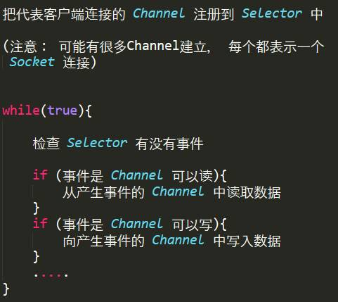

主要思路是在一个**无限的循环**中让一个线程处理多个连接。

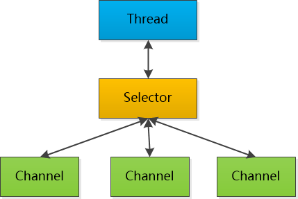

## NIO实例
Selector类可以用于避免使用阻塞式客户端中很浪费资源的“忙等”方法。例如，考虑一个IM服务器。像QQ或者旺旺这样的，可能有几万甚至几千万个客户端同时连接到了服务器，但在任何时刻都只是非常少量的消息。

需要读取和分发。这就需要一种方法阻塞等待，直到至少有一个信道可以进行I/O操作，并指出是哪个信道。NIO的选择器就实现了这样的功能。一个Selector实例可以同时检查一组信道的I/O状态。用专业术语来说，选择器就是一个多路开关选择器，因为一个选择器能够管理多个信道上的I/O操作。然而如果用传统的方式来处理这么多客户端，使用的方法是循环地一个一个地去检查所有的客户端是否有I/O操作，如果当前客户端有I/O操作，则可能把当前客户端扔给一个线程池去处理，如果没有I/O操作则进行下一个轮询，当所有的客户端都轮询过了又接着从头开始轮询；这种方法是非常笨而且也非常浪费资源，因为大部分客户端是没有I/O操作，我们也要去检查；而Selector就不一样了，它在内部可以同时管理多个I/O，当一个信道有I/O操作的时候，他会通知Selector，Selector就是记住这个信道有I/O操作，并且知道是何种I/O操作，是读呢？是写呢？还是接受新的连接；所以如果使用Selector，它返回的结果只有两种结果，一种是0，即在你调用的时刻没有任何客户端需要I/O操作，另一种结果是一组需要I/O操作的客户端，这时你就根本不需要再检查了，因为它返回给你的肯定是你想要的。这样一种通知的方式比那种主动轮询的方式要高效得多！

要使用选择器（Selector），需要创建一个Selector实例（使用静态工厂方法open()）并将其注册（register）到想要监控的信道上（注意，这要通过channel的方法实现，而不是使用selector的方法）。最后，调用选择器的select()方法。该方法会阻塞等待，直到有一个或更多的信道准备好了I/O操作或等待超时。select()方法将返回可进行I/O操作的信道数量。现在，在一个单独的线程中，通过调用select()方法就能检查多个信道是否准备好进行I/O操作。如果经过一段时间后仍然没有信道准备好，select()方法就会返回0，并允许程序继续执行其他任务。

下面将上面的TCP服务端代码改写成NIO的方式（案例）：

```java
public class ServerConnect
{
    private static final int BUF_SIZE=1024;
    private static final int PORT = 8080;
    private static final int TIMEOUT = 3000;
    public static void main(String[] args)
    {
        selector();
    }
    public static void handleAccept(SelectionKey key) throws IOException{
        ServerSocketChannel ssChannel = (ServerSocketChannel)key.channel();
        SocketChannel sc = ssChannel.accept();
        sc.configureBlocking(false);
        sc.register(key.selector(), SelectionKey.OP_READ,ByteBuffer.allocateDirect(BUF_SIZE));
    }
    public static void handleRead(SelectionKey key) throws IOException{
        SocketChannel sc = (SocketChannel)key.channel();
        ByteBuffer buf = (ByteBuffer)key.attachment();
        long bytesRead = sc.read(buf);
        while(bytesRead>0){
            buf.flip();
            while(buf.hasRemaining()){
                System.out.print((char)buf.get());
            }
            System.out.println();
            buf.clear();
            bytesRead = sc.read(buf);
        }
        if(bytesRead == -1){
            sc.close();
        }
    }
    public static void handleWrite(SelectionKey key) throws IOException{
        ByteBuffer buf = (ByteBuffer)key.attachment();
        buf.flip();
        SocketChannel sc = (SocketChannel) key.channel();
        while(buf.hasRemaining()){
            sc.write(buf);
        }
        buf.compact();
    }
    public static void selector() {
        Selector selector = null;
        ServerSocketChannel ssc = null;
        try{
            selector = Selector.open();
            ssc= ServerSocketChannel.open();
            ssc.socket().bind(new InetSocketAddress(PORT));
            ssc.configureBlocking(false);
            ssc.register(selector, SelectionKey.OP_ACCEPT);
            while(true){
                if(selector.select(TIMEOUT) == 0){
                    System.out.println("==");
                    continue;
                }
                Iterator<SelectionKey> iter = selector.selectedKeys().iterator();
                while(iter.hasNext()){
                    SelectionKey key = iter.next();
                    if(key.isAcceptable()){
                        handleAccept(key);
                    }
                    if(key.isReadable()){
                        handleRead(key);
                    }
                    if(key.isWritable() && key.isValid()){
                        handleWrite(key);
                    }
                    if(key.isConnectable()){
                        System.out.println("isConnectable = true");
                    }
                    iter.remove();
                }
            }
        }catch(IOException e){
            e.printStackTrace();
        }finally{
            try{
                if(selector!=null){
                    selector.close();
                }
                if(ssc!=null){
                    ssc.close();
                }
            }catch(IOException e){
                e.printStackTrace();
            }
        }
    }
}
```
下面来慢慢讲解这段代码。

### ServerSocketChannel

打开ServerSocketChannel：

```java
ServerSocketChannel serverSocketChannel = ServerSocketChannel.open();
```
关闭ServerSocketChannel：


```java
serverSocketChannel.close();
```
监听新进来的连接：


```java
while(true){
    SocketChannel socketChannel = serverSocketChannel.accept();
}

```
ServerSocketChannel可以设置成非阻塞模式。在非阻塞模式下，accept() 方法会立刻返回，如果还没有新进来的连接,返回的将是null。 因此，需要检查返回的SocketChannel是否是null.如：

        
```java
ServerSocketChannel serverSocketChannel = ServerSocketChannel.open();
        serverSocketChannel.socket().bind(new InetSocketAddress(9999));
        serverSocketChannel.configureBlocking(false);
        while (true)
        {
            SocketChannel socketChannel = serverSocketChannel.accept();
            if (socketChannel != null)
            {
                // do something with socketChannel...
            }
        }
```
### Selector

Selector的创建：

```java
Selector selector = Selector.open();
```

为了将Channel和Selector配合使用，必须将Channel注册到Selector上，通过SelectableChannel.register()方法来实现，沿用案例中的部分代码：
            
```java
ssc= ServerSocketChannel.open();
            ssc.socket().bind(new InetSocketAddress(PORT));
            ssc.configureBlocking(false);
            ssc.register(selector, SelectionKey.OP_ACCEPT);

```
与Selector一起使用时，Channel必须处于非阻塞模式下。这意味着不能将FileChannel与Selector一起使用，因为FileChannel不能切换到非阻塞模式。而套接字通道都可以。

注意register()方法的第二个参数。这是一个“interest集合”，意思是在通过Selector监听Channel时对什么事件感兴趣。可以监听四种不同类型的事件：

1. Connect
2. Accept
3. Read
4. Write
通道触发了一个事件意思是该事件已经就绪。所以，某个channel成功连接到另一个服务器称为“连接就绪”。一个server socket channel准备好接收新进入的连接称为“接收就绪”。一个有数据可读的通道可以说是“读就绪”。等待写数据的通道可以说是“写就绪”。

这四种事件用SelectionKey的四个常量来表示：

1. SelectionKey.OP_CONNECT
2. SelectionKey.OP_ACCEPT
3. SelectionKey.OP_READ
4. SelectionKey.OP_WRITE

### SelectionKey

当向Selector注册Channel时，register()方法会返回一个SelectionKey对象。这个对象包含了一些你感兴趣的属性：
* interest集合
* ready集合
* Channel
* Selector
* 附加的对象（可选）

interest集合：就像向Selector注册通道一节中所描述的，interest集合是你所选择的感兴趣的事件集合。可以通过SelectionKey读写interest集合。

ready 集合是通道已经准备就绪的操作的集合。在一次选择(Selection)之后，你会首先访问这个ready set。Selection将在下一小节进行解释。可以这样访问ready集合：

```java
int readySet = selectionKey.readyOps();
```
可以用像检测interest集合那样的方法，来检测channel中什么事件或操作已经就绪。但是，也可以使用以下四个方法，它们都会返回一个布尔类型：

```java
selectionKey.isAcceptable();
selectionKey.isConnectable();
selectionKey.isReadable();
selectionKey.isWritable();
```
从SelectionKey访问Channel和Selector很简单。如下：

```java
Channel  channel  = selectionKey.channel();
Selector selector = selectionKey.selector();
```
可以将一个对象或者更多信息附着到SelectionKey上，这样就能方便的识别某个给定的通道。例如，可以附加 与通道一起使用的Buffer，或是包含聚集数据的某个对象。使用方法如下：

```java
selectionKey.attach(theObject);
Object attachedObj = selectionKey.attachment();
```
还可以在用register()方法向Selector注册Channel的时候附加对象。如：

```java
SelectionKey key = channel.register(selector, SelectionKey.OP_READ, theObject);
```

### 通过Selector选择通道

一旦向Selector注册了一或多个通道，就可以调用几个重载的select()方法。这些方法返回你所感兴趣的事件（如连接、接受、读或写）已经准备就绪的那些通道。换句话说，如果你对“读就绪”的通道感兴趣，select()方法会返回读事件已经就绪的那些通道。

下面是select()方法：
* int select()
* int select(long timeout)
* int selectNow()

select()阻塞到至少有一个通道在你注册的事件上就绪了。
select(long timeout)和select()一样，除了最长会阻塞timeout毫秒(参数)。
selectNow()不会阻塞，不管什么通道就绪都立刻返回（译者注：此方法执行非阻塞的选择操作。如果自从前一次选择操作后，没有通道变成可选择的，则此方法直接返回零。）。

select()方法返回的int值表示有多少通道已经就绪。亦即，自上次调用select()方法后有多少通道变成就绪状态。如果调用select()方法，因为有一个通道变成就绪状态，返回了1，若再次调用select()方法，如果另一个通道就绪了，它会再次返回1。如果对第一个就绪的channel没有做任何操作，现在就有两个就绪的通道，但在每次select()方法调用之间，只有一个通道就绪了。

一旦调用了select()方法，并且返回值表明有一个或更多个通道就绪了，然后可以通过调用selector的selectedKeys()方法，访问“已选择键集（selected key set）”中的就绪通道。如下所示：

```java
Set selectedKeys = selector.selectedKeys();
```
当向Selector注册Channel时，Channel.register()方法会返回一个SelectionKey 对象。这个对象代表了注册到该Selector的通道。

注意每次迭代末尾的keyIterator.remove()调用。Selector不会自己从已选择键集中移除SelectionKey实例。必须在处理完通道时自己移除。下次该通道变成就绪时，Selector会再次将其放入已选择键集中。

SelectionKey.channel()方法返回的通道需要转型成你要处理的类型，如ServerSocketChannel或SocketChannel等。

一个完整的使用Selector和ServerSocketChannel的案例可以参考案例的selector()方法。

---
# java中的函数式编程
参考码农翻身的两篇文章：

[一](https://mp.weixin.qq.com/s?__biz=MzAxOTc0NzExNg==&mid=2665513149&idx=1&sn=00e563fbd09c9cf9e2ac4283d43cccf1&scene=21#wechat_redirect)

[二](https://mp.weixin.qq.com/s?__biz=MzAxOTc0NzExNg==&mid=2665513152&idx=1&sn=1398826ca9f9ea2b7c374574302a3838&scene=21#wechat_redirect)

---
# 编译时常量、运行时常量和静态代码块
 常量是程序运行时恒定不变的量，许多程序设计语言都有某种方法，向编译器告知一块数据时恒定不变的，例如C++中的const和Java中的final。

   根据编译器的不同行为，常量又分为编译时常量和运行时常量，其实编译时常量肯定就是运行时常量，只是编译时常量在编译的时候就被计算执行计算，并带入到程序中一切可能用到它的计算式中。

   以Java为例，`static final int a = 1`将是一个编译时常量，编译后的符号表中将找不到a，所有对a的引用都被替换成了1。

而`static final int b = "test".length()`将是一个运行时常量。测试代码如下：

```java
public class CompilConstant {

 public static void main(String[] args) {
  System.out.println(Test.a);
  System.out.println(Test.c);
 }

}

class Test {
 static {
  System.out.println("Class Test Was Loaded !");
 }
 public static final int a =10;
 public static final int c = "test".length();
}
```

```
10
Class Test Was Loaded !
0
```

即:
1. a被作为编译期全局常量，并不依赖于类，而b作为运行期的全局常量，其值还是依赖于类的。

2. 编译时常量在编译时就可以确定值，上例中的a可以确定值，但是c在编译器是不可能确定值的。

3. 由于编译时常量不依赖于类，所以对编译时常量的访问不会引发类的初始化。同样的原因，静态块的执行在运行时常量之前，在编译时常量之后

---
# Java中创建对象的5种方式
Java中有5种创建对象的方式，下面给出它们的例子还有它们的字节码

|方法|说明|
| --- | --- |
|使用new关键字	|} → 调用了构造函数|
|使用Class类的newInstance方法	|} → 调用了构造函数
|使用Constructor类的newInstance方法	|} → 调用了构造函数|
|使用clone方法	|} → 没有调用构造函数|
|使用反序列化	|} → 没有调用构造函数|
如果你运行了末尾的的程序，你会发现方法1,2,3用构造函数创建对象，方法4,5没有调用构造函数。

## 1.使用new关键字
这是最常见也是最简单的创建对象的方式了。通过这种方式，我们可以调用任意的构造函数(无参的和带参数的)。

```java
Employee emp1 = new Employee();
0: new           #19          // class org/programming/mitra/exercises/Employee
3: dup
4: invokespecial #21          // Method org/programming/mitra/exercises/Employee."":()V
```

## 2.使用Class类的newInstance方法
我们也可以使用Class类的newInstance方法创建对象。这个newInstance方法调用无参的构造函数创建对象。

我们可以通过下面方式调用newInstance方法创建对象:

```java
Employee emp2 = (Employee) Class.forName("org.programming.mitra.exercises.Employee").newInstance();
```

或者
```java
Employee emp2 = Employee.class.newInstance();
51: invokevirtual    #70    // Method java/lang/Class.newInstance:()Ljava/lang/Object;
```

## 3.使用Constructor类的newInstance方法
和Class类的newInstance方法很像， java.lang.reflect.Constructor类里也有一个newInstance方法可以创建对象。我们可以通过这个newInstance方法调用有参数的和私有的构造函数。

```java
Constructor<Employee> constructor = Employee.class.getConstructor();
Employee emp3 = constructor.newInstance();
111: invokevirtual  #80  // Method java/lang/reflect/Constructor.newInstance:([Ljava/lang/Object;)Ljava/lang/Object;
```

这两种newInstance方法就是大家所说的反射。事实上Class的newInstance方法内部调用Constructor的newInstance方法。这也是众多框架，如Spring、Hibernate、Struts等使用后者的原因。想了解这两个newInstance方法的区别，请看这篇[Creating objects through Reflection in Java with Example.](https://programmingmitra.blogspot.in/2016/05/creating-objects-through-reflection-in-java-with-example.html)

## 4.使用clone方法
无论何时我们调用一个对象的clone方法，jvm就会创建一个新的对象，将前面对象的内容全部拷贝进去。用clone方法创建对象并不会调用任何构造函数。

要使用clone方法，我们需要先实现Cloneable接口并实现其定义的clone方法。

```java
Employee emp4 = (Employee) emp3.clone();
162: invokevirtual #87  // Method org/programming/mitra/exercises/Employee.clone ()Ljava/lang/Object;
```

## 5.使用反序列化
当我们序列化和反序列化一个对象，jvm会给我们创建一个单独的对象。在反序列化时，jvm创建对象并不会调用任何构造函数。
为了反序列化一个对象，我们需要让我们的类实现Serializable接口

```java
ObjectInputStream in = new ObjectInputStream(new FileInputStream("data.obj"));
Employee emp5 = (Employee) in.readObject();
261: invokevirtual  #118   // Method java/io/ObjectInputStream.readObject:()Ljava/lang/Object;
```

我们从上面的字节码片段可以看到，除了第1个方法，其他4个方法全都转变为invokevirtual(创建对象的直接方法)，第一个方法转变为两个调用，new和invokespecial(构造函数调用)。

## 例子
让我们看一看为下面这个Employee类创建对象：

```java
class Employee implements Cloneable, Serializable {
    private static final long serialVersionUID = 1L;
    private String name;
    public Employee() {
        System.out.println("Employee Constructor Called...");
    }
    public String getName() {
        return name;
    }
    public void setName(String name) {
        this.name = name;
    }
    @Override
    public int hashCode() {
        final int prime = 31;
        int result = 1;
        result = prime * result + ((name == null) ? 0 : name.hashCode());
        return result;
    }
    @Override
    public boolean equals(Object obj) {
        if (this == obj)
            return true;
        if (obj == null)
            return false;
        if (getClass() != obj.getClass())
            return false;
        Employee other = (Employee) obj;
        if (name == null) {
            if (other.name != null)
                return false;
        } else if (!name.equals(other.name))
            return false;
        return true;
    }
    @Override
    public String toString() {
        return "Employee [name=" + name + "]";
    }
    @Override
    public Object clone() {
        Object obj = null;
        try {
            obj = super.clone();
        } catch (CloneNotSupportedException e) {
            e.printStackTrace();
        }
        return obj;
    }
}
```

下面的Java程序中，我们将用5种方式创建Employee对象。你可以从GitHub找到这些代码。

```java
public class ObjectCreation {
    public static void main(String... args) throws Exception {
        // By using new keyword
        Employee emp1 = new Employee();
        emp1.setName("Naresh");
        System.out.println(emp1 + ", hashcode : " + emp1.hashCode());
        // By using Class class's newInstance() method
        Employee emp2 = (Employee) Class.forName("org.programming.mitra.exercises.Employee")
                               .newInstance();
        // Or we can simply do this
        // Employee emp2 = Employee.class.newInstance();
        emp2.setName("Rishi");
        System.out.println(emp2 + ", hashcode : " + emp2.hashCode());
        // By using Constructor class's newInstance() method
        Constructor<Employee> constructor = Employee.class.getConstructor();
        Employee emp3 = constructor.newInstance();
        emp3.setName("Yogesh");
        System.out.println(emp3 + ", hashcode : " + emp3.hashCode());
        // By using clone() method
        Employee emp4 = (Employee) emp3.clone();
        emp4.setName("Atul");
        System.out.println(emp4 + ", hashcode : " + emp4.hashCode());
        // By using Deserialization
        // Serialization
        ObjectOutputStream out = new ObjectOutputStream(new FileOutputStream("data.obj"));
        out.writeObject(emp4);
        out.close();
        //Deserialization
        ObjectInputStream in = new ObjectInputStream(new FileInputStream("data.obj"));
        Employee emp5 = (Employee) in.readObject();
        in.close();
        emp5.setName("Akash");
        System.out.println(emp5 + ", hashcode : " + emp5.hashCode());
    }
}
```

程序会输出：

```java
Employee Constructor Called...
Employee [name=Naresh], hashcode : -1968815046
Employee Constructor Called...
Employee [name=Rishi], hashcode : 78970652
Employee Constructor Called...
Employee [name=Yogesh], hashcode : -1641292792
Employee [name=Atul], hashcode : 2051657
Employee [name=Akash], hashcode : 63313419
```

---

# String的实例化与static final修饰符
## String两种实例化方式
一种是通过双引号直接赋值的方式，另外一种是使用标准的new调用构造方法完成实例化。如下：
　　String str = "abcd";
　　String str = new String("1234);

第一种方法：
　　使用直接赋值后，只要是以后声明的字符串内容相同，则不会再开辟新的内存空间。对于String的以上操作，在java中称为共享设计。这种设计思路是，在java中形成一个字符串对象池，在这个字符串对象中保存多个字符串对象，新实例化的对象如果已经在池中定义了，则不再重新定义，而从池中直接取出继续使用。String就是因为采用了这样的设计，所以当内容重复时，会将对象指向已存在的实例空间。

　　一个双引号包含字符串就是一个String类的匿名对象，但是这种方式使用String不一定创建新对象。在执行到这个字符串的语句时，如String a = "123"，JVM会先到常量池里查找，如果有的话返回常量池里的这个实例的引用，否则的话创建一个新实例并置入常量池里。

第二种方法：
　　使用new关键字，不管如何都会再开辟一个新的空间。
　　new创建字符串时首先查看池中是否有相同值的字符串，如果有，则拷贝一份到堆中，然后返回堆中的地址；如果池中没有，则在堆中创建一份，然后返回堆中的地址（注意，此时不需要从堆中复制到池中，否则，将使得堆中的字符串永远是池中的子集，导致浪费池的空间）！

 

## String实例化的时机
（1）单独使用""引号创建的字符串都是常量，编译期就已经确定存储到String Pool中；
（2）使用new String("")创建的对象会存储到堆区（heap）中，是运行期新创建的；
（3）使用只包含常量的字符串连接符如"aa" + "aa"创建的也是常量，编译期就能确定，已经确定存储到String Pool中；
（4）使用包含变量的字符串连接符如"aa" + s1创建的对象是运行期才创建的，存储在堆区（heap）中；

　　注意：上面第（3）句话，编译后合并的字符串会保存在JVM的字符串池中，而不是再生成的class文件中把字符串合并。
　　String s = "a" + "b" + "c"; 创建的是一个对象，而不是是四个对象，在字符串常量池中只生成一个字符串对象

 

## 字符串池的优缺点
　　字符串池的优点就是避免了相同内容的字符串的创建，节省了内存，省去了创建相同字符串的时间，同时提升了性能；另一方面，字符串池的缺点就是牺牲了JVM在常量池中遍历对象所需要的时间，不过其时间成本相比而言比较低。

 

## static final修饰的字符串好吗？
工作后发现，大型的项目里，常常会见到定义字符串使用 private static final String = "abc" 的方式。这种方式有好处吗？

　　首先使用直接赋值的字串的方式，字符串会在编译期生成在字符串池中。

　　然后final标记的变量（成员变量或局部变量）即成为常量，只能赋值一次。它应该不影响内存的分配。（查看资料多了，说法不一，在下对此也有点怀疑了，如果final影响内存分配，烦请各位大侠告知）

　　最后看static修饰符：
        static修饰符能够与属性、方法和内部类一起使用，表示静态的。类中的静态变量和静态方法能够与类名一起使用，不需要创建一个类的对象来访问该类的静态成员，所以，static修饰的变量又称作“类变量”。
　　“类变量”属于类的成员，类的成员是被储存在堆内存里面的。一个类中，一个static变量只会有一个内存空间，即使有多个类实例，但这些类实例中的这个static变量会共享同一个内存空间。

　　static修饰的String，会在堆内存中复制一份常量池中的值。所以调用 static final String 变量，实际上是直接调用堆内存的地址，不会遍历字符串池中的对象，节省了遍历时间。

所以使用static final修饰的字符串还是有好处的。

 

## 代码测试

```java
public class Test
{
    public static final String A="ab";
    public static final String B="cd";

    public static final String C;
    public static final String D;
    static{
        C = "ab";
        D = "cd";
    }
    public static void main(String[] args) {
        String t = "abcd";//指向池

        String s1 = "ab";//指向池
        String s2 = "cd";//指向池

        String s = s1+s2;//指向堆
        System.out.println(s==t);//false

        String ss = "ab"+s2;//指向堆
        System.out.println(ss==t);//false

        String sss = "ab"+"cd";//指向池
        System.out.println(sss==t);//true

        String ssss = A+B;//指向池
        System.out.println(ssss==t);//true

        System.out.println((C+D)==t);//false
    }

}
```
 

字符串对象可以存放在两个地方，字符串池(pool)和堆，编译期确定如何给一个引用变量赋值

1. String s="abc";这种形式决定将从pool中寻找内容相同的字符串并返回地址给s，pool中没有就会在pool中新建并返回地址给s
2. String s = new String("abc");这种形式决定运行期将在堆上新建字符串对象并返回给s，但这个对象不会加入到pool中
3. String s=s1+s2;s1和s2都是变量，这种形式决定将在堆上创建s1和s2（即便s1和s2指向的对象在池中已经存在，也会将值拷贝到对象创建新对象），然后创建s1+s2并赋给s
4. String s = "ab"+"cd";同1)，都是来自于池
5. String s = "ab"+s1;类似3)
6. String s = S1+S2;S1和S2是常量，常量只能赋值一次，S1，S2如果在声明的地方就赋值，那么这个值在编译期就是确定的，后面无法更改，S1+S2在执行前可确定S1/S2已经在池中存在，当然在池中进行，所以s指向pool；但是若S1，S2如果是实例常量在构造器中赋值，或是类常量在静态块中赋值，S1+S2无法确定二者皆来自于池，于是在堆上进行

# 创建java子类出现is not an enclosing class

```java
public class A {  
    public class B {  
          
    }  
};  
```

需要实例B类时,按照正逻辑是,A.B ab = new A.B();
那么编译器就会出现一个错误--"is not an enclosing class"
再翻看相关的Java代码,发现原来写法出错了!正确的做法是

```java
A a = new A();  
A.B ab = a.new B();  
```

没有**静态(static)的类中类不能使用外部类进行操作**,必须用实例来进行实例化类中类.

# List初始化的几种方法
## 1、常规方式

```java
List<String> languages = new ArrayList<>();
languages.add("Java");
languages.add("PHP");
languages.add("Python");
System.out.println(languages);

```
这种就是我们平常用的最多最平常的方式了，没什么好说的，后面缺失的泛型类型在 JDK 7 之后就可以不用写具体的类型了，改进后会自动推断类型。

## 2、Arrays 工具类

```java
List<String> jdks = asList("JDK6", "JDK8", "JDK10");
System.out.println(jdks);
```
注意，上面的 asList 是 Arrays 的静态方法，这里使用了静态导入。这种方式添加的是不可变的 List, 即不能添加、删除等操作，需要警惕。。

```java
import static java.util.Arrays.asList;
```

如果要可变，那就使用 ArrayList 再包装一下，如下面所示。

```java
List<String> numbers = new ArrayList<>(Arrays.asList("1", "2", "3"));
numbers.add("4");
System.out.println(numbers);
```
包装一下，这就是可变的 ArrayList 了。

## 3、Collections 工具类

```java
List<String> apples = Collections.nCopies(3, "apple");
System.out.println(apples);
```
这种方式添加的是不可变的、复制某个元素N遍的工具类，以上程序输出：

`[apple, apple, apple]`
老规则，如果要可变，使用 ArrayList 包装一遍。

```java
List<String> dogs = new ArrayList<>(Collections.nCopies(3, "dog"));
dogs.add("dog");
System.out.println(dogs);
```
还有初始化单个对象的 List 工具类，这种方式也是不可变的，集合内只能有一个元素，这种也用得很少啊。

```java
List<String> cat = Collections.singletonList("cat");
System.out.println(cat);
```
还有一个创建空 List 的工具类，没有默认容量，节省空间，但不知道实际工作中有什么鸟用。

```java
List<String> cat = Collections.emptyList("cat");
```

## 4、匿名内部类

```java
List<String> names = new ArrayList<>() {{
    add("Tom");
    add("Sally");
    add("John");
}};
System.out.println(names);

```
这种使用了匿名内部类的方式，一气喝成，是不是很高大上？栈长我曾经也使用过这种方式，不过我觉得这种看似高级，实现也没什么卵用。

## 5、JDK8 Stream

```java
List<String> colors = Stream.of("blue", "red", "yellow").collect(toList());
System.out.println(colors);

```
Stream 是 JDK 8 推出来的新概念，比集合还要更强大，还可以和集合互相转换。

上面同样使用了静态导入：

`import static java.util.stream.Collectors.toList;`

关于 Stream 的一系列教程，可以在Java技术栈微信公众号后台回复关键字：新特性。

## 6、JDK 9 List.of

```java
List<String> cups = List.of("A", "B", "C");
System.out.println(cups);

```
这是 JDK 9 里面新增的 List 接口里面的静态方法，同样也是不可变的。

# java除法保留小数
java中，当两个整数相除时，由于小数点以后的数字会被截断，运算结果将为整数，此时若希望得到运算结果为浮点数，

必须将两整数其一或是两者都强制转换为浮点数。因为int 是整数，整数除整数就是整数double是小数。小数除小数才是小数

转换成double，或直接定义成double
如     
```java
 double a=1;
 double b=100;
 System.out.println(a/b);
 // 结果 为0.01
```

java保留两位小数的两种方法：

## 方法1:用Math.round计算
这里返回的数字格式的.

```java
float price=89.89;
int Num=3;
float totalPrice=price*Num;
float num=(float)(Math.round(totalPrice*100))/100;//如果要求精确4位就*10000然后/10000
```

## 方法2:用DecimalFormat 
返回的是String格式的.该类对十进制进行全面的封装.像%号,千分位,小数精度.科学计算.

```java
float price=1.2;
DecimalFormat decimalFormat=new DecimalFormat(".00");//构造方法的字符格式这里如果小数不足2位,会以0补足.
String p=decimalFomat.format(price);//format 返回的是字符串
```

# 多个if else的解决方案
主要是使用策略模式和工厂模式

## 需求
外卖平台，有这样的需求：

外卖平台上的某家店铺为了促销，设置了多种会员优惠，其中包含超级会员折扣 8 折、普通会员折扣 9 折和普通用户没有折扣三种。

希望用户在付款的时候，根据用户的会员等级，就可以知道用户符合哪种折扣策略，进而进行打折，计算出应付金额。

随着业务发展，新的需求要求专属会员要在店铺下单金额大于 30 元的时候才可以享受优惠。

接着，又有一个变态的需求，如果用户的超级会员已经到期了，并且到期时间在一周内，那么就对用户的单笔订单按照超级会员进行折扣，并在收银台进行强提醒，引导用户再次开通会员，而且折扣只进行一次。


## 原始代码
```java
public BigDecimal calPrice(BigDecimal orderPrice, String buyerType) {

    if (用户是专属会员) {
        if (订单金额大于30元) {
            returen 7折价格;
        }
    }

    if (用户是超级会员) {
        return 8折价格;
    }

    if (用户是普通会员) {
        if(该用户超级会员刚过期并且尚未使用过临时折扣){
            临时折扣使用次数更新();
            returen 8折价格;
        }
        return 9折价格;
    }
    return 原价;
}
```

## 优化方案
### 第一步 使用策略模式

首先，定义一个接口：
```java
public interface UserPayService {

    /**
     * 计算应付价格
     */
    public BigDecimal quote(BigDecimal orderPrice);
}
```

接着定义几个策略类：
```java
public class ParticularlyVipPayService implements UserPayService {

    @Override
    public BigDecimal quote(BigDecimal orderPrice) {
         if (消费金额大于30元) {
            return 7折价格;
        }
    }
}

public class SuperVipPayService implements UserPayService {

    @Override
    public BigDecimal quote(BigDecimal orderPrice) {
        return 8折价格;
    }
}

public class VipPayService implements UserPayService {

    @Override
    public BigDecimal quote(BigDecimal orderPrice) {
        if(该用户超级会员刚过期并且尚未使用过临时折扣){
            临时折扣使用次数更新();
            returen 8折价格;
        }
        return 9折价格;
    }
}
```

引入了策略之后，我们可以按照如下方式进行价格计算：

```java
public class Test {

    public static void main(String[] args) {
        UserPayService strategy = new VipPayService();
        BigDecimal quote = strategy.quote(300);
        System.out.println("普通会员商品的最终价格为：" + quote.doubleValue());

        strategy = new SuperVipPayService();
        quote = strategy.quote(300);
        System.out.println("超级会员商品的最终价格为：" + quote.doubleValue());
    }
}
```
以上，就是一个例子，可以在代码中 New 出不同的会员的策略类，然后执行对应的计算价格的方法。

但是，真正在代码中使用，比如在一个 Web 项目中使用，上面这个 Demo 根本没办法直接用。

首先，在 Web 项目中，上面我们创建出来的这些策略类都是被 Spring 托管的，我们不会自己去 New 一个实例出来。

其次，在 Web 项目中，如果真要计算价格，也是要事先知道用户的会员等级，比如从数据库中查出会员等级，然后根据等级获取不同的策略类执行计算价格方法。

那么，Web 项目中真正的计算价格的话，伪代码应该是这样的：
```java
public BigDecimal calPrice(BigDecimal orderPrice,User user) {

     String vipType = user.getVipType();

     if (vipType == 专属会员) {
        //伪代码：从Spring中获取超级会员的策略对象
        UserPayService strategy = Spring.getBean(ParticularlyVipPayService.class);
        return strategy.quote(orderPrice);
     }

     if (vipType == 超级会员) {
        UserPayService strategy = Spring.getBean(SuperVipPayService.class);
        return strategy.quote(orderPrice);
     }

     if (vipType == 普通会员) {
        UserPayService strategy = Spring.getBean(VipPayService.class);
        return strategy.quote(orderPrice);
     }
     return 原价;
}
```
通过以上代码，我们发现，代码可维护性和可读性好像是好了一些，但是好像并没有减少 if-else

这就是策略模式的一个缺点：
策略模式的使用上，客户端必须知道所有的策略类，并自行决定使用哪一个策略类。这就意味着客户端必须理解这些算法的区别，以便适时选择恰当的算法类。

也就是说，虽然在计算价格的时候没有 if-else 了，但是选择具体的策略的时候还是不可避免的还是要有一些 if-else。

### 第二步 使用spring bean和工厂模式
为了方便我们从 Spring 中获取 UserPayService 的各个策略类，我们创建一个工厂类：

```java
public class UserPayServiceStrategyFactory {

    private static Map<String,UserPayService> services = new ConcurrentHashMap<String,UserPayService>();

    public  static UserPayService getByUserType(String type){
        return services.get(type);
    }

    public static void register(String userType,UserPayService userPayService){
        Assert.notNull(userType,"userType can't be null");
        services.put(userType,userPayService);
    }
}
```

定义了一个 Map，用来保存所有的策略类的实例，并提供一个 getByUserType 方法，可以根据类型直接获取对应的类的实例。还有一个 Register 方法，这个后面再讲。

有了这个工厂类之后，计算价格的代码即可得到大大的优化：

```java
public BigDecimal calPrice(BigDecimal orderPrice,User user) {

     String vipType = user.getVipType();
     UserPayService strategy = UserPayServiceStrategyFactory.getByUserType(vipType);
     return strategy.quote(orderPrice);
}
```

### 第三步 spring bean的注册
接下来，我们就想办法调用 Register 方法，把 Spring 通过 IOC 创建出来的 Bean 注册进去就行了。

这种需求，可以借用 Spring 中提供的 InitializingBean 接口，这个接口为 Bean 提供了属性初始化后的处理方法。

它只包括 afterPropertiesSet 方法，凡是继承该接口的类，在 Bean 的属性初始化后都会执行该方法。


那么，我们将前面的各个策略类稍作改造即可：

```java
@Service
public class ParticularlyVipPayService implements UserPayService,InitializingBean {

    @Override
    public BigDecimal quote(BigDecimal orderPrice) {
         if (消费金额大于30元) {
            return 7折价格;
        }
    }
    
    /**
    使用afterPropertiesSet将bean注册到工厂
    **/
    @Override
    public void afterPropertiesSet() throws Exception {
        UserPayServiceStrategyFactory.register("ParticularlyVip",this);
    }
}
```

只需要每一个策略服务的实现类都实现 InitializingBean 接口，并实现其 afterPropertiesSet 方法，在这个方法中调用 UserPayServiceStrategyFactory.register 即可。

## 总结
其实，如果对策略模式和工厂模式了解的话，文中使用的并不是严格意义上面的策略模式和工厂模式。

首先，策略模式中重要的 Context 角色在这里面是没有的，没有 Context，也就没有用到组合的方式，而是使用工厂代替了。

另外，这里面的 UserPayServiceStrategyFactory 其实只是维护了一个 Map，并提供了 Register 和 Get 方法而已，而工厂模式其实是帮忙创建对象的，这里并没有用到。

所以，读者不必纠结于到底是不是真的用了策略模式和工厂模式。而且，这里面也再扩展一句，所谓的 GOF 23 种设计模式，无论从哪本书或者哪个博客看，都是简单的代码示例，但是我们日常开发很多都是基于 Spring 等框架的，根本没办法直接用的。

所以，对于设计模式的学习，重要的是学习其思想，而不是代码实现！！！