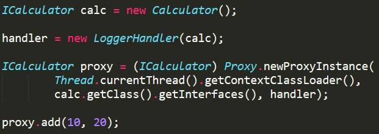

### 面试题
#### ArrayList和LinkedList的大致区别
1. ArrayList是实现了基于动态数组的数据结构，LinkedList基于链表的数据结构。 
2. 对于随机访问get和set，ArrayList觉得优于LinkedList，因为LinkedList要移动指针。 
3. 对于新增和删除操作add和remove，LinedList比较占优势，因为ArrayList要移动数据。 


#### HashMap 源码解读(TreeMap. LinkedHashMap) 
hashmap 允许 空值 和 空key, 非线程安全的,不保证存储顺序 
初始容量 和 负载因子(0.75) 
结构化改变,增加或者删除必须是同步的, 单纯的改变值不需要同步 
获取遍历器的时候,多线程的结构的改变,不是通过遍历器的remove方法的结构改变,都是在遍历器的时候 抛出异常,但是这个不能保证,只能是测试使用 
根据hashcode排序,相同comparable的根据comparable排序 
treeNode是正常节点的2倍 . 
树节点往往是根节点, iterator.remove才可能不是根节点,但是可以根据treenode.root恢复 
容量必须是2的倍数,默认为16,最大为2^30 
一个桶的元素>=8 就从list 变为 tree,<=6就从tree变为list 
桶数量到64的时候里面的桶才会被树形化 
4*8的元素在同一个节点的时候,会被重新更新size大小 
hashBinNode hashCode是key和value的异或
#### heap 和 stack 的区别 
stack: 先进后出 
函数调用栈,有结构,查询快,线程独占的,存储引用和基本类型

heap: 
先进先出,没有结构,查询慢,线程共享的,存储数值,等待垃圾回收

方法区, 存储static唯一变量, 被所有线程共享

http://image.beekka.com/blog/201311/bg2013112905.jpg

http://www.cnblogs.com/lewis0077/p/5143268.html

java基础 
基本类型: byte short int double float long boolean char
快速排序: 
http://baike.baidu.com/li nk?url=pqzkGbx5-idKz3_VJ1FtAS2O3SJZhsNWset3-0Tcme_d1XlFErKA50VexUcLCxW46cD8VaxhoQHkiHX6-4sJrYbP5aj77RiCCHd09uJQR0_NQoLMTwS6vxTrC-6Ti-ZDJquSjF3VoUzm9Cnoq3blGK

单例模式(单例三个) 
http://www.cnblogs.com/yinxiaoqiexuxing/p/5605338.html 方法4

枚举实现单例模式: 
http://www.cnblogs.com/yangzhilong/p/6148639.html

StringBuffer 线程安全和 StringBuilder非线程安全 
Builder 设计模式

适配器模式(比如实体类装换): 
http://blog.csdn.net/jiangxishidayuan/article/details/51050431

Composite组合模式: 树形 
http://blog.csdn.net/jiangxishidayuan/article/details/51045451

Observer观察者模式: 区别对待观察者, java默认的观察者接口 
http://blog.csdn.net/jiangxishidayuan/article/details/51045236

装饰器模式(装饰器和被装饰对象接口相同): 
http://blog.csdn.net/jiangxishidayuan/article/details/51965416

桥接模式: 
http://blog.csdn.net/jiangxishidayuan/article/details/51944928 
短信邮件 发送 紧急消息, 普通消息, 进行桥接

责任链模式: 
Shiro的权限框架 
http://blog.csdn.net/jiangxishidayuan/article/details/51953648

Iterator 模式: 
自己写的分段List,Set迭代器 
http://blog.csdn.net/jiangxishidayuan/article/details/51954773

Command 命令模式: 
http://blog.csdn.net/jiangxishidayuan/article/details/51957617

策略模式: 
http://blog.csdn.net/jiangxishidayuan/article/details/51967015

工厂方法:导出不同格式的文件 
一个产品的时候, 返回不同的工厂

抽象工厂:不同格式的文件,前 缀也不同 
多个产品,返回不同的工厂

代理模式: 
java 动态代理 
http://blog.csdn.net/jiangxishidayuan/article/details/51942658

状态模式: 
Spring 状态框架 
http://blog.csdn.net/jiangxishidayuan/article/details/52003154

JVM 垃圾回收算法:

计数器法, 标记清除, 标记整理, copy 算法 (对象区和空闲区互相换), 
java中可作为GC Root的对象有 
1.虚拟机栈中引用的对象（本地变量表） 
2.方法区中静态属性引用的对象 
3. 方法区中常量引用的对象 
4.本地方法栈中引用的对象（Native对象） 
分代算法: 
年轻代,年老代, 永久代

http://www.cnblogs.com/andy-zcx/p/5522836.html

类加载机制: 
http://www.cnblogs.com/ITtangtang/p/3978102.html

AOP: 
http://www.jb51.net/article/81788.htm

依赖注入: 
http://blog.csdn.net/u010330043/article/details/51287113

排序算法(jdk sort): 
http://blog.csdn.net/hguisu/article/details/7776068/ 
https://img-blog.csdn.net/20170205225535033?watermark/2/text/aHR0cDovL2Jsb2cuY3Nkbi5uZXQvdTAxMDg1MzI2MQ==/font/5a6L5L2T/fontsize/400/fill/I0JBQkFCMA==/dissolve/70/gravity/SouthEast

ln A B B是链接, A是实质文件

java内存模型:(调试工具) 
http://blog.csdn.net/u012152619/article/details/46968883

tomcat调优: 
http://blog.csdn.net/jiangguilong2000/article/details/12523771 
jvm参数, 连接数, 线程数,缓冲池,数据库连接池

自旋锁: 
http://blog.csdn.net/sunmenggmail/article/details/8105279

@transanal 
http://blog.csdn.net/gdfgdfk/article/details/50329859

数据结构: 
树形遍历: http://www.cr173.com/html/18891_1.html 
堆排序: 
AVL: 
红黑树: 
B-树:

乐观锁和悲观锁(CAS): 
http://www.javaweb1024.com/java/JavaWebzhongji/2015/09/06/847.html

版本号和时间戳实现乐观锁

Volatile 原理: 
http://www.cnblogs.com/zhengbin/p/5654805.html

JVM 卡顿调优: 
-Xincgc 
开启增量gc（默认为关闭）；这有助于减少长时间GC时应用程序出现的停顿；但由于可能和应用程序并发执行，所以会降低CPU对应用的处理能力 
java 8: 
http://www.cnblogs.com/moonandstar08/p/5001914.html

分布式锁: 略

ConcurrentHashMap:略

TreeMap: 
http://blog.csdn.net/chenssy/article/details/26668941

java发现死锁: 
jstack -l pid 列举出线程

线程状态: 
java.lang.Thread.State

线程池: 
http://blog.csdn.net/sd0902/article/details/8395677

kafka 和 redis

http:三次握手 
http://www.cnblogs.com/maybe2030/p/4781555.html

负载均衡, 断路器, 服务注册原理

Spring 循环依赖：

Spring cache

链接

http://note.youdao.com/noteshare?id=845baac77faa10ec21932a7b3eb0063f

---
#### Java EE组件

JDBC:  Java 数据库连接，没有数据库的支持怎么能叫企业级应用？

JNDI :  Java 命名和目录接口，通过一个名称就可以定位到一个数据源，连jdbc连接都不用了

RMI：  远程过程调用，让一个机器上的java 对象可以调用另外一个机器上的java 对象 ，你们不是要分布式吗？

JMS :   Java 消息服务，可以使用消息队列了，这不是企业级应用非常需要的吗？

JTA：  Java 事务管理，支持分布式事务，能在访问、更新多个数据库的时候，仍然保证事务，还是分布式。

Java mail : 收发邮件也是必不可少的啊。

---
#### POJO
POJO (Plain Old Java Object)：普通java对象，是相对EJB来说的，EJB中一个bean需要定义N多与业务无关的方法，如下图：


而POJO一个bean是这样的：
```java
public class HelloworldBean{
    public String hello(){
        return "hello world"
    }
}
```
Spring 框架顺应了POJO的潮流，提供了一个spring 的容器来管理这些POJO, 好玩的是也叫做bean 。

对于一个Bean 来说，如果你依赖别的Bean , 只需要声明即可，spring 容器负责把依赖的bean 给“注入进去“，起初大家称之为控制反转(IoC)

后来 Martin flower 给这种方式起来个更好的名字，叫“依赖注入”。

如果一个Bean 需要一些像事务，日志，安全这样的通用的服务，也是只需要声明即可，spring 容器在运行时能够动态的“织入”这些服务，这叫AOP。 

---
### 泛型
#### 泛型的由来
泛型是JDK5引入的，在之前的版本中没有泛型的概念，如集合类的定义可以这样：

```java
//注意此处没有指定集合里元素类型，JDK5之前确实是这样的
List arrayList = new ArrayList();
//list可以加入不同的类型
arrayList.add("aaaa");
arrayList.add(100);

for(int i = 0; i< arrayList.size();i++){
    //此处会报运行时异常java.lang.ClassCastException: java.lang.Integer cannot be cast to java.lang.String
    String item = (String)arrayList.get(i);
    Log.d("泛型测试","item = " + item);
}
```

所以在JDK5之前，需要记住集合的元素的类型，取出时做类型转换，**即使集合里元素类型是一样的，当你方法返回一个集合类型时，别人也不知道你集合里的元素是啥类型的**，因为语法里就没有类型的展现。这就导致**增加使用者的责任，编译器也无法帮忙，在运行时才会抛出Class Cast 异常**。

JDK5加入泛型后，此类问题就解决了，如下图：


#### 泛型的实现
在C++里，每次你去实例化一个泛型/模板类都会生成一个新的类，例如模板类是List ，然后你用int ,double,string, Employee 分别去实例化，那编译的时候，就会生成四个新类出来，例如List_int和List_double，List_string, List_Employee。这样一来得生成很多新的类出来，系统大了会膨胀得要爆炸了。
在java中，不是使用的膨胀法，相反，我们用擦除法。

简单来说就是编译时一个参数化的类型经过擦除后会去除参数，例如`ArrayList<T>` 会被擦除为`ArrayList`，但那我传入的String，Integer等都消失了吗？
不会的，会把他们变成Object ,  例如ArrayList<Integer>其实被擦除成了原始的ArrayList ：


但又有另一个问题，我们通过泛型，本来是不想写那个强制转型转换的，可以直接写成这样 `Integer i = list1.get(0);`   现在类型被擦除，都变成Object了，怎么处理啊？ 

其实很简单，java在编译的时候做了点手脚，加了自动的转型嘛： `Integer i = （Integer）list1.get(0);`

#### 泛型方法
通过上面的例子，泛型类的使用和java的实现过程已经明确了，那泛型方法怎么用呢？
例如下面：


其实很简单，把那个<T>移到方法上去


此时又会出现另一个问题，这个静态的函数是求最大值的，就是说需要对List中的元素比较大小，如果传入的T没有实现Comparable接口，就没法比较大小了！

此时就需要做一个类型的限制，让传入类型T必须是Comparable的子类才行，要不然编译器就报错，使用extends关键字实现，如下图：


除了extends之外，Java泛型还支持super,   实际上为了更加灵活，上面的Comparable<T> 应该写成Comparable <? super T>

#### 泛型和继承
先看下面两张图：


这是怎么回事，print函数能接受的参数不是ArrayList<Fruit>吗？ 当传递一个ArrayList<Apple>为什么出错呢，难道Java的多态不管用了吗？

其实是因为这个Apple 虽然是Fruit的子类，但是 ArrayList<Apple>却不是 ArrayList<Fruit>的子类，实际上他们俩之间是没有关系的，不能做转型操作，所以调用print的时候就报错了。


为什么不能让ArrayList<Apple>转成ArrayList<Fruit>呢？

如果可以这么做的话，那么不但可以向这个list中加入Apple, 还可以加入Orange, 泛型就被破坏了


此时就需要用通配符的方式来解决，把函数的输入参数改为改成下面这样：


也就是说，传进来的参数，只要是Fruit或者Fruit的子类都可以，这样依赖就可以接收ArrayList<Fruit> 和 ArrayList<Apple> ,ArrayList<Orange> 这样的参数了！

[引自码农翻身Java帝国之泛型](https://mp.weixin.qq.com/s?__biz=MzAxOTc0NzExNg==&mid=2665514015&idx=1&sn=12409f705c6d266e4cd062e78ce50be0&chksm=80d67c5cb7a1f54a68ed83580b63b4acded0df525bb046166db2c00623a6bba0de3c5ad71884&scene=21#wechat_redirect)

---
### 动态代理
#### 为什么要用动态代理
在某些函数调用前后加上日志记录
给某些函数加上事务的支持
给某些函数加上权限控制
......

这些需求挺通用的，如果在每个函数中都实现一遍，那重复代码就太多了。 更要命的是有时候代码是别人写的，你只有class 文件，怎么修改？ 怎么加上这些功能？

所以大家就想了一个损招，他们想在XML文件或者什么地方声明一下，比如对于添加日志的需求吧，声明的大意如下：

对于com.coderising这个package下所有以add开头的方法，在执行之前都要调用Logger.startLog()方法，在执行之后都要调用Logger.endLog()方法。

对于增加事务支持的需求，声明的大意如下：

对于所有以DAO结尾的类，所有的方法执行之前都要调用TransactionManager.begin()，执行之后都要调用TransactionManager.commit(), 如果抛出异常的话调用TransactionManager.rollback()。

这就是**AOP**了，能够读取这个XML中的声明，并且能够找到那些需要插入日志的类和方法，接下来就需要修改这些方法了。 但是Java不允许修改一个已经被加载或者正在运行的类，这咋整呢！
#### java官方实现
虽然不能修改现有的类，但是可以在运行时动态的创建新的类啊，比如有个类HelloWorld:


现在的问题是要在sayHello()方法中调用Logger.startLog(), Logger.endLog()添加上日志，但是这个sayHello()方法又不能修改了！


所以可以动态地生成一个新类，让这个类作为HelloWorld的代理去做事情：加上日志功能，如下图，这个HelloWorld代理也实现了IHelloWorld接口。 所以在调用方看来，都是IHelloWorld接口，并不会意识到其实底层其实已经沧海沧田了。”


现在能明白这个绿色的HelloWorld代理，但是这个类怎么可能知道把Logger的方法加到什么地方呢？这就是动态代理关键的地方了。

需要写一个类来告诉jvm具体把Logger的代码加到什么地方，这个类必须实现java定义的InvocationHandler接口，该接口中有个叫做invoke的方法就是写扩展代码的地方。  比如这个LoggerHandler： 


无非就是在调用真正的方法之前先调用Logger.startLog(), 在调用之后在调用Logger.end()，这就是对方法进行拦截了。

LoggerHandler 充当了一个中间层，jvm自动化生成的类$HelloWorld100会调用它，把sayHello这样的方法调用传递给他 （上图中的method变量），于是sayHello()方法就被添加上了Logger的startLog()和endLog()方法。


这个Handler不仅仅能作用于IHelloWorld 这个接口和 HelloWorld这个类，那个入参target 是个Object, 这就意味着任何类的实例都可以，当然这些类必须得实现接口。使用LoggerHandler的时候是这样的：


输出：
Start Logging
Hello World
End Logging

如果想对另外一个接口ICalculator和类Calcualtor做代理，也可以复用这个LoggerHandler的类：



折腾了变天，原来魔法是在**Proxy.newProxyInstance(....)**  这里，就是动态地生成了一个类，这个类对开发人员来说是动态生成的，也是看不到源码的。

在运行时，在内存中生成了一个新的类，这个类在调用sayHello() 或者add()方法的时候，其实调用的是LoggerHanlder的invoke 方法，而那个invoke就会拦截真正的方法调用，添加日志功能了！ 

#### CGLib的动态代理实现
Code Generation Library简称CGLib，体现了技术的本质，就是一个代码生成的工具。

具体实现参考码农翻身的这片文章：
[从兄弟到父子：动态代理在民间是怎么玩的？](https://mp.weixin.qq.com/s?__biz=MzAxOTc0NzExNg==&mid=2665513980&idx=1&sn=a7d6145b13270d1768dc416dbc3b3cbd&chksm=80d67bbfb7a1f2a9c01e7fe1eb2b3319ecc0d210a88a1decd1c4d4e1d32e50327c60fa5b45c8&scene=21#wechat_redirect)

CGLib和官方的动态代理的区别是官方动态生成的类和被代理类是实现了同一个接口，即兄弟关系，而CGLib动态生成的类是被代理类的子类，是父子关系。另外CGlib采用的是ASM来实现的对字节码的操作。

#### 官方和CGLib动态代理的比较
- Jdk代理生成的代理类只有一个，因而其编译速度是非常快的；而由于被代理的目标类是动态传入代理类中的，Jdk代理的执行效率相对来说低一点，这也是Jdk代理被称为动态代理的原因。

- Cglib代理需要为每个目标类生成相应的子类，因而在实际运行过程中，其可能会生成非常多的子类，过多的子类始终不是太好的，因为这影响了虚拟机编译类的效率；但由于在调用过程中，代理类的方法是已经静态编译生成了的，因而Cglib代理的执行效率相对来说高一些。

#### spring AOP动态代理的实现
spring中实现AOPJDK代理和CGLIB代理两种模式都用了

JDK动态代理只针对实现了接口的类生成代理
CGlib代理针对类实现代理，主要是指定的类生成的一个子类，覆盖其中所有的方法，该类的方法不能声明为final
如果目标没有实现接口，则会默认采用cglib代理

可通过配置强制spring使用CGLib
在spring配置文件中加入`<aop:aspectj-autoproxy proxy-target-class="true"/>
`

---
### 注解
#### 基础定义
- **注解**有点像加强版的注释，这个“注释”不但有一定的格式，还有特定的含义，这样别的工具就可以读取它来做事情了。

- **元数据**，就是描述数据的数据了，换句话说可以给其他数据提供描述性信息，例如Java类中的某个方法，可以认为是一种数据，如果我的@Override 一旦被用到这个方法上，那就意味着要覆盖父类/接口的方法了，于是我的@Override 就给这个方法提供了额外的信息。但是在源代码中写个@Override 似乎也没什么用处。

    所以这只是元数据,  它给其他数据（如Java方法）提供了信息，但是怎么样利用这些信息那就不归注解管了。
    
    比如@Override ，由编译器来管，当编译这个Java 文件的时候，它就会检查被@Override 修饰的方法是否和父类的方法和参数相同，如果不同，就会报错了。
    
#### 注解定义
注解定义语法如下：


上图定义了一个叫做Test的注解，它有个ignore方法，一会儿再说他的用途了，这个注解是应用在方法上的 `@Target(ElementType.METHOD)`，在运行时起作用`@Retention(RetentionPolicy.RUNTIME)`。

@Target，@Retention 这称为元注解，可以认为是注解的注解。
- @Target表示该注解的应用目标，可以是类、方法、 方法参数等等
- @Retention表示这个注解要保留到什么时候，可以只在源码中，或者class 文件中，或者是运行时。”

#### 注解的使用
下图代码展示了自定义注解Test的使用。
自定义的注解和JDK内置的注解都差不多，@Test修饰了方法，表示这个方法可以作为测试用例来运行，@Test(ignore=true)则表示虽然这是个测试方法，但是暂时忽略，不用运行。


@Test注解的定义和使用，只是定义了行为语义，怎么样实现这个行为呢？  

我们可以在运行时通过反射的方式取出方法的注解，如果这个注解是@Test，并且没有被ignore ，那就可以通过反射去执行这个方法了，是不是很简单？


---
### 事务
#### 什么是事务
举个通俗的例子你就明白了， 假设A要给B转账100块钱， A的数据库账户要扣掉100块， B的账户要增加100块， 这就涉及到两个操作， 这两个操作要么全部完成，要么一个都不做，只有这样才能保证数据的一致性， 这就是一个事务。事务有4个特性： 原子性(Atomicity) ，一致性(Consistency）, 隔离性（Isolation） , 持久性（Durability) , 简称ACID。

JDBC会把对数据库的操作认为是一个事务， 当然也可以设置成手工的方式， 手工地提交和回滚事务。不管哪种方式，都是非常简单的。
#### 两阶段提交 强一致性
##### 为什么要有两阶段提交
JDBC事务只是在单个数据库中有用， 如果需要跨数据库怎么办？例如分库了， 比如我的账号存在数据库A,  你的账号在数据库B, 那转账的时候怎么办？ 怎么实现什么ACID ? 此时就需要用到两阶段提交了。
##### 两阶段提交流程
**阶段1**： 全局的事务管理器向各个数据库发出准备消息。 各个数据库需要在本地把一切都准备好，执行操作，锁住资源， 记录redo/undo 日志， 但是并不提交， 总而言之，要进入一个时刻准备提交或回滚的状态， 然后向全局事务管理器报告是否准备好了。

**阶段2**： 如果所有的数据库都报告说准备好了， 那全局的事务管理器就下命令： 提交， 这时候各个数据库才真正提交 ， 由于之前已经万事具备，只欠东风，只需要快速完成本地提交即可；
如果有任何一个数据库报告说没准备好， 事务管理器就下命令： 放弃， 这时候各个数据库要执行回滚操作， 并且释放各种在阶段1锁住的资源。

流程图如下：


阶段1就是让大家都准备好，阶段2就是迅速提交。
两阶段提交就是**JAT（Java Transaction API）**了
这个JTA规范用起来也比较简单， 只要获得一个UserTransaction 就可以操作了，程序员根本不用关系底层的协议细节：


##### 两阶段提交的缺点
但是一旦涉及到分布式，事情就不会那么简单，任何地方都有失败的可能。

比如在第二阶段，那个事务管理器要是出了问题怎么办？ 人家各个数据库还在等着你发命令呢？ 你迟迟不发命令，大家都阻塞在那里，不知所措，到底是提交呢？还是不提交呢， 我这里还锁着资源呢， 迟迟不能释放，多耽误事啊 ！　

还是第二阶段，事务管理器发出的提交命令由于网络问题，数据库１收到了，数据库２没收到，这两个数据库就处于不一致状态了， 该怎么处理？

为了让两个数据库保证实时的一致性（强一致性）， 为了达到这个目标，JTA付出的代价太高了。 我们现在不想这么干了。 我们可以忍受一段时间的不一致，只有**最终一致**就行。 比方说A给B转100元， A 中的钱已经扣除， 但是B中不会实时地增加，过段时间能保证增加就行了。
此时就要使用三阶段提交了。

#### 两阶段提交的改进：三阶段提交
三阶段提交与二阶段提交的不同是在两阶段提交的准备阶段和提交阶段之间，插入**预提交阶段**，使三阶段提交拥有CanCommit、PreCommit、DoCommit三个阶段。
PreCommit是一个缓冲，保证了在最后提交阶段之前各参与节点的状态是一致的。
##### 三阶段提交的缺点
如果进入PreCommit后，事务管理器发出的是取消请求，假设只有一个执行者收到并进行了取消操作，
而其他对于系统状态未知的执行者会继续提交，此时系统状态发生不一致性。

#### BASE模型 最终一致性
#####方案1 依赖消息队列
过程如下图：


- 优点：对于高并发的场景，转账的时候扣完钱， 向消息队列插入消息，事务就结束了， 根本不用什么两阶段提交， 性能很好
- 缺点：事务需要管理数据库和消息队列，消息队列如果不支持事务的话需要很复杂的逻辑来进行异常处理

##### 方案2 依赖事件表
过程如下图：


与方案1不同的是添加一个‘事件表’， 转账开始的时候，把吕秀才的100两银子扣除， 同时还向事件表插入一行记录： 需要向郭芙蓉转100两， 由于这两个表是在同一个数据库中，所以直接使用本地事务就行。不用什么分布式事务。

定时任务从事件表中取出记录， 向MQ写入消息， 然后把记录的状态改成‘DONE’， 这样下次就不用再去取去处理了。

但定时运行程序也有问题， 比如说它读了数据，向消息队列写入了消息， 还没来得及把事件表的status 改为 ‘DONE’ 就崩溃了，等到定时运行程序重启以后，岂不再次读取， 再次向MQ写入消息，这样郭芙蓉不就得到了200两银子，整个系统就不一致了。

此时就需要幂等性发挥作用了，定时运行的程序可以出错，可以向消息队列写入多次 ‘给郭芙蓉账号增加100两银子’ 这样的消息， 但是郭芙蓉那边在执行的时候， 肯定也要判断之前是否执行过了， 如果没有的话就增加， 如果执行过了就简单的抛弃这个消息即可。 

此方案是由Dan Pritchet总结的，称之为BASE模型。

#### NIO
NIO主要有三大核心部分：Channel(通道)，Buffer(缓冲区), Selector。传统IO基于字节流和字符流进行操作，而NIO基于Channel和Buffer(缓冲区)进行操作，数据总是从通道读取到缓冲区中，或者从缓冲区写入到通道中。Selector(选择区)用于监听多个通道的事件（比如：连接打开，数据到达）。因此，单个线程可以监听多个数据通道。

NIO和传统IO（一下简称IO）之间第一个最大的区别是，IO是面向流的，NIO是面向缓冲区的。 Java IO面向流意味着每次从流中读一个或多个字节，直至读取所有字节，它们没有被缓存在任何地方。此外，它不能前后移动流中的数据。如果需要前后移动从流中读取的数据，需要先将它缓存到一个缓冲区。NIO的缓冲导向方法略有不同。数据读取到一个它稍后处理的缓冲区，需要时可在缓冲区中前后移动。这就增加了处理过程中的灵活性。但是，还需要检查是否该缓冲区中包含所有您需要处理的数据。而且，需确保当更多的数据读入缓冲区时，不要覆盖缓冲区里尚未处理的数据。

IO的各种流是阻塞的。这意味着，当一个线程调用read() 或 write()时，该线程被阻塞，直到有一些数据被读取，或数据完全写入。该线程在此期间不能再干任何事情了。 NIO的非阻塞模式，使一个线程从某通道发送请求读取数据，但是它仅能得到目前可用的数据，如果目前没有数据可用时，就什么都不会获取。而不是保持线程阻塞，所以直至数据变得可以读取之前，该线程可以继续做其他的事情。 非阻塞写也是如此。一个线程请求写入一些数据到某通道，但不需要等待它完全写入，这个线程同时可以去做别的事情。 线程通常将非阻塞IO的空闲时间用于在其它通道上执行IO操作，所以一个单独的线程现在可以管理多个输入和输出通道（channel）。

三大组件介绍：
- Channel :  可以和原来的Stream类比， 但是有个关键区别， 那就是通过Channel 读写数据，是非阻塞的， 一个socket 也是Channel 的一种。另外Stream是单向的，譬如：InputStream, OutputStream.而Channel是双向的，既可以用来进行读操作，又可以用来进行写操作。
    NIO中的Channel的主要实现有：
    * FileChannel
    * DatagramChannel
    * SocketChannel
    * ServerSocketChannel
    
    这里看名字就可以猜出个所以然来：分别可以对应文件IO、UDP和TCP（Server和Client）。下面演示的案例基本上就是围绕这4个类型的Channel进行陈述的。

- Buffer :  通过Channel 读写的数据都在Buffer 中， 由于Buffer 不是流， 你读到Buffer 尾部以后还可以从头再读。NIO中的关键Buffer实现有：ByteBuffer, CharBuffer, DoubleBuffer, FloatBuffer, IntBuffer, LongBuffer, ShortBuffer，分别对应基本数据类型: byte, char, double, float, int, long, short。当然NIO中还有MappedByteBuffer, HeapByteBuffer, DirectByteBuffer等这里先不进行陈述。

- Selector ：  和Channel配合使用， Channel 可以把自己注册到Selector当中， 告诉Selector 说， 我要监听XXX事件， 这是一个线程管理多个Channel的关键。Selector运行单线程处理多个Channel，如果你的应用打开了多个通道，但每个连接的流量都很低，使用Selector就会很方便。例如在一个聊天服务器中。要使用Selector, 得向Selector注册Channel，然后调用它的select()方法。这个方法会一直阻塞到某个注册的通道有事件就绪。一旦这个方法返回，线程就可以处理这些事件，事件的例子有如新的连接进来、数据接收等。


主要思路是在一个**无限的循环**中让一个线程处理多个连接。


##### NIO实例
Selector类可以用于避免使用阻塞式客户端中很浪费资源的“忙等”方法。例如，考虑一个IM服务器。像QQ或者旺旺这样的，可能有几万甚至几千万个客户端同时连接到了服务器，但在任何时刻都只是非常少量的消息。

需要读取和分发。这就需要一种方法阻塞等待，直到至少有一个信道可以进行I/O操作，并指出是哪个信道。NIO的选择器就实现了这样的功能。一个Selector实例可以同时检查一组信道的I/O状态。用专业术语来说，选择器就是一个多路开关选择器，因为一个选择器能够管理多个信道上的I/O操作。然而如果用传统的方式来处理这么多客户端，使用的方法是循环地一个一个地去检查所有的客户端是否有I/O操作，如果当前客户端有I/O操作，则可能把当前客户端扔给一个线程池去处理，如果没有I/O操作则进行下一个轮询，当所有的客户端都轮询过了又接着从头开始轮询；这种方法是非常笨而且也非常浪费资源，因为大部分客户端是没有I/O操作，我们也要去检查；而Selector就不一样了，它在内部可以同时管理多个I/O，当一个信道有I/O操作的时候，他会通知Selector，Selector就是记住这个信道有I/O操作，并且知道是何种I/O操作，是读呢？是写呢？还是接受新的连接；所以如果使用Selector，它返回的结果只有两种结果，一种是0，即在你调用的时刻没有任何客户端需要I/O操作，另一种结果是一组需要I/O操作的客户端，这时你就根本不需要再检查了，因为它返回给你的肯定是你想要的。这样一种通知的方式比那种主动轮询的方式要高效得多！

要使用选择器（Selector），需要创建一个Selector实例（使用静态工厂方法open()）并将其注册（register）到想要监控的信道上（注意，这要通过channel的方法实现，而不是使用selector的方法）。最后，调用选择器的select()方法。该方法会阻塞等待，直到有一个或更多的信道准备好了I/O操作或等待超时。select()方法将返回可进行I/O操作的信道数量。现在，在一个单独的线程中，通过调用select()方法就能检查多个信道是否准备好进行I/O操作。如果经过一段时间后仍然没有信道准备好，select()方法就会返回0，并允许程序继续执行其他任务。

下面将上面的TCP服务端代码改写成NIO的方式（案例）：

```java
public class ServerConnect
{
    private static final int BUF_SIZE=1024;
    private static final int PORT = 8080;
    private static final int TIMEOUT = 3000;
    public static void main(String[] args)
    {
        selector();
    }
    public static void handleAccept(SelectionKey key) throws IOException{
        ServerSocketChannel ssChannel = (ServerSocketChannel)key.channel();
        SocketChannel sc = ssChannel.accept();
        sc.configureBlocking(false);
        sc.register(key.selector(), SelectionKey.OP_READ,ByteBuffer.allocateDirect(BUF_SIZE));
    }
    public static void handleRead(SelectionKey key) throws IOException{
        SocketChannel sc = (SocketChannel)key.channel();
        ByteBuffer buf = (ByteBuffer)key.attachment();
        long bytesRead = sc.read(buf);
        while(bytesRead>0){
            buf.flip();
            while(buf.hasRemaining()){
                System.out.print((char)buf.get());
            }
            System.out.println();
            buf.clear();
            bytesRead = sc.read(buf);
        }
        if(bytesRead == -1){
            sc.close();
        }
    }
    public static void handleWrite(SelectionKey key) throws IOException{
        ByteBuffer buf = (ByteBuffer)key.attachment();
        buf.flip();
        SocketChannel sc = (SocketChannel) key.channel();
        while(buf.hasRemaining()){
            sc.write(buf);
        }
        buf.compact();
    }
    public static void selector() {
        Selector selector = null;
        ServerSocketChannel ssc = null;
        try{
            selector = Selector.open();
            ssc= ServerSocketChannel.open();
            ssc.socket().bind(new InetSocketAddress(PORT));
            ssc.configureBlocking(false);
            ssc.register(selector, SelectionKey.OP_ACCEPT);
            while(true){
                if(selector.select(TIMEOUT) == 0){
                    System.out.println("==");
                    continue;
                }
                Iterator<SelectionKey> iter = selector.selectedKeys().iterator();
                while(iter.hasNext()){
                    SelectionKey key = iter.next();
                    if(key.isAcceptable()){
                        handleAccept(key);
                    }
                    if(key.isReadable()){
                        handleRead(key);
                    }
                    if(key.isWritable() && key.isValid()){
                        handleWrite(key);
                    }
                    if(key.isConnectable()){
                        System.out.println("isConnectable = true");
                    }
                    iter.remove();
                }
            }
        }catch(IOException e){
            e.printStackTrace();
        }finally{
            try{
                if(selector!=null){
                    selector.close();
                }
                if(ssc!=null){
                    ssc.close();
                }
            }catch(IOException e){
                e.printStackTrace();
            }
        }
    }
}
```
下面来慢慢讲解这段代码。

###### ServerSocketChannel

打开ServerSocketChannel：

```java
ServerSocketChannel serverSocketChannel = ServerSocketChannel.open();
```
关闭ServerSocketChannel：


```java
serverSocketChannel.close();
```
监听新进来的连接：


```java
while(true){
    SocketChannel socketChannel = serverSocketChannel.accept();
}

```
ServerSocketChannel可以设置成非阻塞模式。在非阻塞模式下，accept() 方法会立刻返回，如果还没有新进来的连接,返回的将是null。 因此，需要检查返回的SocketChannel是否是null.如：

        
```java
ServerSocketChannel serverSocketChannel = ServerSocketChannel.open();
        serverSocketChannel.socket().bind(new InetSocketAddress(9999));
        serverSocketChannel.configureBlocking(false);
        while (true)
        {
            SocketChannel socketChannel = serverSocketChannel.accept();
            if (socketChannel != null)
            {
                // do something with socketChannel...
            }
        }
```
###### Selector

Selector的创建：

```java
Selector selector = Selector.open();
```

为了将Channel和Selector配合使用，必须将Channel注册到Selector上，通过SelectableChannel.register()方法来实现，沿用案例中的部分代码：
            
```java
ssc= ServerSocketChannel.open();
            ssc.socket().bind(new InetSocketAddress(PORT));
            ssc.configureBlocking(false);
            ssc.register(selector, SelectionKey.OP_ACCEPT);

```
与Selector一起使用时，Channel必须处于非阻塞模式下。这意味着不能将FileChannel与Selector一起使用，因为FileChannel不能切换到非阻塞模式。而套接字通道都可以。

注意register()方法的第二个参数。这是一个“interest集合”，意思是在通过Selector监听Channel时对什么事件感兴趣。可以监听四种不同类型的事件：

1. Connect
2. Accept
3. Read
4. Write
通道触发了一个事件意思是该事件已经就绪。所以，某个channel成功连接到另一个服务器称为“连接就绪”。一个server socket channel准备好接收新进入的连接称为“接收就绪”。一个有数据可读的通道可以说是“读就绪”。等待写数据的通道可以说是“写就绪”。

这四种事件用SelectionKey的四个常量来表示：

1. SelectionKey.OP_CONNECT
2. SelectionKey.OP_ACCEPT
3. SelectionKey.OP_READ
4. SelectionKey.OP_WRITE
###### SelectionKey

当向Selector注册Channel时，register()方法会返回一个SelectionKey对象。这个对象包含了一些你感兴趣的属性：
* interest集合
* ready集合
* Channel
* Selector
* 附加的对象（可选）

interest集合：就像向Selector注册通道一节中所描述的，interest集合是你所选择的感兴趣的事件集合。可以通过SelectionKey读写interest集合。

ready 集合是通道已经准备就绪的操作的集合。在一次选择(Selection)之后，你会首先访问这个ready set。Selection将在下一小节进行解释。可以这样访问ready集合：

```java
int readySet = selectionKey.readyOps();
```
可以用像检测interest集合那样的方法，来检测channel中什么事件或操作已经就绪。但是，也可以使用以下四个方法，它们都会返回一个布尔类型：

```java
selectionKey.isAcceptable();
selectionKey.isConnectable();
selectionKey.isReadable();
selectionKey.isWritable();
```
从SelectionKey访问Channel和Selector很简单。如下：

```java
Channel  channel  = selectionKey.channel();
Selector selector = selectionKey.selector();
```
可以将一个对象或者更多信息附着到SelectionKey上，这样就能方便的识别某个给定的通道。例如，可以附加 与通道一起使用的Buffer，或是包含聚集数据的某个对象。使用方法如下：

```java
selectionKey.attach(theObject);
Object attachedObj = selectionKey.attachment();
```
还可以在用register()方法向Selector注册Channel的时候附加对象。如：

```java
SelectionKey key = channel.register(selector, SelectionKey.OP_READ, theObject);
```
###### 通过Selector选择通道

一旦向Selector注册了一或多个通道，就可以调用几个重载的select()方法。这些方法返回你所感兴趣的事件（如连接、接受、读或写）已经准备就绪的那些通道。换句话说，如果你对“读就绪”的通道感兴趣，select()方法会返回读事件已经就绪的那些通道。

下面是select()方法：
* int select()
* int select(long timeout)
* int selectNow()

select()阻塞到至少有一个通道在你注册的事件上就绪了。
select(long timeout)和select()一样，除了最长会阻塞timeout毫秒(参数)。
selectNow()不会阻塞，不管什么通道就绪都立刻返回（译者注：此方法执行非阻塞的选择操作。如果自从前一次选择操作后，没有通道变成可选择的，则此方法直接返回零。）。

select()方法返回的int值表示有多少通道已经就绪。亦即，自上次调用select()方法后有多少通道变成就绪状态。如果调用select()方法，因为有一个通道变成就绪状态，返回了1，若再次调用select()方法，如果另一个通道就绪了，它会再次返回1。如果对第一个就绪的channel没有做任何操作，现在就有两个就绪的通道，但在每次select()方法调用之间，只有一个通道就绪了。

一旦调用了select()方法，并且返回值表明有一个或更多个通道就绪了，然后可以通过调用selector的selectedKeys()方法，访问“已选择键集（selected key set）”中的就绪通道。如下所示：

```java
Set selectedKeys = selector.selectedKeys();
```
当向Selector注册Channel时，Channel.register()方法会返回一个SelectionKey 对象。这个对象代表了注册到该Selector的通道。

注意每次迭代末尾的keyIterator.remove()调用。Selector不会自己从已选择键集中移除SelectionKey实例。必须在处理完通道时自己移除。下次该通道变成就绪时，Selector会再次将其放入已选择键集中。

SelectionKey.channel()方法返回的通道需要转型成你要处理的类型，如ServerSocketChannel或SocketChannel等。

一个完整的使用Selector和ServerSocketChannel的案例可以参考案例的selector()方法。

#### java中的函数式编程
参考码农翻身的两篇文章：
[一](https://mp.weixin.qq.com/s?__biz=MzAxOTc0NzExNg==&mid=2665513149&idx=1&sn=00e563fbd09c9cf9e2ac4283d43cccf1&scene=21#wechat_redirect)
[二](https://mp.weixin.qq.com/s?__biz=MzAxOTc0NzExNg==&mid=2665513152&idx=1&sn=1398826ca9f9ea2b7c374574302a3838&scene=21#wechat_redirect)