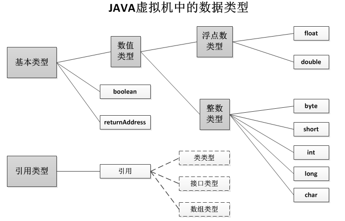

#jvm
##基础理论知识
###jvm的生命周期

* 一个运行中的jvm有着一个清晰的任务：执行Java程序。程序开始执行时他才运行，程序结束时他就停止。你在同一台机器上运行三个程序，就会有三个运行中的jvm。
* jvm总是开始于一个main()方法，这个方法必须是公有、返回void、只接受一个字符串数组。在程序执行时，你必须给jvm指明这个包换main()方法的类名。 Main()方法是程序的起点，他被执行的线程初始化为程序的初始线程。程序中其他的线程都由他来启动。
* Java中的线程分为两种：守护线程（daemon）和普通线程（non-daemon）。守护线程是jvm自己使用的线程，比如负责垃圾收集的线程就是一个守护线程。当然，你也可以把自己的程序设置为守护线程，通过Thread类的setDaemon方法来设置，默认是false。**包含Main()方法的初始线程不是守护线程**。 
    * 只要jvm中还有普通的线程在执行，jvm就不会停止。
    * 当jvm停止时，守护线程也停止，因为已经没有非守护线程需要守护了。
    * 当主线程停止时，非守护线程不一定停止，因为主线程跑完了子线程不一定也跑完。所以主线程跑完了jvm不一定退出。
    * 假若安全管理器允许，程序本身也能够通过调用Runtime类或者System类的exit()方法来退出jvm，此时非守护线程也会被停止。

        ```java
        //强制退出jvm
        Runtime.getRuntime().exit(0);
        System.exit(0);
        ```

###jvm的体系结构
从Java平台的逻辑结构上来看，我们可以从下图来了解JVM：
 

从上图能清晰看到Java平台包含的各个逻辑模块，也能了解到JDK与JRE的区别。

JVM自身的物理结构
在jvm的规范中定义了一系列的子系统、内存区域、数据类型和使用指南。这些组件构成了jvm的内部结构，他们不仅仅为jvm的实现提供了清晰的内部结构，更是严格规定了jvm实现的外部行为。

下图是jvm的结构图，每一个jvm都有一个类加载器子系统（class loader subsystem），它根据给定的全限定名来装入类型（类或接口）。每一个jvm都有一个执行引擎（execution engine）负责执行被加载类中包含的指令。


程序的执行需要一定的内存空间，如字节码、被加载类的其他额外信息、程序中的对象、方法的参数、返回值、本地变量、处理的中间变量等等。jvm将 这些信息统统保存在数据区（data areas）中。虽然每个jvm的实现中都包含数据区，但是jvm规范对数据区的规定却非常的抽象。

许多结构上的细节部分都留给了 jvm实现者自己发挥。不同jvm实现上的内存结构千差万别。一部分实现可能占用很多内存，而其他以下可能只占用很少的内存；一些实现可 能会使用虚拟内存，而其他的则不使用。这种比较精炼的jvm内存规约，可以使得jvm可以在广泛的平台上被实现。

数据区中的一部分是整个程序共有，其他部分被单独的线程控制。**每一个jvm都包含方法区（method area）和堆（heap），他们都被整个程序共享**。jvm加载并解析一个类以后，将从类文件中解析出来的信息保存到方法区中。程序执行时创建的对象都保存在堆中。 

**当每一个新线程被创建时，它都将得到它自己的PC寄存器（程序计数器）以及一个Java栈**，如果线程正在执行的是一个Java方法（非本地方法），那么PC寄存器的值将总是指向下一条将被执行的指令，而它的Java栈则总是存储该线程中Java方法调用的状态——包括它的局部变量，被调用时传进来的参数、返回值，以及运算的中间结果等等。而本地方法调用的状态，则是以某种依赖于具体实现的方法存储在本地方法栈中，也可能是在寄存器或者其他某些与特定实现相关的内存区中。
> 本地方法是指非java方法，如操作系统上的c库等，需要System.loadLibrary加载本地库之后通过native关键字定义方法来调用

> java栈和本地方法栈不同的jvm有不同的实现方式，甚至有的虚拟机把本地方法栈和虚拟机栈合二为一，比如Sun HotSpot 虚拟机。

Java栈是由许多栈帧（stack frame）组成的，一个栈帧包含一个Java方法调用的状态。当线程调用一个Java方法时，虚拟机压入一个新的栈帧到该线程的Java栈中，当该方法返回时，这个栈帧被从Java栈中弹出并抛弃。
> 数据结构中栈遵循LIFO原则，队列才是FIFO原则

jvm没有寄存器，其指令集使用Java栈来存储中间数据。这样设计的原因是为了保持jvm的指令集尽量紧凑，同时也便于jvm在那些只有很少通用寄存器的平台上实现。另外，jvm这种基于栈的体系结构，也有助于运行时某些虚拟机实现的动态编译器和即时编译器的代码优化。

上图展示了一个虚拟机实例的快照，它有三个线程正在执行。线程1和线程2都正在执行Java方法，而线程3则正在执行一个本地方法。

Java栈都是向下生长的，而栈顶都显示在图的底部。当前正在执行的方法的栈帧则以浅色表示，对于一个正在运行Java方法的线程而言，它的PC寄存器总是指向下一条将被执行的指令。比如线程1和线程2都是以浅色显示的，由于线程3当前正在执行一个本地方法，因此，它的PC寄存器——以深色显示的那个，其值是不确定的。

####类加载器子系统
jvm中的类加载器分为两种：原始类加载器（primordial class loader）和类加载器对象（class loader objects）。原始类加载器是jvm实现的一部分，类加载器对象是运行中的程序的一部分。不同类加载器加载的类被不同的命名空间所分割。

类加载器调用了许多jvm中其他的部分和java.lang包中的很多类。比如，类加载对象就是java.lang.ClassLoader子类 的实例，ClassLoader类中的方法可以访问虚拟机中的类加载机制；每一个被jvm加载的类都会被表示为一个 java.lang.Class类的实例。

像其他对象一样，类加载器对象和Class对象都保存在堆中，被加载的信息被保存在方法区中。 

1. 加载、连接、初始化（Loading, Linking and Initialization）
类加载子系统不仅仅负责定位并加载类文件，他按照以下严格的步骤作了很多其他的事情：（具体的信息参见第七章的“类的生命周期”）
    1. 加载：寻找并导入指定类型（类和接口）的二进制信息
    2. 连接：进行验证、准备和解析
        1. 验证：确保导入类型的正确性
        2. 准备：为类型分配内存并初始化为默认值
        3. 解析：将字符引用解析为直接饮用
    3. 初始化：调用Java代码，初始化类变量为合适的值

1. 原始类加载器（The Primordial Class Loader）
每个jvm都必须实现一个原始类加载器，他能够加载那些遵守类文件格式并且被信任的类。但是，jvm的规范并没有定义如何加载类，这由 jvm实现者自己决定。对于给定类型名的类型，原始莱加载器必须找到那个类型名加“.class”的文件并加载入虚拟机中。

3. 类加载器对象
虽然类加载器对象是Java程序的一部分，但是ClassLoader类中的三个方法可以访问jvm中的类加载子系统。
1）、protected final Class defineClass(…)：使用这个方法可以出入一个字节数组，定义一个新的类型。
2）、protected Class findSystemClass(String name)：加载指定的类，如果已经加载，就直接返回。
3）、protected final void resolveClass(Class c)：defineClass()方法只是加载一个类，这个方法负责后续的动态连接和初始化。
具体的信息，参见第八章“连接模型”（ The Linking Model）。

4. 命名空间
当多个类加载器加载了同一个类时，为了保证他们名字的唯一性，需要在类名前加上加载该类的类加载器的标识。具体的信息，参见第八章“连接模型”（ The Linking Model）。
     
####堆
当Java程序创建一个类的实例或者数组时，都在堆中为新的对象分配内存。虚拟机中只有一个堆，所有的线程都共享他。
1. 垃圾收集（Garbage Collection）
垃圾收集是释放没有被引用的对象的主要方法。它也可能会为了减少堆的碎片，而移动对象。在jvm的规范中没有严格定义垃圾收集，只是定义一个jvm的实现必须通过某种方式管理自己的堆。详情参见第九章“Garbage Collection”。
2. 对象存储结构（Object Representation）
jvm的规范中没有定义对象怎样在堆中存储。每一个对象主要存储的是他的类和父类中定义的对象变量。对于给定的对象的引用，虚拟机必须嫩耨很快的 定位到这个对象的数据。另为，必须提供一种通过对象的引用方法对象数据的方法，比如方法区中的对象的引用，所以一个对象保存的数据中往往含有一个某种形式 指向方法区的指针。
一个可能的堆的设计是将堆分为两个部分：引用池和对象池。一个对象的引用就是指向引用池的本地指针。每一个引用池中的条目都包含两个部分：指向对象池中对 象数据的指针和方法区中对象类数据的指针。这种设计能够方便jvm堆碎片的整理。当虚拟机在对象池中移动一个对象的时候，只需要修改对应引用池中 的指针地址。但是每次访问对象的数据都需要处理两次指针。下图演示了这种堆的设计。在第九章的“垃圾收集”中的HeapOfFish Applet演示了这种设计。 
另一种堆的设计是：一个对象的引用就是一个指向一堆数据和指向相应对象的偏移指针。这种设计方便了对象的访问，可是对象的移动要变的异常复杂。下图演示了这种设计 
当程序试图将一个对象转换为另一种类型时，虚拟机需要判断这种转换是否是这个对象的类型，或者是他的父类型。当程序适用instanceof语句的时候也 会做类似的事情。当程序调用一个对象的方法时，虚拟机需要进行动态绑定，他必须判断调用哪一个类型的方法。这也需要做上面的判断。
无论虚拟机实现者使用哪一种设计，他都可能为每一个对象保存一个类似方法列表的信息。因为他可以提升对象方法调用的速度，对提升虚拟机的性能非常重要，但 是虚拟机的规范中比没有要求必须实现类似的数据结构。下图描述了这种结构。图中显示了一个对象引用相关联的所有的数据结构，包括：
    1. 1）、一个指向类型数据的指针
    2. 2）、一个对象的方法列表。方法列表是一个指向所有可能被调用对象方法的指针数组。方法数据包括三个部分：操作码堆栈的大小和方法堆栈的本地变量区；方法的字节码；异常列表。

    每一个jvm中的对象必须关联一个用于同步多线程的lock(mutex)。同一时刻，只能有一个对象拥有这个对象的锁。当一个拥有这个这个对象 的锁，他就可以多次申请这个锁，但是也必须释放相应次数的锁才能真正释放这个对象锁。很多对象在整个生命周期中都不会被锁，所以这个信息只有在需要时才需 要添加。很多jvm的实现都没有在对象的数据中包含“锁定数据”，只是在需要时才生成相应的数据。除了实现对象的锁定，每一个对象还逻辑关联到一 个“wait set”的实现。锁定帮组线程独立处理共享的数据，不需要妨碍其他的线程。“wait set”帮组线程协作完成同一个目标。“wait set”往往通过Object类的wait()和notify()方法来实现。 
垃圾收集也需要堆中的对象是否被关联的信息。jvm规范中指出垃圾收集一个运行一个对象的finalizer方法一次，但是容许 finalizer方法重新引用这个对象，当这个对象再次不被引用时，就不需要再次调用finalize方法。所以虚拟机也需要保存finalize方法 是否运行过的信息。更多信息参见第九章的“垃圾收集”
3. 数组的保存（Array Representation）
在Java 中，数组是一种完全意义上的对象，他和对象一样保存在堆中、有一个指向Class类实例的引用。所有同一维度和类型的数组拥有同样的Class，数组的长 度不做考虑。对应Class的名字表示为维度和类型。比如一个整型数据的Class为“[I”，字节型三维数组Class名为“[[[B”，两维对象数据 Class名为“[[Ljava.lang.Object”。
数组必须在堆中保存数组的长度，数组的数据和一些对象数组类型数据的引用。通过一个数组引用的，虚拟机应该能够取得一个数组的长度，通过索引能够访问特定 的数据，能够调用Object定义的方法。Object是所有数据类的直接父类。更多信息参见第六章“类文件”。
     
####方法区
在jvm中，关于被装载类型的信息存储在一个逻辑上被称为方法区的内存中。当虚拟机装载某个类型时，它使用类装载器定位相应的class文件，然后读入这个class文件——1个线性二进制数据流，然后它传输到虚拟机中，紧接着虚拟机提取其中的类型信息，并将这些信息存储到方法区。该类型中的类（静态）变量同样也是存储在方法区中。

jvm在内部如何存储类型信息，这是由具体实现的设计者来决定的。

当虚拟机运行Java程序时，它会查找使用存储在方法区中的类型信息。由于所有线程都共享方法区，因此它们对方法区数据的访问必须被设计为是线程安全的。比如，假设同时有两个线程都企图访问一个名为Lava的类，而这个类还没有被装入虚拟机，那么，这时只应该有一个线程去装载它，而另一个线程则只能等待。

对于每个装载的类型，虚拟机都会在方法区中存储以下类型信息：
* 这个类型的全限定名
* 这个类型的直接超类的全限定名（除非这个类型是java.lang.Object，它没有超类）
* 这个类型是类类型还是接口类型
* 这个类型的访问修饰符（public、abstract或final的某个子集）
* 任何直接超接口的全限定名的有序列表

除了上面列出的基本类型信息外，虚拟机还得为每个被装载的类型存储以下信息：
* 该类型的常量池
* 字段信息
* 方法信息
* 除了常量以外的所有类（静态）变量
* 一个到类ClassLoader的引用
* 一个到Class类的引用

#####方法区使用实例

为了展示虚拟机如何使用方法区中的信息，下面来举例说明：
```java
class Lava {
 
    private int speed = 5;
    void flow(){
 
    }
}
```
```java
public class Volcano {
 
    public static void main(String[] args){
        Lava lava = new Lava();
        lava.flow();
    }
}
```
不同的虚拟机实现可能会用完全不同的方法来操作，下面描述的只是其中一种可能——但并不是仅有的一种。

要运行Volcano程序，首先得以某种“依赖于实现的”方式告诉虚拟机“Volcano”这个名字。之后，虚拟机将找到并读入相应的class文件“Volcano.class”，然后它会从导入的class文件里的二进制数据中提取类型信息并放到方法区中。通过执行保存在方法区中的字节码，虚拟机开始执行main()方法，在执行时，它会一直持有指向当前类（Volcano类）的常量池（方法区中的一个数据结构）的指针。

注意：虚拟机开始执行Volcano类中main()方法的字节码的时候，尽管Lava类还没被装载，但是和大多数（也许所有）虚拟机实现一样，它不会等到把程序中用到的所有类都装载后才开始运行。恰好相反，它只会需要时才装载相应的类。

main()的第一条指令告知虚拟机为列在常量池第一项的类分配足够的内存。所以虚拟机使用指向Volcano常量池的指针找到第一项，发现它是一个对Lava类的符号引用，然后它就检查方法区，看Lava类是否已经被加载了。

这个符号引用仅仅是一个给出了类Lava的全限定名“Lava”的字符串。为了能让虚拟机尽可能快地从一个名称找到类，虚拟机的设计者应当选择最佳的数据结构和算法。

当虚拟机发现还没有装载过名为“Lava”的类时，它就开始查找并装载文件“Lava.class”，并把从读入的二进制数据中提取的类型信息放在方法区中。

紧接着，虚拟机以一个直接指向方法区Lava类数据的指针来替换常量池第一项（就是那个字符串“Lava”），以后就可以用这个指针来快速地访问Lava类了。这个替换过程称为常量池解析，即把常量池中的符号引用替换为直接引用。

终于，虚拟机准备为一个新的Lava对象分配内存。此时它又需要方法区中的信息。还记得刚刚放到Volcano类常量池第一项的指针吗？现在虚拟机用它来访问Lava类型信息，找出其中记录的这样一条信息：一个Lava对象需要分配多少堆空间。

jvm总能够通过存储与方法区的类型信息来确定一个对象需要多少内存，当jvm确定了一个Lava对象的大小后，它就在堆上分配这么大的空间，并把这个对象实例的变量speed初始化为默认初始值0。

当把新生成的Lava对象的引用压到栈中，main()方法的第一条指令也完成了。接下来的指令通过这个引用调用Java代码（该代码把speed变量初始化为正确初始值5）。另一条指令将用这个引用调用Lava对象引用的flow()方法。
####常量池

虚拟机必须为每个被装载的类型维护一个常量池。常量池就是该类型所用常量的一个有序集合，包括直接常量和对其他类型、字段和方法的符号引用。池中的数据项就像数组一样是通过索引访问的。因为常量池存储了相应类型所用到的所有类型、字段和方法的符号引用，所以它在Java程序的动态连接中起着核心的作用。

* 字段信息
对于类型中声明的每一个字段。方法区中必须保存下面的信息。除此之外，这些字段在类或者接口中的声明顺序也必须保存。
    * 字段名
    * 字段的类型
    * 字段的修饰符（public、private、protected、static、final、volatile、transient的某个子集）

* 方法信息
对于类型中声明的每一个方法，方法区中必须保存下面的信息。和字段一样，这些方法在类或者接口中的声明顺序也必须保存。
    * 方法名
    * 方法的返回类型（或void）
    * 方法参数的数量和类型（按声明顺序）
    * 方法的修饰符（public、private、protected、static、final、synchronized、native、abstract的某个子集）
    
    除了上面清单中列出的条目之外，如果某个方法不是抽象的和本地的，它还必须保存下列信息：
    * 方法的字节码（bytecodes）
    * 操作数栈和该方法的栈帧中的局部变量区的大小
    * 异常表

* 类（静态）变量
类变量是由所有类实例共享的，但是即使没有任何类实例，它也可以被访问。这些变量只与类有关——而非类的实例，因此它们总是作为类型信息的一部分而存储在方法区。除了在类中声明的编译时常量外，虚拟机在使用某个类之前，必须在方法区中为这些类变量分配空间。

    而编译时常量（就是那些用final声明以及用编译时已知的值初始化的类变量）则和一般的类变量处理方式不同，每个使用编译时常量的类型都会复制它的所有常量到自己的常量池中，或嵌入到它的字节码流中。作为常量池或字节码流的一部分，编译时常量保存在方法区中——就和一般的类变量一样。但是当一般的类变量作为声明它们的类型的一部分数据面保存的时候，编译时常量作为使用它们的类型的一部分而保存。

* 指向ClassLoader类的引用
每个类型被装载的时候，虚拟机必须跟踪它是由启动类装载器还是由用户自定义类装载器装载的。如果是用户自定义类装载器装载的，那么虚拟机必须在类型信息中存储对该装载器的引用。这是作为方法表中的类型数据的一部分保存的。

    虚拟机会在动态连接期间使用这个信息。当某个类型引用另一个类型的时候，虚拟机会请求装载发起引用类型的类装载器来装载被引用的类型。这个动态连接的过程，对于虚拟机分离命名空间的方式也是至关重要的。为了能够正确地执行动态连接以及维护多个命名空间，虚拟机需要在方法表中得知每个类都是由哪个类装载器装载的。

* 指向Class类的引用
对于每一个被装载的类型（不管是类还是接口），虚拟机都会相应地为它创建一个java.lang.Class类的实例，而且虚拟机还必须以某种方式把这个实例和存储在方法区中的类型数据关联起来。

    在Java程序中，你可以得到并使用指向Class对象的引用。Class类中的一个静态方法可以让用户得到任何已装载的类的Class实例的引用。

    ```java
    public static Class<?> forName(String className)
    ```
比如，如果调用forName(“java.lang.Object”)，那么将得到一个代表java.lang.Object的Class对象的引用。可以使用forName()来得到代表任何包中任何类型的Class对象的引用，只要这个类型可以被（或者已经被）装载到当前命名空间中。如果虚拟机无法把请求的类型装载到当前命名空间，那么会抛出ClassNotFoundException异常。

    另一个得到Class对象引用的方法是，可以调用任何对象引用的getClass()方法。这个方法被来自Object类本身的所有对象继承：
```java
public final native Class<?> getClass();
```
比如，如果你有一个到java.lang.Integer类的对象的引用，那么你只需简单地调用Integer对象引用的getClass()方法，就可以得到表示java.lang.Integer类的Class对象。
    
####程序计数器
对于一个运行中的Java程序而言，其中的每一个线程都有它自己的PC（程序计数器）寄存器，它是在该线程启动时创建的，PC寄存器的大小是一个字长，因此它既能够持有一个本地指针，也能够持有一个returnAddress。当线程执行某个Java方法时，PC寄存器的内容总是下一条将被执行指令的“地址”，这里的“地址”可以是一个本地指针，也可以是在方法字节码中相对于该方法起始指令的偏移量。如果该线程正在执行一个本地方法，那么此时PC寄存器的值是“undefined”。

 
####Java栈
每当启动一个新线程时，jvm都会为它分配一个Java栈。Java栈以帧为单位保存线程的运行状态。虚拟机只会直接对Java栈执行两种操作：以帧为单位的压栈和出栈。

某个线程正在执行的方法被称为该线程的当前方法，当前方法使用的栈帧称为当前帧，当前方法所属的类称为当前类，当前类的常量池称为当前常量池。在线程执行一个方法时，它会跟踪当前类和当前常量池。此外，当虚拟机遇到栈内操作指令时，它对当前帧内数据执行操作。

每当线程调用一个Java方法时，虚拟机都会在该线程的Java栈中压入一个新帧。而这个新帧自然就成为了当前帧。在执行这个方法时，它使用这个帧来存储参数、局部变量、中间运算结果等数据。

Java方法可以以两种方式完成。一种通过return返回的，称为正常返回；一种是通过抛出异常而异常终止的。不管以哪种方式返回，虚拟机都会将当前帧弹出Java栈然后释放掉，这样上一个方法的帧就成为当前帧了。

Java帧上的所有数据都是此线程私有的。任何线程都不能访问另一个线程的栈数据，因此我们不需要考虑多线程情况下栈数据的访问同步问题。当一个线程调用一个方法时，方法的的局部变量保存在调用线程Java栈的帧中。只有一个线程能总是访问那些局部变量，即调用方法的线程。

 
####本地方法栈
前面提到的所有运行时数据区都是jvm规范中明确定义的，除此之外，对于一个运行中的Java程序而言，它还可能会用到一些跟本地方法相关的数据区。当某个线程调用一个本地方法时，它就进入了一个全新的并且不再受虚拟机限制的世界。本地方法可以通过本地方法接口来访问虚拟机的运行时数据区，但不止如此，它还可以做任何它想做的事情。

本地方法本质上时依赖于实现的，虚拟机实现的设计者们可以自由地决定使用怎样的机制来让Java程序调用本地方法。

任何本地方法接口都会使用某种本地方法栈。当线程调用Java方法时，虚拟机会创建一个新的栈帧并压入Java栈。然而当它调用的是本地方法时，虚拟机会保持Java栈不变，不再在线程的Java栈中压入新的帧，虚拟机只是简单地动态连接并直接调用指定的本地方法。

如果某个虚拟机实现的本地方法接口是使用C连接模型的话，那么它的本地方法栈就是C栈。当C程序调用一个C函数时，其栈操作都是确定的。传递给该函数的参数以某个确定的顺序压入栈，它的返回值也以确定的方式传回调用者。同样，这就是虚拟机实现中本地方法栈的行为。

很可能本地方法接口需要回调jvm中的Java方法，在这种情况下，该线程会保存本地方法栈的状态并进入到另一个Java栈。

下图描绘了这样一个情景，就是当一个线程调用一个本地方法时，本地方法又回调虚拟机中的另一个Java方法。这幅图展示了jvm内部线程运行的全景图。一个线程可能在整个生命周期中都执行Java方法，操作它的Java栈；或者它可能毫无障碍地在Java栈和本地方法栈之间跳转。　　

该线程首先调用了两个Java方法，而第二个Java方法又调用了一个本地方法，这样导致虚拟机使用了一个本地方法栈。假设这是一个C语言栈，其间有两个C函数，第一个C函数被第二个Java方法当做本地方法调用，而这个C函数又调用了第二个C函数。之后第二个C函数又通过本地方法接口回调了一个Java方法（第三个Java方法），最终这个Java方法又调用了一个Java方法（它成为图中的当前方法）。
###数据类型
jvm是通过某些数据类型来执行计算的，数据类型可以分为两种：基本类型和引用类型，基本类型的变量持有原始值，而引用类型的变量持有引用值。



Java语言中的所有基本类型同样也都是jvm中的基本类型。但是**boolean有点特别**，虽然jvm也把boolean看做基本类型，但是指令集对boolean只有很有限的支持，当编译器把Java源代码编译为字节码时，它会用int或者byte来表示boolean。在jvm中，false是由整数零来表示的，所有非零整数都表示true，涉及boolean值的操作则会使用int。另外，boolean数组是当做byte数组来访问的，但是在“堆”区，它也可以被表示为位域。

jvm还有一个只在内部使用的基本类型：returnAddress，Java程序员不能使用这个类型，这个基本类型被用来实现Java程序中的finally子句。该类型是jsr, ret以及jsr_w指令需要使用到的，它的值是JVM指令的操作码的指针。returnAddress类型不是简单意义上的数值，不属于任何一种基本类型，并且它的值是不能被运行中的程序所修改的。

jvm的引用类型被统称为“引用（reference）”，有三种引用类型：类类型、接口类型、以及数组类型，它们的值都是对动态创建对象的引用。类类型的值是对类实例的引用；数组类型的值是对数组对象的引用，在jvm中，数组是个真正的对象；而接口类型的值，则是对实现了该接口的某个类实例的引用。还有一种特殊的引用值是null，它表示该引用变量没有引用任何对象。

###JAVA中方法参数的引用传递
java中参数的传递有两种，分别是按值传递和按引用传递。按值传递不必多说，下面就说一下按引用传递。

“当一个对象被当作参数传递到一个方法”，这就是所谓的按引用传递。

```java
public class User {
    private String name;
    public String getName() {
        return name;
    }
    public void setName(String name) {
        this.name = name;
    }
}
```
```java
public class Test {
    public void set(User user){
        user.setName("hello world");
    }
    public static void main(String[] args) {
        Test test = new Test();
        User user = new User();
        test.set(user);
        System.out.println(user.getName());
    }
}
```
上面代码的输出结果是“hello world”，这不必多说，那如果将set方法改为如下，结果会是多少呢？
```java
public void set(User user){
    user.setName("hello world");
    user = new User();
    user.setName("change");
}
```
答案依然是“hello world”，下面就让我们来分析一下如上代码。

首先
```java
User user = new User();
```
是在堆中创建了一个对象，并在栈中创建了一个引用，此引用指向该对象，如下图：


```java
test.set(user);
```

是将引用user作为参数传递到set方法，注意：这里传递的并不是引用本身，而是一个引用的拷贝。也就是说这时有两个引用（引用和引用的拷贝）同时指向堆中的对象，如下图：


```java
user.setName("hello world");
```
在set()方法中，“user引用的拷贝”操作堆中的User对象，给name属性设置字符串”hello world”。如下图：


```java
user = new User();
```
在set()方法中，又创建了一个User对象，并将“user引用的拷贝”指向这个在堆中新创建的对象，如下图：


```java
user.setName("change");
```
在set()方法中，“user引用的拷贝”操作的是堆中新创建的User对象。


set()方法执行完毕，目光再回到mian()方法
```java
System.out.println(user.getName());
```
 

因为之前，”user引用的拷贝”已经将堆中的User对象的name属性设置为了”hello world”，所以当main()方法中的user调用getName()时，打印的结果就是”hello world”。如下图：


     
###数组的内部表示

在Java中，数组是真正的对象。和其他对象一样，数组总是存储在堆中。同样，数组也拥有一个与它们的类相关联的Class实例，所有具有相同维度和类型的数组都是同一个类的实例，而不管数组的长度（多维数组每一维的长度）是多少。例如一个包含3个int整数的数组和一个包含300个整数的数组拥有同一个类。数组的长度只与实例数据有关。

数组类的名称由两部分组成：每一维用一个方括号“[”表示，用字符或字符串表示元素类型。比如，元素类型为int整数的、一维数组的类名为“[I”，元素类型为byte的三维数组为“[[[B”，元素类型为Object的二维数组为“[[Ljava/lang/Object”。

多维数组被表示为数组的数组。比如，int类型的二维数组，将表示为一个一维数组，其中的每一个元素是一个一维int数组的引用，如下图：


在堆中的每个数组对象还必须保存的数据时数组的长度、数组数据，以及某些指向数组的类数据的引用。虚拟机必须能够通过一个数组对象的引用得到此数组的长度，通过索引访问其元素（期间要检查数组边界是否越界），调用所有数组的直接超类Object声明的方法等等。

---
##执行流程
###Java代码编译和执行的整个过程
Java代码编译是由Java源码编译器来完成，流程图如下所示：

 

 

Java字节码的执行是由JVM执行引擎来完成，流程图如下所示：

 
 

Java代码编译和执行的整个过程包含了以下三个重要的机制：

Java源码编译机制
类加载机制
类执行机制
###Java源码编译机制
Java 源码编译由以下三个过程组成：（javac –verbose  输出有关编译器正在执行的操作的消息）

* 分析和输入到符号表
* 注解处理
* 语义分析和生成class文件
 

最后生成的class文件由以下部分组成：

结构信息。包括class文件格式版本号及各部分的数量与大小的信息
元数据。对应于Java源码中声明与常量的信息。包含类/继承的超类/实现的接口的声明信息、域与方法声明信息和常量池
方法信息。对应Java源码中语句和表达式对应的信息。包含字节码、异常处理器表、求值栈与局部变量区大小、求值栈的类型记录、调试符号信息
、

###类加载机制
JVM的类加载是通过ClassLoader及其子类来完成的，类的层次关系和加载顺序可以由下图来描述：

 

1）Bootstrap ClassLoader /启动类加载器

 

$JAVA_HOME中jre/lib/rt.jar里所有的class，由C++实现，不是ClassLoader子类

 

2）Extension ClassLoader/扩展类加载器

 

负责加载java平台中扩展功能的一些jar包，包括$JAVA_HOME中jre/lib/*.jar或-Djava.ext.dirs指定目录下的jar包

 

3）App ClassLoader/ 系统类加载器

 

负责记载classpath中指定的jar包及目录中class

 

4）Custom ClassLoader/用户自定义类加载器(java.lang.ClassLoader的子类)

 

属于应用程序根据自身需要自定义的ClassLoader，如tomcat、jboss都会根据j2ee规范自行实现ClassLoader

 

加载过程中会先检查类是否被已加载，检查顺序是自底向上，从Custom ClassLoader到BootStrap ClassLoader逐层检查，只要某个classloader已加载就视为已加载此类，保证此类只所有ClassLoader加载一次。而加载的顺序是自顶向下，也就是由上层来逐层尝试加载此类。

 

 

####类加载双亲委派机制介绍和分析
在这里，需要着重说明的是，JVM在加载类时默认采用的是双亲委派机制。通俗的讲，就是某个特定的类加载器在接到加载类的请求时，首先将加载任务委托给父类加载器，依次递归，如果父类加载器可以完成类加载任务，就成功返回；只有父类加载器无法完成此加载任务时，才自己去加载。

 

###类执行机制
　　JVM是基于栈的体系结构来执行class字节码的。线程创建后，都会产生程序计数器（PC）和栈（Stack），程序计数器存放下一条要执行的指令在方法内的偏移量，栈中存放一个个栈帧，每个栈帧对应着每个方法的每次调用，而栈帧又是有局部变量区和操作数栈两部分组成，局部变量区用于存放方法中的局部变量和参数，操作数栈中用于存放方法执行过程中产生的中间结果。

##内存管理和垃圾回收
###JVM内存回收
Sun的JVMGenerationalCollecting(垃圾回收)原理是这样的：把对象分为年青代(Young)、年老代(Tenured)、持久代(Perm)，对不同生命周期的对象使用不同的算法。(基于对对象生命周期分析)

 

(1).Young（年轻代）

年轻代分三个区。一个Eden区，两个Survivor区。大部分对象在Eden区中生成。当Eden区满时，还存活的对象将被复制到Survivor区（两个中的一个），当这个Survivor区满时，此区的存活对象将被复制到另外一个Survivor区，当这个Survivor去也满了的时候，从第一个Survivor区复制过来的并且此时还存活的对象，将被复制年老区(Tenured。需要注意，Survivor的两个区是对称的，没先后关系，所以同一个区中可能同时存在从Eden复制过来对象，和从前一个Survivor复制过来的对象，而复制到年老区的只有从第一个Survivor去过来的对象。而且，Survivor区总有一个是空的。

(2).Tenured（年老代）

年老代存放从年轻代存活的对象。一般来说年老代存放的都是生命期较长的对象。

(3).Perm（持久代）

用于存放静态文件，如今Java类、方法等。持久代对垃圾回收没有显著影响，但是有些应用可能动态生成或者调用一些class，例如Hibernate等，在这种时候需要设置一个比较大的持久代空间来存放这些运行过程中新增的类。持久代大小通过-XX:MaxPermSize=进行设置。

举个例子：当在程序中生成对象时，正常对象会在年轻代中分配空间，如果是过大的对象也可能会直接在年老代生成（据观测在运行某程序时候每次会生成一个十兆的空间用收发消息，这部分内存就会直接在年老代分配）。年轻代在空间被分配完的时候就会发起内存回收，大部分内存会被回收，一部分幸存的内存会被拷贝至Survivor的from区，经过多次回收以后如果from区内存也分配完毕，就会也发生内存回收然后将剩余的对象拷贝至to区。等到to区也满的时候，就会再次发生内存回收然后把幸存的对象拷贝至年老区。

通常我们说的JVM内存回收总是在指**堆内存回收**，确实只有堆中的内容是动态申请分配的，所以以上对象的年轻代和年老代都是指的JVM的Heap空间，而持久代则是之前提到的MethodArea，不属于Heap。

###关于JVM内存管理的一些建议
* 手动将生成的无用对象，中间对象置为null，加快内存回收。

* 对象池技术如果生成的对象是可重用的对象，只是其中的属性不同时，可以考虑采用对象池来较少对象的生成。如果有空闲的对象就从对象池中取出使用，没有再生成新的对象，大大提高了对象的复用率。

* JVM调优通过配置JVM的参数来提高垃圾回收的速度，如果在没有出现内存泄露且上面两种办法都不能保证JVM内存回收时，可以考虑采用JVM调优的方式来解决，不过一定要经过实体机的长期测试，因为不同的参数可能引起不同的效果。如-Xnoclassgc参数等。

###jvm优化