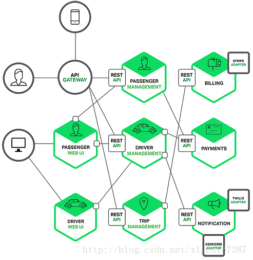
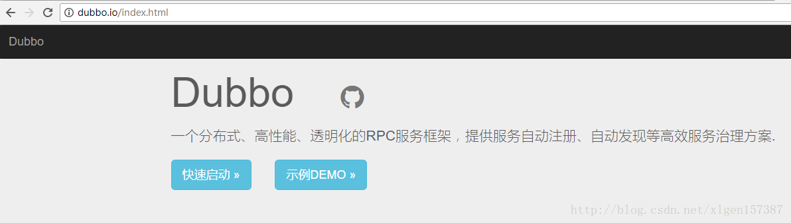
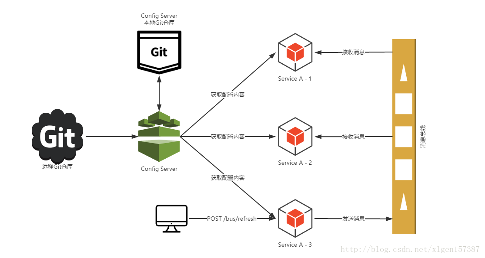

### Spring Cloud全家桶主要组件及简要介绍 
#### 一、微服务简介

微服务是最近的一两年的时间里是很火的一个概念。感觉不学习一下都快跟不上时代的步伐了，下边做一下简单的总结和介绍。

何为微服务？简而言之，微服务架构风格这种开发方法，是以开发一组小型服务的方式来开发一个独立的应用系统的。其中每个小型服务都运行在自己的进程中，并经常采用HTTP资源API这样轻量的机制来相互通信。这些服务围绕业务功能进行构建，并能通过全自动的部署机制来进行独立部署。这些微服务可以使用不同的语言来编写，并且可以使用不同的数据存储技术。对这些微服务我们仅做最低限度的集中管理。

一个微服务一般完成某个特定的功能，比如下单管理、客户管理等等。每一个微服务都是微型六角形应用，都有自己的业务逻辑和适配器。一些微服务还会发布API给其它微服务和应用客户端使用。其它微服务完成一个Web UI，运行时，每一个实例可能是一个云VM或者是Docker容器。

比如，一个前面描述系统可能的分解如下：



总的来说，微服务的主旨是将一个原本独立的系统拆分成多个小型服务，这些小型服务都在各自独立的进程中运行，服务之间通过基于HTTP的RESTful API进行通信协作，并且每个服务都维护着自身的数据存储、业务开发、自动化测试以及独立部署机制。

#### 二、微服务的特征

1、每个微服务可独立运行在自己的进程里；

2、一系列独立运行的微服务共同构建起了整个系统；

3、每个服务为独立的业务开发，一个微服务一般完成某个特定的功能，比如：订单管理、用户管理等；

4、微服务之间通过一些轻量的通信机制进行通信，例如通过REST API或者RPC的方式进行调用。

扩展阅读：深度剖析微服务架构的九大特征: http://developer.51cto.com/art/201608/516401.htm

#### 三、微服务的优缺点

1、易于开发和维护 
2、启动较快 
3、局部修改容易部署 
4、技术栈不受限 
5、按需伸缩 
6、DevOps

扩展阅读：微服务架构的优势与不足 ：http://dockone.io/article/394

#### 四、常见微服务框架

1、服务治理框架

（1）Dubbo（http://dubbo.io/）、Dubbox（当当网对Dubbo的扩展）



扩展阅读：Dubbo详细介绍与安装使用过程: http://blog.csdn.net/xlgen157387/article/details/51865289

最近的好消息是Dubbo已近重新开始进行运维啦！

（2）Netflix的Eureka、Apache的Consul等。

Spring Cloud Eureka是对Netflix的Eureka的进一步封装。

2、分布式配置管理

（1）百度的Disconf


（2）360的QConf

（3）Spring Cloud组件中的Config

（3）淘宝的Diamond

3、批量任务框架

（1）Spring Cloud组件中的Task 
（2）LTS

4、服务追踪框架

。。。

#### 五、Spring Cloud全家桶组件

在介绍Spring Cloud 全家桶之前，首先要介绍一下Netflix ，Netflix 是一个很伟大的公司，在Spring Cloud项目中占着重要的作用，Netflix 公司提供了包括Eureka、Hystrix、Zuul、Archaius等在内的很多组件，在微服务架构中至关重要，Spring在Netflix 的基础上，封装了一系列的组件，命名为：Spring Cloud Eureka、Spring Cloud Hystrix、Spring Cloud Zuul等，下边对各个组件进行分别得介绍：

（1）Spring Cloud Eureka

我们使用微服务，微服务的本质还是各种API接口的调用，那么我们怎么产生这些接口、产生了这些接口之后如何进行调用那？如何进行管理哪？

答案就是Spring Cloud Eureka，我们可以将自己定义的API 接口注册到Spring Cloud Eureka上，Eureka负责服务的注册于发现，如果学习过Zookeeper的话，就可以很好的理解，Eureka的角色和 Zookeeper的角色差不多，都是服务的注册和发现，构成Eureka体系的包括：服务注册中心、服务提供者、服务消费者。


上图中描述了（图片来源于网络）：

1、两台Eureka服务注册中心构成的服务注册中心的主从复制集群； 
2、然后服务提供者向注册中心进行注册、续约、下线服务等； 
3、服务消费者向Eureka注册中心拉去服务列表并维护在本地（这也是客户端发现模式的机制体现！）； 
4、然后服务消费者根据从Eureka服务注册中心获取的服务列表选取一个服务提供者进行消费服务。

（2）Spring Cloud Ribbon

在上Spring Cloud Eureka描述了服务如何进行注册，注册到哪里，服务消费者如何获取服务生产者的服务信息，但是Eureka只是维护了服务生产者、注册中心、服务消费者三者之间的关系，真正的服务消费者调用服务生产者提供的数据是通过Spring Cloud Ribbon来实现的。

在（1）中提到了服务消费者是将服务从注册中心获取服务生产者的服务列表并维护在本地的，这种客户端发现模式的方式是服务消费者选择合适的节点进行访问服务生产者提供的数据，这种选择合适节点的过程就是Spring Cloud Ribbon完成的。

Spring Cloud Ribbon客户端负载均衡器由此而来。

（3）Spring Cloud Feign

上述（1）、（2）中我们已经使用最简单的方式实现了服务的注册发现和服务的调用操作，如果具体的使用Ribbon调用服务的话，你就可以感受到使用Ribbon的方式还是有一些复杂，因此Spring Cloud Feign应运而生。

Spring Cloud Feign 是一个声明web服务客户端，这使得编写Web服务客户端更容易，使用Feign 创建一个接口并对它进行注解，它具有可插拔的注解支持包括Feign注解与JAX-RS注解，Feign还支持可插拔的编码器与解码器，Spring Cloud 增加了对 Spring MVC的注解，Spring Web 默认使用了HttpMessageConverters, Spring Cloud 集成 Ribbon 和 Eureka 提供的负载均衡的HTTP客户端 Feign。

简单的可以理解为：Spring Cloud Feign 的出现使得Eureka和Ribbon的使用更为简单。

（4）Spring Cloud Hystrix

我们在（1）、（2）、（3）中知道了使用Eureka进行服务的注册和发现，使用Ribbon实现服务的负载均衡调用，还知道了使用Feign可以简化我们的编码。但是，这些还不足以实现一个高可用的微服务架构。

例如：当有一个服务出现了故障，而服务的调用方不知道服务出现故障，若此时调用放的请求不断的增加，最后就会等待出现故障的依赖方 相应形成任务的积压，最终导致自身服务的瘫痪。

Spring Cloud Hystrix正是为了解决这种情况的，防止对某一故障服务持续进行访问。Hystrix的含义是：断路器，断路器本身是一种开关装置，用于我们家庭的电路保护，防止电流的过载，当线路中有电器发生短路的时候，断路器能够及时切换故障的电器，防止发生过载、发热甚至起火等严重后果。

（5）Spring Cloud Config

对于微服务还不是很多的时候，各种服务的配置管理起来还相对简单，但是当成百上千的微服务节点起来的时候，服务配置的管理变得会复杂起来。

分布式系统中，由于服务数量巨多，为了方便服务配置文件统一管理，实时更新，所以需要分布式配置中心组件。在Spring Cloud中，有分布式配置中心组件Spring Cloud Config ，它支持配置服务放在配置服务的内存中（即本地），也支持放在远程Git仓库中。在Cpring Cloud Config 组件中，分两个角色，一是Config Server，二是Config Client。

Config Server用于配置属性的存储，存储的位置可以为Git仓库、SVN仓库、本地文件等，Config Client用于服务属性的读取。


（6）Spring Cloud Zuul

我们使用Spring Cloud Netflix中的Eureka实现了服务注册中心以及服务注册与发现；而服务间通过Ribbon或Feign实现服务的消费以及均衡负载；通过Spring Cloud Config实现了应用多环境的外部化配置以及版本管理。为了使得服务集群更为健壮，使用Hystrix的融断机制来避免在微服务架构中个别服务出现异常时引起的故障蔓延。


先来说说这样架构需要做的一些事儿以及存在的不足：

1、首先，破坏了服务无状态特点。为了保证对外服务的安全性，我们需要实现对服务访问的权限控制，而开放服务的权限控制机制将会贯穿并污染整个开放服务的业务逻辑，这会带来的最直接问题是，破坏了服务集群中REST API无状态的特点。从具体开发和测试的角度来说，在工作中除了要考虑实际的业务逻辑之外，还需要额外可续对接口访问的控制处理。

2、其次，无法直接复用既有接口。当我们需要对一个即有的集群内访问接口，实现外部服务访问时，我们不得不通过在原有接口上增加校验逻辑，或增加一个代理调用来实现权限控制，无法直接复用原有的接口。 
面对类似上面的问题，我们要如何解决呢？下面进入本文的正题：服务网关！

为了解决上面这些问题，我们需要将权限控制这样的东西从我们的服务单元中抽离出去，而最适合这些逻辑的地方就是处于对外访问最前端的地方，我们需要一个更强大一些的均衡负载器，它就是本文将来介绍的：服务网关。

服务网关是微服务架构中一个不可或缺的部分。通过服务网关统一向外系统提供REST API的过程中，除了具备服务路由、均衡负载功能之外，它还具备了权限控制等功能。Spring Cloud Netflix中的Zuul就担任了这样的一个角色，为微服务架构提供了前门保护的作用，同时将权限控制这些较重的非业务逻辑内容迁移到服务路由层面，使得服务集群主体能够具备更高的可复用性和可测试性。

（7）Spring Cloud Bus

在（5）Spring Cloud Config中，我们知道的配置文件可以通过Config Server存储到Git等地方，通过Config Client进行读取，但是我们的配置文件不可能是一直不变的，当我们的配置文件放生变化的时候如何进行更新哪？

一种最简单的方式重新一下Config Client进行重新获取，但Spring Cloud绝对不会让你这样做的，Spring Cloud Bus正是提供一种操作使得我们在不关闭服务的情况下更新我们的配置。

Spring Cloud Bus官方意义：消息总线。

当然动态更新服务配置只是消息总线的一个用处，还有很多其他用处。



#### 六、总结

Spring Cloud 的组件还不止这些，通过上边的口水话的介绍，应该可以大致有一定的了解，但是每一个组件的功能远不止上述介绍的那些，每一个组件还有很多其他的功能点，这里的介绍希望能够带大家入个门，不要对微服务这个这么大的概念有所畏惧。

另外，附上最近学习的时候写的代码，希望对大家有帮助！

http://git.oschina.net/xuliugen/springcloud-demo


---
### 面试题
#### 什么是Spring Cloud？

Spring cloud流应用程序启动器是基于Spring Boot的Spring集成应用程序，提供与外部系统的集成。Spring cloud Task，一个生命周期短暂的微服务框架，用于快速构建执行有限数据处理的应用程序。


#### 使用Spring Cloud有什么优势？

使用Spring Boot开发分布式微服务时，我们面临以下问题

与分布式系统相关的复杂性-这种开销包括网络问题，延迟开销，带宽问题，安全问题。

服务发现-服务发现工具管理群集中的流程和服务如何查找和互相交谈。它涉及一个服务目录，在该目录中注册服务，然后能够查找并连接到该目录中的服务。

冗余-分布式系统中的冗余问题。

负载平衡 --负载平衡改善跨多个计算资源的工作负荷，诸如计算机，计算机集群，网络链路，中央处理单元，或磁盘驱动器的分布。

性能-问题 由于各种运营开销导致的性能问题。

部署复杂性-Devops技能的要求。

#### 服务注册和发现是什么意思？Spring Cloud如何实现？

当我们开始一个项目时，我们通常在属性文件中进行所有的配置。随着越来越多的服务开发和部署，添加和修改这些属性变得更加复杂。有些服务可能会下降，而某些位置可能会发生变化。手动更改属性可能会产生问题。 Eureka服务注册和发现可以在这种情况下提供帮助。由于所有服务都在Eureka服务器上注册并通过调用Eureka服务器完成查找，因此无需处理服务地点的任何更改和处理。


#### 负载平衡的意义什么？

在计算中，负载平衡可以改善跨计算机，计算机集群，网络链接，中央处理单元或磁盘驱动器等多种计算资源的工作负载分布。负载平衡旨在优化资源使用，最大化吞吐量，最小化响应时间并避免任何单一资源的过载。使用多个组件进行负载平衡而不是单个组件可能会通过冗余来提高可靠性和可用性。负载平衡通常涉及专用软件或硬件，例如多层交换机或域名系统服务器进程。


#### 什么是Hystrix？它如何实现容错？ 

 Hystrix是一个延迟和容错库，旨在隔离远程系统，服务和第三方库的访问点，当出现故障是不可避免的故障时，停止级联故障并在复杂的分布式系统中实现弹性。

通常对于使用微服务架构开发的系统，涉及到许多微服务。这些微服务彼此协作。 

思考以下微服务


假设如果上图中的微服务9失败了，那么使用传统方法我们将传播一个异常。但这仍然会导致整个系统崩溃。 

随着微服务数量的增加，这个问题变得更加复杂。微服务的数量可以高达1000.这是hystrix出现的地方 我们将使用Hystrix在这种情况下的Fallback方法功能。我们有两个服务employee-consumer使用由employee-consumer公开的服务。 

简化图如下所示 


现在假设由于某种原因，employee-producer公开的服务会抛出异常。我们在这种情况下使用Hystrix定义了一个回退方法。这种后备方法应该具有与公开服务相同的返回类型。如果暴露服务中出现异常，则回退方法将返回一些值。


#### 什么是Hystrix断路器？我们需要它吗？ 

由于某些原因，employee-consumer公开服务会引发异常。在这种情况下使用Hystrix我们定义了一个回退方法。如果在公开服务中发生异常，则回退方法返回一些默认值。

  

如果firstPage method() 中的异常继续发生，则Hystrix电路将中断，并且员工使用者将一起跳过firtsPage方法，并直接调用回退方法。 断路器的目的是给第一页方法或第一页方法可能调用的其他方法留出时间，并导致异常恢复。可能发生的情况是，在负载较小的情况下，导致异常的问题有更好的恢复机会 。


#### 什么是Netflix Feign？它的优点是什么？

 Feign是受到Retrofit，JAXRS-2.0和WebSocket启发的java客户端联编程序。Feign的第一个目标是将约束分母的复杂性统一到http apis，而不考虑其稳定性。在employee-consumer的例子中，我们使用了employee-producer使用REST模板公开的REST服务。

但是我们必须编写大量代码才能执行以下步骤

使用功能区进行负载平衡。

获取服务实例，然后获取基本URL。

利用REST模板来使用服务。 前面的代码如下

```java
@Controller
public class ConsumerControllerClient {

@Autowired
private LoadBalancerClient loadBalancer;

public void getEmployee() throws RestClientException, IOException {

    ServiceInstance serviceInstance=loadBalancer.choose('employee-producer');

    System.out.println(serviceInstance.getUri());

    String baseUrl=serviceInstance.getUri().toString();

    baseUrl=baseUrl+'/employee';

    RestTemplate restTemplate = new RestTemplate();
    ResponseEntity response=null;
    try{
    response=restTemplate.exchange(baseUrl,
            HttpMethod.GET, getHeaders(),String.class);
    }catch (Exception ex)
    {
        System.out.println(ex);
    }
    System.out.println(response.getBody());
}
```
之前的代码，有像NullPointer这样的例外的机会，并不是最优的。我们将看到如何使用Netflix Feign使呼叫变得更加轻松和清洁。如果Netflix Ribbon依赖关系也在类路径中，那么Feign默认也会负责负载平衡。


#### 什么是Spring Cloud Bus？我们需要它吗？ 

考虑以下情况：我们有多个应用程序使用Spring Cloud Config读取属性，而Spring Cloud Config从GIT读取这些属性。 

下面的例子中多个员工生产者模块从Employee Config Module获取Eureka注册的财产。


如果假设GIT中的Eureka注册属性更改为指向另一台Eureka服务器，会发生什么情况。在这种情况下，我们将不得不重新启动服务以获取更新的属性。

还有另一种使用执行器端点/刷新的方式。但是我们将不得不为每个模块单独调用这个url。例如，如果Employee Producer1部署在端口8080上，则调用 http：// localhost：8080 / refresh。同样对于Employee Producer2 http：// localhost：8081 / refresh等等。这又很麻烦。这就是Spring Cloud Bus发挥作用的地方。 


Spring Cloud Bus提供了跨多个实例刷新配置的功能。因此，在上面的示例中，如果我们刷新Employee Producer1，则会自动刷新所有其他必需的模块。如果我们有多个微服务启动并运行，这特别有用。这是通过将所有微服务连接到单个消息代理来实现的。无论何时刷新实例，此事件都会订阅到侦听此代理的所有微服务，并且它们也会刷新。可以通过使用端点/总线/刷新来实现对任何单个实例的刷新。

#### 什么是springboot

        用来简化spring应用的初始搭建以及开发过程 使用特定的方式来进行配置（properties或yml文件） 

                创建独立的spring引用程序 main方法运行

                嵌入的Tomcat 无需部署war文件

                简化maven配置

                自动配置spring添加对应功能starter自动化配置

                

#### springboot常用的starter有哪些

        spring-boot-starter-web 嵌入tomcat和web开发需要servlet与jsp支持

        spring-boot-starter-data-jpa 数据库支持

        spring-boot-starter-data-redis redis数据库支持

        spring-boot-starter-data-solr solr支持

        mybatis-spring-boot-starter 第三方的mybatis集成starter

        

#### springboot自动配置的原理

        在spring程序main方法中 添加@SpringBootApplication或者@EnableAutoConfiguration

        会自动去maven中读取每个starter中的spring.factories文件  该文件里配置了所有需要被创建spring容器中的bean

 

#### springboot读取配置文件的方式

        springboot默认读取配置文件为application.properties或者是application.yml

        

springboot集成mybatis的过程

        添加mybatis的starter maven依赖

                
```xml
<dependency>

                        <groupId>org.mybatis.spring.boot</groupId>

                        <artifactId>mybatis-spring-boot-starter</artifactId>

                        <version>1.2.0</version>

                </dependency>
```

        在mybatis的接口中 添加@Mapper注解

        在application.yml配置数据源信息

        

#### springboot如何添加【修改代码】自动重启功能

        添加开发者工具集=====spring-boot-devtools


```xml
<dependencies>
	<dependency>
		<groupId>org.springframework.boot</groupId>
		<artifactId>spring-boot-devtools</artifactId>
		<optional>true</optional>
	</dependency>
</dependencies>
```
        

#### 什么是微服务

        以前的模式是 所有的代码在同一个工程中 部署在同一个服务器中 同一个项目的不同模块不同功能互相抢占资源

        微服务 将工程根据不同的业务规则拆分成微服务 微服务部署在不同的机器上 服务之间进行相互调用

        Java微服务的框架有 dubbo（只能用来做微服务），spring cloud（提供了服务的发现，断路器等）

        

#### springcloud如何实现服务的注册和发现

        服务在发布时 指定对应的服务名（服务名包括了IP地址和端口） 将服务注册到注册中心（eureka或者zookeeper）

        这一过程是springcloud自动实现 只需要在main方法添加@EnableDisscoveryClient  同一个服务修改端口就可以启动多个实例

        调用方法：传递服务名称通过注册中心获取所有的可用实例 通过负载均衡策略调用（ribbon和feign）对应的服务

 

#### ribbon和feign区别

        Ribbon添加maven依赖 spring-starter-ribbon 使用@RibbonClient(value="服务名称") 使用RestTemplate调用远程服务对应的方法

        feign添加maven依赖 spring-starter-feign 服务提供方提供对外接口 调用方使用 在接口上使用@FeignClient("指定服务名")

Ribbon和Feign的区别：

        Ribbon和Feign都是用于调用其他服务的，不过方式不同。

        1.启动类使用的注解不同，Ribbon用的是@RibbonClient，Feign用的是@EnableFeignClients。

        2.服务的指定位置不同，Ribbon是在@RibbonClient注解上声明，Feign则是在定义抽象方法的接口中使用@FeignClient声明。

        3.调用方式不同，Ribbon需要自己构建http请求，模拟http请求然后使用RestTemplate发送给其他服务，步骤相当繁琐。

        Feign则是在Ribbon的基础上进行了一次改进，采用接口的方式，将需要调用的其他服务的方法定义成抽象方法即可，

        不需要自己构建http请求。不过要注意的是抽象方法的注解、方法签名要和提供服务的方法完全一致。

        

#### springcloud断路器的作用

        当一个服务调用另一个服务由于网络原因或者自身原因出现问题时 调用者就会等待被调用者的响应 当更多的服务请求到这些资源时

                导致更多的请求等待 这样就会发生连锁效应（雪崩效应） 断路器就是解决这一问题

                断路器有完全打开状态

                        一定时间内 达到一定的次数无法调用 并且多次检测没有恢复的迹象 断路器完全打开，那么下次请求就不会请求到该服务

                半开

                        短时间内 有恢复迹象 断路器会将部分请求发给该服务 当能正常调用时 断路器关闭

                关闭

                        当服务一直处于正常状态 能正常调用 断路器关闭

---
