# Spring Boot的自动配置原理
在微服务概念兴起的今天，很多公司转型使用微服务作为架构。在技术选型上Spring Cloud 是非常好的选择，它提供了一站式的分布式系统解决方案，而Spring Cloud中的每个组件都是基于Spring Boot构建的，Spring Boot提供J2EE一站式解决方案，具有以下优点：

* 快速创建独立运行的Spring项目以及与主流框架集成
* 使用嵌入式的Servlet容器，应用无需打成WAR包
* starters自动依赖与版本控制
* 大量的自动配置，简化开发，也可修改默认值
* 无需配置XML，无代码生成，开箱即用
* 准生产环境的运行时应用监控
* 与云计算的天然集成

今天就深入探讨以下Spring Boot 是如何做到自动配置的
## @EnableAutoConfiguration的作用
@EnableAutoConfiguration注解的作用就是利用EnableAutoConfigurationImportSelector给容器中导入一些组件，下面具体看一下是如何做到的。
Spring Boot 程序入口有@SpringBootApplication 注解。

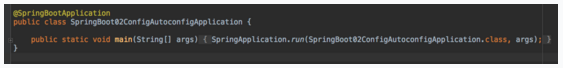

进入@SpringBootApplication 注解可以看到他的定义：

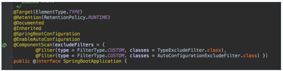


Spring Boot程序的入口会加载主配置类，并且通过@EnableAutoConfiguration 开启自动配置的功能。该注解会引入EnableAutoConfigurationImportSelector类。该类又会继承AutoConfigurationImportSelector类

## EnableAutoConfigurationImportSelector

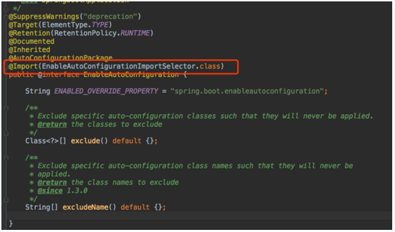

## AutoConfigurationImportSelector

AutoConfigurationImportSelector中方法selectImports的源码如下：

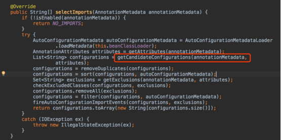


该方法会去获取所有自动配置类的名称。

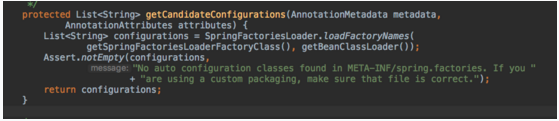


## SpringFactoriesLoader

SpringFactoriesLoader类中给的loadFactoryNames的源码如下

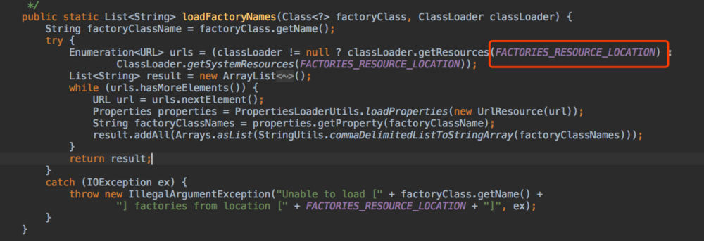


其中FACTORIES_RESOURCE_LOCATION的值如下：

```java
public static final String FACTORIES_RESOURCE_LOCATION = "META-INF/spring.factories";
```

可以看到该方法会扫描jar包路径下的META-INF/spring.factories 文件，把扫描到的这些文件内容包装成properties对象。再从properties中获取到EnableAutoConfiguration.class类（类名）对应的值，并且把他们添加到容器中。我们打开spring.factories文件

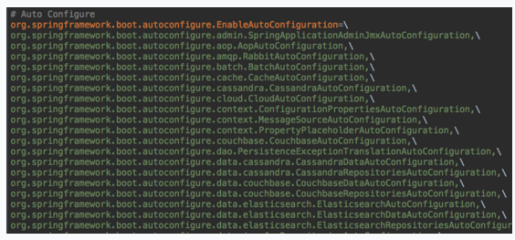


看到的非常多的xxxxAutoConfiguration类，这些类都是容器中的一个组件，加入到容器中，用他们做自动配置。
## HttpEncodingAutoConfiguration
在这么多xxxxAutoConfiguration中，我们以HttpEncodingAutoConfiguration（Http自动编码）为例

```java
@Configuration    
//表示这是一个配置类，以前编写的配置文件一样，也可以给容器中添加组件

@EnableConfigurationProperties(HttpEncodingProperties.class)
//启动指定类的ConfigurationProperties功能；将配置文件中对应的值和HttpEncodingProperties绑定起来；并把HttpEncodingProperties加入到ioc容器中

@ConditionalOnWebApplication
//Spring底层@Conditional注解（Spring注解版），根据不同的条件，如果满足指定的条件，整个配置类里面的配置就会生效；这里是判断当前应用是否是web应用，如果是，当前配置类生效

@ConditionalOnClass(CharacterEncodingFilter.class)
//判断当前项目有没有这个类CharacterEncodingFilter；SpringMVC中进行乱码解决的过滤器；

@ConditionalOnProperty(prefix = "spring.http.encoding", value = "enabled", matchIfMissing = true)
//判断配置文件中是否存在某个配置 spring.http.encoding.enabled；如果不存在，判断也是成立的
//即使我们配置文件中不配置pring.http.encoding.enabled=true，也是默认生效的；

public class HttpEncodingAutoConfiguration {

    //他已经和SpringBoot的配置文件映射了
    private final HttpEncodingProperties properties;

    //只有一个有参构造器的情况下，参数的值就会从容器中拿
    public HttpEncodingAutoConfiguration(HttpEncodingProperties properties) {
        this.properties = properties;
    }

    @Bean
    //给容器中添加一个组件，这个组件的某些值需要从properties中获取
    @ConditionalOnMissingBean(CharacterEncodingFilter.class)
    //判断容器没有这个组件
    public CharacterEncodingFilter characterEncodingFilter() {
        CharacterEncodingFilter filter = new OrderedCharacterEncodingFilter();
        filter.setEncoding(this.properties.getCharset().name());
        filter.setForceRequestEncoding(this.properties.shouldForce(Type.REQUEST));
        filter.setForceResponseEncoding(this.properties.shouldForce(Type.RESPONSE));
        return filter;
    }
    }
    .......
}
```

通过上面的类的注解可以看到，通过使用@EnableConfigurationProperties，可以把配置文件中的属性与HttpEncodingProperties类绑定起来并且加入到IOC容器中，进入HttpEncodingProperties类，可以看到他是通过@ConfigurationProperties 注解把配置文件中的spring.http.encoding值与该类的属性绑定起来的。

```java
@ConfigurationProperties(prefix = "spring.http.encoding")
public class HttpEncodingProperties
```

通过上面的分析我们知道了为什么在配置文件中可以配置这些属性。
关于配置文件可配置属性，可以参考官方文档。
同时我们可以注意到上面的类中使用了@ConditionalOnClass与@ConditionalOnWebApplication注解，这两个都是@Conditional的派生注解，作用是必须是@Conditional指定的条件成立，才给容器中添加组件，配置里的内容才会生效。
Conditional注解
下面我们以@ConditionalOnClass为例，来分析一下他的源代码。

```java
@Conditional(OnClassCondition.class)
public @interface ConditionalOnClass {
```

进入OnClassCondition类，查看他的类继承信息，可以看到他继承SpringBootCondition类，SpringBootCondition又实现了Condition接口

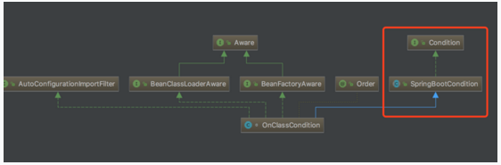


OnClassCondition又override了SpringBootCondition的getMatchOutcome方法，该方法会返回条件匹配结果。
getMatchOutcome方法源代码如下：

```java
    public ConditionOutcome getMatchOutcome(ConditionContext context,
         .....
List<String> missing = getMatches(onClasses, MatchType.MISSING, classLoader);
       ......
List<String> present = getMatches(onMissingClasses, MatchType.PRESENT,
                    classLoader);
    }

可以看到getMatchOutcome中主要调用了getMatches方法
进入getMatches方法
    private List<String> getMatches(Collection<String> candidates, MatchType matchType,
            ClassLoader classLoader) {
        List<String> matches = new ArrayList<String>(candidates.size());
        for (String candidate : candidates) {
            if (matchType.matches(candidate, classLoader)) {
                matches.add(candidate);
            }
        }
        return matches;
    }

getMatches又调用了MatchType的matches方法。
    private enum MatchType {

        PRESENT {

            @Override
            public boolean matches(String className, ClassLoader classLoader) {
                return isPresent(className, classLoader);
            }

        },

        MISSING {

            @Override
            public boolean matches(String className, ClassLoader classLoader) {
                return !isPresent(className, classLoader);
            }

        };

        private static boolean isPresent(String className, ClassLoader classLoader) {
            if (classLoader == null) {
                classLoader = ClassUtils.getDefaultClassLoader();
            }
            try {
                forName(className, classLoader);
                return true;
            }
            catch (Throwable ex) {
                return false;
            }
        }

        private static Class<?> forName(String className, ClassLoader classLoader)
                throws ClassNotFoundException {
            if (classLoader != null) {
                return classLoader.loadClass(className);
            }
            return Class.forName(className);
        }

        public abstract boolean matches(String className, ClassLoader classLoader);

    }
```
进入MatchType类中，可以看到他有两个枚举类，进一步看枚举类中的matches的源代码可以发现最终是利用loadClass以及forName 方法，判断类路径下有没有这个指定的类。
下面列举出的是Spring Boot对@Conditional的扩展注解。

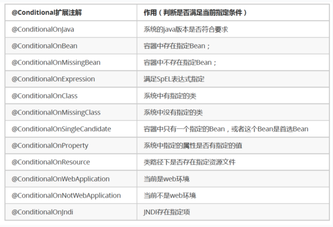


总结
1. SpringBoot启动会加载大量的自动配置类
2. 我们看我们需要的功能有没有SpringBoot默认写好的自动配置类；
3. 我们再来看这个自动配置类中到底配置了哪些组件；（只要我们要用的组件有，我们就不需要再来配置了）
4. 给容器中自动配置类添加组件的时候，会从properties类中获取某些属性。我们就可以在配置文件中指定这些属性的值；

# springboot 是如何帮我们省去web.xml配置的
## 概述

最开始使用原生的springmvc时，总是免不了有如下xml配置

```xml
<!-- Spring MVC配置 -->
<!-- ====================================== -->
<servlet>
    <servlet-name>spring</servlet-name>
    <servlet-class>org.springframework.web.servlet.DispatcherServlet</servlet-class>
    <init-param>
        <param-name>contextConfigLocation</param-name>
        <param-value>classpath:spring-servlet.xml</param-value>
    </init-param>
    <load-on-startup>1</load-on-startup>
</servlet>

<servlet-mapping>
    <servlet-name>spring</servlet-name>
    <url-pattern>/*</url-pattern>
</servlet-mapping>


<!-- Spring配置 -->
<!-- ====================================== -->
<listener>
   <listenerclass>
 org.springframework.web.context.ContextLoaderListener
   </listener-class>
</listener>


<!-- 指定Spring Bean的配置文件所在目录。默认配置在WEB-INF目录下 -->
<context-param>
    <param-name>contextConfigLocation</param-name>
    <param-value>classpath:config/applicationContext.xml</param-value>
</context-param>
```
但是，切换到springboot之后，web.xml之类的繁琐的配置基本上都不见了。出于好奇研究了下springboot究竟帮我们做了什么，我们可以免于这样的繁琐配置。

## Servlet3.0规范

首先研究的第一点，为什么web.xml不见了。刚开始使用原生servlet（不使用web框架），web.xml就是非常重要的一个配置，无论是servlet、filter、listener都需要在web.xml里面配置下。

但是在servlet3.0里，这个配置得到了简化。可以通过java配置（注解等）省去web.xml配置。

具体servlet3.0的规范这里就不讨论了，说下其中一个非常重要的类。javax.servlet.ServletContainerInitializer

这个类会在web容器启动阶段被回调，可以在onStartup方法里做一些servlet、filter、listener的注册等操作。

```java
/**
Interface which allows a library/runtime to be notified of a web application's startup phase and perform any required programmatic registration of servlets, filters, and listeners in response to it.
*/
public interface ServletContainerInitializer {

    public void onStartup(Set<Class<?>> c, ServletContext ctx)
        throws ServletException; 
}

```
## springboot的实现

首先spring在META-INF/services下配置了这个类，让整个web容器启动后可以找到并启动这个类

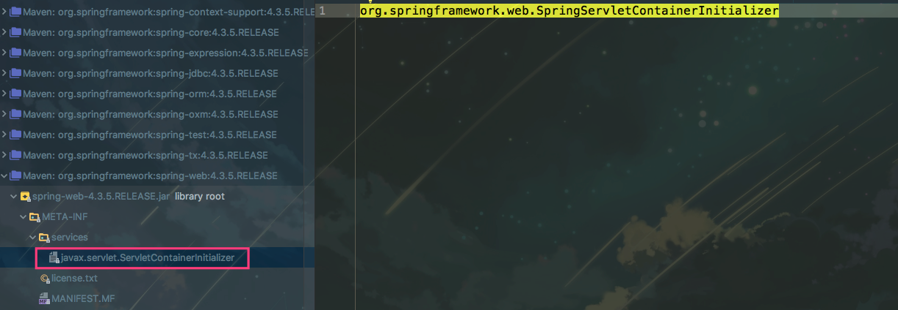


## SpringServletContainerInitializer

```java
/**
* @HandlesTypes这个注解标明了该ServletContainerInitializer需要在启动时候处理哪些类，
然后服务器会把找到的这些类传到onStartup的第一个参数里

注意这里的类包括所配置类的子类，比如这里配置WebApplicationInitializer，
启动之后，就会把这个WebApplicationInitializer的子类都传进去
*/
@HandlesTypes(WebApplicationInitializer.class)
public class SpringServletContainerInitializer implements ServletContainerInitializer {

    @Override
    public void onStartup(Set<Class<?>> webAppInitializerClasses, ServletContext servletContext)
            throws ServletException {

        List<WebApplicationInitializer> initializers = new LinkedList<WebApplicationInitializer>();

        //.... 省略容错的一些代码
        initializers.add((WebApplicationInitializer) waiClass.newInstance());
        //.... 
    AnnotationAwareOrderComparator.sort(initializers);
        for (WebApplicationInitializer initializer : initializers) {
            initializer.onStartup(servletContext);
        }
    }

}
```

startup的逻辑很简单，web容器启动后，调用所有WebApplicationInitializer的onStartup方法。

## WebApplicationInitializer 的实现SpringBootServletInitializer

```java
@Override
public void onStartup(ServletContext servletContext) throws ServletException {
   //....
    WebApplicationContext rootAppContext = createRootApplicationContext(
            servletContext);
   //...
}
```

```java
protected WebApplicationContext createRootApplicationContext(
        ServletContext servletContext) {
    //...
    return run(application);
}
```
一般使用Springboot的时候，都会继承一个类SpringBootServletInitializer，在这个类的onStartup方法中，启动了整个Spring容器。
本地启动springboot时，我们一般会写一个类似于这样的main方法。 

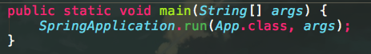

上述分析也解释了为啥把springboot应用部署到机器上，tomcat能够找到springboot的入口，并启动它。

## DispatcherServlet的配置

关于springboot如何加载类并启动的这里就不介绍了。 
这里说明下究竟Springboot如何配置DispatcherServlet的 

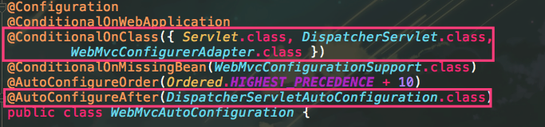


1）当类路径下存在DispatcherServlet时候，该配置生效。 
2）这个配置会在DispatcherServletAutoConfiguration配置完之后再配置。

## DispatcherServletAutoConfiguration配置

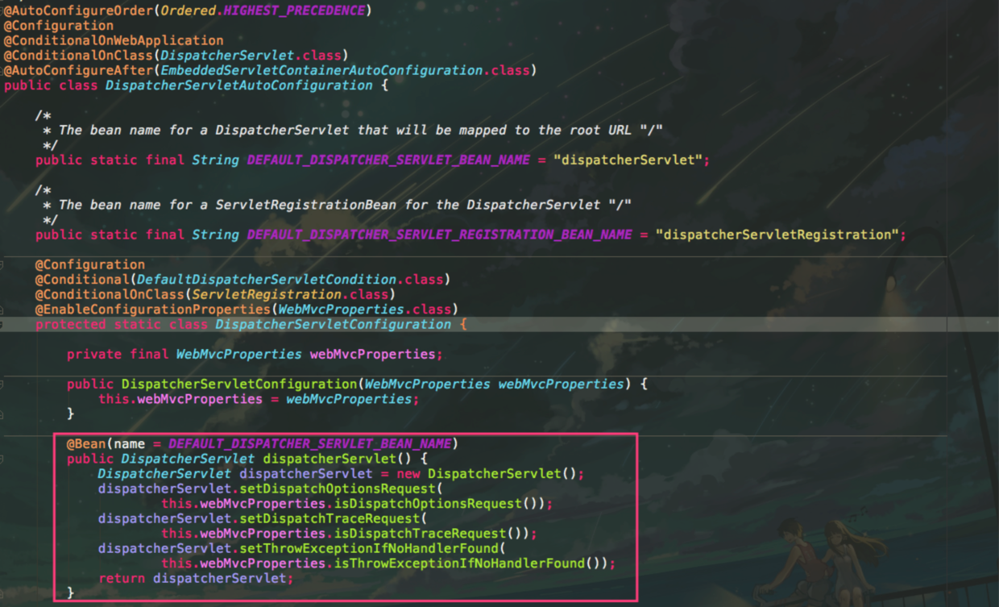

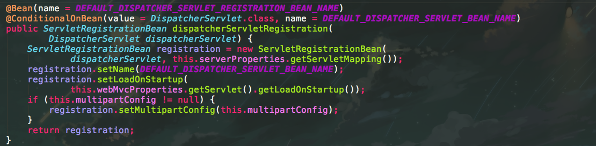

看到这里就是我们非常熟悉的springboot的使用了。springboot在DispatcherServletConfiguration这个类里对DispatcherServlet进行了配置以及注册。

## 总结

服务器如tomcat在web应用启动后，加载并启动springboot，springboot通过@AutoConfiguration、@Bean、@Conditional等注解自动配置了DispatcherServlet。

# spring boot优雅停服
## kill -9 与 -15的区别
- -9  可以理解为操作系统从内核级别强行杀死某个进程
- -15 则可以理解为发送一个通知，告知应用主动关闭。

## spring boot配合 kill -15优雅停服

1. bean里覆盖destroy方法
    ```java
    @Component
    public class TestDisposableBean implements DisposableBean {
        @Override
        public void destroy() throws Exception {
            System.out.println("测试 Bean 已销毁 ...");
        }
    }
    ```

1. 启动类里增加ShutdownHook
    
    ```java
    @SpringBootApplication
    @RestController
    public class TestShutdownApplication implements DisposableBean {
        public static void main(String[] args) {
            SpringApplication.run(TestShutdownApplication.class, args);
    
            Runtime.getRuntime().addShutdownHook(new Thread(new Runnable() {
                    @Override
                    public void run() {
                        System.out.println("执行 ShutdownHook ...");
                    }
                }));
        }
    }
    ```
1. kill -15 pid

## springboot 如何处理 -15 TERM Signal
尝试从日志开始着手分析， AnnotationConfigEmbeddedWebApplicationContext 打印出了 Closing 的行为，直接去源码中一探究竟，最终在其父类AbstractApplicationContext 中找到了关键的代码：

```java
@Override
  public void registerShutdownHook() {
    if (this.shutdownHook == null) {
      this.shutdownHook = new Thread() {
        @Override
        public void run() {
          synchronized (startupShutdownMonitor) {
            doClose();
          }
        }
      };
      Runtime.getRuntime().addShutdownHook(this.shutdownHook);
    }
  }

  @Override
  public void close() {
    synchronized (this.startupShutdownMonitor) {
      doClose();
      if (this.shutdownHook != null) {
        Runtime.getRuntime().removeShutdownHook(this.shutdownHook);
      }
    }
  }

  protected void doClose() {
    if (this.active.get() && this.closed.compareAndSet(false, true)) {
      LiveBeansView.unregisterApplicationContext(this);
      // 发布应用内的关闭事件
      publishEvent(new ContextClosedEvent(this));
      // Stop all Lifecycle beans, to avoid delays during individual destruction.
      if (this.lifecycleProcessor != null) {
        this.lifecycleProcessor.onClose();
      }
      // spring 的 BeanFactory 可能会缓存单例的 Bean
      destroyBeans();
      // 关闭应用上下文&BeanFactory
      closeBeanFactory();
      // 执行子类的关闭逻辑
      onClose();
      this.active.set(false);
    }
  }
```

# 将配置文件加载为map和list

配置文件：
```
person:
    lastName: hello
    age: 18
    boss: false
    birth: 2017/12/12
    maps: {k1: v1,k2: 12}
    lists:
      - lisi
      - zhaoliu
    dog:
      name: 小狗
      age: 12
```

加载配置文件代码：

```java
/**
 * 将配置文件中配置的每一个属性的值，映射到这个组件中
 * @ConfigurationProperties：告诉SpringBoot将本类中的所有属性和配置文件中相关的配置进行绑定；
 *      prefix = "person"：配置文件中哪个下面的所有属性进行一一映射
 *
 * 只有这个组件是容器中的组件，才能容器提供的@ConfigurationProperties功能；
 *
 */
@Component
@ConfigurationProperties(prefix = "person")
public class Person {
 
    private String lastName;
    private Integer age;
    private Boolean boss;
    private Date birth;
 
    private Map<String,Object> maps;
    private List<Object> lists;
    private Dog dog;


```

# 面试题
## Spring Boot 最大的优势
Spring Boot 的最大的优势是“约定优于配置“。“约定优于配置“是一种软件设计范式，开发人员按照约定的方式来进行编程，可以减少软件开发人员需做决定的数量，获得简单的好处，而又不失灵活性。

## Spring Boot 中 “约定优于配置“的具体产品体现在哪里。

答：Spring Boot Starter、Spring Boot Jpa 都是“约定优于配置“的一种体现。都是通过“约定优于配置“的设计思路来设计的，Spring Boot Starter 在启动的过程中会根据约定的信息对资源进行初始化；Spring Boot Jpa 通过约定的方式来自动生成 Sql ，避免大量无效代码编写。具体详细可以参考：Spring Boot 为什么这么火？

## Spring Boot Starter 的工作原理是什么？

答：Spring Boot  在启动的时候会干这几件事情：

Spring Boot 在启动时会去依赖的 Starter 包中寻找 resources/META-INF/spring.factories 文件，然后根据文件中配置的 Jar 包去扫描项目所依赖的 Jar 包。

根据 spring.factories 配置加载 AutoConfigure 类

根据 @Conditional 注解的条件，进行自动配置并将 Bean 注入 Spring Context

总结一下，其实就是 Spring Boot 在启动的时候，按照约定去读取 Spring Boot Starter 的配置信息，再根据配置信息对资源进行初始化，并注入到 Spring 容器中。这样 Spring Boot 启动完毕后，就已经准备好了一切资源，使用过程中直接注入对应 Bean 资源即可。


## Spring Boot 的自动配置是如何实现的？

Spring Boot 项目的启动注解是：@SpringBootApplication，其实它就是由下面三个注解组成的：

@Configuration

@ComponentScan

@EnableAutoConfiguration

其中 @EnableAutoConfiguration 是实现自动配置的入口，该注解又通过 @Import 注解导入了AutoConfigurationImportSelector，在该类中加载 META-INF/spring.factories 的配置信息。然后筛选出以 EnableAutoConfiguration 为 key 的数据，加载到 IOC 容器中，实现自动配置功能！

## 什么是嵌入式服务器？我们为什么要使用嵌入式服务器呢?

思考一下在你的虚拟机上部署应用程序需要些什么。

第一步：安装 Java

第二部：安装 Web 或者是应用程序的服务器（Tomat/Wbesphere/Weblogic 等等）

第三部：部署应用程序 war 包

如果我们想简化这些步骤，应该如何做呢？

让我们来思考如何使服务器成为应用程序的一部分？

你只需要一个安装了 Java 的虚拟机，就可以直接在上面部署应用程序了，

是不是很爽？

这个想法是嵌入式服务器的起源。

当我们创建一个可以部署的应用程序的时候，我们将会把服务器（例如，tomcat）嵌入到可部署的服务器中。

例如，对于一个 Spring Boot 应用程序来说，你可以生成一个包含 Embedded Tomcat 的应用程序 jar。你就可以像运行正常 Java 应用程序一样来运行 web 应用程序了。

嵌入式服务器就是我们的可执行单元包含服务器的二进制文件（例如，tomcat.jar）。

## 微服务同时调用多个接口，怎么支持事务的啊？

支持分布式事务，可以使用Spring Boot集成 Aatomikos来解决，但是我一般不建议这样使用，因为使用分布式事务会增加请求的响应时间，影响系统的TPS。一般在实际工作中，会利用消息的补偿机制来处理分布式的事务。

## shiro和oauth还有cas他们之间的关系是什么？问下您公司权限是如何设计，还有就是这几个概念的区别。

cas和oauth是一个解决单点登录的组件，shiro主要是负责权限安全方面的工作，所以功能点不一致。但往往需要单点登陆和权限控制一起来使用，所以就有 cas+shiro或者oauth+shiro这样的组合。

token一般是客户端登录后服务端生成的令牌，每次访问服务端会进行校验，一般保存到内存即可，也可以放到其他介质；redis可以做Session共享，如果前端web服务器有几台负载，但是需要保持用户登录的状态，这场景使用比较常见。

我们公司使用oauth+shiro这样的方式来做后台权限的管理，oauth负责多后台统一登录认证，shiro负责给登录用户赋予不同的访问权限。

## 各服务之间通信，对Restful和Rpc这2种方式如何做选择？

在传统的SOA治理中，使用rpc的居多；Spring Cloud默认使用restful进行服务之间的通讯。rpc通讯效率会比restful要高一些，但是对于大多数公司来讲，这点效率影响甚微。我建议使用restful这种方式，易于在不同语言实现的服务之间通讯。

## 怎么设计无状态服务？

对于无状态服务，首先说一下什么是状态：如果一个数据需要被多个服务共享，才能完成一笔交易，那么这个数据被称为状态。进而依赖这个“状态”数据的服务被称为有状态服务，反之称为无状态服务。

那么这个无状态服务原则并不是说在微服务架构里就不允许存在状态，表达的真实意思是要把有状态的业务服务改变为无状态的计算类服务，那么状态数据也就相应的迁移到对应的“有状态数据服务”中。

场景说明：例如我们以前在本地内存中建立的数据缓存、Session缓存，到现在的微服务架构中就应该把这些数据迁移到分布式缓存中存储，让业务服务变成一个无状态的计算节点。迁移后，就可以做到按需动态伸缩，微服务应用在运行时动态增删节点，就不再需要考虑缓存数据如何同步的问题。

## Spring Cache 三种常用的缓存注解和意义？

@Cacheable ，用来声明方法是可缓存，将结果存储到缓存中以便后续使用相同参数调用时不需执行实际的方法，直接从缓存中取值。

@CachePut，使用 @CachePut 标注的方法在执行前，不会去检查缓存中是否存在之前执行过的结果，而是每次都会执行该方法，并将执行结果以键值对的形式存入指定的缓存中。

@CacheEvict，是用来标注在需要清除缓存元素的方法或类上的，当标记在一个类上时表示其中所有的方法的执行都会触发缓存的清除操作。

## Spring Boot 如何设置支持跨域请求？

现代浏览器出于安全的考虑， HTTP 请求时必须遵守同源策略，否则就是跨域的 HTTP 请求，默认情况下是被禁止的，IP（域名）不同、或者端口不同、协议不同（比如 HTTP、HTTPS）都会造成跨域问题。

一般前端的解决方案有：

使用 JSONP 来支持跨域的请求，JSONP 实现跨域请求的原理简单的说，就是动态创建<script>标签，然后利用<script>的 SRC 不受同源策略约束来跨域获取数据。缺点是需要后端配合输出特定的返回信息。

利用反应代理的机制来解决跨域的问题，前端请求的时候先将请求发送到同源地址的后端，通过后端请求转发来避免跨域的访问。

后来 HTML5 支持了 CORS 协议。CORS 是一个 W3C 标准，全称是”跨域资源共享”（Cross-origin resource sharing），允许浏览器向跨源服务器，发出 XMLHttpRequest 请求，从而克服了 AJAX 只能同源使用的限制。它通过服务器增加一个特殊的 Header[Access-Control-Allow-Origin]来告诉客户端跨域的限制，如果浏览器支持 CORS、并且判断 Origin 通过的话，就会允许 XMLHttpRequest 发起跨域请求。

前端使用了 CORS 协议，就需要后端设置支持非同源的请求，Spring Boot 设置支持非同源的请求有两种方式。

第一，配置 CorsFilter。

```java
@Configuration
public class GlobalCorsConfig {
    @Bean
    public CorsFilter corsFilter() {
        CorsConfiguration config = new CorsConfiguration();
          config.addAllowedOrigin("*");
          config.setAllowCredentials(true);
          config.addAllowedMethod("*");
          config.addAllowedHeader("*");
          config.addExposedHeader("*");

        UrlBasedCorsConfigurationSource configSource = new UrlBasedCorsConfigurationSource();
        configSource.registerCorsConfiguration("/**", config);

        return new CorsFilter(configSource);
    }
}
```
需要配置上述的一段代码。第二种方式稍微简单一些。

第二，在启动类上添加：

```java
public class Application extends WebMvcConfigurerAdapter {  

    @Override  
    public void addCorsMappings(CorsRegistry registry) {  

        registry.addMapping("/**")  
                .allowCredentials(true)  
                .allowedHeaders("*")  
                .allowedOrigins("*")  
                .allowedMethods("*");  

    }  
}  
```

## JPA 和 Hibernate 有哪些区别？JPA 可以支持动态 SQL 吗？

JPA本身是一种规范，它的本质是一种ORM规范（不是ORM框架，因为JPA并未提供ORM实现，只是制定了规范）因为JPA是一种规范，所以，只是提供了一些相关的接口，但是接口并不能直接使用，JPA底层需要某种JPA实现，Hibernate 是 JPA 的一个实现集。

JPA 是根据实体类的注解来创建对应的表和字段，如果需要动态创建表或者字段，需要动态构建对应的实体类，再重新调用Jpa刷新整个Entity。动态SQL，mybatis支持的最好，jpa也可以支持，但是没有Mybatis那么灵活。

## Spring 、Spring Boot 和 Spring Cloud 的关系?

Spring 最初最核心的两大核心功能 Spring Ioc 和 Spring Aop 成就了 Spring，Spring 在这两大核心的功能上不断的发展，才有了 Spring 事务、Spring Mvc 等一系列伟大的产品，最终成就了 Spring 帝国，到了后期 Spring 几乎可以解决企业开发中的所有问题。

Spring Boot 是在强大的 Spring 帝国生态基础上面发展而来，发明 Spring Boot 不是为了取代 Spring ,是为了让人们更容易的使用 Spring 。

Spring Cloud 是一系列框架的有序集合。它利用 Spring Boot 的开发便利性巧妙地简化了分布式系统基础设施的开发，如服务发现注册、配置中心、消息总线、负载均衡、断路器、数据监控等，都可以用 Spring Boot 的开发风格做到一键启动和部署。

Spring Cloud 是为了解决微服务架构中服务治理而提供的一系列功能的开发框架，并且 Spring Cloud 是完全基于 Spring Boot 而开发，Spring Cloud 利用 Spring Boot 特性整合了开源行业中优秀的组件，整体对外提供了一套在微服务架构中服务治理的解决方案。

用一组不太合理的包含关系来表达它们之间的关系。

Spring ioc/aop > Spring > Spring Boot > Spring Cloud