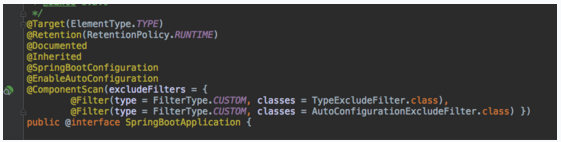
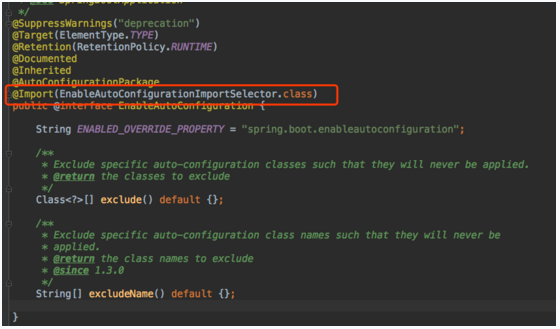
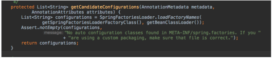
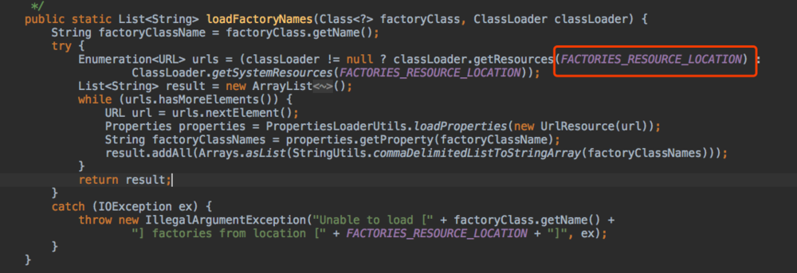
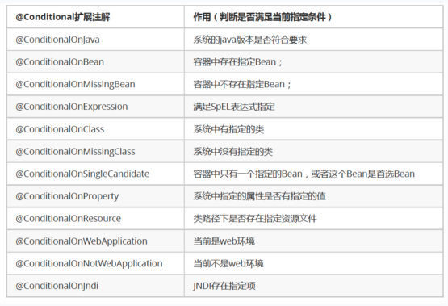

### Spring Boot的自动配置原理
在微服务概念兴起的今天，很多公司转型使用微服务作为架构。在技术选型上Spring Cloud 是非常好的选择，它提供了一站式的分布式系统解决方案，而Spring Cloud中的每个组件都是基于Spring Boot构建的，Spring Boot提供J2EE一站式解决方案，具有以下优点：

快速创建独立运行的Spring项目以及与主流框架集成
使用嵌入式的Servlet容器，应用无需打成WAR包
starters自动依赖与版本控制
大量的自动配置，简化开发，也可修改默认值
无需配置XML，无代码生成，开箱即用
准生产环境的运行时应用监控
与云计算的天然集成

今天就深入探讨以下Spring Boot 是如何做到自动配置的
@EnableAutoConfiguration的作用
@EnableAutoConfiguration注解的作用就是利用EnableAutoConfigurationImportSelector给容器中导入一些组件，下面具体看一下是如何做到的。
Spring Boot 程序入口有@SpringBootApplication 注解。


进入@SpringBootApplication 注解可以看到他的定义：





Spring Boot程序的入口会加载主配置类，并且通过@EnableAutoConfiguration 开启自动配置的功能。该注解会引入EnableAutoConfigurationImportSelector类。该类又会继承AutoConfigurationImportSelector类

EnableAutoConfigurationImportSelector





AutoConfigurationImportSelector

AutoConfigurationImportSelector中方法selectImports的源码如下：


该方法会去获取所有自动配置类的名称。





SpringFactoriesLoader

SpringFactoriesLoader类中给的loadFactoryNames的源码如下





其中FACTORIES_RESOURCE_LOCATION的值如下：
public static final String FACTORIES_RESOURCE_LOCATION = "META-INF/spring.factories";

可以看到该方法会扫描jar包路径下的META-INF/spring.factories 文件，把扫描到的这些文件内容包装成properties对象。再从properties中获取到EnableAutoConfiguration.class类（类名）对应的值，并且把他们添加到容器中。我们打开spring.factories文件


看到的非常多的xxxxAutoConfiguration类，这些类都是容器中的一个组件，加入到容器中，用他们做自动配置。
HttpEncodingAutoConfiguration
在这么多xxxxAutoConfiguration中，我们以HttpEncodingAutoConfiguration（Http自动编码）为例
@Configuration    
//表示这是一个配置类，以前编写的配置文件一样，也可以给容器中添加组件

@EnableConfigurationProperties(HttpEncodingProperties.class)
//启动指定类的ConfigurationProperties功能；将配置文件中对应的值和HttpEncodingProperties绑定起来；并把HttpEncodingProperties加入到ioc容器中

@ConditionalOnWebApplication
//Spring底层@Conditional注解（Spring注解版），根据不同的条件，如果满足指定的条件，整个配置类里面的配置就会生效；这里是判断当前应用是否是web应用，如果是，当前配置类生效

@ConditionalOnClass(CharacterEncodingFilter.class)
//判断当前项目有没有这个类CharacterEncodingFilter；SpringMVC中进行乱码解决的过滤器；

@ConditionalOnProperty(prefix = "spring.http.encoding", value = "enabled", matchIfMissing = true)
//判断配置文件中是否存在某个配置 spring.http.encoding.enabled；如果不存在，判断也是成立的
//即使我们配置文件中不配置pring.http.encoding.enabled=true，也是默认生效的；

```java
public class HttpEncodingAutoConfiguration {

    //他已经和SpringBoot的配置文件映射了
    private final HttpEncodingProperties properties;

    //只有一个有参构造器的情况下，参数的值就会从容器中拿
    public HttpEncodingAutoConfiguration(HttpEncodingProperties properties) {
        this.properties = properties;
    }

    @Bean
    //给容器中添加一个组件，这个组件的某些值需要从properties中获取
    @ConditionalOnMissingBean(CharacterEncodingFilter.class)
    //判断容器没有这个组件
    public CharacterEncodingFilter characterEncodingFilter() {
        CharacterEncodingFilter filter = new OrderedCharacterEncodingFilter();
        filter.setEncoding(this.properties.getCharset().name());
        filter.setForceRequestEncoding(this.properties.shouldForce(Type.REQUEST));
        filter.setForceResponseEncoding(this.properties.shouldForce(Type.RESPONSE));
        return filter;
    }
    }
    .......
}
```

通过上面的类的注解可以看到，通过使用@EnableConfigurationProperties，可以把配置文件中的属性与HttpEncodingProperties类绑定起来并且加入到IOC容器中，进入HttpEncodingProperties类，可以看到他是通过@ConfigurationProperties 注解把配置文件中的spring.http.encoding值与该类的属性绑定起来的。
@ConfigurationProperties(prefix = "spring.http.encoding")
public class HttpEncodingProperties 

通过上面的分析我们知道了为什么在配置文件中可以配置这些属性。
关于配置文件可配置属性，可以参考官方文档。
同时我们可以注意到上面的类中使用了@ConditionalOnClass与@ConditionalOnWebApplication注解，这两个都是@Conditional的派生注解，作用是必须是@Conditional指定的条件成立，才给容器中添加组件，配置里的内容才会生效。
Conditional注解
下面我们以@ConditionalOnClass为例，来分析一下他的源代码。
@Conditional(OnClassCondition.class)
public @interface ConditionalOnClass {

进入OnClassCondition类，查看他的类继承信息，可以看到他继承SpringBootCondition类，SpringBootCondition又实现了Condition接口


OnClassCondition又override了SpringBootCondition的getMatchOutcome方法，该方法会返回条件匹配结果。
getMatchOutcome方法源代码如下：

```java
    public ConditionOutcome getMatchOutcome(ConditionContext context,
         .....
List<String> missing = getMatches(onClasses, MatchType.MISSING, classLoader);
       ......
List<String> present = getMatches(onMissingClasses, MatchType.PRESENT,
                    classLoader);
    }

可以看到getMatchOutcome中主要调用了getMatches方法
进入getMatches方法
    private List<String> getMatches(Collection<String> candidates, MatchType matchType,
            ClassLoader classLoader) {
        List<String> matches = new ArrayList<String>(candidates.size());
        for (String candidate : candidates) {
            if (matchType.matches(candidate, classLoader)) {
                matches.add(candidate);
            }
        }
        return matches;
    }

getMatches又调用了MatchType的matches方法。
    private enum MatchType {

        PRESENT {

            @Override
            public boolean matches(String className, ClassLoader classLoader) {
                return isPresent(className, classLoader);
            }

        },

        MISSING {

            @Override
            public boolean matches(String className, ClassLoader classLoader) {
                return !isPresent(className, classLoader);
            }

        };

        private static boolean isPresent(String className, ClassLoader classLoader) {
            if (classLoader == null) {
                classLoader = ClassUtils.getDefaultClassLoader();
            }
            try {
                forName(className, classLoader);
                return true;
            }
            catch (Throwable ex) {
                return false;
            }
        }

        private static Class<?> forName(String className, ClassLoader classLoader)
                throws ClassNotFoundException {
            if (classLoader != null) {
                return classLoader.loadClass(className);
            }
            return Class.forName(className);
        }

        public abstract boolean matches(String className, ClassLoader classLoader);

    }
```
进入MatchType类中，可以看到他有两个枚举类，进一步看枚举类中的matches的源代码可以发现最终是利用loadClass以及forName 方法，判断类路径下有没有这个指定的类。
下面列举出的是Spring Boot对@Conditional的扩展注解。





总结
1）SpringBoot启动会加载大量的自动配置类
2）我们看我们需要的功能有没有SpringBoot默认写好的自动配置类；
3）我们再来看这个自动配置类中到底配置了哪些组件；（只要我们要用的组件有，我们就不需要再来配置了）
4）给容器中自动配置类添加组件的时候，会从properties类中获取某些属性。我们就可以在配置文件中指定这
些属性的值；

作者：樂浩beyond
链接：https://www.jianshu.com/p/4a6094542f45
來源：简书
简书著作权归作者所有，任何形式的转载都请联系作者获得授权并注明出处。