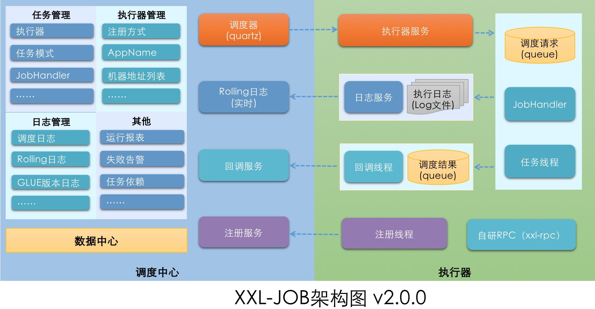
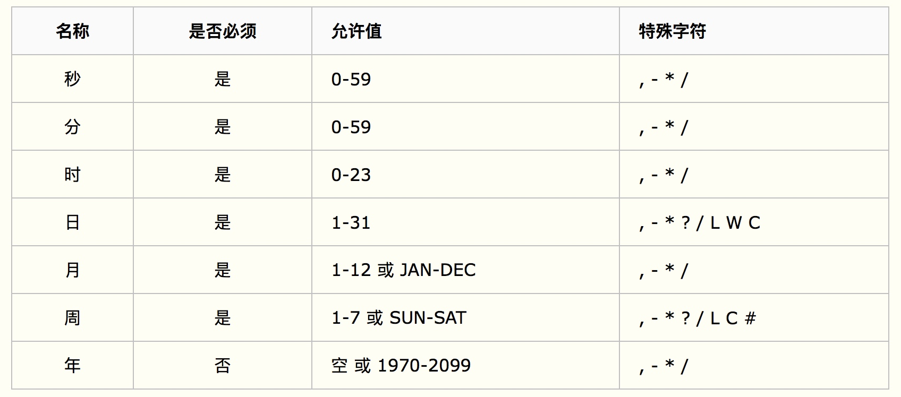
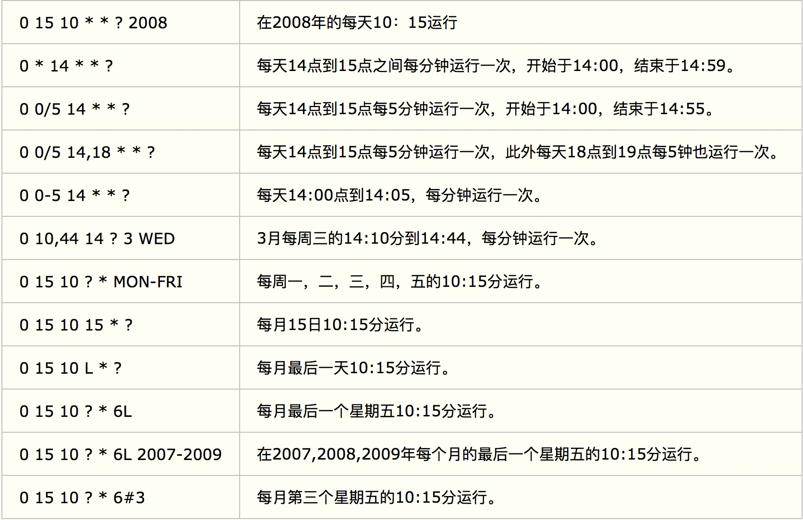

# xxl-job架构图



# GLUE模式
GLUE模式即在线代码编辑模式，每次运行GLUE模式的任务时，xxl-job会把代码发送到执行器，然后执行器本地通过java运行脚本，所以修改执行器本地的脚本文件没有用，因为xxl每次运行都会覆盖脚本文件
> 注意执行器启动用户的权限

# 日志
mysql的XXL_JOB_QRTZ_TRIGGER_LOG表里保存的是任务执行的相关信息，具体日志没保存到mysql中，通过admin页面查看执行日志，实际是调用的执行器的rpc接口读取的执行器本地的日志文件

# 执行器

> 执行器必须是web项目，因为需要提供api接口给调度中心用
> 执行器需要定义一个XxlJobSpringExecutor的bean并指定initMethod和destroyMethod用来向调度中心注册执行器

# 父子任务
父子任务的执行顺序是先执行父任务，再执行子任务

# Cron
0 0 0 * * ? *
秒分时日月周年
遵循Quartz的cron定义

注意在cron表达式中不区分大小写.

* 星号(*)：可用在所有字段中，表示对应时间域的每一个时刻，例如， 在分钟字段时，表示“每分钟”；
* 问号（?）：该字符只在日期和星期字段中使用，它通常指定为“无意义的值”，相当于点位符；
* 减号(-)：表达一个范围，如在小时字段中使用“10-12”，则表示从10到12点，即10,11,12；
* 逗号(,)：表达一个列表值，如在星期字段中使用“MON,WED,FRI”，则表示星期一，星期三和星期五；
* 斜杠(/)：x/y表达一个等步长序列，x为起始值，y为增量步长值。如在分钟字段中使用0/15，则表示为0,15,30和45秒，而5/15在分钟字段中表示5,20,35,50，你也可以使用*/y，它等同于0/y；
* L：该字符只在日期和星期字段中使用，代表“Last”的意思，但它在两个字段中意思不同。L在日期字段中，表示这个月份的最后一天，如一月的31号，非闰年二月的28号；如果L用在星期中，则表示星期六，等同于7。但是，如果L出现在星期字段里，而且在前面有一个数值X，则表示“这个月的最后X天”，例如，6L表示该月的最后星期五；
* W：该字符只能出现在日期字段里，是对前导日期的修饰，表示离该日期最近的工作日。例如15W表示离该月15号最近的工作日，如果该月15号是星期六，则匹配14号星期五；如果15日是星期日，则匹配16号星期一；如果15号是星期二，那结果就是15号星期二。但必须注意关联的匹配日期不能够跨月，如你指定1W，如果1号是星期六，结果匹配的是3号星期一，而非上个月最后的那天。W字符串只能指定单一日期，而不能指定日期范围；
* LW组合：在日期字段可以组合使用LW，它的意思是当月的最后一个工作日；
* 井号(#)：该字符只能在星期字段中使用，表示当月某个工作日。如6#3表示当月的第三个星期五(6表示星期五，#3表示当前的第三个)，而4#5表示当月的第五个星期三，假设当月没有第五个星期三，忽略不触发；
* C：该字符只在日期和星期字段中使用，代表“Calendar”的意思。它的意思是计划所关联的日期，如果日期没有被关联，则相当于日历中所有日期。例如5C在日期字段中就相当于日历5日以后的第一天。1C在星期字段中相当于星期日后的第一天。


# 源码
## admin
- JobInfoController.triggerJob 手动执行任务
- XxlJobTrigger.runExecutor 任务分发入口
- XxlRpcReferenceBean.getObject rpc调用执行器任务
- XxlRpcRequest
    
    ```json
    {
      requestId='41c80e81-8548-4c99-a74d-ccfc942f6a64',
      createMillisTime=1558525882701,
      accessToken='',
      className='com.xxl.job.core.biz.ExecutorBiz',
      methodName='run',
      parameterTypes=[
        classcom.xxl.job.core.biz.model.TriggerParam
      ],
      parameters=[
        TriggerParam{
          jobId=9,
          executorHandler='cleanNewsJobHandler',
          executorParams='',
          executorBlockStrategy='SERIAL_EXECUTION',
          executorTimeout=0,
          logId=63,
          logDateTim=1558525565452,
          glueType='BEAN',
          glueSource='',
          glueUpdatetime=1558409905000,
          broadcastIndex=0,
          broadcastTotal=1
        }
      ],
      version='null'
    }
    ```
- rpc基于NettyHttpClient
- XxlJobDynamicScheduler.addJob 添加定时任务
    - 基于quartz的任务调度

## executor
- ExecutorBiz.run 执行rpc请求

## core
- JobFailMonitorHelper.failAlarm 任务失败报警
- JobThread.run job执行

## rpc
- XxlRpcReferenceBean 核心类