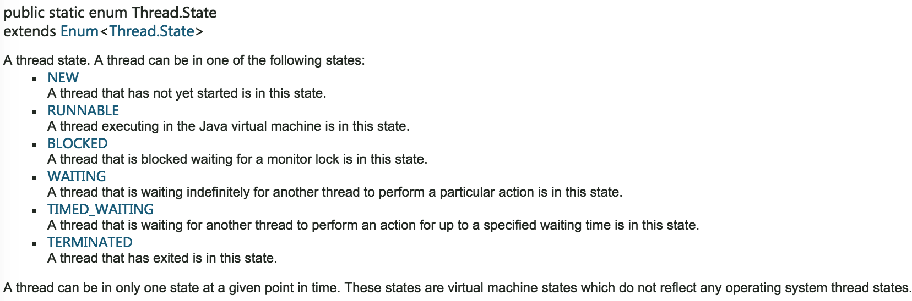
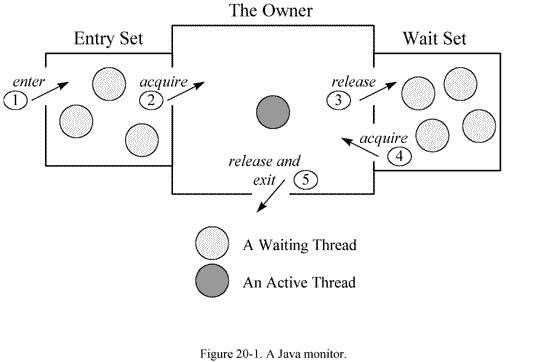
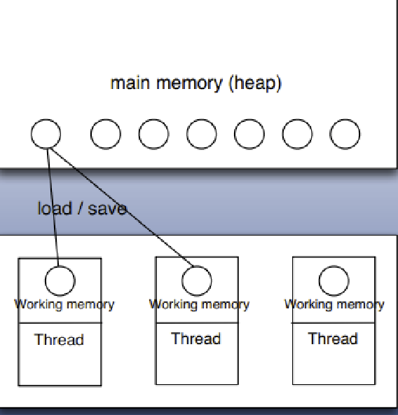
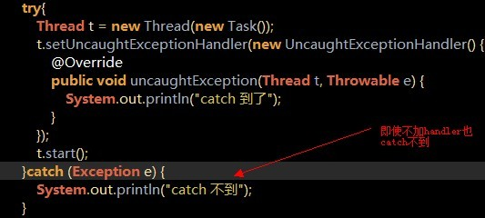
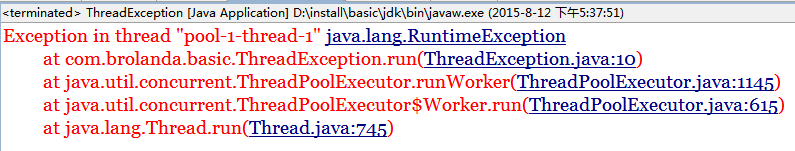
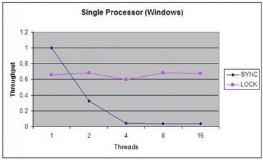
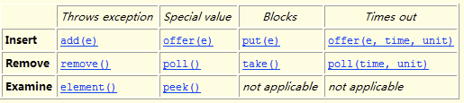
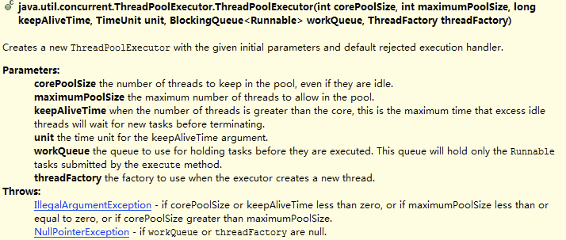

## java多线程
### 引
如果对什么是线程、什么是进程仍存有疑惑，请先Google之，因为这两个概念不在本文的范围之内。

用多线程只有一个目的，那就是**更好的利用cpu的资源**，因为所有的多线程代码都可以用单线程来实现。说这个话其实只有一半对，因为反应“多角色”的程序代码，最起码每个角色要给他一个线程吧，否则连实际场景都无法模拟，当然也没法说能用单线程来实现：比如最常见的“生产者，消费者模型”。

很多人都对其中的一些概念不够明确，如同步、并发等等，让我们先建立一个数据字典，以免产生误会。

- 多线程：指的是这个程序（一个进程）运行时产生了不止一个线程
- 并行与并发：
    - 并行：多个cpu实例或者多台机器同时执行一段处理逻辑，是真正的同时。
    - 并发：通过cpu调度算法，让用户看上去同时执行，实际上从cpu操作层面不是真正的同时。并发往往在场景中有公用的资源，那么针对这个公用的资源往往产生瓶颈，我们会用TPS或者QPS来反应这个系统的处理能力。
    
    - 并发与并行示意图：
    

- 线程安全：经常用来描绘一段代码。指在并发的情况之下，该代码经过多线程使用，线程的调度顺序不影响任何结果。这个时候使用多线程，我们只需要关注系统的内存，cpu是不是够用即可。反过来，线程不安全就意味着线程的调度顺序会影响最终结果，如不加事务的转账代码：

    ```java
    void transferMoney(User from, User to, float amount){
      to.setMoney(to.getBalance() + amount);
      from.setMoney(from.getBalance() - amount);
    }
    ```
- 同步：Java中的同步指的是通过人为的控制和调度，保证共享资源的多线程访问成为线程安全，来保证结果的准确。如上面的代码简单加入@synchronized关键字。在保证结果准确的同时，提高性能，才是优秀的程序。**线程安全的优先级高于性能**。

好了，让我们开始吧。我准备分成几部分来总结涉及到多线程的内容：
1. 线程的状态
2. 每个对象都有的方法（机制）
3. 基本线程类
4. 高级多线程控制类

### 线程的状态
先来两张图：
- 线程状态


- 线程状态转换


各种状态一目了然，值得一提的是"blocked"这个状态：
线程在Running的过程中可能会遇到阻塞(Blocked)情况

1. 调用join()和sleep()方法，sleep()时间结束或被打断，join()中断,IO完成都会回到Runnable状态，等待JVM的调度。join() 的作用：让“主线程”等待“子线程”结束之后才能继续运行。

2. 调用wait()，使该线程处于等待池(wait blocked pool),直到notify()/notifyAll()，线程被唤醒被放到锁定池(lock blocked pool )，释放同步锁使线程回到可运行状态（Runnable）
3. 对Running状态的线程加同步锁(Synchronized)使其进入(lock blocked pool ),同步锁被释放进入可运行状态(Runnable)。

此外，在runnable状态的线程是处于被调度的线程，此时的调度顺序是不一定的。Thread类中的yield方法可以让一个running状态的线程转入runnable。

### 每个对象都有的方法（机制）
synchronized, wait, notify 是任何对象都具有的同步工具。让我们先来了解他们


**monitor**

他们是应用于同步问题的人工线程调度工具。讲其本质，首先就要明确monitor的概念，Java中的每个对象都有一个监视器，来监测并发代码的重入。在非多线程编码时该监视器不发挥作用，反之如果在synchronized 范围内，监视器发挥作用。

**wait/notify必须存在于synchronized块中**。并且，这三个关键字针对的是同一个监视器（某对象的监视器）。这意味着wait之后，其他线程可以进入同步块执行。

当某代码并不持有监视器的使用权时（如图中5的状态，即脱离同步块）去wait或notify，会抛出java.lang.IllegalMonitorStateException。也包括在synchronized块中去调用另一个对象的wait/notify，因为不同对象的监视器不同，同样会抛出此异常。

再讲用法：

- synchronized单独使用：
    - 代码块：如下，在多线程环境下，synchronized块中的方法获取了lock实例的monitor，如果实例相同，那么只有一个线程能执行该块内容

        ```java
        public class Thread1 implements Runnable {
           Object lock;
           public void run() {  
               synchronized(lock){
                 ..do something
               }
           }
        }
        ```


    - 直接用于方法： 相当于上面代码中用lock来锁定的效果，实际获取的是Thread1类的monitor。更进一步，如果修饰的是static方法，则锁定该类所有实例。

        ```java
        public class Thread1 implements Runnable {
           public synchronized void run() {  
                ..do something
           }
        }
        ```
- synchronized, wait, notify结合:典型场景生产者消费者问题

    ```java
    /**
       * 生产者生产出来的产品交给店员
       */
      public synchronized void produce()
      {
          if(this.product >= MAX_PRODUCT)
          {
              try
              {
                  wait();  
                  System.out.println("产品已满,请稍候再生产");
              }
              catch(InterruptedException e)
              {
                  e.printStackTrace();
              }
              return;
          }
    
          this.product++;
          System.out.println("生产者生产第" + this.product + "个产品.");
          notifyAll();   //通知等待区的消费者可以取出产品了
      }
    
      /**
       * 消费者从店员取产品
       */
      public synchronized void consume()
      {
          if(this.product <= MIN_PRODUCT)
          {
              try 
              {
                  wait(); 
                  System.out.println("缺货,稍候再取");
              } 
              catch (InterruptedException e) 
              {
                  e.printStackTrace();
              }
              return;
          }
    
          System.out.println("消费者取走了第" + this.product + "个产品.");
          this.product--;
          notifyAll();   //通知等待去的生产者可以生产产品了
      }
    ```

**volatile**

多线程的内存模型：main memory（主存）、working memory（线程栈），在处理数据时，线程会把值从主存load到本地栈，完成操作后再save回去(volatile关键词的作用：每次针对该变量的操作都激发一次load and save)。


**volatile**
针对多线程使用的变量如果不是volatile或者final修饰的，很有可能产生不可预知的结果（另一个线程修改了这个值，但是之后在某线程看到的是修改之前的值）。其实道理上讲同一实例的同一属性本身只有一个副本。但是多线程是会缓存值的，本质上，volatile就是不去缓存，直接取值。**在线程安全的情况下加volatile会牺牲性能**。

### 基本线程类
基本线程类指的是
* Thread类
* Runnable接口
* Callable接口

#### Thread类
Thread 类实现了Runnable接口，启动一个线程的方法：
```java
MyThread my = new MyThread();
my.start();
```
##### Thread类相关方法

```java
//当前线程可转让cpu控制权，让别的就绪状态线程运行（切换）
public static Thread.yield() 
//暂停一段时间
public static Thread.sleep()  
//在一个线程中调用other.join(),将等待other执行完后才继续本线程。　　　　
public join()
//后两个函数皆可以被打断
public interrupte()
```

**关于中断**：它并不像stop方法那样会中断一个正在运行的线程。线程会不时地检测中断标识位，以判断线程是否应该被中断（中断标识值是否为true）。终端只会影响到wait状态、sleep状态和join状态。被打断的线程会抛出InterruptedException。
Thread.interrupted()检查当前线程是否发生中断，返回boolean
**synchronized在获锁的过程中是不能被中断的**。

中断是一个状态！interrupt()方法只是将这个状态置为true而已。所以说正常运行的程序不去检测状态，就不会终止，而wait等阻塞方法会去检查并抛出异常。如果在正常运行的程序中添加while(!Thread.interrupted()) ，则同样可以在中断后离开代码体

##### Thread类最佳实践
写的时候最好要设置线程名称 Thread.name，并设置线程组 ThreadGroup，目的是方便管理。在出现问题的时候，**打印线程栈 (jstack -pid)** 一眼就可以看出是哪个线程出的问题，这个线程是干什么的。

##### 如何获取线程中的异常


不能用try，catch来获取线程中的异常，多线程运行不能按照顺序执行过程中捕获异常的方式来处理异常，异常会被直接抛出到控制台（由于线程的本质，使得你不能捕获从线程中逃逸的异常。一旦异常逃逸出任务的run方法，它就会向外传播到控制台，除非你采用特殊的形式捕获这种异常。）

要在多线程中捕获异常，需按照下面的步骤完成：

1. 定义异常处理器
要求，实现 Thread.UncaughtExceptionHandler的uncaughtException方法，如下：

    ```java
    /*
     * 第一步：定义符合线程异常处理器规范的“异常处理器”
     * 实现Thread.UncaughtExceptionHandler规范
     */
    class MyUncaughtExceptionHandler implements Thread.UncaughtExceptionHandler{
        /*
         * Thread.UncaughtExceptionHandler.uncaughtException()会在线程因未捕获的异常而临近死亡时被调用
         */
        @Override
        public void uncaughtException(Thread t, Throwable e) {
            System.out.println("caught    "+e);
        }
    }   
    ```
2. 定义使用该异常处理器的线程工厂

    ```java
    /*
     * 第二步：定义线程工厂
     * 线程工厂用来将任务附着给线程，并给该线程绑定一个异常处理器
     */
    class HanlderThreadFactory implements ThreadFactory{
        @Override
        public Thread newThread(Runnable r) {
            System.out.println(this+"creating new Thread");
            Thread t = new Thread(r);
            System.out.println("created "+t);
            // 设置异常处理器
            t.setUncaughtExceptionHandler(new MyUncaughtExceptionHandler());//设定线程工厂的异常处理器
            System.out.println("eh="+t.getUncaughtExceptionHandler());
            return t;
        }
    }
    ```
3. 定义一个任务，让其抛出一个异常

    ```java
    /*
     * 第三步：我们的任务可能会抛出异常
     * 显示的抛出一个exception
     */
    class ExceptionThread implements Runnable{
        @Override
        public void run() {
            Thread t = Thread.currentThread();
            System.out.println("run() by "+t);
            System.out.println("eh = "+t.getUncaughtExceptionHandler());
            throw new RuntimeException();
        }
    }
    ```
4. 调用实验
    
    ```java
    /*
     * 第四步：使用线程工厂创建线程池，并调用其execute方法
     */
    public class ThreadExceptionUncaughtExceptionHandler{
        public static void main(String[] args){
            // 使用线程工厂创建线程池
            ExecutorService exec = Executors.newCachedThreadPool(new HanlderThreadFactory());
            exec.execute(new ExceptionThread());
        }
    }
    ```
    
运行结果如下图：



**结论**
- 在java中要捕捉多线程产生的异常，需要自定义异常处理器，并设定到对应的线程工厂中（即第一步和第二步）。

**拓展**
- 如果你知道将要在代码中处处使用相同的异常处理器，那么更简单的方式是在Thread类中设置一个静态域，并将这个处理器设置为默认的未捕获处理器。
这个处理器只有在不存在线程专有的未捕获异常处理器的情况下才会被调用。

    ```java
    public static void main(String[] args){
            // 设置默认线程异常处理器
            Thread.setDefaultUncaughtExceptionHandler(new MyUncaughtExceptionHandler());
            ExecutorService exec =Executors.newCachedThreadPool();
            exec.execute(new ExceptionThread());
    }
    
    ```

#### Runnable

与Thread类似

#### Callable

future模式：并发模式的一种，可以有两种形式，即无阻塞和阻塞，分别是isDone和get。其中Future对象用来存放该线程的返回值以及状态

```java
ExecutorService e = Executors.newFixedThreadPool(3);
 //submit方法有多重参数版本，及支持callable也能够支持runnable接口类型.
Future future = e.submit(new myCallable());
future.isDone() //return true,false 无阻塞
future.get() // return 返回值，阻塞直到该线程运行结束
```

### 高级多线程控制类
接下来是实际项目中常用到的工具，Java1.5提供了一个非常高效实用的多线程包:java.util.concurrent, 提供了大量高级工具,可以帮助开发者编写高效、易维护、结构清晰的Java多线程程序。

#### ThreadLocal类
- 用处：保存线程的独立变量。对一个线程类（继承自Thread)
当使用ThreadLocal维护变量时，ThreadLocal为每个使用该变量的线程提供独立的变量副本，所以每一个线程都可以独立地改变自己的副本，而不会影响其它线程所对应的副本。常用于用户登录控制，如记录session信息。

- 实现：每个Thread都持有一个TreadLocalMap类型的变量（该类是一个轻量级的Map，功能与map一样，区别是桶里放的是entry而不是entry的链表。功能还是一个map。）以本身为key，以目标为value。
主要方法是get()和set(T a)，set之后在map里维护一个threadLocal -> a，get时将a返回。ThreadLocal是一个特殊的容器。

#### 原子类（AtomicInteger、AtomicBoolean……）
如果使用atomic wrapper class如AtomicInteger，或者使用自己保证原子的操作，则等同于synchronized
```java
//返回值为boolean
AtomicInteger.compareAndSet(int expect,int update)
```
该方法可用于实现乐观锁，考虑文中最初提到的如下场景：a给b付款10元，a扣了10元，b要加10元。此时c给b2元，但是b的加十元代码约为：
```java
if(b.value.compareAndSet(old, value)){
   return ;
}else{
   //try again
   // if that fails, rollback and log
}    
```
**AtomicReference**
对于AtomicReference 来讲，也许对象会出现，属性丢失的情况，即**oldObject == current，但是oldObject.getPropertyA != current.getPropertyA**。
这时候，AtomicStampedReference就派上用场了。这也是一个很常用的思路，即加上版本号

#### Lock类　
Lock在java.util.concurrent包内。共有三个实现：
* ReentrantLock
* ReentrantReadWriteLock.ReadLock
* ReentrantReadWriteLock.WriteLock  

主要目的是和synchronized一样， 两者都是为了解决同步问题，处理资源争端而产生的技术。功能类似但有一些区别。

区别如下：
- lock更灵活，可以自由定义多把锁的加锁解锁顺序（synchronized要按照先加的后解顺序）
- 提供多种加锁方案，lock 阻塞式, trylock 无阻塞式, lockInterruptily 可打断式， 还有trylock的带超时时间版本。
- 本质上和监视器锁（即synchronized)是一样的
- 能力越大，责任越大，必须控制好加锁和解锁，否则会导致灾难。
- 和Condition类的结合。
- 性能更高，对比如下图：

       

    

##### ReentrantLock
可重入的意义在于持有锁的线程可以继续持有，并且要释放对等的次数后才真正释放该锁。
使用方法是：
1. 先new一个实例

    ```java
    static ReentrantLock r=new ReentrantLock();
    ```
2. 加锁
    ```java
    r.lock()或r.lockInterruptibly();
    ```    
此处也是个不同，后者可被打断。当a线程lock后，b线程阻塞，此时如果是lockInterruptibly，那么在调用b.interrupt()之后，b线程退出阻塞，并放弃对资源的争抢，进入catch块。（如果使用后者，必须throw interruptable exception 或catch）　　　　

3. 释放锁　　　
```java
r.unlock();
```
必须做！何为必须做呢，要放在finally里面。以防止异常跳出了正常流程，导致灾难。这里补充一个小知识点，finally是可以信任的：经过测试，哪怕是发生了OutofMemoryError，finally块中的语句执行也能够得到保证。

##### ReentrantReadWriteLock
可重入读写锁（读写锁的一个实现）　
```java
ReentrantReadWriteLock lock = new ReentrantReadWriteLock();
ReadLock r = lock.readLock();
WriteLock w = lock.writeLock();
```
两者都有lock,unlock方法。写写、写读互斥，读读不互斥。可以实现**并发读**的高效线程安全代码

#### 容器类
这里就讨论比较常用的两个：
* BlockingQueue
* ConcurrentHashMap

##### BlockingQueue
阻塞队列。该类是java.util.concurrent包下的重要类，通过对Queue的学习可以得知，这个queue是单向队列，可以在队列头添加元素和在队尾删除或取出元素。类似于一个管道，特别适用于先进先出策略的一些应用场景。普通的queue接口主要实现有PriorityQueue（优先队列），有兴趣可以研究
BlockingQueue在队列的基础上添加了多线程协作的功能：

除了传统的queue功能（表格左边的两列）之外，还提供了阻塞接口put和take，带超时功能的阻塞接口offer和poll。put会在队列满的时候阻塞，直到有空间时被唤醒；take在队列空的时候阻塞，直到有东西拿的时候才被唤醒。用于生产者-消费者模型尤其好用，堪称神器。
常见的阻塞队列有：

* ArrayListBlockingQueue
* LinkedListBlockingQueue
* DelayQueue
* SynchronousQueue

##### ConcurrentHashMap
高效的线程安全哈希map。请对比hashTable , concurrentHashMap, HashMap

#### 管理类（线程池）
管理类的概念比较泛，用于管理线程，本身不是多线程的，但提供了一些机制来利用上述的工具做一些封装。
了解到的值得一提的管理类：ThreadPoolExecutor和 JMX框架下的系统级管理类 ThreadMXBean

##### ThreadPoolExecutor
如果不了解这个类，应该了解前面提到的ExecutorService，开一个自己的线程池非常方便：
```java
// 第一种是可变大小线程池，按照任务数来分配线程，
ExecutorService e = Executors.newCachedThreadPool();
// 第二种是单线程池，相当于FixedThreadPool(1)
ExecutorService e = Executors.newSingleThreadExecutor();
// 第三种是固定大小线程池。
ExecutorService e = Executors.newFixedThreadPool(3);

// 然后使用线程池运行线程
e.execute(new MyRunnableImpl());
```

该类内部是通过ThreadPoolExecutor实现的，掌握该类有助于理解线程池的管理，本质上，他们都是ThreadPoolExecutor类的各种实现版本。请参见javadoc：



翻译一下：
* corePoolSize:池内线程初始值与最小值，就算是空闲状态，也会保持该数量线程。
* maximumPoolSize:线程最大值，线程的增长始终不会超过该值。
* keepAliveTime：当池内线程数高于corePoolSize时，经过多少时间多余的空闲线程才会被回收。回收前处于wait状态
* unit：时间单位，可以使用TimeUnit的实例，如TimeUnit.MILLISECONDS　
* workQueue:待入任务（Runnable）的等待场所，该参数主要影响调度策略，如公平与否，是否产生饿死(starving)
* threadFactory:线程工厂类，有默认实现，如果有自定义的需要则需要自己实现ThreadFactory接口并作为参数传入。

#### 阿里编码规范关于线程池的建议

线程池不允许使用Executors去创建，而是通过ThreadPoolExecutor的方式，这样的处理方式让写的同学更加明确线程池的运行规则，规避资源耗尽的风险。 说明：Executors各个方法的弊端：
1）newFixedThreadPool和newSingleThreadExecutor:
  主要问题是堆积的请求处理队列可能会耗费非常大的内存，甚至OOM。
2）newCachedThreadPool和newScheduledThreadPool:
  主要问题是线程数最大数是Integer.MAX_VALUE，可能会创建数量非常多的线程，甚至OOM。
            
Positive example 1：
    //org.apache.commons.lang3.concurrent.BasicThreadFactory
    ScheduledExecutorService executorService = new ScheduledThreadPoolExecutor(1,
        new BasicThreadFactory.Builder().namingPattern("example-schedule-pool-%d").daemon(true).build());
       
        
            
Positive example 2：
    ThreadFactory namedThreadFactory = new ThreadFactoryBuilder()
        .setNameFormat("demo-pool-%d").build();

    //Common Thread Pool
    ExecutorService pool = new ThreadPoolExecutor(5, 200,
        0L, TimeUnit.MILLISECONDS,
        new LinkedBlockingQueue<Runnable>(1024), namedThreadFactory, new ThreadPoolExecutor.AbortPolicy());

    pool.execute(()-> System.out.println(Thread.currentThread().getName()));
    pool.shutdown();//gracefully shutdown
       
        
            
Positive example 3：
    <bean id="userThreadPool"
        class="org.springframework.scheduling.concurrent.ThreadPoolTaskExecutor">
        <property name="corePoolSize" value="10" />
        <property name="maxPoolSize" value="100" />
        <property name="queueCapacity" value="2000" />

    <property name="threadFactory" value= threadFactory />
        <property name="rejectedExecutionHandler">
            <ref local="rejectedExecutionHandler" />
        </property>
    </bean>
    //in code
    userThreadPool.execute(thread);
       

## java并发
Java并发编程：**CountDownLatch、CyclicBarrier和Semaphore**

　　在java 1.5中，提供了一些非常有用的辅助类来帮助我们进行并发编程，比如CountDownLatch，CyclicBarrier和Semaphore，今天我们就来学习一下这三个辅助类的用法。

　　以下是本文目录大纲：

　　一.CountDownLatch用法

　　二.CyclicBarrier用法

　　三.Semaphore用法

　　若有不正之处请多多谅解，并欢迎批评指正。

　　请尊重作者劳动成果，转载请标明原文链接：

　　http://www.cnblogs.com/dolphin0520/p/3920397.html

　　

### 一.CountDownLatch用法

　　CountDownLatch类位于java.util.concurrent包下，利用它可以实现类似计数器的功能。比如有一个任务A，它要等待其他4个任务执行完毕之后才能执行，此时就可以利用CountDownLatch来实现这种功能了。

　　CountDownLatch类只提供了一个构造器：
　　
```java
public CountDownLatch(int count) {  };  //参数count为计数值
```
 　　然后下面这3个方法是CountDownLatch类中最重要的方法：

```java
public void await() throws InterruptedException { };   //调用await()方法的线程会被挂起，它会等待直到count值为0才继续执行
public boolean await(long timeout, TimeUnit unit) throws InterruptedException { };  //和await()类似，只不过等待一定的时间后count值还没变为0的话就会继续执行
public void countDown() { };  //将count值减1
```
 　　下面看一个例子大家就清楚CountDownLatch的用法了：

```java
public class Test {
     public static void main(String[] args) {   
         final CountDownLatch latch = new CountDownLatch(2);
          
         new Thread(){
             public void run() {
                 try {
                     System.out.println("子线程"+Thread.currentThread().getName()+"正在执行");
                    Thread.sleep(3000);
                    System.out.println("子线程"+Thread.currentThread().getName()+"执行完毕");
                    latch.countDown();
                } catch (InterruptedException e) {
                    e.printStackTrace();
                }
             };
         }.start();
          
         new Thread(){
             public void run() {
                 try {
                     System.out.println("子线程"+Thread.currentThread().getName()+"正在执行");
                     Thread.sleep(3000);
                     System.out.println("子线程"+Thread.currentThread().getName()+"执行完毕");
                     latch.countDown();
                } catch (InterruptedException e) {
                    e.printStackTrace();
                }
             };
         }.start();
          
         try {
             System.out.println("等待2个子线程执行完毕...");
            latch.await();
            System.out.println("2个子线程已经执行完毕");
            System.out.println("继续执行主线程");
        } catch (InterruptedException e) {
            e.printStackTrace();
        }
     }
}
```
 　　执行结果：


```
线程Thread-0正在执行
线程Thread-1正在执行
等待2个子线程执行完毕...
线程Thread-0执行完毕
线程Thread-1执行完毕
2个子线程已经执行完毕
继续执行主线程
```

### 二.CyclicBarrier用法

　　字面意思回环栅栏，通过它可以实现让一组线程等待至某个状态之后再全部同时执行。叫做回环是因为当所有等待线程都被释放以后，CyclicBarrier可以被重用。我们暂且把这个状态就叫做barrier，当调用await()方法之后，线程就处于barrier了。

　　CyclicBarrier类位于java.util.concurrent包下，CyclicBarrier提供2个构造器：

```java
public CyclicBarrier(int parties, Runnable barrierAction) {
}
 
public CyclicBarrier(int parties) {
}
```
　　参数parties指让多少个线程或者任务等待至barrier状态；参数barrierAction为当这些线程都达到barrier状态时会执行的内容。

　　然后CyclicBarrier中最重要的方法就是await方法，它有2个重载版本：

```java
public int await() throws InterruptedException, BrokenBarrierException { };
public int await(long timeout, TimeUnit unit)throws InterruptedException,BrokenBarrierException,TimeoutException { };
```
 　　第一个版本比较常用，用来挂起当前线程，直至所有线程都到达barrier状态再同时执行后续任务；

　　第二个版本是让这些线程等待至一定的时间，如果还有线程没有到达barrier状态就直接让到达barrier的线程执行后续任务。

　　下面举几个例子就明白了：

　　假若有若干个线程都要进行写数据操作，并且只有所有线程都完成写数据操作之后，这些线程才能继续做后面的事情，此时就可以利用CyclicBarrier了：

```java
public class Test {
    public static void main(String[] args) {
        int N = 4;
        CyclicBarrier barrier  = new CyclicBarrier(N);
        for(int i=0;i<N;i++)
            new Writer(barrier).start();
    }
    static class Writer extends Thread{
        private CyclicBarrier cyclicBarrier;
        public Writer(CyclicBarrier cyclicBarrier) {
            this.cyclicBarrier = cyclicBarrier;
        }
 
        @Override
        public void run() {
            System.out.println("线程"+Thread.currentThread().getName()+"正在写入数据...");
            try {
                Thread.sleep(5000);      //以睡眠来模拟写入数据操作
                System.out.println("线程"+Thread.currentThread().getName()+"写入数据完毕，等待其他线程写入完毕");
                cyclicBarrier.await();
            } catch (InterruptedException e) {
                e.printStackTrace();
            }catch(BrokenBarrierException e){
                e.printStackTrace();
            }
            System.out.println("所有线程写入完毕，继续处理其他任务...");
        }
    }
}
```
 　　执行结果：


```
线程Thread-0正在写入数据...
线程Thread-3正在写入数据...
线程Thread-2正在写入数据...
线程Thread-1正在写入数据...
线程Thread-2写入数据完毕，等待其他线程写入完毕
线程Thread-0写入数据完毕，等待其他线程写入完毕
线程Thread-3写入数据完毕，等待其他线程写入完毕
线程Thread-1写入数据完毕，等待其他线程写入完毕
所有线程写入完毕，继续处理其他任务...
所有线程写入完毕，继续处理其他任务...
所有线程写入完毕，继续处理其他任务...
所有线程写入完毕，继续处理其他任务...
```

　　从上面输出结果可以看出，每个写入线程执行完写数据操作之后，就在等待其他线程写入操作完毕。

　　当所有线程线程写入操作完毕之后，所有线程就继续进行后续的操作了。

　　如果说想在所有线程写入操作完之后，进行额外的其他操作可以为CyclicBarrier提供Runnable参数：

```java
public class Test {
    public static void main(String[] args) {
        int N = 4;
        CyclicBarrier barrier  = new CyclicBarrier(N,new Runnable() {
            @Override
            public void run() {
                System.out.println("当前线程"+Thread.currentThread().getName());   
            }
        });
         
        for(int i=0;i<N;i++)
            new Writer(barrier).start();
    }
    static class Writer extends Thread{
        private CyclicBarrier cyclicBarrier;
        public Writer(CyclicBarrier cyclicBarrier) {
            this.cyclicBarrier = cyclicBarrier;
        }
 
        @Override
        public void run() {
            System.out.println("线程"+Thread.currentThread().getName()+"正在写入数据...");
            try {
                Thread.sleep(5000);      //以睡眠来模拟写入数据操作
                System.out.println("线程"+Thread.currentThread().getName()+"写入数据完毕，等待其他线程写入完毕");
                cyclicBarrier.await();
            } catch (InterruptedException e) {
                e.printStackTrace();
            }catch(BrokenBarrierException e){
                e.printStackTrace();
            }
            System.out.println("所有线程写入完毕，继续处理其他任务...");
        }
    }
}
```

运行结果：


```java
线程Thread-0正在写入数据...
线程Thread-1正在写入数据...
线程Thread-2正在写入数据...
线程Thread-3正在写入数据...
线程Thread-0写入数据完毕，等待其他线程写入完毕
线程Thread-1写入数据完毕，等待其他线程写入完毕
线程Thread-2写入数据完毕，等待其他线程写入完毕
线程Thread-3写入数据完毕，等待其他线程写入完毕
当前线程Thread-3
所有线程写入完毕，继续处理其他任务...
所有线程写入完毕，继续处理其他任务...
所有线程写入完毕，继续处理其他任务...
所有线程写入完毕，继续处理其他任务...
```

　　从结果可以看出，当四个线程都到达barrier状态后，会从四个线程中选择一个线程去执行Runnable。

 　　下面看一下为await指定时间的效果：

```java
public class Test {
    public static void main(String[] args) {
        int N = 4;
        CyclicBarrier barrier  = new CyclicBarrier(N);
         
        for(int i=0;i<N;i++) {
            if(i<N-1)
                new Writer(barrier).start();
            else {
                try {
                    Thread.sleep(5000);
                } catch (InterruptedException e) {
                    e.printStackTrace();
                }
                new Writer(barrier).start();
            }
        }
    }
    static class Writer extends Thread{
        private CyclicBarrier cyclicBarrier;
        public Writer(CyclicBarrier cyclicBarrier) {
            this.cyclicBarrier = cyclicBarrier;
        }
 
        @Override
        public void run() {
            System.out.println("线程"+Thread.currentThread().getName()+"正在写入数据...");
            try {
                Thread.sleep(5000);      //以睡眠来模拟写入数据操作
                System.out.println("线程"+Thread.currentThread().getName()+"写入数据完毕，等待其他线程写入完毕");
                try {
                    cyclicBarrier.await(2000, TimeUnit.MILLISECONDS);
                } catch (TimeoutException e) {
                    // TODO Auto-generated catch block
                    e.printStackTrace();
                }
            } catch (InterruptedException e) {
                e.printStackTrace();
            }catch(BrokenBarrierException e){
                e.printStackTrace();
            }
            System.out.println(Thread.currentThread().getName()+"所有线程写入完毕，继续处理其他任务...");
        }
    }
}
```
 　　执行结果：


```java
线程Thread-0正在写入数据...
线程Thread-2正在写入数据...
线程Thread-1正在写入数据...
线程Thread-2写入数据完毕，等待其他线程写入完毕
线程Thread-0写入数据完毕，等待其他线程写入完毕
线程Thread-1写入数据完毕，等待其他线程写入完毕
线程Thread-3正在写入数据...
java.util.concurrent.TimeoutException
Thread-1所有线程写入完毕，继续处理其他任务...
Thread-0所有线程写入完毕，继续处理其他任务...
    at java.util.concurrent.CyclicBarrier.dowait(Unknown Source)
    at java.util.concurrent.CyclicBarrier.await(Unknown Source)
    at com.cxh.test1.Test$Writer.run(Test.java:58)
java.util.concurrent.BrokenBarrierException
    at java.util.concurrent.CyclicBarrier.dowait(Unknown Source)
    at java.util.concurrent.CyclicBarrier.await(Unknown Source)
    at com.cxh.test1.Test$Writer.run(Test.java:58)
java.util.concurrent.BrokenBarrierException
    at java.util.concurrent.CyclicBarrier.dowait(Unknown Source)
    at java.util.concurrent.CyclicBarrier.await(Unknown Source)
    at com.cxh.test1.Test$Writer.run(Test.java:58)
Thread-2所有线程写入完毕，继续处理其他任务...
java.util.concurrent.BrokenBarrierException
线程Thread-3写入数据完毕，等待其他线程写入完毕
    at java.util.concurrent.CyclicBarrier.dowait(Unknown Source)
    at java.util.concurrent.CyclicBarrier.await(Unknown Source)
    at com.cxh.test1.Test$Writer.run(Test.java:58)
Thread-3所有线程写入完毕，继续处理其他任务...
```

　　上面的代码在main方法的for循环中，故意让最后一个线程启动延迟，因为在前面三个线程都达到barrier之后，等待了指定的时间发现第四个线程还没有达到barrier，就抛出异常并继续执行后面的任务。

　　另外CyclicBarrier是可以重用的，看下面这个例子：

```java
public class Test {
    public static void main(String[] args) {
        int N = 4;
        CyclicBarrier barrier  = new CyclicBarrier(N);
         
        for(int i=0;i<N;i++) {
            new Writer(barrier).start();
        }
         
        try {
            Thread.sleep(25000);
        } catch (InterruptedException e) {
            e.printStackTrace();
        }
         
        System.out.println("CyclicBarrier重用");
         
        for(int i=0;i<N;i++) {
            new Writer(barrier).start();
        }
    }
    static class Writer extends Thread{
        private CyclicBarrier cyclicBarrier;
        public Writer(CyclicBarrier cyclicBarrier) {
            this.cyclicBarrier = cyclicBarrier;
        }
 
        @Override
        public void run() {
            System.out.println("线程"+Thread.currentThread().getName()+"正在写入数据...");
            try {
                Thread.sleep(5000);      //以睡眠来模拟写入数据操作
                System.out.println("线程"+Thread.currentThread().getName()+"写入数据完毕，等待其他线程写入完毕");
             
                cyclicBarrier.await();
            } catch (InterruptedException e) {
                e.printStackTrace();
            }catch(BrokenBarrierException e){
                e.printStackTrace();
            }
            System.out.println(Thread.currentThread().getName()+"所有线程写入完毕，继续处理其他任务...");
        }
    }
}
```
 　　执行结果：


```
线程Thread-0正在写入数据...
线程Thread-1正在写入数据...
线程Thread-3正在写入数据...
线程Thread-2正在写入数据...
线程Thread-1写入数据完毕，等待其他线程写入完毕
线程Thread-3写入数据完毕，等待其他线程写入完毕
线程Thread-2写入数据完毕，等待其他线程写入完毕
线程Thread-0写入数据完毕，等待其他线程写入完毕
Thread-0所有线程写入完毕，继续处理其他任务...
Thread-3所有线程写入完毕，继续处理其他任务...
Thread-1所有线程写入完毕，继续处理其他任务...
Thread-2所有线程写入完毕，继续处理其他任务...
CyclicBarrier重用
线程Thread-4正在写入数据...
线程Thread-5正在写入数据...
线程Thread-6正在写入数据...
线程Thread-7正在写入数据...
线程Thread-7写入数据完毕，等待其他线程写入完毕
线程Thread-5写入数据完毕，等待其他线程写入完毕
线程Thread-6写入数据完毕，等待其他线程写入完毕
线程Thread-4写入数据完毕，等待其他线程写入完毕
Thread-4所有线程写入完毕，继续处理其他任务...
Thread-5所有线程写入完毕，继续处理其他任务...
Thread-6所有线程写入完毕，继续处理其他任务...
Thread-7所有线程写入完毕，继续处理其他任务...
```

　　从执行结果可以看出，在初次的4个线程越过barrier状态后，又可以用来进行新一轮的使用。而CountDownLatch无法进行重复使用。

### 三.Semaphore用法

　　Semaphore翻译成字面意思为 信号量，Semaphore可以控同时访问的线程个数，通过 acquire() 获取一个许可，如果没有就等待，而 release() 释放一个许可。

　　Semaphore类位于java.util.concurrent包下，它提供了2个构造器：

```java
//参数permits表示许可数目，即同时可以允许多少线程进行访问
public Semaphore(int permits) {          
    sync = new NonfairSync(permits);
}
//这个多了一个参数fair表示是否是公平的，即等待时间越久的越先获取许可
public Semaphore(int permits, boolean fair) {    
    sync = (fair)? new FairSync(permits) : new NonfairSync(permits);
}
```

 　　下面说一下Semaphore类中比较重要的几个方法，首先是acquire()、release()方法：

```java
//获取一个许可
public void acquire() throws InterruptedException {  }    
//获取permits个许可
public void acquire(int permits) throws InterruptedException { }    
//释放一个许可
public void release() { } 
//释放permits个许可         
public void release(int permits) { }    
```

　　acquire()用来获取一个许可，若无许可能够获得，则会一直等待，直到获得许可。

　　release()用来释放许可。注意，**在释放许可之前，必须先获得许可**。

　　这4个方法都会被**阻塞**，如果想立即得到执行结果，可以使用下面几个方法：

```java
//尝试获取一个许可，若获取成功，则立即返回true，若获取失败，则立即返回false
public boolean tryAcquire() { };  
//尝试获取一个许可，若在指定的时间内获取成功，则立即返回true，否则则立即返回false  
public boolean tryAcquire(long timeout, TimeUnit unit) throws InterruptedException { }; 
//尝试获取permits个许可，若获取成功，则立即返回true，若获取失败，则立即返回false
public boolean tryAcquire(int permits) { }; 
//尝试获取permits个许可，若在指定的时间内获取成功，则立即返回true，否则则立即返回false
public boolean tryAcquire(int permits, long timeout, TimeUnit unit) throws InterruptedException { }; 
```

 　　另外还可以通过availablePermits()方法得到可用的许可数目。

　　下面通过一个例子来看一下Semaphore的具体使用：

　　假若一个工厂有5台机器，但是有8个工人，一台机器同时只能被一个工人使用，只有使用完了，其他工人才能继续使用。那么我们就可以通过Semaphore来实现：

```java
public class Test {
    public static void main(String[] args) {
        //工人数
        int N = 8;
        //机器数目
        Semaphore semaphore = new Semaphore(5); 
        for(int i=0;i<N;i++)
            new Worker(i,semaphore).start();
    }
     
    static class Worker extends Thread{
        private int num;
        private Semaphore semaphore;
        public Worker(int num,Semaphore semaphore){
            this.num = num;
            this.semaphore = semaphore;
        }
         
        @Override
        public void run() {
            try {
                semaphore.acquire();
                System.out.println("工人"+this.num+"占用一个机器在生产...");
                Thread.sleep(2000);
                System.out.println("工人"+this.num+"释放出机器");
                semaphore.release();           
            } catch (InterruptedException e) {
                e.printStackTrace();
            }
        }
    }
}
```
  　　执行结果：

```
工人0占用一个机器在生产...
工人1占用一个机器在生产...
工人2占用一个机器在生产...
工人4占用一个机器在生产...
工人5占用一个机器在生产...
工人0释放出机器
工人2释放出机器
工人3占用一个机器在生产...
工人7占用一个机器在生产...
工人4释放出机器
工人5释放出机器
工人1释放出机器
工人6占用一个机器在生产...
工人3释放出机器
工人7释放出机器
工人6释放出机器
```
　　
### 总结
　　下面对上面说的三个辅助类进行一个总结：

　　1）CountDownLatch和CyclicBarrier都能够实现线程之间的等待，只不过它们侧重点不同：

　　　　CountDownLatch一般用于某个线程A等待若干个其他线程执行完任务之后，它才执行；

　　　　而CyclicBarrier一般用于一组线程互相等待至某个状态，然后这一组线程再同时执行；

　　　　另外，CountDownLatch是不能够重用的，而CyclicBarrier是可以重用的。

　　2）Semaphore其实和锁有点类似，它一般用于控制对某组资源的访问权限。

　　参考资料：

　　《Java编程思想》

　　http://www.itzhai.com/the-introduction-and-use-of-a-countdownlatch.html

　　http://leaver.me/archives/3220.html

　　http://developer.51cto.com/art/201403/432095.htm

　　http://blog.csdn.net/yanhandle/article/details/9016329

　　http://blog.csdn.net/cutesource/article/details/5780740

　　http://www.cnblogs.com/whgw/archive/2011/09/29/2195555.html