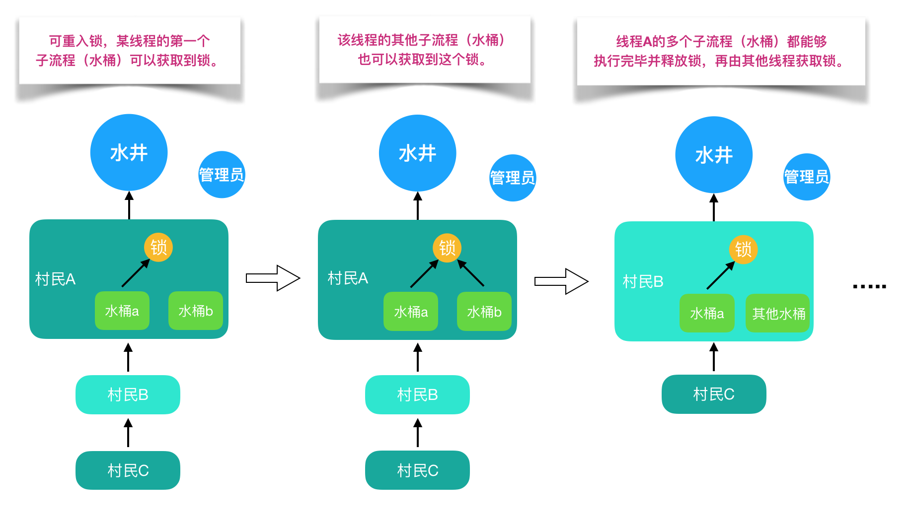
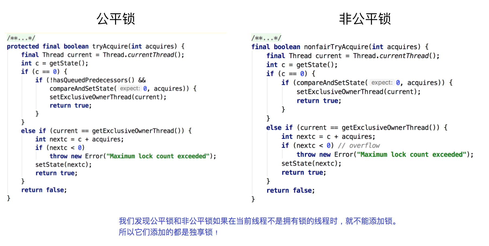

## 线程锁
转自[不可不说的Java“锁”事](https://tech.meituan.com/2018/11/15/java-lock.html)

### 前言

Java提供了种类丰富的锁，每种锁因其特性的不同，在适当的场景下能够展现出非常高的效率。本文旨在对锁相关源码（本文中的源码来自JDK 8和Netty 3.10.6）、使用场景进行举例，为读者介绍主流锁的知识点，以及不同的锁的适用场景。

Java中往往是按照是否含有某一特性来定义锁，我们通过特性将锁进行分组归类，再使用对比的方式进行介绍，帮助大家更快捷的理解相关知识。下面给出本文内容的总体分类目录：


### 1. 乐观锁 VS 悲观锁

乐观锁与悲观锁是一种广义上的概念，体现了看待线程同步的不同角度。在Java和数据库中都有此概念对应的实际应用。

先说概念。对于同一个数据的并发操作，悲观锁认为自己在使用数据的时候一定有别的线程来修改数据，因此在获取数据的时候会先加锁，确保数据不会被别的线程修改。Java中，synchronized关键字和Lock的实现类都是悲观锁。

而乐观锁认为自己在使用数据时不会有别的线程修改数据，所以不会添加锁，只是在更新数据的时候去判断之前有没有别的线程更新了这个数据。如果这个数据没有被更新，当前线程将自己修改的数据成功写入。如果数据已经被其他线程更新，则根据不同的实现方式执行不同的操作（例如报错或者自动重试）。

乐观锁在Java中是通过使用无锁编程来实现，最常采用的是CAS算法，Java原子类中的递增操作就通过CAS自旋实现的。


根据从上面的概念描述我们可以发现：

* 悲观锁适合写操作多的场景，先加锁可以保证写操作时数据正确。
* 乐观锁适合读操作多的场景，不加锁的特点能够使其读操作的性能大幅提升。

光说概念有些抽象，我们来看下乐观锁和悲观锁的调用方式示例：

```java
// ------------------------- 悲观锁的调用方式 -------------------------
// synchronized
public synchronized void testMethod() {
	// 操作同步资源
}
// ReentrantLock
private ReentrantLock lock = new ReentrantLock(); // 需要保证多个线程使用的是同一个锁
public void modifyPublicResources() {
	lock.lock();
	// 操作同步资源
	lock.unlock();
}

// ------------------------- 乐观锁的调用方式 -------------------------
private AtomicInteger atomicInteger = new AtomicInteger();  // 需要保证多个线程使用的是同一个AtomicInteger
atomicInteger.incrementAndGet(); //执行自增1

```

通过调用方式示例，我们可以发现悲观锁基本都是在显式的锁定之后再操作同步资源，而乐观锁则直接去操作同步资源。那么，为何乐观锁能够做到不锁定同步资源也可以正确的实现线程同步呢？我们通过介绍乐观锁的主要实现方式 “CAS” 的技术原理来为大家解惑。

CAS全称 Compare And Swap（比较与交换），是一种无锁算法。在不使用锁（没有线程被阻塞）的情况下实现多线程之间的变量同步。java.util.concurrent包中的原子类就是通过CAS来实现了乐观锁。

CAS算法涉及到三个操作数：

* 需要读写的内存值 V。
* 进行比较的值 A。
* 要写入的新值 B。

当且仅当 V 的值等于 A 时，CAS通过原子方式用新值B来更新V的值（“比较+更新”整体是一个原子操作），否则不会执行任何操作。一般情况下，“更新”是一个不断重试的操作。

之前提到java.util.concurrent包中的原子类，就是通过CAS来实现了乐观锁，那么我们进入原子类AtomicInteger的源码，看一下AtomicInteger的定义：


根据定义我们可以看出各属性的作用：

* unsafe： 获取并操作内存的数据。
* valueOffset： 存储value在AtomicInteger中的偏移量。
* value： 存储AtomicInteger的int值，该属性需要借助volatile关键字保证其在线程间是可见的。

接下来，我们查看AtomicInteger的自增函数incrementAndGet()的源码时，发现自增函数底层调用的是unsafe.getAndAddInt()。但是由于JDK本身只有Unsafe.class，只通过class文件中的参数名，并不能很好的了解方法的作用，所以我们通过OpenJDK 8 来查看Unsafe的源码：

```java
// ------------------------- JDK 8 -------------------------
// AtomicInteger 自增方法
public final int incrementAndGet() {
  return unsafe.getAndAddInt(this, valueOffset, 1) + 1;
}

// Unsafe.class
public final int getAndAddInt(Object var1, long var2, int var4) {
  int var5;
  do {
      var5 = this.getIntVolatile(var1, var2);
  } while(!this.compareAndSwapInt(var1, var2, var5, var5 + var4));
  return var5;
}

// ------------------------- OpenJDK 8 -------------------------
// Unsafe.java
public final int getAndAddInt(Object o, long offset, int delta) {
   int v;
   do {
       v = getIntVolatile(o, offset);
   } while (!compareAndSwapInt(o, offset, v, v + delta));
   return v;
}

```

根据OpenJDK 8的源码我们可以看出，getAndAddInt()循环获取给定对象o中的偏移量处的值v，然后判断内存值是否等于v。如果相等则将内存值设置为 v + delta，否则返回false，继续循环进行重试，直到设置成功才能退出循环，并且将旧值返回。整个“比较+更新”操作封装在compareAndSwapInt()中，在JNI里是借助于一个CPU指令完成的，属于原子操作，可以保证多个线程都能够看到同一个变量的修改值。

后续JDK通过CPU的cmpxchg指令，去比较寄存器中的 A 和 内存中的值 V。如果相等，就把要写入的新值 B 存入内存中。如果不相等，就将内存值 V 赋值给寄存器中的值 A。然后通过Java代码中的while循环再次调用cmpxchg指令进行重试，直到设置成功为止。

CAS虽然很高效，但是它也存在三大问题，这里也简单说一下：

1. **ABA问题**。CAS需要在操作值的时候检查内存值是否发生变化，没有发生变化才会更新内存值。但是如果内存值原来是A，后来变成了B，然后又变成了A，那么CAS进行检查时会发现值没有发生变化，但是实际上是有变化的。ABA问题的解决思路就是在变量前面添加版本号，每次变量更新的时候都把版本号加一，这样变化过程就从“A－B－A”变成了“1A－2B－3A”。
    * JDK从1.5开始提供了AtomicStampedReference类来解决ABA问题，具体操作封装在compareAndSet()中。compareAndSet()首先检查当前引用和当前标志与预期引用和预期标志是否相等，如果都相等，则以原子方式将引用值和标志的值设置为给定的更新值。
2. **循环时间长开销大**。CAS操作如果长时间不成功，会导致其一直自旋，给CPU带来非常大的开销。
3. **只能保证一个共享变量的原子操作**。对一个共享变量执行操作时，CAS能够保证原子操作，但是对多个共享变量操作时，CAS是无法保证操作的原子性的。
    * Java从1.5开始JDK提供了AtomicReference类来保证引用对象之间的原子性，可以把多个变量放在一个对象里来进行CAS操作。

### 2. 自旋锁 VS 适应性自旋锁

在介绍自旋锁前，我们需要介绍一些前提知识来帮助大家明白自旋锁的概念。

阻塞或唤醒一个Java线程需要操作系统切换CPU状态来完成，这种状态转换需要耗费处理器时间。如果同步代码块中的内容过于简单，状态转换消耗的时间有可能比用户代码执行的时间还要长。

在许多场景中，同步资源的锁定时间很短，为了这一小段时间去切换线程，线程挂起和恢复现场的花费可能会让系统得不偿失。如果物理机器有多个处理器，能够让两个或以上的线程同时并行执行，我们就可以让后面那个请求锁的线程不放弃CPU的执行时间，看看持有锁的线程是否很快就会释放锁。

而为了让当前线程“稍等一下”，我们需让当前线程进行自旋，如果在自旋完成后前面锁定同步资源的线程已经释放了锁，那么当前线程就可以不必阻塞而是直接获取同步资源，从而避免切换线程的开销。这就是自旋锁。


自旋锁本身是有缺点的，它不能代替阻塞。自旋等待虽然避免了线程切换的开销，但它要占用处理器时间。如果锁被占用的时间很短，自旋等待的效果就会非常好。反之，如果锁被占用的时间很长，那么自旋的线程只会白浪费处理器资源。所以，自旋等待的时间必须要有一定的限度，如果自旋超过了限定次数（默认是10次，可以使用-XX:PreBlockSpin来更改）没有成功获得锁，就应当挂起线程。

自旋锁的实现原理同样也是CAS，AtomicInteger中调用unsafe进行自增操作的源码中的do-while循环就是一个自旋操作，如果修改数值失败则通过循环来执行自旋，直至修改成功。


自旋锁在JDK1.4.2中引入，使用-XX:+UseSpinning来开启。JDK 6中变为默认开启，并且引入了自适应的自旋锁（适应性自旋锁）。

自适应意味着自旋的时间（次数）不再固定，而是由前一次在同一个锁上的自旋时间及锁的拥有者的状态来决定。如果在同一个锁对象上，自旋等待刚刚成功获得过锁，并且持有锁的线程正在运行中，那么虚拟机就会认为这次自旋也是很有可能再次成功，进而它将允许自旋等待持续相对更长的时间。如果对于某个锁，自旋很少成功获得过，那在以后尝试获取这个锁时将可能省略掉自旋过程，直接阻塞线程，避免浪费处理器资源。

在自旋锁中 另有三种常见的锁形式:TicketLock、CLHlock和MCSlock，本文中仅做名词介绍，不做深入讲解，感兴趣的同学可以自行查阅相关资料。

### 3. 无锁 VS 偏向锁 VS 轻量级锁 VS 重量级锁

这四种锁是指锁的状态，专门针对synchronized的。在介绍这四种锁状态之前还需要介绍一些额外的知识。

首先为什么Synchronized能实现线程同步？

在回答这个问题之前我们需要了解两个重要的概念：“Java对象头”、“Monitor”。

#### Java对象头

synchronized是悲观锁，在操作同步资源之前需要给同步资源先加锁，这把锁就是存在Java对象头里的，而Java对象头又是什么呢？

我们以Hotspot虚拟机为例，Hotspot的对象头主要包括两部分数据：Mark Word（标记字段）、Klass Pointer（类型指针）。

**Mark Word**：默认存储对象的HashCode，分代年龄和锁标志位信息。这些信息都是与对象自身定义无关的数据，所以Mark Word被设计成一个非固定的数据结构以便在极小的空间内存存储尽量多的数据。它会根据对象的状态复用自己的存储空间，也就是说在运行期间Mark Word里存储的数据会随着锁标志位的变化而变化。

**Klass Point**：对象指向它的类元数据的指针，虚拟机通过这个指针来确定这个对象是哪个类的实例。

#### Monitor

Monitor可以理解为一个同步工具或一种同步机制，通常被描述为一个对象。每一个Java对象就有一把看不见的锁，称为内部锁或者Monitor锁。

Monitor是线程私有的数据结构，每一个线程都有一个可用monitor record列表，同时还有一个全局的可用列表。每一个被锁住的对象都会和一个monitor关联，同时monitor中有一个Owner字段存放拥有该锁的线程的唯一标识，表示该锁被这个线程占用。

现在话题回到synchronized，synchronized通过Monitor来实现线程同步，Monitor是依赖于底层的操作系统的Mutex Lock（互斥锁）来实现的线程同步。

如同我们在自旋锁中提到的“阻塞或唤醒一个Java线程需要操作系统切换CPU状态来完成，这种状态转换需要耗费处理器时间。如果同步代码块中的内容过于简单，状态转换消耗的时间有可能比用户代码执行的时间还要长”。这种方式就是synchronized最初实现同步的方式，这就是JDK 6之前synchronized效率低的原因。这种依赖于操作系统Mutex Lock所实现的锁我们称之为“重量级锁”，JDK 6中为了减少获得锁和释放锁带来的性能消耗，引入了“偏向锁”和“轻量级锁”。

所以目前锁一共有4种状态，级别从低到高依次是：无锁、偏向锁、轻量级锁和重量级锁。锁状态只能升级不能降级。

通过上面的介绍，我们对synchronized的加锁机制以及相关知识有了一个了解，那么下面我们给出四种锁状态对应的的Mark Word内容，然后再分别讲解四种锁状态的思路以及特点：

| 锁状态 | 存储内容 | 存储内容 |
| :-: | :-- | :-: |
| 无锁 | 对象的hashCode、对象分代年龄、是否是偏向锁（0） | 01 |
| 偏向锁 | 偏向线程ID、偏向时间戳、对象分代年龄、是否是偏向锁（1） | 01 |
| 轻量级锁 | 指向栈中锁记录的指针 | 00 |
| 重量级锁 | 指向互斥量（重量级锁）的指针 | 10 |

**无锁**

无锁没有对资源进行锁定，所有的线程都能访问并修改同一个资源，但同时只有一个线程能修改成功。

无锁的特点就是修改操作在循环内进行，线程会不断的尝试修改共享资源。如果没有冲突就修改成功并退出，否则就会继续循环尝试。如果有多个线程修改同一个值，必定会有一个线程能修改成功，而其他修改失败的线程会不断重试直到修改成功。上面我们介绍的CAS原理及应用即是无锁的实现。无锁无法全面代替有锁，但无锁在某些场合下的性能是非常高的。

**偏向锁**

偏向锁是指一段同步代码一直被一个线程所访问，那么该线程会自动获取锁，降低获取锁的代价。

在大多数情况下，锁总是由同一线程多次获得，不存在多线程竞争，所以出现了偏向锁。其目标就是在只有一个线程执行同步代码块时能够提高性能。

当一个线程访问同步代码块并获取锁时，会在Mark Word里存储锁偏向的线程ID。在线程进入和退出同步块时不再通过CAS操作来加锁和解锁，而是检测Mark Word里是否存储着指向当前线程的偏向锁。引入偏向锁是为了在无多线程竞争的情况下尽量减少不必要的轻量级锁执行路径，因为轻量级锁的获取及释放依赖多次CAS原子指令，而偏向锁只需要在置换ThreadID的时候依赖一次CAS原子指令即可。

偏向锁只有遇到其他线程尝试竞争偏向锁时，持有偏向锁的线程才会释放锁，线程不会主动释放偏向锁。偏向锁的撤销，需要等待全局安全点（在这个时间点上没有字节码正在执行），它会首先暂停拥有偏向锁的线程，判断锁对象是否处于被锁定状态。撤销偏向锁后恢复到无锁（标志位为“01”）或轻量级锁（标志位为“00”）的状态。

偏向锁在JDK 6及以后的JVM里是默认启用的。可以通过JVM参数关闭偏向锁：-XX:-UseBiasedLocking=false，关闭之后程序默认会进入轻量级锁状态。

**轻量级锁**

是指当锁是偏向锁的时候，被另外的线程所访问，偏向锁就会升级为轻量级锁，其他线程会通过自旋的形式尝试获取锁，不会阻塞，从而提高性能。

在代码进入同步块的时候，如果同步对象锁状态为无锁状态（锁标志位为“01”状态，是否为偏向锁为“0”），虚拟机首先将在当前线程的栈帧中建立一个名为锁记录（Lock Record）的空间，用于存储锁对象目前的Mark Word的拷贝，然后拷贝对象头中的Mark Word复制到锁记录中。

拷贝成功后，虚拟机将使用CAS操作尝试将对象的Mark Word更新为指向Lock Record的指针，并将Lock Record里的owner指针指向对象的Mark Word。

如果这个更新动作成功了，那么这个线程就拥有了该对象的锁，并且对象Mark Word的锁标志位设置为“00”，表示此对象处于轻量级锁定状态。

如果轻量级锁的更新操作失败了，虚拟机首先会检查对象的Mark Word是否指向当前线程的栈帧，如果是就说明当前线程已经拥有了这个对象的锁，那就可以直接进入同步块继续执行，否则说明多个线程竞争锁。

若当前只有一个等待线程，则该线程通过自旋进行等待。但是当自旋超过一定的次数，或者一个线程在持有锁，一个在自旋，又有第三个来访时，轻量级锁升级为重量级锁。

**重量级锁**

升级为重量级锁时，锁标志的状态值变为“10”，此时Mark Word中存储的是指向重量级锁的指针，此时等待锁的线程都会进入阻塞状态。

整体的锁状态升级流程如下：


综上，偏向锁通过对比Mark Word解决加锁问题，避免执行CAS操作。而轻量级锁是通过用CAS操作和自旋来解决加锁问题，避免线程阻塞和唤醒而影响性能。重量级锁是将除了拥有锁的线程以外的线程都阻塞。

### 4. 公平锁 VS 非公平锁

公平锁是指多个线程按照申请锁的顺序来获取锁，线程直接进入队列中排队，队列中的第一个线程才能获得锁。公平锁的优点是等待锁的线程不会饿死。缺点是整体吞吐效率相对非公平锁要低，等待队列中除第一个线程以外的所有线程都会阻塞，CPU唤醒阻塞线程的开销比非公平锁大。

非公平锁是多个线程加锁时直接尝试获取锁，获取不到才会到等待队列的队尾等待。但如果此时锁刚好可用，那么这个线程可以无需阻塞直接获取到锁，所以非公平锁有可能出现后申请锁的线程先获取锁的场景。非公平锁的优点是可以减少唤起线程的开销，整体的吞吐效率高，因为线程有几率不阻塞直接获得锁，CPU不必唤醒所有线程。缺点是处于等待队列中的线程可能会饿死，或者等很久才会获得锁。

直接用语言描述可能有点抽象，这里作者用从别处看到的一个例子来讲述一下公平锁和非公平锁。


如上图所示，假设有一口水井，有管理员看守，管理员有一把锁，只有拿到锁的人才能够打水，打完水要把锁还给管理员。每个过来打水的人都要管理员的允许并拿到锁之后才能去打水，如果前面有人正在打水，那么这个想要打水的人就必须排队。管理员会查看下一个要去打水的人是不是队伍里排最前面的人，如果是的话，才会给你锁让你去打水；如果你不是排第一的人，就必须去队尾排队，这就是公平锁。

但是对于非公平锁，管理员对打水的人没有要求。即使等待队伍里有排队等待的人，但如果在上一个人刚打完水把锁还给管理员而且管理员还没有允许等待队伍里下一个人去打水时，刚好来了一个插队的人，这个插队的人是可以直接从管理员那里拿到锁去打水，不需要排队，原本排队等待的人只能继续等待。如下图所示：


接下来我们通过ReentrantLock的源码来讲解公平锁和非公平锁。


根据代码可知，ReentrantLock里面有一个内部类Sync，Sync继承AQS（AbstractQueuedSynchronizer），添加锁和释放锁的大部分操作实际上都是在Sync中实现的。它有公平锁FairSync和非公平锁NonfairSync两个子类。ReentrantLock默认使用非公平锁，也可以通过构造器来显示的指定使用公平锁。

下面我们来看一下公平锁与非公平锁的加锁方法的源码:


通过上图中的源代码对比，我们可以明显的看出公平锁与非公平锁的lock()方法唯一的区别就在于公平锁在获取同步状态时多了一个限制条件：hasQueuedPredecessors()。


再进入hasQueuedPredecessors()，可以看到该方法主要做一件事情：主要是判断当前线程是否位于同步队列中的第一个。如果是则返回true，否则返回false。

综上，公平锁就是通过同步队列来实现多个线程按照申请锁的顺序来获取锁，从而实现公平的特性。非公平锁加锁时不考虑排队等待问题，直接尝试获取锁，所以存在后申请却先获得锁的情况。

### 5. 可重入锁 VS 非可重入锁

可重入锁又名递归锁，是指在同一个线程在外层方法获取锁的时候，再进入该线程的内层方法会自动获取锁（前提锁对象得是同一个对象或者class），不会因为之前已经获取过还没释放而阻塞。Java中ReentrantLock和synchronized都是可重入锁，可重入锁的一个优点是可一定程度避免死锁。下面用示例代码来进行分析：

```java
public class Widget {
    public synchronized void doSomething() {
        System.out.println("方法1执行...");
        doOthers();
    }

    public synchronized void doOthers() {
        System.out.println("方法2执行...");
    }
}

```

在上面的代码中，类中的两个方法都是被内置锁synchronized修饰的，doSomething()方法中调用doOthers()方法。因为内置锁是可重入的，所以同一个线程在调用doOthers()时可以直接获得当前对象的锁，进入doOthers()进行操作。

如果是一个不可重入锁，那么当前线程在调用doOthers()之前需要将执行doSomething()时获取当前对象的锁释放掉，实际上该对象锁已被当前线程所持有，且无法释放。所以此时会出现死锁。

而为什么可重入锁就可以在嵌套调用时可以自动获得锁呢？我们通过图示和源码来分别解析一下。

还是打水的例子，有多个人在排队打水，此时管理员允许锁和同一个人的多个水桶绑定。这个人用多个水桶打水时，第一个水桶和锁绑定并打完水之后，第二个水桶也可以直接和锁绑定并开始打水，所有的水桶都打完水之后打水人才会将锁还给管理员。这个人的所有打水流程都能够成功执行，后续等待的人也能够打到水。这就是可重入锁。




但如果是非可重入锁的话，此时管理员只允许锁和同一个人的一个水桶绑定。第一个水桶和锁绑定打完水之后并不会释放锁，导致第二个水桶不能和锁绑定也无法打水。当前线程出现死锁，整个等待队列中的所有线程都无法被唤醒。


之前我们说过ReentrantLock和synchronized都是重入锁，那么我们通过重入锁ReentrantLock以及非可重入锁NonReentrantLock的源码来对比分析一下为什么非可重入锁在重复调用同步资源时会出现死锁。

首先ReentrantLock和NonReentrantLock都继承父类AQS，其父类AQS中维护了一个同步状态status来计数重入次数，status初始值为0。

当线程尝试获取锁时，可重入锁先尝试获取并更新status值，如果status == 0表示没有其他线程在执行同步代码，则把status置为1，当前线程开始执行。如果status != 0，则判断当前线程是否是获取到这个锁的线程，如果是的话执行status+1，且当前线程可以再次获取锁。而非可重入锁是直接去获取并尝试更新当前status的值，如果status != 0的话会导致其获取锁失败，当前线程阻塞。

释放锁时，可重入锁同样先获取当前status的值，在当前线程是持有锁的线程的前提下。如果status-1 == 0，则表示当前线程所有重复获取锁的操作都已经执行完毕，然后该线程才会真正释放锁。而非可重入锁则是在确定当前线程是持有锁的线程之后，直接将status置为0，将锁释放。


### 6. 独享锁 VS 共享锁

独享锁和共享锁同样是一种概念。我们先介绍一下具体的概念，然后通过ReentrantLock和ReentrantReadWriteLock的源码来介绍独享锁和共享锁。

独享锁也叫排他锁，是指该锁一次只能被一个线程所持有。如果线程T对数据A加上排它锁后，则其他线程不能再对A加任何类型的锁。获得排它锁的线程即能读数据又能修改数据。JDK中的synchronized和JUC中Lock的实现类就是互斥锁。

共享锁是指该锁可被多个线程所持有。如果线程T对数据A加上共享锁后，则其他线程只能对A再加共享锁，不能加排它锁。获得共享锁的线程只能读数据，不能修改数据。

独享锁与共享锁也是通过AQS来实现的，通过实现不同的方法，来实现独享或者共享。

下图为ReentrantReadWriteLock的部分源码：


我们看到ReentrantReadWriteLock有两把锁：ReadLock和WriteLock，由词知意，一个读锁一个写锁，合称“读写锁”。再进一步观察可以发现ReadLock和WriteLock是靠内部类Sync实现的锁。Sync是AQS的一个子类，这种结构在CountDownLatch、ReentrantLock、Semaphore里面也都存在。

在ReentrantReadWriteLock里面，读锁和写锁的锁主体都是Sync，但读锁和写锁的加锁方式不一样。读锁是共享锁，写锁是独享锁。读锁的共享锁可保证并发读非常高效，而读写、写读、写写的过程互斥，因为读锁和写锁是分离的。所以ReentrantReadWriteLock的并发性相比一般的互斥锁有了很大提升。

那读锁和写锁的具体加锁方式有什么区别呢？在了解源码之前我们需要回顾一下其他知识。 在最开始提及AQS的时候我们也提到了state字段（int类型，32位），该字段用来描述有多少线程获持有锁。

在独享锁中这个值通常是0或者1（如果是重入锁的话state值就是重入的次数），在共享锁中state就是持有锁的数量。但是在ReentrantReadWriteLock中有读、写两把锁，所以需要在一个整型变量state上分别描述读锁和写锁的数量（或者也可以叫状态）。于是将state变量“按位切割”切分成了两个部分，高16位表示读锁状态（读锁个数），低16位表示写锁状态（写锁个数）。如下图所示：


了解了概念之后我们再来看代码，先看写锁的加锁源码：

```java
protected final boolean tryAcquire(int acquires) {
	Thread current = Thread.currentThread();
	int c = getState(); // 取到当前锁的个数
	int w = exclusiveCount(c); // 取写锁的个数w
	if (c != 0) { // 如果已经有线程持有了锁(c!=0)
    // (Note: if c != 0 and w == 0 then shared count != 0)
		if (w == 0 || current != getExclusiveOwnerThread()) // 如果写线程数（w）为0（换言之存在读锁） 或者持有锁的线程不是当前线程就返回失败
			return false;
		if (w + exclusiveCount(acquires) > MAX_COUNT)    // 如果写入锁的数量大于最大数（65535，2的16次方-1）就抛出一个Error。
      throw new Error("Maximum lock count exceeded");
		// Reentrant acquire
    setState(c + acquires);
    return true;
  }
  if (writerShouldBlock() || !compareAndSetState(c, c + acquires)) // 如果当且写线程数为0，并且当前线程需要阻塞那么就返回失败；或者如果通过CAS增加写线程数失败也返回失败。
		return false;
	setExclusiveOwnerThread(current); // 如果c=0，w=0或者c>0，w>0（重入），则设置当前线程或锁的拥有者
	return true;
}

```

* 这段代码首先取到当前锁的个数c，然后再通过c来获取写锁的个数w。因为写锁是低16位，所以取低16位的最大值与当前的c做与运算（ int w = exclusiveCount©; ），高16位和0与运算后是0，剩下的就是低位运算的值，同时也是持有写锁的线程数目。
* 在取到写锁线程的数目后，首先判断是否已经有线程持有了锁。如果已经有线程持有了锁(c!=0)，则查看当前写锁线程的数目，如果写线程数为0（即此时存在读锁）或者持有锁的线程不是当前线程就返回失败（涉及到公平锁和非公平锁的实现）。
* 如果写入锁的数量大于最大数（65535，2的16次方-1）就抛出一个Error。
* 如果当且写线程数为0（那么读线程也应该为0，因为上面已经处理c!=0的情况），并且当前线程需要阻塞那么就返回失败；如果通过CAS增加写线程数失败也返回失败。
* 如果c=0,w=0或者c>0,w>0（重入），则设置当前线程或锁的拥有者，返回成功！

tryAcquire()除了重入条件（当前线程为获取了写锁的线程）之外，增加了一个读锁是否存在的判断。如果存在读锁，则写锁不能被获取，原因在于：必须确保写锁的操作对读锁可见，如果允许读锁在已被获取的情况下对写锁的获取，那么正在运行的其他读线程就无法感知到当前写线程的操作。

因此，只有等待其他读线程都释放了读锁，写锁才能被当前线程获取，而写锁一旦被获取，则其他读写线程的后续访问均被阻塞。写锁的释放与ReentrantLock的释放过程基本类似，每次释放均减少写状态，当写状态为0时表示写锁已被释放，然后等待的读写线程才能够继续访问读写锁，同时前次写线程的修改对后续的读写线程可见。

接着是读锁的代码：

```java
protected final int tryAcquireShared(int unused) {
    Thread current = Thread.currentThread();
    int c = getState();
    if (exclusiveCount(c) != 0 &&
        getExclusiveOwnerThread() != current)
        return -1;                                   // 如果其他线程已经获取了写锁，则当前线程获取读锁失败，进入等待状态
    int r = sharedCount(c);
    if (!readerShouldBlock() &&
        r < MAX_COUNT &&
        compareAndSetState(c, c + SHARED_UNIT)) {
        if (r == 0) {
            firstReader = current;
            firstReaderHoldCount = 1;
        } else if (firstReader == current) {
            firstReaderHoldCount++;
        } else {
            HoldCounter rh = cachedHoldCounter;
            if (rh == null || rh.tid != getThreadId(current))
                cachedHoldCounter = rh = readHolds.get();
            else if (rh.count == 0)
                readHolds.set(rh);
            rh.count++;
        }
        return 1;
    }
    return fullTryAcquireShared(current);
}

```

可以看到在tryAcquireShared(int unused)方法中，如果其他线程已经获取了写锁，则当前线程获取读锁失败，进入等待状态。如果当前线程获取了写锁或者写锁未被获取，则当前线程（线程安全，依靠CAS保证）增加读状态，成功获取读锁。读锁的每次释放（线程安全的，可能有多个读线程同时释放读锁）均减少读状态，减少的值是“1<<16”。所以读写锁才能实现读读的过程共享，而读写、写读、写写的过程互斥。

此时，我们再回头看一下互斥锁ReentrantLock中公平锁和非公平锁的加锁源码：




我们发现在ReentrantLock虽然有公平锁和非公平锁两种，但是它们添加的都是独享锁。根据源码所示，当某一个线程调用lock方法获取锁时，如果同步资源没有被其他线程锁住，那么当前线程在使用CAS更新state成功后就会成功抢占该资源。而如果公共资源被占用且不是被当前线程占用，那么就会加锁失败。所以可以确定ReentrantLock无论读操作还是写操作，添加的锁都是都是独享锁。

### 结语

本文Java中常用的锁以及常见的锁的概念进行了基本介绍，并从源码以及实际应用的角度进行了对比分析。限于篇幅以及个人水平，没有在本篇文章中对所有内容进行深层次的讲解。

其实Java本身已经对锁本身进行了良好的封装，降低了研发同学在平时工作中的使用难度。但是研发同学也需要熟悉锁的底层原理，不同场景下选择最适合的锁。而且源码中的思路都是非常好的思路，也是值得大家去学习和借鉴的。


## 分布式锁
### 什么是锁？
在单进程的系统中，当存在多个线程可以同时改变某个变量（可变共享变量）时，就需要对变量或代码块做同步，使其在修改这种变量时能够线性执行消除并发修改变量。
而同步的本质是通过锁来实现的。为了实现多个线程在一个时刻同一个代码块只能有一个线程可执行，那么需要在某个地方做个标记，这个标记必须每个线程都能看到，当标记不存在时可以设置该标记，其余后续线程发现已经有标记了则等待拥有标记的线程结束同步代码块取消标记后再去尝试设置标记。这个标记可以理解为锁。
不同地方实现锁的方式也不一样，只要能满足所有线程都能看得到标记即可。如 Java 中 synchronize 是在对象头设置标记，Lock 接口的实现类基本上都只是某一个 volitile 修饰的 int 型变量其保证每个线程都能拥有对该 int 的可见性和原子修改，linux 内核中也是利用互斥量或信号量等内存数据做标记。
除了利用内存数据做锁其实任何互斥的都能做锁（只考虑互斥情况），如流水表中流水号与时间结合做幂等校验可以看作是一个不会释放的锁，或者使用某个文件是否存在作为锁等。只需要满足在对标记进行修改能保证原子性和内存可见性即可。
### 什么是分布式？
分布式的 CAP 理论告诉我们:

任何一个分布式系统都无法同时满足一致性（Consistency）、可用性（Availability）和分区容错性（Partition tolerance），最多只能同时满足两项。

目前很多大型网站及应用都是分布式部署的，分布式场景中的数据一致性问题一直是一个比较重要的话题。基于 CAP理论，很多系统在设计之初就要对这三者做出取舍。在互联网领域的绝大多数的场景中，都需要牺牲强一致性来换取系统的高可用性，系统往往只需要保证最终一致性。

分布式场景

此处主要指集群模式下，多个相同服务同时开启.

在许多的场景中，我们为了保证数据的最终一致性，需要很多的技术方案来支持，比如分布式事务、分布式锁等。很多时候我们需要保证一个方法在同一时间内只能被同一个线程执行。在单机环境中，通过 Java 提供的并发 API 我们可以解决，但是在分布式环境下，就没有那么简单啦。

分布式与单机情况下最大的不同在于其不是多线程而是多进程。
多线程由于可以共享堆内存，因此可以简单的采取内存作为标记存储位置。而进程之间甚至可能都不在同一台物理机上，因此需要将标记存储在一个所有进程都能看到的地方。
什么是分布式锁？

当在分布式模型下，数据只有一份（或有限制），此时需要利用锁的技术控制某一时刻修改数据的进程数。
与单机模式下的锁不仅需要保证进程可见，还需要考虑进程与锁之间的网络问题。（我觉得分布式情况下之所以问题变得复杂，主要就是需要考虑到网络的延时和不可靠。。。一个大坑）
分布式锁还是可以将标记存在内存，只是该内存不是某个进程分配的内存而是公共内存如 Redis、Memcache。至于利用数据库、文件等做锁与单机的实现是一样的，只要保证标记能互斥就行。
### 我们需要怎样的分布式锁？
可以保证在分布式部署的应用集群中，同一个方法在同一时间只能被一台机器-上的一个线程执行。
这把锁要是一把可重入锁（避免死锁）
这把锁最好是一把阻塞锁（根据业务需求考虑要不要这条）
这把锁最好是一把公平锁（根据业务需求考虑要不要这条）
有高可用的获取锁和释放锁功能
获取锁和释放锁的性能要好
### 基于数据库做分布式锁
基于乐观锁

基于表主键唯一做分布式锁

思路：利用主键唯一的特性，如果有多个请求同时提交到数据库的话，数据库会保证只有一个操作可以成功，那么我们就可以认为操作成功的那个线程获得了该方法的锁，当方法执行完毕之后，想要释放锁的话，删除这条数据库记录即可。

上面这种简单的实现有以下几个问题：

这把锁强依赖数据库的可用性，数据库是一个单点，一旦数据库挂掉，会导致业务系统不可用。
这把锁没有失效时间，一旦解锁操作失败，就会导致锁记录一直在数据库中，其他线程无法再获得到锁。
这把锁只能是非阻塞的，因为数据的 insert操作，一旦插入失败就会直接报错。没有获得锁的线程并不会进入排队队列，要想再次获得锁就要再次触发获得锁操作。
这把锁是非重入的，同一个线程在没有释放锁之前无法再次获得该锁。因为数据中数据已经存在了。
这把锁是非公平锁，所有等待锁的线程凭运气去争夺锁。
在 MySQL 数据库中采用主键冲突防重，在大并发情况下有可能会造成锁表现象。
当然，我们也可以有其他方式解决上面的问题。

数据库是单点？搞两个数据库，数据之前双向同步，一旦挂掉快速切换到备库上。
没有失效时间？只要做一个定时任务，每隔一定时间把数据库中的超时数据清理一遍。
非阻塞的？搞一个 while 循环，直到 insert 成功再返回成功。
非重入的？在数据库表中加个字段，记录当前获得锁的机器的主机信息和线程信息，那么下次再获取锁的时候先查询数据库，如果当前机器的主机信息和线程信息在数据库可以查到的话，直接把锁分配给他就可以了。
非公平的？再建一张中间表，将等待锁的线程全记录下来，并根据创建时间排序，只有最先创建的允许获取锁。
比较好的办法是在程序中生产主键进行防重。
##### 基于表字段版本号做分布式锁
这个策略源于 mysql 的 mvcc 机制，使用这个策略其实本身没有什么问题，唯一的问题就是对数据表侵入较大，我们要为每个表设计一个版本号字段，然后写一条判断 sql 每次进行判断，增加了数据库操作的次数，在高并发的要求下，对数据库连接的开销也是无法忍受的。

基于悲观锁

##### 基于数据库排他锁做分布式锁
在查询语句后面增加for update，数据库会在查询过程中给数据库表增加排他锁 (注意： InnoDB 引擎在加锁的时候，只有通过索引进行检索的时候才会使用行级锁，否则会使用表级锁。这里我们希望使用行级锁，就要给要执行的方法字段名添加索引，值得注意的是，这个索引一定要创建成唯一索引，否则会出现多个重载方法之间无法同时被访问的问题。重载方法的话建议把参数类型也加上。)。当某条记录被加上排他锁之后，其他线程无法再在该行记录上增加排他锁。


我们可以认为获得排他锁的线程即可获得分布式锁，当获取到锁之后，可以执行方法的业务逻辑，执行完方法之后，通过connection.commit()操作来释放锁。


这种方法可以有效的解决上面提到的无法释放锁和阻塞锁的问题。

阻塞锁？ for update语句会在执行成功后立即返回，在执行失败时一直处于阻塞状态，直到成功。
锁定之后服务宕机，无法释放？使用这种方式，服务宕机之后数据库会自己把锁释放掉。
但是还是无法直接解决数据库单点和可重入问题。

这里还可能存在另外一个问题，虽然我们对方法字段名使用了唯一索引，并且显示使用 for update 来使用行级锁。但是，MySQL 会对查询进行优化，即便在条件中使用了索引字段，但是否使用索引来检索数据是由 MySQL 通过判断不同执行计划的代价来决定的，如果 MySQL 认为全表扫效率更高，比如对一些很小的表，它就不会使用索引，这种情况下 InnoDB 将使用表锁，而不是行锁。如果发生这种情况就悲剧了。。。

还有一个问题，就是我们要使用排他锁来进行分布式锁的 lock，那么一个排他锁长时间不提交，就会占用数据库连接。一旦类似的连接变得多了，就可能把数据库连接池撑爆。

##### 优缺点
优点：简单，易于理解


缺点：会有各种各样的问题（操作数据库需要一定的开销，使用数据库的行级锁并不一定靠谱，性能不靠谱）

### 基于 Redis 做分布式锁
#### 基于 REDIS 的 SETNX()、EXPIRE() 方法做分布式锁

setnx()

setnx 的含义就是 SET if Not Exists，其主要有两个参数 setnx(key, value)。该方法是原子的，如果 key 不存在，则设置当前 key 成功，返回 1；如果当前 key 已经存在，则设置当前 key 失败，返回 0。

expire()

expire 设置过期时间，要注意的是 setnx 命令不能设置 key 的超时时间，只能通过 expire() 来对 key 设置。

使用步骤

1. setnx(lockkey, 1) 如果返回 0，则说明占位失败；如果返回 1，则说明占位成功

2. expire() 命令对 lockkey 设置超时时间，为的是避免死锁问题。

3. 执行完业务代码后，可以通过 delete 命令删除 key。

这个方案其实是可以解决日常工作中的需求的，但从技术方案的探讨上来说，可能还有一些可以完善的地方。比如，如果在第一步 setnx 执行成功后，在 expire() 命令执行成功前，发生了宕机的现象，那么就依然会出现死锁的问题，所以如果要对其进行完善的话，可以使用 redis 的 setnx()、get() 和 getset() 方法来实现分布式锁。

#### 基于 REDIS 的 SETNX()、GET()、GETSET()方法做分布式锁

这个方案的背景主要是在 setnx() 和 expire() 的方案上针对可能存在的死锁问题，做了一些优化。

getset()

这个命令主要有两个参数 getset(key，newValue)。该方法是原子的，对 key 设置 newValue 这个值，并且返回 key 原来的旧值。假设 key 原来是不存在的，那么多次执行这个命令，会出现下边的效果：

getset(key, “value1”) 返回 null 此时 key 的值会被设置为 value1
getset(key, “value2”) 返回 value1 此时 key 的值会被设置为 value2
依次类推！
使用步骤

1. setnx(lockkey, 当前时间+过期超时时间)，如果返回 1，则获取锁成功；如果返回 0 则没有获取到锁，转向 2。
2. get(lockkey) 获取值 oldExpireTime ，并将这个 value 值与当前的系统时间进行比较，如果小于当前系统时间，则认为这个锁已经超时，可以允许别的请求重新获取，转向 3。
3. 计算 newExpireTime = 当前时间+过期超时时间，然后 getset(lockkey, newExpireTime) 会返回当前 lockkey 的值currentExpireTime。
    判断 currentExpireTime 与 oldExpireTime 是否相等，如果相等，说明当前 getset 设置成功，获取到了锁。如果不相等，说明这个锁又被别的请求获取走了，那么当前请求可以直接返回失败，或者继续重试。
在获取到锁之后，当前线程可以开始自己的业务处理，当处理完毕后，比较自己的处理时间和对于锁设置的超时时间，如果小于锁设置的超时时间，则直接执行 delete 释放锁；如果大于锁设置的超时时间，则不需要再锁进行处理。

```java
import cn.com.tpig.cache.redis.RedisService;
import cn.com.tpig.utils.SpringUtils;

//redis分布式锁
public final class RedisLockUtil {

    private static final int defaultExpire = 60;

    private RedisLockUtil() {
        //
    }

    /**
     * 加锁
     * @param key redis key
     * @param expire 过期时间，单位秒
     * @return true:加锁成功，false，加锁失败
     */
    public static boolean lock(String key, int expire) {

        RedisService redisService = SpringUtils.getBean(RedisService.class);
        long status = redisService.setnx(key, "1");

        if(status == 1) {
            redisService.expire(key, expire);
            return true;
        }

        return false;
    }

    public static boolean lock(String key) {
        return lock2(key, defaultExpire);
    }

    /**
     * 加锁
     * @param key redis key
     * @param expire 过期时间，单位秒
     * @return true:加锁成功，false，加锁失败
     */
    public static boolean lock2(String key, int expire) {

        RedisService redisService = SpringUtils.getBean(RedisService.class);

        long value = System.currentTimeMillis() + expire;
        long status = redisService.setnx(key, String.valueOf(value));

        if(status == 1) {
            return true;
        }
        long oldExpireTime = Long.parseLong(redisService.get(key, "0"));
        if(oldExpireTime < System.currentTimeMillis()) {
            //超时
            long newExpireTime = System.currentTimeMillis() + expire;
            long currentExpireTime = Long.parseLong(redisService.getSet(key, String.valueOf(newExpireTime)));
            if(currentExpireTime == oldExpireTime) {
                return true;
            }
        }
        return false;
    }

    public static void unLock1(String key) {
        RedisService redisService = SpringUtils.getBean(RedisService.class);
        redisService.del(key);
    }

    public static void unLock2(String key) {    
        RedisService redisService = SpringUtils.getBean(RedisService.class);    
        long oldExpireTime = Long.parseLong(redisService.get(key, "0"));   
        if(oldExpireTime > System.currentTimeMillis()) {        
            redisService.del(key);    
        }
   }
}
public void drawRedPacket(long userId) {
    String key = "draw.redpacket.userid:" + userId;

    boolean lock = RedisLockUtil.lock2(key, 60);
    if(lock) {
        try {
            //领取操作
        } finally {
            //释放锁
            RedisLockUtil.unLock(key);
        }
    } else {
        new RuntimeException("重复领取奖励");
    }
}
```
#### 基于 REDLOCK 做分布式锁

Redlock 是 Redis 的作者 antirez 给出的集群模式的 Redis 分布式锁，它基于 N 个完全独立的 Redis 节点（通常情况下 N 可以设置成 5）。

算法的步骤如下：

1. 客户端获取当前时间，以毫秒为单位。
2. 客户端尝试获取 N 个节点的锁，（每个节点获取锁的方式和前面说的缓存锁一样），N 个节点以相同的 key 和 value 获取锁。客户端需要设置接口访问超时，接口超时时间需要远远小于锁超时时间，比如锁自动释放的时间是 10s，那么接口超时大概设置 5-50ms。这样可以在有 redis 节点宕机后，访问该节点时能尽快超时，而减小锁的正常使用。
3. 客户端计算在获得锁的时候花费了多少时间，方法是用当前时间减去在步骤一获取的时间，只有客户端获得了超过 3 个节点的锁，而且获取锁的时间小于锁的超时时间，客户端才获得了分布式锁。
4. 客户端获取的锁的时间为设置的锁超时时间减去步骤三计算出的获取锁花费时间。
5. 如果客户端获取锁失败了，客户端会依次删除所有的锁。
使用 Redlock 算法，可以保证在挂掉最多 2 个节点的时候，分布式锁服务仍然能工作，这相比之前的数据库锁和缓存锁大大提高了可用性，由于 redis 的高效性能，分布式缓存锁性能并不比数据库锁差。

但是，有一位分布式的专家写了一篇文章《How to do distributed locking》，质疑 Redlock 的正确性。

https://mp.weixin.qq.com/s/1bPLk_VZhZ0QYNZS8LkviA

https://blog.csdn.net/jek123456/article/details/72954106

优缺点

优点： 性能高

缺点：

失效时间设置多长时间为好？如何设置的失效时间太短，方法没等执行完，锁就自动释放了，那么就会产生并发问题。如果设置的时间太长，其他获取锁的线程就可能要平白的多等一段时间。

#### 基于 REDISSON 做分布式锁

redisson 是 redis 官方的分布式锁组件。GitHub 地址：https://github.com/redisson/redisson

上面的这个问题 ——> 失效时间设置多长时间为好？这个问题在 redisson 的做法是：每获得一个锁时，只设置一个很短的超时时间，同时起一个线程在每次快要到超时时间时去刷新锁的超时时间。在释放锁的同时结束这个线程。

### 基于 ZooKeeper 做分布式锁

#### ZOOKEEPER 锁相关基础知识

zk 一般由多个节点构成（单数），采用 zab 一致性协议。因此可以将 zk 看成一个单点结构，对其修改数据其内部自动将所有节点数据进行修改而后才提供查询服务。
zk 的数据以目录树的形式，每个目录称为 znode， znode 中可存储数据（一般不超过 1M），还可以在其中增加子节点。
子节点有三种类型。序列化节点，每在该节点下增加一个节点自动给该节点的名称上自增。临时节点，一旦创建这个 znode 的客户端与服务器失去联系，这个 znode 也将自动删除。最后就是普通节点。
Watch 机制，client 可以监控每个节点的变化，当产生变化会给 client 产生一个事件。
ZK 基本锁

原理：利用临时节点与 watch 机制。每个锁占用一个普通节点 /lock，当需要获取锁时在 /lock 目录下创建一个临时节点，创建成功则表示获取锁成功，失败则 watch/lock 节点，有删除操作后再去争锁。临时节点好处在于当进程挂掉后能自动上锁的节点自动删除即取消锁。
缺点：所有取锁失败的进程都监听父节点，很容易发生羊群效应，即当释放锁后所有等待进程一起来创建节点，并发量很大。
ZK 锁优化

原理：上锁改为创建临时有序节点，每个上锁的节点均能创建节点成功，只是其序号不同。只有序号最小的可以拥有锁，如果这个节点序号不是最小的则 watch 序号比本身小的前一个节点 (公平锁)。
步骤：

1.在 /lock 节点下创建一个有序临时节点 (EPHEMERAL_SEQUENTIAL)。
2.判断创建的节点序号是否最小，如果是最小则获取锁成功。不是则取锁失败，然后 watch 序号比本身小的前一个节点。
3.当取锁失败，设置 watch 后则等待 watch 事件到来后，再次判断是否序号最小。
4.取锁成功则执行代码，最后释放锁（删除该节点）。

```java
import java.io.IOException;
import java.util.ArrayList;
import java.util.Collections;
import java.util.List;
import java.util.concurrent.CountDownLatch;
import java.util.concurrent.TimeUnit;
import java.util.concurrent.locks.Condition;
import java.util.concurrent.locks.Lock;

import org.apache.zookeeper.CreateMode;
import org.apache.zookeeper.KeeperException;
import org.apache.zookeeper.WatchedEvent;
import org.apache.zookeeper.Watcher;
import org.apache.zookeeper.ZooDefs;
import org.apache.zookeeper.ZooKeeper;
import org.apache.zookeeper.data.Stat;

public class DistributedLock implements Lock, Watcher{
    private ZooKeeper zk;
    private String root = "/locks";//根
    private String lockName;//竞争资源的标志
    private String waitNode;//等待前一个锁
    private String myZnode;//当前锁
    private CountDownLatch latch;//计数器
    private int sessionTimeout = 30000;
    private List<Exception> exception = new ArrayList<Exception>();

    /**
     * 创建分布式锁,使用前请确认config配置的zookeeper服务可用
     * @param config 127.0.0.1:2181
     * @param lockName 竞争资源标志,lockName中不能包含单词lock
     */
    public DistributedLock(String config, String lockName){
        this.lockName = lockName;
        // 创建一个与服务器的连接
        try {
            zk = new ZooKeeper(config, sessionTimeout, this);
            Stat stat = zk.exists(root, false);
            if(stat == null){
                // 创建根节点
                zk.create(root, new byte[0], ZooDefs.Ids.OPEN_ACL_UNSAFE,CreateMode.PERSISTENT);
            }
        } catch (IOException e) {
            exception.add(e);
        } catch (KeeperException e) {
            exception.add(e);
        } catch (InterruptedException e) {
            exception.add(e);
        }
    }

    /**
     * zookeeper节点的监视器
     */
    public void process(WatchedEvent event) {
        if(this.latch != null) {
            this.latch.countDown();
        }
    }

    public void lock() {
        if(exception.size() > 0){
            throw new LockException(exception.get(0));
        }
        try {
            if(this.tryLock()){
                System.out.println("Thread " + Thread.currentThread().getId() + " " +myZnode + " get lock true");
                return;
            }
            else{
                waitForLock(waitNode, sessionTimeout);//等待锁
            }
        } catch (KeeperException e) {
            throw new LockException(e);
        } catch (InterruptedException e) {
            throw new LockException(e);
        }
    }

    public boolean tryLock() {
        try {
            String splitStr = "_lock_";
            if(lockName.contains(splitStr))
                throw new LockException("lockName can not contains \\u000B");
            //创建临时子节点
            myZnode = zk.create(root + "/" + lockName + splitStr, new byte[0], ZooDefs.Ids.OPEN_ACL_UNSAFE,CreateMode.EPHEMERAL_SEQUENTIAL);
            System.out.println(myZnode + " is created ");
            //取出所有子节点
            List<String> subNodes = zk.getChildren(root, false);
            //取出所有lockName的锁
            List<String> lockObjNodes = new ArrayList<String>();
            for (String node : subNodes) {
                String _node = node.split(splitStr)[0];
                if(_node.equals(lockName)){
                    lockObjNodes.add(node);
                }
            }
            Collections.sort(lockObjNodes);
            System.out.println(myZnode + "==" + lockObjNodes.get(0));
            if(myZnode.equals(root+"/"+lockObjNodes.get(0))){
                //如果是最小的节点,则表示取得锁
                return true;
            }
            //如果不是最小的节点，找到比自己小1的节点
            String subMyZnode = myZnode.substring(myZnode.lastIndexOf("/") + 1);
            waitNode = lockObjNodes.get(Collections.binarySearch(lockObjNodes, subMyZnode) - 1);
        } catch (KeeperException e) {
            throw new LockException(e);
        } catch (InterruptedException e) {
            throw new LockException(e);
        }
        return false;
    }

    public boolean tryLock(long time, TimeUnit unit) {
        try {
            if(this.tryLock()){
                return true;
            }
            return waitForLock(waitNode,time);
        } catch (Exception e) {
            e.printStackTrace();
        }
        return false;
    }

    private boolean waitForLock(String lower, long waitTime) throws InterruptedException, KeeperException {
        Stat stat = zk.exists(root + "/" + lower,true);
        //判断比自己小一个数的节点是否存在,如果不存在则无需等待锁,同时注册监听
        if(stat != null){
            System.out.println("Thread " + Thread.currentThread().getId() + " waiting for " + root + "/" + lower);
            this.latch = new CountDownLatch(1);
            this.latch.await(waitTime, TimeUnit.MILLISECONDS);
            this.latch = null;
        }
        return true;
    }

    public void unlock() {
        try {
            System.out.println("unlock " + myZnode);
            zk.delete(myZnode,-1);
            myZnode = null;
            zk.close();
        } catch (InterruptedException e) {
            e.printStackTrace();
        } catch (KeeperException e) {
            e.printStackTrace();
        }
    }

    public void lockInterruptibly() throws InterruptedException {
        this.lock();
    }

    public Condition newCondition() {
        return null;
    }

    public class LockException extends RuntimeException {
        private static final long serialVersionUID = 1L;
        public LockException(String e){
            super(e);
        }
        public LockException(Exception e){
            super(e);
        }
    }
}
```
优缺点

优点：

有效的解决单点问题，不可重入问题，非阻塞问题以及锁无法释放的问题。实现起来较为简单。

缺点：

性能上可能并没有缓存服务那么高，因为每次在创建锁和释放锁的过程中，都要动态创建、销毁临时节点来实现锁功能。ZK 中创建和删除节点只能通过 Leader 服务器来执行，然后将数据同步到所有的 Follower 机器上。还需要对 ZK的原理有所了解。

基于 Consul 做分布式锁

DD 写过类似文章，其实主要利用 Consul 的 Key / Value 存储 API 中的 acquire 和 release 操作来实现。

文章地址：http://blog.didispace.com/spring-cloud-consul-lock-and-semphore/

### 使用分布式锁的注意事项

1. 注意分布式锁的开销
2. 注意加锁的粒度
3. 加锁的方式

### 总结

无论你身处一个什么样的公司，最开始的工作可能都需要从最简单的做起。不要提阿里和腾讯的业务场景 qps 如何大，因为在这样的大场景中你未必能亲自参与项目，**亲自参与项目未必能是核心的设计者，是核心的设计者未必能独自设计**。希望大家能根据自己公司业务场景，选择适合自己项目的方案。

参考资料

http://www.hollischuang.com/archives/1716

http://www.spring4all.com/question/158

https://www.cnblogs.com/PurpleDream/p/5559352.html

http://www.cnblogs.com/PurpleDream/p/5573040.html

https://www.cnblogs.com/suolu/p/6588902.html

原创地址：http://www.54tianzhisheng.cn/2018/04/24/Distributed_lock/