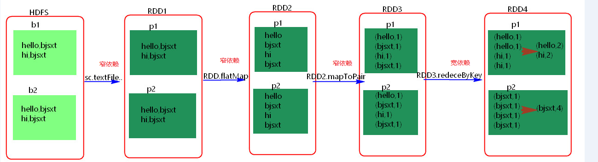

#### Spark中Work的主要工作是什么？
答：主要功能：管理当前节点内存，CPU的使用状况，接收master分配过来的资源指令，通过ExecutorRunner启动程序分配任务，worker就类似于包工头，管理分配新进程，做计算的服务，相当于process服务。  
需要注意的是：
1. worker会不会汇报当前信息给master，worker心跳给master主要只有workid，它不会发送资源信息以心跳的方式给mater，master分配的时候就知道work，只有出现故障的时候才会发送资源。
2. worker不会运行代码，具体运行的是Executor是可以运行具体appliaction写的业务逻辑代码，操作代码的节点，它不会运行程序的代码的。

---
#### RDD机制？
答：rdd分布式弹性数据集，简单的理解成一种数据结构，是spark框架上的通用货币。
所有算子都是基于rdd来执行的，不同的场景会有不同的rdd实现类，但是都可以进行互相转换。
rdd执行过程中会形成dag图，然后形成lineage保证容错性等。 从物理的角度来看rdd存储的是block和node之间的映射。
---
#### spark有哪些组件？
答：主要有如下组件：  
1. master：管理集群和节点，不参与计算。  
2. worker：计算节点，进程本身不参与计算，和master汇报。  
3. Driver：运行程序的main方法，创建spark context对象。  
4. spark context：控制整个application的生命周期，包括dagsheduler和task scheduler等组件。  
5. client：用户提交程序的入口。
---
#### spark工作机制？
答：用户在client端提交作业后，会由Driver运行main方法并创建spark context上下文。  
执行rdd算子，形成dag图输入dagscheduler，按照rdd之间的依赖关系划分stage输入task scheduler。 task scheduler会将stage划分为task set分发到各个节点的executor中执行。
---
#### spark的优化怎么做？  
答： spark调优比较复杂，但是大体可以分为三个方面来进行  
1. 平台层面的调优：防止不必要的jar包分发，提高数据的本地性，选择高效的存储格式如parquet  
2. 应用程序层面的调优：过滤操作符的优化降低过多小任务，降低单条记录的资源开销，处理数据倾斜，复用RDD进行缓存，作业并行化执行等等  
3. JVM层面的调优：设置合适的资源量，设置合理的JVM，启用高效的序列化方法如kyro，增大off head内存等等
---
#### 什么是RDD宽依赖和窄依赖？
RDD和它依赖的parent RDD(s)的关系有两种不同的类型，即窄依赖（narrow dependency）和宽依赖（wide dependency）。  
1. 窄依赖指的是每一个parent RDD的Partition最多被子RDD的一个Partition使用  
2. 宽依赖指的是多个子RDD的Partition会依赖同一个parent RDD的Partition，即前面一个rdd的key打乱了分散到不同的rdd里，具体见下面的示例图
  
---

#### Stage概念

Spark任务会根据**RDD之间的依赖关系，形成一个DAG有向无环图**，DAG会提交给DAGScheduler，DAGScheduler会把DAG划分相互依赖的多个stage，划分stage的依据就是RDD之间的宽窄依赖。**遇到宽依赖就划分stage**,每个stage包含一个或多个task任务。然后将这些task以taskSet的形式提交给**TaskScheduler运行**。     **stage是由一组并行的task组成。**

---

#### stage切割规则

 切割规则：**从后往前，遇到宽依赖就切割stage。**

