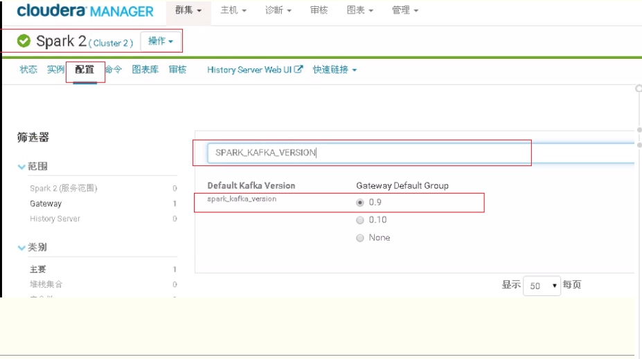

# 安装
https://www.cnblogs.com/wzlinux/p/10183357.html

https://www.jianshu.com/p/106739236db4

https://docs.cloudera.com/documentation/enterprise/6/6.3/topics/installation.html

## 离线包地址
https://archive.cloudera.com/cm6/6.2.1/redhat7/yum/RPMS/x86_64/

# 相关阅读
* [Hive总结篇及Hive的优化](https://blog.csdn.net/yu0_zhang0/article/details/81776459)

# kafka包冲突解决办法
## 方法1
查看cdh里配置的spark版本，项目pom里的版本与cdh配置保持一致


## 方法2
启动脚本里指定你的项目用的SPARK_KAFKA_VERSION环境变量值
```shell
export SPARK_KAFKA_VERSION=0.10
spark-submit arguments
```

[参考文档](https://www.cnblogs.com/yy3b2007com/p/10274053.html)

# 启动manager


```shell
cd /home/cloudera-manager/cm-5.15.0/etc/init.d
sh cloudera-scm-server start
sh cloudera-scm-agent start
```