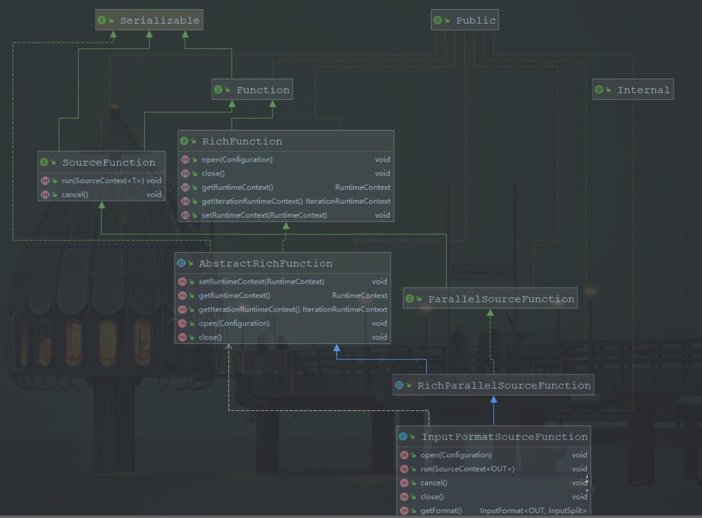
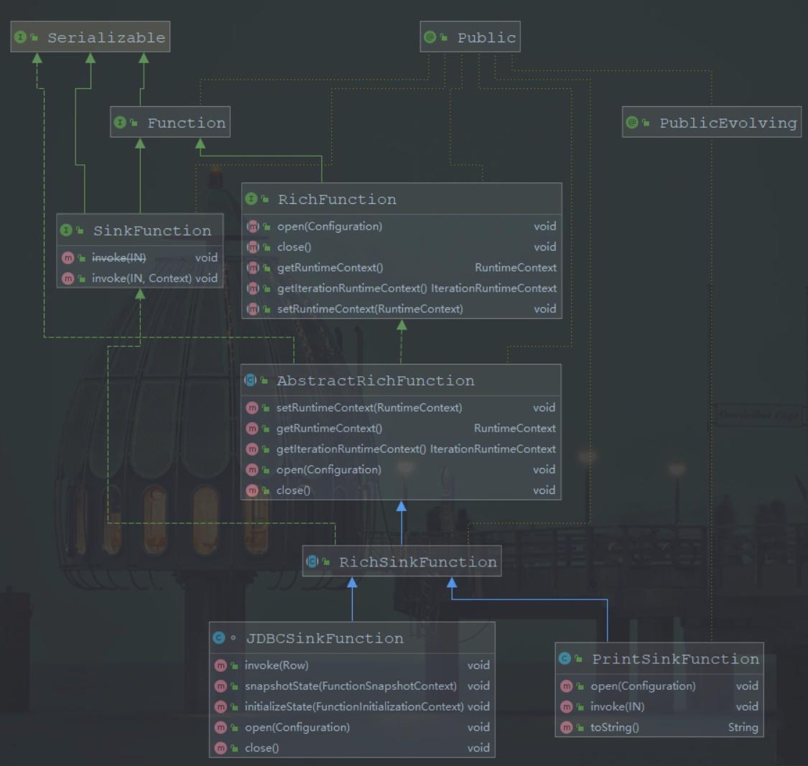
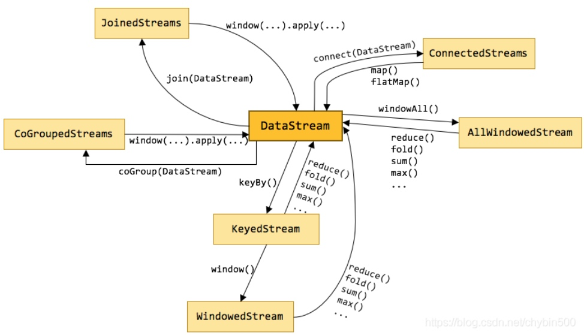

# 学习资料
- [基础概念解析](https://ververica.cn/developers/flink-basic-tutorial-1-basic-concept/)
- [开发环境搭建和应用的配置、部署及运行](https://ververica.cn/developers/flink-basic-tutorial-1-environmental-construction/)
- [DataStream API 编程](https://ververica.cn/developers/apache-flink-basic-zero-iii-datastream-api-programming/)

# 配置

## 使用logback

日志的配置文件在 Flink binary 目录的 conf 子目录下，其中：
- log4j-cli.properties：用 Flink 命令行时用的 log 配置，比如执行“ flink run”命令
- log4j-yarn-session.properties：用 yarn-session.sh 启动时命令行执行时用的 log 配置
- log4j.properties：无论是 Standalone 还是 Yarn 模式，JobManager 和 TaskManager 上用的 log 配置都是 log4j.properties

这三个“log4j.*properties”文件分别有三个“logback.*xml”文件与之对应，如果想使用 Logback 的同学，之需要把与之对应的“log4j.*properties”文件删掉即可，对应关系如下：
- log4j-cli.properties -> logback-console.xml
- log4j-yarn-session.properties -> logback-yarn.xml
- log4j.properties -> logback.xml

### flink-conf.yaml

```yml
# 默认并行度
taskmanager.numberOfTaskSlots: 4
# savepoint目录
state.savepoints.dir: file:///tmp/savepoint
```

## yarn
[Flink on yarn部署模式](https://www.jianshu.com/p/1b05202c4fb6)

# 命令

## 启动集群
`bin/start-cluster.sh`
Standalone模式下通过 http://127.0.0.1:8081 能看到 Web 界面

## run
运行任务，以 Flink 自带的例子 TopSpeedWindowing 为例：
`bin/flink run -d examples/streaming/TopSpeedWindowing.jar`

### 参数说明
- -c：如果没有在jar包中指定入口类，则需要在这里通过这个参数指定;
- -m：指定需要连接的jobmanager(主节点)地址，使用这个参数可以指定一个不同于配置文件中的jobmanager，可以说是yarn集群名称;
- -p：指定程序的并行度。可以覆盖配置文件中的默认值;
- -n :允许跳过保存点状态无法恢复。 你需要允许如果您从中删除了一个运算符你的程序是的一部分保存点时的程序触发;
- -q:如果存在，则禁止将日志记录输出标准出来;
- -s:保存点的路径以还原作业来自（例如hdfs:///flink/savepoint-1537);
还有参数如果在yarn-session当中没有指定，可以在yarn-session参数的基础上前面加“y”，即可控制所有的资源，这里就不獒述了。

## list
查看任务列表
`bin/flink list -m 127.0.0.1:8081`

## stop
停止任务。通过 -m 来指定要停止的 JobManager 的主机地址和端口。
`bin/flink stop -m 127.0.0.1:8081 d67420e52bd051fae2fddbaa79e046bb`

如果stup时抛出Could not stop the job的异常，说明Stop 命令执行失败了。一个 Job 能够被 Stop 要求所有的 Source 都是可以 Stoppable 的，即实现了StoppableFunction 接口。

## cancel
取消任务。如果在 conf/flink-conf.yaml 里面配置了 state.savepoints.dir，会保存 Savepoint，否则不会保存 Savepoint。
`bin/flink cancel -m 127.0.0.1:8081 5e20cb6b0f357591171dfcca2eea09de`

也可以在停止的时候显示指定 savepoint 目录。
`bin/flink cancel -m 127.0.0.1:8081 -s /tmp/savepoint 29da945b99dea6547c3fbafd57ed8759`

### 取消和停止（流作业）的区别
- cancel() 调用，立即调用作业算子的 cancel() 方法，以尽快取消它们。如果算子在接到 cancel() 调用后没有停止，Flink 将开始定期中断算子线程的执行，直到所有算子停止为止。
- stop() 调用，是更优雅的停止正在运行流作业的方式。stop() 仅适用于 Source 实现了 StoppableFunction 接口的作业。当用户请求停止作业时，作业的所有 Source 都将接收 stop() 方法调用。直到所有 Source 正常关闭时，作业才会正常结束。这种方式，使作业正常处理完所有作业。

## savepoint
触发 savepoint。
`bin/flink savepoint -m 127.0.0.1:8081 ec53edcfaeb96b2a5dadbfbe5ff62bbb /tmp/savepoint`

通过 -s 参数从指定的 Savepoint 启动
`bin/flink run -d -s /tmp/savepoint/savepoint-f049ff-24ec0d3e0dc7 ./examples/streaming/TopSpeedWindowing.jar`

### savepoint 和 checkpoint 的区别
Checkpoint 是增量做的，每次的时间较短，数据量较小，只要在程序里面启用后会自动触发，用户无须感知；Checkpoint 是作业 failover 的时候自动使用，不需要用户指定。
Savepoint 是全量做的，每次的时间较长，数据量较大，需要用户主动去触发。Savepoint 一般用于程序的版本更新（详见文档），Bug 修复，A/B Test 等场景，需要用户指定。

## modify
修改任务并行度。
`bin/flink modify -p 4 7752ea7b0e7303c780de9d86a5ded3fa`

每次 Modify 命令都会触发一次 Savepoint。

## info
Info 命令是用来查看 Flink 任务的执行计划（StreamGraph）的。
`bin/flink info examples/streaming/TopSpeedWindowing.jar`

拷贝输出的 Json 内容，粘贴到这个网站：[http://flink.apache.org/visualizer/](http://flink.apache.org/visualizer/)
可以看到执行计划图

## scala shell

### 启动shell

`bin/start-scala-shell.sh local`

### DataSet

```scala
val text = benv.fromElements("To be, or not to be,--that is the question:--")
val counts = text.flatMap { _.toLowerCase.split("\\W+") }.map { (_, 1) }.groupBy(0).sum(1)
counts.print()
```

对 DataSet 任务来说，print() 会触发任务的执行。
也可以将结果输出到文件（先删除 /tmp/out1，不然会报错同名文件已经存在），继续执行以下命令：
```scala
counts.writeAsText("/tmp/out1")
benv.execute("batch test")
```

### DataSteam

```scala
val textStreaming = senv.fromElements("To be, or not to be,--that is the question:--")
val countsStreaming = textStreaming.flatMap { _.toLowerCase.split("\\W+") }.map { (_, 1) }.keyBy(0).sum(1)
countsStreaming.print()
senv.execute("Streaming Wordcount")
```

对 DataStream 任务，print() 并不会触发任务的执行，需要显示调用 execute(“job name”) 才会执行任务

# 关键概念

## Source

source是flink的数据来源
主要类图如下：


### SourceFunction

source的核心的是SourceFunction类，这个类主要有两个方法，run方法和cancel方法
* run方法的功能是核心功能，主要用于source往出emit元素
* cancel方法时用于取消run方法的执行，一般来说run方法内部是一个循环，cancel方法中控制run方法的循环不满足条件，从而取消run方法的执行。

### RichFunction

是一个富函数，这个函数里包含了很多基础的方法
* open方法一般用于初始化设置，一般在核心方法调用之前执行，用于初始化变量等
* close方法一般用于结束，用于回收资源方面的操作
* xxxRuntimeContext 这些方法用于对上下文进行操作

### AbstractRichFunction

该抽象类实现了RichFunction接口的关于xxxRuntimeContext 的方法

### RichParallelSourceFunction

**我们如果需要自定义Source，一般实现这个类就可以**，我们可以重写run,cancel，open等方法来实现我们自己需要的逻辑。如flink中的InputFormatSourceFunction.java的实现

### 自定义Source

自定义msyql的Source

```java
public class MySQLSource extends RichParallelSourceFunction<Student> {

   PreparedStatement ps;
   private Connection connection;


   @Override
   public void open(Configuration parameters) throws Exception {
       super.open(parameters);
           try {
               Class.forName("com.mysql.jdbc.Driver");
               connection = DriverManager.getConnection("jdbc:mysql://localhost:3306/flink?useUnicode=true&characterEncoding=UTF-8", "root", "root");
           } catch (Exception e) {
               System.out.println(e.getMessage());
           }

       String sql = "select * from student;";
       ps = this.connection.prepareStatement(sql);
   }

   @Override
   public void close() throws Exception {
       super.close();
       if (connection != null) { //关闭连接和释放资源
           connection.close();
       }
       if (ps != null) {
           ps.close();
       }
   }


   @Override
   public void run(SourceContext<Student> ctx) throws Exception {
       ResultSet resultSet = ps.executeQuery();
       while (resultSet.next()) {
           Student student = new Student(
                   resultSet.getInt("id"),
                   resultSet.getString("name").trim(),
           ctx.collect(student);
       }
   }

   @Override
   public void cancel() {
   }
  
}
```


## Transform

数据转换
具体参考常用算子这一节

## Sink

sink负责把flink处理后的数据输出到外部系统中，flink 的sink和source的代码结构类似。
主要类图：


### SinkFunction 
是一个接口，类似于SourceFunction接口。SinkFunction中主要包含一个方法，那就是用于数据输出的invoke 方法,每条记录都会执行一次invoke方法，用于执行输出操作。

### RichSinkFunction
我们一般自定义Sink的时候，都是继承RichSinkFunction，他是一个抽象类，继承了AbstractRichFunction

### 自定义Sink

我们这里自定义一个msyql的sink，也就是把flink中的数据，最后输出到mysql中。

```java
public class MyMysqlSink extends RichSinkFunction<Person> {
    private PreparedStatement ps = null;
    private Connection connection = null;
    String driver = "com.mysql.jdbc.Driver";
    String url = "jdbc:mysql://127.0.0.1:3306/flinkdb";
    String username = "root";
    String password = "root";
    // 初始化方法
    @Override
    public void open(Configuration parameters) throws Exception {
        super.open(parameters);
        // 获取连接
        connection = getConn();
        //执行查询
        ps = connection.prepareStatement("select * from person;");
    }
    private Connection getConn() {
        try {
            Class.forName(driver);
            connection = DriverManager.getConnection(url, username, password);
        } catch (Exception e) {
            e.printStackTrace();
        }
        return connection;
    }
    //Writes the given value to the sink. This function is called for every record.
    //每一个元素的插入，都会被调用一次invoke方法
    @Override
    public void invoke(Person p, Context context) throws Exception {
        ps.setString(1,p.getName());
        ps.setInt(2,p.getAge());
        ps.executeUpdate();
    }

    @Override
    public void close() throws Exception {
        super.close();
        if(connection != null){
            connection.close();
        }
        if (ps != null){
            ps.close();
        }
    }
}
```


# DataSet与DataStream的区别

DataSet同DataStream从其接口封装、真实计算Operator有很大的差别，Dataset的实现在flink-javamodule中，而DataStream的实现在flink-streaming-java中；

## DataSet

批式处理，其接口封装类似于Spark的Dataset，支持丰富的函数操作，比如map/fliter/join/cogroup等；
数据源创建初始数据集，例如来自文件或Java集合等静态数据；
所有的操作为Operator的子类，实现具体逻辑，比如Join逻辑是在JoinOperator中实现；

## DataStram

流式处理，其结构封装实现输入流的处理，其也实现了丰富的函数支持；
所有的操作为StreamOperator的子类，实现具体逻辑，比如Join逻辑是在IntervalJoinOperator中实现的；

# Flink 常用算子

[参考文档](https://blog.csdn.net/chybin500/article/details/87260869)
[官方文档](https://ci.apache.org/projects/flink/flink-docs-release-1.11/zh/dev/batch/dataset_transformations.html)
Flink中的算子是将一个或多个DataStream转换为新的DataStream，可以将多个转换组合成复杂的数据流拓扑。

在Flink中，有多种不同的DataStream类型，他们之间是使用各种算子进行的。如下图所示：


以下列举下常用的算子，用到的代码例子都是Flink监听9000端口做为数据源。以下方法可以启动一个9000的socket端口服务。

Linux平台上可以使用


```shell
nc -lk 9000
```

如果是 Windows 平台，可以通过 https://nmap.org/ncat/ 安装 ncat 然后运行：

```bash
ncat -lk 9000
```
## map

map可以理解为映射，对每个元素进行一定的变换后，映射为另一个元素。

举例：

```java
package operators;

import org.apache.flink.streaming.api.datastream.DataStream;
import org.apache.flink.streaming.api.environment.StreamExecutionEnvironment;

//这个例子是监听9000 socket端口，对于发送来的数据，以\n为分隔符分割后进行处理，
//将分割后的每个元素，添加上一个字符串后，打印出来。
public class MapDemo {
    private static int index = 1;
    public static void main(String[] args) throws Exception {
        //1.获取执行环境配置信息
        StreamExecutionEnvironment env = StreamExecutionEnvironment.getExecutionEnvironment();
        //2.定义加载或创建数据源（source）,监听9000端口的socket消息
        DataStream<String> textStream = env.socketTextStream("localhost", 9000, "\n");
        //3.map操作。
        DataStream<String> result = textStream.map(s -> (index++) + ".您输入的是：" + s);
        //4.打印输出sink
        result.print();
        //5.开始执行
        env.execute();
    }
}
```

## flatmap

flatmap可以理解为将元素摊平，每个元素可以变为0个、1个、或者多个元素。

举例：

```java
package operators;

import org.apache.flink.api.common.typeinfo.Types;
import org.apache.flink.streaming.api.datastream.DataStream;
import org.apache.flink.streaming.api.environment.StreamExecutionEnvironment;
import org.apache.flink.util.Collector;

//这个例子是用Flink监听9000端口，将接受的字符串用\n分割为一个个的元素
//然后将每个元素拆为一个个的字符，并打印出来
public class FlatMapDemo {
    private static int index1 = 1;
    private static int index2 = 1;

    public static void main(String[] args) throws Exception {
        //1.获取执行环境配置信息
        StreamExecutionEnvironment env = StreamExecutionEnvironment.getExecutionEnvironment();
        //2.定义加载或创建数据源（source）,监听9000端口的socket消息
        DataStream<String> textStream = env.socketTextStream("localhost", 9000, "\n");
        //3.flatMap操作，对每一行字符串进行分割
        DataStream<String> result = textStream.flatMap((String s, Collector<String> collector) -> {
            for (String str : s.split("")) {
                collector.collect(str);
            }
        })
        //这个地方要注意，在flatMap这种参数里有泛型算子中。
        //如果用lambda表达式，必须将参数的类型显式地定义出来。
        //并且要有returns，指定返回的类型
        //详情可以参考Flink官方文档：https://ci.apache.org/projects/flink/flink-docs-release-1.6/dev/java_lambdas.html
        .returns(Types.STRING);

        //4.打印输出sink
        result.print();
        //5.开始执行
        env.execute();
    }
}
```

## filter

filter是进行筛选。

举例：

```java
package operators;

import org.apache.flink.streaming.api.datastream.DataStream;
import org.apache.flink.streaming.api.environment.StreamExecutionEnvironment;

public class FilterDemo {
    private static int index = 1;
    public static void main(String[] args) throws Exception {
        //1.获取执行环境配置信息
        StreamExecutionEnvironment env = StreamExecutionEnvironment.getExecutionEnvironment();
        //2.定义加载或创建数据源（source）,监听9000端口的socket消息
        DataStream<String> textStream = env.socketTextStream("localhost", 9000, "\n");
        //3.filter操作，筛选非空行。
        DataStream<String> result = textStream.filter(line->!line.trim().equals(""));
        //4.打印输出sink
        result.print();
        //5.开始执行
        env.execute();
    }
}
```

## keyBy

逻辑上将Stream根据指定的Key进行分区，是根据key的散列值进行分区的。

举例：

```java
package operators;

import org.apache.flink.api.common.typeinfo.Types;
import org.apache.flink.api.java.tuple.Tuple2;
import org.apache.flink.streaming.api.datastream.DataStream;
import org.apache.flink.streaming.api.environment.StreamExecutionEnvironment;
import org.apache.flink.streaming.api.windowing.time.Time;

import java.util.concurrent.TimeUnit;

//这个例子是每行输入一个单词，以单词为key进行计数
//每10秒统计一次每个单词的个数
public class KeyByDemo {
    public static void main(String[] args) throws Exception {
        //1.获取执行环境配置信息
        StreamExecutionEnvironment env = StreamExecutionEnvironment.getExecutionEnvironment();
        //2.定义加载或创建数据源（source）,监听9000端口的socket消息
        DataStream<String> textStream = env.socketTextStream("localhost", 9000, "\n");
        //3.
        DataStream<Tuple2<String, Integer>> result = textStream
                //map是将每一行单词变为一个tuple2
                .map(line -> Tuple2.of(line.trim(), 1))
                //如果要用Lambda表示是，Tuple2是泛型，那就得用returns指定类型。
                .returns(Types.TUPLE(Types.STRING, Types.INT))
                //keyBy进行分区，按照第一列，也就是按照单词进行分区
                .keyBy(0)
                //指定窗口，每10秒个计算一次
                .timeWindow(Time.of(10, TimeUnit.SECONDS))
                //计算个数，计算第1列
                .sum(1);
        //4.打印输出sink
        result.print();
        //5.开始执行
        env.execute();
    }
}
```

## reduce

reduce是归并操作，它可以将KeyedStream 转变为 DataStream。

```java
package operators;

import org.apache.flink.api.common.typeinfo.Types;
import org.apache.flink.api.java.tuple.Tuple2;
import org.apache.flink.streaming.api.datastream.DataStream;
import org.apache.flink.streaming.api.environment.StreamExecutionEnvironment;
import org.apache.flink.streaming.api.windowing.time.Time;

import java.util.concurrent.TimeUnit;

//这个例子是对流进行分组，分组后进归并操作。
//是wordcount的另外一种实现方法
public class ReduceDemo {
    public static void main(String[] args) throws Exception {
        //1.获取执行环境配置信息
        StreamExecutionEnvironment env = StreamExecutionEnvironment.getExecutionEnvironment();
        //2.定义加载或创建数据源（source）,监听9000端口的socket消息
        DataStream<String> textStream = env.socketTextStream("localhost", 9000, "\n");
        //3.
        DataStream<Tuple2<String, Integer>> result = textStream
                //map是将每一行单词变为一个tuple2
                .map(line -> Tuple2.of(line.trim(), 1))
                //如果要用Lambda表示是，Tuple2是泛型，那就得用returns指定类型。
                .returns(Types.TUPLE(Types.STRING, Types.INT))
                //keyBy进行分区，按照第一列，也就是按照单词进行分区
                .keyBy(0)
                //指定窗口，每10秒个计算一次
                .timeWindow(Time.of(10, TimeUnit.SECONDS))
                //对每一组内的元素进行归并操作，即第一个和第二个归并，结果再与第三个归并...
                .reduce((Tuple2<String, Integer> t1, Tuple2<String, Integer> t2) -> new Tuple2(t1.f0, t1.f1 + t2.f1));

        //4.打印输出sink
        result.print();
        //5.开始执行
        env.execute();
    }
}
```
### reduceGroup
通过自定义的reduce函数实现reduce操作
自定义reduce函数需实现GroupReduceFunction接口

```scala
object ReduceGroupDemo extends App with Utils {
  val input = env.fromElements(1, 2, 3, 4, 5)
  val out: DataSet[Int] = input.reduceGroup(new MyGroupReducer())
  out.print()

}

/**
 * 自定义reduceGroup操作函数
 * 实现GroupReduceFunction接口
 */
class MyGroupReducer extends GroupReduceFunction[Int, Int] {
  override def reduce(values: lang.Iterable[Int], out: Collector[Int]): Unit = {
    var i = 0
    values.asScala.foreach(a => {
      println("a:" + a)
      i = i - a
    })
    println("i:" + i)
    out.collect(i)
  }
}
```

## fold 已废弃，用aggregate替换

给定一个初始值，将各个元素逐个归并计算。它将KeyedStream转变为DataStream。

举例：

```java
package operators;

import org.apache.flink.api.common.typeinfo.Types;
import org.apache.flink.api.java.tuple.Tuple2;
import org.apache.flink.streaming.api.datastream.DataStream;
import org.apache.flink.streaming.api.environment.StreamExecutionEnvironment;
import org.apache.flink.streaming.api.windowing.time.Time;

import java.util.concurrent.TimeUnit;

public class FoldDemo {
    public static void main(String[] args) throws Exception {
        //1.获取执行环境配置信息
        StreamExecutionEnvironment env = StreamExecutionEnvironment.getExecutionEnvironment();
        //2.定义加载或创建数据源（source）,监听9000端口的socket消息
        DataStream<String> textStream = env.socketTextStream("localhost", 9000, "\n");
        //3.
        DataStream<String> result = textStream
                //map是将每一行单词变为一个tuple2
                .map(line -> Tuple2.of(line.trim(), 1))
                //如果要用Lambda表示是，Tuple2是泛型，那就得用returns指定类型。
                .returns(Types.TUPLE(Types.STRING, Types.INT))
                //keyBy进行分区，按照第一列，也就是按照单词进行分区
                .keyBy(0)
                //指定窗口，每10秒个计算一次
                .timeWindow(Time.of(10, TimeUnit.SECONDS))
                //指定一个开始的值，对每一组内的元素进行归并操作，即第一个和第二个归并，结果再与第三个归并...
                .fold("结果：",(String current, Tuple2<String, Integer> t2) -> current+t2.f0+",");

        //4.打印输出sink
        result.print();
        //5.开始执行
        env.execute();
    }
}
```

## union

union可以将多个流合并到一个流中，以便对合并的流进行统一处理。是对多个流的水平拼接。

参与合并的流必须是同一种类型。

举例：

```java
package operators;

import org.apache.flink.streaming.api.datastream.DataStream;
import org.apache.flink.streaming.api.environment.StreamExecutionEnvironment;

//这个例子是将三个socket端口发送来的数据合并到一个流中
//可以对这三个流发送来的数据，集中处理。
public class UnionDemo {
    public static void main(String[] args) throws Exception {
        //1.获取执行环境配置信息
        StreamExecutionEnvironment env = StreamExecutionEnvironment.getExecutionEnvironment();
        //2.定义加载或创建数据源（source）,监听9000端口的socket消息
        DataStream<String> textStream9000 = env.socketTextStream("localhost", 9000, "\n");
        DataStream<String> textStream9001 = env.socketTextStream("localhost", 9001, "\n");
        DataStream<String> textStream9002 = env.socketTextStream("localhost", 9002, "\n");

        DataStream<String> mapStream9000=textStream9000.map(s->"来自9000端口："+s);
        DataStream<String> mapStream9001=textStream9001.map(s->"来自9001端口："+s);
        DataStream<String> mapStream9002=textStream9002.map(s->"来自9002端口："+s);

        //3.union用来合并两个或者多个流的数据，统一到一个流中
        DataStream<String> result =  mapStream9000.union(mapStream9001,mapStream9002);

        //4.打印输出sink
        result.print();
        //5.开始执行
        env.execute();
    }
}
```

## join

根据指定的Key将两个流进行关联。

举例：

```java
package operators;

import org.apache.flink.api.common.functions.MapFunction;
import org.apache.flink.api.java.tuple.Tuple2;
import org.apache.flink.streaming.api.datastream.DataStream;
import org.apache.flink.streaming.api.environment.StreamExecutionEnvironment;
import org.apache.flink.streaming.api.windowing.assigners.TumblingProcessingTimeWindows;
import org.apache.flink.streaming.api.windowing.time.Time;

public class WindowJoinDemo {
    public static void main(String[] args) throws Exception {
        //1.获取执行环境配置信息
        StreamExecutionEnvironment env = StreamExecutionEnvironment.getExecutionEnvironment();

        //2.定义加载或创建数据源（source）,监听9000端口的socket消息
        DataStream<String> textStream9000 = env.socketTextStream("localhost", 9000, "\n");
        DataStream<String> textStream9001 = env.socketTextStream("localhost", 9001, "\n");
        //将输入处理一下，变为tuple2
        DataStream<Tuple2<String,String>> mapStream9000=textStream9000
                .map(new MapFunction<String, Tuple2<String,String>>() {
                    @Override
                    public Tuple2<String, String> map(String s) throws Exception {
                        return Tuple2.of(s,"来自9000端口："+s);
                    }
                });

        DataStream<Tuple2<String,String>> mapStream9001=textStream9001
                .map(new MapFunction<String, Tuple2<String,String>>() {
                    @Override
                    public Tuple2<String, String> map(String s) throws Exception {
                        return Tuple2.of(s,"来自9001端口："+s);
                    }
                });

        //3.两个流进行join操作，是inner join，关联上的才能保留下来
        DataStream<String> result =  mapStream9000.join(mapStream9001)
                //关联条件，以第0列关联（两个source输入的字符串）
                .where(t1->t1.getField(0)).equalTo(t2->t2.getField(0))
                //以处理时间，每10秒一个滚动窗口
                .window(TumblingProcessingTimeWindows.of(Time.seconds(10)))
                //关联后输出
                .apply((t1,t2)->t1.getField(1)+"|"+t2.getField(1))
                ;

        //4.打印输出sink
        result.print();
        //5.开始执行
        env.execute();
    }
}
```

## coGroup

关联两个流，关联不上的也保留下来。

举例：

```java
package operators;

import org.apache.flink.api.common.functions.CoGroupFunction;
import org.apache.flink.api.common.functions.MapFunction;
import org.apache.flink.api.java.tuple.Tuple2;
import org.apache.flink.streaming.api.datastream.DataStream;
import org.apache.flink.streaming.api.environment.StreamExecutionEnvironment;
import org.apache.flink.streaming.api.windowing.assigners.TumblingProcessingTimeWindows;
import org.apache.flink.streaming.api.windowing.time.Time;
import org.apache.flink.util.Collector;

public class CoGroupDemo {
    public static void main(String[] args) throws Exception {
        //1.获取执行环境配置信息
        StreamExecutionEnvironment env = StreamExecutionEnvironment.getExecutionEnvironment();

        //2.定义加载或创建数据源（source）,监听9000端口的socket消息
        DataStream<String> textStream9000 = env.socketTextStream("localhost", 9000, "\n");
        DataStream<String> textStream9001 = env.socketTextStream("localhost", 9001, "\n");
        //将输入处理一下，变为tuple2
        DataStream<Tuple2<String, String>> mapStream9000 = textStream9000
                .map(new MapFunction<String, Tuple2<String, String>>() {
                    @Override
                    public Tuple2<String, String> map(String s) throws Exception {
                        return Tuple2.of(s, "来自9000端口：" + s);
                    }
                });

        DataStream<Tuple2<String, String>> mapStream9001 = textStream9001
                .map(new MapFunction<String, Tuple2<String, String>>() {
                    @Override
                    public Tuple2<String, String> map(String s) throws Exception {
                        return Tuple2.of(s, "来自9001端口：" + s);
                    }
                });

        //3.两个流进行coGroup操作,没有关联上的也保留下来，功能更强大
        DataStream<String> result = mapStream9000.coGroup(mapStream9001)
                //关联条件，以第0列关联（两个source输入的字符串）
                .where(t1 -> t1.getField(0)).equalTo(t2 -> t2.getField(0))
                //以处理时间，每10秒一个滚动窗口
                .window(TumblingProcessingTimeWindows.of(Time.seconds(10)))
                //关联后输出
                .apply(new CoGroupFunction<Tuple2<String, String>, Tuple2<String, String>, String>() {
                    @Override
                    public void coGroup(Iterable<Tuple2<String, String>> iterable, Iterable<Tuple2<String, String>> iterable1, Collector<String> collector) throws Exception {
                        StringBuffer stringBuffer = new StringBuffer();
                        stringBuffer.append("来自9000的stream:");
                        for (Tuple2<String, String> item : iterable) {
                            stringBuffer.append(item.f1 + ",");
                        }
                        stringBuffer.append("来自9001的stream:");
                        for (Tuple2<String, String> item : iterable1) {
                            stringBuffer.append(item.f1 + ",");
                        }
                        collector.collect(stringBuffer.toString());
                    }
                });

        //4.打印输出sink
        result.print();
        //5.开始执行
        env.execute();
    }
}
```

## connect

参考：https://www.jianshu.com/p/5b0574d466f8

将两个流纵向地连接起来。DataStream的connect操作创建的是ConnectedStreams或BroadcastConnectedStream，它用了两个泛型，即不要求两个dataStream的element是同一类型。

举例：

```java
package operators;

import org.apache.flink.api.java.tuple.Tuple2;
import org.apache.flink.streaming.api.datastream.DataStream;
import org.apache.flink.streaming.api.datastream.SingleOutputStreamOperator;
import org.apache.flink.streaming.api.environment.StreamExecutionEnvironment;
import org.apache.flink.streaming.api.functions.co.CoMapFunction;

import java.util.regex.Matcher;
import java.util.regex.Pattern;

public class ConnectDemo {
    public static void main(String[] args) throws Exception {
        //1.获取执行环境配置信息
        StreamExecutionEnvironment env = StreamExecutionEnvironment.getExecutionEnvironment();
        //2.定义加载或创建数据源（source）,监听9000端口的socket消息
        DataStream<String> textStream9000 = env.socketTextStream("localhost", 9000, "\n");
        DataStream<String> textStream9001 = env.socketTextStream("localhost", 9001, "\n");
        //转为Integer类型流
        DataStream<Integer> intStream = textStream9000.filter(s -> isNumeric(s)).map(s -> Integer.valueOf(s));
        //连接起来，分别处理，返回同样的一种类型。
        SingleOutputStreamOperator result = intStream.connect(textStream9001)
                .map(new CoMapFunction<Integer, String, Tuple2<Integer, String>>() {
                    @Override
                    public Tuple2<Integer, String> map1(Integer value) throws Exception {
                        return Tuple2.of(value, "");
                    }

                    @Override
                    public Tuple2<Integer, String> map2(String value) throws Exception {
                        return Tuple2.of(null, value);
                    }
                });
        //4.打印输出sink
        result.print();
        //5.开始执行
        env.execute();
    }

    private static boolean isNumeric(String str) {
        Pattern pattern = Pattern.compile("[0-9]*");
        Matcher isNum = pattern.matcher(str);
        if (!isNum.matches()) {
            return false;
        }
        return true;
    }
}
```

## split

参考：https://cloud.tencent.com/developer/article/1382892

将一个流拆分为多个流。

```java
package operators;

import org.apache.flink.api.common.typeinfo.Types;
import org.apache.flink.api.java.tuple.Tuple2;
import org.apache.flink.streaming.api.datastream.DataStream;
import org.apache.flink.streaming.api.datastream.SplitStream;
import org.apache.flink.streaming.api.environment.StreamExecutionEnvironment;

import java.util.ArrayList;
import java.util.List;
import java.util.regex.Matcher;
import java.util.regex.Pattern;

public class SplitDemo {
    public static void main(String[] args) throws Exception {
        //1.获取执行环境配置信息
        StreamExecutionEnvironment env = StreamExecutionEnvironment.getExecutionEnvironment();
        //2.定义加载或创建数据源（source）,监听9000端口的socket消息
        DataStream<String> textStream = env.socketTextStream("localhost", 9000, "\n");
        //3.
        SplitStream<Tuple2<String, Integer>> result = textStream
                //map是将每一行单词变为一个tuple2
                .map(line -> Tuple2.of(line.trim(), 1))
                //如果要用Lambda表示是，Tuple2是泛型，那就得用returns指定类型。
                .returns(Types.TUPLE(Types.STRING, Types.INT))
                .split(t -> {
                    List<String> list = new ArrayList<>();
                    //根据逻辑拆分，并定义outputName
                    if (isNumeric(t.f0)) {
                        list.add("num");
                    } else {
                        list.add("str");
                    }
                    return list;
                });
        //选择指定名称的流
        DataStream<Tuple2<String, Integer>> strSplitStream = result.select("str")
                .map(t -> Tuple2.of("字符串：" + t.f0, t.f1))
                .returns(Types.TUPLE(Types.STRING,Types.INT));
        //选择指定名称的流
        DataStream<Tuple2<String, Integer>> intSplitStream = result.select("num")
                .map(t -> Tuple2.of("数字：" + t.f0, t.f1))
                .returns(Types.TUPLE(Types.STRING,Types.INT));

        //4.打印输出sink
        strSplitStream.print();
        intSplitStream.print();
        //5.开始执行
        env.execute();
    }

    private static boolean isNumeric(String str) {
        Pattern pattern = Pattern.compile("[0-9]*");
        Matcher isNum = pattern.matcher(str);
        if (!isNum.matches()) {
            return false;
        }
        return true;
    }
}
```

## aggregation
KeyedStream --> DataStream：分组流数据的滚动聚合操作：例如sum()，min()，max()等,这些可以用于keyedStream从而获得聚合。用法如下
KeyedStream.sum(0)或者KeyedStream.sum(“Key”)
min和minBy的区别是min返回的是一个最小值，而minBy返回的是其字段中包含的最小值的元素（同样元原理适用于max和maxBy）

## window
KeyedStream --> DataStream：windows是在一个分区的KeyedStreams中定义的，windows根据某些特性将每个key的数据进行分组（例如：在5s内到达的数据）。

## windowAll
DataStream --> AllWindowedStream：Windows可以在一个常规的DataStream中定义，Windows根据某些特性对所有的流（例如：5s内到达的数据）。
注意：这个操作在很多情况下都不是并行操作的，所有的记录都会聚集到一个windowAll操作的任务中

## window apply
WindowedStream --> DataStream
AllWindowedStream --> DataStream：将一个通用的函数作为一个整体传递给window。

## window reduce
WindowedStream --> DataStream：给窗口赋予一个reduce的功能，并返回一个reduce的结果。

## window fold
WindowedStream --> DataStream：给窗口赋予一个fold的功能，并返回一个fold后的结果。

## aggregation on windows
WindowedStream --> DataStream：对window的元素做聚合操作，min和minBy的区别是min返回的是最小值，而minBy返回的是包含最小值字段的元素。（同样原理适用于max和maxBy）

## window join
DataStream，DataStream --> DataStream：根据给定的key和window对两个DataStream做join操作

## window coGroup
DataStream，DataStream --> DataStream：根据一个给定的key和window对两个DataStream做CoGroups操作。

## connect
DataStream，DataStream --> ConnectedStreams：连接两个保持她们类型的数据流。

## coMap、coFlatMap
ConnectedStreams --> DataStream：作用于connected数据流上，功能与map和flatMap一样。

## select
SplitStream --> DataStream：从一个SplitStream中获取一个或多个DataStream

## iterate
DataStream --> IterativeStream --> DataStream：在流程中创建一个反馈循环，将一个操作的输出重定向到之前的操作，这对于定义持续更新模型的算法来说很有意义的。

## extract timestamps
DataStream --> DataStream：提取记录中的时间戳来跟需要事件时间的window一起发挥作用。


# 常见错误
## could not find implicit value for evidence parameter of type org.apache.flink.api.common.typeinfo.TypeInformation[?]

解决办法
加入隐士转换
推荐的做法是在代码中引入以下包：

`import org.apache.flink.streaming.api.scala._`

如果数据是有限的（静态数据集），我们可以引入以下包：

`mport org.apache.flink.api.scala._`

然后即可解决上面的异常信息。

# 常用隐式转换

```scala
import org.apache.flink.api.scala._
```

# DataStream结果输出

## 打印到控制台

```java
// 获取运行环境
StreamExecutionEnvironment env = StreamExecutionEnvironment.getExecutionEnvironment();
// 获取数据源
DataStream<String> text = env.socketTextStream("IP", port, "\n");
...省略中间算子处理...
// 使用一个并行度将结果打印至控制台
text.print().setParallelism(1);
```

## 打印至文本文件

```java
// 获取运行环境
StreamExecutionEnvironment env = StreamExecutionEnvironment.getExecutionEnvironment();
// 获取数据源
DataStream<String> text = env.socketTextStream("IP", port, "\n");
...省略中间算子处理...
// 使用一个并行度将结果打印至文本文件
text.writeAsText(String path).setParallelism(1);
```

## 打印至csv文件

```java
// 获取运行环境
StreamExecutionEnvironment env = StreamExecutionEnvironment.getExecutionEnvironment();
// 获取数据源
DataStream<String> text = env.socketTextStream("IP", port, "\n");
...省略中间算子处理...
// 使用一个并行度将结果打印至控制台
text.writeAsCsv(String path).setParallelism(1);
```

## 打印至scoket

```java
// 获取运行环境
StreamExecutionEnvironment env = StreamExecutionEnvironment.getExecutionEnvironment();
// 获取数据源
DataStream<String> text = env.socketTextStream("IP", port, "\n");
...省略中间算子处理...
// 使用一个并行度将结果打印至控制台
text.writeToSocket(hostName, port, schema).setParallelism(1);
```

## 通过连接器打印到Kafka

```java
// 获取运行环境
StreamExecutionEnvironment env = StreamExecutionEnvironment.getExecutionEnvironment();
// 获取数据源
DataStream<String> text = env.socketTextStream("IP", port, "\n");
...省略中间算子处理...
// 使用一个并行度将结果打印至控制台
String kafkaTopic = params.get("kafka-topic");
String brokers = params.get("brokers", "localhost:9092");
text.addSink(new FlinkKafkaProducer010(brokers, kafkaTopic, (SerializationSchema) new EventDeSerializer())).setParallelism(1);
```