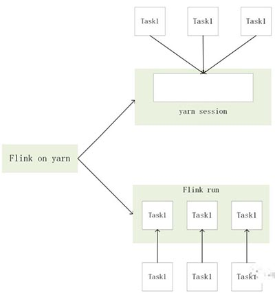
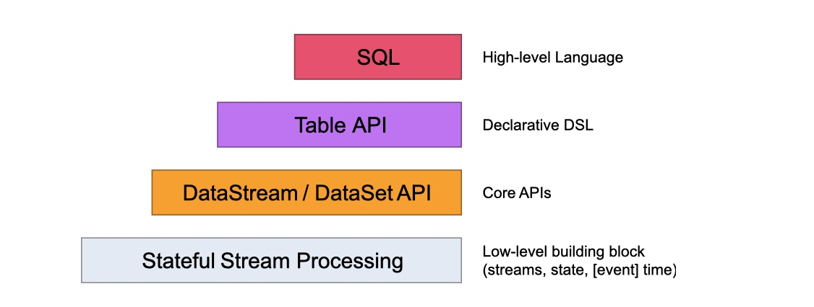
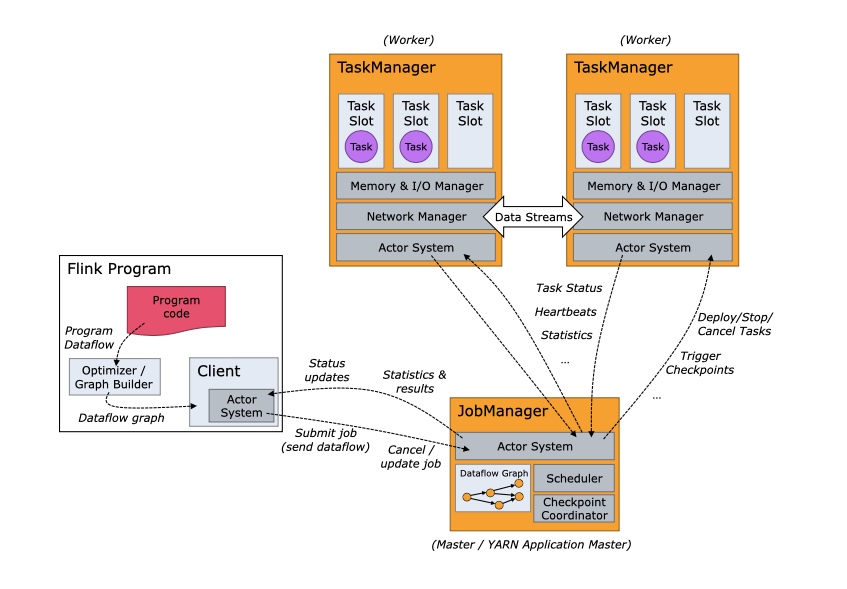
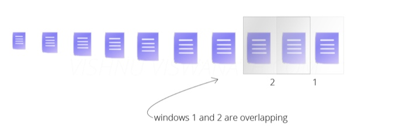
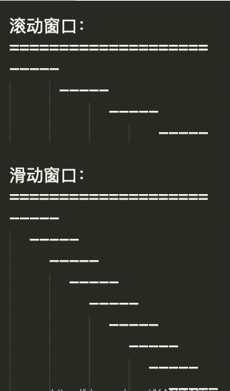
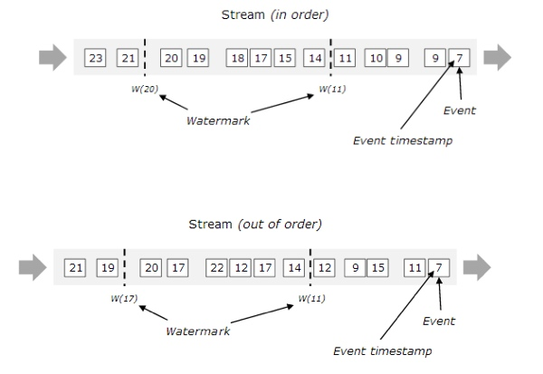
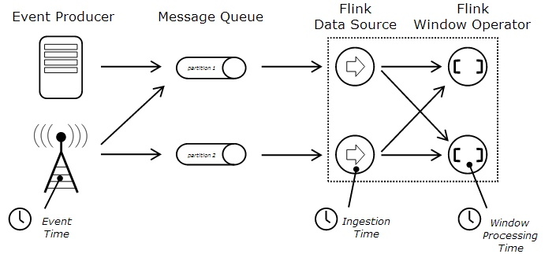

# 学习资料
- [官方文档](https://ci.apache.org/projects/flink/flink-docs-release-1.11/zh/)
- [基础概念解析](https://ververica.cn/developers/flink-basic-tutorial-1-basic-concept/)
- [开发环境搭建和应用的配置、部署及运行](https://ververica.cn/developers/flink-basic-tutorial-1-environmental-construction/)
- [DataStream API 编程](https://ververica.cn/developers/apache-flink-basic-zero-iii-datastream-api-programming/)
- [知乎flink学习专栏](https://www.zhihu.com/column/c_1168547106267770880)


# 配置

## 使用logback

flink和spark一样，默认的日志系统也是log4j，不过要改成logback比spark简单的多。

日志的配置文件在 Flink binary 目录的 conf 子目录下，其中：
- log4j-cli.properties：用 Flink 命令行时用的 log 配置，比如执行“ flink run”命令
- log4j-yarn-session.properties：用 yarn-session.sh 启动时命令行执行时用的 log 配置
- log4j.properties：无论是 Standalone 还是 Yarn 模式，JobManager 和 TaskManager 上用的 log 配置都是 log4j.properties

这三个“log4j.*properties”文件分别有三个“logback.*xml”文件与之对应，如果想使用 Logback 的同学，只需要把与之对应的“log4j.*properties”文件删掉即可，对应关系如下：
- log4j-cli.properties -> logback-console.xml
- log4j-yarn-session.properties -> logback-yarn.xml
- log4j.properties -> logback.xml

## flink-conf.yaml

```yml
# 默认并行度
taskmanager.numberOfTaskSlots: 4
# savepoint目录
state.savepoints.dir: file:///tmp/savepoint
# state.savepoints.dir: hdfs://nameservice/flink/savepoints
# hadoop配置目录 yarn模式的话需要配置 standalone模式不需要
export HADOOP_CONF_DIR=/etc/hadoop/conf
```

## flink on yarn

[Flink on yarn部署模式](https://www.jianshu.com/p/1b05202c4fb6)

flink on yarn 作业提交有两种方式：
- yarn seesion
    这种方式需要先启动集群，然后在提交作业，接着会向yarn申请一块空间后，资源永远保持不变。如果资源满了，下一个作业就无法提交，只能等到yarn中的其中一个作业执行完成后，释放了资源，那下一个作业才会正常提交.
- Flink run
    直接在YARN上提交运行Flink作业(Run a Flink job on YARN)，这种方式的好处是一个任务会对应一个job,即没提交一个作业会根据自身的情况，向yarn申请资源，直到作业执行完成，并不会影响下一个作业的正常运行，除非是yarn上面没有任何资源的情况下。

综合以上这2种的示意图如下：



### yarn seesion

用yarn session在启动集群时，有2种方式可以进行集群启动分别是：
- 客户端模式
- 分离式模式

#### 客户端模式

默认可以直接执行bin/yarn-session.sh 默认启动的配置是

```
masterMemoryMB=1024, taskManagerMemoryMB=1024,numberTaskManagers=1, slotsPerTaskManager=1
```

需要自己自定义配置的话，可以使用来查看参数：

`bin/yarn-session.sh –help`

| 参数 | 说明 |
| --- | --- |
| -n | 指定TaskManager的数量 |
| -d | 以分离模式运行 |
| -id | 指定yarn的任务ID |
| -j | Flink jar文件的路径 |
| -jm | JobManager容器的内存（默认值：MB） |
| -nl | 为YARN应用程序指定YARN节点标签 |
| -nm | 在YARN上为应用程序设置自定义名称 |
| -q | 显示可用的YARN资源（内存，内核） |
| -qu | 指定YARN队列 |
| -s | 指定TaskManager中slot的数量 |
| -st | 以流模式启动Flink |
| -tm | 每个TaskManager容器的内存（默认值：MB） |
| -z | 命名空间，用于为高可用性模式创建Zookeeper子路径 |
| -D <property=value>| 覆盖flink-conf.yaml里的配置 |

我们启动一个yarn-session有2个Taskmanager，jobmanager内存2GB，taskManager2GB内存，那么脚本编写应该是这样的：

`./bin/yarn-session.sh -n 2 -jm 1024 -tm 1024`

对于客户端模式而言，你可以启动多个yarn session，一个yarn session模式对应一个JobManager,并按照需求提交作业，同一个Session中可以提交多个Flink作业。如果想要停止Flink Yarn Application，需要通过yarn application -kill命令来停止


#### 分离式模式

对于分离式模式，并不像客户端那样可以启动多个yarn session，如果启动多个，会出现后启动的session一直处在等待状态。JobManager的个数只能是一个，同一个Session中可以提交多个Flink作业。如果想要停止Flink Yarn Application，需要通过yarn application -kill命令来停止。通过-d指定分离模式，即客户端在启动Flink Yarn Session后，就不再属于Yarn Cluster的一部分。

yarn-session.sh加-d参数来启动分离模式的flink集群

#### 提交作业到yarn session

通过flink run的yid参数，指定yarn session的id，来将作业提交到指定的集群上

### flink run

对于前面介绍的yarn session需要先启动一个集群，然后在提交作业。对于Flink run直接提交作业就相对比较简单，不需要额外的去启动一个集群，直接提交作业，即可完成Flink作业。

`bin/flink run -m yarn-cluster -d -yn 2 -yjm 2048 -ytm 5120 ./examples/batch/WordCount.jar  --input hdfs://192.168.44.135:9000/user/root/test/LICENSE  --output hdfs://192.168.44.135:9000/user/root/test/result.txt`


# 命令

## 启动集群

`bin/start-cluster.sh`
Standalone模式下通过 http://127.0.0.1:8081 能看到 Web 界面

## run

运行任务，以 Flink 自带的例子 TopSpeedWindowing 为例：
`bin/flink run -d examples/streaming/TopSpeedWindowing.jar`

### 参数说明


| 参数 | 说明 |
| --- | --- |
| -c | 如果没有在jar包中指定入口类，则需要在这里通过这个参数指定 |
| -m | 指定需要连接的jobmanager(主节点)地址，使用这个参数可以指定一个不同于配置文件中的jobmanager，可以是yarn集群名称 |
| -p | 指定程序的并行度。可以覆盖配置文件中的默认值 |
| -n | 允许跳过无法恢复的savepoint。 当已经有savepoint而你的新版程序删除了某个操作，此时就需要指定改参数 |
| -q | 禁止将日志记录输出到标准输出 |
| -s | savepoint的路径以还原作业来自（例如hdfs:///flink/savepoint-1537) |


还有参数如果在yarn-session当中没有指定，可以在yarn-session参数的基础上前面加“y”，即可控制所有的资源，这里就不獒述了。

## list
查看任务列表
`bin/flink list -m 127.0.0.1:8081`

## stop
停止任务。通过 -m 来指定要停止的 JobManager 的主机地址和端口。
`bin/flink stop -m 127.0.0.1:8081 d67420e52bd051fae2fddbaa79e046bb`

如果stop时抛出Could not stop the job的异常，说明Stop 命令执行失败了。一个 Job 能够被Stop的前提是所有的Source都是可以 Stoppable 的，即实现了StoppableFunction 接口。

## cancel
取消任务。如果在 conf/flink-conf.yaml 里面配置了 state.savepoints.dir，会保存 Savepoint，否则不会保存 Savepoint。
`bin/flink cancel -m 127.0.0.1:8081 5e20cb6b0f357591171dfcca2eea09de`

也可以在停止的时候显示指定 savepoint 目录。
`bin/flink cancel -m 127.0.0.1:8081 -s /tmp/savepoint 29da945b99dea6547c3fbafd57ed8759`

### 取消和停止（流作业）的区别
- cancel() 调用，立即调用作业算子的 cancel() 方法，以尽快取消它们。如果算子在接到 cancel() 调用后没有停止，Flink 将开始定期中断算子线程的执行，直到所有算子停止为止。
- stop() 调用，是更优雅的停止正在运行流作业的方式。stop() 仅适用于 Source 实现了 StoppableFunction 接口的作业。当用户请求停止作业时，作业的所有 Source 都将接收 stop() 方法调用。直到所有 Source 正常关闭时，作业才会正常结束。这种方式，能正常处理完所有作业。

## savepoint
触发 savepoint。
`bin/flink savepoint -m 127.0.0.1:8081 ec53edcfaeb96b2a5dadbfbe5ff62bbb /tmp/savepoint`

通过 -s 参数从指定的 Savepoint 启动
`bin/flink run -d -s /tmp/savepoint/savepoint-f049ff-24ec0d3e0dc7 ./examples/streaming/TopSpeedWindowing.jar`

### savepoint 和 checkpoint 的区别
Checkpoint 是增量做的，每次的时间较短，数据量较小，只要在程序里面启用后会自动触发，用户无须感知；Checkpoint 是作业 failover 的时候自动使用，不需要用户指定。
Savepoint 是全量做的，每次的时间较长，数据量较大，需要用户主动去触发。Savepoint 一般用于程序的版本更新（详见文档），Bug 修复，A/B Test 等场景，需要用户指定。

## modify
修改任务并行度。
`bin/flink modify -p 4 7752ea7b0e7303c780de9d86a5ded3fa`

每次 Modify 命令都会触发一次 Savepoint。

## info
Info 命令是用来查看 Flink 任务的执行计划（StreamGraph）的。
`bin/flink info examples/streaming/TopSpeedWindowing.jar`

拷贝输出的 Json 内容，粘贴到这个网站：[http://flink.apache.org/visualizer/](http://flink.apache.org/visualizer/)
可以看到执行计划图

## scala shell

### 启动shell

`bin/start-scala-shell.sh local`

### DataSet

```scala
val text = benv.fromElements("To be, or not to be,--that is the question:--")
val counts = text.flatMap { _.toLowerCase.split("\\W+") }.map { (_, 1) }.groupBy(0).sum(1)
counts.print()
```

对 DataSet 任务来说，print() 会触发任务的执行。
也可以将结果输出到文件（先删除 /tmp/out1，不然会报错同名文件已经存在），继续执行以下命令：
```scala
counts.writeAsText("/tmp/out1")
benv.execute("batch test")
```

### DataSteam

```scala
val textStreaming = senv.fromElements("To be, or not to be,--that is the question:--")
val countsStreaming = textStreaming.flatMap { _.toLowerCase.split("\\W+") }.map { (_, 1) }.keyBy(0).sum(1)
countsStreaming.print()
senv.execute("Streaming Wordcount")
```

对 DataStream 任务，print() 并不会触发任务的执行，需要显示调用 execute(“job name”) 才会执行任务

# Flink中的API

Flink 为流式/批式处理应用程序的开发提供了不同级别的抽象。




- Flink API 最底层的抽象为有状态实时流处理。其抽象实现是 Process Function，并且 Process Function 被 Flink 框架集成到了 DataStream API 中来为我们使用。它允许用户在应用程序中自由地处理来自单流或多流的事件（数据），并提供具有全局一致性和容错保障的状态。此外，用户可以在此层抽象中注册事件时间（event time）和处理时间（processing time）回调方法，从而允许程序可以实现复杂计算。

- Flink API 第二层抽象是 Core APIs。实际上，许多应用程序不需要使用到上述最底层抽象的 API，而是可以使用 Core APIs 进行编程：其中包含 DataStream API（应用于有界/无界数据流场景）和 DataSet API（应用于有界数据集场景）两部分。Core APIs 提供的流式 API（Fluent API）为数据处理提供了通用的模块组件，例如各种形式的用户自定义转换（transformations）、联接（joins）、聚合（aggregations）、窗口（windows）和状态（state）操作等。此层 API 中处理的数据类型在每种编程语言中都有其对应的类。

    Process Function 这类底层抽象和 DataStream API 的相互集成使得用户可以选择使用更底层的抽象 API 来实现自己的需求。DataSet API 还额外提供了一些原语，比如循环/迭代（loop/iteration）操作。

- Flink API 第三层抽象是 Table API。Table API 是以表（Table）为中心的声明式编程（DSL）API，例如在流式数据场景下，它可以表示一张正在动态改变的表。Table API 遵循（扩展）关系模型：即表拥有 schema（类似于关系型数据库中的 schema），并且 Table API 也提供了类似于关系模型中的操作，比如 select、project、join、group-by 和 aggregate 等。Table API 程序是以声明的方式定义应执行的逻辑操作，而不是确切地指定程序应该执行的代码。尽管 Table API 使用起来很简洁并且可以由各种类型的用户自定义函数扩展功能，但还是比 Core API 的表达能力差。此外，Table API 程序在执行之前还会使用优化器中的优化规则对用户编写的表达式进行优化。
    表和 DataStream/DataSet 可以进行无缝切换，Flink 允许用户在编写应用程序时将 Table API 与 DataStream/DataSet API 混合使用。

- Flink API 最顶层抽象是 SQL。这层抽象在语义和程序表达式上都类似于 Table API，但是其程序实现都是 SQL 查询表达式。SQL 抽象与 Table API 抽象之间的关联是非常紧密的，并且 SQL 查询语句可以在 Table API 中定义的表上执行。


# 基本架构

Flink整个系统主要由两个组件组成,分别为JobManager和TaskManager,Flink架构也遵循Master-Slave架构设计原则,JobManager为Master节点,TaskManager为Worker节点(slave). 所有组件之间的通信都是借助于Akka Framework,包括任务的状态以及Checkpoint触发等信息.
架构描述图



## Client客户端
客户端负责将任务提交到集群,与JobManager构建Akka连接,然后将任务提交到JobManager,通过和JobManager之间进行交互获取任务执行状态.

### 提交方式
客户端提交任务可以采用CLI方式或者通过使用Flink WebUI提交,
也可以在应用程序中指定JobManager的RPC网络端口构建ExecutionEnvironment提交Flink应用

## JobManager
JobManager负责将整个Flink集群任务的调度以及资源的管理,从客户端中获取提交的应用,然后根据集群中TaskManager上TaskSlot的使用情况,为提交的应用分配相应TaskSlots资源并命令TaskManager启动从客户端中获取的应用.
JobManager相当于整个集群的Master节点,且整个集群中有且只有一个活跃的JobManager,负责整个集群的任务管理和资源管理

### 通信
JobManager和TaskManager之间通过Actor System进行通信,获取任务执行的情况,通过Actor System 将应用的任务执行情况发送给客户端,同是在任务执行过程中,Flink jobMnager会触发CheckPoints 操作,每个TaskManager节点收到CheckPonits触发指令后,完成CheckPoints操作,所有的Checkpoint协调过程都是在FLink JobManager中完成,当任务完成后,Flink会将任务执行的信息反馈给客户端,并且释放掉TaskManager中的资源下提供下一次提交任务使用.

### 组件
JobManager有三个重要的组件
- ResourceManager
    The ResourceManager is responsible for resource de-/allocation and provisioning in a Flink cluster — it manages task slots, which are the unit of resource scheduling in a Flink cluster (see TaskManagers). Flink implements multiple ResourceManagers for different environments and resource providers such as YARN, Mesos, Kubernetes and standalone deployments. In a standalone setup, the ResourceManager can only distribute the slots of available TaskManagers and **cannot start new TaskManagers on its own**.

- Dispatcher
    The Dispatcher provides a REST interface to submit Flink applications for execution and starts a new JobMaster for each submitted job. It also runs the Flink WebUI to provide information about job executions.

- JobMaster
A JobMaster is responsible for managing the execution of a single JobGraph. Multiple jobs can run simultaneously in a Flink cluster, each having its own JobMaster.

## TaskManager
TaskManager相当于整个集群的Slave节点,负责具体的任务执行和对应任务在每个节点上的资源申请与管理,

### 过程
客户端通过将编写好的Flink应用编译打包,提交到JobManager,然后JobManager会根据已经注册在JobManager的资源情况,将任务分配给有资源的TaskManager节点,然后启动并运行任务,TaskManager从JobManger接受需要部署的任务,然后使用Slot资源启动Task,建立数据接入的网络连接,接受数据并开始数据处理.同时TaskManager之间的数据交互都是通过数据流的方式进行的.

### 对比MR
Flink的任务运行其实是通过采用多线程的方式,这和MapReduce多JVM进程的方式有很大的区别。Flink能够极大提高CPU使用效率,在多个任务和Task之间通过TaskSlot方式共享系统资源,每个TaskManager中通过管理多个TaskSlot资源池对资源进行有效管理.

## Flink的HA
默认情况下,每个Flink集群只有一个JobManager,这将导致单点故障(SPOF) ,如果这个JobManager挂了,则不能提交新的任务,并且运行中的程序也会失败.使用JobManager HA,可以从JobManager故障中恢复,从而避免单点故障,用户可以在Standalone或 Flink On Yarn集群模式下配置Flink集群HA(高可用性).

### Standalone模式下的Ha
任何时候都有一个Alive JobManager和多个Standby JobManager,Standby JobManager可以在Alive JobManager挂掉的情况下接管集群称为Alive JobManager,这样避免了单点故障,一旦某一个Standby JobManager接管集群,程序就可以继续运行.
**需要依赖Zookeeper和 HDFS**

### Flink On Yarn HA 安装和配置
正常基于Yarn提交Flink程序,无论是使用Yarn-Session模式还是Yarn-Cluster模式,基于Yarn运行后的application1只要kill掉对应的Flink集群进程"YarnSessionClusterEntryPoint" 后,基于Yarn的Flink任务就失败了,不会自动进行重试,所以基于Yarn运行Flink任务,也有必要搭建HA,这里同样还是需要借助Zookeeper来完成.

## Flink并行度和Slot
Flink中每一个worker(TaskManager)都是一个JVM进程,它可能会在独立的线程(Slot)上执行一个或多个subtask,Flink每个TaskManager为集群提供Solt. Solt的数量通常与每个TaskManager节点的可用CPU内核数成比例,**一般情况下Slot的数量就是每个节点的CPU的核数**.

### 任务的并行度指定

1. Operator Level(算子层面)
2. Execution Environment Level(执行环境层面)
3. Clinet Level(客户端层面)
4. System Level(系统层面)

优先级: 1 > 2 > 3 >4

### 并行度设置-- Operator Level
Operator,Source和Sink并行度可以通过调用setParallelism()方法来指定

```scala
//转换计算
val result: DataStream[(String,int)] = stream.flatMap(_.split(",")
    .map((_,1)).setParallelism(3)
    .keyBy(0)
    .sum(1).setParallelism(3)
// 打印结果到控制台
result.print().setParallelism(3)
```

### 并行度设置-- Execution Environment Level
任务的默认并行度可以通过调用setParallelism()方法指定,为了以并行度3来执行所有的Operator,Source和Sink,可以通过如下方式设置执行环境的并行度.

```scala
val streamEnv:StreamExecutionEnvironment = StreamExecutionEnvironment.getExecutionEnvironment()
streamEnv.setParallelism(3)
```

### 并行度设置-- Clinet Level
并行度还可以在客户端提交Job到Flink时设定,对于Cli客户端,可以通过-p参数指定并行度
`./bin/flink run -p 10 WordCount.jar`

### 并行度设置-- Ststem Level 
在系统级可以通过设置flink-conf.yaml文件中的parallelism.default属性来指定该执行环境的默认并行度.


# 关键概念

## Source

source是flink的数据来源
主要类图如下：


### SourceFunction

source的核心的是SourceFunction类，这个类主要有两个方法，run方法和cancel方法
* run方法的功能是核心功能，主要用于source往出emit元素
* cancel方法时用于取消run方法的执行，一般来说run方法内部是一个循环，cancel方法中控制run方法的循环不满足条件，从而取消run方法的执行。

### RichFunction

是一个富函数，这个函数里包含了很多基础的方法
* open方法一般用于初始化设置，一般在核心方法调用之前执行，用于初始化变量等
* close方法一般用于结束，用于回收资源方面的操作
* xxxRuntimeContext 这些方法用于对上下文进行操作

### AbstractRichFunction

该抽象类实现了RichFunction接口的关于xxxRuntimeContext 的方法

### RichParallelSourceFunction

**我们如果需要自定义Source，一般实现这个类就可以**，我们可以重写run,cancel，open等方法来实现我们自己需要的逻辑。如flink中的InputFormatSourceFunction.java的实现

### 自定义Source

自定义msyql的Source

```java
public class MySQLSource extends RichParallelSourceFunction<Student> {

   PreparedStatement ps;
   private Connection connection;


   @Override
   public void open(Configuration parameters) throws Exception {
       super.open(parameters);
           try {
               Class.forName("com.mysql.jdbc.Driver");
               connection = DriverManager.getConnection("jdbc:mysql://localhost:3306/flink?useUnicode=true&characterEncoding=UTF-8", "root", "root");
           } catch (Exception e) {
               System.out.println(e.getMessage());
           }

       String sql = "select * from student;";
       ps = this.connection.prepareStatement(sql);
   }

   @Override
   public void close() throws Exception {
       super.close();
       if (connection != null) { //关闭连接和释放资源
           connection.close();
       }
       if (ps != null) {
           ps.close();
       }
   }


   @Override
   public void run(SourceContext<Student> ctx) throws Exception {
       ResultSet resultSet = ps.executeQuery();
       while (resultSet.next()) {
           Student student = new Student(
                   resultSet.getInt("id"),
                   resultSet.getString("name").trim(),
           ctx.collect(student);
       }
   }

   @Override
   public void cancel() {
   }
  
}
```


## Transform

数据转换
具体参考常用算子这一节

## Sink

sink负责把flink处理后的数据输出到外部系统中，flink 的sink和source的代码结构类似。
主要类图：


### SinkFunction 
是一个接口，类似于SourceFunction接口。SinkFunction中主要包含一个方法，那就是用于数据输出的invoke 方法,每条记录都会执行一次invoke方法，用于执行输出操作。

### RichSinkFunction
我们一般自定义Sink的时候，都是继承RichSinkFunction，他是一个抽象类，继承了AbstractRichFunction

### 自定义Sink

我们这里自定义一个msyql的sink，也就是把flink中的数据，最后输出到mysql中。

```java
public class MyMysqlSink extends RichSinkFunction<Person> {
    private PreparedStatement ps = null;
    private Connection connection = null;
    String driver = "com.mysql.jdbc.Driver";
    String url = "jdbc:mysql://127.0.0.1:3306/flinkdb";
    String username = "root";
    String password = "root";
    // 初始化方法
    @Override
    public void open(Configuration parameters) throws Exception {
        super.open(parameters);
        // 获取连接
        connection = getConn();
        //执行查询
        ps = connection.prepareStatement("select * from person;");
    }
    private Connection getConn() {
        try {
            Class.forName(driver);
            connection = DriverManager.getConnection(url, username, password);
        } catch (Exception e) {
            e.printStackTrace();
        }
        return connection;
    }
    //Writes the given value to the sink. This function is called for every record.
    //每一个元素的插入，都会被调用一次invoke方法
    @Override
    public void invoke(Person p, Context context) throws Exception {
        ps.setString(1,p.getName());
        ps.setInt(2,p.getAge());
        ps.executeUpdate();
    }

    @Override
    public void close() throws Exception {
        super.close();
        if(connection != null){
            connection.close();
        }
        if (ps != null){
            ps.close();
        }
    }
}
```


# DataSet与DataStream的区别

DataSet同DataStream从其接口封装、真实计算Operator有很大的差别，Dataset的实现在flink-javamodule中，而DataStream的实现在flink-streaming-java中；

## DataSet

批式处理，其接口封装类似于Spark的Dataset，支持丰富的函数操作，比如map/fliter/join/cogroup等；
数据源创建初始数据集，例如来自文件或Java集合等静态数据；
所有的操作为Operator的子类，实现具体逻辑，比如Join逻辑是在JoinOperator中实现；

## DataStram

流式处理，其结构封装实现输入流的处理，其也实现了丰富的函数支持；
所有的操作为StreamOperator的子类，实现具体逻辑，比如Join逻辑是在IntervalJoinOperator中实现的；

# Flink 常用算子

[参考文档](https://blog.csdn.net/chybin500/article/details/87260869)
[官方文档](https://ci.apache.org/projects/flink/flink-docs-release-1.11/zh/dev/batch/dataset_transformations.html)
Flink中的算子是将一个或多个DataStream转换为新的DataStream，可以将多个转换组合成复杂的数据流拓扑。

在Flink中，有多种不同的DataStream类型，他们之间是使用各种算子进行的。如下图所示：


以下列举下常用的算子，用到的代码例子都是Flink监听9000端口做为数据源。以下方法可以启动一个9000的socket端口服务。

Linux平台上可以使用


```shell
nc -lk 9000
```

如果是 Windows 平台，可以通过 https://nmap.org/ncat/ 安装 ncat 然后运行：

```bash
ncat -lk 9000
```
## map

map可以理解为映射，对每个元素进行一定的变换后，映射为另一个元素。

举例：

```java
package operators;

import org.apache.flink.streaming.api.datastream.DataStream;
import org.apache.flink.streaming.api.environment.StreamExecutionEnvironment;

//这个例子是监听9000 socket端口，对于发送来的数据，以\n为分隔符分割后进行处理，
//将分割后的每个元素，添加上一个字符串后，打印出来。
public class MapDemo {
    private static int index = 1;
    public static void main(String[] args) throws Exception {
        //1.获取执行环境配置信息
        StreamExecutionEnvironment env = StreamExecutionEnvironment.getExecutionEnvironment();
        //2.定义加载或创建数据源（source）,监听9000端口的socket消息
        DataStream<String> textStream = env.socketTextStream("localhost", 9000, "\n");
        //3.map操作。
        DataStream<String> result = textStream.map(s -> (index++) + ".您输入的是：" + s);
        //4.打印输出sink
        result.print();
        //5.开始执行
        env.execute();
    }
}
```

## flatmap

flatmap可以理解为将元素摊平，每个元素可以变为0个、1个、或者多个元素。

举例：

```java
package operators;

import org.apache.flink.api.common.typeinfo.Types;
import org.apache.flink.streaming.api.datastream.DataStream;
import org.apache.flink.streaming.api.environment.StreamExecutionEnvironment;
import org.apache.flink.util.Collector;

//这个例子是用Flink监听9000端口，将接受的字符串用\n分割为一个个的元素
//然后将每个元素拆为一个个的字符，并打印出来
public class FlatMapDemo {
    private static int index1 = 1;
    private static int index2 = 1;

    public static void main(String[] args) throws Exception {
        //1.获取执行环境配置信息
        StreamExecutionEnvironment env = StreamExecutionEnvironment.getExecutionEnvironment();
        //2.定义加载或创建数据源（source）,监听9000端口的socket消息
        DataStream<String> textStream = env.socketTextStream("localhost", 9000, "\n");
        //3.flatMap操作，对每一行字符串进行分割
        DataStream<String> result = textStream.flatMap((String s, Collector<String> collector) -> {
            for (String str : s.split("")) {
                collector.collect(str);
            }
        })
        //这个地方要注意，在flatMap这种参数里有泛型算子中。
        //如果用lambda表达式，必须将参数的类型显式地定义出来。
        //并且要有returns，指定返回的类型
        //详情可以参考Flink官方文档：https://ci.apache.org/projects/flink/flink-docs-release-1.6/dev/java_lambdas.html
        .returns(Types.STRING);

        //4.打印输出sink
        result.print();
        //5.开始执行
        env.execute();
    }
}
```

## filter

filter是进行筛选。

举例：

```java
package operators;

import org.apache.flink.streaming.api.datastream.DataStream;
import org.apache.flink.streaming.api.environment.StreamExecutionEnvironment;

public class FilterDemo {
    private static int index = 1;
    public static void main(String[] args) throws Exception {
        //1.获取执行环境配置信息
        StreamExecutionEnvironment env = StreamExecutionEnvironment.getExecutionEnvironment();
        //2.定义加载或创建数据源（source）,监听9000端口的socket消息
        DataStream<String> textStream = env.socketTextStream("localhost", 9000, "\n");
        //3.filter操作，筛选非空行。
        DataStream<String> result = textStream.filter(line->!line.trim().equals(""));
        //4.打印输出sink
        result.print();
        //5.开始执行
        env.execute();
    }
}
```

## keyBy

逻辑上将Stream根据指定的Key进行分区，是根据key的散列值进行分区的。

举例：

```java
package operators;

import org.apache.flink.api.common.typeinfo.Types;
import org.apache.flink.api.java.tuple.Tuple2;
import org.apache.flink.streaming.api.datastream.DataStream;
import org.apache.flink.streaming.api.environment.StreamExecutionEnvironment;
import org.apache.flink.streaming.api.windowing.time.Time;

import java.util.concurrent.TimeUnit;

//这个例子是每行输入一个单词，以单词为key进行计数
//每10秒统计一次每个单词的个数
public class KeyByDemo {
    public static void main(String[] args) throws Exception {
        //1.获取执行环境配置信息
        StreamExecutionEnvironment env = StreamExecutionEnvironment.getExecutionEnvironment();
        //2.定义加载或创建数据源（source）,监听9000端口的socket消息
        DataStream<String> textStream = env.socketTextStream("localhost", 9000, "\n");
        //3.
        DataStream<Tuple2<String, Integer>> result = textStream
                //map是将每一行单词变为一个tuple2
                .map(line -> Tuple2.of(line.trim(), 1))
                //如果要用Lambda表示是，Tuple2是泛型，那就得用returns指定类型。
                .returns(Types.TUPLE(Types.STRING, Types.INT))
                //keyBy进行分区，按照第一列，也就是按照单词进行分区
                .keyBy(0)
                //指定窗口，每10秒个计算一次
                .timeWindow(Time.of(10, TimeUnit.SECONDS))
                //计算个数，计算第1列
                .sum(1);
        //4.打印输出sink
        result.print();
        //5.开始执行
        env.execute();
    }
}
```

## reduce

reduce是归并操作，它可以将KeyedStream 转变为 DataStream。

```java
package operators;

import org.apache.flink.api.common.typeinfo.Types;
import org.apache.flink.api.java.tuple.Tuple2;
import org.apache.flink.streaming.api.datastream.DataStream;
import org.apache.flink.streaming.api.environment.StreamExecutionEnvironment;
import org.apache.flink.streaming.api.windowing.time.Time;

import java.util.concurrent.TimeUnit;

//这个例子是对流进行分组，分组后进归并操作。
//是wordcount的另外一种实现方法
public class ReduceDemo {
    public static void main(String[] args) throws Exception {
        //1.获取执行环境配置信息
        StreamExecutionEnvironment env = StreamExecutionEnvironment.getExecutionEnvironment();
        //2.定义加载或创建数据源（source）,监听9000端口的socket消息
        DataStream<String> textStream = env.socketTextStream("localhost", 9000, "\n");
        //3.
        DataStream<Tuple2<String, Integer>> result = textStream
                //map是将每一行单词变为一个tuple2
                .map(line -> Tuple2.of(line.trim(), 1))
                //如果要用Lambda表示是，Tuple2是泛型，那就得用returns指定类型。
                .returns(Types.TUPLE(Types.STRING, Types.INT))
                //keyBy进行分区，按照第一列，也就是按照单词进行分区
                .keyBy(0)
                //指定窗口，每10秒个计算一次
                .timeWindow(Time.of(10, TimeUnit.SECONDS))
                //对每一组内的元素进行归并操作，即第一个和第二个归并，结果再与第三个归并...
                .reduce((Tuple2<String, Integer> t1, Tuple2<String, Integer> t2) -> new Tuple2(t1.f0, t1.f1 + t2.f1));

        //4.打印输出sink
        result.print();
        //5.开始执行
        env.execute();
    }
}
```
### reduceGroup
通过自定义的reduce函数实现reduce操作
自定义reduce函数需实现GroupReduceFunction接口

```scala
object ReduceGroupDemo extends App with Utils {
  val input = env.fromElements(1, 2, 3, 4, 5)
  val out: DataSet[Int] = input.reduceGroup(new MyGroupReducer())
  out.print()

}

/**
 * 自定义reduceGroup操作函数
 * 实现GroupReduceFunction接口
 */
class MyGroupReducer extends GroupReduceFunction[Int, Int] {
  override def reduce(values: lang.Iterable[Int], out: Collector[Int]): Unit = {
    var i = 0
    values.asScala.foreach(a => {
      println("a:" + a)
      i = i - a
    })
    println("i:" + i)
    out.collect(i)
  }
}
```

## fold 已废弃，用aggregate替换

给定一个初始值，将各个元素逐个归并计算。它将KeyedStream转变为DataStream。

举例：

```java
package operators;

import org.apache.flink.api.common.typeinfo.Types;
import org.apache.flink.api.java.tuple.Tuple2;
import org.apache.flink.streaming.api.datastream.DataStream;
import org.apache.flink.streaming.api.environment.StreamExecutionEnvironment;
import org.apache.flink.streaming.api.windowing.time.Time;

import java.util.concurrent.TimeUnit;

public class FoldDemo {
    public static void main(String[] args) throws Exception {
        //1.获取执行环境配置信息
        StreamExecutionEnvironment env = StreamExecutionEnvironment.getExecutionEnvironment();
        //2.定义加载或创建数据源（source）,监听9000端口的socket消息
        DataStream<String> textStream = env.socketTextStream("localhost", 9000, "\n");
        //3.
        DataStream<String> result = textStream
                //map是将每一行单词变为一个tuple2
                .map(line -> Tuple2.of(line.trim(), 1))
                //如果要用Lambda表示是，Tuple2是泛型，那就得用returns指定类型。
                .returns(Types.TUPLE(Types.STRING, Types.INT))
                //keyBy进行分区，按照第一列，也就是按照单词进行分区
                .keyBy(0)
                //指定窗口，每10秒个计算一次
                .timeWindow(Time.of(10, TimeUnit.SECONDS))
                //指定一个开始的值，对每一组内的元素进行归并操作，即第一个和第二个归并，结果再与第三个归并...
                .fold("结果：",(String current, Tuple2<String, Integer> t2) -> current+t2.f0+",");

        //4.打印输出sink
        result.print();
        //5.开始执行
        env.execute();
    }
}
```

## union

union可以将多个流合并到一个流中，以便对合并的流进行统一处理。是对多个流的水平拼接。

参与合并的流必须是同一种类型。

举例：

```java
package operators;

import org.apache.flink.streaming.api.datastream.DataStream;
import org.apache.flink.streaming.api.environment.StreamExecutionEnvironment;

//这个例子是将三个socket端口发送来的数据合并到一个流中
//可以对这三个流发送来的数据，集中处理。
public class UnionDemo {
    public static void main(String[] args) throws Exception {
        //1.获取执行环境配置信息
        StreamExecutionEnvironment env = StreamExecutionEnvironment.getExecutionEnvironment();
        //2.定义加载或创建数据源（source）,监听9000端口的socket消息
        DataStream<String> textStream9000 = env.socketTextStream("localhost", 9000, "\n");
        DataStream<String> textStream9001 = env.socketTextStream("localhost", 9001, "\n");
        DataStream<String> textStream9002 = env.socketTextStream("localhost", 9002, "\n");

        DataStream<String> mapStream9000=textStream9000.map(s->"来自9000端口："+s);
        DataStream<String> mapStream9001=textStream9001.map(s->"来自9001端口："+s);
        DataStream<String> mapStream9002=textStream9002.map(s->"来自9002端口："+s);

        //3.union用来合并两个或者多个流的数据，统一到一个流中
        DataStream<String> result =  mapStream9000.union(mapStream9001,mapStream9002);

        //4.打印输出sink
        result.print();
        //5.开始执行
        env.execute();
    }
}
```

## join

根据指定的Key将两个流进行关联。

举例：

```java
package operators;

import org.apache.flink.api.common.functions.MapFunction;
import org.apache.flink.api.java.tuple.Tuple2;
import org.apache.flink.streaming.api.datastream.DataStream;
import org.apache.flink.streaming.api.environment.StreamExecutionEnvironment;
import org.apache.flink.streaming.api.windowing.assigners.TumblingProcessingTimeWindows;
import org.apache.flink.streaming.api.windowing.time.Time;

public class WindowJoinDemo {
    public static void main(String[] args) throws Exception {
        //1.获取执行环境配置信息
        StreamExecutionEnvironment env = StreamExecutionEnvironment.getExecutionEnvironment();

        //2.定义加载或创建数据源（source）,监听9000端口的socket消息
        DataStream<String> textStream9000 = env.socketTextStream("localhost", 9000, "\n");
        DataStream<String> textStream9001 = env.socketTextStream("localhost", 9001, "\n");
        //将输入处理一下，变为tuple2
        DataStream<Tuple2<String,String>> mapStream9000=textStream9000
                .map(new MapFunction<String, Tuple2<String,String>>() {
                    @Override
                    public Tuple2<String, String> map(String s) throws Exception {
                        return Tuple2.of(s,"来自9000端口："+s);
                    }
                });

        DataStream<Tuple2<String,String>> mapStream9001=textStream9001
                .map(new MapFunction<String, Tuple2<String,String>>() {
                    @Override
                    public Tuple2<String, String> map(String s) throws Exception {
                        return Tuple2.of(s,"来自9001端口："+s);
                    }
                });

        //3.两个流进行join操作，是inner join，关联上的才能保留下来
        DataStream<String> result =  mapStream9000.join(mapStream9001)
                //关联条件，以第0列关联（两个source输入的字符串）
                .where(t1->t1.getField(0)).equalTo(t2->t2.getField(0))
                //以处理时间，每10秒一个滚动窗口
                .window(TumblingProcessingTimeWindows.of(Time.seconds(10)))
                //关联后输出
                .apply((t1,t2)->t1.getField(1)+"|"+t2.getField(1))
                ;

        //4.打印输出sink
        result.print();
        //5.开始执行
        env.execute();
    }
}
```

## coGroup

关联两个流，关联不上的也保留下来。

举例：

```java
package operators;

import org.apache.flink.api.common.functions.CoGroupFunction;
import org.apache.flink.api.common.functions.MapFunction;
import org.apache.flink.api.java.tuple.Tuple2;
import org.apache.flink.streaming.api.datastream.DataStream;
import org.apache.flink.streaming.api.environment.StreamExecutionEnvironment;
import org.apache.flink.streaming.api.windowing.assigners.TumblingProcessingTimeWindows;
import org.apache.flink.streaming.api.windowing.time.Time;
import org.apache.flink.util.Collector;

public class CoGroupDemo {
    public static void main(String[] args) throws Exception {
        //1.获取执行环境配置信息
        StreamExecutionEnvironment env = StreamExecutionEnvironment.getExecutionEnvironment();

        //2.定义加载或创建数据源（source）,监听9000端口的socket消息
        DataStream<String> textStream9000 = env.socketTextStream("localhost", 9000, "\n");
        DataStream<String> textStream9001 = env.socketTextStream("localhost", 9001, "\n");
        //将输入处理一下，变为tuple2
        DataStream<Tuple2<String, String>> mapStream9000 = textStream9000
                .map(new MapFunction<String, Tuple2<String, String>>() {
                    @Override
                    public Tuple2<String, String> map(String s) throws Exception {
                        return Tuple2.of(s, "来自9000端口：" + s);
                    }
                });

        DataStream<Tuple2<String, String>> mapStream9001 = textStream9001
                .map(new MapFunction<String, Tuple2<String, String>>() {
                    @Override
                    public Tuple2<String, String> map(String s) throws Exception {
                        return Tuple2.of(s, "来自9001端口：" + s);
                    }
                });

        //3.两个流进行coGroup操作,没有关联上的也保留下来，功能更强大
        DataStream<String> result = mapStream9000.coGroup(mapStream9001)
                //关联条件，以第0列关联（两个source输入的字符串）
                .where(t1 -> t1.getField(0)).equalTo(t2 -> t2.getField(0))
                //以处理时间，每10秒一个滚动窗口
                .window(TumblingProcessingTimeWindows.of(Time.seconds(10)))
                //关联后输出
                .apply(new CoGroupFunction<Tuple2<String, String>, Tuple2<String, String>, String>() {
                    @Override
                    public void coGroup(Iterable<Tuple2<String, String>> iterable, Iterable<Tuple2<String, String>> iterable1, Collector<String> collector) throws Exception {
                        StringBuffer stringBuffer = new StringBuffer();
                        stringBuffer.append("来自9000的stream:");
                        for (Tuple2<String, String> item : iterable) {
                            stringBuffer.append(item.f1 + ",");
                        }
                        stringBuffer.append("来自9001的stream:");
                        for (Tuple2<String, String> item : iterable1) {
                            stringBuffer.append(item.f1 + ",");
                        }
                        collector.collect(stringBuffer.toString());
                    }
                });

        //4.打印输出sink
        result.print();
        //5.开始执行
        env.execute();
    }
}
```

## connect

参考：https://www.jianshu.com/p/5b0574d466f8

将两个流纵向地连接起来。DataStream的connect操作创建的是ConnectedStreams或BroadcastConnectedStream，它用了两个泛型，即不要求两个dataStream的element是同一类型。

举例：

```java
package operators;

import org.apache.flink.api.java.tuple.Tuple2;
import org.apache.flink.streaming.api.datastream.DataStream;
import org.apache.flink.streaming.api.datastream.SingleOutputStreamOperator;
import org.apache.flink.streaming.api.environment.StreamExecutionEnvironment;
import org.apache.flink.streaming.api.functions.co.CoMapFunction;

import java.util.regex.Matcher;
import java.util.regex.Pattern;

public class ConnectDemo {
    public static void main(String[] args) throws Exception {
        //1.获取执行环境配置信息
        StreamExecutionEnvironment env = StreamExecutionEnvironment.getExecutionEnvironment();
        //2.定义加载或创建数据源（source）,监听9000端口的socket消息
        DataStream<String> textStream9000 = env.socketTextStream("localhost", 9000, "\n");
        DataStream<String> textStream9001 = env.socketTextStream("localhost", 9001, "\n");
        //转为Integer类型流
        DataStream<Integer> intStream = textStream9000.filter(s -> isNumeric(s)).map(s -> Integer.valueOf(s));
        //连接起来，分别处理，返回同样的一种类型。
        SingleOutputStreamOperator result = intStream.connect(textStream9001)
                .map(new CoMapFunction<Integer, String, Tuple2<Integer, String>>() {
                    @Override
                    public Tuple2<Integer, String> map1(Integer value) throws Exception {
                        return Tuple2.of(value, "");
                    }

                    @Override
                    public Tuple2<Integer, String> map2(String value) throws Exception {
                        return Tuple2.of(null, value);
                    }
                });
        //4.打印输出sink
        result.print();
        //5.开始执行
        env.execute();
    }

    private static boolean isNumeric(String str) {
        Pattern pattern = Pattern.compile("[0-9]*");
        Matcher isNum = pattern.matcher(str);
        if (!isNum.matches()) {
            return false;
        }
        return true;
    }
}
```

## split

参考：https://cloud.tencent.com/developer/article/1382892

将一个流拆分为多个流。

```java
package operators;

import org.apache.flink.api.common.typeinfo.Types;
import org.apache.flink.api.java.tuple.Tuple2;
import org.apache.flink.streaming.api.datastream.DataStream;
import org.apache.flink.streaming.api.datastream.SplitStream;
import org.apache.flink.streaming.api.environment.StreamExecutionEnvironment;

import java.util.ArrayList;
import java.util.List;
import java.util.regex.Matcher;
import java.util.regex.Pattern;

public class SplitDemo {
    public static void main(String[] args) throws Exception {
        //1.获取执行环境配置信息
        StreamExecutionEnvironment env = StreamExecutionEnvironment.getExecutionEnvironment();
        //2.定义加载或创建数据源（source）,监听9000端口的socket消息
        DataStream<String> textStream = env.socketTextStream("localhost", 9000, "\n");
        //3.
        SplitStream<Tuple2<String, Integer>> result = textStream
                //map是将每一行单词变为一个tuple2
                .map(line -> Tuple2.of(line.trim(), 1))
                //如果要用Lambda表示是，Tuple2是泛型，那就得用returns指定类型。
                .returns(Types.TUPLE(Types.STRING, Types.INT))
                .split(t -> {
                    List<String> list = new ArrayList<>();
                    //根据逻辑拆分，并定义outputName
                    if (isNumeric(t.f0)) {
                        list.add("num");
                    } else {
                        list.add("str");
                    }
                    return list;
                });
        //选择指定名称的流
        DataStream<Tuple2<String, Integer>> strSplitStream = result.select("str")
                .map(t -> Tuple2.of("字符串：" + t.f0, t.f1))
                .returns(Types.TUPLE(Types.STRING,Types.INT));
        //选择指定名称的流
        DataStream<Tuple2<String, Integer>> intSplitStream = result.select("num")
                .map(t -> Tuple2.of("数字：" + t.f0, t.f1))
                .returns(Types.TUPLE(Types.STRING,Types.INT));

        //4.打印输出sink
        strSplitStream.print();
        intSplitStream.print();
        //5.开始执行
        env.execute();
    }

    private static boolean isNumeric(String str) {
        Pattern pattern = Pattern.compile("[0-9]*");
        Matcher isNum = pattern.matcher(str);
        if (!isNum.matches()) {
            return false;
        }
        return true;
    }
}
```

## aggregation
KeyedStream --> DataStream：分组流数据的滚动聚合操作：例如sum()，min()，max()等,这些可以用于keyedStream从而获得聚合。用法如下
KeyedStream.sum(0)或者KeyedStream.sum(“Key”)
min和minBy的区别是min返回的是一个最小值，而minBy返回的是其字段中包含的最小值的元素（同样元原理适用于max和maxBy）

## window
KeyedStream --> DataStream：windows是在一个分区的KeyedStreams中定义的，windows根据某些特性将每个key的数据进行分组（例如：在5s内到达的数据）。

## windowAll
DataStream --> AllWindowedStream：Windows可以在一个常规的DataStream中定义，Windows根据某些特性对所有的流（例如：5s内到达的数据）。
注意：这个操作在很多情况下都不是并行操作的，所有的记录都会聚集到一个windowAll操作的任务中

## window apply
WindowedStream --> DataStream
AllWindowedStream --> DataStream：将一个通用的函数作为一个整体传递给window。

## window reduce
WindowedStream --> DataStream：给窗口赋予一个reduce的功能，并返回一个reduce的结果。

## window fold
WindowedStream --> DataStream：给窗口赋予一个fold的功能，并返回一个fold后的结果。

## aggregation on windows
WindowedStream --> DataStream：对window的元素做聚合操作，min和minBy的区别是min返回的是最小值，而minBy返回的是包含最小值字段的元素。（同样原理适用于max和maxBy）

## window join
DataStream，DataStream --> DataStream：根据给定的key和window对两个DataStream做join操作

## window coGroup
DataStream，DataStream --> DataStream：根据一个给定的key和window对两个DataStream做CoGroups操作。

## coMap、coFlatMap
ConnectedStreams --> DataStream：作用于connected数据流上，功能与map和flatMap一样。

## select
SplitStream --> DataStream：从一个SplitStream中获取一个或多个DataStream

## iterate
DataStream --> IterativeStream --> DataStream：在流程中创建一个反馈循环，将一个操作的输出重定向到之前的操作，这对于定义持续更新模型的算法来说很有意义的。

## extract timestamps
DataStream --> DataStream：提取记录中的时间戳来跟需要事件时间的window一起发挥作用。


# 常见错误

## could not find implicit value for evidence parameter of type org.apache.flink.api.common.typeinfo.TypeInformation[?]

解决办法
加入隐式转换
推荐的做法是在代码中引入以下包：

`import org.apache.flink.streaming.api.scala._`

如果数据是有限的（静态数据集），我们可以引入以下包：

`mport org.apache.flink.api.scala._`

然后即可解决上面的异常信息。

## Please make sure to export the HADOOP_CLASSPATH environment variable or have hadoop in your classpath. For more information refer to the "Deployment & Operations" section of the official Apache Flink documentation.

产生这个问题的原因是从Flink 1.11开始，flink-shaded-hadoop-2-uberFlink项目不再正式支持使用发行版。建议用户通过提供Hadoop依赖关系HADOOP_CLASSPATH

官网提供的解决方案是执行

```shell
export HADOOP_CLASSPATH=`hadoop classpath`
```

注意此处的hadoop classpath并不是让替换成hadoop的jar包路径，而是直接执行这条命令，不要替换任意字符。。。

# 常用隐式转换

```scala
import org.apache.flink.api.scala._
```

# DataStream结果输出

## 打印到控制台

```java
// 获取运行环境
StreamExecutionEnvironment env = StreamExecutionEnvironment.getExecutionEnvironment();
// 获取数据源
DataStream<String> text = env.socketTextStream("IP", port, "\n");
...省略中间算子处理...
// 使用一个并行度将结果打印至控制台
text.print().setParallelism(1);
```

## 打印至文本文件

```java
// 获取运行环境
StreamExecutionEnvironment env = StreamExecutionEnvironment.getExecutionEnvironment();
// 获取数据源
DataStream<String> text = env.socketTextStream("IP", port, "\n");
...省略中间算子处理...
// 使用一个并行度将结果打印至文本文件
text.writeAsText(String path).setParallelism(1);
```

## 打印至csv文件

```java
// 获取运行环境
StreamExecutionEnvironment env = StreamExecutionEnvironment.getExecutionEnvironment();
// 获取数据源
DataStream<String> text = env.socketTextStream("IP", port, "\n");
...省略中间算子处理...
// 使用一个并行度将结果打印至控制台
text.writeAsCsv(String path).setParallelism(1);
```

## 打印至scoket

```java
// 获取运行环境
StreamExecutionEnvironment env = StreamExecutionEnvironment.getExecutionEnvironment();
// 获取数据源
DataStream<String> text = env.socketTextStream("IP", port, "\n");
...省略中间算子处理...
// 使用一个并行度将结果打印至控制台
text.writeToSocket(hostName, port, schema).setParallelism(1);
```

## 通过连接器打印到Kafka

```java
// 获取运行环境
StreamExecutionEnvironment env = StreamExecutionEnvironment.getExecutionEnvironment();
// 获取数据源
DataStream<String> text = env.socketTextStream("IP", port, "\n");
...省略中间算子处理...
// 使用一个并行度将结果打印至控制台
String kafkaTopic = params.get("kafka-topic");
String brokers = params.get("brokers", "localhost:9092");
text.addSink(new FlinkKafkaProducer010(brokers, kafkaTopic, (SerializationSchema) new EventDeSerializer())).setParallelism(1);
```

# Window详解


windows 计算是流式计算中非常常用的数据计算方式之一.通过按照固定时间或长度将数据流切分成不同窗口,然后对数据进行相应的聚合运算,从而得到一定时间范围内的统计结果。

例如统计最近5min 内某基站的呼叫数,此时基站的数据在不断地产生,但是通过5min中的窗口将数据限定在固定时间范围内,就可以对该范围内的有界数据执行聚合处理,得出最近5min的基站的呼叫数量.
    
## 1.Window 分类

### 1. Global Window 和 keyed Window

在运用窗口计算时,Flink根据上游数据集是否为KeyedStream类型,对应的Window也会有所不同.

* Keyed Window
    上游数据集如果是KeyedStream类型,则调用DataStream API 的Window()方法,数据会根据Key在不同的Task实例中并行分别计算,最后得出针对每个Key统计的结果.
    
* Global Window
    如果是Non-Keyey类型,则调用WindowsAll()方法,所有的数据都会在窗口算子中汇到一个Task中计算,并得出全局统计结果

eg:
    
```scala
    // Global Window
    data.windowAll(自定义的WindowAssigner)
    //KeyedWindow
    data.keyBy(_.sid)
    .window(自定义的WindowAssigne)
```

### 2. Time Window 和Count Window

基于业务数据的方面考虑,Flink又支持两种类型的窗口,一种是基于时间的窗口叫Time Window,还有一种基于输入数据量的窗口叫Count Window

#### Time Window(时间窗口)

根据不同的业务场景,Time Window也可以分为三种类型,分别是滚动窗口(Tumbling Window)、滑动窗口(Sliding Window)和会话窗口(Session Window)

##### 1. 滚动窗口(Tumbling Window)

滚动窗口是根据固定时间进行切分,且**窗口和窗口之间的元素互不重叠**,
这种类型的窗口最大特点是比较简单,只需要指定一个窗口长度(window size)

eg:
    
```scala
// 每隔5s统计每个基站的日志数量
data.map((_.sid,1))
.keyBy(_._1)
.timeWindow(Time.seconds(5))
//window(TumblingEventTImeWindows.of(Time.seconds(5)))
.sum(1)//聚合

```
其中时间间隔可以是Time.milliseconds(x),Time.seconds(x)或Time.minutes(x)


##### 2. 滑动窗口(Sliding Window)

滑动窗口也是一种比较常见的窗口类型,其特点是在滚动窗口基础上增加了窗口滑动时间(Slide TIme),且**允许窗口数据发生重叠**,当Windows size固定之后,窗口并不像滚动窗口按照windows Size向前移动,而是根据设定的Slide Time向前滑动.   

窗口之间的数据重叠大小根据Windows Size和Slide Time决定,当SlideTime小于Windows size 便会发生窗口重叠

滑动窗口的使用场景和滚动窗口不同，比方说要每一分钟统计下最近一小时的数据，此时就会用到滑动窗口，设置窗口大小是1小时，滑动时间是1分钟，这种场景如果是用滚动窗口的话只能是统计每分钟的，然后跑批来统计每分钟的最近一小时。
    
eg: 
    
```scala
    //每隔3s计算最近5s内,每个基站的日志数量
    data.map((_,1))
    .keyBy(_._1)
    .timeWindow(Time.seconds(5),Time.seconds(3))
    .sum(1)
```

##### 3. 会话窗口(Session Window)

会话窗口主要是将某段时间内活跃度较高的数据聚合成一个窗口进行计算,窗口的触发的条件是Session Gap,是指**在规定的时间内如果没有数据活跃接入,则认为窗口结束,然后触发窗口计算结果。**
    
注意:
    需要注意的是如果数据一直不间断地进入窗口,也会导致窗口始终不触发的情况.
    与滑动窗口不同的是,Session Windows不需要有固定Window size和slide time,
    需要定义session gap,来规定不活跃数据的时间上限即可
    
eg:
    
```scala
    //3s内如果没有数据接入,则计算每个基站的日志数量
    data.map((_.sid,1))
    .keyBy(_._1)
    .window(EventTimeSessionWindows.withGap(Time.seconds(3))))
    .sum(1)
  
```

##### 滚动和滑动的区别

- 滚动窗口滚动数据流。这种类型的窗口是不重叠的 - 即，一个窗口中的事件/数据不会在其他窗口中重叠/出现。
    

    你可以配置滚动窗口基于数量，例如基于每5条数据，或者基于时间，例如基于每十秒钟。

- 滑动窗口与翻滚窗口相对，滑过数据流。因此，滑动窗口可以重叠，它可以对输入的数据流进行更平滑的聚合 - 因为您不是从一组输入跳转到下一组输入，而是滑过输入的数据流。
    

    与滚动窗口类似，你也可以根据时间或事件计数配置滑动窗口。
    

双横线是事件流，单横线是窗口（这里用事件窗口）
事件窗口大小是5根杠杠。
滚动窗口处理完要用4次，滑动用n多次
同一事件不会出现在同一个滚动窗口中，但是可能在多个滑动窗口中（啧啧，脚踏两条船）


  
#### Count Window(数量窗口)

概述:
    Count Window 也有滚动窗口、滑动窗口等.使用较少

## Window 的 API

概述:
    在实际案例中Keyed Window 使用最多,所以我们需要掌握Keyed Window的算子,在每个窗口算子中包含了Windows Assigner、Windows Trigger(窗口触发器)、Evictor(数据剔除器)、Lateness(时延设定)、Output (输出标签)以及Windows Function,其中Windows Assigner和Windows Functions是所有窗口算子必须指定的属性,其余的属性都是根据实际情况选择指定.

```
code:
    stream.keyBy(...)//是Keyed类型数据集
    .window(...)//指定窗口分配器类型
    [.trigger(...)]//指定触发器类型(可选)
    [.evictor(...)] // 指定evictor或者不指定(可选)
    [.allowedLateness(...)] //指定是否延迟处理数据(可选)
    [.sideOutputLateData(...)] // 指定Output lag(可选)
    .reduce/aggregate/fold/apply() //指定窗口计算函数
    [.getSideOutput(...)] //根据Tag输出数据(可选)
intro:
    Windows Assigner : 指定窗口的类型,定义如何将数据流分配到一个或多个窗口
    Windows Trigger : 指定窗口触发的时机,定义窗口满足什么样的条件触发计算
    Evictor : 用于数据剔除
    allowedLateness : 标记是否处理迟到数据,当迟到数据达到窗口是否触发计算
    Output Tag: 标记输出标签,然后在通过getSideOutput将窗口中的数据根据标签输出
    Windows Function: 定义窗口上数据处理的逻辑,例如对数据进行Sum操作
```
    
## 窗口聚合函数

概述:
    如果定义了Window Assigner ,下一步就可以定义窗口内数据的计算逻辑,这也就是Window Function的定义,Flink提供了四种类型的Window Function,分别为 ReduceFunction、AggregateFunction以及ProcessWindowFunction,(sum和max)等.

前3种类型的Window Function按照计算原理的不同可以分为两大类

1. 一类是增量聚合函数: 对应有ReduceFunction、AggregateFunction;
2. 另一类是全量窗口函数,对应有ProcessWindowFunction(WindowFunction)

差异:
1. 增量聚合函数计算性能较高,占用内存空间少,主要因为基于中间状态的计算结果,窗口中只维护中间结果状态值,不需要缓存原始数据.
2. 全量窗口函数使用的代价相对较高,性能比较弱,主要因为此时算子需要对所有属于该窗口的接入数据进行缓存,然后等到窗口触发的时候,对所有的原始数据进行汇总计算.

### 1. ReduceFunction

概述
    ReduceFunction 定义了对输入的两个相同类型的数据元素按照指定的计算方法进行聚合的逻辑,
    然后输出类型相同的一个结果元素
code:
    
```scala
    // 每隔5s统计每个基站的日志数量
    data.map((_.sid,1))
    .keyBy(_._1)
    .window(TumblingEventTimeWindows.of(TIme.seconds(5)))
    .reduce((v1,v2)=>(v1._1,v1._2+v2._2))
```

### 2. AggregateFunction

概述:
    和ReduceFunction 相似,AggregateFunction也是基于中间状态计算结果的增量计算函数,但AggregateFunctino在窗口计算上更加通用,AggregateFunction接口相对ReduceFunction更加灵活.实现复杂度也相对较高. 
    
AggregateFunction接口中定义了三个需要复写的方法,其中
*     add()定义数据添加的逻辑,
*     getResult()定义了根据accmulator计算结果的逻辑,
*     merge()方法定义合并accumulator的逻辑

code:
    
```scala
        //每隔3s内计算最近5s内,每个基站的日志数量
        val data = env.readTextFile("D:\\Workspace\\IdeaProjects\\F1Demo\\src\\FlinkDemo\\functions\\station.log")
          .map { line =>
            var arr = line.split(",")
            StationLog(arr(0).trim, arr(1).trim, arr(2).trim, arr(3).trim, arr(4).trim.toLong, arr(5).trim.toLong)
          }
        val result = data.map(stationLog => (stationLog.sid, 1))
          .keyBy(_._1)
          .timeWindow(Time.seconds(5), Time.seconds(3))
          // new AggregateFunction[In,Acc,Out]
          .aggregate(new AggregateFunction[(String, Int), (String, Long), (String, Long)] {
          override def createAccumulator(): (String, Long) = ("", 0)
    
          override def add(in: (String, Int), acc: (String, Long)): (String, Long) = {
            (in._1, acc._2 + in._2)
          }
    
          override def getResult(acc: (String, Long)): (String, Long) = {
            print(acc)
            acc
          }
    
          override def merge(acc: (String, Long), acc1: (String, Long)): (String, Long) = {
            (acc._1, acc1._2 + acc._2)
          }
        })
    
        env.execute()
      }
```

### 3. ProcessWindowFunction

概念:
    前面提到的ReduceFunction和AggregateFunction都是基于中间状态实现增量计算的窗口函数,虽然已经满足绝大多数场景,但在某些情况下,统计更复杂的指标可能需要依赖于窗口中所有的数据元素,或需要操作窗口中的状态数据和窗口元数据,这时就需要使用到ProcessWindowsFunction,ProcessWindowsFunction能够更加灵活地支持基于窗口全部数据元素的结果计算,例如对整个窗口数据排序取TopN,这样的需求就必须使用ProcessWindowFunction.

code:
    
```scala
val result = data.map(stationLog => ((stationLog.sid, 1)))
  .keyBy(_._1)
  //.timeWindow(Time.seconds(5))
  .window(TumblingProcessingTimeWindows.of(Time.seconds(5)))
  // ProcessWindowFunction[In,Out,Key,Window]
  .process(new ProcessWindowFunction[(String, Int), (String, Long), String, TimeWindow] {
  //一个窗口结束的时候调用一次(一个分组执行一次)
  override def process(key: String, context: Context, elements: Iterable[(String, Int)], out: Collector[(String, Long)]): Unit = {
    print("----")
    //注意：整个窗口的数据保存到Iterable，里面有很多行数据。Iterable的size就是日志的总条数
    out.collect((key, elements.size))
  }
}).print()
env.execute()
```


### AggregateFunction完整demo
    
```scala
    import FlinkDemo.functions.FunctionClassTransformation.StationLog
    import org.apache.flink.api.common.functions.AggregateFunction
    import org.apache.flink.streaming.api.scala.function.WindowFunction
    import org.apache.flink.streaming.api.windowing.time.Time
    import org.apache.flink.streaming.api.windowing.windows.TimeWindow
    import org.apache.flink.util.Collector
    
    object WindowDemos {
    
      // 导入Flink隐式转换
      import org.apache.flink.streaming.api.scala._
    
      def main(args: Array[String]): Unit = {
        //获取flink实时流处理的环境
        val env = StreamExecutionEnvironment.getExecutionEnvironment
        env.setParallelism(1)
        val data = env.socketTextStream("localhost", 9999)
          .map { line =>
            var arr = line.split(",")
            StationLog(arr(0).trim, arr(1).trim, arr(2).trim, arr(3).trim, arr(4).trim.toLong, arr(5).trim.toLong)
          }
        val result = data.map(stationLog => (stationLog.sid, 1))
          .keyBy(_._1)
          // timeWindow(t1,t2) t1表示窗口大小,t2表示滑动窗口大小
          .timeWindow(Time.seconds(10), Time.seconds(3))
          // new AggregateFunction[In,Acc,Out]
          .aggregate(new MyAggregateFunction, new MyWindowFunction)
          .print()
    
        env.execute()
      }
    
      /**
        * AggregateFunction<IN, ACC, OUT>
        *   1. In 表示输入参数类型
        *   2. ACC 表示累加器类型
        *   3. Out 表示输出值类型
        * add => 表示来一条数据执行一次
        * getResult => 表示在窗口结束的时候执行一次
        */
      class MyAggregateFunction extends AggregateFunction[(String, Int), (String, Long), (String, Long)] {
        // 初始化一个累加器,开始的时候为0
        override def createAccumulator(): (String, Long) = ("", 0)
    
        override def add(in: (String, Int), acc: (String, Long)): (String, Long) = {
          (in._1, acc._2 + in._2)
        }
    
        override def getResult(acc: (String, Long)): (String, Long) = {
          print(acc)
          acc
        }
        //合并统计的值
        override def merge(acc: (String, Long), acc1: (String, Long)): (String, Long) = {
          (acc._1, acc1._2 + acc._2)
        }
      }
    
      /**
        * WindowFunction[IN, OUT, KEY, W <: Window]
        * 1. In 表示输入参数类型
        * 2. OUT 表示输出参数类型
        * 3. key表示 key的类型
        * 4. W 表示window类型时间窗口
        * 输入数据来自于AggregateFunction,在窗口结束的时候先执行AggregateFunction对象的getResult,
        * 然后在执行apply()
        */
      class MyWindowFunction extends WindowFunction[(String, Long), (String, Long), String, TimeWindow] {
        override def apply(key: String, window: TimeWindow, input: Iterable[(String, Long)], out: Collector[(String, Long)]): Unit = {
          // 获取迭代器的第一个(迭代器中只有一个值)
          out.collect((key, input.iterator.next()._2))
        }
      }
    
    }
```


# Time详解

对于流式数据处理,最大的特点是数据上具有时间的属性特征,Flink根据时间产生的位置不同,将时间区分为三种时间语义分别为事件生成时间(Event Time)、事件接入时间(Ingestion Time)和事件处理时间(Processing Time)


## 三种Time类型

### Event Time
事件产生的时间,它通常由事件中的时间戳描述
数据从终端产生,或者从系统中产生的过程中生成的时间为事件生成时间
关于Event Time，需要指出的是：数据产生的时间，编程时首先就是要告诉Flink，哪一列作为Event Time列，同时分配时间戳（TimeStamp）并发出水位线（WaterMark），来跟踪Event Time。简单理解，就是以Event Time列作为时间。水位线既然是用来标记Event Time的，那么Event Time在产生时有可能因为网络或程序错误导致的时间乱序，即Late Element的产生，因此WaterMark分为有序与无序2种： 



关于Late Element，举个例子说明：数据随着时间的流逝而产生，即数据的产生本是升序的，当Flink采用Event Time作为时间模型时，理论上也应该是升序的数据不断的进行计算。但是突然有个“延迟的”数据进入到了Flink，此时时间窗口已过，那么这个“延迟的”数据就不会被正确的计算。 
对于这些数据，流处理的可能无法实时正确计算，因为WarterMark**不可能无限制的等待Late Element的到来，所以可以通过之后的批处理（batch）对已经计算的数据进行更正**。

### Ingestion Time
事件进入Flink的时间
当时间经过消息中间件传入到Flink系统中,在DataSource中接入的时候会生成事件接入时间

### Processing Time（默认类型）
事件被处理时当前系统的时间.
当数据在Flink系统中通过各个算子实例执行转换操作的过程中,算子实例所在系统的时间为数据处理时间。
   
可以通过官方文档上的一张图展现3者的区别：     
    
    
## 设置时间语义

在Flink中**默认情况下使用的是Process Time时间语义**,如果用户选择使用Event Time或者Ingestion Time 语义, 则需要在创建的StreamExecutionEnvironment 中调用setStreamTimeCharacteristic()方法设定系统的时间概念,如下代码使用TimeCharacteristic.EventTime作为系统的时间语义:

```scala
    //设置使用EventTime
    env.setStreamTimeCharacteristic(TimeCharacteristic.EventTime)
    // 使用IngestionTime
    env.setStreamTimeCharacteristic(TimeCharacteristic.IngestionTime)

```

## WaterMark 水位线

在使用EventTime处理Stream数据的时候会遇到**数据乱序**的问题,流处理从Event(事件)产生,流经Source,再到Operator,这中间需要一定的时间,虽然大部分情况下,传输到Operator的数据都是按照事件产生的时间顺序来的,但是也不能排除由于网络延迟等原因而导致乱序的产生,特别是使用Kafka的时候,多个分区之间的数据无法保证有序,因此,在进行Window计算的时候,不能无限期地等下去,必须要有个机制来保证在特定的时间后,必须要触发Window进行计算,**WaterMark就是用于处理乱序事件的**.

### Watermark原理

在Filnk的窗口处理过程中,如果确定全部数据到达,就可以对Window的所有数据做窗口计算操作(汇总,分组),如果数据没有全部到达,则
继续等待该窗口中的数据全部到达才开始处理,这种情况下就需要用到水位线(WaterMarks)机制,它能够衡量数据处理进度(表达数据达到的完整性),保证事件数据(全部)达到Flink系统,或者在乱序以及延迟到达时,也能够像预期一样计算出正确并且连续的结果,当任何Event进入到FLink系统时,会根据当前最大事件时间产生Watermarks时间戳(t)

### Flink如何计算Watermark的值


Watermark = 进入Flink的最大的事件时间(MaxEventTime)-指定的延迟时间(t)

那么有Watermark的Window是怎么触发窗口函数的呢?

如果有窗口的停止时间等于或者小于maxEventTIme -t(当时的Watermark),那么这个窗口被触发执行.

注意:
**Watermark本质可以理解成一个延迟触发机制.**

## Watermark的使用存在三种情况

1. 本来有序的Stream中的Watermark
如果数据元素的事件时间是有序的,Watermark时间戳会随着数据元素的事件时间按顺序生成,此时水位线的变化和事件时间保持一致(因为既然是有序的时间,就需要设置延迟了,那么t就是0,所以watermark= maxTime-0 = maxTime),也就是理想状态下的水位线,当Watermark大于Windows结束时间就会触发对Windows的数据计算,以此类推,下一个Window也是一样

2. 乱序事件中的Watermark
现实情况下数据元素往往并不是按照其产生顺序接入到Flink系统中进行处理,而频繁出现乱序或迟到的情况,这种情况就需要使用Watermark来应对.

3. 并行数据流中的Watermark
在多并行度的情况下,Watermark会有一个对齐机制,这个对齐机制会取所有Channel中最小的Watermark.


### 有序数据流中引入Watermark和EventTime

对于有序的数据,代码比较简洁,主要需要从源Event中抽取EventTime.

```scala
    // 读取Socket数据
    //获取flink实时流处理的环境
        val env = StreamExecutionEnvironment.getExecutionEnvironment
        env.setParallelism(1)
        val data = env.socketTextStream("localhost", 9999)
          .map { line =>
            var arr = line.split(",")
            StationLog(arr(0).trim, arr(1).trim, arr(2).trim, arr(3).trim, arr(4).trim.toLong, arr(5).trim.toLong)
          }
        // 根据EventTime有序的数据流
        data.assignAscendingTimestamps(_.callTime)
        // StationLog对象中抽取EventTime就是callTime属性
```
        
### 乱序数据流中引入Watermark和EventTime
对于乱序数据流,有两种常见的引入方法:周期性和间断性.

#### With Periodic(周期性的)Watermark
周期性地生成Watermark,默认是100ms,每隔N毫秒自动向流里注入一个Watermark,时间间隔由`streamEnv.getConfig.setAutoWatermarkInterval()`决定.

最简单写入：

```scala
        // 如果EventTime是乱序的,需要考虑一个延迟时间t
        // 当前代码设置的延迟时间为3s
        data.assignTimestampsAndWatermarks(new BoundedOutOfOrdernessTimestampExtractor[StationLog](Time.seconds(3)) {
          override def extractTimestamp(t: StationLog): Long = {
            t.callTime// 设置EventTIme
          }
        })
```

#### With Punctuated(间断性的)Watermark

间断性的生成Watermark一般都是基于某些事件触发Watermark的生成和发送,比如:在我们的基站数据中,有一个基站的CallTime总是没有按照顺序传入,其他基站的时间都是正常的,那我们需要对这个基站来专门生成Watermark

```scala
        // 1. 只有satation_1的Event是无序的,所以只需要针对Station_1做处理
        // 当前代码设置station_1基站的延迟处理时间为3s
        data.assignTimestampsAndWatermarks(new MyCustomerPunctuatedWatermarks(3000L)) //自定义延迟
        
        class MyCustomerPunctuatedWatermarks(delary: Long) extends AssignerWithPunctuatedWatermarks[StationLog] {
            var maxTime: long = 0
        
            override def checkAndGetNextWatermark(t: StationLog, l: Long): Watermark = {
              if (t.sid.equals("station_1")) {
                ///当基站ID为station_1才生成水位线
                maxTime = math.max(maxTime, l)
                new Watermark(maxTime)
              } else {
                return null
              }
            }
        
            override def extractTimestamp(t: StationLog, l: Long): Long = {
              // 抽取EventTime的值
              t.callTime
            }
        }
```
        
        
### Watermark 案例

每隔5s钟统计一下最近10s内每个基站中通话时间最长的一次通话发生的呼叫时间、主叫号码、被叫号码,通话时长. 并且还得告诉我是哪个时间范围(10s)
code:

```scala
    package FlinkDemo.time
    import java.text.SimpleDateFormat
    import FlinkDemo.functions.FunctionClassTransformation.StationLog
    import org.apache.flink.api.common.functions.ReduceFunction
    import org.apache.flink.streaming.api.TimeCharacteristic
    import org.apache.flink.streaming.api.functions.timestamps.BoundedOutOfOrdernessTimestampExtractor
    import org.apache.flink.streaming.api.scala.StreamExecutionEnvironment
    import org.apache.flink.streaming.api.scala.function.WindowFunction
    import org.apache.flink.streaming.api.windowing.time.Time
    import org.apache.flink.streaming.api.windowing.windows.TimeWindow
    import org.apache.flink.util.Collector
       /**
        * 每隔5s中统计一下最近10s内每个基站中通话时间最长的一次通话发生的
        * 呼叫时间、主叫号码、被叫号码,通话时长
        * 并且还得告诉我是那个时间范围(10s)
        */
    object Watermark_demo {
      def main(args: Array[String]): Unit = {
        //获取flink实时流处理的环境
        val env = StreamExecutionEnvironment.getExecutionEnvironment
        // 设置数据流时间特征,默认为TimeCharacteristic.ProcessingTime,默认水位线更新200ms
        env.setStreamTimeCharacteristic(TimeCharacteristic.EventTime)
        // 设置并行度1
        env.setParallelism(1)
        // 导入隐式转换
        import org.apache.flink.streaming.api.scala._
        val data = env.socketTextStream("localhost", 9999)
        // 分配事件时间提取器, 
          .assignTimestampsAndWatermarks(new TimestampExtractor1())
          .map { line =>
            var arr = line.split(",")
            StationLog(arr(0).trim, arr(1).trim, arr(2).trim, arr(3).trim, arr(4).trim.toLong, arr(5).trim.toLong)
          }
          // 引入Watermark
          .keyBy(_.sid)
          // 设置滑动窗口大小为10s,滚动时间为5s
          .timeWindow(Time.seconds(10), Time.seconds(5))
          // reduce 函数做增量聚合,MaxTimeAggregate能做到来一条数据处理一条,
          // ReturnMaxTime 在窗口触发的时候调用.
          // reduce( preAggregator: (T, T) => T,
          //      function: ProcessWindowFunction[T, R, K, W])
          .reduce(new MaxTimeReduce, new ReturnMaxTime)
          .print()
        env.execute()
      }
    
      class MaxTimeReduce extends ReduceFunction[StationLog] {
        // 每个基站中传入的数据
        override def reduce(value1: StationLog, value2: StationLog): StationLog = {
          if (value1.duration > value2.duration) value1 else value2
        }
      }
    
      class ReturnMaxTime extends WindowFunction[StationLog, String, String, TimeWindow] {
        // 获取时间范围
        override def apply(key: String, window: TimeWindow, input: Iterable[StationLog], out: Collector[String]): Unit = {
          val sb = new StringBuilder
          val format = new SimpleDateFormat("yyyy-MM-dd HH:mm:ss")
          sb.append(s"时间范围: Start: ${format.format(window.getStart)},${format.format(window.getEnd)}")
          sb.append("\n")
          sb.append(s"接入时间: ${format.format(input.iterator.next.callTime)}")
          sb.append("\n")
          sb.append("通话日志: ").append(input.iterator.next())
          out.collect(sb.toString())
        }
      }
    }
```

提取器: 

```scala
    package FlinkDemo.time
    
    import org.apache.flink.streaming.api.functions.AssignerWithPeriodicWatermarks
    import org.apache.flink.streaming.api.watermark.Watermark
    
    import java.text.SimpleDateFormat
    
    class TimestampExtractor1 extends AssignerWithPeriodicWatermarks[String] with
      Serializable {
      var currentTimestamp: Long = 0L
      //设置最大允许的乱序事件是5s
      val maxDelayTime = 5000L
      val format = new SimpleDateFormat("yyyy-MM-dd HH:mm:ss.SSS")
      var watermark: Watermark = null
    
      override def getCurrentWatermark: Watermark = {
        watermark =
          new Watermark(currentTimestamp - maxDelayTime)
        //println("new watermark: " + format.format(watermark.getTimestamp) + " ")
        watermark
      }
    
      override def extractTimestamp(t: String, l: Long): Long = {
        val timeStamp =  t.split(",")(4).toLong
        currentTimestamp = Math.max(timeStamp, currentTimestamp)
        println("timestamp: " + format.format(timeStamp) + "|" + format.format(currentTimestamp) + "|" + format.format(getCurrentWatermark.getTimestamp))
        timeStamp
      }
    }
```

Watermark demo2

code:

```scala
    import org.apache.flink.api.common.functions.ReduceFunction
    import org.apache.flink.streaming.api.TimeCharacteristic
    import org.apache.flink.streaming.api.scala.StreamExecutionEnvironment
    import org.apache.flink.streaming.api.scala.function.WindowFunction
    import org.apache.flink.streaming.api.windowing.time.Time
    import org.apache.flink.streaming.api.windowing.windows.TimeWindow
    import org.apache.flink.util.Collector
    
    /*
     *想使用WaterMark,需要3个步骤
     *  1. 对数据进行timestamp提取,即调用assignTimestampsAndWaterMarks函数
     *     实例化BoundedOutOfOrdernessTimestampExtractor,重写extractTimestamp方法
     * 2. 是指使用事件时间,因为WaterMark是基于事件时间
     * 3. 定义时间窗口: 翻滚窗口(TumblingEventWindows)、滑动窗口(timeWindow)
     *  任意要给没有实现都会报异常
     */
    object EtDemo {
      /**/
    
    
      def main(args: Array[String]): Unit = {
        //获取flink实时流处理的环境
        val senv = StreamExecutionEnvironment.getExecutionEnvironment
        import org.apache.flink.streaming.api.scala._
        // 设置数据流时间特征,默认为TimeCharacteristic.ProcessingTime,默认水位线更新200ms
        senv.setStreamTimeCharacteristic(TimeCharacteristic.EventTime)
        // 导入隐式转换
    
        //便于测试,并行度设置为1
        senv.setParallelism(1)
    
        // 2. 创建数据源
    
        // 3. 绑定数据源
        val text = senv.socketTextStream("localhost", 9999)
          //senv.fromCollection(data)
          // 添加事件时间提取器
          .assignTimestampsAndWatermarks(new TimestampExtractor())
        // 对自定的数据集进行窗口计数
        val counts = text
          .map { (m: String) => new Character(m.split(",")(1), 1) }
          .keyBy(_.character)
          //划分规则时按1分钟,内秒数划分的1-10,5-15,..30-40,35-45,40-50,45-55,50-60,55-60
          .timeWindow(Time.seconds(10), Time.seconds(5))
          .reduce(new ReduceDemo, new MyWFunction)
          .print()
        senv.execute("EventTime processing examkple")
      }
    
      case class Character(character: String, num: Int)
    
      class ReduceDemo extends ReduceFunction[Character] {
        // 计算传入的数据累加
        override def reduce(value1: Character, value2: Character): Character = {
          new Character(value1.character, value2.num + value1.num)
        }
      }
    
      class MyWFunction extends WindowFunction[Character, String, String, TimeWindow] {
        override def apply(key: String, window: TimeWindow, input: Iterable[Character], out: Collector[String]): Unit = {
          val sb = new StringBuilder
          val format = new SimpleDateFormat("yyyy-MM-dd HH:mm:ss")
          sb.append(s"时间范围: Start: ${format.format(window.getStart)},${format.format(window.getEnd)}  ")
          sb.append(input.iterator.next().toString())
          out.collect(sb.toString())
        }
      }
    }
```

```
input:
    1522827251000,a
    1522827252000,a
    1522827251000,b
    1522827252000,b
    1522827256000,a
    1522827254000,a
    1522827261000,a
    1522827270000,a
result:
    timestamp: 2018-04-04 15:34:11.000|2018-04-04 15:34:11.000|2018-04-04 15:34:06.000
    timestamp: 2018-04-04 15:34:12.000|2018-04-04 15:34:12.000|2018-04-04 15:34:07.000
    timestamp: 2018-04-04 15:34:11.000|2018-04-04 15:34:12.000|2018-04-04 15:34:07.000
    timestamp: 2018-04-04 15:34:12.000|2018-04-04 15:34:12.000|2018-04-04 15:34:07.000
    timestamp: 2018-04-04 15:34:16.000|2018-04-04 15:34:16.000|2018-04-04 15:34:11.000
    timestamp: 2018-04-04 15:34:14.000|2018-04-04 15:34:16.000|2018-04-04 15:34:11.000
    timestamp: 2018-04-04 15:34:21.000|2018-04-04 15:34:21.000|2018-04-04 15:34:16.000
    时间范围: Start: 2018-04-04 15:34:05,2018-04-04 15:34:15  Character(a,3)
    时间范围: Start: 2018-04-04 15:34:05,2018-04-04 15:34:15  Character(b,2)
    timestamp: 2018-04-04 15:34:30.000|2018-04-04 15:34:30.000|2018-04-04 15:34:25.000
    时间范围: Start: 2018-04-04 15:34:10,2018-04-04 15:34:20  Character(a,4)
    时间范围: Start: 2018-04-04 15:34:10,2018-04-04 15:34:20  Character(b,2)
    时间范围: Start: 2018-04-04 15:34:15,2018-04-04 15:34:25  Character(a,2)     
```   

## Window的 allowedLateness

基于Event-Time的窗口处理流式数据,虽然提供了Watermark机制,却只能在一定程度上解决数据乱序的问题,但在某些情况下数据可能延时会非常严重,即使通过Watermark机制也无法等到数据全部进入窗口再进行处理.Flink中默认会将这些迟到的数据做丢弃处理,但是有些时候用户希望即使数据延迟达到的情况下,也能够正常按照流程处理并输出结果,此时就需要使用Allowed Lateness机制来对迟到的数据进行额外的处理

通常情况下用户虽然希望对迟到的数据进行窗口计算,但并不想将结果混入正常的计算流程中,
例如: 用户大屏数据展示系统,即使正常的窗口中没有将迟到的数据进行统计,但为了保证页面数据显示的连续型,后来接入到系统中迟到数据所统计出来的结果不希望显示在屏幕上,而是将延时数据和结果存储到数据库中,便于后期对延时数据进行分析.

对于这种情况需要借助SideOutput来处理,通过使用sideOutputLateDate(OutputTag)来标记迟到数据计算的结果,然后使用getSideOutput(lateOutputTag)从窗口结果中获取lateOutputTag标签对应的数据,之后转成独立的DataStream数据集进行处理,创建late-date的OutputTag,再通过该标签从窗口结果中将迟到的数据筛选出来.

注意:
    如果有Watermark同时也有Allowed Lateness,那么窗口函数再次触发的条件是:
    `watermark < end-of-window +allowdLateness`
案例:
    
```scala

import java.text.SimpleDateFormat
import FlinkDemo.functions.FunctionClassTransformation.StationLog
import org.apache.flink.api.common.functions.AggregateFunction
import org.apache.flink.streaming.api.TimeCharacteristic
import org.apache.flink.streaming.api.functions.timestamps.BoundedOutOfOrdernessTimestampExtractor
import org.apache.flink.streaming.api.scala.StreamExecutionEnvironment
import org.apache.flink.streaming.api.scala.function.WindowFunction
import org.apache.flink.streaming.api.windowing.time.Time
import org.apache.flink.streaming.api.windowing.windows.TimeWindow
import org.apache.flink.util.Collector
    
object LateDataOnWindow {
  /**
    * 案例: 每隔5s统计最近10s,每个基站的呼叫数量
    * 1. 每个基站的数据会存在乱序
    * 2. 大多数数据延迟2s到,但是有些数据迟到时间比较长
    * 3. 迟到时间超过2s的数据不能丢弃,放入测流
    */
    
  def main(args: Array[String]): Unit = {
    //获取flink实时流处理的环境
    val env = StreamExecutionEnvironment.getExecutionEnvironment
    // 设置数据流时间特征,默认为TimeCharacteristic.ProcessingTime,默认水位线更新200ms
    env.setStreamTimeCharacteristic(TimeCharacteristic.EventTime)
    env.setParallelism(1)
    // 导入隐式转换
    import org.apache.flink.streaming.api.scala._
    val data = env.socketTextStream("localhost", 9999)
      // .assignTimestampsAndWatermarks(new TimestampExtractor1())
      .map { line =>
      var arr = line.split(",")
      StationLog(arr(0).trim, arr(1).trim, arr(2).trim, arr(3).trim, arr(4).trim.toLong, arr(5).trim.toLong)
    }
      // 引入Watermark
      .assignTimestampsAndWatermarks(
      //延迟2s
      new BoundedOutOfOrdernessTimestampExtractor[StationLog](Time.seconds(2)) {
        override def extractTimestamp(t: StationLog): Long = {
          t.callTime
        }
      }
    )
    //分组,开窗处理
    // 定义一个侧输出流的 标签
    val lateTage = new OutputTag[StationLog]("late")
    val mainStream = data.keyBy(_.sid)
      .timeWindow(Time.seconds(10), Time.seconds(5))
      // 注意: 只要符合 watermark < end-of-window + allowedLateness 之内达到
      // 的数据,都会被再次出发窗口的计算
      // 迟到之外的迟到数据会被放入侧输出流
      .allowedLateness(Time.seconds(5)) // 允许数据迟到5s
      // 迟到的数据, 输出另一个位置保存
      .sideOutputLateData(lateTage)
      .aggregate(new AggregateCount, new OutputResult)
    // 迟到很久的数据可以另外再处理
    mainStream.getSideOutput(lateTage).print("late")// 迟到很久的数据可以另外再处理
    mainStream.print("main")
    env.execute()
    
  }
    
  /**
    * 累加聚合操作
    */
  class AggregateCount extends AggregateFunction[StationLog, Long, Long] {
    // 创建累加器
    override def createAccumulator(): Long = 0
    // 累加器加值
    override def add(value: StationLog, accumulator: Long): Long = accumulator + 1
    // 获取累加器结果
    override def getResult(accumulator: Long): Long = accumulator
    //合并Value
    override def merge(a: Long, b: Long): Long = a + b
  }
    
  class OutputResult extends WindowFunction[Long, String, String, TimeWindow] {
    override def apply(key: String, window: TimeWindow, input: Iterable[Long], out: Collector[String]): Unit = {
      var sb = new StringBuilder
      val format = new SimpleDateFormat("yyyy-MM-dd HH:mm:ss")
      sb.append(s"时间范围: Start: ${format.format(window.getStart)},----${format.format(window.getEnd)}")
      sb.append("\n")
      sb.append("\n")
      sb.append("当前基站是：").append(key)
        .append(" 呼叫数量是: ").append(input.iterator.next())
      out.collect(sb.toString())
    }
  }
}
```
