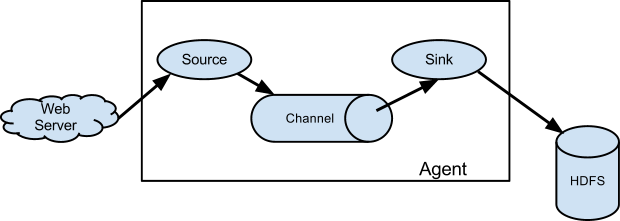
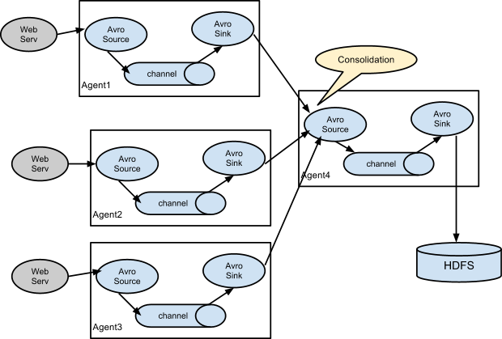

# 中文手册
[1.8](https://flume.liyifeng.org)

# 数据流模型

Source消耗由外部（如Web服务器）传递给它的Event。外部以Flume Source识别的格式向Flume发送Event。例如，Avro Flume Source可接收从Avro客户端（或其他FlumeSink）接收Avro Event。用Thrift Flume Source也可以实现类似的流程，接收的Event数据可以是任何语言编写的只要符合Thrift协议即可。

当Source接收Event时，它将其存储到一个或多个channel。该channel是一个被动存储器，可以保持Event直到它被Sink消耗。『文件channel』就是一个例子，它由本地文件系统支持。sink从channel中移除Event并将其放入外部存储库（如HDFS，通过 Flume的 HDFS Sink 实现）或将其转发到流中下一个Flume Agent（下一跳）的Flume Source。

Agent中的source和sink与channel存取Event是异步的。

Flume的Source负责消费外部传递给它的数据（比如web服务器的日志）。外部的数据生产方以Flume Source识别的格式向Flume发送Event。

# 复杂流

Flume可以设置多级Agent连接的方式传输Event数据。也支持扇入（多对一）和扇出（一对多）的部署方式，类似于负载均衡方式或多点同时备份的方式。
