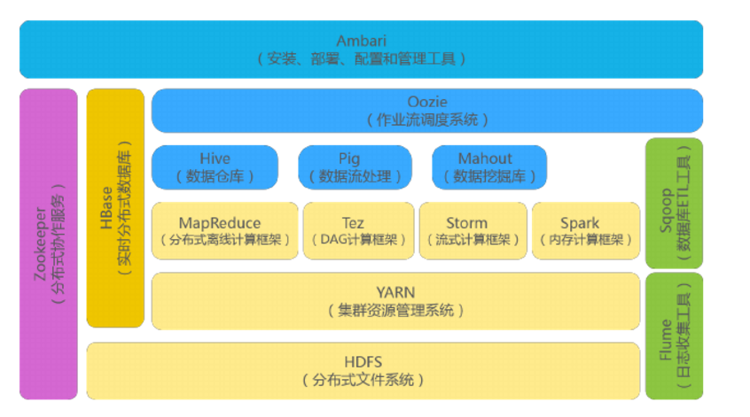
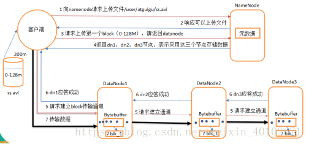
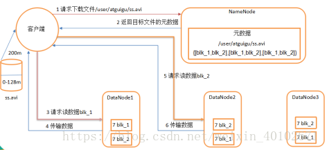

### hadoop的shuffle过程
#### Map端的shuffle
Map端会处理输入数据并产生中间结果，这个中间结果会写到本地磁盘，而不是HDFS。每个Map的输出会先写到内存缓冲区中，当写入的数据达到设定的阈值时，系统将会启动一个线程将缓冲区的数据写到磁盘，这个过程叫做spill。
在spill写入之前，会先进行二次排序，首先根据数据所属的partition进行排序，然后每个partition中的数据再按key来排序。partition的目是将记录划分到不同的Reducer上去，以期望能够达到负载均衡，以后的Reducer就会根据partition来读取自己对应的数据。接着运行combiner(如果设置了的话)，combiner的本质也是一个Reducer，其目的是对将要写入到磁盘上的文件先进行一次处理，这样，写入到磁盘的数据量就会减少。最后将数据写到本地磁盘产生spill文件(spill文件保存在{mapred.local.dir}指定的目录中，Map任务结束后就会被删除)。
最后，每个Map任务可能产生多个spill文件，在每个Map任务完成前，会通过多路归并算法将这些spill文件归并成一个文件。至此，Map的shuffle过程就结束了。

--
#### Reduce端的shuffle
Reduce端的shuffle主要包括三个阶段，copy、sort(merge)和reduce。
首先要将Map端产生的输出文件拷贝到Reduce端，但每个Reducer如何知道自己应该处理哪些数据呢？因为Map端进行partition的时候，实际上就相当于指定了每个Reducer要处理的数据(partition就对应了Reducer)，所以Reducer在拷贝数据的时候只需拷贝与自己对应的partition中的数据即可。每个Reducer会处理一个或者多个partition，但需要先将自己对应的partition中的数据从每个Map的输出结果中拷贝过来。
接下来就是sort阶段，也成为merge阶段，因为这个阶段的主要工作是执行了归并排序。从Map端拷贝到Reduce端的数据都是有序的，所以很适合归并排序。最终在Reduce端生成一个较大的文件作为Reduce的输入。
最后就是Reduce过程了，在这个过程中产生了最终的输出结果，并将其写到HDFS上。

---
### HDFS读写数据的过程
#### 读
1 跟namenode通信查询元数据，找到文件块所在的datanode服务器
2 挑选一台datanode（就近原则，然后随机）服务器，请求建立socket流
3 datanode开始发送数据（从磁盘里面读取数据放入流，以packet为单位来做校验）
4 客户端以packet为单位接收，现在本地缓存，然后写入目标文件
#### 写
1 根namenode通信请求上传文件，namenode检查目标文件是否已存在，父目录是否存在
2 namenode返回是否可以上传
3 client请求第一个 block该传输到哪些datanode服务器上
4 namenode返回3个datanode服务器ABC
5 client请求3台dn中的一台A上传数据（本质上是一个RPC调用，建立pipeline），A收到请求会继续调用B，然后B调用C，将真个pipeline建立完成，逐级返回客户端
6 client开始往A上传第一个block（先从磁盘读取数据放到一个本地内存缓存），以packet为单位，A收到一个packet就会传给B，B传给C；A每传一个packet会放入一个应答队列等待应答
7 当一个block传输完成之后，client再次请求namenode上传第二个block的服务器。

---
### hadoop生态组件


---
### hdfs fsimage和edit的区别
  大家都知道namenode与secondary namenode 的关系，当他们要进行数据同步时叫做checkpoint时就用到了fsimage与edit。
- 概念：
fsimage保存了最新的元数据检查点。
edits保存自最新检查点后的命名空间的变化。
- 工作原理：
从最新检查点后，hadoop将对每个文件的操作都保存在edits中，为避免edits不断增大，secondary namenode就会周期性合并fsimage和edits成新的fsimage，edits再记录新的变化。
这种机制有个问题：因edits存放在Namenode中，当Namenode挂掉，edits也会丢失，导致利用secondary namenode恢复Namenode时，会有部分数据丢失。

---
### 列举hadoop几个配置文件优化？ --发挥
  1）Core-site.xml 文件的优化
    a、fs.trash.interval，默认值： 0；说明： 这个是开启hdfs文件删除自动转移到垃圾箱的选项，值为垃圾箱文件清除时间。一般开启这个会比较好，以防错误删除重要文件。单位是分钟。
    b、dfs.namenode.handler.count，默认值：10；说明：hadoop系统里启动的任务线程数，这里改为40，同样可以尝试该值大小对效率的影响变化进行最合适的值的设定。
    c、mapreduce.tasktracker.http.threads，默认值：40；说明：map和reduce是通过http进行数据传输的，这个是设置传输的并行线程数。

---
### datanode 首次加入 cluster 的时候，如果 log 报告不兼容文件版本，那需要namenode 执行格式化操作，这样处理的原因是？
  1）这样处理是不合理的，因为那么 namenode 格式化操作，是对文件系统进行格式化，namenode 格式化时清空 dfs/name 下空两个目录下的所有文件，之后，会在目录 dfs.name.dir 下创建文件。
  2）文本不兼容，有可能时 namenode 与 datanode 的 数据里的 namespaceID、clusterID 不一致，找到两个 ID 位置，修改为一样即可解决。

---
### MapReduce 中排序发生在哪几个阶段？这些排序是否可以避免？为什么？
  1）一个 MapReduce 作业由 Map 阶段和 Reduce 阶段两部分组成，这两阶段会对数据排序，从这个意义上说，MapReduce 框架本质就是一个 Distributed Sort。
  2）在 Map 阶段，Map Task 会在本地磁盘输出一个按照 key 排序（采用的是快速排序）的文件（中间可能产生多个文件，但最终会合并成一个），在 Reduce 阶段，每个 Reduce Task 会对收到的数据排序，这样，数据便按照 Key 分成了若干组，之后以组为单位交给 reduce（）处理。
  3）很多人的误解在 Map 阶段，如果不使用 Combiner便不会排序，这是错误的，不管你用不用 Combiner，Map Task 均会对产生的数据排序（如果没有 Reduce Task，则不会排序，实际上 Map 阶段的排序就是为了减轻 Reduce端排序负载）。
  4）由于这些排序是 MapReduce 自动完成的，用户无法控制，因此，在hadoop 1.x 中无法避免，也不可以关闭，但 hadoop2.x 是可以关闭的。

---
### hadoop的优化？
  1）优化的思路可以从配置文件和系统以及代码的设计思路来优化
  2）配置文件的优化：调节适当的参数，在调参数时要进行测试
  3）代码的优化：combiner的个数尽量与reduce的个数相同，数据的类型保持一致，可以减少拆包与封包的进度
  4）系统的优化：可以设置linux系统打开最大的文件数预计网络的带宽MTU的配置
  5）为 job 添加一个 Combiner，可以大大的减少shuffer阶段的maoTask拷贝过来给远程的   reduce task的数据量，一般而言combiner与reduce相同。
  6）在开发中尽量使用stringBuffer而不是string，string的模式是read-only的，如果对它进行修改，会产生临时的对象，二stringBuffer是可修改的，不会产生临时对象。
  7）修改一下配置：以下是修改 mapred-site.xml 文件
    a、修改最大槽位数：槽位数是在各个 tasktracker 上的 mapred-site.xml 上设置的，默认都是 2

```<property>
<name>mapred.tasktracker.map.tasks.maximum</name>
<value>2</value>
</property>
<property>
<name>mapred.tasktracker.reduce.tasks.maximum</name>
<value>2</value>
</property>

```    
b、调整心跳间隔：集群规模小于 300 时，心跳间隔为 300 毫秒
mapreduce.jobtracker.heartbeat.interval.min 心跳时间
mapred.heartbeats.in.second 集群每增加多少节点，时间增加下面的值
mapreduce.jobtracker.heartbeat.scaling.factor 集群每增加上面的个数，心跳增多少
    c、启动带外心跳
mapreduce.tasktracker.outofband.heartbeat 默认是 false
    d、配置多块磁盘
mapreduce.local.dir
    e、配置 RPC hander 数目
mapred.job.tracker.handler.count 默认是 10，可以改成 50，根据机器的能力
    f、配置 HTTP 线程数目
tasktracker.http.threads 默认是 40，可以改成 100 根据机器的能力
    g、选择合适的压缩方式，以 snappy 为例：

```
<property>
<name>mapred.compress.map.output</name>
<value>true</value>
</property>
<property>
<name>mapred.map.output.compression.codec</name>
<value>org.apache.hadoop.io.compress.SnappyCodec</value>
</property>
```
---

### hdfs写文件的步骤

(1)client向NameNode申请上传…/xxx.txt文件

(2)NN向client响应可以上传文件

(3)Client向NameNode申请DataNode

(4)NN向Client返回DN1,DN2,DN3

(5)Client向DN1,DN2,DN3申请建立文件传输通道

(6)DN3,DN2,DN1依次响应连接

(7)Client向DN1上传一个block，DN1向DN2,DN3冗余文件


---
### hdfs读取文件步骤

(1)client向NN请求下载…/xxx.txt文件

(2)NN向client返回文件的元数据

(3)Client向DN1请求访问读数据blk_1

(4)DN1向Client传输数据

(5)Client向DN2请求访问读数据blk_2

(6)DN2向Client传输数据


---
### 简单说一下hadoop的map-reduce模型

首先map task会从本地文件系统读取数据，转换成key-value形式的键值对集合，使用的是hadoop内置的数据类型，如Text，Longwritable等。

将键值对集合输入mapper进行业务处理过程，将其转化成需要的key-value再输出。

之后会进行一个partition分区操作，默认使用的是hashpartitioner，可以通过重写hashpartitioner的getPartition方法来自定义分区规则。

之后会对key进行sort排序，grouping分组操作将相同key的value合并分组输出，在这里可以使用自定义的数据类型，重写WritableComparator的Comparator方法来自定义排序规则，重写RawComparator的compara方法来自定义分组规则。

之后进行一个combiner归约操作，就是一个本地的reduce预处理，以减小shuffle，reducer的工作量。

Reduce task会用过网络将各个数据收集进行reduce处理，最后将数据保存或者显示，结束整个job。

---
### 运行hadoop集群需要哪些守护进程？

DataNode,NameNode,TaskTracker和JobTracker都是运行Hadoop集群需要的守护进程。

---
### hadoop的TextInputFormat作用是什么，如何自定义实现？

InputFormat会在map操作之前对数据进行两方面的预处理。

1. 是getSplits，返回的是InputSplit数组，对数据进行Split分片，每片交给map操作一次。

2. 是getRecordReader，返回的是RecordReader对象，对每个Split分片进行转换为key-value键值对格式传递给map常用的InputFormat是TextInputFormat，使用的是LineRecordReader对每个分片进行键值对的转换，以行偏移量作为键，行内容作为值。

自定义类继承InputFormat接口，重写createRecordReader和isSplitable方法在createRecordReader中可以自定义分隔符。

---
### 为什么要用flume导入hdfs，hdfs的架构是怎样的？

Flume可以实时的导入数据到hdfs中，当hdfs上的文件达到一个指定大小的时候会形成一个文件，或者超时所指定时间的话也形成一个文件。

文件都是存储在datanode上的，namenode存储着datanode的元数据信息，而namenode的元数据信息是存在内存中的，所以当文件切片很小或者很多的时候会卡死。

---
### MR程序运行的时候会有什么比较常见的问题

比如说作业中大部分都完成了，但是总有几个reduce一直在运行。

这是因为这几个reduce中的处理的数据要远远大于其他的reduce，可能是对键值对任务划分的不均匀造成的数据倾斜。

解决的方法可以在分区的时候重新定义分区规则对于value数据很多的key可以进行拆分、均匀打散等处理，或者是在map端的combiner中进行数据预处理的操作。

---
### hdfs上传文件的流程。

这里描述的 是一个256M的文件上传过程

1. 由客户端 向 NameNode节点节点 发出请求

1. NameNode 向Client返回可以可以存数据的 DataNode 这里遵循机架感应原则

1. 客户端 首先 根据返回的信息 先将 文件分块（Hadoop2.X版本 每一个block为 128M 而之前的版本为 64M

1. 然后通过那么Node返回的DataNode信息 直接发送给DataNode 并且是 流式写入  同时 会复制到其他两台机器

1. dataNode 向 Client通信 表示已经传完 数据块 同时向NameNode报告 ⑥依照上面（④到⑤）的原理将 所有的数据块都上传结束 向 NameNode 报告 表明 已经传完所有的数据块 。

--- 
### 讲述一下mapreduce的流程（shuffle的sort，partitions，group）

首先是 Mapreduce经过SplitInput 输入分片 决定map的个数在用Record记录 key value。然后分为以下三个流程：

#### Map：

输入  key（long类型偏移量）  value（Text一行字符串）

输出  key value

Shuffle：、

   合并（merge）map输出时先输出到环形内存，当内存使用率达到60%时开始溢出写入到文件，溢出文件都是小文件，所以就要合并他们，在这个构成中就会排序，根据key值比较排序

   排序（sort）如果你自定义了key的数据类型要求你的类一定是WriteableCompartor的子类，不想继承WriteableCompartor，至少实现Writeable，这时你就必须在job上设置排序比较器job.setSortCmpartorClass(MyCompartor.class);而MyCompartor.class必须继承RawCompartor的类或子类

   分区（partition）会根据map输出的结果分成几个文件为reduce准备，有几个reducetask就分成几个文件，在job上设置分区器job.setPartitionerClass(MyPartition.class)Myrtition.class要继承Partitioner这个类

   分组（group）分区时会调用分组器，把同一分区中的相同key的数据对应的value制作成一个iterable，并且会在sort。在job上设置分组器。Job.setGroupCompartorClass(MyGroup.class)MyGroup.class必须继承RawCompartor的类跟子类

上面的结果储存到本地文件中，而不是hdfs上

上面只要有完成结果，reduce就开始复制上面的结果，通过http方式

#### Reduce

  输入key时map输出时的key value是分组器分的iterable

  输出 key value

  输出结果保存在hdfs上而不是本地文件中
  
---
### 说一下你对hadoop生态圈的认识。

没有固定答案，主要从hdfs底层存储，hbase数据库，hive数据仓库，flume收集，Kafka缓存，zookeeper分布式协调服务，spark大数据分析，sqoop数据互转来说。

---
### yarn的理解

YARN是Hadoop2.0版本引进的资源管理系统，直接从MR1演化而来。 
核心思想：将MR1中的JobTracker的资源管理和作业调度两个功能分开，分别由ResourceManager和ApplicationMaster进程实现。

ResourceManager：负责整个集群的资源管理和调度 ApplicationMaster：负责应用程序相关事务，比如任务调度、任务监控和容错等。 YARN的出现，使得多个计算框架可以运行在同一个集群之中。 1. 每一个应用程序对应一个ApplicationMaster。 2. 目前可以支持多种计算框架运行在YARN上面，比如MapReduce、storm、Spark、Flink。
