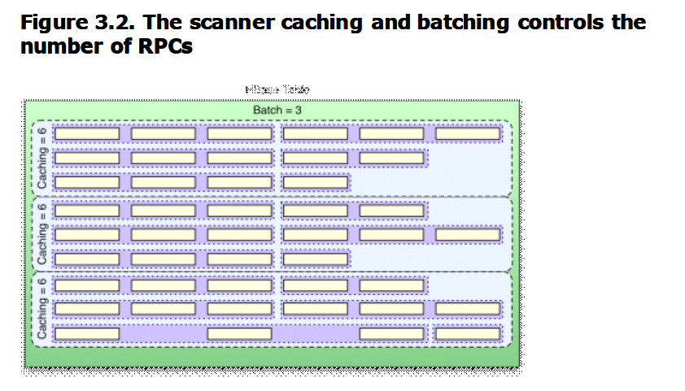

###Hbase行键列族的概念，物理模型，表的设计原则？

行键：rowkey，是hbase表自带的，每个行键对应一条数据。

列族：是创建表时指定的，为列的集合，**每个列族作为一个文件单独存储**，存储的数据都是字节数组，其中数据可以有很多，通过时间戳来区分。

物理模型：整个hbase表会拆分成多个region，每个region记录着行键的起始点保存在不同的节点上，查询时就是对各个节点的并行查询，当region很大时使用.META表存储各个region的起始点，-ROOT又可以存储.META的起始点。

Rowkey的设计原则：各个列族数据平衡，长度原则、相邻原则，创建表的时候设置表放入regionserver缓存中，避免自动增长和时间，使用字节数组代替string，最大长度64kb，最好16字节以内，按天分表，两个字节散列，四个字节存储时分毫秒。

列族的设计原则：尽可能少(按照列族进行存储，按照region进行读取，不必要的io操作)，经常和不经常使用的两类数据放入不同列族中，列族名字尽可能短。

---
###hadoop集群中需要启动 哪些进程，他们的作用
* namenode：负责管理hdfs中文件块的元数据，响应客户端请求，管理datanode上文件block的均衡，维持副本数量
* Secondname:主要负责做checkpoint操作；也可以做冷备，对一定范围内数据做快照性备份。
* Datanode:存储数据块，负责客户端对数据块的io请求
* Jobtracker :管理任务，并将任务分配给 tasktracker。
* Tasktracker: 执行JobTracker分配的任务。
* 还有Resourcemanager、Nodemanager、Journalnode、Zookeeper、Zkfc

---
###HBase简单读写流程
####读
找到要读数据的region所在的RegionServer，然后按照以下顺序进行读取：先去BlockCache读取，若BlockCache没有，则到Memstore读取，若Memstore中没有，则到HFile中去读。
####写
找到要写数据的region所在的RegionServer，然后先将数据写到WAL(Write-Ahead Logging，预写日志系统)中，然后再将数据写到Memstore等待刷新，回复客户端写入完成。

---
###HBase的特点是什么

1. hbase是一个分布式的基于列式存储的数据库，基于hadoop的HDFS存储，zookeeper进行管理。
2. hbase适合存储半结构化或非结构化数据，例如数据结构字段不够确定或者杂乱无章很难按一个概念去抽取的数据。
3. hbase为null的记录不会被存储。
4. 基本的字段包括rowkey，时间戳和列族。新写入数据时，时间戳更新，同时可以查询到以前的版本。
5. hbase是主从结构。Hmaster作为主节点，hRegionServer作为从节点。

---
###Hbase中region太小和region太大带来的结果

Region过大会发生多次compaction，将数据读一遍并写一遍到hdfs上，占用io，region过小会造成多次split，region会下线，影响访问服务，调整hbase.heregion.max.filesize为256m。

---
###每天百亿数据存入HBase，如何保证数据的存储正确和在规定的时间里全部录入完毕，不残留数据
答：看到这个题目的时候我们要思考的是它在考查什么知识点？
我们来看看要求：
1. 百亿数据：证明数据量非常大
2. 存入HBase：证明是跟HBase的写入数据有关
3. 保证数据的正确：要设计正确的数据结构保证正确性
4. 在规定时间内完成：对存入速度是有要求的

那么针对以上的四个问题我们来一一分析
1. 数据量百亿条，什么概念呢？假设一整天60x60x24 = 86400秒都在写入数据，那么每秒的写入条数高达100万条，HBase当然是支持不了每秒百万条数据的，所以这百亿条数据可能不是通过实时地写入，而是批量地导入。批量导入推荐使用BulkLoad方式（推荐阅读：Spark之读写HBase），性能是普通写入方式几倍以上
2. 存入HBase：普通写入是用JavaAPI put来实现，批量导入推荐使用BulkLoad
3. 保证数据的正确：这里需要考虑RowKey的设计、预建分区和列族设计等问题
4. 在规定时间内完成也就是存入速度不能过慢，并且当然是越快越好，使用BulkLoad

---
###HBase 如何给WEB前端提供接口来访问？
答：使用JavaAPI来编写WEB应用；使用HBase提供的RESTful接口

---
###HBase优化方法
优化手段主要有以下四个方面
1. 减少调整
减少调整这个如何理解呢？HBase中有几个内容会动态调整，如region（分区）、HFile，所以通过一些方法来减少这些会带来I/O开销的调整
    - Region
    如果没有预建分区的话，那么随着region中条数的增加，region会进行分裂，这将增加I/O开销，所以解决方法就是根据你的RowKey设计来进行预建分区，减少region的动态分裂
    - HFile
    HFile是数据底层存储文件，在每个memstore进行刷新时会生成一个HFile，当HFile增加到一定程度时，会将属于一个region的HFile进行合并，这个步骤会带来开销但不可避免，但是合并后HFile大小如果大于设定的值，那么HFile会重新分裂。为了减少这样的无谓的I/O开销，建议估计项目数据量大小，给HFile设定一个合适的值

2. 减少启停
数据库事务机制就是为了更好地实现批量写入，较少数据库的开启关闭带来的开销，那么HBase中也存在频繁开启关闭带来的问题。
    - 关闭Compaction，在闲时进行手动Compaction
因为HBase中存在Minor Compaction和Major Compaction，也就是对HFile进行合并，所谓合并就是I/O读写，大量的HFile进行肯定会带来I/O开销，甚至是I/O风暴，所以为了避免这种不受控制的意外发生，建议关闭自动Compaction，在闲时进行compaction
    - 批量数据写入时采用BulkLoad
如果通过HBase-Shell或者JavaAPI的put来实现大量数据的写入，那么性能差是肯定并且还可能带来一些意想不到的问题，所以当需要写入大量离线数据时建议使用BulkLoad

3. 减少数据量
虽然我们是在进行大数据开发，但是如果可以通过某些方式在保证数据准确性同时减少数据量，何乐而不为呢？

    - 开启过滤，提高查询速度
开启BloomFilter，BloomFilter是列族级别的过滤，在生成一个StoreFile同时会生成一个MetaBlock，用于查询时过滤数据
    - 使用压缩：一般推荐使用Snappy和LZO压缩

4. 合理设计
在一张HBase表格中RowKey和ColumnFamily的设计是非常重要，好的设计能够提高性能和保证数据的准确性


    - RowKey设计：应该具备以下几个属性

        - 散列性：散列性能够保证相同相似的rowkey聚合，相异的rowkey分散，有利于查询
        - 简短性：rowkey作为key的一部分存储在HFile中，如果为了可读性将rowKey设计得过长，那么将会增加存储压力
        - 唯一性：rowKey必须具备明显的区别性

        - 业务性：举些例子
            - 假如我的查询条件比较多，而且不是针对列的条件，那么rowKey的设计就应该支持多条件查询
            - 如果我的查询要求是最近插入的数据优先，那么rowKey则可以采用叫上Long.Max-时间戳的方式，这样rowKey就是递减排列


    - 列族的设计
列族的设计需要看应用场景
        - 多列族设计的优劣
            - 优势：HBase中数据时按列进行存储的，那么查询某一列族的某一列时就不需要全盘扫描，只需要扫描某一列族，减少了读I/O；其实多列族设计对减少的作用不是很明显，适用于读多写少的场景


            - 劣势：降低了写的I/O性能。原因如下：数据写到store以后是先缓存在memstore中，同一个region中存在多个列族则存在多个store，每个store都一个memstore，当其实memstore进行flush时，属于同一个region
的store中的memstore都会进行flush，增加I/O开销

---


###HBase中RowFilter和BloomFilter原理
####RowFilter原理简析
RowFilter顾名思义就是对rowkey进行过滤，那么rowkey的过滤无非就是相等（EQUAL）、大于(GREATER)、小于(LESS)，大于等于(GREATER_OR_EQUAL)，小于等于(LESS_OR_EQUAL)和不等于(NOT_EQUAL)几种过滤方式。Hbase中的RowFilter采用比较符结合比较器的方式来进行过滤。

比较器的类型如下：
* BinaryComparator
* BinaryPrefixComparator
* NullComparator
* BitComparator
* RegexStringComparator
* SubStringComparator

例子：
```java
Filter rowFilter = new RowFilter(CompareFilter.CompareOp.EQUAL,
new BinaryComparator(Bytes.toBytes(rowKeyValue)));
Scan scan = new Scan();
scan.setFilter(rowFilter)

```
在上面例子中，比较符为EQUAL，比较器为BinaryComparator
####BloomFilter（布隆过滤器）原理简析

* 主要功能：提供**随机读**的性能
* 存储开销：BloomFilter是列族级别的配置，一旦表格中开启BloomFilter，那么在生成StoreFile时同时会生成一份包含BloomFilter结构的文件MetaBlock，所以会增加一定的存储开销和内存开销
* 粒度控制：ROW和ROWCOL
* 设置：在**建表时**对某一列设置BloomFilter即可

#####BloomFilter的原理
内部是一个bit数组，初始值均为0
插入元素时对元素进行hash并且映射到数组中的某一个index，将其置为1，再进行多次不同的hash算法，将映射到的index置为1，同一个index只需要置1次。
查询时使用跟插入时相同的hash算法，如果在对应的index的值都为1，那么就可以认为该元素**可能**存在，注意，只是可能存在
所以BlomFilter**只能保证过滤掉不包含的元素，而不能保证包含**

---
###HBase的导入导出方式

####导入

```shell
bin/hbase org.apache.hadoop.hbase.mapreduce.Driver import 表名 路径

```
|路径|来源|
| --- | --- |
|本地路径|file:///path|
|HDFS|hdfs://cluster1/path|
####导出
```shell
bin/hbase org.apache.hadoop.hbase.mapreduce.Driver export 表名 路径
```
|路径|目的地|
| --- | --- |
|本地路径|file:///path|
|HDFS|hdfs://cluster1/path|
---

###Region如何预建分区
预建分区的方法很简单，有以下两种
- hbase shell

    ```shell
    create 't1', 'f1',SPLITS=>['10','20','30']
    create 't1','f1',SPLITS_FILE =>'splits.txt'
    ```
- Java API

    ```java
    //创建一个byte[][] 
    splitKeys = {{1,2,3},{4,5,6}}
    admin.createTable(tableDesc,splitKeys)
    ```

预建分区的难点在于**key如何设计，分多少个和如何分**的问题，那么下面我们就对这三个问题一一分析：
1. 如何设计Key，我们设计Key的原则就是要让Key**足够散列**，但同时又要保持Key的**长度适中**，这里给出一个方法，样本取自Spark读写HBase中的数据
01055HAXMTXG10100001@KEY_VOLTAGE_TEC_PWR@1.60@1.62@1.75@1.55
我想要的rowKey是：01055HAXMTXG10100001KEY_VOLTAGE_TEC_PWR
但是很明显这样肯定是不会足够散列的，那么我们可以对上面那个Key进行MD5，然后取前面三个字符（为了更加散列，可以取1,3,5或者其他组合）再加上原来的Key

    ```java
    DigestUtils.md5Hex(x(0)+x(1)).substring(0,3)+x(0)+x(1)
    ```
这样的话我们就可以得到足够散列的数据，并且MD5取得的是十六进制字符串，那么Key的范围就是（0,0,0）至（f，f，f）
1. 分多少个：这个需要我们根据我们集群规模来进行安排，假设我们有5个regionServer，每个regionServer有20个region，那么总共就是100个region，最后的工作就是将000-fff分成100份。
1. 如何分：就是生成一个byte[ ][ ]，用于创建表格，这个我将会些一篇另外的博文来介绍，敬请期待
---

###HRegionServer宕机如何处理？
1. ZooKeeper会监控HRegionServer的上下线情况，当ZK发现某个HRegionServer宕机之后会通知HMaster进行失效备援；
2. 该HRegionServer会停止对外提供服务，就是它所负责的region暂时停止对外提供服务
3. HMaster会将该HRegionServer所负责的region转移到其他HRegionServer上，并且会对HRegionServer上存在memstore中还未持久化到磁盘中的数据进行恢复
4. 这个恢复的工作是由**WAL重播**来完成，这个过程如下：
    * wal实际上就是一个文件，存在/hbase/WAL/对应RegionServer路径下
    * 宕机发生时，读取该RegionServer所对应的路径下的wal文件，然后根据不同的region切分成不同的临时文件recover.edits
    * 当region被分配到新的RegionServer中，RegionServer读取region时会判断是否存在recover.edits，如果有则进行恢复
---

###HBase简单读写流程
####读
找到要读取数据的region所在的RegionServer，然后按照以下顺序进行读取：先去BlockCache读取，若BlockCache没有，则到Memstore读取，若MemStore中没有，则到HFile中读取。
####写
找到要写入数据的region所在的RegionServer，然后将数据**先写到WAL**中，然后**再将数据写到MemStore**等待刷新，回复客户端写入完成。

---
###HBase和Hive的区别
Hive和Hbase是两种基于Hadoop的不同技术。
* Hive是一种类SQL 的引擎，并且运行MapReduce 任务。
* Hbase 是一种在Hadoop之上的NoSQL的Key/value数据库。

当然，这两种工具是可以同时使用的。就像用Google来搜索，用FaceBook进行社交一样，Hive可以用来进行统计查询，HBase可以用来进行实时查询，数据也可以从Hive写到Hbase，设置再从Hbase写回Hive。
####Hive概述
Hive是一个构建在Hadoop基础之上的数据仓库。通过Hive可以使用HQL语言查询存放在HDFS上的数据。
HQL是一种类SQL语言，这种语言最终被转化为Map/Reduce. 虽然Hive提供了SQL查询功能，但是Hive不能够进行交互查询，因为它只能够在Haoop上批量的执行Hadoop。
Hive被分区为表格，表格又被进一步分割为列簇。列簇必须使用schema 定义，列簇将某一类型列集合起来（列不要求schema定义）。
- 限制 ：
    - **Hive目前不支持更新操作**。
    - 由于hive在hadoop上运行批量操作，它需要花费很长的时间，通常是几分钟到几个小时才可以获取到查询的结果。
    - Hive必须提供预先定义好的schema将文件和目录映射到列。
    - Hive与ACID不兼容。
- 应用场景
    - Hive适合用来对一段时间内的数据进行分析查询，例如，用来计算趋势或者网站的日志。
    - Hive不应该用来进行实时的查询。因为它需要很长时间才可以返回结果。
    
####Hbase概述
HBase通过存储key/value来工作，它运行在HDFS之上。它支持四种主要的操作：增加或者更新行，查看一个范围内的cell，获取指定的行，删除指定的行、列或者是列的版本。版本信息用来获取历史数据（每一行的历史数据可以被删除，然后通过Hbase compactions就可以释放出空间）。虽然HBase包括表格，但是schema仅仅被表格和列簇所要求，列不需要schema。Hbase的表格包括增加/计数功能。和Hive不一样，Hbase能够在它的数据库上**实时**运行，而不是运行MapReduce任务。
- 限制
    - HBase查询是通过特定的语言来编写的，这种语言需要重新学习。
    - 类SQL的功能可以通过Apache Phonenix实现，但这是以必须提供schema为代价的。
    - 另外，Hbase也并不是兼容所有的ACID特性，虽然它支持某些特性。
    - 最后但不是最重要的--为了运行Hbase，Zookeeper是必须的，zookeeper 是一个用来进行分布式协调的服务，这些服务包括配置服务，维护元信息和命名空间服务。
- 应用场景
Hbase非常适合用来进行大数据的实时查询。Facebook用Hbase进行消息和实时的分析。它也可以用来统计Facebook的连接数。

####主要区别

||HBase|Hive|
| --- | --- | --- |
|类型|列式数据库|数据仓库
|内部机制|数据库引擎|MapReduce
|增删改查|都支持|只支持导入和查询
|Schema|只需要预先定义列族，不需要具体到列列可以动态修改|需要预先定义表格
|应用场景|实时|离线处理
|特点|以K-V形式存储|类SQL

---
###HBase首次读写流程

1. Client从ZooKeeper中读取hbase:meta表
2. Client从hbase:meta中获取想要操作的region的位置信息，并且将hbase:meta缓存在Client端，用于后续的操作
3. 当一个RegionServer宕机而执行重定位之后，Client需要重新获取新的hase:meta信息进行缓存

---
###HBase搭建过程中需要注意什么？
####hbase-env.sh的配置
是否使用外部ZooKeeper，这个一般使用Hadoop集群的ZooKeeper集群即可。
> HBASE_MANAGES_ZK=false

####hbase-site.sh的配置

> hbase.zookeeper.quorum="host1:2181,host2:2181"

---
###Hbase的rowKey的设计原则

####Rowkey长度原则
Rowkey是一个二进制码流，Rowkey的长度被很多开发者建议说设计在10~100 个字节，
不过建议是越短越好，不要超过16 个字节。
原因如下：
1. 数据的持久化文件HFile 中是按照KeyValue 存储的，如果Rowkey 过长比如100 个字节，1000 万列数据光Rowkey 就要占用100*1000 万=10 亿个字节，将近1G 数据，这会极大影响HFile 的存储效率。
2. MemStore 将缓存部分数据到内存，如果Rowkey 字段过长内存的有效利用率会降低，系统将无法缓存更多的数据，这会降低检索效率。因此Rowkey 的字节长度越短越好。
3. 目前操作系统是都是64 位系统，内存8 字节对齐。控制在16 个字节，**8 字节的整数倍**利用操作系统的最佳特性。

####Rowkey散列原则
如果Rowkey 是按时间戳的方式递增，**不要将时间放在rowkey 的前面**，建议将Rowkey
的高位作为散列字段，由程序循环生成，低位放时间字段，这样将提高数据均衡分布在每个Regionserver 实现负载均衡的几率。如果没有散列字段，首字段直接是时间信息将产生所有新数据都在一个RegionServer 上堆积的热点现象，这样在做数据检索的时候负载将会集中在个别RegionServer，降低查询效率。

####Rowkey唯一原则
必须在设计上保证其唯一性。

---
###Hbase中scan和get的功能以及实现的异同
HBase的查询实现只提供两种方式：
1. 按指定RowKey 获取唯一一条记录，get方法（org.apache.hadoop.hbase.client.Get）
Get 的方法处理分两种 : 设置了ClosestRowBefore 和没有设置的rowlock。主要是用来保证行的事务性，即每个get 是以一个row 来标记的。一个row中可以有很多family 和column。
2. 按指定的条件获取一批记录，scan方法(org.apache.Hadoop.hbase.client.Scan）实现条件查询功能使用的就是scan 方式。
    1. scan 可以通过setCaching 与setBatch 方法提高速度(以空间换时间)。
    2. scan 可以通过setStartRow 与setEndRow 来限定范围([start，end)start 是闭区间，end 是开区间)。范围越小，性能越高。
    4. scan 可以通过setFilter 方法添加过滤器，这也是分页、多条件查询的基础。

---
###Hbase中scan对象的setCache和setBatch 方法的使用


setCaching设置的值为每次rpc的请求记录数，默认是1；cache大可以优化性能，但是太大了会花费很长的时间进行一次传输。

setBatch设置每次取的column size；有些row特别大，所以需要分开传给client，就是一次传一个row的几个column。

batch和caching和hbase table column size共同决意了rpc的次数。

通过下表可以看出caching/batch/rpc次数的关系：
10 rows， 2 families， 10column per family，total：200 cell

|缓存|批量处理|Result个数|RPC次数|说明|
| --- | --- | --- | --- | --- |
|1|1|200|201|每个列都作为一个Result实例返回。<br>最后还多一个RPC确认扫描完成|
|200|1|200|2|每个Result实例都只包含一列的值，<br>不过它们都被一次RPC请求取回|
|2|10|20|11|批量参数是一行所包含的列数的一半，<br>所以200列除以10，需要20个result实例。<br>同时需要10次RPC请求取回。|
|5|100|10|3|对一行来讲，这个批量参数实在是太大了，<br>所以一行的20列都被放入到了一个Result<br>实例中。同时缓存为5，所以10个Result<br>实例被两次RPC请求取回。|
|5|20|10|3|同上，不过这次的批量值与一行列数正好<br>相同，所以输出与上面一种情况相同|
|10|10|20|3|这次把表分成了较小的result实例，<br>但使用了较大的缓存值，所以也是只用了<br>两次RPC请求就返回了数据|
要计算一次扫描操作的RPC请求的次数，用户需要先计算出行数和每行列数的乘积。然后用这个值除以批量大小和每行列数中较小的那个值。最后再用除得的结果除以扫描器缓存值。
用数学公式表示如下:

> RPC请求的次数=(行数x每行的列数)/Min(每行的列数，批量大小)/扫描器缓存

此外，还需要一些请求来打开和关闭扫描器。用户或许需要把这两次请求也考虑在内。 
下图展示了缓存和批量两个参数如何联动。

小的批量值使服务器端把3个列装入一个Result实例，同时扫描器缓存为6，使每个RPC请求传输6行，即6个被批量封装的Result实例。如果没有指定批量大小，而是指定了扫描器缓存，那么一个调用结果就能包含所有的行，因为每一行都包含在一个Result实例中。只有当用户使用批量模式后，行内(intra-row)扫描功能才会启用。

---
###Hbase中Cell 的结构

HBase 中通过row 和columns 确定的为一个存贮单元称为cell。
Cell是由`{row key, column(= <family> + <label>), version}`唯一确定的单元。cell 中的数
据是没有类型的，全部是字节码形式存储。

---
###以 start-hbase.sh 为起点，Hbase 启动的流程 
start-hbase.sh 的流程如下：
1. 运行 hbase-config.sh
hbase-config.sh的作用：
    1. 装载相关配置，如HBASE_HOME目录，conf目录，regionserver机器列表，JAVA_HOME 目录等，它会调用$HBASE_HOME/conf/hbase-env.sh .
    2. 解析参数（0.96 版本及以后才可以带唯一参数 autorestart，作用就是重启）
    3. 调用 hbase-daemon.sh 来启动 master.
    4. 调用 hbase-daemons.sh 来启动 regionserver zookeeper master-backup.
2. hbase-env.sh 的作用：
主要是配置 JVM 及其 GC 参数，还可以配置 log 目录及参数，配置是否需要 hbase 管
理 ZK，配置进程 id 目录等.
3. hbase-daemons.sh 的作用：根据需要启动的进程，
如 zookeeper,则调用 zookeepers.sh
如 regionserver，则调用 regionservers.sh
如 master-backup，则调用 master-backup.sh
4. zookeepers.sh 的作用：
如果 hbase-env.sh 中的 HBASE_MANAGES_ZK"="true"，那么通过ZKServerTool这个类解析xml配置文件，获取 ZK 节点列表，然后通过 SSH 向这些节点发送远程命令执行。
5. regionservers.sh 的作用：
与 zookeepers.sh 类似，通过配置文件，获取 regionserver 机器列表，然后 SSH 向这些机器发送远程命令：
6. master-backup.sh 的作用：
通过 backup-masters 这个配置文件，获取 backup-masters 机器列表,然后 SSH 向这些机器发送远程命令。

---
###简述 HBASE中compact用途是什么，什么时候触发，分为哪两种,有什么区别，有哪些相关配置参数？

在hbase中每当有memstore数据flush到磁盘之后，就形成一个storefile，当storeFile的数量达到一定程度后，就需要将 storefile 文件来进行 compaction 操作。
Compact 的作用：
* 合并文件
* 清除过期，多余版本的数据
* 提高读写数据的效率

HBase 中实现了两种 compaction 的方式：minor and major. 这两种 compaction 方式的区别是：
* Minor 操作只用来做部分文件的合并操作以及包括 minVersion=0 并且设置 ttl 的过期版本清理，不做任何删除数据、多版本数据的清理工作。
* Major 操作是对 Region 下的HStore下的所有StoreFile执行合并操作，最终的结果是整理合并出一个文件。