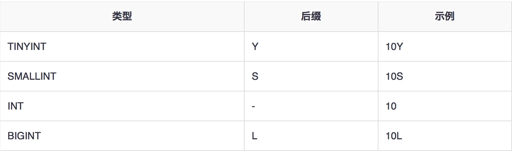

# 面试题

## hive中存放的是什么？

表。

存的是和hdfs的映射关系，hive是逻辑上的数据仓库，实际操作的都是hdfs上的文件，HQL就是用SQL语法来写的MR程序。 

---
## Hive与关系型数据库的关系？

没有关系，hive是数据仓库，不能和数据库一样进行实时的CRUD操作。

是一次写入多次读取的操作，可以看成是ETL的工具。

---
## 请说明hive中Sort By、Order By、Cluster By，Distribute By各代表什么意思？

order by：会对输入做全局排序，因此只有一个reducer（多个reducer无法保证全局有序）。只有一个reducer，会导致当输入规模较大时，需要较长的计算时间。

sort by：不是全局排序，其在数据进入reducer前完成排序。

distribute by：按照指定的字段对数据进行划分输出到不同的reduce中。

cluster by：除了具有 distribute by 的功能外还兼具 sort by 的功能。

# hive操作
## 服务配置
### 单机配置
1. 配置hadoop
2. 配置mysql
3. 配置hive
`cp hive-default.xml.template hive-site.xml`
    1. 头部增加配置
  
        ```xml
        <property>
           <name>system:java.io.tmpdir</name>
           <value>/home/root/hdp/tmpdir</value>
        </property>
         
        <property>
             <name>system:user.name</name>
             <value>hive</value>
        </property>
        ```
    2. mysql配置
    修改以下节点值，配置文件模板里已经配置了，但用的是derby，此处改为mysql
    
    ```xml
            <!-- 插入一下代码 -->
        <property>
            <name>javax.jdo.option.ConnectionUserName</name>
            <value>root</value>
        </property>
        <property>
            <name>javax.jdo.option.ConnectionPassword</name>
            <value>123456</value>
        </property>
       <property>
            <name>javax.jdo.option.ConnectionURL</name>mysql
            <value>jdbc:mysql://192.168.1.68:3306/hive</value>
        </property>
        <property>
            <name>javax.jdo.option.ConnectionDriverName</name>
            <value>com.mysql.jdbc.Driver</value>
        </property>
            <!-- 到此结束代码 -->
    ```
1. 复制mysql的驱动程序到hive/lib下面
2. mysql建hive库
3. 初始化schema
    
    ```
    bin/schematool -dbType mysql -initSchema
    ```
4. 执行hive命令查看结果

### 启动服务
#### 其他机器的hive连
其他机器的hive连本机读取元数据，需要启动metastore
```shell
hive --service metastore
```
如上启动，会启动端口号默认9083的metastore服务，也可以通过-p指定端口号
其他服务器通过配置hive-site.xml来连接此服务器
```xml
    <property>
       <name>hive.metastore.uris</name>
       <!-- 此处是元数据服务器的ip或者host配置 -->
       <value>thrift://metastore_server_ip:9083</value>
    </property>
```

#### 其他类型的服务连
其他类型的服务，如java连hive，需要启动hiveserver2

1. hive-site.xml如1中配置
    hive-site.xml中可以加上是否需要验证的配置，此处设为NONE，暂时不需要验证，测试用。
    
    ```xml
    <property>
        <name>hive.server2.authentication</name>
        <value>NONE</value>
    </property>
    ```

1. hadoop的core-site.xml文件中配置hadoop代理用户

    ```xml
    <property>
        <name>hadoop.proxyuser.root.hosts</name>
        <value>*</value>
    </property>
    <property>
        <name>hadoop.proxyuser.root.groups</name>
        <value>*</value>
    </property>
    ```

1. 启动hiveserver2

    ```shell
    beeline -u jdbc:hive2://localhost:10000
    ```
    hiveserver端口号默认是10000 
    使用beeline通过jdbc连接上之后就可以像client一样操作。
    
    hiveserver2会同时启动一个webui，端口号默认为10002，可以通过http://localhost:10002/访问
    界面中可以看到Session/Query/Software等信息。(此网页只可查看，不可以操作hive数据仓库)

#### 启动hiveWebInterface，通过网页访问hive

hive提供网页GUI来访问Hive数据仓库 
可以通过以下命令启动hwi，默认端口号9999

`hive --service hwi`

**从Hive 2.2.0开始不再支持hwi**

#### 使用HCatalog访问hive

从Hive版本0.11.0开始，hive包含了HCatalog 
HCatalog是基于Apache Hadoop之上的数据表和存储管理服务，支持跨数据处理工具，如Pig，Mapreduce，Streaming，Hive。 
使用HCatalog，则hive的元数据也可以为其他基于Hadoop的工具所使用。无论用户用哪个数据处理工具，通过HCatalog，都可以操作同一个数据。

可以通过以下命令启动HCatalog

`$HIVE_HOME/hcatalog/sbin/hcat_server.sh start`

可以通过以下命令启动HCatalog的cli界面

`$HIVE_HOME/hcatalog/bin/hcat`

另外，HCatalog的WebHCat 也提供一套REST API接口访问hive数据 
可以通过以下命令启动WebHCat

`$HIVE_HOME/hcatalog/sbin/webhcat_server.sh start`

[API接口官网地址](https://cwiki.apache.org/confluence/display/Hive/WebHCat+Reference)


## hql

### 建库
`create database test`

### show

```
show tables;
show databases;
```

### 选择库

`use test`

### 建表

```sql
create table IF NOT EXISTS test (id int,name string)
-- 指定序列化和反序列化的规则
ROW FORMAT DELIMITED
-- 列分隔符
FIELDS TERMINATED BY '\t'
-- 行分隔符
LINES TERMINATED BY '\n'
-- 文件存储格式
STORED AS TEXTFILE;
```

### 插数据
#### insert

```sql
-- 追加数据 从Hive 1.1.0版本，TABLE关键字是可选的
INSERT INTO TABLE test VALUES(1,'ydl')
-- 覆盖数据 注意overwrite语句汇总table关键字不能省略
-- 注意并不是覆盖某一条数据，而是把表或者指定分区全覆盖了
INSERT OVERWRITE TABLE test VALUES(1,'ydl')
```
* INSERT OVERWRITE会覆盖表或分区中已存在的数据
* INSERT INTO以追加数据的方式插入到表或分区，原有数据不会删除
* Insert可以插入表或分区，如果表是分区表，则Insert时需要指定插入到哪个分区
* 从Hive 1.1.0版本，TABLE关键字是可选的
* 从Hive 1.2.0版本，INSERT INTO可以指定插入到哪些字段中，如INSERT INTO t(x,y,z)


#### load data
demo：
```sql
load  data local inpath '/datas/people.json' into table spark_people_json;
```

语法：
```sql
LOAD DATA [LOCAL] INPATH 'filepath' [OVERWRITE] INTO TABLE tablename 
[PARTITION (partcol1=val1,partcol2=val2 ...)]
```

- filepath 可以是： 
    相对路径，如project/data1
    绝对路径，如/user/hive/project/data1
    完整的URL，如hdfs://namenode:9000/user/hive/project/data1
- 目标可以是一个表或是一个分区。如果目标表是分区表，必须指定是要加载到哪个分区。
- filepath 可以是一个文件，也可以是一个目录(会将目录下的所有文件都加载)。
- 如果命令中带LOCAL，表示： 
    - load命令从本地文件系统中加载数据，可以是相对路径，也可以是绝对路径。对于本地文件系统，也可以使用完整的URL，如file:///user/hive/project/data1
    - load命令会根据指定的本地文件系统中的filepath复制文件到目标文件系统，然后再移到对应的表
- 如果命令中没有LOCAL，表示从HDFS加载文件，filepath可以使用完整的URL方式，或者使用fs.default.name定义的值
- 命令带OVERWRITE时加载数据之前会先清空目标表或分区中的内容，否则就是追加的方式。

#### 参考文档
[insert](https://blog.csdn.net/Post_Yuan/article/details/62887619)
[load data](https://blog.csdn.net/post_yuan/article/details/62883565)

### 修改表结构

```sql
-- 重命名表
ALTER TABLE name RENAME TO new_name
-- 添加字段
ALTER TABLE name ADD COLUMNS (col_spec[, col_spec ...])
-- 删除字段
ALTER TABLE name DROP [COLUMN] column_name
-- 修改字段 可修改字段名和字段类型(z)，只能单个字段修改
ALTER TABLE name CHANGE column_name new_name new_type
-- 替换字段 可修改字段名和字段类型，可同时修改多个
ALTER TABLE name REPLACE COLUMNS (col_spec[, col_spec ...])
```

eg:

```sql
-- change改字段名
ALTER TABLE employee CHANGE name ename String;
-- change改字段类型
ALTER TABLE employee CHANGE salary salary Double;
-- replace
ALTER TABLE employee REPLACE COLUMNS ( 
eid INT empid Int, 
ename STRING name String);
-- 加字段
ALTER TABLE employee ADD COLUMNS ( 
dept STRING COMMENT 'Department name');
-- 重命名表
ALTER TABLE employee RENAME TO emp;
```

### 分区
Hive组织表到分区。它是将一个表到基于分区列，如日期，城市和部门的值相关方式。使用分区，很容易对数据进行部分查询。

	表或分区是细分成桶，以提供额外的结构，可以使用更高效的查询的数据。桶的工作是基于表的一些列的散列函数值。
	
语法：
```sql
ALTER TABLE table_name ADD [IF NOT EXISTS] PARTITION partition_spec
[LOCATION 'location1'] partition_spec [LOCATION 'location2'] ...;

partition_spec:
: (p_column = p_col_value, p_column = p_col_value, ...)
```

#### 添加分区

```sql
ALTER TABLE employee
> ADD PARTITION (year=’2012’)
> location '/2012/part2012';
```

#### 修改分区

```sql
ALTER TABLE employee PARTITION (year=’1203’)
RENAME TO PARTITION (Yoj=’1203’);

```
#### 删除分区

```sql
ALTER TABLE employee DROP [IF EXISTS]
PARTITION (year=’2012’);
```

### 视图
#### 创建视图
语法：
```sql
CREATE VIEW [IF NOT EXISTS] view_name [(column_name [COMMENT column_comment], ...) ]
[COMMENT table_comment]
AS SELECT ...
```

eg:
```sql
CREATE VIEW emp_30000 AS
SELECT * FROM employee
WHERE salary>30000;
```

#### 删除视图
`DROP VIEW view_name`

### 索引
#### 创建索引
语法：
```sql
CREATE INDEX index_name
ON TABLE base_table_name (col_name, ...)
AS 'index.handler.class.name'
[WITH DEFERRED REBUILD]
[IDXPROPERTIES (property_name=property_value, ...)]
[IN TABLE index_table_name]
[PARTITIONED BY (col_name, ...)]
[
   [ ROW FORMAT ...] STORED AS ...
   | STORED BY ...
]
[LOCATION hdfs_path]
[TBLPROPERTIES (...)]
```

eg:
```sql
-- 创建一个名为index_salary的索引，对employee 表的salary列索引
CREATE INDEX inedx_salary ON TABLE employee(salary)
AS 'org.apache.hadoop.hive.ql.index.compact.CompactIndexHandler';
```

#### 删除索引
```sql
DROP INDEX index_salary ON employee
```

### top N 查询
使用row_number结合partition by函数
eg:

```sql
select a.* from (select id,num, row_number() over(partition by id order 
by num desc) number from test_json) a where a.number <=2;
```
- 语法：row_number() over (partion by fieldA order by fieldB desc) rank
- 含义：表示根据fieldA分组，在分组内部根据fieldB排序，而row_number() 函数计算的值就表示每组内部排序后的行编号（该编号在组内是连续并且唯一的）。
- rank 在这里是别名，可任意
- partition by：类似于Hive的建表，分区的意思。
- order by ： 排序，默认是升序，加desc降序。

# 加载json数据
## 整条数据是json格式
1. 添加jar包
    将**hive-hcatalog-core.jar**添加到hive的jar目录下，需要注意版本与hive对应，可从maven中央仓库下载
2. 建表并指定序列化格式
    
     ```sql
     create table test_json(id int,num int)
     ROW FORMAT SERDE 'org.apache.hive.hcatalog.data.JsonSerDe';
     ```
     
3. 导入数据测试
    
    ```sql
    load data local inpath '/root/data/json_data' into table test_json;
    ```
    
[参考文档](https://blog.csdn.net/lsr40/article/details/79399166)

### 解决嵌套的json数据
如果是json对象则字段类型使用STRUCT，如果是json数组，则字段类型使用ARRAY
[参考文档](https://blog.csdn.net/weixin_43215250/article/details/93783266)

## 个别字段是json格式
两个hive函数可以处理json字段：
- get_json_object()
    get_json_object函数第一个参数填写json对象变量，第二个参数使用$表示json变量标识，然后用 . 或 [] 读取对象或数组；
    eg:
    ```sql
    select get_json_object('{"shop":{"book":[{"price":43.3,"type":"art"},
    {"price":30,"type":"technology"}],"clothes":
    {"price":19.951,"type":"shirt"}},"name":"jane","age":"23"}', '$.shop.book[0].type') 
    
    -- 如果json简单，可以直接这样使用：
    select get_json_object('{"name":"jack","server":"www.qq.com"}','$.server') 
    ```
    但是问题来了get_json_object**每次只能查一个字段**
    例如：
    
    ```sql
    select get_json_object('{"name":"jack","server":"www.qq.com"}','$.server','$.name')
    ```
    此时只能多写几个get_json_object，比较麻烦，所以json_tuple方法就派上了用场。

- json_tuple()
    eg:
    ```sql
    select json_tuple('{"name":"jack","server":"www.qq.com"}','server','name')
    ```
    但是缺点就是对于复杂的嵌套的json，就操作不了了（就是说使用不了"."，“[]”这种符号来操作json对象），所以看情况选择这两个方法去使用。

# hive数据类型
Hive所有数据类型分为四种类型，给出如下：
## 列类型
### 整型


### 字符串类型


### 时间戳

它支持传统的UNIX时间戳可选纳秒的精度。它支持的java.sql.Timestamp格式“YYYY-MM-DD HH:MM:SS.fffffffff”和格式“YYYY-MM-DD HH:MM:ss.ffffffffff”。

### 日期

DATE值在年/月/日的格式形式描述 {{YYYY-MM-DD}}.

### 小数点

在Hive 小数类型与Java大十进制格式相同。它是用于表示不可改变任意精度。语法和示例如下：

```
DECIMAL(precision, scale)
decimal(10,0)
```

### 联合类型

联合是异类的数据类型的集合。可以使用联合创建的一个实例。语法和示例如下：
UNIONTYPE<int, double, array<string>, struct<a:int,b:string>>

```
{0:1} 
{1:2.0} 
{2:["three","four"]} 
{3:{"a":5,"b":"five"}} 
{2:["six","seven"]} 
{3:{"a":8,"b":"eight"}} 
{0:9} 
{1:10.0}
```

## 文字
### 浮点类型

浮点类型是只不过有小数点的数字。通常，这种类型的数据组成DOUBLE数据类型。

### 十进制类型

十进制数据类型是只不过浮点值范围比DOUBLE数据类型更大。十进制类型的范围大约是 `-10**-308 到 10**308`.

## Null 值
缺少值通过特殊值 - NULL表示。
## 复杂类型
### 数组

在Hive 数组与在Java中使用的方法相同。
`ARRAY<data_type>`

### 映射

映射在Hive类似于Java的映射。
`MAP<primitive_type, data_type>`

### 结构体

在Hive结构体类似于使用复杂的数据。
`STRUCT<col_name : data_type [COMMENT col_comment], ...>`

# java操作hive
https://www.cnblogs.com/takemybreathaway/articles/9750175.html

# 常见错误

## Call to localhost/127.0.0.1:9000 failed on connection exception错误
1. 首先查看hdfs-site.xml配置文件，如下面所示

    ```xml
    <property>
        <name>dfs.namenode.secondary.http-address</name>
        <value>Master:50090</value>
    </property>
    <property>
        <name>dfs.namenode.name.dir</name>
        <value>file:/usr/local/hadoop/tmp/dfs/name</value>
    </property>
    <property>
        <name>dfs.datanode.data.dir</name>
        <value>file:/usr/local/hadoop/tmp/dfs/data</value>
    </property>
    <property>
        <name>dfs.replication</name>
        <value>2</value>
    </property>
    
    ```
1. 将目录/usr/local/hadoop/tmp/dfs/name和/usr/local/hadoop/tmp/dfs/data中的内容清空。
2. 然后执行bin/hadoop namenode -format命令
3. 重启hadoop
4. 问题解决

## 其他用户没有写数据权限
大多是由于hdfs是用root启动的，其他用户没有些文件的权限
通过hdfs命令来修改文件权限
`hadoop dfs -chmod -R 777 /user`