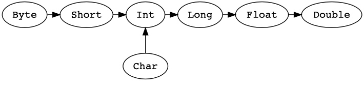

# 面试题
## 基础知识

### Q1  var，val和def三个关键字之间的区别？

var是变量声明关键字，类似于Java中的变量，变量值可以更改，但是变量类型不能更改。
val常量声明关键字。
def 关键字用于创建方法（注意方法和函数的区别）
还有一个lazy val（惰性val）声明，意思是当需要计算时才使用，避免重复计算


代码示例：
```scala
var x = 3 //  x是Int类型
x = 4      // 
x = "error" // 类型变化，编译器报错'error: type mismatch'

val y = 3
y = 4        //常量值不可更改，报错 'error: reassignment to val'

def fun(name: String) = "Hey! My name is: " + name
fun("Scala") // "Hey! My name is: Scala"

//注意scala中函数式编程一切都是表达式
lazy val x = {
  println("computing x")
  3
}
val y = {
  println("computing y")
  10
}
x+x  //
y+y  // x 没有计算, 打印结果"computing y" 
```

### Q2 trait（特质）和abstract class（抽象类）的区别？
（1）一个类只能集成一个抽象类，但是可以通过with关键字继承多个特质；
（2）抽象类有带参数的构造函数，特质不行（如 trait t（i：Int）{} ，这种声明是错误的）


### Q3 object和class的区别？

object是类的单例对象，开发人员无需用new关键字实例化。如果对象的名称和类名相同，这个对象就是伴生对象（深入了解请参考问题Q7）


```scala
//声明一个类
class MyClass(number: Int, text: String) {
  def classMethod() = println(text)
}
//声明一个对象
object MyObject{
  def objectMethod()=println("object")
}
new MyClass(3,"text").classMethod() //打印结果test，需要实例化类
Myclass.classMethod()  //无法直接调用类的方法
MyObject.objectMethod() //打印结果object，对象可以直接调用方法
```

### Q4 case class （样本类）是什么？

样本类是一种不可变且可分解类的语法糖，这个语法糖的意思大概是在构建时，自动实现一些功能。样本类具有以下特性：
（1）自动添加与类名一致的构造函数（这个就是前面提到的伴生对象，通过apply方法实现），即构造对象时，不需要new；
（2）样本类中的参数默认添加val关键字，即参数不能修改；
（3）默认实现了toString，equals，hashcode，copy等方法；
（4）样本类**可以通过==比较两个对象，并且不在构造方法中定义的属性不会用在比较上**。

```scala
//声明一个样本类
case class MyCaseClass(number: Int, text: String, others: List[Int]){
 println(number)
}
//不需要new关键字，创建一个对象
val dto = MyCaseClass(3, "text", List.empty) //打印结果3

//利用样本类默认实现的copy方法
dto.copy(number = 5) //打印结果5

val dto2 = MyCaseClass(3, "text", List.empty)
pringln(dto == dto2) // 返回true，两个不同的引用对象
class MyClass(number: Int, text: String, others: List[Int]) {}
val c1 = new MyClass(1, "txt", List.empty)
val c2 = new MyClass(1, "txt", List.empty)
println(c1 == c2 )// 返回false,两个不同的引用对象,因为不是case class
```

### Q5 Java和Scala 异步计算的区别？


这里作者的意思是他大概也不清楚，请阅读这个 [really clean and simple answer on StackOverflow](https://link.jianshu.com/?t=http://stackoverflow.com/a/31368177/4398050)，我个人理解还不到位后续补上。


### Q6 unapply 和apply方法的区别， 以及各自使用场景？


先讲一个概念——提取器，它实现了构造器相反的效果，构造器从给定的参数创建一个对象，然而提取器却从对象中提取出构造该对象的参数，scala标准库预定义了一些提取器，如上面提到的样本类中，会自动创建一个伴生对象（包含apply和unapply方法）。
为了成为一个提取器，unapply方法需要被伴生对象。
apply方法是为了自动实现样本类的对象，无需new关键字。


### Q7  伴生对象是什么？

前面已经提到过，伴生对象就是与类名相同的对象，伴生对象可以访问类中的私有变量，类也可以访问伴生对象中的私有方法，类似于Java类中的静态方法。伴生对象必须和其对应的类定义在相同的源文件。


```scala
//定义一个类
class MyClass(number: Int, text: String) {

  private val classSecret = 42

  def x = MyClass.objectSecret + "?"  // MyClass.objectSecret->在类中可以访问伴生对象的方法，在类的外部则无法访问
}

//定义一个伴生对象
object MyClass { // 和类名称相同
  private val objectSecret = "42"

  def y(arg: MyClass) = arg.classSecret -1 // arg.classSecret -> 在伴生对象中可以访问类的常量
}

MyClass.objectSecret // 无法访问
MyClass.classSecret // 无法访问

new MyClass(-1, "random").objectSecret // 无法访问
new MyClass(-1, "random").classSecret // 无法访问
```

### Q8 Scala类型系统中Nil, Null, None, Nothing四个类型的区别？

先看一幅Scala类型图


Null是一个trait（特质），是所以引用类型AnyRef的一个子类型，null是Null唯一的实例。
Nothing也是一个trait（特质），是所有类型Any（包括值类型和引用类型）的子类型，它不在有子类型，它也没有实例，实际上为了一个方法抛出异常，通常会设置一个默认返回类型。
Nil代表一个List空类型，等同List[Nothing]
None是Option monad的空标识（深入了解请参考问题Q11）

### Q9 Unit类型是什么？

Unit代表没有任何意义的值类型，类似于java中的void类型，他是anyval的子类型，仅有一个实例对象"( )"


### Q10 call-by-value和call-by-name求值策略的区别？

（1）call-by-value是在调用函数**之前**计算；
（2）call-by-name是在需要时计算


```scala
//声明第一个函数
def func(): Int = {
  println("computing stuff....")
  42 // return something
}
//声明第二个函数，scala默认的求值就是call-by-value
def callByValue(x: Int) = {
  println("1st x: " + x)
  println("2nd x: " + x)
}
//声明第三个函数，用=>表示call-by-name求值
def callByName(x: => Int) = {
  println("1st x: " + x)
  println("2nd x: " + x)
}

//开始调用

//call-by-value求值
callByValue(func())   
//输出结果
//computing stuff....  
//1st x: 42  
//2nd x: 42

//call-by-name求值
callByName(func())   
//输出结果
//computing stuff....  
//1st x: 42  
//此时func会再运行一次
//computing stuff....
//2nd x: 42
```

### Q11 Option类型的定义和使用场景？

在Java中，null是一个关键字，不是一个对象，当开发者希望返回一个空对象时，却返回了一个关键字，为了解决这个问题，Scala建议开发者返回值是空值时，使用Option类型，在Scala中null是Null的唯一对象，会引起异常，Option则可以避免。Option有两个子类型，Some和None（空值）


```scala
val person: Person = getPersonByIdOnDatabaseUnsafe(id = 4) // 如果没有id=4的person时，返回null对象
println(s"This person age is ${person.age}") //如果是null，抛出异常

val personOpt: Option[Person] = 
getPersonByIdOnDatabaseSafe(id = 4) // 如果没有id=4的person时，返回None类型

personOpt match {
  case Some(p) => println(s"This person age is ${p.age}")
  case None => println("There is no person with that id")
}
```

### Q12 yield如何工作？

yield用于循环迭代中生成新值，yield是comprehensions的一部分，是多个操作（foreach, map, flatMap, filter or withFilter）的composition语法糖。（深入了解请参考问题Q14）


```scala
// <-表示循环遍历
scala> for (i <- 1 to 5) yield i * 2 
res0: scala.collection.immutable.IndexedSeq[Int] = Vector(2, 4, 6, 8, 10)
```

### Q13 解释隐示参数的优先权

在Scala中implicit的功能很强大。当编译器寻找implicits时，如果不注意隐式参数的优先权，可能会引起意外的错误。因此编译器会按顺序查找隐式关键字。顺序如下：
（1）当前类声明的implicits ；
（2）导入包中的 implicits；
（3）外部域（声明在外部域的implicts）；
（4）inheritance
（5）package object
（6）implicit scope like companion objects
一个参考文章：set of examples can be found here.
个人推荐一篇文档：Where do Implicits Come From?

### Q14 comprehension（推导式）的语法糖是什么操作？


comprehension（推导式）是若干个操作组成的替代语法。如果不用yield关键字，comprehension（推导式）可以被forech操作替代，或者被map/flatMap，filter代替。

```scala
//三层循环嵌套
for {
  x <- c1
  y <- c2
  z <- c3 if z > 0
} yield {...}

//上面的可转换为
c1.flatMap(x => c2.flatMap(y => c3.withFilter(z => z > 0).map(z => {...})))
```

更多例子 [More examples by Loïc Descotte.](https://link.jianshu.com/?t=https://gist.github.com/loicdescotte/4044169)

### Q15 Streams：当使用Scala Steams时需要考虑什么？Scala的Streams内部使用什么技术？

还没有理解，暂时不翻译，后续补上。

### Q16 什么是vaule class？

开发时经常遇到这个的问题，当你使用integer时，希望它代表一些东西，而不是全部东西，例如，一个integer代表年龄，另一个代表高度。由于上述原因，我们考虑包裹原始类型生成一个新的有意义的类型（如年龄类型和高度类型）。
Value classes 允许开发者安全的增加一个新类型，避免运行时对象分配。有一些 必须进行分配的情况 and 限制,但是基本的思想是：在编译时，通过使用原始类型替换值类实例，删除对象分配。更多细节More details can be found on its SIP.

### Q17 Option ，Try 和 Either 三者的区别？

这三种monads允许我们显示函数没有按预期执行的计算结果。
Option表示可选值，它的返回类型是Some（代表返回有效数据）或None（代表返回空值）。
Try类似于Java中的try/catch，如果计算成功，返回Success的实例，如果抛出异常，返回Failure。
Either可以提供一些计算失败的信息，Either有两种可能返回类型：预期/正确/成功的 和 错误的信息。


```scala
//返回一个Either类型
def personAge(id: Int): Either[String, Int] = {
  val personOpt: Option[Person] = DB.getPersonById(id) //返回Option类型，如果为null返回None，否则返回Some

  personOpt match {
    case None => Left(s"Could not get person with id: $id")  //Left 包含错误或无效值
    case Some(person) => Right(person.age)                    //Right包含正确或有效值
  }
```


### Q18 什么是函数柯里化？

柯里化技术是一个接受多个参数的函数转化为接受其中几个参数的函数。经常被用来处理高阶函数。

```scala
def add(a: Int)(b: Int) = a + b

val add2 = add(2)(_)  //_ 表示不只一个的意思

scala> add2(3)
res0: Int = 5
```

### Q19 什么是尾递归？

正常递归，每一次递归步骤，需要保存信息到堆栈里面，当递归步骤很多时，导致堆栈溢出。
尾递归就是为了解决上述问题，在尾递归中所有的计算都是在递归之前调用，
编译器可以利用这个属性避免堆栈错误，尾递归的调用可以使信息不插入堆栈，从而优化尾递归。
使用 @tailrec 标签可使编译器强制使用尾递归。

```scala
def sum(n: Int): Int = { // 求和计算
  if(n == 0) {
    n
  } else {
    n + sum(n - 1)
  }
}

@tailrec  //告诉编译器
def tailSum(n: Int, acc: Int = 0): Int = {
  if(n == 0) {
    acc
  } else {
    tailSum(n - 1, acc + n)
  }
}

sum(5)
5 + sum(4) // 暂停计算 => 需要添加信息到堆栈
5 + (4 + sum(3))
5 + (4 + (3 + sum(2)))
5 + (4 + (3 + (2 + sum(1))))
5 + (4 + (3 + (2 + 1)))
15

tailSum(5) // tailSum(5, 0) 默认值是0
tailSum(4, 5) // 不需要暂停计算
tailSum(3, 9)
tailSum(2, 12)
tailSum(1, 14)
tailSum(0, 15)
15
```
### Q20 什么是高阶函数？

高阶函数指能接受或者返回其他函数的函数，scala中的filter map flatMap函数都能接受其他函数作为参数。


翻译结束

个人总结
1 monads概念的需要进一步理解
2.Scala Steams使用的内部技术
3 Scala中隐形参数的使用
4 高阶函数的灵活运用

作者：IIGEOywq
链接：https://www.jianshu.com/p/ace2bb24dc11
來源：简书
简书著作权归作者所有，任何形式的转载都请联系作者获得授权并注明出处。

---

2.Scala数据类型有哪些？

|数据类型|描述|
| --- | --- |
|Byte	|8位有符号补码整数。数值区间为 -128 到 127|
|Short|	16位有符号补码整数。数值区间为 -32768 到 32767|
|Int| 	32位有符号补码整数。数值区间为 -2147483648 到 2147483647|
|Long|	64位有符号补码整数。数值区间为<br> -9223372036854775808 到 9223372036854775807|
|Float|	32位IEEE754单精度浮点数|
|Double|	64位IEEE754单精度浮点数|
|Char|	16位无符号Unicode字符, 区间值为 U+0000 到 U+FFFF|
|String|	字符序列|
|Boolean|	true或false|
|Unit|	表示无值，和其他语言中void等同。<br>用作不返回任何结果的方法的结果类型。Unit只有一个实例值，写成()。|
|Null|	null 或空引用|
|Nothing|Nothing类型在Scala的类层级的最低端；<br>它是任何其他类型的子类型。|
|Any|	Any是所有其他类的超类|
|AnyRef|	AnyRef类是Scala里所有引用类(reference class)的基类|
上表中列出的数据类型都是对象，也就是说scala没有java中的原生类型。在scala是可以对数字等基础类型调用方法的。


3.String 对象是可变还是不可变？假如要创建一个可以修改的字符串，应该使用哪个类？

在 Scala 中，字符串的类型实际上是 Java String，它本身没有 String 类。

在 Scala 中，String 是一个不可变的对象，所以该对象不可被修改。这就意味着你如果修改字符串就会产生一个新的字符串对象。但其他对象，如数组就是可变的对象。

创建字符串

创建字符串实例如下：

var greeting = "Hello World!";

或

var greeting:String = "Hello World!";
你不一定为字符串指定 String 类型，因为 Scala 编译器会自动推断出字符串的类型为 String。

可修改字符串String Builder 类

String 对象是不可变的，如果你需要创建一个可以修改的字符串，可以使用 String Builder 类，如下实例:

object Test {
   def main(args: Array[String]) {
      val buf = new StringBuilder;
      buf += 'a'
      buf ++= "bcdef"
      println( "buf is : " + buf.toString );
   }
}
皮皮blog


String 方法

java.lang.String 中常用的方法

序号	方法及描述
1	
char charAt(int index)
返回指定位置的字符
2	
int compareTo(Object o)
比较字符串与对象
3	
int compareTo(String anotherString)
按字典顺序比较两个字符串
4	
int compareToIgnoreCase(String str)
按字典顺序比较两个字符串，不考虑大小写
5	
String concat(String str)
将指定字符串连接到此字符串的结尾。 同样你也可以使用加号(+)来连接。
6	
boolean contentEquals(StringBuffer sb)
将此字符串与指定的 StringBuffer 比较。
7	
static String copyValueOf(char[] data)
返回指定数组中表示该字符序列的 String
8	
static String copyValueOf(char[] data, int offset, int count)
返回指定数组中表示该字符序列的 String
9	
boolean endsWith(String suffix)
测试此字符串是否以指定的后缀结束
10	
boolean equals(Object anObject)
将此字符串与指定的对象比较
11	
boolean equalsIgnoreCase(String anotherString)
将此 String 与另一个 String 比较，不考虑大小写
12	
byte getBytes()
使用平台的默认字符集将此 String 编码为 byte 序列，并将结果存储到一个新的 byte 数组中
13	
byte[] getBytes(String charsetName
使用指定的字符集将此 String 编码为 byte 序列，并将结果存储到一个新的 byte 数组中
14	
void getChars(int srcBegin, int srcEnd, char[] dst, int dstBegin)
将字符从此字符串复制到目标字符数组
15	
int hashCode()
返回此字符串的哈希码
16	
int indexOf(int ch)
返回指定字符在此字符串中第一次出现处的索引
17	
int indexOf(int ch, int fromIndex)
返返回在此字符串中第一次出现指定字符处的索引，从指定的索引开始搜索
18	
int indexOf(String str)
返回指定子字符串在此字符串中第一次出现处的索引
19	
int indexOf(String str, int fromIndex)
返回指定子字符串在此字符串中第一次出现处的索引，从指定的索引开始
20	
String intern()
返回字符串对象的规范化表示形式
21	
int lastIndexOf(int ch)
返回指定字符在此字符串中最后一次出现处的索引
22	
int lastIndexOf(int ch, int fromIndex)
返回指定字符在此字符串中最后一次出现处的索引，从指定的索引处开始进行反向搜索
23	
int lastIndexOf(String str)
返回指定子字符串在此字符串中最右边出现处的索引
24	
int lastIndexOf(String str, int fromIndex)
返回指定子字符串在此字符串中最后一次出现处的索引，从指定的索引开始反向搜索
25	
int length()
返回此字符串的长度
26	
boolean matches(String regex)
告知此字符串是否匹配给定的正则表达式
27	
boolean regionMatches(boolean ignoreCase, int toffset, String other, int ooffset, int len)
测试两个字符串区域是否相等
28	
boolean regionMatches(int toffset, String other, int ooffset, int len)
测试两个字符串区域是否相等
29	
String replace(char oldChar, char newChar)
返回一个新的字符串，它是通过用 newChar 替换此字符串中出现的所有 oldChar 得到的
30	
String replaceAll(String regex, String replacement
使用给定的 replacement 替换此字符串所有匹配给定的正则表达式的子字符串
31	
String replaceFirst(String regex, String replacement)
使用给定的 replacement 替换此字符串匹配给定的正则表达式的第一个子字符串
32	
String[] split(String regex)
根据给定正则表达式的匹配拆分此字符串
33	
String[] split(String regex, int limit)
根据匹配给定的正则表达式来拆分此字符串
34	
boolean startsWith(String prefix)
测试此字符串是否以指定的前缀开始
35	
boolean startsWith(String prefix, int toffset)
测试此字符串从指定索引开始的子字符串是否以指定前缀开始。
36	
CharSequence subSequence(int beginIndex, int endIndex)
返回一个新的字符序列，它是此序列的一个子序列
37	
String substring(int beginIndex)
返回一个新的字符串，它是此字符串的一个子字符串
38	
String substring(int beginIndex, int endIndex)
返回一个新字符串，它是此字符串的一个子字符串
39	
char[] toCharArray()
将此字符串转换为一个新的字符数组
40	
String toLowerCase()
使用默认语言环境的规则将此 String 中的所有字符都转换为小写
41	
String toLowerCase(Locale locale)
使用给定 Locale 的规则将此 String 中的所有字符都转换为小写
42	
String toString()
返回此对象本身（它已经是一个字符串！）
43	
String toUpperCase()
使用默认语言环境的规则将此 String 中的所有字符都转换为大写
44	
String toUpperCase(Locale locale)
使用给定 Locale 的规则将此 String 中的所有字符都转换为大写
45	
String trim()
删除指定字符串的首尾空白符
46	
static String valueOf(primitive data type x)
返回指定类型参数的字符串表示形式
（注：引用自http://blog.csdn.net/pipisorry/article/details/52902348）


4.转义字符用什么符号？

Scala 转义字符

下表列出了常见的转义字符：

转义字符	Unicode	描述
\b	\u0008	退格(BS) ，将当前位置移到前一列
\t	\u0009	水平制表(HT) （跳到下一个TAB位置）
\n	\u000a	换行(LF) ，将当前位置移到下一行开头
\f	\u000c	换页(FF)，将当前位置移到下页开头
\r	\u000d	回车(CR) ，将当前位置移到本行开头
\"	\u0022	代表一个双引号(")字符
\'	\u0027	代表一个单引号（'）字符
\\	\u005c	代表一个反斜线字符 '\'
0 到 255 间的 Unicode 字符可以用一个八进制转义序列来表示，即反斜线‟\‟后跟 最多三个八进制。

在字符或字符串中，反斜线和后面的字符序列不能构成一个合法的转义序列将会导致 编译错误。

以下实例演示了一些转义字符的使用：

object Test {
   def main(args: Array[String]) {
      println("Hello\tWorld\n\n" );
   }
} 
$ scalac Test.scala
$ scala Test
Hello    World
（注：引用自菜鸟教程）


5.IF...ELSE 语法是什么？

if(布尔表达式){
   // 如果布尔表达式为 true 则执行该语句块
}else{
   // 如果布尔表达式为 false 则执行该语句块
}


6.循环语句哪三种，分别语法是什么？怎样退出循环？

while(condition)
{
   statement(s);
}

在这里，statement(s) 可以是一个单独的语句，也可以是几个语句组成的代码块。
condition 可以是任意的表达式，当为任意非零值时都为 true。当条件为 true 时执行循环。 当条件为 false 时，退出循环，程序流将继续执行紧接着循环的下一条语句。


do {
   statement(s);
} while( condition );


for( var x <- Range ){
   statement(s);
}

以上语法中，Range 可以是一个数字区间表示 i to j ，或者 i until j。左箭头 <- 用于为变量 x 赋值。

for( var x <- List ){
   statement(s);
}

以上语法中， List 变量是一个集合，for 循环会迭代所有集合的元素。

for( var x <- List
      if condition1; if condition2...
   ){
   statement(s);
}

以上是在 for 循环中使用过滤器的语法。

var retVal = for{ var x <- List
     if condition1; if condition2...
}yield x

你可以将 for 循环的返回值作为一个变量存储。

大括号中用于保存变量和条件，retVal 是变量， 循环中的 yield 会把当前的元素记下来，保存在集合中，循环结束后将返回该集合。


当在循环中使用 break 语句，在执行到该语句时，就会中断循环并执行循环体之后的代码块。

// 导入以下包
import scala.util.control._
// 创建 Breaks 对象
val loop = new Breaks;
// 在 breakable 中循环
loop.breakable{
    // 循环
    for(...){
       ....
       // 循环中断
       loop.break;
   }
}


7.函数中 Unit是什么意思？

Scala中的Unit类型类似于java中的void，无返回值。主要的不同是在Scala中可以有一个Unit类型值，也就是（），然而java中是没有void类型的值的。除了这一点，Unit和void是等效的。一般来说每一个返回void的java方法对应一个返回Unit的Scala方法。


8.Scala怎样定义一个不带入参，不返回值的函数

def functionName  = {
   function body
   return [expr]
}


9.Scala怎样定义一个带入参，返回值的函数

def functionName ([参数列表]) : [return type] = {
   function body
   return [expr]
}


10.什么是闭包？（******************）

闭包是一个函数，返回值依赖于声明在函数外部的一个或多个变量。

var factor = 3  
val multiplier = (i:Int) => i * factor 

闭包的实质就是代码与用到的非局部变量的混合，即：

闭包 = 代码 + 用到的非局部变量


11.val a = 10，怎样将a转为double类型、String类型？

a.toString 

a.toDouble


12.Scala函数中是把方法体的最后一行作为返回值，需不需要显示调用return？

不需要


13.怎样定义一个字符串数组？下标是从1开始的吗？

从0开始val numArr = new Array[Int](10)
从0开始val a=Array("a","b")  

14.1 to 10 ==> 1.to(10)，10包含不包含？

包含


15.Range(1, 10)，10包含不包含？for( a <- 1 until 10){ println( "Value of a: " + a );  }，10包含不包含？

都不包含


16.Scala 模式匹配语法是什么？

   def matchTest(x: Int): String = x match {
      case 1 => "one"
   }


17.异常报错的语法？

import java.io.FileReader
import java.io.FileNotFoundException
import java.io.IOException

object Test {
   def main(args: Array[String]) {
      try {
         val f = new FileReader("input.txt")
      } catch {
         case ex: FileNotFoundException => {
            println("Missing file exception")
         }
         case ex: IOException => {
            println("IO Exception")
         }
      } finally {
         println("Exiting finally...")
      }
   }
}


18.Array、ArrayBuffer，谁是定长？谁是变长？

Array是定长、ArrayBuffer是变长


19.什么是隐式转换函数？什么场景下用？怎样定义？

我们经常引入第三方库，但当我们想要扩展新功能的时候通常是很不方便的，因为我们不能直接修改其代码。scala提供了隐式转换机制和隐式参数帮我们解决诸如这样的问题。

implicit def file2Array(file: File): Array[String] = file.lines


20.Scala面向对象,三大特性是什么？什么区别？

继承：父和子的关系
封装：属性、方法
多态：父类引用指向子类对象 


21.Scala 基本语法需要注意点？

1.类名 - 对于所有的类名的第一个字母要大写吗？

是的 class MyFirstScalaClass

2.方法名称 - 所有的方法名称的第一个字母用小写吗？

是的 def myMethodName()


22.对象是什么？类是什么？怎样在IDEA创建文件？

类是对象的抽象，而对象是类的具体实例。类是抽象的，不占用内存，而对象是具体的，占用存储空间。类是用于创建对象的蓝图，它是一个定义包括在特定类型的对象中的方法和变量的软件模板。

new->scala class


23.变长数组ArrayBuffer的系列问题

 import scala.collection.mutable.ArrayBuffer
var c = new ArrayBuffer[Int]();
1. 在尾部添加一个元素
c += 2
2. 在尾部添加多个元素
c += (3,4,5) 
3. 追加集合
c ++= Array(6,7,8,9) 
4. 指定位置添加元素
c.insert(3, 33)  //在下标3之前插入元素  
5. 移除尾部n个元素
c.trimEnd(n)
6. 移除开头n个元素
c.trimStart(n)
7. 移除某个位置的元素
c.remove(3) 
8. 移除从下标为n开始（包括n）的count个元素
c.remove(n, count)
9. ArrayBuffer 转 Array
c.toArray
10. Array 转 ArrayBuffer
c.toBuffer


# 知识点

## scala中的数据类型


### Any

Any是abstract类，它是Scala类继承结构中最底层的。所有运行环境中的Scala类都是直接或间接继承自Any这个类，它就是其它语言（.Net，Java等）中的Object。

### AnyVal

AnyVal 所有值类型的基类， 它描述的是值，而不是代表一个对象。 
它包括 9 个 AnyVal 子类型：
Scala.Double 
scala.Float 
scala.Long 
scala.Int 
scala.Char 
scala.Short 
scala.Byte 
上面是数字类型。

scala.Unit 和 scala.Boolean 是非数字类型。

Scala 2.10 之前， AnyVal 是一个密封的 trait，不能被继承。 从 Scala 2.10开始，我们可以自定义一个从 AnyVal继承下来的类型。

对于这些基本类型的描述，和我们其它语言是相通的

### AnyRef

是所有引用类型的基类。除了值类型，所有类型都继承自AnyRef 。

### 类型转换
值类型可以按照下面的方向进行转换：


### Nothing和Null

Nothing是所有类型的子类型，也称为底部类型。没有一个值是Nothing类型的。它的用途之一是给出非正常终止的信号，如抛出异常、程序退出或者一个无限循环（可以理解为它是一个不对值进行定义的表达式的类型，或者是一个不能正常返回的方法）。

Null是所有引用类型的子类型（即AnyRef的任意子类型）。它有一个单例值由关键字null所定义。Null主要是使得Scala满足和其他JVM语言的互操作性，但是几乎不应该在Scala代码中使用。

## final和val
final是一个关键字，用于防止超类成员继承为派生类。也可以声明final变量，方法和类。
在scala中，经常会出现final val 这种用法，val 代表的是常量，不能被修改。那为什么还要加final呢？原因是final代表的是子类不能重载这个值。

### final变量示例

不能覆盖子类中的final变量，我们来看下面一个例子。
Scala单继承示例

```scala
class Vehicle{  
     final val speed:Int = 60  
}  
class Bike extends Vehicle{  
   override val speed:Int = 100  
    def show(){  
        println(speed)  
    }  
}  
 
object Demo{  
    def main(args:Array[String]){  
        var b = new Bike()  
        b.show()  
    }  
}

```

将上面代码保存到源文件：Demo.scala中，使用以下命令编译并执行代码 

```
D:\software\scala-2.12.3\bin>scalac Demo.scala
Demo.scala:5: error: overriding value speed in class Vehicle of type Int;
 value speed cannot override final member
   override val speed:Int = 100
                ^
one error found

```

### final方法

在父类中的final方法声明不能被覆盖。 如果不想让它被覆盖，则可以把方法定义成为final。尝试覆盖final方法将导致编译时错误。

Scala final方法示例

```scala
class Vehicle{  
     final def show(){  
         println("vehicle is running")  
     }  
}  
class Bike extends Vehicle{  
   //override val speed:Int = 100  
    override def show(){  
        println("bike is running")  
    }  
}  
object Demo{  
    def main(args:Array[String]){  
        var b = new Bike()  
        b.show()  
    }  
}

```

将上面代码保存到源文件：Demo.scala中，使用以下命令编译并执行代码

```
D:\software\scala-2.12.3\bin>scalac Demo.scala
Demo.scala:8: error: overriding method show in class Vehicle of type ()Unit;
 method show cannot override final member
    override def show(){
                 ^
one error found

```

### final类示例

也可以定义final类，final类不能继承。 如果定义了一个类为final类，那就不能进一步扩展了。

```scala
final class Vehicle{  
     def show(){  
         println("vehicle is running")  
     }  
 
}  
 
class Bike extends Vehicle{  
       override def show(){  
        println("bike is running")  
    }  
}  
 
object Demo{  
    def main(args:Array[String]){  
        var b = new Bike()  
        b.show()  
    }  
}

```

将上面代码保存到源文件：Demo.scala中，使用以下命令编译并执行代码

```
D:\software\scala-2.12.3\bin>scalac Demo.scala
Demo.scala:8: error: illegal inheritance from final class Vehicle
class Bike extends Vehicle{
                   ^
one error found

```

## 特质（trait）

特质 (Traits) 用于在类 (Class)之间共享程序接口 (Interface)和字段 (Fields)。 它们类似于Java 8的接口。 类和对象 (Objects)可以扩展特质，**但是特质不能被实例化，因此特质没有参数。**

### 将trait作为接口使用
Scala中的Triat是一种特殊的概念

首先我们可以将Trait作为接口来使用，此时的Triat就与Java中的接口非常类似

在triat中可以定义抽象方法，就与抽象类中的抽象方法一样，**只要不给出方法的具体实现即可**

类可以使用extends关键字继承trait，注意，这里不是implement，而是extends，在scala中没有implement的概念，无论继承类还是trait，统一都是extends

类继承trait后，必须实现其中的抽象方法，实现时**不需要使用override关键字**

scala**不支持对类进行多继承**，但是支持多重继承trait，使用with关键字即可
```scala
trait HelloTrait {
  def sayHello(name: String)
}
trait MakeFriendsTrait {
  def makeFriends(p: Person)
}
class Person(val name: String) extends HelloTrait with MakeFriendsTrait with Cloneable with Serializable {
  def sayHello(name: String) = println("Hello, " + name)
  def makeFriends(p: Person) = println("Hello, my name is " + name + ", your name is " + p.name)
}
```

### 在Trait中定义具体方法

Scala中的Triat可以不是只定义抽象方法，还可以定义具体方法，此时trait更像是包含了通用工具方法的东西有一个专有的名词来形容这种情况，就是说trait的功能混入了类
举例来说，trait中可以包含一些很多类都通用的功能方法，比如打印日志等等，spark中就使用了trait来定义了通用的日志打印方法

```scala
trait Logger {
  def log(message: String) = println(message)
}

class Person(val name: String) extends Logger {
  def makeFriends(p: Person) {
    println("Hi, I'm " + name + ", I'm glad to make friends with you, " + p.name)
    log("makeFriends methdo is invoked with parameter Person[name=" + p.name + "]")
  }
}
```

### 在Trait中定义具体字段
Scala中的Triat可以定义具体field，此时继承trait的类就自动获得了trait中定义的field
但是这种获取field的方式与继承class是不同的：如果是继承class获取的field，实际是定义在父类中的；而**继承trait获取的field，就直接被添加到了类中**

```scala
trait Person {
  val eyeNum: Int = 2
}

class Student(val name: String) extends Person {
  def sayHello = println("Hi, I'm " + name + ", I have " + eyeNum + " eyes.")
}
```

### 在Trait中定义抽象字段
Scala中的Triat可以定义抽象field，而trait中的具体方法则可以基于抽象field来编写
但是继承trait的类，则必须覆盖抽象field，提供具体的值


```scala
trait SayHello {
  val msg: String
  def sayHello(name: String) = println(msg + ", " + name)
}

class Person(val name: String) extends SayHello {
  val msg: String = "hello"
  def makeFriends(p: Person) {
    sayHello(p.name)
    println("I'm " + name + ", I want to make friends with you!")
  }
}
```

### 为实例混入trait
有时我们可以在创建类的对象时，指定该对象混入某个trait，这样，**就只有这个对象混入该trait的方法，而类的其他对象则没有**

```scala
trait Logged {
  def log(msg: String) {}
}
trait MyLogger extends Logged {
  override def log(msg: String) { println("log: " + msg) }
}  
class Person(val name: String) extends Logged {
    def sayHello { println("Hi, I'm " + name); log("sayHello is invoked!") }
}

val p1 = new Person("leo")
p1.sayHello
val p2 = new Person("jack") with MyLogger
p2.sayHello
```

### trait调用链
Scala中支持让类继承多个trait后，依次调用多个trait中的同一个方法，只要让多个trait的同一个方法中，在**最后都执行super.方法**即可
类中调用多个trait中都有的这个方法时，首先会从**最右边**的trait的方法开始执行，然后依次往左执行，形成一个调用链条
这种特性非常强大，其实就相当于设计模式中的责任链模式的一种具体实现依赖

```scala
trait Handler {
  def handle(data: String) {}
}
trait DataValidHandler extends Handler {
  override def handle(data: String) {
    println("check data: " + data)
    super.handle(data)
  } 
}
trait SignatureValidHandler extends Handler {
  override def handle(data: String) {
    println("check signature: " + data)
    super.handle(data)
  }
}
class Person(val name: String) extends SignatureValidHandler with DataValidHandler {
  def sayHello = { println("Hello, " + name); handle(name) }
}
```

### 在trait中覆盖抽象方法
在trait中，是可以覆盖父trait的抽象方法的
**但是覆盖时，如果使用了super.方法的代码，则无法通过编译**。因为super.方法就会去调用父trait的抽象方法，**此时子trait的该方法还是会被认为是抽象的**
此时如果要通过编译，就得给子trait的方法加上abstract override修饰

```scala
trait Logger {
  def log(msg: String)
}

trait MyLogger extends Logger {
  abstract override def log(msg: String) { super.log(msg) }
}
```

### 混合使用trait的具体方法和抽象方法
在trait中，可以混合使用具体方法和抽象方法
可以让具体方法依赖于抽象方法，而抽象方法则放到继承trait的类中去实现
这种trait其实就是设计模式中的模板设计模式的体现

```scala
trait Valid {
  def getName: String
  def valid: Boolean = {
    getName == "leo"    
  }
}
class Person(val name: String) extends Valid {
  println(valid)
  def getName = name
}
```

### trait的构造机制
在Scala中，**trait是没有接收参数的构造函数的，这是trait与class的唯一区别**，但是如果需求就是要trait能够对field进行初始化，该怎么办呢？
可以使用Scala中非常特殊的一种高级特性——**提前定义**，另外一种方式就是使用lazy value

```scala
trait SayHello {
  val msg: String
  println(msg.toString)
}

class Person
val p = new {
  val msg: String = "init"
} with Person with SayHello

class Person extends {
  val msg: String = "init"
} with SayHello {}

// 另外一种方式就是使用lazy value
trait SayHello {
  lazy val msg: String = null
  println(msg.toString)
}
class Person extends SayHello {
  override lazy val msg: String = "init"
}
```

### trait继承class
在Scala中，trait也可以继承自class，此时这个class就会成为**所有继承该trait的类的父类**

```scala
class MyUtil {
  def printMessage(msg: String) = println(msg)
}

trait Logger extends MyUtil {
  def log(msg: String) = printMessage("log: " + msg)
}

class Person(val name: String) extends Logger {
  def sayHello {
    log("Hi, I'm " + name)
    printMessage("Hi, I'm " + name)
  }
}
```


## 高阶函数

高阶函数是指使用其他函数作为参数、或者返回一个函数作为结果的函数。在Scala中函数是“一等公民”，所以允许定义高阶函数。这里的术语可能有点让人困惑，我们约定，**使用函数值作为参数，或者返回值为函数值的“函数”和“方法”，均称之为“高阶函数”**。

### 接收函数作为参数的函数

使用高阶函数的一个原因是减少冗余的代码。比方说需要写几个方法以通过不同方式来提升员工工资，若不使用高阶函数，代码可能像这样：

```scala
object SalaryRaiser {

  def smallPromotion(salaries: List[Double]): List[Double] =
    salaries.map(salary => salary * 1.1)

  def greatPromotion(salaries: List[Double]): List[Double] =
    salaries.map(salary => salary * math.log(salary))

  def hugePromotion(salaries: List[Double]): List[Double] =
    salaries.map(salary => salary * salary)
}
```
注意这三个方法的差异仅仅是提升的比例不同，为了简化代码，其实可以把重复的代码提到一个高阶函数中：

```scala
object SalaryRaiser {

  private def promotion(salaries: List[Double], promotionFunction: Double => Double): List[Double] =
    salaries.map(promotionFunction)

  def smallPromotion(salaries: List[Double]): List[Double] =
    promotion(salaries, salary => salary * 1.1)

  def bigPromotion(salaries: List[Double]): List[Double] =
    promotion(salaries, salary => salary * math.log(salary))

  def hugePromotion(salaries: List[Double]): List[Double] =
    promotion(salaries, salary => salary * salary)
}
```
新的方法promotion有两个参数，薪资列表和一个类型为Double => Double的函数（参数和返回值类型均为Double），返回薪资提升的结果。

### 返回函数的函数

有一些情况你希望生成一个函数， 比如：

```scala
def urlBuilder(ssl: Boolean, domainName: String): (String, String) => String = {
  val schema = if (ssl) "https://" else "http://"
  (endpoint: String, query: String) => s"$schema$domainName/$endpoint?$query"
}

val domainName = "www.example.com"
def getURL = urlBuilder(ssl=true, domainName)
val endpoint = "users"
val query = "id=1"
val url = getURL(endpoint, query) // "https://www.example.com/users?id=1": String
```
注意urlBuilder的返回类型是(String, String) => String，这意味着返回的匿名函数有两个String参数，返回一个String。在这个例子中，返回的匿名函数是(endpoint: String, query: String) => s"https://www.example.com/$endpoint?$query"。

### 强制转换方法为函数

你同样可以传入一个对象方法作为高阶函数的参数，这是因为Scala编译器会将方法强制转换为一个函数。

```scala
case class WeeklyWeatherForecast(temperatures: Seq[Double]) {

  private def convertCtoF(temp: Double) = temp * 1.8 + 32

  def forecastInFahrenheit: Seq[Double] = temperatures.map(convertCtoF) // <-- passing the method convertCtoF
}

```在这个例子中，方法convertCtoF被传入forecastInFahrenheit。这是可以的，因为编译器强制将方法convertCtoF转成了函数x => convertCtoF(x) （注: x是编译器生成的变量名，保证在其作用域是唯一的）。

## FUTURE和PROMISE 异步

[官方文档](https://docs.scala-lang.org/zh-cn/overviews/core/futures.html)

### 简介

Future提供了一套高效便捷的非阻塞并行操作管理方案。其基本思想很简单，所谓Future，指的是一类占位符对象，用于指代某些尚未完成的计算的结果。一般来说，由Future指代的计算都是并行执行的，计算完毕后可另行获取相关计算结果。以这种方式组织并行任务，便可以写出高效、异步、非阻塞的并行代码。

默认情况下，future和promise并不采用一般的阻塞操作，而是依赖回调进行非阻塞操作。为了在语法和概念层面更加简明扼要地使用这些回调，Scala还提供了flatMap、foreach和filter等算子，使得我们能够以非阻塞的方式对future进行组合。当然，future仍然支持阻塞操作——必要时，可以阻塞等待future（不过并不鼓励这样做）。

### Future

所谓Future，是一种用于指代某个尚未就绪的值的对象。而这个值，往往是某个计算过程的结果：

若该计算过程尚未完成，我们就说该Future未就位；
若该计算过程正常结束，或中途抛出异常，我们就说该Future已就位。
Future的就位分为两种情况：

当Future带着某个值就位时，我们就说该Future携带计算结果成功就位。
当Future因对应计算过程抛出异常而就绪，我们就说这个Future因该异常而失败。
Future的一个重要属性在于它只能被赋值一次。一旦给定了某个值或某个异常，future对象就变成了不可变对象——无法再被改写。

创建future对象最简单的方法是调用future方法，该future方法启用异步(asynchronous)计算并返回保存有计算结果的futrue，一旦该future对象计算完成，其结果就变的可用。

注意_Future[T]_ 是表示future对象的类型，而future是方法，该方法创建和调度一个异步计算，并返回随着计算结果而完成的future对象。

这最好通过一个例子予以说明。

假设我们使用某些流行的社交网络的假定API获取某个用户的朋友列表，我们将打开一个新对话(session)，然后发送一个请求来获取某个特定用户的好友列表。

```scala
import scala.concurrent._
import ExecutionContext.Implicits.global

val session = socialNetwork.createSessionFor("user", credentials)
val f: Future[List[Friend]] = Future {
  session.getFriends()
}
```
以上，首先导入scala.concurrent 包使得Future类型和future构造函数可见。我们将马上解释第二个导入。

然后我们初始化一个session变量来用作向服务器发送请求，用一个假想的 createSessionFor 方法来返回一个List[Friend]。为了获得朋友列表，我们必须通过网络发送一个请求，这个请求可能耗时很长。这能从调用getFriends方法得到解释。为了更好的利用CPU，响应到达前不应该阻塞(block)程序的其他部分执行，于是在计算中使用异步。future方法就是这样做的，它并行地执行指定的计算块，在这个例子中是向服务器发送请求和等待响应。

一旦服务器响应，future f 中的好友列表将变得可用。

未成功的尝试可能会导致一个异常(exception)。在下面的例子中，session的值未被正确的初始化，于是在future的计算中将抛出NullPointerException，future f 不会圆满完成，而是以此异常失败。

```scala
val session = null
val f: Future[List[Friend]] = Future {
  session.getFriends
}
```
import ExecutionContext.Implicits.global 上面的线条导入默认的全局执行上下文(global execution context)，执行上下文执行执行提交给他们的任务，也可把执行上下文看作线程池，这对于future方法来说是必不可少的，因为这可以处理异步计算如何及何时被执行。我们可以定义自己的执行上下文，并在future上使用它，但是现在只需要知道你能够通过上面的语句导入默认执行上下文就足够了。

我们的例子是基于一个假定的社交网络API，此API的计算包含发送网络请求和等待响应。提供一个涉及到你能试着立即使用的异步计算的例子是公平的。假设你有一个文本文件，你想找出一个特定的关键字第一次出现的位置。当磁盘正在检索此文件内容时，这种计算可能会陷入阻塞，因此并行的执行该操作和程序的其他部分是合理的(make sense)。

```scala
val firstOccurrence: Future[Int] = Future {
  val source = scala.io.Source.fromFile("myText.txt")
  source.toSeq.indexOfSlice("myKeyword")
}
```

#### Callbacks(回调函数)
现在我们知道如何开始一个异步计算来创建一个新的future值，但是我们没有展示一旦此结果变得可用后如何来使用，以便我们能够用它来做一些有用的事。我们经常对计算结果感兴趣而不仅仅是它的副作用。

在许多future的实现中，一旦future的client对future的结果感兴趣，它不得不阻塞它自己的计算直到future完成——然后才能使用future的值继续它自己的计算。虽然这在Scala的Future API（在后面会展示）中是允许的，但是从性能的角度来看更好的办法是一种完全非阻塞的方法，即在future中注册一个回调，future完成后这个回调称为异步回调。如果当注册回调时future已经完成，则回调可能是异步执行的，或在相同的线程中循序执行。

注册回调最通常的形式是使用OnComplete方法，即创建一个Try[T] => U类型的回调函数。如果future成功完成，回调则会应用到Success[T]类型的值中，否则应用到 Failure[T] 类型的值中。

Try[T] 和Option[T]或 Either[T, S]相似，因为它是一个可能持有某种类型值的单子。然而，它是特意设计来保持一个值或某个可抛出(throwable)对象。Option[T] 既可以是一个值（如：Some[T]）也可以是完全无值（如：None），如果Try[T]获得一个值则它为Success[T] ，否则为Failure[T]的异常。 Failure[T] 获得更多的关于为什么这儿没值的信息，而不仅仅是None。同时也可以把Try[T]看作一种特殊版本的Either[Throwable, T]，专门用于左值为可抛出类型(Throwable)的情形。

回到我们的社交网络的例子，假设我们想要获取我们最近的帖子并显示在屏幕上，我们通过调用getRecentPosts方法获得一个返回值List[String]——一个近期帖子的列表文本：

```scala
val f: Future[List[String]] = Future {
  session.getRecentPosts
}

f onComplete {
  case Success(posts) => for (post <- posts) println(post)
  case Failure(t) => println("An error has occured: " + t.getMessage)
}

```onComplete方法一般在某种意义上它允许客户处理future计算出的成功或失败的结果。对于仅仅处理成功的结果，onSuccess 回调使用如下（该回调以一个偏函数(partial function)为参数）：

```scala
val f: Future[List[String]] = Future {
  session.getRecentPosts
}

f onSuccess {
  case posts => for (post <- posts) println(post)
}
```
对于处理失败结果，onFailure回调使用如下：

```scala
val f: Future[List[String]] = Future {
  session.getRecentPosts
}

f onFailure {
  case t => println("An error has occured: " + t.getMessage)
}

f onSuccess {
  case posts => for (post <- posts) println(post)
}
```
如果future失败，即future抛出异常，则执行onFailure回调。

因为偏函数具有 isDefinedAt方法， onFailure方法只有在特定的Throwable类型对象中被定义才会触发。下面例子中的onFailure回调永远不会被触发：

```scala
val f = Future {
  2 / 0
}

f onFailure {
  case npe: NullPointerException =>
    println("I'd be amazed if this printed out.")
}
```
回到前面查找某个关键字第一次出现的例子，我们想要在屏幕上打印出此关键字的位置：

```scala
val firstOccurrence: Future[Int] = Future {
  val source = scala.io.Source.fromFile("myText.txt")
  source.toSeq.indexOfSlice("myKeyword")
}

firstOccurrence onSuccess {
  case idx => println("The keyword first appears at position: " + idx)
}

firstOccurrence onFailure {
  case t => println("Could not process file: " + t.getMessage)
}
```
onComplete,、onSuccess 和 onFailure 方法都具有Unit的结果类型，这意味着不能链接使用这些方法的回调。注意这种设计是为了避免暗示而刻意为之的，因为链接回调也许暗示着按照一定的顺序执行注册回调（回调注册在同一个future中是无序的）。

也就是说，我们现在应讨论论何时调用callback。因为callback需要future的值是可用的，所有回调只能在future完成之后被调用。然而，不能保证callback在完成future的线程或创建callback的线程中被调用。反而， 回调(callback)会在future对象完成之后的一些线程和一段时间内执行。所以我们说回调(callback)最终会被执行。

此外，回调(callback)执行的顺序不是预先定义的，甚至在相同的应用程序中callback的执行顺序也不尽相同。事实上，callback也许不是一个接一个连续的调用，但是可能会在同一时间同时执行。这意味着在下面的例子中，变量totalA也许不能在计算上下文中被设置为正确的大写或者小写字母。

```scala
@volatile var totalA = 0

val text = Future {
  "na" * 16 + "BATMAN!!!"
}

text onSuccess {
  case txt => totalA += txt.count(_ == 'a')
}

text onSuccess {
  case txt => totalA += txt.count(_ == 'A')
}
```
以上，这两个回调(callbacks)可能是一个接一个地执行的，这样变量totalA得到的预期值为18。然而，它们也可能是并发执行的，于是totalA最终可能是16或2，因为+= 是一个不可分割的操作符（即它是由一个读和一个写的步骤组成，这样就可能使其与其他的读和写任意交错执行）。

考虑到完整性，回调的使用情景列在这儿：

在future中注册onComplete回调的时候要确保最后future执行完成之后调用相应的终止回调。

注册onSuccess或者onFailure回调时也和注册onComplete一样，不同之处在于future执行成功或失败分别调用onSuccess或onSuccess的对应的闭包。

注册一个已经完成的future的回调最后将导致此回调一直处于执行状态（1所隐含的）。

在future中注册多个回调的情况下，这些回调的执行顺序是不确定的。事实上，这些回调也许是同时执行的，然而，特定的ExecutionContext执行可能导致明确的顺序。

在一些回调抛出异常的情况下，其他的回调的执行不受影响。

在一些情况下，回调函数永远不能结束（例如，这些回调处于无限循环中），其他回调可能完全不会执行。在这种情况下，对于那些潜在的阻塞回调要使用阻塞的构造（例子如下）。

一旦执行完，回调将从future对象中移除，这样更适合JVM的垃圾回收机制(GC)。

#### 函数组合(Functional Composition)和For解构(For-Comprehensions)
尽管前文所展示的回调机制已经足够把future的结果和后继计算结合起来的，但是有些时候回调机制并不易于使用，且容易造成冗余的代码。我们可以通过一个例子来说明。假设我们有一个用于进行货币交易服务的API，我们想要在有盈利的时候购进一些美元。让我们先来看看怎样用回调来解决这个问题：

```scala
val rateQuote = Future {
  connection.getCurrentValue(USD)
}

rateQuote onSuccess { case quote =>
  val purchase = Future {
    if (isProfitable(quote)) connection.buy(amount, quote)
    else throw new Exception("not profitable")
  }

  purchase onSuccess {
    case _ => println("Purchased " + amount + " USD")
  }
}

```首先，我们创建一个名为rateQuote的future对象并获得当前的汇率。在服务器返回了汇率且该future对象成功完成了之后，计算操作才会从onSuccess回调中执行，这时我们就可以开始判断买还是不买了。所以我们创建了另一个名为purchase的future对象，用来在可盈利的情况下做出购买决定，并在稍后发送一个请求。最后，一旦purchase运行结束，我们会在标准输出中打印一条通知消息。

这确实是可行的，但是有两点原因使这种做法并不方便。其一，我们不得不使用onSuccess，且不得不在其中嵌套purchase future对象。试想一下，如果在purchase执行完成之后我们可能会想要卖掉一些其他的货币。这时我们将不得不在onSuccess的回调中重复这个模式，从而可能使代码过度嵌套，过于冗长，并且难以理解。

其二，purchase只是定义在局部范围内–它只能被来自onSuccess内部的回调响应。这也就是说，这个应用的其他部分看不到purchase，而且不能为它注册其他的onSuccess回调，比如说卖掉些别的货币。

为解决上述的两个问题，futures提供了组合器（combinators）来使之具有更多易用的组合形式。映射（map）是最基本的组合器之一。试想给定一个future对象和一个通过映射来获得该future值的函数，映射方法将创建一个新Future对象，一旦原来的Future成功完成了计算操作，新的Future会通过该返回值来完成自己的计算。你能够像理解容器(collections)的map一样来理解future的map。

让我们用map的方法来重构一下前面的例子：

```scala
val rateQuote = Future {
  connection.getCurrentValue(USD)
}

val purchase = rateQuote map { quote =>
  if (isProfitable(quote)) connection.buy(amount, quote)
  else throw new Exception("not profitable")
}

purchase onSuccess {
  case _ => println("Purchased " + amount + " USD")
}
```
通过对rateQuote的映射我们减少了一次onSuccess的回调，更重要的是避免了嵌套。这时如果我们决定出售一些货币就可以再次使用purchase方法上的映射了。

可是如果isProfitable方法返回了false将会发生些什么？会引发异常？这种情况下，purchase的确会因为异常而失败。不仅仅如此，想象一下，链接的中断和getCurrentValue方法抛出异常会使rateQuote的操作失败。在这些情况下映射将不会返回任何值，而purchase也会会自动的以和rateQuote相同的异常而执行失败。

总之，如果原Future的计算成功完成了，那么返回的Future将会使用原Future的映射值来完成计算。如果映射函数抛出了异常则Future也会带着该异常完成计算。如果原Future由于异常而计算失败，那么返回的Future也会包含相同的异常。这种异常的传导方式也同样适用于其他的组合器(combinators)。

使之能够在For-comprehensions原则下使用，是设计Future的目的之一。也正是因为这个原因，Future还拥有flatMap，filter和foreach等组合器。其中flatMap方法可以构造一个函数，它可以把值映射到一个姑且称为g的新future，然后返回一个随g的完成而完成的Future对象。

让我们假设我们想把一些美元兑换成瑞士法郎。我们必须为这两种货币报价，然后再在这两个报价的基础上确定交易。下面是一个在for-comprehensions中使用flatMap和withFilter的例子：

```scala
val usdQuote = Future { connection.getCurrentValue(USD) }
val chfQuote = Future { connection.getCurrentValue(CHF) }

val purchase = for {
  usd <- usdQuote
  chf <- chfQuote
  if isProfitable(usd, chf)
} yield connection.buy(amount, chf)

purchase onSuccess {
  case _ => println("Purchased " + amount + " CHF")
}
```
purchase只有当usdQuote和chfQuote都完成计算以后才能完成– 它以其他两个Future的计算值为前提所以它自己的计算不能更早的开始。

上面的for-comprhension将被转换为：

```scala
val purchase = usdQuote flatMap {
  usd =>
  chfQuote
    .withFilter(chf => isProfitable(usd, chf))
    .map(chf => connection.buy(amount, chf))
}
```
这的确是比for-comprehension稍微难以把握一些，但是我们这样分析有助于您更容易的理解flatMap的操作。FlatMap操作会把自身的值映射到其他future对象上，并随着该对象计算完成的返回值一起完成计算。在我们的例子里，flatMap用usdQuote的值把chfQuote的值映射到第三个futrue对象里，该对象用于发送一定量瑞士法郎的购入请求。只有当通过映射返回的第三个future对象完成了计算，purchase才能完成计算。

这可能有些难以置信，但幸运的是faltMap操作在for-comprhensions模式以外很少使用，因为for-comprehensions本身更容易理解和使用。

再说说filter，它可以用于创建一个新的future对象，该对象只有在满足某些特定条件的前提下才会得到原始future的计算值，否则就会抛出一个NoSuchElementException的异常而失败。调用了filter的future，其效果与直接调用withFilter完全一样。

作为组合器的collect同filter之间的关系有些类似容器（collections）API里的那些方法之间的关系。

值得注意的是，调用foreach组合器并不会在计算值可用的时候阻塞当前的进程去获取计算值。恰恰相反，只有当future对象成功计算完成了，foreach所迭代的函数才能够被异步的执行。这意味着foreach与onSuccess回调意义完全相同。

由于Future trait(译注: trait有点类似java中的接口(interface)的概念)从概念上看包含两种类型的返回值（计算结果和异常），所以组合器会有一个处理异常的需求。

比方说我们准备在rateQuote的基础上决定购入一定量的货币，那么connection.buy方法需要知道购入的数量和期望的报价值，最终完成购买的数量将会被返回。假如报价值偏偏在这个节骨眼儿改变了，那buy方法将会抛出一个QuoteChangedExecption，并且不会做任何交易。如果我们想让我们的Future对象返回0而不是抛出那个该死的异常，那我们需要使用recover组合器：

```scala
val purchase: Future[Int] = rateQuote map {
  quote => connection.buy(amount, quote)
} recover {
  case QuoteChangedException() => 0
}
```
这里用到的recover能够创建一个新future对象，该对象当计算完成时持有和原future对象一样的值。如果执行不成功则偏函数的参数会被传递给使原Future失败的那个Throwable异常。如果它把Throwable映射到了某个值，那么新的Future就会成功完成并返回该值。如果偏函数没有定义在Throwable中，那么最终产生结果的future也会失败并返回同样的Throwable。

组合器recoverWith能够创建一个新future对象，当原future对象成功完成计算时，新future对象包含有和原future对象相同的计算结果。若原future失败或异常，偏函数将会返回造成原future失败的相同的Throwable异常。如果此时Throwable又被映射给了别的future，那么新Future就会完成并返回这个future的结果。recoverWith同recover的关系跟flatMap和map之间的关系很像。

fallbackTo组合器生成的future对象可以在该原future成功完成计算时返回结果，如果原future失败或异常返回future参数对象的成功值。在原future和参数future都失败的情况下，新future对象会完成并返回原future对象抛出的异常。正如下面的例子中，本想打印美元的汇率，但是在获取美元汇率失败的情况下会打印出瑞士法郎的汇率：

```scala
val usdQuote = Future {
  connection.getCurrentValue(USD)
} map {
  usd => "Value: " + usd + "$"
}
val chfQuote = Future {
  connection.getCurrentValue(CHF)
} map {
  chf => "Value: " + chf + "CHF"
}

al anyQuote = usdQuote fallbackTo chfQuote

anyQuote onSuccess { println(_) }
```
组合器andThen的用法是出于纯粹的side-effecting目的。经andThen返回的新Future无论原Future成功或失败都会返回与原Future一模一样的结果。一旦原Future完成并返回结果，andThen后跟的代码块就会被调用，且新Future将返回与原Future一样的结果，这确保了多个andThen调用的顺序执行。正如下例所示，这段代码可以从社交网站上把近期发出的帖子收集到一个可变集合里，然后把它们都打印在屏幕上：

```scala
val allposts = mutable.Set[String]()

Future {
  session.getRecentPosts
} andThen {
  case Success(posts) => allposts ++= posts
} andThen {
  case _ =>
  clearAll()
  for (post <- allposts) render(post)
}
```
综上所述，Future的组合器功能是纯函数式的，每种组合器都会返回一个与原Future相关的新Future对象。

#### 投影(Projections)
为了确保for解构(for-comprehensions)能够返回异常，futures也提供了投影(projections)。如果原future对象失败了，失败的投影(projection)会返回一个带有Throwable类型返回值的future对象。如果原Future成功了，失败的投影(projection)会抛出一个NoSuchElementException异常。下面就是一个在屏幕上打印出异常的例子：

```scala
val f = Future {
  2 / 0
}
for (exc <- f.failed) println(exc)
下面的例子不会在屏幕上打印出任何东西：

val f = Future {
  4 / 2
}
for (exc <- f.failed) println(exc)
```


### Blocking

正如前面所说的，在future的blocking非常有效地缓解性能和预防死锁。虽然在futures中使用这些功能方面的首选方式是Callbacks和combinators，但在某些处理中也会需要用到blocking，并且它也是被Futures and Promises API所支持的。

在之前的并发交易(concurrency trading)例子中，在应用的最后有一处用到block来确定是否所有的futures已经完成。这有个如何使用block来处理一个future结果的例子：

```scala
import scala.concurrent._
import scala.concurrent.duration._

def main(args: Array[String]) {
  val rateQuote = Future {
    connection.getCurrentValue(USD)
  }

  val purchase = rateQuote map { quote =>
    if (isProfitable(quote)) connection.buy(amount, quote)
    else throw new Exception("not profitable")
  }

  Await.result(purchase, 0 nanos)
}
```
在这种情况下这个future是不成功的，这个调用者转发出了该future对象不成功的异常。它包含了失败的投影(projection)– 阻塞(blocking)该结果将会造成一个NoSuchElementException异常在原future对象被成功计算的情况下被抛出。

相反的，调用Await.ready来等待这个future直到它已完成，但获不到它的结果。同样的方式，调用那个方法时如果这个future是失败的，它将不会抛出异常。

The Future trait实现了Awaitable trait还有其ready()和result()方法。这些方法不能被客户端直接调用，它们只能通过执行环境上下文来进行调用。

为了允许程序调用可能是阻塞式的第三方代码，而又不必实现Awaitable特质，原函数可以用如下的方式来调用：

```scala
blocking {
  potentiallyBlockingCall()
}
```
这段blocking代码也可以抛出一个异常。在这种情况下，这个异常会转发给调用者。

### 异常(Exceptions)

当异步计算抛出未处理的异常时，与那些计算相关的futures就失败了。失败的futures存储了一个Throwable的实例，而不是返回值。Futures提供onFailure回调方法，它用一个PartialFunction去表示一个Throwable。下列特殊异常的处理方式不同：

scala.runtime.NonLocalReturnControl[_] –此异常保存了一个与返回相关联的值。通常情况下，在方法体中的返回结构被调用去抛出这个异常。相关联的值将会存储到future或一个promise中，而不是一直保存在这个异常中。

ExecutionException-当因为一个未处理的中断异常、错误或者scala.util.control.ControlThrowable导致计算失败时会被存储起来。这种情况下，ExecutionException会为此具有未处理的异常。这些异常会在执行失败的异步计算线程中重新抛出。这样做的目的，是为了防止正常情况下没有被客户端代码处理过的那些关键的、与控制流相关的异常继续传播下去，同时告知客户端其中的future对象是计算失败的。

更精确的语义描述请参见 [NonFatal]。

### Promises

到目前为止，我们仅考虑了通过异步计算的方式创建future对象来使用future的方法。尽管如此，futures也可以使用promises来创建。

如果说futures是为了一个还没有存在的结果，而当成一种只读占位符的对象类型去创建，那么promise就被认为是一个可写的，可以实现一个future的单一赋值容器。这就是说，promise通过这种success方法可以成功去实现一个带有值的future。相反的，因为一个失败的promise通过failure方法就会实现一个带有异常的future。

一个promise p通过p.future方式返回future。 这个futrue对象被指定到promise p。根据这种实现方式，可能就会出现p.future与p相同的情况。

考虑下面的生产者 - 消费者的例子，其中一个计算产生一个值，并把它转移到另一个使用该值的计算。这个传递中的值通过一个promise来完成。

```scala
import scala.concurrent.{ Future, Promise }
import scala.concurrent.ExecutionContext.Implicits.global

val p = Promise[T]()
val f = p.future

val producer = Future {
  val r = produceSomething()
  p success r
  continueDoingSomethingUnrelated()
}

val consumer = Future {
  startDoingSomething()
  f onSuccess {
    case r => doSomethingWithResult()
  }
}
```
在这里，我们创建了一个promise并利用它的future方法获得由它实现的Future。然后，我们开始了两种异步计算。第一种做了某些计算，结果值存放在r中，通过执行promise p，这个值被用来完成future对象f。第二种做了某些计算，然后读取实现了future f的计算结果值r。需要注意的是，在生产者完成执行continueDoingSomethingUnrelated() 方法这个任务之前，消费者可以获得这个结果值。

正如前面提到的，promises具有单赋值语义。因此，它们仅能被实现一次。在一个已经计算完成的promise或者failed的promise上调用success方法将会抛出一个IllegalStateException异常。

下面的这个例子显示了如何fail a promise。

```scala
val p = promise[T]
val f = p.future

val producer = Future {
  val r = someComputation
  if (isInvalid(r))
    p failure (new IllegalStateException)
  else {
    val q = doSomeMoreComputation(r)
    p success q
  }
}
```
如上，生产者计算出一个中间结果值r，并判断它的有效性。如果它不是有效的，它会通过返回一个异常实现promise p的方式fails the promise，关联的future f是failed。否则，生产者会继续它的计算，最终使用一个有效的结果值实现future f，同时实现 promise p。

Promises也能通过一个complete方法来实现，这个方法采用了一个potential value Try[T]，这个值要么是一个类型为Failure[Throwable]的失败的结果值，要么是一个类型为Success[T]的成功的结果值。

类似success方法，在一个已经完成(completed)的promise对象上调用failure方法和complete方法同样会抛出一个IllegalStateException异常。

应用前面所述的promises和futures方法的一个优点是，这些方法是单一操作的并且是没有副作用(side-effects)的，因此程序是具有确定性的(deterministic)。确定性意味着，如果该程序没有抛出异常(future的计算值被获得)，无论并行的程序如何调度，那么程序的结果将会永远是一样的。

在一些情况下，客户端也许希望能够只在promise没有完成的情况下完成该promise的计算(例如，如果有多个HTTP请求被多个不同的futures对象来执行，并且客户端只关心地一个HTTP应答(response)，该应答对应于地一个完成该promise的future)。因为这个原因，future提供了tryComplete，trySuccess和tryFailure方法。客户端需要意识到调用这些的结果是不确定的，调用的结果将以来从程序执行的调度。

completeWith方法将用另外一个future完成promise计算。当该future结束的时候，该promise对象得到那个future对象同样的值，如下的程序将打印1：

```scala
val f = Future { 1 }
val p = promise[Int]

p completeWith f

p.future onSuccess {
  case x => println(x)
}
```
当让一个promise以异常失败的时候，三总子类型的Throwable异常被分别的处理。如果中断该promise的可抛出(Throwable)一场是scala.runtime.NonLocalReturnControl，那么该promise将以对应的值结束；如果是一个Error的实例，InterruptedException或者scala.util.control.ControlThrowable，那么该可抛出(Throwable)异常将会封装一个ExecutionException异常，该ExectionException将会让该promise以失败结束。

通过使用promises，futures的onComplete方法和future的构造方法，你能够实现前文描述的任何函数式组合组合器(compition combinators)。让我们来假设一下你想实现一个新的组合起，该组合器首先使用两个future对象f和，产生第三个future，该future能够用f或者g来完成，但是只在它能够成功完成的情况下。

这里有个关于如何去做的实例：

```scala
def first[T](f: Future[T], g: Future[T]): Future[T] = {
  val p = promise[T]

  f onSuccess {
    case x => p.trySuccess(x)
  }

  g onSuccess {
    case x => p.trySuccess(x)
  }

  p.future
}
```
注意，在这种实现方式中，如果f与g都不是成功的，那么first(f, g)将不会实现（即返回一个值或者返回一个异常）。

### 工具(Utilities)

为了简化在并发应用中处理时序(time)的问题，scala.concurrent引入了Duration抽象。Duration不是被作为另外一个通常的时间抽象存在的。他是为了用在并发(concurrency)库中使用的，Duration位于scala.concurrent包中。

Duration是表示时间长短的基础类，其可以是有限的或者无限的。有限的duration用FiniteDuration类来表示，并通过时间长度(length)和java.util.concurrent.TimeUnit来构造。无限的durations，同样扩展了Duration，只在两种情况下存在，Duration.Inf和Duration.MinusInf。库中同样提供了一些Durations的子类用来做隐式的转换，这些子类不应被直接使用。

抽象的Duration类包含了如下方法：

到不同时间单位的转换(toNanos, toMicros, toMillis, toSeconds, toMinutes, toHours, toDays and toUnit(unit: TimeUnit))。 durations的比较(<，<=，>和>=)。 算术运算符（+, -, *, / 和单值运算_-） duration的最大最小方法(min，max)。 测试duration是否是无限的方法(isFinite)。 Duration能够用如下方法实例化(instantiated)：

隐式的通过Int和Long类型转换得来 val d = 100 millis。 通过传递一个Long length和java.util.concurrent.TimeUnit。例如val d = Duration(100, MILLISECONDS)。 通过传递一个字符串来表示时间区间，例如 val d = Duration("1.2 µs")。 Duration也提供了unapply方法，因此可以i被用于模式匹配中，例如：

```scala
import scala.concurrent.duration._
import java.util.concurrent.TimeUnit._

// instantiation
val d1 = Duration(100, MILLISECONDS) // from Long and TimeUnit
val d2 = Duration(100, "millis") // from Long and String
val d3 = 100 millis // implicitly from Long, Int or Double
val d4 = Duration("1.2 µs") // from String

// pattern matching
val Duration(length, unit) = 5 millis
```