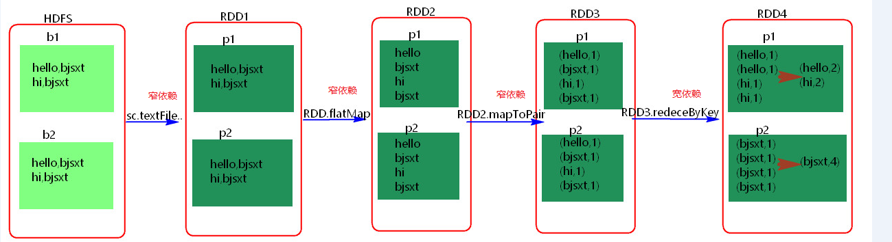
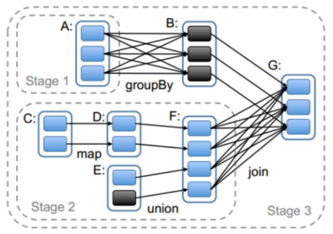
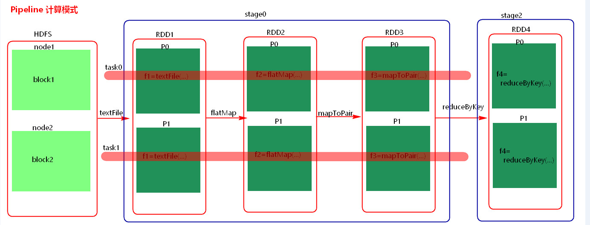
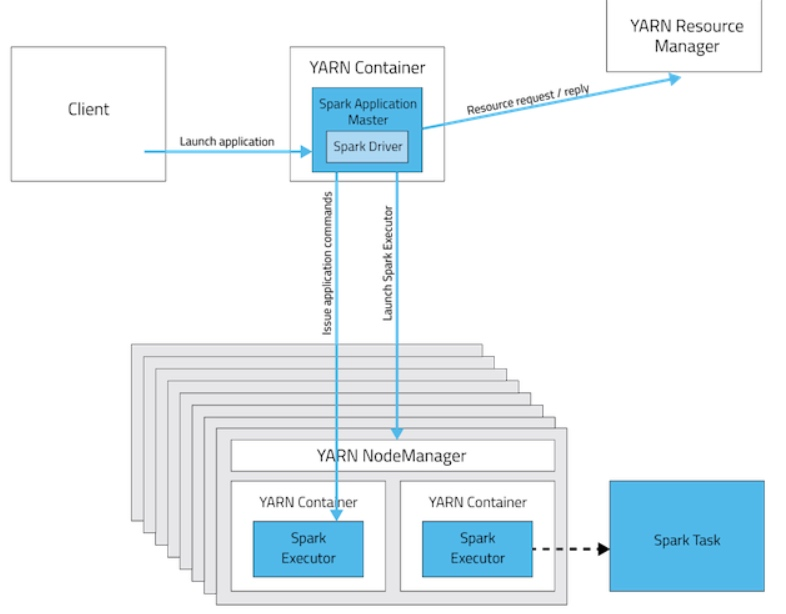
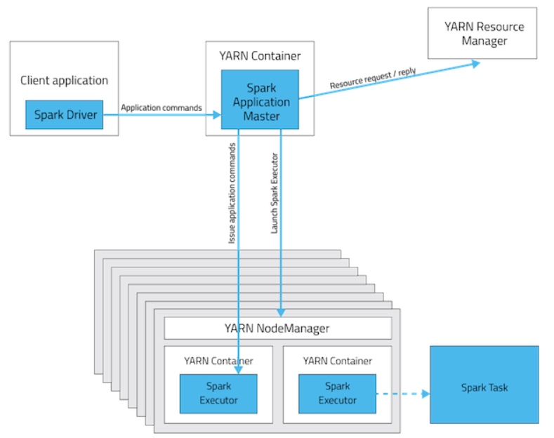
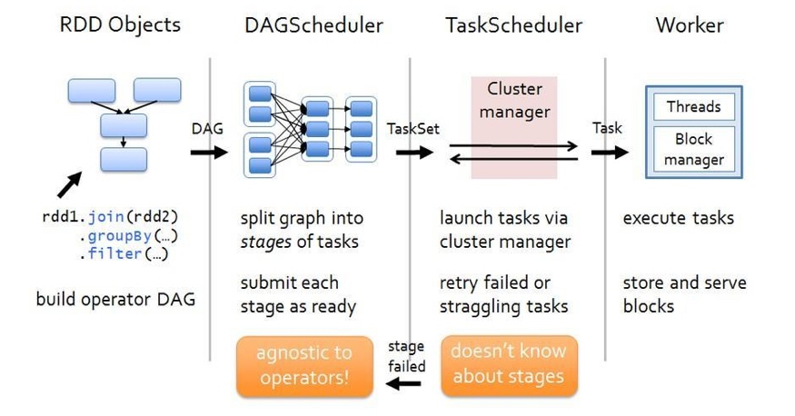

# 面试题
### Spark中Work的主要工作是什么？
主要功能：管理当前节点内存，CPU的使用状况，接收master分配过来的资源指令，通过ExecutorRunner启动程序分配任务，worker就类似于包工头，管理分配新进程，做计算的服务，相当于process服务。  
需要注意的是：
1. worker会不会汇报当前信息给master，worker心跳给master主要只有workid，它不会发送资源信息以心跳的方式给mater，master分配的时候就知道work，只有出现故障的时候才会发送资源。
2. worker不会运行代码，具体运行的是Executor是可以运行具体appliaction写的业务逻辑代码，操作代码的节点，它不会运行程序的代码的。
---

### RDD机制？
rdd分布式弹性数据集，简单的理解成一种数据结构，是spark框架上的通用货币。
所有算子都是基于rdd来执行的，不同的场景会有不同的rdd实现类，但是都可以进行互相转换。
rdd执行过程中会形成dag图，然后形成lineage保证容错性等。 从物理的角度来看rdd存储的是block和node之间的映射。

---
### spark有哪些组件？
主要有如下组件：  
1. master：管理集群和节点，不参与计算。  
2. salve：物理节点，干活的服务器，可运行1个或多个worker，但官方不建议运行多个
3. worker：计算节点，进程本身不参与计算，和master汇报。 一个worker中可以有一个或多个executor，一个executor拥有多个cpu core和memory。 
4. driver：运行程序的main方法，创建spark context对象。  
5. spark context：控制整个application的生命周期，包括dagsheduler和task scheduler等组件。  
6. client：用户提交程序的入口。
7. task：一个partition对应一个task。
---
### spark工作机制？
1. 用户在client端提交作业
2. 由Driver运行main方法并创建spark context上下文。
3. 执行rdd算子，形成dag图输入dag scheduler。
4. 按照rdd之间的依赖关系划分stage输入task scheduler。
5. task scheduler会将stage划分为task set分发到各个节点的executor中执行

---
### spark的优化怎么做？  
spark调优比较复杂，但是大体可以分为三个方面来进行  
1. 平台层面的调优：防止不必要的jar包分发，提高数据的本地性，选择高效的存储格式如parquet  
2. 应用程序层面的调优：过滤操作符的优化，降低过多小任务，降低单条记录的资源开销，处理数据倾斜，复用RDD进行缓存，作业并行化执行等等  
3. JVM层面的调优：设置合适的资源量，设置合理的JVM，启用高效的序列化方法如kyro，增大off head内存等等
---
### 什么是RDD宽依赖和窄依赖？
RDD和它依赖的parent RDD(s)的关系有两种不同的类型，即窄依赖（narrow dependency）和宽依赖（wide dependency）。  
1. 窄依赖指的是每一个parent RDD的Partition最多被子RDD的一个Partition使用  
2. 宽依赖指的是多个子RDD的Partition会依赖同一个parent RDD的Partition，即前面一个rdd的key打乱了分散到不同的rdd里，具体见下面的示例图
    
---

### Stage概念

Spark任务会根据**RDD之间的依赖关系，形成一个DAG有向无环图**，DAG会提交给DAGScheduler，DAGScheduler会把DAG划分相互依赖的多个stage，划分stage的依据就是RDD之间的宽窄依赖。**遇到宽依赖就划分stage**,每个stage包含一个或多个task任务。然后将这些task以taskSet的形式提交给**TaskScheduler运行**。 **stage是由一组并行的task组成。**

---

### stage切割规则

 切割规则：**从后往前，遇到宽依赖就切割stage。**



---

### stage计算模式

​    pipeline管道计算模式,pipeline只是一种计算思想，模式。



备注：图中几个理解点：

1. Spark的pipeLine的计算模式，相当于执行了一个高阶函数`f3(f2(f1(textFile))) !+!+!=3 `也就是来一条数据然后计算一条数据，把所有的逻辑走完，然后落地，准确的说一个task处理遗传分区的数据 因为跨过了不同的逻辑的分区。而MapReduce是 1+1=2,2+1=3的模式，也就是计算完落地，然后在计算，然后再落地到磁盘或内存，最后数据是落在计算节点上，按reduce的hash分区落地。所以这也是比Mapreduce快的原因，完全基于内存计算。

2. 管道中的数据何时落地：**shuffle write的时候，对RDD进行持久化的时候。**
3. Stage的task并行度是由**stage的最后一个RDD的分区数**来决定的 。一般来说，一个partiotion对应一个task,但最后reduce的时候可以手动改变reduce的个数，也就是分区数，即改变了并行度。例如reduceByKey(XXX,3),GroupByKey(4)，union由的分区数由前面的相加。
4. **如何提高stage的并行度**：`reduceBykey(xxx,numpartiotion),join(xxx,numpartiotion)
`
---

### cache和pesist的区别 

1. cache和persist都是用于将一个RDD进行缓存的，这样在之后使用的过程中就不需要重新计算了，可以大大节省程序运行时间；

2. cache只有一个默认的缓存级别MEMORY_ONLY ，cache调用了persist，而persist可以根据情况设置其它的缓存级别；  

3. executor执行的时候，默认60%做cache，40%做task操作，persist最根本的函数，最底层的函数

---

### Lineage机制

相比其他系统的细颗粒度的内存数据更新级别的备份或者LOG机制，RDD的Lineage记录的是粗颗粒度的特定数据Transformation操作（如filter、map、join等）行为。当这个RDD的部分分区数据丢失时，它可以通过Lineage获取足够的信息来重新运算和恢复丢失的数据分区。因为这种粗颗粒的数据模型，限制了Spark的运用场合，所以Spark并不适用于所有高性能要求的场景，但同时相比细颗粒度的数据模型，也带来了性能的提升。  

**本质理解：**根据父RDD分区是对应1个还是多个子RDD分区来区分窄依赖（父分区对应一个子分区）和宽依赖（父分区对应多个子分
区）。如果对应多个，则当容错重算分区时，因为父分区数据只有一部分是需要重算子分区的，其余数据重算就造成了冗余计算。

对于宽依赖，Stage计算的输入和输出在不同的节点上，对于输入节点完好，而输出节点死机的情况，通过重新计算恢复数据这种情况下，这种方法容错是有效的，否则无效，因为无法重试，需要向上追溯其祖先看是否可以重试（这就是lineage，血统的意思），窄依赖对于数据的重算开销要远小于宽依赖的数据重算开销。

窄依赖和宽依赖的概念主要用在两个地方：一个是容错中相当于Redo日志的功能；另一个是在调度中构建DAG作为不同Stage的划分点。  

#### 依赖关系的特性

第一，窄依赖可以在某个计算节点上直接通过计算父RDD的某块数据计算得到子RDD对应的某块数据；宽依赖则要等到父RDD所有数据都计算完成之后，并且父RDD的计算结果进行hash并传到对应节点上之后才能计算子RDD。
第二，数据丢失时，对于窄依赖只需要重新计算丢失的那一块数据来恢复；对于宽依赖则要将祖先RDD中的所有数据块全部重新计算来恢复。所以在长“血统”链特别是有宽依赖的时候，需要在适当的时机设置数据检查点。也是这两个特性要求对于不同依赖关系要采取不同的任务调度机制和容错恢复机制。

#### 容错原理

在容错机制中，如果一个节点死机了，而且运算窄依赖，则只要把丢失的父RDD分区重算即可，不依赖于其他节点。而宽依赖需要父RDD的所有分区都存在，重算就很昂贵了。可以这样理解开销的经济与否：在窄依赖中，在子RDD的分区丢失、重算父RDD分区时，父RDD相应分区的所有数据都是子RDD分区的数据，并不存在冗余计算。在宽依赖情况下，丢失一个子RDD分区重算的每个父RDD的每个分区的所有数据并不是都给丢失的子RDD分区用的，会有一部分数据相当于对应的是未丢失的子RDD分区中需要的数据，这样就会产生冗余计算开销，这也是宽依赖开销更大的原因。因此如果使用Checkpoint算子来做检查点，不仅要考虑Lineage是否足够长，也要考虑是否有宽依赖，对宽依赖加Checkpoint是最物有所值的。

#### Checkpoint机制
通过上述分析可以看出在以下两种情况下，RDD需要加检查点。  
1. DAG中的Lineage过长，如果重算，则开销太大（如在PageRank中）。  
2. 在宽依赖上做Checkpoint获得的收益更大。

由于RDD是只读的，所以Spark的RDD计算中一致性不是主要关心的内容，内存相对容易管理，这也是设计者很有远见的地方，这样减少了框架的复杂性，提升了性能和可扩展性，为以后上层框架的丰富奠定了强有力的基础。
在RDD计算中，通过检查点机制进行容错，传统做检查点有两种方式：通过冗余数据和日志记录更新操作。在RDD中的doCheckPoint方法相当于通过冗余数据来缓存数据，而之前介绍的血统就是通过相当粗粒度的记录更新操作来实现容错的。

**检查点（本质是通过将RDD写入Disk做检查点）是为了通过lineage做容错的辅助，lineage过长会造成容错成本过高，这样就不如在中间阶段做检查点容错，如果之后有节点出现问题而丢失分区，从做检查点的RDD开始重做Lineage，就会减少开销。**

---
### RDD的弹性表现在哪几点？  
1. 自动的进行内存和磁盘的存储切换；  
2. 基于Lingage的高效容错；  
3. task如果失败会自动进行特定次数的重试；  
4. stage如果失败会自动进行特定次数的重试，而且只会计算失败的分片；  
5. checkpoint和persist，数据计算之后持久化缓存  
6. 数据调度弹性，DAG TASK调度和资源无关  
7. 数据分片的高度弹性，a.分片很多碎片可以合并成大的，b.par
---
### 常规的容错方式有哪几种类型？
1. 数据检查点,会发生拷贝，浪费资源
2. 记录数据的更新，每次更新都会记录下来，比较复杂且比较消耗性能
---
### RDD通过Linage（记录数据更新）的方式为何很高效？
1. lazy记录了数据的来源，RDD是不可变的，且是lazy级别的，且RDD
之间构成了链条，lazy是弹性的基石。由于RDD不可变，所以每次操作就
产生新的rdd，不存在全局修改的问题，控制难度下降，所有有计算链条
将复杂计算链条存储下来，计算的时候从后往前回溯
2. 记录原数据，是每次修改都记录，代价很大
如果修改一个集合，代价就很小，官方说rdd是
粗粒度的操作，是为了效率，为了简化，每次都是
操作数据集合，写或者修改操作，都是基于集合的
rdd的写操作是粗粒度的，rdd的读操作既可以是粗粒度的
也可以是细粒度，读可以读其中的一条条的记录。
3. 简化复杂度，是高效率的一方面，写的粗粒度限制了使用场景
如网络爬虫，现实世界中，大多数写是粗粒度的场景
---
### RDD有哪些缺陷？
1. 不支持细粒度的写和更新操作（如网络爬虫），spark写数据是粗粒度的
所谓粗粒度，就是批量写入数据，为了提高效率。但是读数据是细粒度的也就是
说可以一条条的读
1. 不支持增量迭代计算，Flink支持

---
### 说一说Spark程序编写的一般步骤？  
初始化，资源，数据源，并行化，rdd转化，action算子打印输出结果或者也可以存至相应的数据存储介质  

---
### Spark有哪些聚合类的算子,我们应该尽量避免什么类型的算子?  
在我们的开发过程中，能避免则尽可能避免使用reduceByKey、join、distinct、repartition等会进行shuffle的算子，尽量使用map类的非shuffle算子。这样的话，没有shuffle操作或者仅有较少shuffle操作的Spark作业，可以大大减少性能开销。  

---
### spark master HA相关
1. **Spark master使用zookeeper进行HA的，有哪些元数据保存在Zookeeper？**
spark通过这个参数spark.deploy.zookeeper.dir指定master元数据在zookeeper中保存的位置，包括Worker，Driver和Application以及Executors。standby节点要从zk中，获得元数据信息，恢复集群运行状态，才能对外继续提供服务，作业提交资源申请等，在恢复前是不能接受请求的。另外，Master切换需要注意2点:
    1.  在Master切换的过程中，所有的已经在运行的程序皆正常运行！因为Spark Application在运行前就已经通过Cluster Manager获得了计算资源，所以在运行时Job本身的调度和处理和Master是没有任何关系的！
    2.  在Master的切换过程中唯一的影响是不能提交新的Job：一方面不能够提交新的应用程序给集群，因为只有Active Master才能接受新的程序的提交请求；另外一方面，已经运行的程序中也不能够因为Action操作触发新的Job的提交请求；
2. **Spark master HA 主从切换过程不会影响集群已有的作业运行，为什么？**  
因为程序在运行之前，已经申请过资源了，driver和Executors通讯，不需要和master进行通讯的。
3. **Spark on Mesos中，什么是的粗粒度分配，什么是细粒度分配，各自的优点和缺点是什么？**  

    1. 粗粒度：启动时就分配好资源， 程序启动，后续具体使用就使用分配好的资源，不需要再分配资源；好处：作业特别多时，资源复用率高，适合粗粒度；不好：容易资源浪费，假如一个job有1000个task，完成了999个，还有一个没完成，那么使用粗粒度，999个资源就会闲置在那里，资源浪费。  
    2. 细粒度分配：用资源的时候分配，用完了就立即回收资源，启动会麻烦一点，启动一次分配一次，会比较麻烦。
4. **如何配置spark master的HA？**  
    1. 配置zookeeper
    2. 修改spark_env.sh文件,spark的master参数不在指定，添加如下代码到各个master节点
export SPARK_DAEMON_JAVA_OPTS="-Dspark.deploy.recoveryMode=ZOOKEEPER -Dspark.deploy.zookeeper.url=zk01:2181,zk02:2181,zk03:2181 -Dspark.deploy.zookeeper.dir=/spark"
    1. 将spark_env.sh分发到各个节点
    2. 找到一个master节点，执行./start-all.sh，会在这里启动主master,其他的master备节点，启动master命令: ./sbin/start-master.sh 
    5. 提交程序的时候指定master的时候要指定三台master，例如
./spark-shell --master spark://master01:7077,master02:7077,master03:7077
---
### driver的功能是什么？
1. 一个Spark作业运行时包括一个Driver进程，也是作业的主进程，具有main函数，并且有SparkContext的实例，是程序的人口点；  
2. 功能：负责向集群申请资源，向master注册信息，负责了作业的调度，，负责作业的解析、生成Stage并调度Task到Executor上。包括DAGScheduler，TaskScheduler。
---
### spark集群运算的模式
Spark 有很多种模式，最简单就是单机本地模式，还有单机伪分布式模式，复杂的则运行在集群中，目前能很好的运行在 Yarn和 Mesos 中，当然 Spark 还有自带的 Standalone 模式，对于大多数情况 Standalone 模式就足够了，如果企业已经有 Yarn 或者 Mesos 环境，也是很方便部署的。
- standalone(集群模式)：典型的Mater/slave模式，不过也能看出Master是有单点故障的；Spark支持ZooKeeper来实现 HA
- on yarn(集群模式)： 运行在 yarn 资源管理器框架之上，由 yarn 负责资源管理，Spark 负责任务调度和计算
- on mesos(集群模式)： 运行在 mesos 资源管理器框架之上，由 mesos 负责资源管理，Spark 负责任务调度和计算
- on cloud(集群模式)：比如 AWS 的 EC2，使用这个模式能很方便的访问 Amazon的 S3;Spark 支持多种分布式存储系统：HDFS 和 S3 
--- 
###RDD中reduceBykey与groupByKey哪个性能好，为什么
####reduceByKey
reduceByKey会在结果发送至reducer之前会对每个mapper在本地进行merge，有点类似于在MapReduce中的combiner。这样做的好处在于，在map端进行一次reduce之后，数据量会大幅度减小，从而减小传输，保证reduce端能够更快的进行结果计算。
####groupByKey
groupByKey会对每一个RDD中的value值进行聚合形成一个序列(Iterator)，此操作发生在reduce端，所以势必会将所有的数据通过网络进行传输，造成不必要的浪费。同时如果数据量十分大，可能还会造成OutOfMemoryError。
通过以上对比可以发现在进行大量数据的reduce操作时候建议使用reduceByKey。不仅可以提高速度，还可以防止使用groupByKey造成的内存溢出问题。
###spark sql怎么取数据的差集
好像不支持
###spark2.0的了解
- 更简单：ANSI SQL与更合理的API
- 速度更快：用Spark作为编译器
- 更智能：Structured Streaming

###rdd 怎么区分spark宽依赖和窄依赖
####宽依赖
父RDD的分区被子RDD的多个分区使用 例如 groupByKey、reduceByKey、sortByKey等操作会产生宽依赖，会产生shuffle
####窄依赖
父RDD的每个分区都只被子RDD的一个分区使用 例如map、filter、union等操作会产生窄依赖
###spark streaming 读取kafka数据的两种方式
这两种方式分别是：
1. Receiver-base
使用Kafka的高层次Consumer API来实现。receiver从Kafka中获取的数据都存储在Spark Executor的内存中，然后Spark Streaming启动的job会去处理那些数据。然而，在默认的配置下，这种方式可能会因为底层的失败而丢失数据。如果要启用高可靠机制，让数据零丢失，就必须启用Spark Streaming的预写日志机制（Write Ahead Log，WAL）。该机制会同步地将接收到的Kafka数据写入分布式文件系统（比如HDFS）上的预写日志中。所以，即使底层节点出现了失败，也可以使用预写日志中的数据进行恢复。
2. Direct
Spark1.3中引入Direct方式，用来替代掉使用Receiver接收数据，这种方式会周期性地查询Kafka，获得每个topic+partition的最新的offset，从而定义每个batch的offset的范围。当处理数据的job启动时，就会使用Kafka的简单consumer api来获取Kafka指定offset范围的数据。
---

### 按照需求使用spark编写一下程序
#### 当前文件a.text的格式如下，请统计每个单词出现的个数
A,b,c,d
B,b,f,e
A,a,c,f

```
sc.textFile(“/user/local/a.text”).flatMap(_.split(“,”)).map((_,1)).ReduceByKey(_+_).collect()
```
或：

```package cn.bigdata
import org.apache.spark.SparkConf
import org.apache.spark.SparkContext
import org.apache.spark.rdd.RDD
object Demo {
  /*
a,b,c,d
b,b,f,e
a,a,c,f
c,c,a,d
   * 计算第四列每个元素出现的个数
   */
  def main(args: Array[String]): Unit = {
    val conf: SparkConf = new SparkConf().setAppName("demo").setMaster("local")
    val sc: SparkContext = new SparkContext(conf)
    val data: RDD[String] = sc.textFile("f://demo.txt")
    //数据切分
    val fourthData: RDD[(String, Int)] = data.map { x =>
      val arr: Array[String] = x.split(",")
      val fourth: String = arr(3)
      (fourth, 1)
    }
    val result: RDD[(String, Int)] = fourthData.reduceByKey(_ + _);
    println(result.collect().toBuffer)
  }
}
```

#### HDFS中有两个文件a.text与b.text,文件的格式为(ip,username),如：a.text,b.text
a.text
127.0.0.1  xiaozhang
127.0.0.1  xiaoli
127.0.0.2  wangwu
127.0.0.3  lisi 


B.text
127.0.0.4  lixiaolu
127.0.0.5  lisi 


每个文件至少有1000万行，请用程序完成以下工作，
1）每个文件的个子的IP
2)出现在b.text而没有出现在a.text的IP
3)每个user出现的次数以及每个user对应的IP的个数 


代码如下：
1）各个文件的ip数

```package cn.bigdata
import java.util.concurrent.Executors
import org.apache.hadoop.conf.Configuration
import org.apache.hadoop.fs.FileSystem
import org.apache.hadoop.fs.LocatedFileStatus
import org.apache.hadoop.fs.Path
import org.apache.hadoop.fs.RemoteIterator
import org.apache.spark.SparkConf
import org.apache.spark.SparkContext
import org.apache.spark.rdd.RDD
import org.apache.spark.rdd.RDD.rddToPairRDDFunctions 


//各个文件的ip数
object Demo2 {
  val cachedThreadPool = Executors.newCachedThreadPool()
  def main(args: Array[String]): Unit = {
    val conf: SparkConf = new SparkConf().setAppName("demo2").setMaster("local")
    val sc: SparkContext = new SparkContext(conf)
    val hdpConf: Configuration = new Configuration
    val fs: FileSystem = FileSystem.get(hdpConf)
    val listFiles: RemoteIterator[LocatedFileStatus] = fs.listFiles(new Path("f://txt/2/"), true)


    while (listFiles.hasNext) {
      val fileStatus = listFiles.next
      val pathName = fileStatus.getPath.getName
      cachedThreadPool.execute(new Runnable() {
        override def run(): Unit = {
          println("=======================" + pathName)
          analyseData(pathName, sc)
        }
      })
    }
  }


  def analyseData(pathName: String, sc: SparkContext): Unit = {
    val data: RDD[String] = sc.textFile("f://txt/2/" + pathName)
    val dataArr: RDD[Array[String]] = data.map(_ .split(" "))
    val ipAndOne: RDD[(String, Int)] = dataArr.map(x => {
      val ip = x(0)
      (ip, 1)
    })
    val counts: RDD[(String, Int)] = ipAndOne.reduceByKey(_ + _ )
    val sortedSort: RDD[(String, Int)] = counts.sortBy(_._2, false)
    sortedSort.saveAsTextFile("f://txt/3/" + pathName)
  }
}

```

2）出现在b.txt而没有出现在a.txt的ip

```package cn.bigdata
import java.util.concurrent.Executors
import org.apache.spark.SparkConf
import org.apache.spark.SparkContext
import org.apache.spark.rdd.RDD
/*
 * 出现在b.txt而没有出现在a.txt的ip
 */
object Demo3 {
  val cachedThreadPool = Executors.newCachedThreadPool()
  def main(args: Array[String]): Unit = {
    val conf = new SparkConf().setAppName("Demo3").setMaster("local")
    val sc = new SparkContext(conf)
    val data_a = sc.textFile("f://txt/2/a.txt")
    val data_b = sc.textFile("f://txt/2/b.txt")
    val splitArr_a = data_a.map(_ .split(" "))
    val ip_a: RDD[String] = splitArr_a.map(x => x(0))
    val splitArr_b = data_b.map(_.split(" "))
    val ip_b: RDD[String] = splitArr_b.map(x => x(0))
    val subRdd: RDD[String] = ip_b.subtract(ip_a)
    subRdd.saveAsTextFile("f://txt/4/")
  }
} 
```


3）

```package cn.bigdata
import org.apache.spark.SparkConf
import org.apache.spark.SparkContext
import org.apache.spark.rdd.RDD
import scala.collection.mutable.Set
/*
 * 每个user出现的次数以及每个user对应的ip数
 */
object Demo4 {
  def main(args: Array[String]): Unit = {
    val conf = new SparkConf().setAppName("Demo4").setMaster("local")
    val sc = new SparkContext(conf)
    val data: RDD[String] = sc.textFile("f://txt/5/")
    val lines = data.map(_.split(" "))
    val userIpOne = lines.map(x => {
      val ip = x(0)
      val user = x(1)
      (user, (ip, 1))
    })


    val userListIpCount: RDD[(String, (Set[String], Int))] = userIpOne.combineByKey(
      x => (Set(x._1), x._2),
      (a: (Set[String], Int), b: (String, Int)) => {
        (a._1 + b._1, a._2 + b._2)
      },
      (m: (Set[String], Int), n: (Set[String], Int)) => {
        (m._1 ++ n._1, m._2 + n._2)
      }) 


    val result: RDD[String] = userListIpCount.map(x => {
      x._1 + ":userCount:" + x._2._2 + ",ipCount:" + x._2._1.size
    })


    println(result.collect().toBuffer)
  }
}
```

---

### hadoop和spark都是并行计算，那么他们有什么相同和区别？

两者都使用mr模型来进行并行计算，hadoop的一个作业称为job，job里面分为map task和reduce task，每个task都是在自己的进程中运行的，当task结束时，进程也会结束。

Spark用户提交的任务称为application，一个application对应一个SparkContext，app中存在多个job，没触发一个action操作就会产生一个job。

这些job可以并行或者串行执行，每个job有多个stage，stage是shuffle过程中DAGSchaduler通过RDD之间的依赖关系划分job而来的，每个stage里面有多个task，组成taskset有TaskSchaduler分发到各个executor中执行，executor的生命周期是和application一样的，即使没有job运行也是存在的，所以task可以快速启动读取内存进行计算的。

Hadoop的job只有map和reduce操作，表达能力比较欠缺而且在mr过程中会重复的读写hdfs，造成大量的io操作，多个job需要自己管理关系。

Spark的迭代计算都是在内存中进行的，API中提供了大量的RDD操作join，groupby等，而且通过DAG图可以实现良好的容错。

---
### 简单说一下hadoop和spark的shuffle过程

- Hadoop：map端保存分片数据，通过网络收集到reduce端。

- Spark：spark的shuffle实在DAGSchedular划分Stage的时候产生的，TaskSchedular要分发Stage到各个worker的executor。减少shuffle可以提高性能。

---
### spark streming在实时处理时会发生什么故障，如何停止，解决

和Kafka整合时消息无序：

修改Kafka的ack参数，当ack=1时，master确认收到消息就算投递成功。ack=0时，不需要收到消息便算成功，高效不准确。sck=all，master和server都要受到消息才算成功，准确不高效。

StreamingContext.stop会把关联的SparkContext对象也停止，如果不想把SparkContext对象也停止的话可以把StremingContext.stop的可选参数stopSparkContext设为flase。一个SparkContext对象可以和多个streamingcontext对象关联。只要对前一个stremingcontext.stop(stopsparkcontext=false),然后再创建新的stremingcontext对象就可以了。 

# 实际应用遇到的问题

## stream实现多batch同时执行

是否同时执行主要由两个参数控制：
* spark.scheduler.mode(FIFO/FAIR)
* spark.streaming.concurrentJobs

### spark.scheduler.mode

mode控制batch的执行策略
FIFO：先进先出
FAIR：公平调度，支持在调度池中为任务进行分组，不同的调度池权重不同，任务可以按照权重来决定执行顺序

### spark.streaming.concurrentJobs
concurrentJobs 其实决定了向Spark Core提交Job的并行度。提交一个Job，必须等这个执行完了，才会提交第二个。假设我们把它设置为2，则会并发的把Job提交给Spark Core，Spark 有自己的机制决定如何运行这两个Job,这个机制其实就是FIFO或者FAIR（决定了资源的分配规则）。默认是FIFO,也就是先进先出，你把concurrentJobs设置为2，但是如果底层是FIFO,那么会优先执行先提交的Job,虽然如此，**如果资源够两个job运行**，还是会并行运行两个Job。

## WARN yarn.Client: Neither spark.yarn.jars nor spark.yarn.archive is set, falling back to uploading libraries under SPARK_HOME.

将spark的jar包放到hdfs上并配置spark.yarn.jars


```shell
hdfs dfs -mkdir /hadoop
hdfs dfs -mkdir /hadoop/spark_jars
hdfs dfs -put /opt/spark-2.2.1-bin-hadoop2.7/jars/* /hadoop/spark_jars
cd /opt/spark-2.2.1-bin-hadoop2.7/conf/
cp spark-defaults.conf.template spark-defaults.conf
vim spark-defaults.conf
# 在最下面添加：
spark.yarn.jars hdfs://192.168.44.128:8888/hadoop/spark_jars/*
```

## spark on yarn配置

1. spark-env.sh设置HADOOP_CONF_DIR

    ```shell
    export HADOOP_CONF_DIR=/etc/hadoop/conf
    ```

1. spark-defaults.conf设置spark.yarn.jars
参考上面的Neither spark.yarn.jars nor spark.yarn.archive is set, falling back to uploading libraries under SPARK_HOME的处理办法

## logback替换log4j

1. 将jars文件夹下apache-log4j-extras-1.2.17.jar，commons-logging-1.1.3.jar, log4j-1.2.17.jar, slf4j-log4j12-1.7.16.jar替换成log4j-over-slf4j-1.7.23.jar,logback-access-1.2.1.jar, logback-classic-1.2.1.jar, logback-core-1.2.1.jar。

2. 将conf文件夹下的log4j.properties.template通过 [log4j.properties Translator](http://logback.qos.ch/translator/) 转换成logback.xml即可

3. 运行./run-example SparkPi 10看实际效果

4. spark应用启动脚本用-Dlogback.configurationFile=xxx来替换-Dlog4j.configuration=xxx


# 配置参数

## spark on yarn常用属性介绍

| 属性名 | 默认值 | 属性说明 |
| --- | --- | --- |
|spark.yarn.am.memory	|512m	|在客户端模式（client mode）下，yarn应用master使用的内存数。在集群模式（cluster mode）下，使用spark.driver.memory代替。|
|spark.driver.cores	|1	|在集群模式（cluster mode）下，driver程序使用的核数。在集群模式（cluster mode）下，driver程序和master运行在同一个jvm中，所以master控制这个核数。在客户端模式（client mode）下，使用spark.yarn.am.cores控制master使用的核。|
|spark.yarn.am.cores	|1	|在客户端模式（client mode）下，yarn应用的master使用的核数。在集群模式下，使用spark.driver.cores代替。|
|spark.yarn.am.waitTime	|100ms|	在集群模式（cluster mode）下，yarn应用master等待SparkContext初始化的时间。在客户端模式（client mode）下，master等待driver连接到它的时间。|
|spark.yarn.submit.file.replication|	3	|文件上传到hdfs上去的replication次数|
|spark.yarn.preserve.staging.files|	false	|设置为true时，在job结束时，保留staged文件；否则删掉这些文件。|
|spark.yarn.scheduler.heartbeat.interval-ms|	3000|	Spark应用master与yarn resourcemanager之间的心跳间隔|
|spark.yarn.scheduler.initial-allocation.interval|	200ms	|当存在挂起的容器分配请求时，spark应用master发送心跳给resourcemanager的间隔时间。它的大小不能大于spark.yarn.scheduler.heartbeat.interval-ms，如果挂起的请求还存在，那么这个时间加倍，直到到达spark.yarn.scheduler.heartbeat.interval-ms大小。|
|spark.yarn.max.executor.failures|	numExecutors * 2，并且不小于3|	在失败应用程序之前，executor失败的最大次数。|
|spark.executor.instances|	2|	Executors的个数。这个配置和spark.dynamicAllocation.enabled不兼容。当同时配置这两个配置时，动态分配关闭，spark.executor.instances被使用|
|spark.yarn.executor.memoryOverhead|	executorMemory * 0.10，并且不小于384m|	每个executor分配的堆外内存。|
|spark.yarn.driver.memoryOverhead|	driverMemory * 0.10，并且不小于384m|	在集群模式下，每个driver分配的堆外内存。|
|spark.yarn.am.memoryOverhead|	AM memory * 0.10，并且不小于384m|	在客户端模式下，每个driver分配的堆外内存|
|spark.yarn.am.port	|随机	|Yarn 应用master监听的端口。|
|spark.yarn.queue	|default|	应用提交的yarn队列的名称|
|spark.yarn.jar	|none|	Jar文件存放的地方。默认情况下，spark jar安装在本地，但是jar也可以放在hdfs上，其他机器也可以共享。|

## spark submit 和 spark shell参数介绍

| 参数名  | 格式 | 参数说明 |
| --- | --- | --- |
|--master	|MASTER_URL	|如spark://host:port|
|--deploy-mode	|DEPLOY_MODE|	Client或者master，默认是client|
|--class	|CLASS_NAME	|应用程序的主类|
|--name|	NAME	|应用程序的名称|
|--jars	|JARS|	逗号分隔的本地jar包，包含在driver和executor的classpath下|
|--packages	|	|包含在driver和executor的classpath下的jar包逗号分隔的”groupId:artifactId：version”列表|
|--exclude-packages|		|用逗号分隔的”groupId:artifactId”列表|
|--repositories|		|逗号分隔的远程仓库|
|--py-files	|PY_FILES|	逗号分隔的”.zip”,”.egg”或者“.py”文件，这些文件放在python app的PYTHONPATH下面|
|--files	|FILES|	逗号分隔的文件，这些文件放在每个executor的工作目录下面|
|--conf	|PROP=VALUE	|固定的spark配置属性|
|--properties-file	|FILE|	加载额外属性的文件|
|--driver-memory	|MEM	|Driver内存，默认1G|
|--driver-java-options	|	|传给driver的额外的Java选项|
|--driver-library-path	||	传给driver的额外的库路径|
|--driver-class-path||		传给driver的额外的类路径|
|--executor-memory	|MEM|	每个executor的内存，默认是1G|
|--proxy-user	|NAME|	模拟提交应用程序的用户|
|--driver-cores	|NUM	|Driver的核数，默认是1。这个参数仅仅在standalone集群deploy模式下使用|
|--supervise	||	Driver失败时，重启driver。在mesos或者standalone下使用|
|--verbose	||	打印debug信息|
|--total-executor-cores	|NUM|	所有executor总共的核数。仅仅在mesos或者standalone下使用|
|--executor-cores	|NUM|	每个executor的核数。在yarn或者standalone下使用|
|--driver-cores	|NUM	|Driver的核数，默认是1。在yarn集群模式下使用|
|--queue	|QUEUE_NAME|	队列名称。在yarn下使用|
|--num-executors|	NUM	|启动的executor数量。默认为2。在yarn下使用|

## java参数


```shell
# driver的jvm参数配置，和conf的区别是client模式下必须使用此种配置，因为SparkContext的config起作用的时候，driver已经启动的了
--driver-java-options
# cluster模式的dirver参数
--conf spark.driver.extraJavaOptions
# executor的jvm参数，适用client和cluster
--conf spark.executor.extraJavaOptions

```
# spark on yarn
## 客户端模式和集群模式
### 客户端模式和集群模式的区别

这里我们要区分一下什么是客户端模式（client mode），什么是集群模式（cluster mode）。

我们知道，当在YARN上运行Spark作业时，每个Spark executor作为一个YARN容器(container)运行。Spark可以使得多个Tasks在同一个容器(container)里面运行。 yarn-cluster和yarn-client模式的区别其实就是Application Master进程的区别，在yarn-cluster模式下，driver运行在AM(Application Master)中，它负责向YARN申请资源，并监督作业的运行状况。当用户提交了作业之后，就可以关掉Client，作业会继续在YARN上运行。然而yarn-cluster模式不适合运行交互类型的作业。 在yarn-client模式下，Application Master仅仅向YARN请求executor，client会和请求的container通信来调度他们工作，也就是说Client不能离开。下面的图形象表示了两者的区别。



### Spark on YARN集群模式分析

#### 客户端操作
1. 根据yarnConf来初始化yarnClient，并启动yarnClient；
2. 创建客户端Application，并获取Application的ID，进一步判断集群中的资源是否满足executor和ApplicationMaster申请的资源，如果不满足则抛出IllegalArgumentException；
3. 设置资源、环境变量：其中包括了设置Application的Staging目录、准备本地资源（jar文件、log4j.properties）、设置Application其中的环境变量、创建Container启动的Context等；
4. 设置Application提交的Context，包括设置应用的名字、队列、AM的申请的Container、标记该作业的类型为Spark；
5. 申请Memory，并最终通过yarnClient.submitApplication向ResourceManager提交该Application。

当作业提交到YARN上之后，客户端就没事了，甚至在终端关掉那个进程也没事，因为整个作业运行在YARN集群上进行，运行的结果将会保存到HDFS或者日志中。

#### 提交到YARN集群，YARN操作
1. 运行ApplicationMaster的run方法；
2. 设置好相关的环境变量。
3. 创建amClient，并启动；
4. 在Spark UI启动之前设置Spark UI的AmIpFilter；
5. 在startUserClass函数专门启动了一个线程（名称为Driver的线程）来启动用户提交的Application，也就是启动了Driver。在Driver中将会初始化SparkContext；
6. 等待SparkContext初始化完成，最多等待spark.yarn.applicationMaster.waitTries次数（默认为10），如果等待了的次数超过了配置的，程序将会退出；否则用SparkContext初始化yarnAllocator；
7. 当SparkContext、Driver初始化完成的时候，通过amClient向ResourceManager注册ApplicationMaster;
8. 分配并启动Executeors。在启动Executeors之前，先要通过yarnAllocator获取到numExecutors个Container，然后在Container中启动Executeors。 如果在启动Executeors的过程中失败的次数达到了maxNumExecutorFailures的次数，maxNumExecutorFailures的计算规则如下：

    ```java
    // Default to numExecutors * 2, with minimum of 3
    private val maxNumExecutorFailures = sparkConf.getInt("spark.yarn.max.executor.failures",
        sparkConf.getInt("spark.yarn.max.worker.failures", math.max(args.numExecutors * 2, 3)))
    
    ```
    那么这个Application将失败，将Application Status标明为FAILED，并将关闭SparkContext。其实，启动Executeors是通过ExecutorRunnable实现的，而ExecutorRunnable内部是启动CoarseGrainedExecutorBackend的。

9. 最后，Task将在CoarseGrainedExecutorBackend里面运行，然后运行状况会通过Akka通知CoarseGrainedScheduler，直到作业运行完成。

### Spark on YARN客户端模式分析
和yarn-cluster模式一样，整个程序也是通过spark-submit脚本提交的。但是yarn-client作业程序的运行不需要通过Client类来封装启动，而是直接通过反射机制调用作业的main函数。下面是流程。

1. 通过SparkSubmit类的launch的函数直接调用作业的main函数（通过反射机制实现），如果是集群模式就会调用Client的main函数。
2. 而应用程序的main函数一定都有个SparkContent，并对其进行初始化；
3. 在SparkContent初始化中将会依次做如下的事情：设置相关的配置、注册MapOutputTracker、BlockManagerMaster、BlockManager，创建taskScheduler和dagScheduler；
4. 初始化完taskScheduler后，将创建dagScheduler，然后通过taskScheduler.start()启动taskScheduler，而在taskScheduler启动的过程中也会调用SchedulerBackend的start方法。 在SchedulerBackend启动的过程中将会初始化一些参数，封装在ClientArguments中，并将封装好的ClientArguments传进Client类中，并client.runApp()方法获取Application ID。
5. client.runApp里面的做的和上章客户端进行操作那节类似，不同的是在里面启动是ExecutorLauncher（yarn-cluster模式启动的是ApplicationMaster）。
6. 在ExecutorLauncher里面会初始化并启动amClient，然后向ApplicationMaster注册该Application。注册完之后将会等待driver的启动，当driver启动完之后，会创建一个MonitorActor对象用于和CoarseGrainedSchedulerBackend进行通信（只有事件AddWebUIFilter他们之间才通信，Task的运行状况不是通过它和CoarseGrainedSchedulerBackend通信的）。 然后就是设置addAmIpFilter，当作业完成的时候，ExecutorLauncher将通过amClient设置Application的状态为FinalApplicationStatus.SUCCEEDED。
7. 分配Executors，这里面的分配逻辑和yarn-cluster里面类似。
8. 最后，Task将在CoarseGrainedExecutorBackend里面运行，然后运行状况会通过Akka通知CoarseGrainedScheduler，直到作业运行完成。
9. 在作业运行的时候，YarnClientSchedulerBackend会每隔1秒通过client获取到作业的运行状况，并打印出相应的运行信息，当Application的状态是FINISHED、FAILED和KILLED中的一种，那么程序将退出等待。
10. 最后有个线程会再次确认Application的状态，当Application的状态是FINISHED、FAILED和KILLED中的一种，程序就运行完成，并停止SparkContext。整个过程就结束了。

## 动态资源分配
### 为什么开启动态资源分配

⽤户提交Spark应⽤到Yarn上时，可以通过spark-submit的num-executors参数显示地指定executor 个数，随后，ApplicationMaster会为这些executor申请资源，每个executor作为⼀个Container在 Yarn上运⾏。Spark调度器会把Task按照合适的策略分配到executor上执⾏。所有任务执⾏完后， executor被杀死，应⽤结束。在job运⾏的过程中，⽆论executor是否领取到任务，都会⼀直占有着 资源不释放。很显然，这在任务量⼩且显示指定⼤量executor的情况下会很容易造成资源浪费

### yarn配置
vim etc/hadoop/yarn-site.xml

```xml
<property>
 　　<name>yarn.nodemanager.aux-services</name>
 　　<value>spark_shuffle,mapreduce_shuffle</value>
 </property>
 <property>
 　　<name>yarn.nodemanager.aux-services.spark_shuffle.class</name>
 　　<value>org.apache.spark.network.yarn.YarnShuffleService</value>
</property>
```

添加jar包

```shell
mv  spark/yarn/spark-2.11-2.2.1-shuffle_.jar /opt/modules/hadoop-2.6.0-cdh5.14.2/share/hadoop/yarn/
```

### spark配置

spark-defaults.conf：

```conf
spark.shuffle.service.enabled true //启⽤External shuffle Service服务
spark.shuffle.service.port 7337 //Shuffle Service服务端⼝，必须和yarn-site中的⼀致
spark.dynamicAllocation.enabled true //开启动态资源分配
spark.dynamicAllocation.minExecutors 1 //每个Application最⼩分配的executor数
spark.dynamicAllocation.maxExecutors 30 //每个Application最⼤并发分配的executor数
spark.dynamicAllocation.schedulerBacklogTimeout 1s
spark.dynamicAllocation.sustainedSchedulerBacklogTimeout 5s
```

在代码或启动脚本中加也可以：

```shell
spark2-shell —master yarn —eploy-mode client \
#指定队列
—queue "test" \
#日志配置
—conf spark.driver.extraJava0ptions=-Dlog4j.configuration=log4j-yarn.properties \
—conf spark.executor.extraJava0ptions=-Dlog4j.configuration=log4j-yarn.properties \
—conf spark.serializer=org.apache.spark.serializer.KryoSerializer \
#推测执行等待时间
—conf spark.locality.wait=10 \
#最大失败重试次数
—conf spark.task.maxFailures=8 \
—conf spark.ui.killEnabled=false \
—conf spark.logConf=true \
#非堆内存配置
—conf spark.yarn.driver.memoryOverhead=512 \
—conf spark.yarn.executor.memoryOverhead=1024 \
—conf spark.yarn.maxAppAttempts=4 \
—conf spark.yarn.am.attemptFailuresValidityInterval=lh \
—conf spark.yarn.executor.failuresValidityInterval=lh \
#动态资源开启
—conf spark.dynamicAllocation.enabled=true \
#最大最小申请的Executors数
—conf spark.dynamicAllocation.minExecutors=l \
—conf spark.dynamicAllocation.maxExecutors=30 \
—conf spark.dynamicAllocation.executorldleTimeout=3s \
—conf spark.shuffle.service.enabled=true
```

#  推测执行(speculatie)
        
## speculatie简介

在spark作业运行中，一个spark作业会构成一个DAG调度图，一个DAG又切分成多个stage，一个stage由多个Tesk组成，一个stage里面的不同task的执行时间可能不一样，有的task很快就执行完成了，而有的可能执行很长一段时间也没有完成。造成这种情况的原因可能是集群内机器的配置性能不同、网络波动、或者是由于数据倾斜引起的。而推测执行(speculatie)就是当出现同一个stage里面有task长时间完成不了任务，spark就会在不同的executor上再启动一个task来跑这个任务，然后看哪个task先完成，就取该task的结果，并kill掉另一个task。其实对于集群内有不同性能的机器开启这个功能是比较有用的。

## 如何在spark中启动speculatie

1. 在spark-env.sh里设置
   spark.speculation=true # 这样会作用到所有spark任务

2. 在代码里通过sparkConf设置
   conf.set("spark.speculation", true)

3. 在用spark sql时
    spark.sql("set  spark.speculation = true")

4. map和reduce可以分开设置
    sqlContext.sql("set mapreduce.map.speculatie = true")
    sqlContext.sql("set mapreduce.reduce.speculatie = true")

## speculatie 运行机制

1. 监控Slow Task(Straggler Task)

    spark程序运行时，会在TaskSchedulerImpl类中启动一个独立的线程池(task-scheduler-speculation)每100ms检查一次所有Task中是否有Slow Task.

2. Straggler Task衡量指标

    如下图所示，在Spark调度作业中，DAGScheduler会将每个Stage中的Task封装到TaskSet，并将TaskSet交给TaskScheduler，TaskScheduler 会按顺序将Task发给Executor，并由Executor端执行这些Task。在这些Task计算过程中，Driver端如何衡量哪些Task是Straggler Task（TaskSet中所有的Task都是并行计算，在不同的Executor中计算），这个衡量过程Spark称为speculatie Task，符合speculatie Task的Task，Spark 称为Straggler Task.
    



# spark中的各种变量
[参考文档](https://blog.csdn.net/wangjian1204/article/details/52664250)

Spark程序在变量的访问方式上与传统的java程序有一些不同，导致了传值和结果上的差异。本文通过一组实验来分析Spark对各种形式变量的处理方式。
下面这个简单的小程序创建了 
- 静态变量staticVariable、静态广播变量staticBroadcast、静态累加器staticAccumulator； 
- 成员变量objectVariable、成员广播变量objectBroadcast、成员累加器objectAccumulator； 
- 局部变量localVariable、局部广播变量localBroadcast、局部累加器localAccumulator； 

共计9种变量，在函数中对字符串数据修改了两次数值（“banana”和“cat”）、在flatMap函数中对累加器的值进行累加。

```java
/**
 * Created by Alex on 2016/9/25.
 */
public class TestSharedVariable implements Serializable {
    private static Logger logger = LoggerFactory.getLogger(TestSharedVariable.class);
    private static String staticVariable = "apple";
//    private static Broadcast<String> staticBroadcast;  //java.lang.NullPointerException
//    private static Accumulator<Integer> staticAccumulator;

    private String objectVariable = "apple";
    private Broadcast<String> objectBroadcast;
    private Accumulator<Integer> objectAccumulator;


    public void testVariables(JavaSparkContext sc) throws Exception {
        staticVariable = "banana";
//        staticBroadcast = sc.broadcast("banana");
//        staticAccumulator = sc.intAccumulator(0);

        objectVariable = "banana";
        objectBroadcast = sc.broadcast("banana");
        objectAccumulator = sc.intAccumulator(0);

        String localVariable = "banana";
        accessVariables(sc, localVariable);

        staticVariable = "cat";
//        staticBroadcast = sc.broadcast("cat");
        objectVariable = "cat";
        objectBroadcast = sc.broadcast("cat");
        localVariable = "cat";
        accessVariables(sc, localVariable);
    }

    public void accessVariables(JavaSparkContext sc, final String localVariable) throws Exception {
        final Broadcast<String> localBroadcast = sc.broadcast(localVariable);
        final Accumulator<Integer> localAccumulator = sc.intAccumulator(0);

        List<String> list = Arrays.asList("machine learning", "deep learning", "graphic model");
        JavaRDD<String> rddx = sc.parallelize(list).flatMap(new FlatMapFunction<String, String>() {

            @Override
            public Iterable<String> call(String s) throws Exception {
                List<String> list = new ArrayList<String>();

                if (s.equalsIgnoreCase("machine learning")) {
                    list.add("staticVariable:" + staticVariable);
                    list.add("objectVariable:" + objectVariable);
                    list.add("objectBroadcast:" + objectBroadcast.getValue());
                    list.add("localVariable:" + localVariable);
                    list.add("localBroadcast:" + localBroadcast.getValue());
                }

//                staticAccumulator.add(1);
                objectAccumulator.add(1);
                localAccumulator.add(1);

                return list;
            }
        });


        String desPath = "learn" + localVariable;
        HdfsOperate.deleteIfExist(desPath);
        HdfsOperate.openHdfsFile(desPath);
        List<String> resultList = rddx.collect();
        for (String str : resultList) {
            HdfsOperate.writeString(str);
        }
        HdfsOperate.writeString("objectAccumulator:" + objectAccumulator.value());
        HdfsOperate.writeString("localAccumulator:" + localAccumulator.value());
        HdfsOperate.closeHdfsFile();
    }

}
```
最终得到两个文件：learnbanana、learncat 
learnbanana的内容：

```
taticVariable:apple
objectVariable:banana
objectBroadcast:banana
localVariable:banana
localBroadcast:banana
objectAccumulator:3
localAccumulator:3
```
learncat的内容：

```
staticVariable:apple
objectVariable:cat
objectBroadcast:cat
localVariable:cat
localBroadcast:cat
objectAccumulator:6
localAccumulator:3                    
```

1. 静态广播变量staticBroadcast、静态累加器staticAccumulator在运行过程中会引发异常：java.lang.NullPointerException，所以在运行过程中需要注释掉。这点和普通的java函数有较大差别。另外可以看到静态变量staticVariable初始化之后无法在函数中改变它的值。
2. 成员变量objectVariable、成员广播变量objectBroadcast、成员累加器objectAccumulator、局部变量localVariable、局部广播变量localBroadcast、局部累加器localAccumulator都在程序中正常修改得到了我们想要的值。
3. 需要注意的是局部变量、局部广播变量、局部累加器这三种变量由于需要在inner class中访问，需要被定义成final形式，但不影响其正常使用，可以看到局部累加器还是正确的增加了值。

小小总结一下，在使用Spark编程时如果要对变量进行访问和操作尽量使用成员类型变量和局部类型变量。另外普通变量和广播变量之间的区别主要在于广播变量在处理过程中是经过优化的，可以减少不必要的资源浪费，一般size较小的变量不需要用Broadcast，详细的解释请参考文章：http://g-chi.github.io/2015/10/21/Spark-why-use-broadcast-variables/

HdfsOperate类是使用hadoop的FileSystem接口对HDFS文件进行操作，完整代码如下：

```java
/**
 * Created by Alex on 2016/8/30.
 */
public class HdfsOperate implements Serializable{

    private static Logger logger = LoggerFactory.getLogger(HdfsOperate.class);
    private static Configuration conf = new Configuration();
    private static BufferedWriter writer = null;

    public static boolean isExist(String path) {
        try {
            FileSystem fileSystem = FileSystem.get(conf);
            Path path1 = new Path(path);
            if (fileSystem.exists(path1)) {
                return true;
            }
        } catch (Exception e) {
            logger.error("[HdfsOperate]>>>isExist error", e);
        }
        return false;
    }

    public static void deleteIfExist(String path) {
        try {
            FileSystem fileSystem = FileSystem.get(conf);
            Path path1 = new Path(path);
            if (fileSystem.exists(path1)) {
                fileSystem.delete(path1, true);
            }
        } catch (Exception e) {
            logger.error("[HdfsOperate]>>>deleteHdfsFile error", e);
        }
    }

    public static void openHdfsFile(String path) throws Exception {
        FileSystem fs = FileSystem.get(URI.create(path),conf);
        writer = new BufferedWriter(new OutputStreamWriter(fs.create(new Path(path))));
        if(null!=writer){
            logger.info("[HdfsOperate]>> initialize writer succeed!");
        }
    }

    public static void writeString(String line) {
        try {
            writer.write(line + "\n");
        }catch(Exception e){
            logger.error("[HdfsOperate]>> writer a line error:"  ,  e);
        }
    }

    public static void closeHdfsFile() {
        try {
            if (null != writer) {
                writer.close();
                logger.info("[HdfsOperate]>> closeHdfsFile close writer succeed!");
            }
            else{
                logger.error("[HdfsOperate]>> closeHdfsFile writer is null");
            }
        }catch(Exception e){
            logger.error("[HdfsOperate]>> closeHdfsFile close hdfs error:" + e);
        }
    }

    public static void main(String[] args) {

    }
}
```
