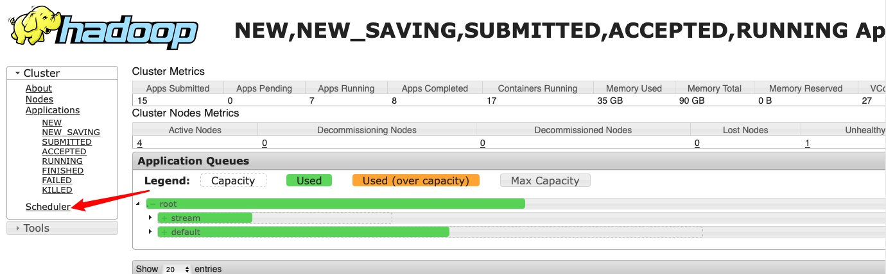
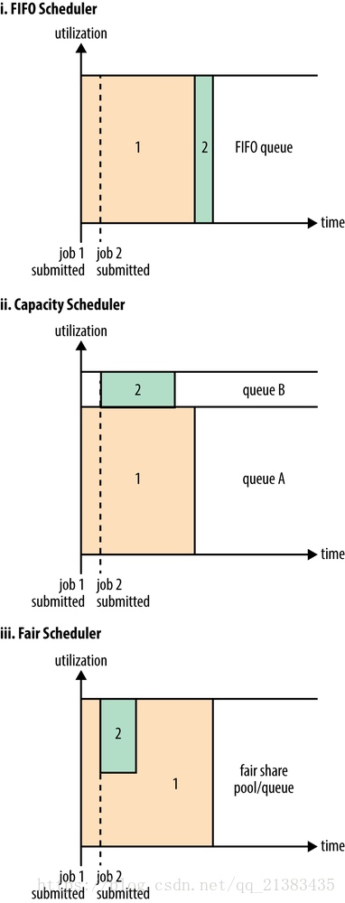

# 命令
## 用户命令
对于Hadoop集群用户很有用的命令：

### application
使用: yarn application [options]

|-命令选项|	描述|
| --- | --- |
|-list	|从RM返回的应用程序列表，<br>使用-appTypes参数，支持基于应用程序类型的过滤，<br>使用-appStates参数，支持对应用程序状态的过滤。|
|-appStates `<States>`	| 使用-list命令，基于应用程序的状态来过滤应用程序。<br>如果应用程序的状态有多个，用逗号分隔。 <br>有效的应用程序状态包含如下：<br> ALL, NEW, NEW_SAVING, SUBMITTED, ACCEPTED, <br>RUNNING, FINISHED, FAILED, KILLED|
|-appTypes `<Types>`	| 使用-list命令，基于应用程序类型来过滤应用程序。<br>如果应用程序的类型有多个，用逗号分隔。|
|-kill `<ApplicationId>`|	kill掉指定的应用程序。|
|-status `<ApplicationId>`|	打印应用程序的状态。|


```shell
./yarn application -list -appStates ACCEPTED
15/08/10 11:48:43 INFO client.RMProxy: Connecting to ResourceManager at hadoop1/10.0.1.41:8032
Total number of applications (application-types: [] and states: [ACCEPTED]):1
Application-Id	                Application-Name Application-Type User	 Queue	 State	  Final-State Progress Tracking-URL
application_1438998625140_1703	MAC_STATUS	 MAPREDUCE	  hduser default ACCEPTED UNDEFINED   0%       N/A

```

### applicationattempt
打印应用程序尝试的报告。
使用: yarn applicationattempt [options]

|命令选项	|描述|
| --- | --- |
|-help|	帮助|
|-list `<ApplicationId>	`|获取到应用程序尝试的列表，其返回值`ApplicationAttempt-Id` 等于 `<Application Attempt Id>`|
|-status `<Application Attempt Id>`|打印应用程序尝试的状态。|

### classpath
使用: yarn classpath
打印需要得到Hadoop的jar和所需要的lib包路径

### container

使用: yarn container [options]

|命令选项	|描述|
| --- | --- |
|-help|	帮助|
|-list `<Application Attempt Id>`|	应用程序尝试的Containers列表|
|-status `<ContainerId>`|	打印Container的状态|

### jar

使用: yarn jar <jar> [mainClass] args...

运行jar文件，用户可以将写好的YARN代码打包成jar文件，用这个命令去运行它。

### logs
转存container的日志。

使用: yarn logs -applicationId <application ID> [options]

**注：应用程序没有完成，该命令是不能打印日志的。**

|命令选项	|描述|
| --- | --- |
|-applicationId `<application ID>`|	指定应用程序ID，应用程序的ID可以在yarn.resourcemanager.webapp.address<br>配置的路径查看（即：ID）|
|-appOwner `<AppOwner>`	|应用的所有者（如果没有指定就是当前用户）应用程序的ID<br>可以在yarn.resourcemanager.webapp.address配置的路径查看（即：User）|
|-containerId `<ContainerId>`	|Container Id|
|-help	|帮助|
|-nodeAddress `<NodeAddress>`|节点地址的格式：nodename:port （端口是配置文件<br>中:yarn.nodemanager.webapp.address参数指定）|

#### Log aggregation has not completed or is not enabled.处理
解决方法：yarn-site.xml

```xml
<!--log-->
 <property>
        <name>yarn.log-aggregation-enable</name>
        <value>true</value>
 </property>
 <property>
        <name>yarn.nodemanager.log-aggregation.roll-monitoring-interval-seconds</name>
        <value>3600</value>
 </property>
 <property>
        <name>yarn.nodemanager.remote-app-log-dir</name>
        <value>/tmp/logs</value>
 </property>

```

sbin/stop-all.sh
sbin/start-all.sh

还有一种可能是hdfs上日志目录有问题


### node

使用: yarn node [options]

|命令选项|描述|
| --- | --- |
|-list|列出所有RUNNING状态的节点。支持-states选项过滤指定的状态，<br>节点的状态包含：<br>NEW，RUNNING，UNHEALTHY，DECOMMISSIONED，LOST，REBOOTED。<br>支持-all显示所有的节点。|
|-all	|所有的节点，不管是什么状态的，需和-list一起使用，单独使用无效|
|-states `<States>`	|和-list配合使用，用逗号分隔节点状态，只显示这些状态的节点信息。|
|-status `<NodeId>	`|打印指定节点的状态。|

### queue
打印队列信息。

使用: yarn queue [options]

|命令选项|描述|
| --- | --- |
|-help|	帮助|
|-status `<QueueName>`|	打印队列的状态|

 

### version
打印hadoop的版本。

使用: yarn version


## 管理员命令
下列这些命令对hadoop集群的管理员是非常有用的。

### daemonlog

针对指定的守护进程，获取/设置日志级别.

使用:
  
```shell
yarn daemonlog -getlevel <host:httpport> <classname> 
yarn daemonlog -setlevel <host:httpport> <classname> <level>
```
|命令选项|描述|
| --- | --- |
|-getlevel `<host:httpport> <classname>`|	打印运行在`<host:port>`的守护进程的日志级别。<br>这个命令内部会连接`http://<host:port>/logLevel?log=<name>`|
|-setlevel `<host:httpport> <classname> <level>`|	设置运行在`<host:port>`的守护进程的日志级别。<br>这个命令内部会连接`http://<host:port>/logLevel?log=<name>`|

### nodemanager

使用: yarn nodemanager

启动NodeManager

### proxyserver

使用: yarn proxyserver

启动web proxy server

### resourcemanager

使用: 
`yarn resourcemanager [-format-state-store]`

|命令选项|描述|
| --- | --- |
|-format-state-store	|RMStateStore的格式. 如果过去的应用程序不再需要，则清理RMStateStore， <br>RMStateStore仅仅在ResourceManager没有运行的时候，<br>才运行RMStateStore启动ResourceManager|

### rmadmin

使用:

```shell
yarn rmadmin   [-refreshQueues]
               [-refreshNodes]
               [-refreshUserToGroupsMapping] 
               [-refreshSuperUserGroupsConfiguration]
               [-refreshAdminAcls] 
               [-refreshServiceAcl]
               [-getGroups [username]]
               [-transitionToActive [--forceactive] [--forcemanual] <serviceId>]
               [-transitionToStandby [--forcemanual] <serviceId>]
               [-failover [--forcefence] [--forceactive] <serviceId1> <serviceId2>]
               [-getServiceState <serviceId>]
               [-checkHealth <serviceId>]
               [-help [cmd]]

```

|命令选项|描述|
| --- | --- |
| -refreshQueues	| 重载队列的ACL，状态和调度器特定的属性，<br>ResourceManager将重载mapred-queues配置文件| 
| -refreshNodes	| 动态刷新dfs.hosts和dfs.hosts.exclude配置，<br>无需重启NameNode。<br>dfs.hosts：列出了允许连入NameNode的datanode清单（IP或者机器名）<br>dfs.hosts.exclude：列出了禁止连入NameNode的datanode清单（IP或者机器名）重新读取hosts和exclude文件，<br>更新允许连到Namenode的或那些需要退出或入编的Datanode的集合。| 
| -refreshUserToGroupsMappings| 	刷新用户到组的映射。| 
| -refreshSuperUserGroupsConfiguration| 	刷新用户组的配置| 
| -refreshAdminAcls	| 刷新ResourceManager的ACL管理| 
| -refreshServiceAcl	| ResourceManager重载服务级别的授权文件。| 
| -getGroups [username]| 	获取指定用户所属的组。| 
| -transitionToActive [–forceactive] [–forcemanual] <serviceId>| 	尝试将目标服务转为 Active 状态。如果使用了–forceactive选项，不需要核对非Active节点。如果采用了自动故障转移，这个命令不能使用。虽然你可以重写–forcemanual选项，你需要谨慎。| 
| -transitionToStandby [–forcemanual] <serviceId>| 	将服务转为 Standby 状态. 如果采用了自动故障转移，这个命令不能使用。虽然你可以重写–forcemanual选项，你需要谨慎。| 
| -failover [–forceactive] <serviceId1> <serviceId2>| 	启动从serviceId1 到 serviceId2的故障转移。如果使用了-forceactive选项，即使服务没有准备，也会尝试故障转移到目标服务。如果采用了自动故障转移，这个命令不能使用。| 
| -getServiceState <serviceId>| 	返回服务的状态。（注：ResourceManager不是HA的时候，时不能运行该命令的）| 
| -checkHealth <serviceId>	| 请求服务器执行健康检查，如果检查失败，RMAdmin将用一个非零标示退出。（注：ResourceManager不是HA的时候，时不能运行该命令的）| 
| -help [cmd]	| 显示指定命令的帮助，如果没有指定，则显示命令的帮助。| 
 

### scmadmin

使用: yarn scmadmin [options]

|命令选项|描述|
| --- | --- |
|-help|	Help|
|-runCleanerTask|	Runs the cleaner task<br>Runs Shared Cache Manager admin client|

### sharedcachemanager
启动Shared Cache Manager

使用: yarn sharedcachemanager

### timelineserver
启动TimeLineServer

之前yarn运行框架只有Job history server，这是hadoop2.4版本之后加的通用Job History Server，命令为Application Timeline Server，详情请看：The YARN Timeline Server

使用: yarn timelineserver


# 调度器配置和使用

[参考文档](https://blog.csdn.net/fengfengchen95/article/details/91987761)

## 查看


通过ResourceManager的web页面里的Scheduler查看调度器使用情况

## 调度器的选择
在Yarn中有三种调度器可以选择：FIFO Scheduler ，Capacity Scheduler，FairS cheduler。

### FIFO Scheduler

FIFO Scheduler把应用按提交的顺序排成一个队列，这是一个先进先出队列，在进行资源分配的时候，先给队列中最头上的应用进行分配资源，待最头上的应用需求满足后再给下一个分配，以此类推。

FIFO Scheduler是最简单也是最容易理解的调度器，也不需要任何配置，但它并不适用于共享集群。大的应用可能会占用所有集群资源，这就导致其它应用被阻塞。在共享集群中，更适合采用Capacity Scheduler或Fair Scheduler，这两个调度器都允许大任务和小任务在提交的同时获得一定的系统资源。

下面“Yarn调度器对比图”展示了这几个调度器的区别，从图中可以看出，在FIFO 调度器中，小任务会被大任务阻塞。


### Capacity Scheduler

而对于Capacity调度器，有一个专门的队列用来运行小任务，但是为小任务专门设置一个队列会预先占用一定的集群资源，这就导致大任务的执行时间会落后于使用FIFO调度器时的时间。

### FairS cheduler

在Fair调度器中，我们不需要预先占用一定的系统资源，Fair调度器会为所有运行的job动态的调整系统资源。如下图所示，当第一个大job提交时，只有这一个job在运行，此时它获得了所有集群资源；当第二个小任务提交后，Fair调度器会分配一半资源给这个小任务，让这两个任务公平的共享集群资源。

需要注意的是，在下图Fair调度器中，从第二个任务提交到获得资源会有一定的延迟，因为它需要等待第一个任务释放占用的Container。小任务执行完成之后也会释放自己占用的资源，大任务又获得了全部的系统资源。最终的效果就是Fair调度器即得到了高的资源利用率又能保证小任务及时完成。

### Yarn调度器对比图


## capacity调度器

### 什么是capacity调度器

Capacity 调度器允许多个组织共享整个集群，每个组织可以获得集群的一部分计算能力。通过为每个组织分配专门的队列，然后再为每个队列分配一定的集群资源，这样整个集群就可以通过设置多个队列的方式给多个组织提供服务了。除此之外，队列内部又可以垂直划分，这样一个组织内部的多个成员就可以共享这个队列资源了，**在一个队列内部，资源的调度是采用的是先进先出(FIFO)策略**。

通过上面那幅图，我们已经知道一个job可能使用不了整个队列的资源。然而如果这个队列中运行多个job，如果这个队列的资源够用，那么就分配给这些job，如果这个队列的资源不够用了呢？其实Capacity调度器仍可能分配额外的资源给这个队列，这就是“弹性队列”(queue elasticity)的概念。

在正常的操作中，Capacity调度器不会强制释放Container，当一个队列资源不够用时，这个队列只能获得其它队列释放后的Container资源。当然，我们可以为队列设置一个最大资源使用量，以免这个队列过多的占用空闲资源，导致其它队列无法使用这些空闲资源，这就是”弹性队列”需要权衡的地方。

Capacity调度器说的通俗点，可以理解成一个个的资源队列。这个资源队列是用户自己去分配的。比如我大体上把整个集群分成了AB两个队列，A队列给A项目组的人来使用。B队列给B项目组来使用。但是A项目组下面又有两个方向，那么还可以继续分，比如专门做BI的和做实时分析的。那么队列的分配就可以参考下面的树形结构

```
root
------a[60%]
      |---a.bi[40%]
      |---a.realtime[60%]
------b[40%]
```

a队列占用整个资源的60%，b队列占用整个资源的40%。a队列里面又分了两个子队列，一样也是2:3分配。

虽然有了这样的资源分配，但是并不是说a提交了任务，它就只能使用60%的资源，那40%就空闲着。只要资源是在空闲状态，那么a就可以使用100%的资源。但是一旦b提交了任务，a就需要在释放资源后，把资源还给b队列，直到ab平衡在3:2的比例。

粗粒度上资源是按照上面的方式进行，在每个队列的内部，还是按照FIFO的原则来分配资源的。

### 特性

capacity调度器具有以下的几个特性：

* 层次化的队列设计，这种层次化的队列设计保证了子队列可以使用父队列设置的全部资源。这样通过层次化的管理，更容易合理分配和限制资源的使用。
* 容量保证，队列上都会设置一个资源的占比，这样可以保证每个队列都不会占用整个集群的资源。
* 安全，每个队列有严格的访问控制。用户只能向自己的队列里面提交任务，而且不能修改或者访问其他队列的任务。
* 弹性分配，空闲的资源可以被分配给任何队列。当多个队列出现争用的时候，则会按照比例进行平衡。
* 多租户租用，通过队列的容量限制，多个用户就可以共享同一个集群，同时保证每个队列分配到自己的容量，提高利用率。
* 操作性，yarn支持动态修改调整容量、权限等的分配，可以在运行时直接修改。还提供了管理员界面，来显示当前的队列状况。管理员可以在运行时，添加一个队列；**但是不能删除一个队列**。管理员还可以在运行时暂停某个队列，这样可以保证当前的队列在执行过程中，集群不会接收其他的任务。如果一个队列被设置成了stopped，那么就不能向他或者子队列上提交任务了。
* 基于资源的调度，协调不同资源需求的应用程序，比如内存、CPU、磁盘等等。

### 调度器的配置

#### 配置调度器

在ResourceManager中配置它要使用的调度器，hadoop资源分配的默认配置

在搭建完成后我们发现对于资源分配方面，yarn的默认配置是这样的,也就是有一个默认的队列
事实上，是否使用CapacityScheduler组件是可以配置的，但是默认配置就是这个CapacityScheduler，如果想显式配置需要修改 conf/yarn-site.xml 内容如下：

```xml
<property>
    <name>yarn.resourcemanager.scheduler.class</name>
    <value>org.apache.hadoop.yarn.server.resourcemanager.scheduler.capacity.CapacityScheduler</value>
</property>
```

可以看到默认是org.apache.hadoop.yarn.server.resourcemanager.scheduler.capacity.CapacityScheduler这个调度器，那么这个调度器的名字是什么呢？

我们可以在/Users/lcc/soft/hadoop/hadoop-2.7.4/etc/hadoop/capacity-scheduler.xml文件中看到

```xml
<property>
    <name>yarn.scheduler.capacity.root.queues</name>
    <value>default</value>
    <description>
      The queues at the this level (root is the root queue).
    </description>
  </property>
```
可以看到默认的队列名字为default(知道名字有什么用？我们可以根据nameNode地址，和调度器名称，获取机器相关的信息，比如内存，磁盘，cpu等资源用了多少，还剩下多少)

配置说明

这里的配置项格式应该是yarn.scheduler.capacity..queues，也就是这里的root是一个queue-path，因为这里配置了value是default，所以root这个queue-path只有一个队列叫做default，那么有关default的具体配置都是形如下的配置项：

| 配置项 | 说明 |
| --- | --- |
| yarn.scheduler.capacity.root.default.capacity | 一个百分比的值，表示占用整个集群的百分之多少比例的资源，这个queue-path下所有的capacity之和是100 |
| yarn.scheduler.capacity.root.default.user-limit-factor | 每个用户的低保百分比，比如设置为1，则表示无论有多少用户在跑任务，每个用户占用资源最低不会少于1%的资源 |
| yarn.scheduler.capacity.root.default.maximum-capacity | 弹性设置，最大时占用多少比例资源 |
| yarn.scheduler.capacity.root.default.state | 队列状态，可以是RUNNING或STOPPED |
| yarn.scheduler.capacity.root.default.acl_submit_applications | 哪些用户或用户组可以提交任务 |
| yarn.scheduler.capacity.root.default.acl_administer_queue | 哪些用户或用户组可以管理队列 |
 
#### 配置队列

调度器的核心就是队列的分配和使用了，修改conf/capacity-scheduler.xml可以配置队列。

Capacity调度器默认有一个预定义的队列——root,所有的队列都是它的子队列。队列的分配支持层次化的配置，使用.来进行分割，比如yarn.scheduler.capacity.<queue-path>.queues.

下面是配置的样例，比如root下面有三个子队列:

```xml
<property>
  <name>yarn.scheduler.capacity.root.queues</name>
  <value>a,b,c</value>
  <description>The queues at the this level (root is the root queue).
  </description>
</property>
 
<property>
  <name>yarn.scheduler.capacity.root.a.queues</name>
  <value>a1,a2</value>
  <description>The queues at the this level (root is the root queue).
  </description>
</property>
 
<property>
  <name>yarn.scheduler.capacity.root.b.queues</name>
  <value>b1,b2,b3</value>
  <description>The queues at the this level (root is the root queue).
  </description>
</property>

```

上面的结构类似于：

```
root
------a[队列名字]
      |---a1[子队列名字]
      |---a2[子队列名字]
------b[队列名字]
	  |---b1[子队列名字]
      |---b2[子队列名字]
      |---b3[子队列名字]
------c[队列名字]
```

#### 队列属性

| 属性 | 说明 |
| --- | --- |
| yarn.scheduler.capacity..capacity | 它是队列的资源容量占比(百分比)。系统繁忙时，每个队列都应该得到设置的量的资源；当系统空闲时，该队列的资源则可以被其他的队列使用。同一层的所有队列加起来必须是100%。 |
| yarn.scheduler.capacity..maximum-capacity | 队列资源的使用上限。由于系统空闲时，队列可以使用其他的空闲资源，因此最多使用的资源量则是该参数控制。默认是-1，即禁用。 |
| yarn.scheduler.capacity..minimum-user-limit-percent | 每个任务占用的最少资源。比如，你设置成了25%。那么如果有两个用户提交任务，那么每个任务资源不超过50%。如果3个用户提交任务，那么每个任务资源不超过33%。如果4个用户提交任务，那么每个任务资源不超过25%。如果5个用户提交任务，那么第五个用户需要等待才能提交。默认是100，即不去做限制。 |
| yarn.scheduler.capacity..user-limit-factor | 每个用户最多使用的队列资源占比，如果设置为50.那么每个用户使用的资源最多就是50%。|

####  运行和提交应用限制

| 属性 | 说明 |
| --- | --- |
| yarn.scheduler.capacity.maximum-applications / yarn.scheduler.capacity..maximum-applications | 设置系统中可以同时运行和等待的应用数量。默认是10000. |
| yarn.scheduler.capacity.maximum-am-resource-percent / yarn.scheduler.capacity..maximum-am-resource-percent | 设置有多少资源可以用来运行app master，即控制当前激活状态的应用。默认是10%。 |

#### 队列管理

| 属性 | 说明 |
| --- | --- |
| yarn.scheduler.capacity..state | 队列的状态，可以使RUNNING或者STOPPED.如果队列是STOPPED状态，那么新应用不会提交到该队列或者子队列。同样，如果root被设置成STOPPED，那么整个集群都不能提交任务了。现有的应用可以等待完成，因此队列可以优雅的退出关闭。 |
| yarn.scheduler.capacity.root..acl_submit_applications | 访问控制列表ACL控制谁可以向该队列提交任务。如果一个用户可以向该队列提交，那么也可以提交任务到它的子队列。|
| yarn.scheduler.capacity.root..acl_administer_queue | 设置队列的管理员的ACL控制，管理员可以控制队列的所有应用程序。同样，它也具有继承性。 |

**注意**： ACL的设置是user1,user2 group1,group2这种格式。如果是则代表任何人。空格表示任何人都不允许。默认是.

#### 其他属性

| 属性 | 说明 |
| --- | --- |
| yarn.scheduler.capacity.resource-calculator | 资源计算方法，默认是org.apache.hadoop.yarn.util.resource.DefaultResourseCalculator,它只会计算内存。DominantResourceCalculator则会计算内存和CPU。 |
| yarn.scheduler.capacity.node-locality-delay | 调度器尝试进行调度的次数。一般都是跟集群的节点数量有关。默认40（一个机架上的节点数）|

#### web接口

一旦设置完这些队列属性，就可以在web ui上看到了。可以访问下面的连接：
http://localhost:8088/ws/v1/cluster/scheduler

```xml
<?xml version="1.0" encoding="utf-8"?>
 
<scheduler> 
  <schedulerInfo xmlns:xsi="http://www.w3.org/2001/XMLSchema-instance" xsi:type="capacityScheduler">  
    <capacity>100.0</capacity>  
    <usedCapacity>0.0</usedCapacity>  
    <maxCapacity>100.0</maxCapacity>  
    <queueName>root</queueName>  
    <queues> 
      <queue xsi:type="capacitySchedulerLeafQueueInfo"> 
        <capacity>100.0</capacity>  
        <usedCapacity>0.0</usedCapacity>  
        <maxCapacity>100.0</maxCapacity>  
        <absoluteCapacity>100.0</absoluteCapacity>  
        <absoluteMaxCapacity>100.0</absoluteMaxCapacity>  
        <absoluteUsedCapacity>0.0</absoluteUsedCapacity>  
        <numApplications>0</numApplications>  
        <queueName>default</queueName>  
        <state>RUNNING</state>  
        <resourcesUsed> 
          <memory>0</memory>  
          <vCores>0</vCores> 
        </resourcesUsed>  
        <hideReservationQueues>false</hideReservationQueues>  
        <nodeLabels>*</nodeLabels>  
        <numActiveApplications>0</numActiveApplications>  
        <numPendingApplications>0</numPendingApplications>  
        <numContainers>0</numContainers>  
        <maxApplications>10000</maxApplications>  
        <maxApplicationsPerUser>10000</maxApplicationsPerUser>  
        <userLimit>100</userLimit>  
        <users/>  
        <userLimitFactor>1.0</userLimitFactor>  
        <AMResourceLimit> 
          <memory>1024</memory>  
          <vCores>1</vCores> 
        </AMResourceLimit>  
        <usedAMResource> 
          <memory>0</memory>  
          <vCores>0</vCores> 
        </usedAMResource>  
        <userAMResourceLimit> 
          <memory>1024</memory>  
          <vCores>1</vCores> 
        </userAMResourceLimit>  
        <preemptionDisabled>true</preemptionDisabled> 
      </queue> 
    </queues> 
  </schedulerInfo> 
</scheduler>
```
这里<queueName>default</queueName> 队列名称很重要，我们可以根据它获取相关信息，自己写调度器

#### 修改队列配置

如果想要修改队列或者调度器的配置，可以修改

`vi $HADOOP_CONF_DIR/capacity-scheduler.xml`

修改完成后，需要执行下面的命令：

`$HADOOP_YARN_HOME/bin/yarn rmadmin -refreshQueues`

#### 注意

* 队列不能被删除，只能新增。
* 更新队列的配置需要是有效的值
* 同层级的队列容量限制相加需要等于100%

### app指定要使用的队列

spark在submit脚本里加--queue 队列名
flink在yarn-session.sh或者flink run脚本里使用-qu或者--queue 队列名