# kafka
[kafka](../消息队列/kafka.md)
# zookeeper
## 1.ZooKeeper是什么？
ZooKeeper是一个分布式的，开放源码的分布式应用程序协调服务，是Google的Chubby一个开源的实现，它是集群的管理者，监视着集群中各个节点的状态根据节点提交的反馈进行下一步合理操作。最终，将简单易用的接口和性能高效、功能稳定的系统提供给用户。
客户端的**读请求可以被集群中的任意一台机器处理**，如果读请求在节点上注册了监听器，这个监听器也是由所连接的zookeeper机器来处理。**对于写请求，这些请求会同时发给其他zookeeper机器并且达成一致后，请求才会返回成功**。因此，**随着zookeeper的集群机器增多，读请求的吞吐会提高但是写请求的吞吐会下降**。
有序性是zookeeper中非常重要的一个特性，所有的更新都是全局有序的，每个更新都有一个唯一的时间戳，这个时间戳称为zxid（Zookeeper Transaction Id）。而读请求只会相对于更新有序，也就是读请求的返回结果中会带有这个zookeeper最新的zxid。

## 2.ZooKeeper提供了什么？
1、文件系统
2、通知机制

## 3.Zookeeper文件系统
Zookeeper提供一个多层级的节点命名空间（节点称为znode）。与文件系统不同的是，这些节点都可以设置关联的数据，而文件系统中**只有文件节点可以存放数据而目录节点不行**。Zookeeper为了保证高吞吐和低延迟，在内存中维护了这个树状的目录结构，这种特性使得**Zookeeper不能用于存放大量的数据**，每个节点的存放数据上限为**1M**。

## 4.四种类型的znode
1. PERSISTENT-持久化目录节点 
    客户端与zookeeper断开连接后，该节点依旧存在 
2. PERSISTENT_SEQUENTIAL-持久化顺序编号目录节点
    客户端与zookeeper断开连接后，该节点依旧存在，只是Zookeeper给该节点名称进行顺序编号 
3. EPHEMERAL-临时目录节点
    客户端与zookeeper断开连接后，该**节点被删除** 
4. EPHEMERAL_SEQUENTIAL-临时顺序编号目录节点
    客户端与zookeeper断开连接后，该节点被删除，只是Zookeeper给该节点名称进行顺序编号

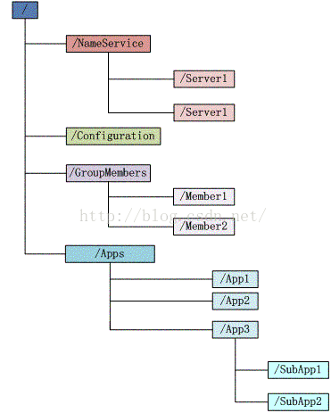

## 5.Zookeeper通知机制
client端会对某个znode建立一个**watcher事件**，当该znode发生变化时，这些c**lient会收到zk的通知**，然后client可以根据znode变化来做出业务上的改变等。

## 6.Zookeeper能做什么？
1. 命名服务
2. 配置管理
3. 集群管理
4. 分布式锁
5. 队列管理

## 7.zk的命名服务（文件系统）
命名服务是指通过指定的名字来获取资源或者服务的地址，利用zk创建一个全局的路径，即是唯一的路径，这个路径就可以作为一个名字，指向集群中的集群，提供的服务的地址，或者一个远程的对象等等。

## 8.zk的配置管理（文件系统、通知机制）
程序分布式的部署在不同的机器上，将程序的配置信息放在zk的znode下，当有配置发生改变时，也就是znode发生变化时，可以通过改变zk中某个目录节点的内容，利用watcher通知给各个客户端，从而更改配置。

## 9.Zookeeper集群管理（文件系统、通知机制）
所谓集群管理无在乎两点：是否有机器退出和加入、选举master。 
对于第一点，所有机器约定在父目录下创建临时目录节点，然后监听父目录节点的子节点变化消息。一旦有机器挂掉，该机器与 zookeeper的连接断开，其所创建的临时目录节点被删除，所有其他机器都收到通知：某个兄弟目录被删除，于是，所有人都知道：它上船了。
新机器加入也是类似，所有机器收到通知：新兄弟目录加入，highcount又有了。

对于第二点，我们稍微改变一下，所有机器创建**临时顺序编号**目录节点，每次选取编号最小的机器作为master就好。

## 10.Zookeeper分布式锁（文件系统、通知机制）
有了zookeeper的一致性文件系统，锁的问题变得容易。锁服务可以分为两类，一个是保持独占，另一个是控制时序。 
对于第一类，我们将zookeeper上的一个znode看作是一把锁，通过**createznode**的方式来实现。所有客户端都去创建 /distribute_lock 节点，最终**成功创建的那个客户端也即拥有了这把锁**。用完删除掉自己创建的distribute_lock 节点就释放出锁。 

对于第二类， /distribute_lock 已经预先存在，所有客户端在它下面创建临时顺序编号目录节点，和选master一样，编号最小的获得锁，用完删除，依次方便。

11.获取分布式锁的流程

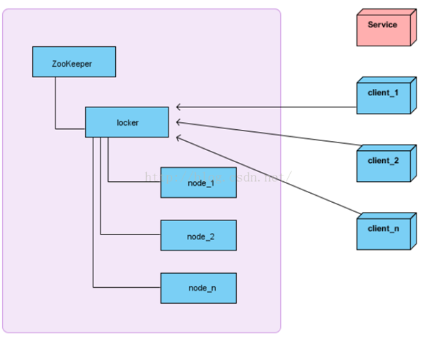

在获取分布式锁的时候在locker节点下创建临时顺序节点，释放锁的时候删除该临时节点。客户端调用createNode方法在locker下创建临时顺序节点，
然后调用getChildren(“locker”)来获取locker下面的所有子节点，注意此时不用设置任何Watcher。客户端获取到所有的子节点path之后，如果发现自己创建的节点在所有创建的子节点序号最小，那么就认为该客户端获取到了锁。如果发现自己创建的节点并非locker所有子节点中最小的，说明自己还没有获取到锁，此时客户端需要找到比自己小的那个节点，然后对其调用exist()方法，同时对其注册事件监听器。之后，让这个被关注的节点删除，则客户端的Watcher会收到相应通知，此时再次判断自己创建的节点是否是locker子节点中序号最小的，如果是则获取到了锁，如果不是则重复以上步骤继续获取到比自己小的一个节点并注册监听。当前这个过程中还需要许多的逻辑判断。

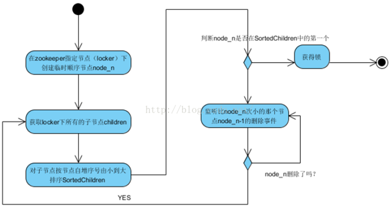

代码的实现主要是基于互斥锁，获取分布式锁的重点逻辑在于BaseDistributedLock，实现了基于Zookeeper实现分布式锁的细节。

## 12.Zookeeper队列管理（文件系统、通知机制）
两种类型的队列：
1、同步队列，当一个队列的成员都聚齐时，这个队列才可用，否则一直等待所有成员到达。 
2、队列按照 FIFO 方式进行入队和出队操作。 

第一类，在约定目录下创建临时目录节点，监听节点数目是否是我们要求的数目。 

第二类，和分布式锁服务中的控制时序场景基本原理一致，入列有编号，出列按编号。在特定的目录下创建PERSISTENT_SEQUENTIAL节点，创建成功时Watcher通知等待的队列，队列删除序列号最小的节点用以消费。此场景下Zookeeper的znode用于消息存储，znode存储的数据就是消息队列中的消息内容，SEQUENTIAL序列号就是消息的编号，按序取出即可。由于创建的节点是持久化的，所以不必担心队列消息的丢失问题。

## 13.Zookeeper数据复制
Zookeeper作为一个集群提供一致的数据服务，自然，它要在所有机器间做数据复制。数据复制的好处： 
1、容错：一个节点出错，不致于让整个系统停止工作，别的节点可以接管它的工作； 
2、提高系统的扩展能力 ：把负载分布到多个节点上，或者增加节点来提高系统的负载能力； 
3、提高性能：让客户端本地访问就近的节点，提高用户访问速度。

从客户端读写访问的透明度来看，数据复制集群系统分下面两种： 
1、写主(WriteMaster) ：对数据的修改提交给指定的节点。读无此限制，可以读取任何一个节点。这种情况下客户端需要对读与写进行区别，俗称读写分离； 
2、写任意(Write Any)：对数据的修改可提交给任意的节点，跟读一样。这种情况下，客户端对集群节点的角色与变化透明。

对zookeeper来说，它采用的方式是写任意。通过增加机器，它的读吞吐能力和响应能力扩展性非常好，而写，随着机器的增多吞吐能力肯定下降（这也是它建立observer的原因），而响应能力则取决于具体实现方式，是延迟复制保持最终一致性，还是立即复制快速响应。

## 14.Zookeeper工作原理
Zookeeper 的核心是**原子广播**，这个机制保证了各个Server之间的同步。实现这个机制的协议叫做Zab协议。Zab协议有两种模式，它们分别是恢复模式（选主）和广播模式（同步）。当服务启动或者在领导者崩溃后，Zab就进入了恢复模式，当领导者被选举出来，且大多数Server完成了和 leader的状态同步以后，恢复模式就结束了。状态同步保证了leader和Server具有相同的系统状态。

## 15.zookeeper是如何保证事务的顺序一致性的？
zookeeper采用了**递增的事务Id**来标识，所有的proposal（提议）都在被提出的时候加上了zxid，zxid实际上是一个64位的数字，高32位是epoch（时期; 纪元; 世; 新时代）用来标识leader是否发生改变，如果有新的leader产生出来，epoch会自增，低32位用来递增计数。当新产生proposal的时候，会依据数据库的两阶段过程，首先会向其他的server发出事务执行请求，如果超过半数的机器都能执行并且能够成功，那么就会开始执行。

## 16.Zookeeper 下 Server工作状态
每个Server在工作过程中有三种状态： 
LOOKING：当前Server不知道leader是谁，正在搜寻
LEADING：当前Server即为选举出来的leader
FOLLOWING：leader已经选举出来，当前Server与之同步

## 17.zookeeper是如何选取主leader的？
当leader崩溃或者leader失去大多数的follower，这时zk进入恢复模式，恢复模式需要重新选举出一个新的leader，让所有的Server都恢复到一个正确的状态。Zk的选举算法有两种：一种是基于basic paxos实现的，另外一种是基于fast paxos算法实现的。系统默认的选举算法为fast paxos。

## 1、Zookeeper选主流程(basic paxos)
（1）选举线程由当前Server发起选举的线程担任，其主要功能是对投票结果进行统计，并选出推荐的Server； 
（2）选举线程首先向所有Server发起一次询问(包括自己)； 
（3）选举线程收到回复后，验证是否是自己发起的询问(验证zxid是否一致)，然后获取对方的id(myid)，并存储到当前询问对象列表中，最后获取对方提议的leader相关信息(id,zxid)，并将这些信息存储到当次选举的投票记录表中； 
（4）收到所有Server回复以后，就计算出zxid最大的那个Server，并将这个Server相关信息设置成下一次要投票的Server； 
（5）线程将当前zxid最大的Server设置为当前Server要推荐的Leader，如果此时获胜的Server获得n/2 + 1的Server票数，设置当前推荐的leader为获胜的Server，将根据获胜的Server相关信息设置自己的状态，否则，继续这个过程，直到leader被选举出来。 通过流程分析我们可以得出：要使Leader获得多数Server的支持，则Server总数必须是奇数2n+1，且存活的Server的数目不得少于n+1. 每个Server启动后都会重复以上流程。在恢复模式下，如果是刚从崩溃状态恢复的或者刚启动的server还会从磁盘快照中恢复数据和会话信息，zk会记录事务日志并定期进行快照，方便在恢复时进行状态恢复。

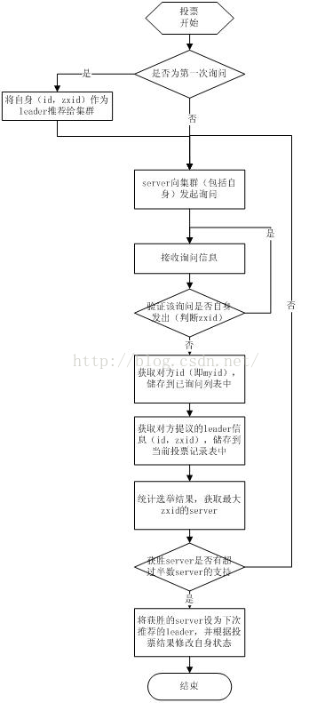

## 2、Zookeeper选主流程(basic paxos)
fast paxos流程是在选举过程中，某Server首先向所有Server提议自己要成为leader，当其它Server收到提议以后，解决epoch和 zxid的冲突，并接受对方的提议，然后向对方发送接受提议完成的消息，重复这个流程，最后一定能选举出Leader。

## 18.Zookeeper同步流程
选完Leader以后，zk就进入状态同步过程。 
1、Leader等待server连接； 
2、Follower连接leader，将最大的zxid发送给leader； 
3、Leader根据follower的zxid确定同步点； 
4、完成同步后通知follower 已经成为uptodate状态； 
5、Follower收到uptodate消息后，又可以重新接受client的请求进行服务了。

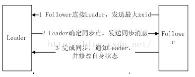

## 19.分布式通知和协调
对于系统调度来说：操作人员发送通知实际是通过控制台改变某个节点的状态，然后zk将这些变化发送给注册了这个节点的watcher的所有客户端。
对于执行情况汇报：每个工作进程都在某个目录下创建一个临时节点。并携带工作的进度数据，这样汇总的进程可以监控目录子节点的变化获得工作进度的实时的全局情况。

## 20.机器中为什么会有leader？
在分布式环境中，有些业务逻辑只需要集群中的某一台机器进行执行，其他的机器可以共享这个结果，这样可以大大减少重复计算，提高性能，于是就需要进行leader选举。

## 21.zk节点宕机如何处理？
Zookeeper本身也是集群，推荐配置不少于3个服务器。Zookeeper自身也要保证当一个节点宕机时，其他节点会继续提供服务。
如果是一个Follower宕机，还有2台服务器提供访问，因为Zookeeper上的数据是有多个副本的，数据并不会丢失；
如果是一个Leader宕机，Zookeeper会选举出新的Leader。
ZK集群的机制是只要超过半数的节点正常，集群就能正常提供服务。只有在ZK节点挂得太多，只剩一半或不到一半节点能工作，集群才失效。
所以
3个节点的cluster可以挂掉1个节点(leader可以得到2票>1.5)
2个节点的cluster就不能挂掉任何1个节点了(leader可以得到1票<=1)

## 22.zookeeper负载均衡和nginx负载均衡区别
zk的负载均衡是可以调控，nginx只是能调权重，其他需要可控的都需要自己写插件；但是nginx的吞吐量比zk大很多，应该说按业务选择用哪种方式。

## 23.zookeeper watch机制
Watch机制官方声明：一个Watch事件是一个一次性的触发器，当被设置了Watch的数据发生了改变的时候，则服务器将这个改变发送给设置了Watch的客户端，以便通知它们。
Zookeeper机制的特点：
1. 一次性触发数据发生改变时，一个watcher event会被发送到client，但是client只会收到一次这样的信息。
2. watcher event异步发送watcher的通知事件从server发送到client是异步的，这就存在一个问题，不同的客户端和服务器之间通过socket进行通信，由于网络延迟或其他因素导致客户端在不通的时刻监听到事件，由于Zookeeper本身提供了ordering guarantee，即客户端监听事件后，才会感知它所监视znode发生了变化。所以我们使用Zookeeper不能期望能够监控到节点每次的变化。Zookeeper只能保证最终的一致性，而无法保证强一致性。
3. 数据监视Zookeeper有数据监视和子数据监视getdata() and exists()设置数据监视，getchildren()设置了子节点监视。
4. 注册watcher getData、exists、getChildren
5. 触发watcher create、delete、setData
6. setData()会触发znode上设置的data watch（如果set成功的话）。一个成功的create() 操作会触发被创建的znode上的数据watch，以及其父节点上的child watch。而一个成功的delete()操作将会同时触发一个znode的data watch和child watch（因为这样就没有子节点了），同时也会触发其父节点的child watch。
7. 当一个客户端连接到一个新的服务器上时，watch将会被以任意会话事件触发。当与一个服务器失去连接的时候，是无法接收到watch的。而当client重新连接时，如果需要的话，所有先前注册过的watch，都会被重新注册。通常这是完全透明的。只有在一个特殊情况下，watch可能会丢失：对于一个未创建的znode的exist watch，如果在客户端断开连接期间被创建了，并且随后在客户端连接上之前又删除了，这种情况下，这个watch事件可能会被丢失。
8. Watch是轻量级的，其实就是本地JVM的Callback，服务器端只是存了是否有设置了Watcher的布尔类型
---

# flume
## Flume的工作机制是什么

核心概念是agent，里面包括source，channel和sink三个组件。

Source运行在日志收集节点进行日志采集，之后临时存储在channel中，sink负责将channel中的数据发送到目的地。

只有发送成功channel中的数据才会被删除。

首先书写flume配置文件，定义agent、source、channel和sink然后将其组装，执行flume-ng命令。

---
# 数据库
## mysql，mongodb，rides的端口

面试数据库介绍的再好，不知到默认端口，也证明你没有经验。mysql：3306，mongdb：27017，rides：6379。

## 事务隔离级别
## 为什么需要事务隔离
首先是事务并发可能造成的结果和出现的原因：

|并发访问的问题|	含义|出现原因|
| --- | --- | --- |
|脏读	|一个事务读取到了另一个事务中尚未提交的数据| 读到未提交更新数据， 就是读到另一个事务未提交数据， 就是脏数据|
|不可重复读|	一个事务中两次读取的数据**内容不一致**， 要求的是一个事务中多次读取时数据是一致的， 这是事务update时引发的问题| 对同一记录两次读取不一致， 因为另一事务对该记录做了修改|
|幻读|	一个事务中两次读取的数据的**数量不一致**， 要求在一个事务多次读取的数据的数量是一致的， 这是insert或delete时引发的问题| 对同一张表的两次查询不一致， 因为另一事务插入了一条数据|
|第一类丢失更新 (lost update)|在完全未隔离事务的情况下， 两个事务更新同一条数据资源， 某一事务异常终止， 回滚造成第一个完成的更新也同时丢失|更新引起|
|第二类丢失更新 (second lost updates)|是不可重复读的特殊情况， 如果两个事务都读取同一行， 然后两个都进行写操作，并提交， 第一个事务所做的改变就会丢失|更新引起|

## MySQL数据库有四种隔离级别

上面的级别最低，下面的级别最高。“是”表示会出现这种问题，“否”表示不会出现这种问题。

|级别	|名字	|隔离级别	|脏读	|不可重复读|	幻读|	数据库默认隔离级别|
| --- | --- | --- | --- | --- | --- | --- |
|1|	可读未提交	|read uncommitted|	是	|是|	是	| |
|2	|可读已提交|	read committed|	否|	是|	是	|Oracle和SQL Server|
|3|	可重复读|	repeatable read|	否	|否|	是|	MySQL|
|4	|串行化	|serializable|	否	|否|	否	|

---
# 数据
## 数据来源的方式
1. webServer ：用户访问我们的网站，对日志进行收集，记录在反向的日志文件里 tomcat下logs
2. js代码嵌入前端页面（埋点）：js的sdk会获取用户行为，document会得到元素调用function，通过ngix集群进行日志收集。
3. db数据订阅工具，如开源的maxwell，canal等

# redis
## 知识点
1. 使用Redis有哪些好处？

1. 速度快，因为数据存在内存中，类似于HashMap，HashMap的优势就是查找和操作的时间复杂度都是O1. 
2. 支持丰富数据类型，支持string，list，set，sorted set，hash 
3. 支持事务，操作都是原子性，所谓的原子性就是对数据的更改要么全部执行，要么全部不执行 
4. 丰富的特性：可用于缓存，消息，按key设置过期时间，过期后将会自动删除

2. redis和memcached的区别和优势
区别：
1. 存储方式
Memecache把数据全部存在内存之中，断电后会挂掉，数据不能超过内存大小。
Redis有部份存在硬盘上，这样能保证数据的持久性。

1. 数据支持类型
Memcache对数据类型支持相对简单。
Redis有复杂的数据类型。

1. 使用底层模型不同
它们之间底层实现方式 以及与客户端之间通信的应用协议不一样。
Redis直接自己构建了VM 机制 ，因为一般的系统调用系统函数的话，会浪费一定的时间去移动和请求。

优势
1. value大小
redis最大可以达到1GB，而memcache只有1MB
1. memcached所有的值均是简单的字符串，redis作为其替代者，支持更为丰富的数据类型 
2. redis的速度比memcached快很多 
3. redis可以持久化其数据

3. redis常见性能问题和解决方案：

1. Master最好不要做任何持久化工作，如RDB内存快照和AOF日志文件 
2. 如果数据比较重要，某个Slave开启AOF备份数据，策略设置为每秒同步一次 
3. 为了主从复制的速度和连接的稳定性，Master和Slave最好在同一个局域网内 
4. 尽量避免在压力很大的主库上增加从库 
5. 主从复制不要用图状结构，用单向链表结构更为稳定，即：Master <- Slave1 <- Slave2 <- Slave3… 
这样的结构方便解决单点故障问题，实现Slave对Master的替换。如果Master挂了，可以立刻启用Slave1做Master，其他不变。

1. redis的内存淘汰策略和机制
如问题MySQL里有2000w数据，redis中只存20w的数据，如何保证redis中的数据都是热点数据，这种情况就可以使用redis的最近最少使用的数据淘汰机制

相关知识：在redis中，我们是可以去设置最大使用内存大小server.maxmemory的，当redis内存数据集大小上升到一定程度的时候，就会施行数据淘汰机制。
如果一次需要使用很多的内存（比如一次写入一个很大的set），那么，Redis的内存使用**可能超出最大内存限制一段时间**。

Redis提供了以下6种数据淘汰策略：
* voltile-lru：从已设置过期时间的数据集（server.db[i].expires）中挑选最近最少使用的数据淘汰
* volatile-ttl：从已设置过期时间的数据集（server.db[i].expires）中挑选将要过期的数据淘汰
* volatile-random：从已设置过期时间的数据集（server.db[i].expires）中任意选择数据淘汰
* allkeys-lru：从数据集（server.db[i].dict）中挑选最近最少使用的数据淘汰
* allkeys-random：从数据集（server.db[i].dict）中任意选择数据淘汰
* no-enviction（驱逐）：禁止驱逐数据

LRU机制：
redis保存了lru计数器server.lruclock,会定时的去更新（redis定时程序severCorn()）,每个redis对象都会设置相应的lru值，每次访问对象的时候，redis都会更新redisObject.lru。
LRU淘汰机制:在数据集中**随机挑选几个键值对**，取出其中**lru最大**（lru理解成最近最久未使用的话此处就能理解为什么是最大而不是最小了）的键值对淘汰。所以，redis并不能保证淘汰的数据都是最近最少使用的，而是随机挑选的键值对中的。

TTL机制：redis数据集结构中保存了键值对过期时间表，即 redisDb.expires。
TTL淘汰机制:在数据集中随机挑选几个键值对，取出其中最接近过期时间的键值对淘汰。所以，redis并不能保证淘汰的数据都是最接近过期时间的，而是随机挑选的键值对中的。

redis在每服务客户端执行一个命令的时候，会检测使用的内存是否超额

1. Redis 常见的性能问题都有哪些？如何解决？

1. Master写内存快照，save命令调度rdbSave函数，会阻塞主线程的工作，当快照比较大时对性能影响是非常大的，会间断性暂停服务，所以**Master最好不要写内存快照**。

2. Master AOF持久化，如果不重写AOF文件，这个持久化方式对性能的影响是最小的，但是AOF文件会不断增大，AOF文件过大会影响Master重启的恢复速度。**Master最好不要做任何持久化工作**，包括内存快照和AOF日志文件，特别是不要启用内存快照做持久化,如果数据比较关键，某个Slave开启AOF备份数据，策略为每秒同步一次。

3. Master调用BGREWRITEAOF重写AOF文件，AOF在重写的时候会占大量的CPU和内存资源，导致服务load过高，出现短暂服务暂停现象。

4. Redis主从复制的性能问题，为了主从复制的速度和连接的稳定性，Slave和Master最好在同一个局域网内

## redis最适合的场景

Redis最适合所有数据in-momory的场景，虽然Redis也提供持久化功能，但实际更多的是一个disk-backed的功能，跟传统意义上的持久化有比较大的差别，那么可能大家就会有疑问，似乎Redis更像一个加强版的Memcached，那么何时使用Memcached,何时使用Redis呢?
 
如果简单地比较Redis与Memcached的区别，大多数都会得到以下观点： 
1. Redis不仅仅支持简单的k/v类型的数据，同时还提供list，set，zset，hash等数据结构的存储。 
3. Redis支持数据的备份，即master-slave模式的数据备份。
4. Redis支持数据的持久化，可以将内存中的数据保持在磁盘中，重启的时候可以再次加载进行使用。

## 会话缓存（Session Cache）

最常用的一种使用Redis的情景是会话缓存（session cache）。用Redis缓存会话比其他存储（如Memcached）的优势在于：Redis提供持久化。当维护一个不是严格要求一致性的缓存时，如果用户的购物车信息全部丢失，大部分人都会不高兴的，现在，他们还会这样吗？

幸运的是，随着 Redis 这些年的改进，很容易找到怎么恰当的使用Redis来缓存会话的文档。甚至广为人知的商业平台Magento也提供Redis的插件。

## 全页缓存（FPC）

除基本的会话token之外，Redis还提供很简便的FPC平台。回到一致性问题，即使重启了Redis实例，因为有磁盘的持久化，用户也不会看到页面加载速度的下降，这是一个极大改进，类似PHP本地FPC。

再次以Magento为例，Magento提供一个插件来使用Redis作为全页缓存后端。

此外，对WordPress的用户来说，Pantheon有一个非常好的插件 wp-redis，这个插件能帮助你以最快速度加载你曾浏览过的页面。

## 队列

Reids在内存存储引擎领域的一大优点是提供 list 和 set 操作，这使得Redis能作为一个很好的消息队列平台来使用。Redis作为队列使用的操作，就类似于本地程序语言（如Python）对 list 的 push/pop 操作。

如果你快速的在Google中搜索“Redis queues”，你马上就能找到大量的开源项目，这些项目的目的就是利用Redis创建非常好的后端工具，以满足各种队列需求。例如，Celery有一个后台就是使用Redis作为broker，你可以从这里去查看。

## 排行榜/计数器

Redis在内存中对数字进行递增或递减的操作实现的非常好。集合（Set）和有序集合（Sorted Set）也使得我们在执行这些操作的时候变的非常简单，Redis只是正好提供了这两种数据结构。所以，我们要从排序集合中获取到排名最靠前的10个用户–我们称之为“user_scores”，我们只需要像下面一样执行即可：

当然，这是假定你是根据你用户的分数做递增的排序。如果你想返回用户及用户的分数，你需要这样执行：

ZRANGE user_scores 0 10 WITHSCORES

Agora Games就是一个很好的例子，用Ruby实现的，它的排行榜就是使用Redis来存储数据的，你可以在这里看到。

## 发布/订阅

最后（但肯定不是最不重要的）是Redis的发布/订阅功能。发布/订阅的使用场景确实非常多。我已看见人们在社交网络连接中使用，还可作为基于发布/订阅的脚本触发器，甚至用Redis的发布/订阅功能来建立聊天系统！（不，这是真的，你可以去核实）。

Redis提供的所有特性中，我感觉这个是喜欢的人最少的一个，虽然它为用户提供如果此多功能。

## 高可用分布式集群
高可用（High Availability），是当一台服务器停止服务后，对于业务及用户毫无影响。 停止服务的原因可能由于网卡、路由器、机房、CPU负载过高、内存溢出、自然灾害等不可预期的原因导致，在很多时候也称单点问题。

## 单点问题解决方案
解决单点问题主要有2种方式：
* 主备模式
* 主从模式

### 主备方式 
这种通常是一台主机、一台或多台备机，在正常情况下主机对外提供服务，并把数据同步到备机，当主机宕机后，备机立刻开始服务。 
Redis HA中使用比较多的是keepalived，它使主机备机对外提供同一个虚拟IP，客户端通过虚拟IP进行数据操作，正常期间主机一直对外提供服务，宕机后VIP自动漂移到备机上。

优点是对客户端毫无影响，仍然通过VIP操作。 
缺点也很明显，在绝大多数时间内备机是一直没使用，被浪费着的。

### 主从方式 
这种采取一主多从的办法，主从之间进行数据同步。 当Master宕机后，通过选举算法(Paxos、Raft)从slave中选举出新Master继续对外提供服务，主机恢复后以slave的身份重新加入。 
主从另一个目的是进行读写分离，这是当单机读写压力过高的一种通用型解决方案。 其主机的角色只提供写操作或少量的读，把多余读请求通过负载均衡算法分流到单个或多个slave服务器上。

缺点是主机宕机后，Slave虽然被选举成新Master了，但对外提供的IP服务地址却发生变化了，意味着会影响到客户端。 解决这种情况需要一些额外的工作，在当主机地址发生变化后及时通知到客户端，客户端收到新地址后，使用新地址继续发送新请求。

## 数据同步 
无论是主备还是主从都牵扯到数据同步的问题，这也分2种情况：

同步方式：当主机收到客户端写操作后，以同步方式把数据同步到从机上，当从机也成功写入后，主机才返回给客户端成功，也称数据强一致性。 很显然这种方式性能会降低不少，当从机很多时，可以不用每台都同步，主机同步某一台从机后，从机再把数据分发同步到其他从机上，这样提高主机性能分担同步压力。 在redis中是支持这杨配置的，一台master，一台slave，同时这台salve又作为其他slave的master。

异步方式：主机接收到写操作后，直接返回成功，然后在后台用异步方式把数据同步到从机上。 这种同步性能比较好，但无法保证数据的完整性，比如在异步同步过程中主机突然宕机了，也称这种方式为数据弱一致性。

**Redis主从同步采用的是异步方式**，因此会有少量丢数据的危险。还有种弱一致性的特例叫最终一致性，这块详细内容可参见CAP原理及一致性模型。

## 方案选择 
keepalived方案配置简单、人力成本小，在数据量少、压力小的情况下推荐使用。 如果数据量比较大，不希望过多浪费机器，还希望在宕机后，做一些自定义的措施，比如报警、记日志、数据迁移等操作，推荐使用主从方式，因为和主从搭配的一般还有个管理监控中心。

宕机通知这块，可以集成到客户端组件上，也可单独抽离出来。 Redis官方Sentinel支持故障自动转移、通知等，详情见低成本高可用方案设计(四)。

逻辑图： 

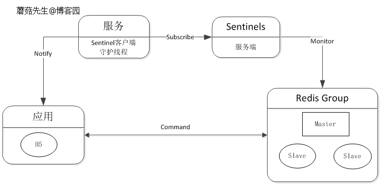

## 分布式

分布式(distributed), 是当业务量、数据量增加时，可以通过任意增加减少服务器数量来解决问题。

集群时代 
至少部署两台Redis服务器构成一个小的集群，主要有2个目的：

高可用性：在主机挂掉后，自动故障转移，使前端服务对用户无影响。 
读写分离：将主机读压力分流到从机上。 
可在客户端组件上实现负载均衡，根据不同服务器的运行情况，分担不同比例的读请求压力。

逻辑图： 

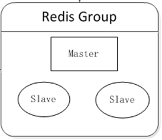

## 分布式集群时代

当缓存数据量不断增加时，单机内存不够使用，需要把数据切分不同部分，分布到多台服务器上。 
可在客户端对数据进行分片，数据分片算法详见C#一致性Hash详解、C#之虚拟桶分片。

逻辑图： 

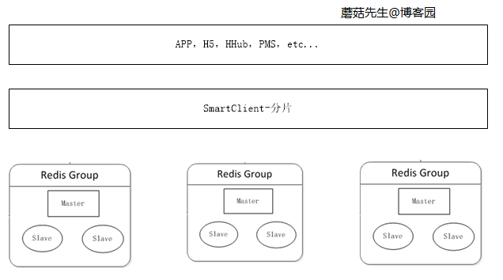

## 大规模分布式集群时代 
当数据量持续增加时，应用可根据不同场景下的业务申请对应的分布式集群。 这块最关键的是缓存治理这块，其中最重要的部分是加入了代理服务。 应用通过代理访问真实的Redis服务器进行读写，这样做的好处是：

避免越来越多的客户端直接访问Redis服务器难以管理，而造成风险。 
在代理这一层可以做对应的安全措施，比如限流、授权、分片。 
避免客户端越来越多的逻辑代码，不但臃肿升级还比较麻烦。 
代理这层无状态的，可任意扩展节点，对于客户端来说，访问代理跟访问单机Redis一样。 
目前楼主公司使用的是客户端组件和代理两种方案并存，因为通过代理会影响一定的性能。 代理这块对应的方案实现有**Twitter的Twemproxy和豌豆荚的codis**。

逻辑图： 

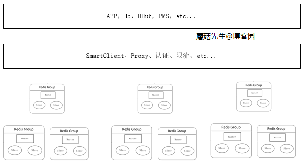

## codis集群方案
Codis是一个豌豆荚团队开源的使用Go语言编写的Redis Proxy使用方法和普通的redis没有任何区别，设置好下属的多个redis实例后就可以了，使用时在本需要连接redis的地方改为连接codis，它会以一个代理的身份接收请求 并使用一致性hash算法，将请求转接到具体redis，将结果再返回codis，和之前比较流行的twitter开源的Twemproxy功能类似，但是相比官方的redis cluster和twitter的Twemproxy还是有一些独到的优势，Codis官方功能对比图如下：

||Codis|Twemproxy|Redis Cluste|
| --- | --- | --- | --- |
|resharding without restarting cluster|Yes|No|Yes|
|pipeline|Yes|Yes|No|
|hash tags for multi-key operations|Yes|Yes|Yes|
|multi-key operations while resharding|Yes|-|No([details](https://link.jianshu.com/?t=http%3A%2F%2Fredis.io%2Ftopics%2Fcluster-spec%23multiple-keys-operations))|
|Redis clients supporting|Any clients|Any clients|Clients have to support cluster protocol|

从表中我们可以看出Codis一个比较大的优点是可以不停机动态新增或删除数据节点，旧节点的数据也可以自动恢复到新节点。并且提供图形化的dashboard，方便集群管理。
[Codis Github](https://link.jianshu.com/?t=https%3A%2F%2Fgithub.com%2FCodisLabs%2Fcodis)
下面我们看下如果使用Coids作为缓存集群方案的架构图，简单画了这么个架构图，这个架构是codis保证HA的前提下的最小级，从这张架构图可以看到我们最少需要8台机器，其中一台机器是codis的dashboard用于通过web界面可视化的配置codis group和proxy，也可以查看各个节点的状态；还有两台是用于codis的proxy代理节点，两个节点之间通过pipeline主从互备；还需要至少配置一台zk用于保存slot状态信息，也可以通过etcd存储这些状态信息，方便client请求的路由，也可以配置多台保证高可用；最后就是要配置数据节点来存储数据了，在codis中需要将数据节点都放在codis group中进行管理，每个group至少保留一个节点，该架构图中，为了保证HA，我们每个group都配置了一个master一个slave节点，这里配置了两个group，如果一个group中的master挂了，那么同一个group中的slave节点通过选举算法选出新的master节点，并通知到proxy，如果为了较好的高可用可以增加group的个数和每个group中slave节点的个数。

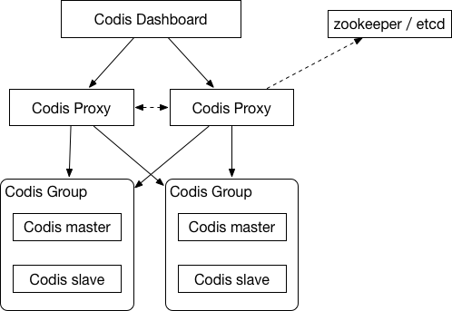

codis

codis方案推出的时间比较长，而且国内很多互联网公司都已经使用了该集群方案，所以该方案还是比较适合大型互联网系统使用的，毕竟成功案例比较多，但是codis因为要实现slot切片，所以修改了redis-server的源码，对于后续的更新升级也会存在一定的隐患。，但是codis的稳定性和高可用确实是目前做的最好的，只要有足够多的机器能够做到非常好的高可用缓存系统。
Codis搭建步骤可以参考官方的 [Guide](https://link.jianshu.com/?t=https%3A%2F%2Fgithub.com%2FCodisLabs%2Fcodis%2Fblob%2Frelease3.2%2Fdoc%2Ftutorial_zh.md)

## 总结

分布式缓存再向后是云服务缓存，对使用端完全屏蔽细节，各应用自行申请大小、流量方案即可，如淘宝OCS云服务缓存。 
分布式缓存对应需要的实现组件有：

一个缓存监控、迁移、管理中心。 
一个自定义的客户端组件，上图中的SmartClient。 
一个无状态的代理服务。 
N台服务器。

## 3.0官方方案
以上方案都是3.0之前版本的集群方案，从3.0版开始，官方支持集群部署了
Redis Cluster中，Sharding采用slot(槽)的概念，一共分成16384个槽，这有点儿类pre sharding思路。对于每个进入Redis的键值对，根据key进行散列，分配到这16384个slot中的某一个中。使用的hash算法也比较简单，就是CRC16后16384取模。
Redis集群中的每个node(节点)负责分摊这16384个slot中的一部分，也就是说，每个slot都对应一个node负责处理。当动态添加或减少node节点时，需要将16384个槽做个再分配，槽中的键值也要迁移。
Redis集群，要保证16384个槽对应的node都正常工作，如果某个node发生故障，那它负责的slots也就失效，整个集群将不能工作。
为了增加集群的可访问性，官方推荐的方案是将node配置成主从结构，即一个master主节点，挂n个slave从节点。这时，如果主节点失效，Redis Cluster会根据选举算法从slave节点中选择一个上升为主节点，整个集群继续对外提供服务，Redis Cluster本身提供了故障转移容错的能力。
Redis Cluster的新节点识别能力、故障判断及故障转移能力是通过集群中的每个node都在和其它nodes进行通信，这被称为集群总线(cluster bus)。它们使用特殊的端口号，即对外服务端口号加10000。例如如果某个node的端口号是6379，那么它与其它nodes通信的端口号是16379。nodes之间的通信采用特殊的二进制协议。
对客户端来说，整个cluster被看做是一个整体，客户端可以连接任意一个node进行操作，就像操作单一Redis实例一样，当客户端操作的key没有分配到该node上时，Redis会返回转向指令，指向正确的node。

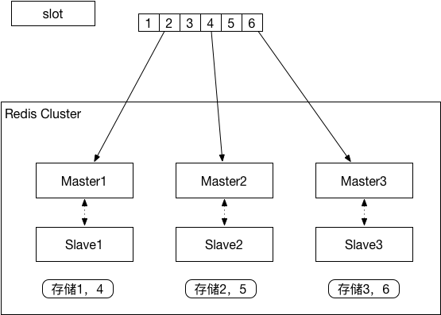

从这种redis cluster的架构图中可以很容易的看出首先将数据根据hash规则分配到6个slot中（这里只是举例子分成了6个槽），然后根据CRC算法和取模算法将6个slot分别存储到3个不同的Master节点中，每个master节点又配套部署了一个slave节点，当一个master出现问题后，slave节点可以顶上。这种cluster的方案对比第一种简单的主从方案的优点在于提高了读写的并发，分散了IO，在保障高可用的前提下提高了性能。
具体的redis cluster的搭建方案可以参考官方的搭建方案，链接中是中文版。
[redis cluster官方搭建方案](https://link.jianshu.com/?t=http%3A%2F%2Fwww.redis.cn%2Ftopics%2Fcluster-tutorial.html)

