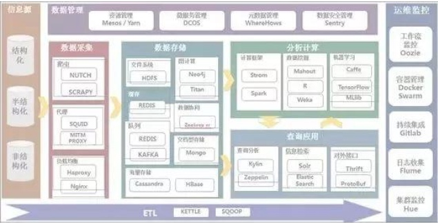

转自[https://www.toutiao.com/a6717373864709456392/?tt_from=weixin&utm_campaign=client_share&wxshare_count=1&timestamp=1564015465&app=news_article&utm_source=weixin&utm_medium=toutiao_ios&req_id=20190725084425010152041196311EF7B&group_id=6717373864709456392](https://www.toutiao.com/a6717373864709456392/?tt_from=weixin&utm_campaign=client_share&wxshare_count=1&timestamp=1564015465&app=news_article&utm_source=weixin&utm_medium=toutiao_ios&req_id=20190725084425010152041196311EF7B&group_id=6717373864709456392)

# 一、语言工具类

## 1、Java编程技术

Java编程技术是目前使用最为广泛的网络编程语言之一,是大数据学习的基础。

Java具有简单性、面向对象、分布式、健壮性、安全性、平台独立与可移植性、多线程、动态性等特点，拥有极高的跨平台能力，是一种强类型语言。可以编写桌面应用程序、Web应用程序、分布式系统和嵌入式系统应用程序等，是大数据工程师最喜欢的编程工具。

最重要的是，Hadoop以及其他大数据处理技术很多都是用Java。因此，想学好大数据，掌握Java基础是必不可少的。

## 2、Linux命令

许多大数据开发通常是在Linux环境下进行的，相比Linux操作系统，Windows操作系统是封闭的操作系统，开源的大数据软件很受限制。因此，想从事大数据开发相关工作，还需掌握Linux基础操作命令。

## 3、Scala

Scala是一门多范式的编程语言，一方面继承了多种语言中的优秀特性，一方面又没有抛弃 Java 这个强大的平台。大数据开发重要框架Spark就是采用Scala语言设计的，想要学好Spark框架，拥有Scala基础是必不可少的。因此，大数据开发需掌握Scala编程基础知识!

## 4、Python与数据分析

Python是面向对象的编程语言，拥有丰富的库，使用简单，应用广泛，在大数据领域也有所应用，主要可用于数据采集、数据分析以及数据可视化等。因此，大数据开发需学习一定的Python知识。

# 二、 数据采集类工具

## 1、Nutch

Nutch是一个开源Java实现的搜索引擎。它提供了我们运行自己的搜索引擎所需的全部工具，包括全文搜索和Web爬虫。

## 2、Scrapy

Scrapy是一个为了爬取网站数据、提取结构性数据而编写的应用框架，可以应用在数据挖掘，信息处理或存储历史数据等一系列的程序中。大数据的采集需要掌握Nutch与Scrapy爬虫技术。

# 三、 ETL工具

## 1、Sqoop

Sqoop是一个用于在Hadoop和关系数据库服务器之间传输数据的工具。它用于从关系数据库（如MySQL，Oracle）导入数据到Hadoop HDFS，并从Hadoop文件系统导出到关系数据库，学习使用Sqoop对关系型数据库数据和Hadoop之间的导入有很大的帮助。

## 2、Kettle

Kettle是一个ETL工具集，它允许你管理来自不同数据库的数据，通过提供一个图形化的用户环境来描述你想做什么，而不是你想怎么做。作为Pentaho的一个重要组成部分，现在在国内项目应用上逐渐增多，其数据抽取高效稳定。

# 四、 数据存储类工具

## 1、Hadoop分布式存储与计算

Hadoop实现了一个分布式文件系统(Hadoop Distributed File System)，简称HDFS。Hadoop的框架最核心的设计就是：HDFS和MapReduce。HDFS为海量的数据提供了存储，MapReduce则为海量的数据提供了计算，因此，需要重点掌握。

除此之外，还需要掌握Hadoop集群、Hadoop集群管理、YARN以及Hadoop高级管理等相关技术与操作!

## 2、Hive

Hive是基于Hadoop的一个数据仓库工具，可以将结构化的数据文件映射为一张数据库表，并提供简单的SQL查询功能，可以将SQL语句转换为MapReduce任务进行运行。相对于用Java代码编写MapReduce来说，Hive的优势明显：快速开发，人员成本低，可扩展性（自由扩展集群规模），延展性（支持自定义函数）。十分适合数据仓库的统计分析。对于Hive需掌握其安装、应用及高级操作等。

## 3、ZooKeeper

ZooKeeper是一个开源的分布式协调服务，是Hadoop和HBase的重要组件，是一个为分布式应用提供一致性服务的软件，提供的功能包括：配置维护、域名服务、分布式同步、组件服务等。在大数据开发中要掌握ZooKeeper的常用命令及功能的实现方法。

## 4、HBase

HBase是一个分布式的、面向列的开源数据库，它不同于一般的关系数据库，更适合于非结构化数据存储的数据库，是一个高可靠性、高性能、面向列、可伸缩的分布式存储系统，大数据开发需掌握HBase基础知识、应用、架构以及高级用法等。

## 5、Redis

Redis是一个Key-Value存储系统，其出现很大程度补偿了Memcached这类Key/Value存储的不足，在部分场合可以对关系数据库起到很好的补充作用。它提供了Java，C/C++，C#，PHP，JavaScript，Perl，Object-C，Python，Ruby，Erlang等客户端。使用很方便，大数据开发需掌握Redis的安装、配置及相关使用方法。

## 6、Kafka

Kafka是一种高吞吐量的分布式发布订阅消息系统，其在大数据开发应用上的目的是通过Hadoop的并行加载机制来统一线上和离线的消息处理，也是为了通过集群来提供实时的消息。大数据开发需掌握Kafka架构原理及各组件的作用和使用方法及相关功能的实现。

## 7、Neo4j

Neo4j是一个高性能的NoSQL图形数据库，具有处理百万和T级节点和边的大尺度处理网络分析能力。它是一个嵌入式的、基于磁盘的、具备完全的事务特性的Java持久化引擎，但是它将结构化数据存储在网络(从数学角度叫做图)上而不是表中。Neo4j因其嵌入式、高性能、轻量级等优势，越来越受到关注。

## 8、Cassandra

Cassandra是一个混合型的非关系的数据库，类似于Google的BigTable，其主要功能比Dynamo（分布式的Key-Value存储系统）更丰富。这种NoSQL数据库最初由Facebook开发，现已被1500多家企业组织使用，包括苹果、欧洲原子核研究组织（CERN）、康卡斯特、电子港湾、GitHub、GoDaddy、Hulu、Instagram、Intuit、Netflix、Reddit等。是一种流行的分布式结构化数据存储方案。

## 9、SSM

SSM框架是由Spring、Spring MVC、MyBatis三个开源框架整合而成，常作为数据源较简单的Web项目的框架。大数据开发需分别掌握Spring、Spring MVC、MyBatis三种框架的同时，再使用SSM进行整合操作。

# 五、 分析计算类工具

## 1、Spark

Spark是专为大规模数据处理而设计的快速通用的计算引擎，其提供了一个全面、统一的框架用于管理各种不同性质的数据集和数据源的大数据处理的需求，大数据开发需掌握Spark基础、SparkJob、Spark RDD部署与资源分配、Spark Shuffle、Spark内存管理、Spark广播变量、Spark SQL、Spark Streaming以及Spark ML等相关知识。

## 2、Storm

Storm 是自由的开源软件，一个分布式的、容错的实时计算系统，可以非常可靠的处理庞大的数据流，用于处理Hadoop的批量数据。Storm支持许多种编程语言，并且有许多应用领域：实时分析、在线机器学习、不停顿的计算、分布式RPC(远过程调用协议，一种通过网路从远程计算机程序上请求服务)、ETL等等。

Storm的处理速度惊人：经测试，每个节点每秒钟可以处理100万个数据元组。

## 3、Mahout

Mahout目的是“为快速创建可扩展、高性能的机器学习应用程序而打造一个环境”。主要特点是为可伸缩的算法提供可扩展环境、面向Scala/Spark/H2O/Flink的新颖算法、Samsara（类似R的矢量数学环境），它还包括了用于在MapReduce上进行数据挖掘的众多算法。

## 4、Pentaho

Pentaho是世界上最流行的开源商务智能软件，以工作流为核心的、强调面向解决方案而非工具组件的、基于Java平台的BI套件。包括一个Web Server平台和几个工具软件：报表、分析、图表、数据集成、数据挖掘等，可以说包括了商务智能的方方面面。

Pentaho的工具可以连接到NoSQL数据库。大数据开发需了解其使用方法。

# 六、 查询应用类工具

## 1、Avro与Protobuf

Avro与Protobuf均是数据序列化系统，可以提供丰富的数据结构类型，十分适合做数据存储，还可进行不同语言之间相互通信的数据交换格式，学习大数据，需掌握其具体用法。

## 2、Phoenix

Phoenix是用Java编写的基于JDBC API操作HBase的开源SQL引擎，其具有动态列、散列加载、查询服务器、追踪、事务、用户自定义函数、二级索引、命名空间映射、数据收集、时间戳列、分页查询、跳跃查询、视图以及多租户的特性，大数据开发需掌握其原理和使用方法。

## 3、Kylin

Kylin是一个开源的分布式分析引擎，提供了基于Hadoop的超大型数据集（TB/PB级别）的SQL接口以及多维度的OLAP分布式联机分析。最初由eBay开发并贡献至开源社区。它能在亚秒内查询巨大的Hive表。

## 4、Zeppelin

Zeppelin是一个提供交互数据分析且基于Web的笔记本。方便你做出可数据驱动的、可交互且可协作的精美文档，并且支持多种语言，包括 Scala(使用 Apache Spark)、Python(Apache Spark)、SparkSQL、 Hive、 Markdown、Shell等。

## 5、ElasticSearch

ElasticSearch是一个基于Lucene的搜索服务器。它提供了一个分布式、支持多用户的全文搜索引擎，基于RESTful Web接口。ElasticSearch是用Java开发的，并作为Apache许可条款下的开放源码发布，是当前流行的企业级搜索引擎。设计用于云计算中，能够达到实时搜索、稳定、可靠、快速、安装使用方便。

## 6、Solr

Solr基于Apache Lucene，是一种高度可靠、高度扩展的企业搜索平台, 是一款非常优秀的全文搜索引擎。知名用户包括eHarmony、西尔斯、StubHub、Zappos、百思买、AT&T、Instagram、Netflix、彭博社和Travelocity。大数据开发需了解其基本原理和使用方法。

# 七、 数据管理类工具

## 1、Azkaban

Azkaban是由linked开源的一个批量工作流任务调度器，它是由三个部分组成：Azkaban Web Server(管理服务器)、Azkaban Executor Server(执行管理器)和MySQL(关系数据库)，可用于在一个工作流内以一个特定的顺序运行一组工作和流程，可以利用Azkaban来完成大数据的任务调度，大数据开发需掌握Azkaban的相关配置及语法规则。

## 2、Mesos

Mesos 是由加州大学伯克利分校的AMPLab首先开发的一款开源集群管理软件，支持Hadoop、ElasticSearch、Spark、Storm 和Kafka等架构。对数据中心而言它就像一个单一的资源池，从物理或虚拟机器中抽离了CPU、内存、存储以及其它计算资源，很容易建立和有效运行具备容错性和弹性的分布式系统。

## 3、Sentry

Sentry 是一个开源的实时错误报告工具，支持 Web 前后端、移动应用以及游戏，支持 Python、OC、Java、Go、Node、Django、RoR 等主流编程语言和框架 ，还提供了 GitHub、Slack、Trello 等常见开发工具的集成。使用Sentry对数据安全管理很有帮助。

# 八、 运维监控类工具

Flume是一款高可用、高可靠、分布式的海量日志采集、聚合和传输的系统，Flume支持在日志系统中定制各类数据发送方，用于收集数据;同时，Flume提供对数据进行简单处理，并写到各种数据接受方(可定制)的能力。大数据开发需掌握其安装、配置以及相关使用方法。