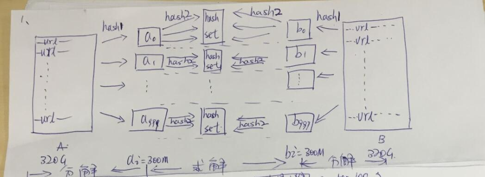
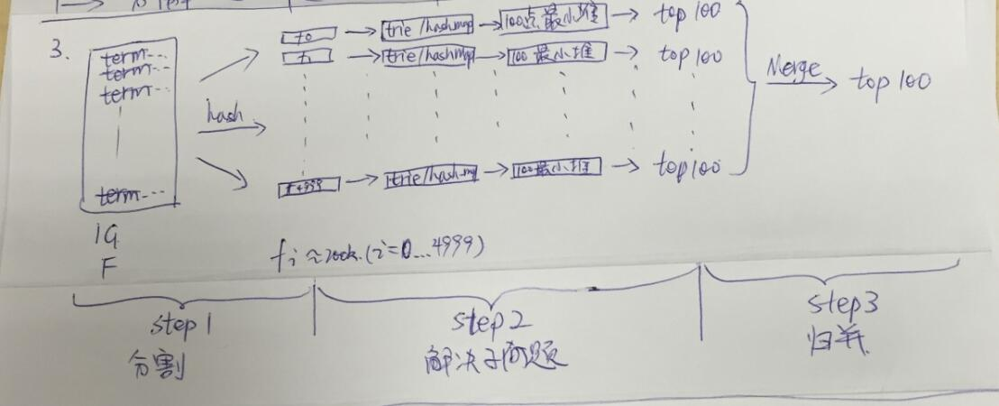
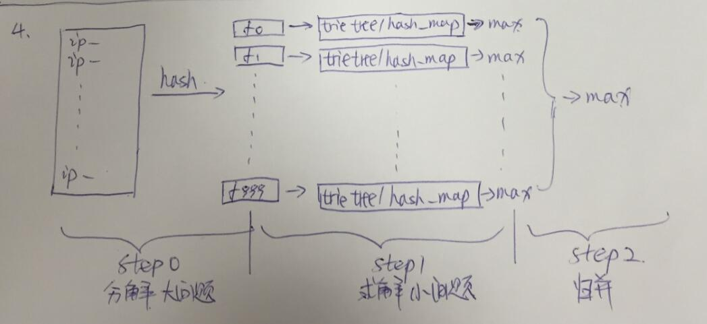

### 数据基本概念
1. 2**10 = 1024
2. 1G = 10**9 = 10亿
3. 1Gb = 10**9bytes（1Gb = 10亿字节）：1Gb = 1024Mb，1Mb = 1024Kb，1Kb = 1024bytes 
4. 1G = 1024M 1M = 1024K 1K = 1024byte 1byte = 8 bit 所有1g = 2 ** (10+10+10+3) = 2 ** 33 bit
5. 基本流程是，分解大问题，解决小问题，从局部最优中选择全局最优；（当然，如果直接放内存里就能解决的话，那就直接想办法求解，不需要分解了。）
6. 分解过程常用方法：hash(x)%m。其中x为字符串/url/ip，m为小问题的数目，比如把一个大文件分解为1000份，m=1000；
7. 解决问题辅助数据结构：hash_map，Trie树，bit map，二叉排序树（AVL，SBT，红黑树）；
8. top K问题：最大K个用最小堆，最小K个用最大堆。（至于为什么？自己在纸上写个小栗子，试一下就知道了。）
9. 处理大数据常用排序：快速排序/堆排序/归并排序/桶排序

---
### 两个文件合并的问题：给定a、b两个文件，各存放50亿个url，每个url各占用64字节，内存限制是4G，如何找出a、b文件共同的url？
主要的思想是把文件分开进行计算，再对每个文件进行对比，得出相同的URL,因为以上说是含有相同的URL所以不用考虑数据倾斜的问题。详细的解题思路如下：
1. 可以估计每个文件的大小为5G*64=300G，远大于4G。所以不可能将其完全加载到内存中处理。考虑采取分而治之的方法。 
1. 遍历文件a，对每个url求取hash(url)%1000，然后根据所得值将url分别存储到1000个小文件（设为a0,a1,...a999）当中。这样每个小文件的大小约为300M。
1. 遍历文件b，采取和a相同的方法将url分别存储到1000个小文件(b0,b1....b999)中。这样处理后，所有可能相同的url都在对应的小文件(a0 vs b0, a1 vs b1....a999 vs b999)当中，不对应的小文件（比如a0 vs b99）不可能有相同的url。然后我们只要求出1000对小文件中相同的url即可。 
1. 比如对于a0 vs b0，我们可以遍历a0，将其中的url存储到hash_map当中。然后遍历b0，如果url在hash_map中，则说明此url在a和b中同时存在，保存到文件中即可。 
1. 如果分成的小文件不均匀，导致有些小文件太大（比如大于2G），可以考虑将这些太大的小文件再按类似的方法分成小小文件即可
    
---
### 采集nginx产生的日志，日志的格式为user  ip   time  url   htmlId  每天产生的文件的数据量上亿条，请设计方案把数据保存到HDFS上，并提供以下实时查询的功能（响应时间小于3s）
A、某个用户某天访问某个URL的次数
B、某个URL某天被访问的总次数 

实时思路是：使用Logstash + Kafka + Spark-streaming + Redis + 报表展示平台
离线的思路是：Logstash + Kafka + Elasticsearch +  Spark-streaming + 关系型数据库
A、B、数据在进入到Spark-streaming 中进行过滤，把符合要求的数据保存到Redis中

---
### 有 10 个文件，每个文件 1G，每个文件的每一行存放的都是用户的 query，每个文件的query 都可能重复。要求你按照 query 的频度排序。 还是典型的 TOP K 算法，
  解决方案如下： 
    1）方案 1： 
    顺序读取 10 个文件，按照 hash(query)%10 的结果将 query 写入到另外 10 个文件（记为）中。这样新生成的文件每个的大小大约也 1G（假设 hash 函数是随机的）。 找一台内存在 2G 左右的机器，依次对用 hash_map(query, query_count)来统计每个query 出现的次数。利用快速/堆/归并排序按照出现次数进行排序。将排序好的 query 和对应的 query_cout 输出到文件中。这样得到了 10 个排好序的文件（记为）。 对这 10 个文件进行归并排序（内排序与外排序相结合）。 
    2）方案 2： 
    一般 query 的总量是有限的，只是重复的次数比较多而已，可能对于所有的 query，一次性就可以加入到内存了。这样，我们就可以采用 trie 树/hash_map等直接来统计每个 query出现的次数，然后按出现次数做快速/堆/归并排序就可以了。 
    3）方案 3： 
    与方案 1 类似，但在做完 hash，分成多个文件后，可以交给多个文件来处理，采用分布式的架构来处理（比如 MapReduce），最后再进行合并。

---
### 在 2.5 亿个整数中找出不重复的整数，注，内存不足以容纳这 2.5 亿个整数。 
  1）方案 1：采用 2-Bitmap（每个数分配 2bit，00 表示不存在，01 表示出现一次，10 表示多次，11 无意义）进行，共需内存 2^32 * 2 bit=1 GB 内存，还可以接受。然后扫描这 2.5亿个整数，查看 Bitmap 中相对应位，如果是 00 变 01，01 变 10，10 保持不变。所描完事后，查看 bitmap，把对应位是 01 的整数输出即可。 
  2）方案 2：也可采用与第 1 题类似的方法，进行划分小文件的方法。然后在小文件中找出不重复的整数，并排序。然后再进行归并，注意去除重复的元素。 

---
### 腾讯面试题：给 40 亿个不重复的 unsigned int（无符号整型） 的整数，没排过序的，然后再给一个数，如何快速判断这个数是否在那 40 亿个数当中？ 
  1）方案 1：申请 512M 的内存，一个 bit 位代表一个 unsigned int 值。读入 40 亿个数，设置相应的 bit 位，读入要查询的数，查看相应 bit 位是否为 1，为 1 表示存在，为 0 表示不存在。 
  2）方案 2：这个问题在《编程珠玑》里有很好的描述，大家可以参考下面的思路，探讨一下： 又因为 2^32 为 40 亿多，所以给定一个数可能在，也可能不在其中； 这里我们把 40 亿个数中的每一个用 32 位的二进制来表示 ，假设这 40 亿个数开始放在一个文件中。 然后将这 40 亿个数分成两类: 
1.最高位为 0 
2.最高位为 1 
    并将这两类分别写入到两个文件中，其中一个文件中数的个数<=20 亿，而另一个>=20 亿（这相当于折半了）； 与要查找的数的最高位比较并接着进入相应的文件再查找 再然后把这个文件为又分成两类: 
1.次最高位为 0 
2.次最高位为 1 
    并将这两类分别写入到两个文件中，其中一个文件中数的个数<=10 亿，而另一个>=10 亿（这相当于折半了）； 与要查找的数的次最高位比较并接着进入相应的文件再查找。 
..... 
    以此类推，就可以找到了,而且时间复杂度为 O(logn)，方案 2 完。 
  3)附：这里，再简单介绍下，位图方法： 使用位图法判断整形数组是否存在重复 ,判断集合中存在重复是常见编程任务之一，当集合中数据量比较大时我们通常希望少进行几次扫描，这时双重循环法就不可取了。 
    位图法比较适合于这种情况，它的做法是按照集合中最大元素 max 创建一个长度为 max+1的新数组，然后再次扫描原数组，遇到几就给新数组的第几位置上 1，如遇到 5 就给新数组的第六个元素置 1，这样下次再遇到 5 想置位时发现新数组的第六个元素已经是 1 了，这说明这次的数据肯定和以前的数据存在着重复。这 种给新数组初始化时置零其后置一的做法类似于位图的处理方法故称位图法。它的运算次数最坏的情况为 2N。如果已知数组的最大值即能事先给新数组定长的话效 率还能提高一倍。

---
### 怎么在海量数据中找出重复次数最多的一个？ 
  1）方案 1：先做 hash，然后求模映射为小文件，求出每个小文件中重复次数最多的一个，并记录重复次数。然后找出上一步求出的数据中重复次数最多的一个就是所求（具体参考前面的题）。

---
### 上千万或上亿数据（有重复），统计其中出现次数最多的前 N 个数据。 
  1）方案 1：上千万或上亿的数据，现在的机器的内存应该能存下。所以考虑采用 hash_map/搜索二叉树/红黑树等来进行统计次数。然后就是取出前 N 个出现次数最多的数据了，可以用第 2 题提到的堆机制完成。

---
### 一个文本文件，大约有一万行，每行一个词，要求统计出其中最频繁出现的前 10 个词，给出思想，给出时间复杂度分析。 
  1）方案 1：这题是考虑时间效率。用 trie 树统计每个词出现的次数，时间复杂度是 O(n * le)（le表示单词的平准长度）。然后是找出出现最频繁的前 10 个词，可以用堆来实现，前面的题中已经讲到了，时间复杂度是 O(n* lg10)。所以总的时间复杂度，是 O(n* le)与 O(n*lg10)中较大的哪一 个。

---
### 100w 个数中找出最大的 100 个数。 
  1）方案 1：在前面的题中，我们已经提到了，用一个含 100 个元素的最小堆完成。复杂度为O(100w* lg100)。 
  2）方案 2：采用快速排序的思想，每次分割之后只考虑比轴大的一部分，知道比轴大的一部分在比 100 多的时候，采用传统排序算法排序，取前 100 个。复杂度为 O(100w* 100)。 
  3）方案 3：采用局部淘汰法。选取前 100 个元素，并排序，记为序列 L。然后一次扫描剩余的元素 x，与排好序的 100 个元素中最小的元素比，如果比这个最小的 要大，那么把这个最小的元素删除，并把 x 利用插入排序的思想，插入到序列 L 中。依次循环，直到扫描了所有的元素。复杂度为 O(100w*100)。 

---
### 有一千万条短信，以文本文件的形式保存，一行一条，有重复。 请用 5 分钟时间，找出重复出现最多的前 10 条。 
  1）分析： 常规方法是先排序，在遍历一次，找出重复最多的前 10 条。但是排序的算法复杂度最低为nlgn。 
  2）每条短信最多140个字符，utf-8编码一个字符3个字节，140*3*10000000 = 4200 000 000 = 4.2G，完全能放到内存里，按HashMap<String,Integer> 存储短信内容和出现次数，然后遍历HashMap，找出top10，可以用最大堆找最大值，这样除了加载数据外，只遍历一次数据找最大值，时间复杂度为O(n)。  
  3）最后找top10的时候，可以不使用最大堆，维护一个长度为10的数组，数组进行排序，遍历数据时与数组中最小的进行比较，比最小的大就替换掉之后再对数组排序
  
[参考链接](https://blog.csdn.net/oitebody/article/details/60487045)
  ---
### 给定a、b两个文件，各存放50亿个url，每个url各占64字节，内存限制是4G，让你找出a、b文件共同的url？

假如每个url大小为10bytes，那么可以估计每个文件的大小为50G×64=320G，远远大于内存限制的4G，所以不可能将其完全加载到内存中处理，可以采用分治的思想来解决。

1. 遍历文件a，对每个url求取hash(url)%1000，然后根据所取得的值将url分别存储到1000个小文件（记为a0,a1,...,a999 ，每个小文件约300M）；

1. 遍历文件b，采取和a相同的方式将url分别存储到1000个小文件（记为b0,b1,...,b999）；
巧妙之处：这样处理后，所有可能相同的url都被保存在对应的小文件（a0 vs b0, a1 vs b1 ,...,a999 vs b999）中，不对应的小文件不可能有相同的url。然后我们只要求出这个1000对小文件中相同的url即可。

1. 求每对小文件ai和bi中相同的url时，可以把ai的url存储到hash_set/hash_map中。然后遍历bi的每个url，看其是否在刚才构建的hash_set中，如果是，那么就是共同的url，存到文件里面就可以了。

草图如下（左边分解A，右边分解B，中间求解相同url）： 

---

### 有一个1G大小的一个文件，里面每一行是一个词，词的大小不超过16字节，内存限制大小是1M，要求返回频数最高的100个词

1. 顺序读文件中，对于每个词x，取hash(x)%5000，然后按照该值存到5000个小文件（记为f0 ,f1 ,... ,f4999）中，这样每个文件大概是200k左右，如果其中的有的文件超过了1M大小，还可以按照类似的方法继续往下分，直到分解得到的小文件的大小都不超过1M；

1. 对每个小文件，统计每个文件中出现的词以及相应的频率（可以采用trie树/hash_map等），并取出出现频率最大的100个词（可以用含100个结点的最小堆），并把100词及相应的频率存入文件，这样又得到了5000个文件；

1. 把这5000个文件进行归并（类似与归并排序）；

草图如下（分割大问题，求解小问题，归并）： 

 

### 现有海量日志数据保存在一个超级大的文件中，该文件无法直接读入内存，要求从中提取某天出访问百度次数最多的那个IP

1. 从这一天的日志数据中把访问百度的IP取出来，逐个写入到一个大文件中；

1. 注意到IP是32位的，最多有2^32个IP。同样可以采用映射的方法，比如模1000，把整个大文件映射为1000个小文件；

1. 找出每个小文件中出现频率最大的IP（可以采用hash_map进行频率统计，然后再找出频率最大的几个）及相应的频率；

1. 在这1000个最大的IP中，找出那个频率最大的IP，即为所求。

草图如下： 
