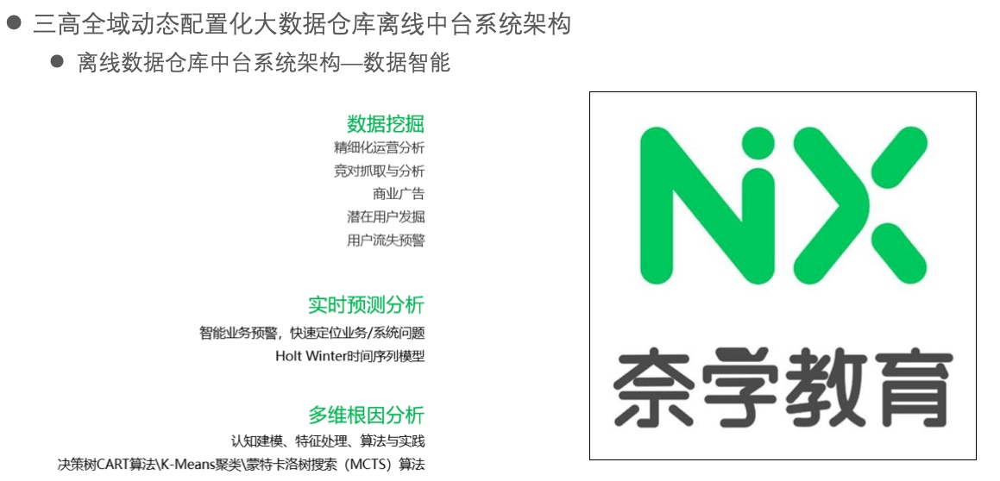
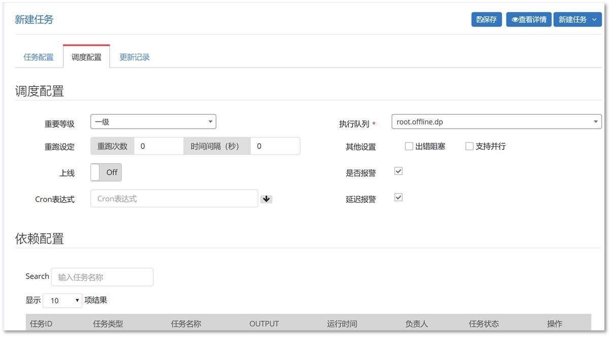

# 各种ass
## IaaS
IaaS（Infrastructure as a Service），基础设施即服务，提供给消费者的服务是对所有计算基础设施的利用，包括处理 CPU、内存、存储、网络和其它基本的计算资源，用户能够部署和运行任意软件，包括操作系统和应用程序

IaaS 公司会提供场外服务器，存储和网络硬件，也可以选择租用。节省了维护成本和办公场地，公司可以在任何时候利用这些硬件来运行其应用

目前比较知名的IaaS公司有亚马逊、Bluelock、CSC、GoGrid、IBM 等。

## PaaS
PaaS（Platform as a Service），平台即服务，提供给消费者的服务是把客户采用提供的开发语言和工具（例如 Java，python, .Net 等）开发的或收购的应用程序部署到供应商的云计算基础设施上去

PaaS 公司可以提供各种开发和分发应用的解决方案，比如虚拟服务器和操作系统等，可以节省硬件上的费用

## SaaS
SaaS（Software as a Service），软件即服务，提供给客户的服务是运营商运行在云计算基础设施上的应用程序，用户可以在各种设备上访问

对于大型客户来说就是专属云，SaaS 方可以统一地大规模自动化运维

对于中型客户，就是多租户公有云

## aPaaS
aPaaS（Application PaaS），就是基于 PaaS 平台基础的应用服务，传统的 PaaS 是不包含业务逻辑，也不包含业务数据，但是 aPaaS 却是包含的

aPaaS 公司可以提供各种服务中台（业务中台、数据中台、智能中台等开放平台），客户不需要任何代码就能够构建带有业务逻辑的相关应用

## DaaS
DaaS（Data as a Service），数据即服务，是指与数据相关的任何服务都能够发生在一个集中化的位置，如聚合、数据质量管理、数据清洗等

然后再将数据提供给不同的系统和用户，而无需再考虑这些数据来自于哪些数据源

# 笔记
数据分析框架
skynet调度平台

如果没办法让业务同学用你的数据中台进行建模，那你的数据中台价值不大

星形模型

全域数据仓库
# 总体架构

# lamda模式

# 数仓逻辑分层

## 逻辑分层的业务架构

 

# flink源码剖析

## flink standalone集群启动源码剖析

 

 