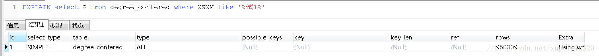
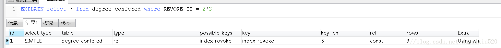
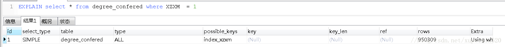
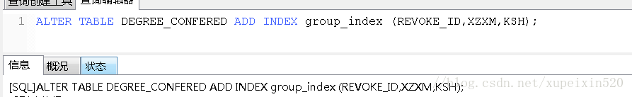
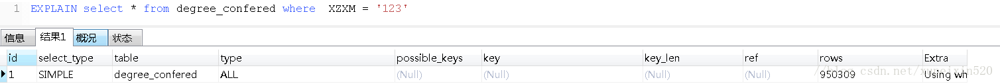

# 表结构操作语句
## 修改表名 
```sql
alter table test_a rename to sys_app;
``` 

## 修改表注释   
```sql
alter table sys_application comment '系统信息表';

``` 

## 修改字段类型和注释
```sql
alter table sys_application  modify column app_name varchar(20) COMMENT '应用的名称';
``` 

## 修改字段类型
```sql
alter table sys_application  modify column app_name text;
``` 

## 单独修改字段注释 
```sql
目前没发现有单独修改字段注释的命令语句。
``` 

## 设置字段允许为空
```sql
alter table sys_application  modify column description varchar(255) null COMMENT '应用描述';
``` 

## 增加一个字段，设好数据类型，且不为空，添加注释
```sql
alter table sys_application add url varchar(255) not null comment '应用访问地址';  
``` 

## 增加一个字段，设好数据类型，不为空，且有默认值，添加注释
```sql
ALTER TABLE cms_article add hot_value SMALLINT(3) not null DEFAULT 0 comment '热度值'
```

## 增加主键 
```sql
alter table t_app add aid int(5) not null ,add primary key (aid);  
``` 

## 增加自增主键
```sql
alter table t_app add aid int(5) not null auto_increment ,add primary key (aid); 
``` 

## 修改为自增主键
```sql
alter table t_app  modify column aid int(5) auto_increment ;
``` 

## 修改字段名字(要重新指定该字段的类型)
```sql
alter table t_app change name app_name varchar(20) not null;
``` 

## 删除字段
```sql
alter table t_app drop aid; 
``` 

## 在某个字段后增加字段
```sql
alter table `t_app` add column gateway_id int  not null default 0 AFTER `aid`； #(在哪个字段后面添加)  
``` 

## 调整字段顺序 
```sql
alter table t_app  change gateway_id gateway_id int not null after aid ; #(注意gateway_id出现了2次)
```

# 索引无效的情况
## 1.索引无法存储null值

a.单列索引无法储null值，复合索引无法储全为null的值。

b.查询时，采用is null条件时，不能利用到索引，只能全表扫描。

### 为什么索引列无法存储Null值？

a.索引是有序的。NULL值进入索引时，无法确定其应该放在哪里。（将索引列值进行建树，其中必然涉及到诸多的比较操作，null 值是不确定值无法

比较，无法确定null出现在索引树的叶子节点位置。）　

b.如果需要把空值存入索引，方法有二：其一，把NULL值转为一个特定的值，在WHERE中检索时，用该特定值查找。其二，建立一个复合索引。例如　

create index ind_a on table(col1,1);  通过在复合索引中指定一个非空常量值，而使构成索引的列的组合中，不可能出现全空值。　


## 2.不适合键值较少的列（重复数据较多的列）

假如索引列TYPE有5个键值，如果有1万条数据，那么 WHERE TYPE = 1将访问表中的2000个数据块。

再加上访问索引块，一共要访问大于200个的数据块。

如果全表扫描，假设10条数据一个数据块，那么只需访问1000个数据块，既然全表扫描访问的数据块

少一些，肯定就不会利用索引了。

## 3.前导模糊查询不能利用索引(like '%XX'或者like '%XX%')

假如有这样一列code的值为'AAA','AAB','BAA','BAB' ,如果where code like '%AB'条件，由于前面是

模糊的，所以不能利用索引的顺序，必须一个个去找，看是否满足条件。这样会导致全索引扫描或者全表扫

描。如果是这样的条件where code like 'A % '，就可以查找CODE中A开头的CODE的位置，当碰到B开头的

数据时，就可以停止查找了，因为后面的数据一定不满足要求。这样就可以利用索引了。

## 4.索引失效的几种情况

1. 如果条件中有or，即使其中有条件带索引也不会使用(这也是为什么尽量少用or的原因)
要想使用or，又想让索引生效，只能将or条件中的**每个列都加上索引**

2. 对于多列索引，不是使用的第一部分，则不会使用索引

3. like查询以%开头

4. 如果列类型是字符串，那一定要在条件中将数据使用引号引用起来,否则不使用索引

5. 如果mysql估计使用全表扫描要比使用索引快,则不使用索引

## 5.MySQL主要提供2种方式的索引：B-Tree索引，Hash索引

B树索引具有范围查找和前缀查找的能力，对于有N节点的B树，检索一条记录的复杂度为O(LogN)。相当于二分查找。

哈希索引只能做等于查找，但是无论多大的Hash表，查找复杂度都是O(1)。

显然，如果值的差异性大，并且以等值查找（=、 <、>、in）为主，Hash索引是更高效的选择，它有O(1)的查找复杂度。

如果值的差异性相对较差，并且以范围查找为主，B树是更好的选择，它支持范围查找。

## 例子
基于MySQL5.5.33


数据量：


索引失效情况总结：

创建索引sql：ALTER TABLE `table_name` ADD INDEX index_name ( `column` )，表中先创建2个字段的普通索引     

1.sql语句中or的语句使用,执行sql：

1).生效


2).未生效


总结:or的使用2边必须都是索引列，如果有一列不是，则索引无法生效，进行了全表扫描

2.like的使用:

1).生效


2).未生效:




总结:like的百分号不能写在前面，否则无法生效，进行全表扫描

3.索引列上进行计算:

1).生效




2).未生效


 总结:索引列上不能进行计算，可以将计算放到条件上

4.索引列是varchar类型

1).生效


2).未生效




总结:索引列如果是varchar字符串类型，则必须加上''进行包含

5.组合索引:创建索引sql（ALTER TABLE `table_name` ADD INDEX index_name(`column`,`column`,`column`);）,遵从最左前缀利用索引中最左边的列集来匹配行，这样的列称为最左前缀，例如由id,name,age3个字段构成的索引，索引行中按id/name/age的顺序存放，索引可以搜索下面字段组合：（id,name,age）、(id,name)、或者id。如果列不构成索引最左面的前缀，MySQL不能使用局部索引，如（age）或者（name，age）组合则不能使用索引查询




1)生效:


2）.未生效

1.未按照最左前缀的原则：




2.按照最左前缀使用or进行查询：

 
 

3.遵从原则，在索引列上进行计算


# 死锁处理
解除正在死锁的状态有两种方法：

## 方法1

1. 查询是否锁表

 show OPEN TABLES where In_use > 0;

2. 查询进程（如果您有SUPER权限，您可以看到所有线程。否则，您只能看到您自己的线程）

 show processlist

3. 杀死进程id（就是上面命令的id列）

 kill id


## 方法2

1. 查看下在锁的事务 

    SELECT * FROM INFORMATION_SCHEMA.INNODB_TRX;

2. 杀死进程id（就是上面命令的trx_mysql_thread_id列）

    kill 线程ID

## 例子

查出死锁进程：SHOW PROCESSLIST
杀掉进程          KILL 420821;

## 其它关于查看死锁的命令

1. 查看当前的事务
    SELECT * FROM INFORMATION_SCHEMA.INNODB_TRX;

2. 查看当前锁定的事务

    SELECT * FROM INFORMATION_SCHEMA.INNODB_LOCKS;

3. 查看当前等锁的事务
    SELECT * FROM INFORMATION_SCHEMA.INNODB_LOCK_WAITS;
    
# 中文乱码处理
两种情况导致乱码：
## 服务端配置引起的
运行sql`show variables like 'character%';`


看character_set_database和character_set_server是不是utf-8的，不是的话使用下面sql修改：

```sql
set character_set_database=utf8;
set character_set_server=utf8;
```

## 客户端字符集引起的
一般都是导入数据的时候执行sql文本导致的，在sql前面加上
`SET NAMES 'utf8';`
它相当于下面的三句指令：

```sql
SET character_set_client = utf8;
SET character_set_results = utf8;
SET character_set_connection = utf8;
```

# 自增主键

插入方式分为三类：
* 简单插入(simple insert)
* 批量插入(bulk insert)
* 混合插入(mixed-mode insert)
 
## 实验
### 实验一、自增键初始值测验
```sql
drop table t1;
create table t1(
    id int not null auto_increment,
    name varchar(10) unique,
    count int default 0,
    primary key(id),
    index(name)
)engine=innodb;

insert into t1(name) values("zhangsan"),("lisi"),("wangwu");
select * from t1;
```
请问，被插入的三条记录，id分别为：
A 0,1,2
B 1,2,3
C 以上都不对


答案：B

**自增键从1开始**，该测验对应《三类插入与自增键的关系》中的简单插入(simple insert)。简单插入，能够提前知道被插入的行数，在处理自增键时，是最容易的。

### 实验二、批量插入测验
```sql
drop table t1,t2;
create table t1(
    id int not null auto_increment,
    name varchar(10) unique,
    count int default 0,
    primary key(id),
    index(name)
)engine=innodb;

create table t2(
    name varchar(10) unique
)engine=innodb;

insert into t2(name) values("x"),("y"),("z");

insert into t1(name) select name from t2;
select * from t1;
```

请问，上述insert...select...的执行结果是：
A 插入成功
B 插入失败，自增键报错
C 以上都不对


答案：A

插入成功，该测验对应《三类插入与自增键的关系》中的批量插入(bulk insert)。批量插入，不能提前知道被插入的行数，在处理自增键时，每插入一行，才会赋值新的自增值，在批量插入事务并发时，“可能”出现同一个事务的自增键不连续。
画外音：可以有优化机制，未来撰文。

### 实验三、混合插入测验
```sql
drop table t1;
create table t1(
    id int not null auto_increment,
    name varchar(10) unique,
    count int default 0,
    primary key(id),
    index(name)
)engine=innodb;

insert into t1(id, name) values(1, "shenjian");

insert into t1(id, name) values (111, "111"),(NULL, "abc"),(222, "222"),(NULL,"xyz");
select * from t1;
```
请问，最后一个insert语句，执行结束后id分别是：
A 1,2,3,111,222
B 1,111,112,222,223
C 插入失败，自增键报错
D 以上都不对


答案：B

插入成功，自增键每次从最大值后面开始新增，该测验对应《三类插入与自增键的关系》中的混合插入(mixed-mode insert)。有些行插入时指定了自增键，无需数据库生成；有些行插入时未指定自增键(NULL)，需要数据库生成。

### 实验四、insert ... on duplicate key测验
接着实验三，继续执行以下语句：
```sql
insert into t1(name)values("shenjian"),("aaa"),("bbb")
on duplicate key update count=100;
select * from t1;
```
请问，最后一个insert语句，执行结束后id分别是：
A 1,2,3,111,222,223,224,225
B 1,111,112,222,223,224,225,226
C 1,111,112,222,223,224,225
D 1,111,112,222,223,225,226
E 以上都不对


答案：D

该测验也对应《三类插入与自增键的关系》中的混合插入(mixed-mode insert)。有些行插入实际上是修改，无需数据库生成自增键；有些行插入实际上就是插入，需要数据库生成自增键。

insert … on duplicate key update … 这种情况是最最复杂的，它可能导致，系统生成的自增值，在更新阶段用不上。
画外音，官网原文是：
an INSERT followed by a UPDATE, where the allocated value for the AUTO_INCREMENT column may or may not be used during the update phase. 
 
## 什么是简单插入(simple insert)？
普通的insert/replace语句，不管是单条插入还是多条插入，都是简单插入。
画外音：
（1）不包含递归的子查询；
（2）不包含insert … on duplicate key update… ；
 
如《自增键测试》里的实验一：
insert into t1(id, name) values(1,"shenjian");
insert into t1(name) values("zhangsan"),("lisi"),("ww");
都是简单插入。
 
简单插入的特点是，能够提前知道被插入的行数。
 
因此，这类插入，在处理自增键时，是最容易的。
画外音：很容易保证自增键连续性。
 
## 什么是批量插入(bulk insert)？
与简单插入相对，在插入时，不知道被插入的行数，是批量插入。
 
如《自增键测试》里的实验二：
insert into t1(name) select name from t2;
 
除此之外，像：
replace … select …
load data
都是批量插入。
 
由于不能够提前知道多少行插入，在处理自增列时，每插入一行，才会赋值新的自增值。
画外音，官网原文是：
InnoDB assigns new values for the AUTO_INCREMENT column one at a time as each row is processed.
 
这里的潜台词是，在批量插入事务并发时，“可能”出现同一个事务的自增键不连续。
画外音：为啥是“可能”呢？潜在解决方案，未来撰文详述。
 
## 什么是混合插入(mixed-mode insert)？
如《自增键测试》里的实验三：
insert into t1(id, name) values (111,"111"),(NULL, "abc"),(222,"222"),(NULL,"xyz");
 
有些行插入时指定了自增键，无需数据库生成；
有些行插入时未指定自增键(NULL)，需要数据库生成。
画外音：具体走哪个分支，实际执行时才知道。
 
以及《自增键测试》里实验四：
insert into t1(name) values("shenjian"),("aaa"),("bbb")
on duplicate key update count=100;
 
有些行插入实际上是修改，无需数据库生成自增键；
有些行插入实际上就是插入，需要数据库生成自增键。
画外音：具体走哪个分支，也是实际执行时才知道。
 
insert … on duplicate key update … 这种情况是最最复杂的，它可能导致，系统生成的自增值，在更新阶段用不上。

转自[架构师之路](https://mp.weixin.qq.com/s/lSPI6UUJiZLSgV9RqqP1Rg)