### 1.索引无法存储null值

a.单列索引无法储null值，复合索引无法储全为null的值。

b.查询时，采用is null条件时，不能利用到索引，只能全表扫描。

#### 为什么索引列无法存储Null值？

a.索引是有序的。NULL值进入索引时，无法确定其应该放在哪里。（将索引列值进行建树，其中必然涉及到诸多的比较操作，null 值是不确定值无法

比较，无法确定null出现在索引树的叶子节点位置。）　

b.如果需要把空值存入索引，方法有二：其一，把NULL值转为一个特定的值，在WHERE中检索时，用该特定值查找。其二，建立一个复合索引。例如　

create index ind_a on table(col1,1);  通过在复合索引中指定一个非空常量值，而使构成索引的列的组合中，不可能出现全空值。　

### 2.不适合键值较少的列（重复数据较多的列）

假如索引列TYPE有5个键值，如果有1万条数据，那么 WHERE TYPE = 1将访问表中的2000个数据块。

再加上访问索引块，一共要访问大于200个的数据块。

如果全表扫描，假设10条数据一个数据块，那么只需访问1000个数据块，既然全表扫描访问的数据块

少一些，肯定就不会利用索引了。

### 3.前导模糊查询不能利用索引(like '%XX'或者like '%XX%')

假如有这样一列code的值为'AAA','AAB','BAA','BAB' ,如果where code like '%AB'条件，由于前面是

模糊的，所以不能利用索引的顺序，必须一个个去找，看是否满足条件。这样会导致全索引扫描或者全表扫

描。如果是这样的条件where code like 'A % '，就可以查找CODE中A开头的CODE的位置，当碰到B开头的

数据时，就可以停止查找了，因为后面的数据一定不满足要求。这样就可以利用索引了。

### 4.索引失效的几种情况

1. 如果条件中有or，即使其中有条件带索引也不会使用(这也是为什么尽量少用or的原因)
要想使用or，又想让索引生效，只能将or条件中的**每个列都加上索引**

2. 对于多列索引，不是使用的第一部分，则不会使用索引

3. like查询以%开头

4. 如果列类型是字符串，那一定要在条件中将数据使用引号引用起来,否则不使用索引

5. 如果mysql估计使用全表扫描要比使用索引快,则不使用索引

### 5.MySQL主要提供2种方式的索引：B-Tree索引，Hash索引

B树索引具有范围查找和前缀查找的能力，对于有N节点的B树，检索一条记录的复杂度为O(LogN)。相当于二分查找。

哈希索引只能做等于查找，但是无论多大的Hash表，查找复杂度都是O(1)。

显然，如果值的差异性大，并且以等值查找（=、 <、>、in）为主，Hash索引是更高效的选择，它有O(1)的查找复杂度。

如果值的差异性相对较差，并且以范围查找为主，B树是更好的选择，它支持范围查找。

### 例子
基于MySQL5.5.33

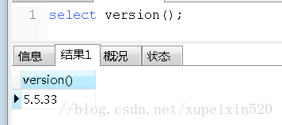

数据量：

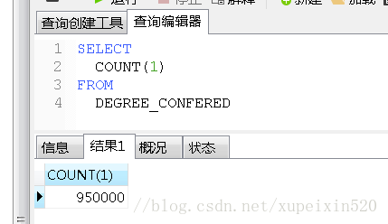

索引失效情况总结：

创建索引sql：ALTER TABLE `table_name` ADD INDEX index_name ( `column` )，表中先创建2个字段的普通索引     

1.sql语句中or的语句使用,执行sql：

1).生效

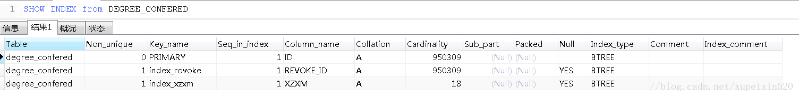

2).未生效

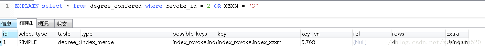

总结:or的使用2边必须都是索引列，如果有一列不是，则索引无法生效，进行了全表扫描

2.like的使用:

1).生效

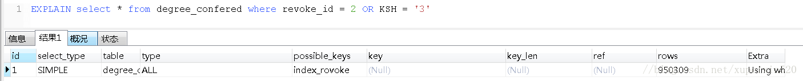

2).未生效:

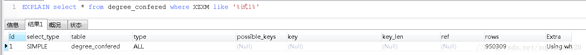

总结:like的百分号不能写在前面，否则无法生效，进行全表扫描

3.索引列上进行计算:

1).生效

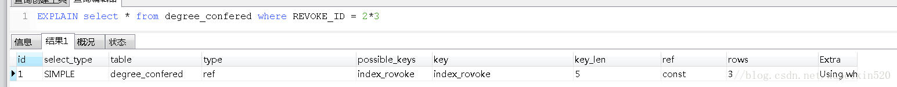

2).未生效

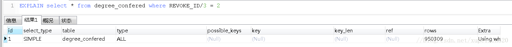

 总结:索引列上不能进行计算，可以将计算放到条件上

4.索引列是varchar类型

1).生效

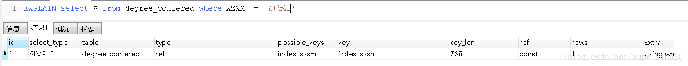

2).未生效

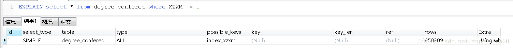

总结:索引列如果是varchar字符串类型，则必须加上''进行包含

5.组合索引:创建索引sql（ALTER TABLE `table_name` ADD INDEX index_name(`column`,`column`,`column`);）,遵从最左前缀利用索引中最左边的列集来匹配行，这样的列称为最左前缀，例如由id,name,age3个字段构成的索引，索引行中按id/name/age的顺序存放，索引可以搜索下面字段组合：（id,name,age）、(id,name)、或者id。如果列不构成索引最左面的前缀，MySQL不能使用局部索引，如（age）或者（name，age）组合则不能使用索引查询

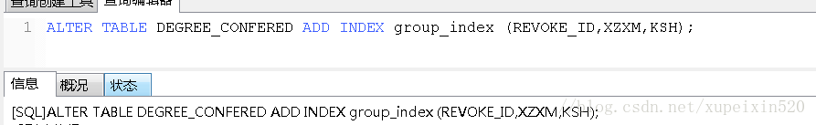

1)生效:

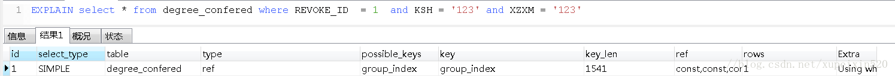
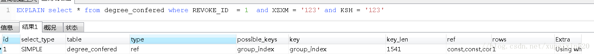
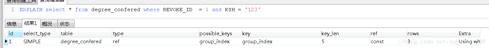
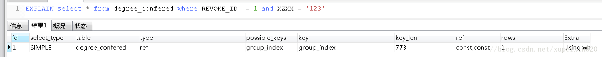
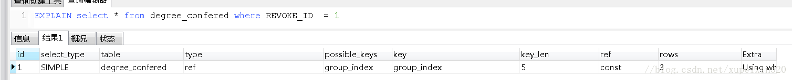

2）.未生效

1.未按照最左前缀的原则：

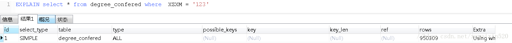
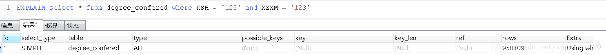

2.按照最左前缀使用or进行查询：

 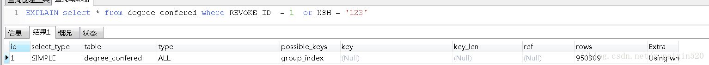
 

3.遵从原则，在索引列上进行计算

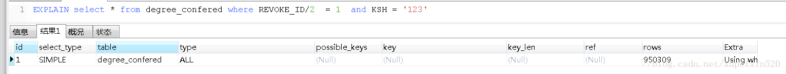
