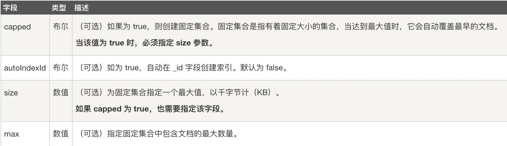
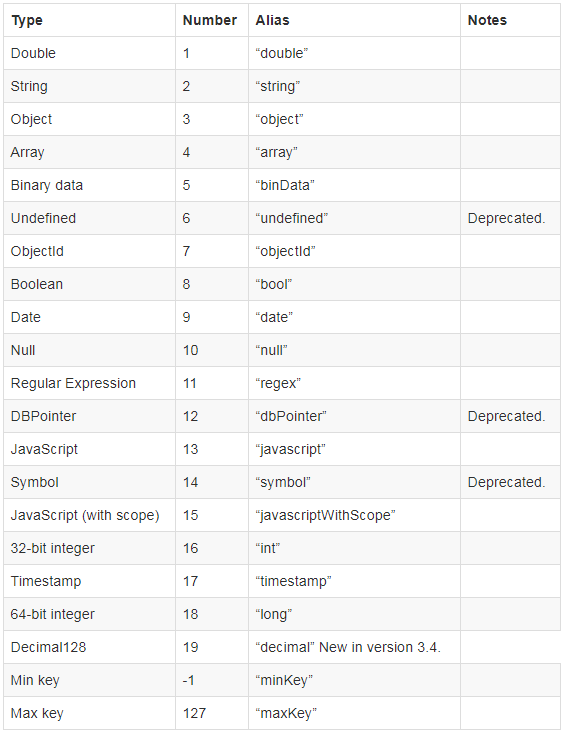
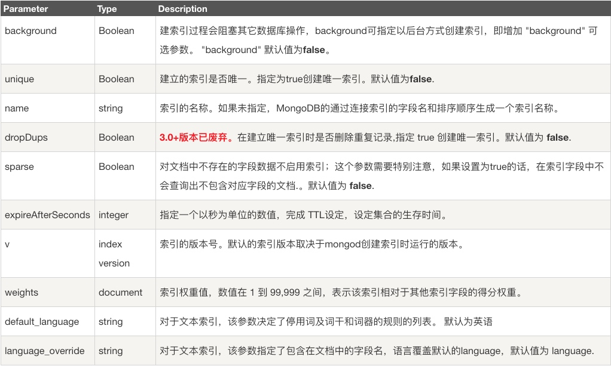
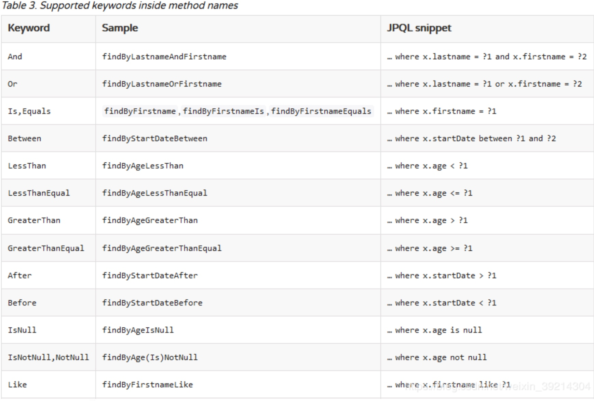
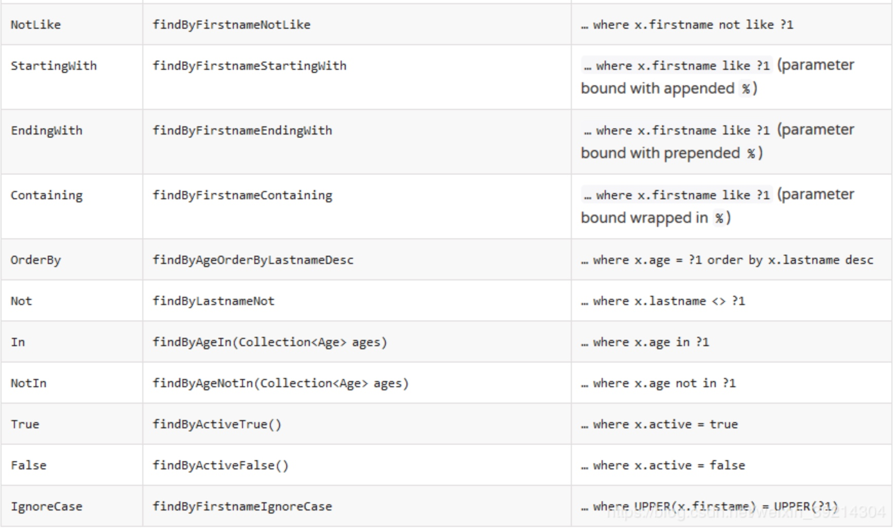

[参考文档](https://www.jianshu.com/p/4ecde929b17d)
[教程](https://www.runoob.com/mongodb/mongodb-tutorial.html)
# 连接mongo
`mongo ip:port`
`mongo ip:port/dbname -u 用户名 -p 密码`

# 显示数据库
`show dbs;`

# 使用数据库
`use dbName;`

# 创建数据库
```
#use dbname时，dbname不存在，则创建数据库，否则切换到指定数据库
use dbName
#此时运行show dbs看不到新创建的库，需要插入一些数据之后才能看到
db.dbName.insert({"name":"123"})
```

# 显示表
`show tables;`
或者
`show collections;`

# 创建表
`db.createCollection(name, options)`
参数说明：
* name: 要创建的集合名称
* options: 可选参数, 指定有关内存大小及索引的选项

options 可以是如下参数：



```shell
# 不带参数
db.createCollection("runoob")
# 带参数
db.createCollection("mycol", { capped : true, autoIndexId : true, size : 6142800, max : 10000 } )
```

不是必须的，mongo插入数据时当表不存在会自动创建

# 字段操作

## 添加字段并设置默认值
语法：`db.doc名称.update({}, {$set: {新字段名称: 默认值}}, false, true)`

`db.media_source.update({}, {$set: {self_media: false}}, false, true)`

## 修改已有数据的字段类型

字段类型判断

```
db.tb_name.find({"status":{$type:"double"}).count() //所有的status字段类型为Double类型的

db.tb_name.find({"status":{$type:1}).count() //所有status字段类型为Double类型的
```

mongo字段类型对应表


数据类型批量转换
（double转为int32）：
`db.tb_name.find({"status":{$type:1}}).forEach(function(x){x.status=NumberInt(x.status);db.tb_name.save(x)})
` 

（string转为array）：
`db.log.find({"record":{$type:2}}).forEach(function(x){x.record=Array(x.record);db.log.save(x)})`

## 删除已有字段

查询语句

```mongo
db.getCollection("A表").update({},{$unset:{"a":1}},{multi:true})
```

作用：删除A表中a字段

查询语句分析
条件： 可以不写
更新：$unset:{"a":1}   删除A表中a字段
是否改变多条记录：multi: true  (不加这个，则默认改变 符合查询条件的第一条记录)

# 索引操作

## 新增索引
给title字段创建索引
`db.col.createIndex({"title":1})`
1 为指定按升序创建索引，如果你想按降序来创建索引指定为 -1 即可

用title和description创建复合索引
`db.col.createIndex({"title":1,"description":-1})`

在后台创建索引，防止索引创建过程中**阻塞**其他数据库操作
`db.col.createIndex({open: 1, close: 1}, {background: true})`
background的默认值是false

## 查看索引
查看集合的所有索引
`db.col.getIndexes()`

查看集合索引文件的大小
`db.col.totalIndexSize()`

## 删除索引
删除集合所有索引
`db.col.dropIndexes()`

删除集合指定索引
`db.col.dropIndex("索引名称")`

# 插入数据
`db.tableName.save({"a":"b"})`

# 查询数据
## 查表里所有数据
`db.tableName.find(); //默认查20条`

## 查指定字段
`db.tableName.find({"columnName":"value"});`

## 查大于、小于、不等于

```shell
#$gt表示>，lt表示<，gte表示>=，lte表示<=，ne表示!=
db.tableName.find({"columnName" : {$gt: 22}}); 
```

##查字段长度大于小于

```shell
//查询商品名称长度大于25个字符的商品
db.item.find({ "item_name" : { "$exists" :  true ,  "$regex" : /^.{25,}$/}}).limit(5)
 
//查询商品名称长度小于5个字符的商品
db.item.find({ "item_name" : { "$regex" : /^.{0,5}$/}}).limit(5)
```

## 字段去重

`db.tableName.distinct("columnName")；`

## 只查指定列数据

`db.tableName.find({},{"columnName":1});//注意参数里是两个json，第一个json是条件，第二个json是显示字段`

## 排序

`db.tableName.find().sort({"columnName":1});//1为升序，-1为降序`

## 查指定条数

`db.tableName.find().limit(5);//查前五条`

## 查指定集合个数的数据
`db.tableName.find({"columnName":{$size:3}});//columnName是数组，查columnName数组元素个数是3的数据`

## or
`db.tableName.find({$or:[{"columnName":"value"},{"cloumnName2":"value2"}]});//注意or条件是json数组`

## 查一条
会格式化显示
`json：db.tableName.findOne();`

## 查条数
`db.tableName.find({age: {$gte: 25}}).count();// = select count(*) from tableName where age >= 25;`

## 聚合查询

### sum 

```shell
#select sum(tolStore ) from tableName,_id为group by的字段，没有为null
db.tableName.aggregate([{$group:{_id:null,total:{$sum:"$tolStore"}}}])；
```

### group

```shell
#match为where条件
db.rptDailyDishSale.aggregate([{$match:{'storeId':'cbe34014-cfd3-477b-9344-6c1c951bc8ca','bussDate':'2016-11-08'}},{$group:{_id:'$dishName'}}])
```

### sum和group组合使用 
     
```shell
#分组完之后查总记录条数，如果查每个记录的条数的话就在第一个group的json里加sum
db.rptDailyDishSale.aggregate([{$match:{'storeId':'cbe34014-cfd3-477b-9344-6c1c951bc8ca','bussDate':'2016-11-08'}},{$group:{_id:'$dishName'}},{$group:{_id:null,a:{$sum:1}}}])

#指定字段sum
db.rptDailyBussStat.aggregate([{ $match:{'bussDate':'2016-09-11'}},{$group: { _id:null,transTime:{ $sum:'$transTime'}}}])
```

## 是否存在指定字段的数据
`db.accBillMongo.find({'payList':{$exists:true}})` 
注意exists表达式不能带引号，否则就是查字段值等于表达式字符串的数据了
  
## 字段是否为空
`db.accBillMongo.find({'CurrentApproverList':{$ne:null}})`
     
## 模糊查询 

```shell
#like ‘A%' 冒号后面不带引号
db.UserInfo.find({'userName':/^A/}) 
#like ‘%A%'  
db.UserInfo.find({'userName':/A/})   
```
     
## 查最大最小值 

结合sort和limit(1)
```shell
#sort -1倒叙 1正序
db.rptDailyPrefStat.find().sort({'bussDate':-1}).limit(1)
```

## 去重

`db.dimStore.distinct('tenantId’)`

## 去重后计算条数

`db.dimStore.distinct('tenantId').length`

## 带条件去重

`db.runCommand({"distinct":”表名","key":”去重字段","query":{"time":/^2011-12-15/}}).values.length`

# 更新数据


`db.collection.update( criteria, objNew, upsert, multi );`
* criteria : update的查询条件，类似sql update查询内where后面的
* objNew   : update的对象和一些更新的操作符（如$,$inc...）等，也可以理解为sql update查询内set后面的
* upsert   : 这个参数的意思是，如果不存在update的记录，是否插入objNew,true为插入，默认是false，不插入。
* multi    : mongodb默认是false,只更新找到的第一条记录，如果这个参数为true,就把按条件查出来多条记录全部更新。

例：

```shell
#只更新了第一条记录
db.test0.update( { "count" : { $gt : 1 } } , { $set : { "test2" : "OK"} } ); 
#全更新
db.test0.update( { "count" : { $gt : 3 } } , { $set : { "test2" : "OK"} },false,true ); 
#没查到匹配数据后，只添加一条
db.test0.update( { "count" : { $gt : 4 } } , { $set : { "test5" : "OK"} },true,false ); 
#没查到匹配数据后，全加进去了，没啥屁用，都没有匹配数据了就算全加进去也是加一条
db.test0.update( { "count" : { $gt : 5 } } , { $set : { "test5" : "OK"} },true,true ); 
#全更新
db.test0.update( { "count" : { $gt : 15 } } , { $inc : { "count" : 1} },false,true );
#只更新第一条
db.test0.update( { "count" : { $gt : 10 } } , { $inc : { "count" : 1} },false,false );
```

## 删除字段

db.test0.update( { "count" : { $gt : 1 } } , { $unset : { "test2" : ""} } ); 


# 删除数据
        
```shell
#清表
db.tableName.drop();
#根据查询条件删数据
db.tableName.remove({"columnName ": "value"});
```

# 数据导入导出
导入导出常用命令有
* mongoexport / mongoimport
* mongodump  / mongorestore

区别是：
* mongoexport / mongoimport导入导出是JSON格式,而mongodump/mongorestore导入导出的是BSON格式
* JSON可读性强但是体积较大,BSON则是二进制文件,体积小但是人类几乎没有可读性
* 在一些mongodb版本之间,**BSON格式可能会随版本的不同而有所区别,所以不同版本之间用mongodump/mongorestore可能不会成功**,具体要看版本之间的兼容性,当无法使用BSON进行跨版本的数据迁移的时候,使用JSON格式即mongoexport/mongoimport是一个可选项,跨版本的mongodump/mongorestore不推荐,
* JSON虽然具有较好的跨版本通用性,但是只包里的数据部分,不保留索引,账户等其他基础信息
* mongoexport / mongoimport只能单表导入导出，必须指定c参数，mongodump  / mongorestore可以整个库导入导出


## 备份数据

`mongodump -d test -o data/backup`
`mongoexport -d test -c abc -o data/backup `

参数说明：
* -h:指明数据库宿主机的IP
* -u:指明数据库的用户名
* -p:指明数据库的密码
* -d:指明数据库的名字
* -c:指明collection的名字
* -o:指明到要导出的文件名
* -q:指明导出数据的过滤条件

## 还原数据

`mongorestore -d test --drop data/backup/test/`
`mongoimport  -d test -c abc --drop data/backup/test/`
参数说明：
* -h:指明数据库宿主机的IP
* -u:指明数据库的用户名
* -p:指明数据库的密码
* -d:指明数据库的名字
* -c:指明collection的名字
* -o:指明到要备份的文件名
* -q:指明备份数据的过滤条件
* --drop 恢复的时候把之前的集合drop掉

## 导出指定表数据

```shelll
mongoexport -h 192.168.49.96:40001 -u cloud_rpt -p cloud_rpt -d cloud_rpt -c accBillMongo -o ~/bill.json --type json
```

# 启动服务
`mongod -f /yazuo/data/mongodb/mongo.conf`  

-f为使用配置文件，mongo.conf为配置文件，不使用配置文件的话可以使用各个启动参数

mongo.conf内容包括

```shell
dbpath=/yazuo/data/mongodb
logpath=/yazuo/logs/mongodb/mongo30000.log
port=30000
logappend=true
fork=true
journal=true
```

## 启用权限认证
`mongod -f /yazuo/data/mongodb/mongo.conf --auth`

单机模式只需要启动时加auth就可以
副本集模式需要配置keyFile，**且keyFile文件的权限必须是600**

生成keyFile
keyFile内容长度为6到1024，且必须是base64范围里的字符
`openssl rand -base64 100 > /mongodb/scheme2/keyfile0`

注意，启用权限认证后，连mongo需要指定库、用户名和密码
`./mongo database -u username -p password`
或者连上后，使用db.auth认证

```
./mongo
use db;
db.auth("username","password");
```

[安全认证参考文档](https://www.cnblogs.com/silentjesse/p/4676440.html)

# 停止服务
方法一：查看进程，使用kill命令；**不能使用kill -9**
方法二：在客户端进去，使用shutdown命令

```
> use admin;
switched to db admin
> db.shutdownServer();
server should be down...
``` 

在主节点（primary）上运行shutdown命令时，服务器在关闭之前，会先等待备份节点追赶主节点以保持同步。这将回滚的可能性降至最低，但**shutdown操作有失败的可能性**。如几秒钟内没有备份节点成功同步，则shutdown操作失败，主节点不会停止运行。
 

# 当前数据库连接数查询

`db.serverStatus().connections`
     
# mongo安装

## 参考文档
[mongo安装](https://www.cnblogs.com/pfnie/articles/6759105.html)
[副本集配置](https://www.cnblogs.com/cowboys/p/9264140.html)
## 下载地址
[https://www.mongodb.org/dl/linux](https://www.mongodb.org/dl/linux)

## 安装
下载完后直接解压就可以了

## 配置文件

```shell
#数据文件
dbpath=/home/data/mongo
#日志
logpath=/home/data/logs/mongo/mongodb.log
#端口
port=27017
#后台模式
fork=true
#副本集名称
replSet = replset
#启用权限认证
auth=true
#keyfile，每个副本集服务器上都需要且内容一样
keyFile=/usr/local/mongoDb/mongodb-linux-x86_64-3.4.6/keyFile
```

生成keyFile命令：
`openssl rand -base64 100 > /mongodb/scheme2/keyfile0`
**keyFile文件权限必须是600**


## 启动
./bin/mongod -f 配置文件路径

## 副本集配置
./mongo后执行

```shell
#副本集配置定义
config = {
_id : "replset",
members : [
{_id : 0, host : "10.50.162.128:27017"},
{_id : 1, host : "10.50.162.87:27017"},
{_id : 2, host : "10.50.162.177:27017"}]}

#初始化副本集
rs.initiate(config)

#写测试数据
for(var i = 0; i < 100; i++) {
db.test.insert({order: i, name: "test" + i}) }

#各个节点查看写入结果
db.test.count();

#报not master and slaveok=false，这是正常的，因为SECONDARY是不允许读写的，如果非要解决，方法如下：
#注意是在SECONDARY上执行
rs.slaveOk();

```

### 副本集状态

```
#查看副本集状态
rs.status();
```
* STARTUP：刚加入到复制集中，配置还未加载
* STARTUP2：配置已加载完，初始化状态
* RECOVERING：正在恢复，不适用读
* ARBITER: 仲裁者
* DOWN：节点不可到达
* UNKNOWN：未获取其他节点状态而不知是什么状态，一般发生在只有两个成员的架构，脑裂
* REMOVED：移除复制集
* ROLLBACK：数据回滚，在回滚结束时，转移到RECOVERING或SECONDARY状态
* FATAL：出错。查看日志grep “replSet FATAL”找出错原因，重新做同步
* PRIMARY：主节点
* SECONDARY：备份节点

## 创建库
mongo没有专门的建库语句，使用use就会创建库
`use test`
但是新库创建后如果不插入数据就退出了终端，新库会被删除，所以应该立刻插入一条测试数据
`db.test.save({"a":"b"})`

## 创建用户
**在需创建用户的库下执行**

```shell
db.createUser({user: "root", pwd: "123456", roles: [{ role: "dbOwner", db: "test" }]})
```

## 创建管理员
**在admin库下执行**

```shell
db.createUser( {user: "admin",pwd: "123456",roles: [ { role: "userAdminAnyDatabase", db: "admin" } ]});
```

## 用户角色

MongoDB基本的角色

* 数据库用户角色：read、readWrite;
* 数据库管理角色：dbAdmin、dbOwner、userAdmin；
* 集群管理角色：clusterAdmin、clusterManager、clusterMonitor、hostManager；
* 备份恢复角色：backup、restore；
* 所有数据库角色：readAnyDatabase、readWriteAnyDatabase、userAdminAnyDatabase、dbAdminAnyDatabase
* 超级用户角色：root  只能在admin库里使用，这里还有几个角色间接或直接提供了系统超级用户的访问（dbOwner 、userAdmin、userAdminAnyDatabase）

其中MongoDB默认是没有开启用户认证的，也就是说游客也拥有超级管理员的权限。userAdminAnyDatabase：有分配角色和用户的权限，但没有查写的权限

# 索引相关
## 查看集合索引

`db.col.getIndexes()`
## 查看集合索引大小

`db.col.totalIndexSize()`
## 删除集合所有索引

`db.col.dropIndexes()`
## 删除集合指定索引

`db.col.dropIndex("索引名称")`
## 创建索引

基本语法：
`db.collection.createIndex(keys, options)`
语法中 Key 值为你要创建的索引字段，1 为指定按升序创建索引，如果你想按降序来创建索引指定为 -1 即可
如：
`db.col.createIndex({"title":1})`
createIndex() 方法中你也可以设置使用多个字段创建索引（关系型数据库中称作复合索引）。
`db.col.createIndex({"title":1,"description":-1})`

createIndex() 接收可选参数，可选参数列表如下：



# Spring mongoTemplate常用方法

```java
//分组查询条数,如果查所有的条数则group字段随便传一个不存在的，如group(“1")
Aggregation aggregation = Aggregation. newAggregation(Aggregation .match( c),Aggregation. group("storeStat" , "storeProp" ).count().as("count" ));
AggregationResults<HashMap> aggRes = this .getMongoTemplate().aggregate(aggregation , "dimStore" , HashMap. class);
List<HashMap > listRes = aggRes .getMappedResults();

//分组求和
List<Map<String, Object>> result = new ArrayList<>();
List<AggregationOperation> aggList = new ArrayList<>();
 if (StringUtils.isNotBlank( startDate))
     aggList .add(Aggregation.match(Criteria. where( "bussDate").lte( endDate ).gte(startDate )));
 if (storeIds != null && storeIds .length > 0)
     aggList .add(Aggregation.match(Criteria. where( "storeId").in( storeIds )));
 aggList .add(Aggregation.match(Criteria. where( "saleMode").lt(888)));
 aggList .add(Aggregation.group( "storeId" , "payId" ).sum( "payAmount" ).as("payAmount" )
       . sum( "overAmount").as( "overAmount" ));
 aggList .add(Aggregation.project( "storeId" , "payId" , "payAmount" , "overAmount" ));
AggregationOperation[] aoArray = new AggregationOperation[aggList .size()];
 for (int i = 0; i < aggList.size(); i ++)
    aoArray [i ] = aggList.get( i);
Aggregation aggregation = Aggregation.newAggregation( aoArray);
AggregationResults<HashMap> aggRes = this .getMongoTemplate().aggregate(aggregation ,
"rptDailyPayStat" , HashMap.class );
List<HashMap> list = aggRes .getMappedResults();


//简单查询，不需要分组
Criteria c = Criteria.where( "_id"). is (dishId );
         Query query = new Query ();
         query.addCriteria ( c);
         List <DimDish > dishList = mongoTemplate .find ( query, DimDish .class , "dimDish");
         if (dishList != null && dishList .size () > 0 ){
             return dishList .get ( 0). getDishName ();
        }
         else {
             return null ;
        }


//更新
Query queryCondition = new Query ();
             queryCondition .addCriteria ( Criteria. where( "bussDate"). is (tem . getBussDate())
                    . and ("storeId" ). is( tem .getStoreId ()). and( "saleMode" ).is ( tem. getSaleMode ()));

             logger. debug( "查询条件为：{}" , JSON .toJSONString( queryCondition .getQueryObject ()));
             // 做修改操作
             Update update = new Update ();

             update .set ( "bussDate", tem .getBussDate ());
             
             update .inc ( "membZeroGuests", tem .getMembZeroGuests ());
             //未计收入金额在RptDailyPayStatMongoImpl中计算
             // 做修改操作
             mongoTemplate. upsert( queryCondition , update , RptDailyBussStat . class);

//模糊查询
Criteria.where("storeName").regex(storeName)

```


# MongoRepository用法
MongoRepository是Spring-data-mongodb包里的mongo操作类，Spring-data-mongodb
是Spring-data的一个模块

MongoRepository遵循Spring Data Jpa 方法定义规范，通过方法名中的特殊单词来自动解析查询语句

Jpa语法：



GreaterThan(大于) 
方法名举例：findByAgeGreaterThan(int age) 
query中的value举例：{“age” : {“$gt” : age}}

LessThan（小于） 
方法名举例：findByAgeLessThan(int age) 
query中的value举例：{“age” : {“$lt” : age}}

Between（在…之间） 
方法名举例：findByAgeBetween(int from, int to) 
query中的value举例：{“age” : {“gt":from,"lt” : to}}

Not（不包含） 
方法名举例：findByNameNot(String name) 
query中的value举例：{“age” : {“$ne” : name}}

Near（查询地理位置相近的） 
方法名举例：findByLocationNear(Point point) 
query中的value举例：{“location” : {“$near” : [x,y]}}

## 示例

```java
/**
 * 根据修改时间，分类id查询
 */
List<NewsContent> findByGmtModifiedBetweenAndStatus(Long from, Long to, Integer status);
```

```java
/**
 * 只返回id字段
 */
@Query(fields = "{ '_id' : 1}")
List<NewsContent> findIdByGmtModifiedBetween(Long from, Long to);
```

```java
/**
 * 通过Query的value指定查询条件
 * 如果要使用入参做查询条件，用?0表示占位符，其中0表示方法的第一个参数
 */
@Query(value="{'_id':{'$ne':null}}",fields="{'name':1}")
List<NewsContent> find();
@Query(value="{'name':?0}",fields="{'name':1}")
public Page<Person> findByNameLike(String name,Pageable pageable);
```