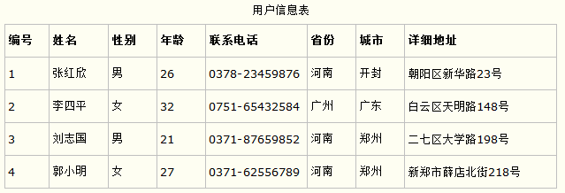
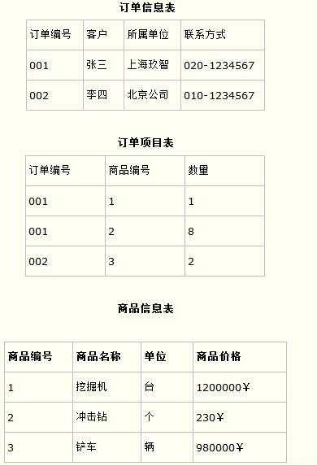
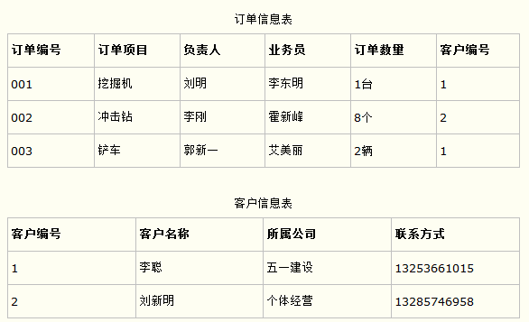

### 三大范式
为了建立冗余较小、结构合理的数据库，设计数据库时必须遵循一定的规则。在关系型数据库中这种规则就叫做范式。

范式就是符合某一种设计要求的总结，要想设计一个结构合理的关系型数据库，必须满足一定的范式。

在实际开发中最常见的设计范式有三个：

#### 1、第一范式（确保每列保持原子性）

第一范式是最基本的范式。如果数据库表中的所有字段值都是不可分解的原子值，就说明该数据库满足第一范式。

第一范式的合理遵循需要根据系统给的实际需求来确定。比如某些数据库系统中需要用到“地址”这个属性，本来直接将“地址”属性设计成为一个数据库表的字段就行，但是如果系统经常访问“地址”属性中的“城市”部分，那么一定要把“地址”这个属性重新拆分为省份、城市、详细地址等多个部分来进行存储，这样对地址中某一个部分操作的时候将非常方便，这样设计才算满足数据库的第一范式。如下图。

上图所示的用户信息遵循第一范式的要求，这样对用户使用城市进行分类的时候就非常方便，也提高了数据库的性能。

 

#### 2、第二范式（确保表中的每列都和主键相关）

第二范式在第一范式的基础上更进一层，第二范式需要确保数据库表中每一列都和主键相关，而不能只与主键的某一部分相关（主要针对联合主键而言）。也就是说在一个数据库表中，一个表中只能保存一种数据，不可以把多种数据保存在同一张数据库表中。

比如要设计一个订单信息表，因为订单中可能会有多种商品，所以要将订单编号和商品编号作为数据库表的联合主键，如下图。

这里产生一个问题：这个表中是以订单编号和商品编号作为联合主键，这样在该表中商品名称、单位、商品价格等信息不与该表的主键相关，而仅仅是与商品的编号相关，所以在这里违反了第二范式的设计原则。

而如果把这个订单信息表进行拆分，把商品信息分离到另一个表中，把订单项目表也分离到另一个表中，就非常完美了，如下图。

这里这样设计，在很大程度上减小了数据库的冗余，如果要获取订单的商品信息，使用商品编号到商品信息表中查询即可。

 

#### 3、第三范式（确保每列都和主键列直接相关，而不是间接相关）

第三范式需要确保数据表中的每一列数据都和主键直接相关，而不能间接相关。

比如在设计一个订单数据表的时候，可以将客户编号作为一个外键和订单表建立相应的关系，而不可以在订单表中添加关于客户其他信息（比如姓名、所属公司）的字段，如下面这两个表所示的设计就是一个满足第三范式的数据库表。

这样在查询订单信息的时候，就可以使用客户编号来引用客户信息表中的记录，也不必再订单信息表中多次输入客户信息的内容，减小了数据冗余。

### 五大约束

数据库五大约束

1. primary KEY:设置主键约束；
2. UNIQUE：设置唯一性约束，不能有重复值；
3. DEFAULT 默认值约束，height DOUBLE(3,2)DEFAULT 1.2 height不输入是默认为1,2
4. NOT NULL：设置非空约束，该字段不能为空；
5. FOREIGN key :设置外键约束。

#### 主键
1. 主键的注意事项？
主键默认非空，默认唯一性约束，只有主键才能设置自动增长，自动增长一定是主键，主键不一定自动增长；
2. 设置主键的方式？
在定义列时设置：ID INT PRIMARY KEY
在列定义完之后设置：primary KEY（id）

#### 外键

1. 设置外键的注意事项：   
只有INNODB的数据库引擎支持外键，修改my.ini文件设置default-storage-engine=INNODB    外键必须与参照列的数据类型必须相同（数值型要求长度和无符号都相同，字符串要求类型相同，长度可以不同）。

2. 设置外键的语法：
CONSTRAINT 外键名 FOREIGN KEY (外键字段)REFERENCES 参照表 (参照字段)    ON DELETE SET NULL ON UPDATE CASCADE 设置参照完整性

3. 外键约束的参照操作？  

  参照表的完整性操作：当对参照表的参照字段进行删除或更新时，外键表中的外键如何应对；   

参照操作可选值：

      RESTRICT拒绝参照表删除或更新参照字段；               

      RESTRICT和NO ACTION相同，但这个指令只在mysql生效;                

      CASCADE删除或更新参照表的参照字段时，外键表的记录同步删除更新；               

      SET NULL 删除或更新参照表的参照字段时，外键表的外键设为NULL;