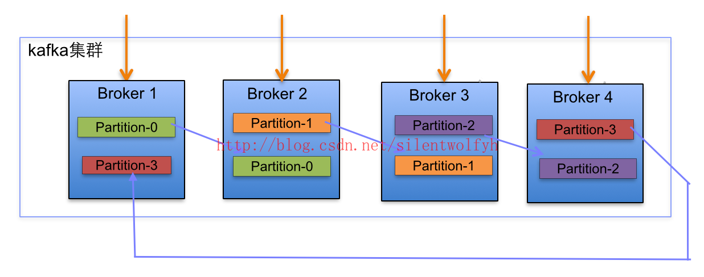
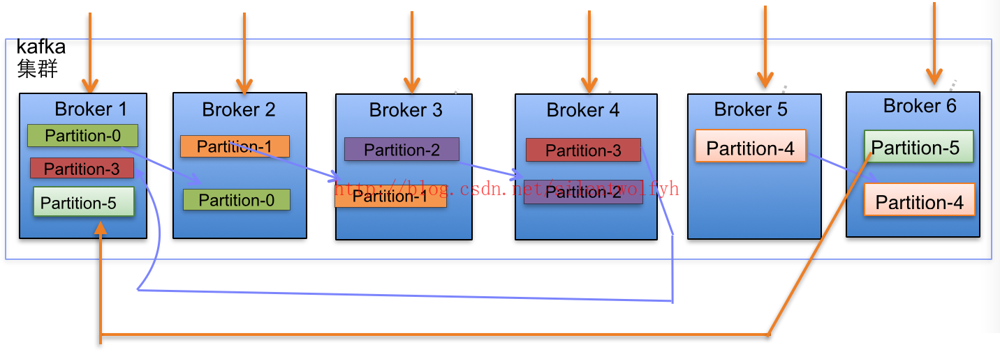
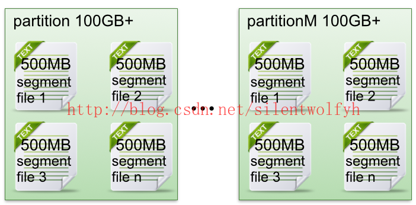
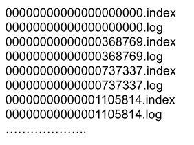
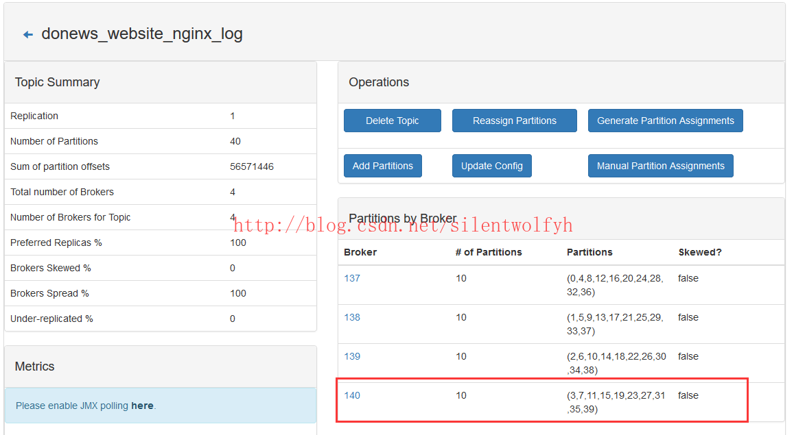
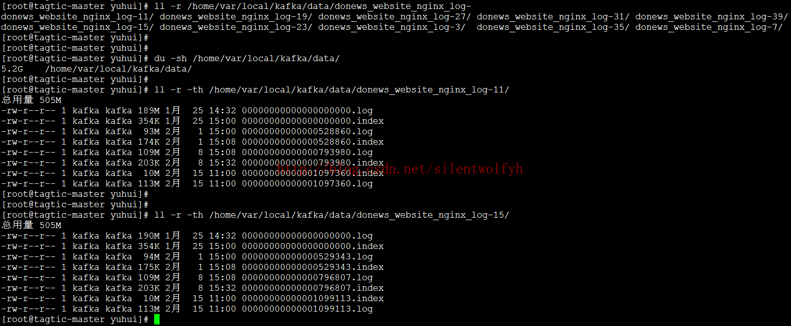
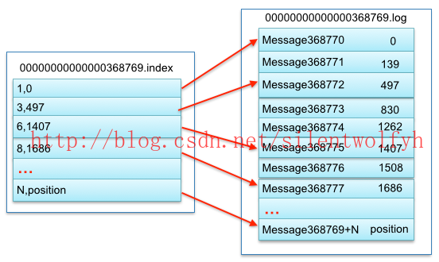
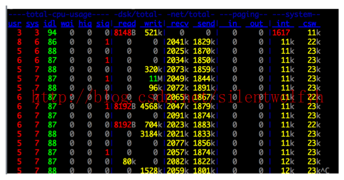

# 常用命令
## topic查询

```shell
./kafka-topics --list --zookeeper localhost:2181
```

## 创建topic

```shell
./kafka-topics --create --zookeeper localhost:2181 --replication-factor 1 --partitions 1 --topic test
```

1. 从命令行中获取要创建的topic名称
2. 解析命令行指定的topic配置(如果存在的话)，配置都是x=a的格式
3. 若指定了replica-assignment参数表明用户想要自己分配分区副本与broker的映射——通常都不这么做，如果不提供该参数Kafka帮你做这件事情
4. 检查必要的参数是否已指定，包括：zookeeper， replication-factor，partition和topic
5. 获取/brokers/ids下所有broker并按照broker id进行升序排序
6. 在broker上分配各个分区的副本映射 (没有指定replica-assignment参数，这也是默认的情况)
7. 检查topic名字合法性、自定义配置的合法性，并且要保证每个分区都必须有相同的副本数
8. 若zookeeper上已有对应的路径存在，直接抛出异常表示该topic已经存在
9. 确保某个分区的多个副本不会被分配到同一个broker
10. 若提供了自定义的配置，更新zookeeper的/config/topics/[topic]节点的数据
11. 创建/brokers/topics/[topic]节点，并将分区副本分配映射数据写入该节点

## 删除topic

```shell
./kafka-topics --zookeeper localhost:2181  --delete --topic "clicki_info_topic"

```
## 显示topic详细信息
### 单个查询


```shell
./kafka-topics --zookeeper localhost:2181 --topic "clicki_track_topic" --describe
```

### 查所有


```shell
./kafka-topics --zookeeper localhost:2181  --describe
```

1. 上图可见，如果指定了--topic就是只显示给定topic的信息，否则显示所有topic的详细信息。
2. 如果指定了under-replicated-partitions，那么就显示那些副本数量不足的分区(ISR size < AR.size)
3. 如果指定了unavailable-partitions，那么就显示那些leader副本已不可用的分区
4. 从zookeeper上获取当前所有可用的broker
5. 遍历每个要describe的topic，
6. 获取这个topic的分区副本分配信息，若该信息不存在说明topic不存在
7. 否则将分配信息按照分区号进行排序
10. 如果没有指定步骤2中的参数也没有指定步骤3中的参数，那么显示分区数信息、副本系数信息以及配置信息
11. 默认情况下还会显示各个分区的信息
12. 从zookeeper中获取每个分区的ISR、Leader、AR信息并显示

## 消费者

```shell
./kafka-console-consumer --bootstrap-server localhost:9092 --topic test --from-beginning
```

## 生产者

```shell
./kafka-console-producer --broker-list localhost:9092 --topic test
```

## 查指定groupId的offset

```shell
./kafka-consumer-groups --bootstrap-server localhost:9092 --describe --group kafka_test
```

## 查topic offset最小值

```shell
./kafka-run-class kafka.tools.GetOffsetShell --broker-list localhost:9092 --topic test --time -2

```
## 查topic offset最大值

```shell
./kafka-run-class kafka.tools.GetOffsetShell --broker-list localhost:9092 --topic test --time -1
```

## 修改offset

### 0.9版本之后的
0.9版本之后的offset信息保存在topic中
> 1. 一定不要忘记加 --execute 选项
> 2. 在修改consumer offset时，需要将该consumer group.id下所有的consumer停止运行才可以进行重置offset的操作。
> 3. 如果不想停止所有的consumer（更多的情况下是不能），并且还想重置offset，那么可以通过KafkaConsumer.seek()来实现offset重置。

1. 设置绝对offset，to-offset值需要在offset的最小值和最大值之间，所以要先查offset的最大和最小值

    ```shell
    ./kafka-consumer-groups --bootstrap-server localhost:9092 --group kafka_test --topic test --reset-offsets --to-offset 10000 --execute
    ```
    
1. 设置相对offset
    * --shift-by  可正可负,正则向后移动,负数则向前移动.
    * --topic test:0,1,2表示test的0 1 2 partition
    
    ```shell
    ./kafka-consumer-groups --bootstrap-server localhost:9092 --reset-offsets  --group kafka_test --topic test:0,1,2 --shift-by -666 --execute
    ```
    
1. 设置到指定时间点
    *  --to-datetime <String: datetime> Reset offsets to offset from datetime. Format: 'YYYY-MM-DDTHH:mm:SS.sss' , 例如 : '2018-01-01T00:00:00.000' 小数点后面的毫秒必须显示指定.
    
    ```shell
     ./kafka-consumer-groups --bootstrap-server localhost:9092  --reset-offsets --to-datetime  2018-11-16T00:00:00.000 --group kafka_test --topic test:0,1,2 --execute
    ```
    
1. 设置到相对时间点，如1个小时之前的
    * --by-duration : The duration must be expressed in the format of PnDTnHnMnS, where nD, nH, nM, and nS indicate the numbers of days, hours, minutes, and seconds respectively. Each n must be a non-negative integer. For example, valid duration values are P1DT1H1M1S, P1D, PT1H1M, and P1DT1S; invalid duration values are -P1D, P1Y1M1D, or PT1H1M1.1S.需要将表达式中的n全部替换成数字.

    ```shell
    # 回滚到1天1小时1分之前
    ./kafka-consumer-groups --bootstrap-server localhost:9092 --reset-offsets  --group kafka_test --topic test:0,1,2 --by-duration P1DT1H1M0S --execute
    ```
    
[参考文档](https://juejin.im/post/5c0cdc25e51d451de22a5547)

### 0.9之前的版本
0.9之前的版本offset信息保存在zookeeper当中

```shell
/kafka-consumer-groups.sh --zookeeper z1:2181,z2:2181,z3:2181 --group test-consumer-group --topic test --execute --reset-offsets --to-offset 10000
# --zookeeper 和 --bootstrap-server 只能选一种方式
```

---

# kafka技能图


---

# 知识点
## Kafka的设计是什么样
Kafka将消息以topic为单位进行归纳
将向Kafka topic发布消息的程序称为producers.
将订阅topics并消费消息的程序成为consumer.
Kafka以集群的方式运行，可以由一个或多个服务组成，每个服务叫做一个broker.
producers通过网络将消息发送到Kafka集群，集群向消费者提供消息

---
## 怎么查看kafka的offset
0.9版本以上，可以用最新的Consumer client 客户端，有
```
consumer.seekToEnd()
consumer.position()
``` 
可以用于得到当前最新的offset

---
## kafka的数据存在内存还是磁盘
Kafka最核心的思想是使用**磁盘**，而不是使用内存，可能所有人都会认为，内存的速度一定比磁盘快，我也不例外。在看了Kafka的设计思想，查阅了相应资料再加上自己的测试后，发现**磁盘的顺序读写速度和内存持平**。
而且Linux对于磁盘的读写优化也比较多，包括read-ahead和write-behind，磁盘缓存等。如果在内存做这些操作的时候，一个是JAVA对象的内存开销很大，另一个是随着堆内存数据的增多，JAVA的GC时间会变得很长。
使用磁盘操作有以下几个好处：
- 磁盘缓存由Linux系统维护，减少了程序员的不少工作。
- 磁盘顺序读写速度超过内存随机读写。
- JVM的GC效率低，内存占用大。使用磁盘可以避免这一问题。
- 系统冷启动后，磁盘缓存依然可用。
 
 ---   
## 怎么解决kafka的数据丢失
- producer端：
宏观上看保证数据的可靠安全性，肯定是依据分区数做好数据备份，设立副本数。
- broker端：
topic设置多分区，分区自适应所在机器，为了让各分区均匀分布在所在的broker中，分区数要大于broker数。
分区是kafka进行并行读写的单位，是提升kafka速度的关键。
- Consumer端
consumer端丢失消息的情形比较简单：如果在消息处理完成前就提交了offset，那么就有可能造成数据的丢失。由于Kafka consumer默认是自动提交位移的，所以在后台提交位移前一定要保证消息被正常处理了，因此不建议采用很重的处理逻辑，如果处理耗时很长，则建议把逻辑放到另一个线程中去做。为了避免数据丢失，现给出两点建议：
enable.auto.commit=false 关闭自动提交位移
在消息被完整处理之后再手动提交位移

---
## kafka集群的规模，消费速度是多少。

一般中小型公司是10个节点，每秒20M左右。

---
## 数据传输的事务定义有哪三种
数据传输的事务定义通常有以下三种级别：
（1）最多一次: 消息不会被重复发送，最多被传输一次，但也有可能一次不传输
（2）最少一次: 消息不会被漏发送，最少被传输一次，但也有可能被**重复**传输.
（3）精确的一次（Exactly once）: 不会漏传输也不会重复传输,每个消息都传输被一次而且仅仅被传输一次，这是大家所期望的
[配置方式参考](https://blog.csdn.net/laojiaqi/article/details/79034798)

---
## Kafka判断一个节点是否还活着有哪两个条件
1. 节点必须可以**维护和ZooKeeper的连接**，Zookeeper通过心跳机制检查每个节点的连接
2. 如果节点是个**follower,他必须能及时的同步leader的写操作**，延时不能太久

---
## producer是否直接将数据发送到broker的leader(主节点)
是的，producer直接将数据发送到broker的leader(主节点)，不需要在多个节点进行分发，为了帮助producer做到这点，所有的Kafka节点都可以及时的告知:哪些节点是活动的，目标topic目标分区的leader在哪。这样producer就可以直接将消息发送到目的地了

---
## Kafa consumer是否可以消费指定分区消息？
Kafa consumer消费消息时，向broker发出**"fetch"**请求去消费特定分区的消息，consumer指定消息在日志中的偏移量（offset），就可以消费从这个位置开始的消息，customer拥有了offset的控制权，可以向后回滚去重新消费之前的消息，这是很有意义的

---
## Kafka消息是采用Pull模式，还是Push模式
Kafka最初考虑的问题是，customer应该从brokes拉取消息还是brokers将消息推送到consumer，也就是pull还push。在这方面，Kafka遵循了一种大部分消息系统共同的传统的设计：**producer将消息推送到broker，consumer从broker拉取消息**

一些消息系统比如Scribe和Apache Flume采用了push模式，将消息推送到下游的consumer。这样做有好处也有坏处：由broker决定消息推送的速率，对于不同消费速率的consumer就不太好处理了。消息系统都致力于让consumer以最大的速率最快速的消费消息，**但不幸的是，push模式下，当broker推送的速率远大于consumer消费的速率时，consumer恐怕就要崩溃了。**最终Kafka还是选取了传统的pull模式

Pull模式的另外一个好处是**consumer可以自主决定是否批量的从broker拉取数据**。Push模式必须在不知道下游consumer消费能力和消费策略的情况下决定是立即推送每条消息还是缓存之后批量推送。如果为了避免consumer崩溃而采用较低的推送速率，将可能导致一次只推送较少的消息而造成浪费。Pull模式下，consumer就可以根据自己的消费能力去决定这些策略

Pull有个缺点是，如果broker没有可供消费的消息，将导致consumer不断在循环中轮询，直到新消息到达。为了避免这点，Kafka有个参数可以让consumer阻塞直到新消息到达(当然也可以阻塞知道消息的数量达到某个特定的量这样就可以批量发

## Kafka存储在硬盘上的消息格式是什么？
消息由一个**固定长度的头部和可变长度的字节数组**组成。头部包含了一个版本号和CRC32校验码。
* 消息长度: 4 bytes (value: 1+4+n)
* 版本号: 1 byte
* CRC校验码: 4 bytes
* 具体的消息: n bytes

## Kafka高效文件存储设计特点
1. Kafka把topic中一个parition**大文件分成多个小文件段**，通过多个小文件段，就容易**定期清除或删除已经消费完文件**，减少磁盘占用。
2. 通过索引信息可以快速定位message和确定response的最大大小。
3. 通过index元数据全部映射到memory，可以避免segment file的IO磁盘操作。
4. 通过**索引文件稀疏存储**，可以大幅降低index文件元数据占用空间大小。

详见Kafka文件的存储机制章节

## Kafka 与传统消息系统之间有三个关键区别
1. Kafka 持久化日志，这些日志可以被重复读取和无限期保留
1. Kafka 是一个分布式系统：它以集群的方式运行，可以灵活伸缩，在内部通过复制数据提升容错能力和高可用性
1. Kafka 支持实时的流式处理

## Kafka创建Topic时如何将分区放置到不同的Broker中
* 副本因子不能大于 Broker 的个数；
* 第一个分区（编号为0）的第一个副本放置位置是随机从 brokerList 选择的；
* 其他分区的第一个副本放置位置相对于第0个分区依次往后移。也就是如果我们有5个 Broker，5个分区，假设第一个分区放在第四个 Broker 上，那么第二个分区将会放在第五个 Broker 上；第三个分区将会放在第一个 Broker 上；第四个分区将会放在第二个 Broker 上，依次类推；
* 剩余的副本相对于第一个副本放置位置其实是由 nextReplicaShift 决定的，而这个数也是随机产生的

## Kafka新建的分区会在哪个目录下创建
在启动 Kafka 集群之前，我们需要配置好 log.dirs 参数，其值是 Kafka 数据的存放目录，这个参数可以配置多个目录，目录之间使用逗号分隔，通常这些目录是分布在不同的磁盘上用于提高读写性能。
当然我们也可以配置 log.dir 参数，含义一样。只需要设置其中一个即可。
如果 log.dirs 参数只配置了一个目录，那么分配到各个 Broker 上的分区肯定只能在这个目录下创建文件夹用于存放数据。
但是如果 log.dirs 参数配置了多个目录，那么 Kafka 会在哪个文件夹中创建分区目录呢？答案是：Kafka 会在含有分区目录最少的文件夹中创建新的分区目录，分区目录名为 Topic名+分区ID。注意，是分区文件夹总数最少的目录，而不是磁盘使用量最少的目录！也就是说，如果你给 log.dirs 参数新增了一个新的磁盘，新的分区目录肯定是先在这个新的磁盘上创建直到这个新的磁盘目录拥有的分区目录不是最少为止。

## partition的数据如何保存到硬盘
topic中的多个partition以文件夹的形式保存到broker，每个分区序号从0递增，
且消息有序
Partition文件下有多个segment（xxx.index，xxx.log）
segment 文件里的 大小和配置文件大小一致可以根据要求修改 默认为1g
如果大小大于1g时，会滚动一个新的segment并且以上一个segment最后一条消息的偏移量命名

## kafka的ack机制
request.required.acks有三个值 0 1 -1
0:生产者不会等待broker的ack，这个延迟最低但是存储的保证最弱当server挂掉的时候就会丢数据
1：服务端会等待ack值 leader副本确认接收到消息后发送ack但是如果leader挂掉后他不确保是否复制完成新leader也会导致数据丢失
-1：同样在1的基础上 服务端会等所有的follower的副本受到数据后才会受到leader发出的ack，这样数据不会丢失

## Kafka的消费者如何消费数据
消费者每次消费数据的时候，消费者都会记录消费的物理偏移量（offset）的位置
等到下次消费时，他会接着上次位置继续消费

## 消费者负载均衡策略
一个消费者组中的一个分片对应一个消费者成员，他能保证每个消费者成员都能访问，如果组中成员太多会有空闲的成员

## 数据有序
一个消费者组里它的内部是有序的
消费者组与消费者组之间是无序的

## kafaka生产数据时数据的分组策略
生产者决定数据产生到集群的哪个partition中
每一条消息都是以（key，value）格式
Key是由生产者发送数据传入
所以生产者（key）决定了数据产生到集群的哪个partition

---
# 面试题
1、请说明什么是Apache Kafka?

Apache Kafka是由Apache开发的一种发布订阅消息系统，它是一个分布式的、分区的和重复的日志服务。

2、请说明什么是传统的消息传递方法?

传统的消息传递方法包括两种：

排队：在队列中，一组用户可以从服务器中读取消息，每条消息都发送给其中一个人。

发布-订阅：在这个模型中，消息被广播给所有的用户。

3、请说明Kafka相对传统技术有什么优势?

Apache Kafka与传统的消息传递技术相比优势之处在于：

快速:单一的Kafka代理可以处理成千上万的客户端，每秒处理数兆字节的读写操作。

可伸缩:在一组机器上对数据进行分区和简化，以支持更大的数据

持久:消息是持久性的，并在集群中进行复制，以防止数据丢失。

设计:它提供了容错保证和持久性

4、在Kafka中broker的意义是什么?

在Kafka集群中，broker术语用于引用服务器。

5、Kafka服务器能接收到的最大信息是多少?

Kafka服务器可以接收到的消息的最大大小是1000000字节。

6、解释Kafka的Zookeeper是什么?我们可以在没有Zookeeper的情况下使用Kafka吗?

Zookeeper是一个开放源码的、高性能的协调服务，它用于Kafka的分布式应用。

不，不可能越过Zookeeper，直接联系Kafka broker。一旦Zookeeper停止工作，它就不能服务客户端请求。

Zookeeper主要用于在集群中不同节点之间进行通信

在Kafka中，它被用于提交偏移量，因此如果节点在任何情况下都失败了，它都可以从之前提交的偏移量中获取

除此之外，它还执行其他活动，如: leader检测、分布式同步、配置管理、识别新节点何时离开或连接、集群、节点实时状态等等。

7、解释Kafka的用户如何消费信息?

在Kafka中传递消息是通过使用sendfile API完成的。它支持将字节从套接口转移到磁盘，通过内核空间保存副本，并在内核用户之间调用内核。

8、解释如何提高远程用户的吞吐量?

如果用户位于与broker不同的数据中心，则可能需要调优套接口缓冲区大小，以对长网络延迟进行摊销。

9、解释一下，在数据制作过程中，你如何能从Kafka得到准确的信息?

在数据中，为了精确地获得Kafka的消息，你必须遵循两件事: 在数据消耗期间避免重复，在数据生产过程中避免重复。

这里有两种方法，可以在数据生成时准确地获得一个语义:

每个分区使用一个单独的写入器，每当你发现一个网络错误，检查该分区中的最后一条消息，以查看您的最后一次写入是否成功

在消息中包含一个主键(UUID或其他)，并在用户中进行反复制

10、解释如何减少ISR中的扰动?broker什么时候离开ISR?

ISR是一组与leaders完全同步的消息副本，也就是说ISR中包含了所有提交的消息。ISR应该总是包含所有的副本，直到出现真正的故障。如果一个副本从leader中脱离出来，将会从ISR中删除。

11、Kafka为什么需要复制?

Kafka的信息复制确保了任何已发布的消息不会丢失，并且可以在机器错误、程序错误或更常见些的软件升级中使用。

12、如果副本在ISR中停留了很长时间表明什么?

如果一个副本在ISR中保留了很长一段时间，那么它就表明，跟踪器无法像在leader收集数据那样快速地获取数据。

13、请说明如果首选的副本不在ISR中会发生什么?

如果首选的副本不在ISR中，控制器将无法将leadership转移到首选的副本。

14、有可能在生产后发生消息偏移吗?

在大多数队列系统中，作为生产者的类无法做到这一点，它的作用是触发并忘记消息。broker将完成剩下的工作，比如使用id进行适当的元数据处理、偏移量等。

作为消息的用户，你可以从Kafka broker中获得补偿。如果你注视SimpleConsumer类，你会注意到它会获取包括偏移量作为列表的MultiFetchResponse对象。此外，当你对Kafka消息进行迭代时，你会拥有包括偏移量和消息发送的MessageAndOffset对象。

15、kafka提高吞吐量的配置

最基础的配置是

batch.size 默认是单批次最大16384字节，超过该值就立即发送。

linger.ms 默认是0ms，超过该时间就立即发送。

上面两个条件满足其一，就立即发送消息否则等待。

---

## Kafka文件的存储机制

## Kafka部分名词解释

1、Broker：消息中间件处理结点，一个Kafka节点就是一个broker，多个broker可以组成一个Kafka集群。
2、Topic：一类消息，例如page view日志、click日志等都可以以topic的形式存在，Kafka集群能够同时负责多个topic的分发。
3、Partition：topic物理上的分组，一个topic可以分为多个partition，每个partition是一个有序的队列。
4、Segment：partition物理上由多个segment组成，下面3和4有详细说明。
5、offset：每个partition都由一系列有序的、不可变的消息组成，这些消息被连续的追加到partition中。partition中的每个消息都有一个连续的序列号叫做offset,用于partition唯一标识一条消息.

分析过程分为以下4个步骤：

1、topic中partition存储分布
2、partiton中文件存储方式
3、partiton中segment文件存储结构
4、在partition中如何通过offset查找message

通过上述4过程详细分析，我们就可以清楚认识到kafka文件存储机制的奥秘。

## 1 topic中partition存储分布

假设实验环境中Kafka集群只有一个broker，xxx/message-folder为数据文件存储根目录，在Kafka broker中server.properties文件配置(参数log.dirs=xxx/message-folder)，例如创建2个topic名称分别为report_push、launch_info, partitions数量都为partitions=4 
存储路径和目录规则为： 
xxx/message-folder
|--report_push-0
|--report_push-1
|--report_push-2
|--report_push-3
|--launch_info-0
|--launch_info-1
|--launch_info-2
|--launch_info-3

在Kafka文件存储中，同一个topic下有多个不同partition，每个partition为一个目录，partiton命名规则为topic名称+有序序号，第一个partiton序号从0开始，序号最大值为partitions数量减1。

## 2 Kafka集群partitions/replicas（副本）默认分配解析

下面以一个Kafka集群中4个Broker举例，创建1个topic包含4个Partition，2 Replication；数据Producer流动如图所示：

1. 下面以一个Kafka集群中4个Broker举例，创建1个topic包含4个Partition，2 Replication；数据Producer流动如图所示： 


2. 当集群中新增2节点，Partition增加到6个时分布情况如下： 


3. 副本分配逻辑规则如下：
    * 在Kafka集群中，每个Broker都有均等分配Partition的Leader机会。 
    * 上述图Broker Partition中，箭头指向为副本，以Partition-0为例:broker1中parition-0为Leader，Broker2中Partition-0为副本。 
    * 上述图中每个Broker(按照BrokerId有序)依次分配主Partition,下一个Broker为副本，如此循环迭代分配，多副本都遵循此规则。

4. 副本分配算法如下：
    * 将所有N Broker和待分配的i个Partition排序. 
    * 将第i个Partition分配到第(i mod n)个Broker上. 
    * 将第i个Partition的第j个副本分配到第((i + j) mod n)个Broker上.

## 3 partiton中文件存储方式
下面示意图形象说明了partition中文件存储方式: 
 



* 每个partion(目录)相当于一个巨型文件被平均分配到多个大小相等segment(段)数据文件中。但每个段segment file消息数量不一定相等，这种特性方便old segment file快速被删除。
* 每个partiton只需要支持顺序读写就行了，segment文件生命周期由服务端配置参数决定。

这样做的好处就是能快速删除无用文件，有效提高磁盘利用率。

## 4 partiton中segment文件存储结构

第3节说明了Kafka文件系统partition存储方式，本节深入分析partion中segment file的组成和物理结构。

* segment file组成：由2大部分组成，分别为index file和data file，此2个文件一一对应，成对出现，后缀”.index”和“.log”分别表示为segment索引文件、数据文件. 
* segment文件命名规则：partion全局的第一个segment从0开始，后续每个segment文件名为上一个segment文件最后一条消息的offset值。数值最大为64位long大小，19位数字字符长度，没有数字用0填充。

下面文件列表是笔者在Kafka broker上做的一个实验，创建一个topicXXX包含1 partition，设置每个segment大小为500MB,并启动producer向Kafka broker写入大量数据,如下图2所示segment文件列表形象说明了上述2个规则： 
 


图2





以上述图2中一对segment file文件为例，说明segment中index<—->data file对应关系物理结构如下： 
说明：index中的1,0。对应log中的文件个数和offset 



图3
上述图3中索引文件存储大量元数据，数据文件存储大量消息，索引文件中元数据指向对应数据文件中message的物理偏移地址。 
其中以索引文件中元数据3,497为例，依次在数据文件中表示第3个message(在全局partiton表示第368772个message)、以及该消息的物理偏移地址为497。

从上述图3了解到segment data file由许多message组成，下面详细说明message物理结构如下：


图4
参数说明：

|关键字|	解释说明|
| --- | --- |
|8 byte offset|	在parition(分区)内的每条消息都有一个有序的id号，<br>这个id号被称为偏移(offset),<br>它可以唯一确定每条消息在parition(分区)内的位置。<br>即offset表示partiion的第多少message|
|4 byte message size|	message大小|
|4 byte CRC32	|用crc32校验message|
|1 byte “magic”|	表示本次发布Kafka服务程序协议版本号|
|1 byte “attributes”|	表示为独立版本、或标识压缩类型、或编码类型。|
|4 byte key length	|表示key的长度,当key为-1时，K byte key字段不填|
|K byte key	|可选|
|value bytes payload|	表示实际消息数据。|

### 在partition中如何通过offset查找message

例如读取offset=368776的message，需要通过下面2个步骤查找。

- **第一步查找segment file** 
上述图2为例，其中00000000000000000000.index表示最开始的文件，起始偏移量(offset)为0.第二个文件00000000000000368769.index的消息量起始偏移量为368770 = 368769 + 1.同样，第三个文件00000000000000737337.index的起始偏移量为737338=737337 + 1，其他后续文件依次类推，以起始偏移量命名并排序这些文件，只要根据offset 二分查找文件列表，就可以快速定位到具体文件。 
当offset=368776时定位到00000000000000368769.index|log
- **第二步通过segment file查找message** 
通过第一步定位到segment file，当offset=368776时，依次定位到00000000000000368769.index的元数据物理位置和00000000000000368769.log的物理偏移地址，然后再通过00000000000000368769.log顺序查找直到offset=368776为止。
从上述图3可知这样做的优点，segment index file采取稀疏索引存储方式，它减少索引文件大小，通过mmap可以直接内存操作，稀疏索引为数据文件的每个对应message设置一个元数据指针,它比稠密索引节省了更多的存储空间，但查找起来需要消耗更多的时间。

## Kafka文件存储机制–实际运行效果

实验环境：

Kafka集群：由2台虚拟机组成 
cpu：4核 
物理内存：8GB 
网卡：千兆网卡 
jvm heap: 4GB
 


图5
从上述图5可以看出，Kafka运行时很少有大量读磁盘的操作，主要是定期批量写磁盘操作，因此操作磁盘很高效。这跟Kafka文件存储中读写message的设计是息息相关的。Kafka中读写message有如下特点:

写message

消息从java堆转入page cache(即物理内存)。 
由异步线程刷盘,消息从page cache刷入磁盘。
读message

消息直接从page cache转入socket发送出去。 
当从page cache没有找到相应数据时，此时会产生磁盘IO,从磁 
盘Load消息到page cache,然后直接从socket发出去

## 总结

Kafka高效文件存储设计特点

Kafka把topic中一个parition大文件分成多个小文件段，通过多个小文件段，就容易定期清除或删除已经消费完文件，减少磁盘占用。 
通过索引信息可以快速定位message和确定response的最大大小。 
通过index元数据全部映射到memory，可以避免segment file的IO磁盘操作。 
通过索引文件稀疏存储，可以大幅降低index文件元数据占用空间大小。


---
