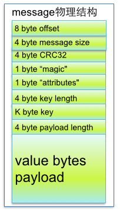

# 常用命令
## topic查询

```shell
./kafka-topics --list --zookeeper localhost:2181
```

## 创建topic

```shell
./kafka-topics --create --zookeeper localhost:2181 --replication-factor 1 --partitions 1 --topic test
```

1. 从命令行中获取要创建的topic名称
2. 解析命令行指定的topic配置(如果存在的话)，配置都是x=a的格式
3. 若指定了replica-assignment参数表明用户想要自己分配分区副本与broker的映射——通常都不这么做，如果不提供该参数Kafka帮你做这件事情
4. 检查必要的参数是否已指定，包括：zookeeper， replication-factor，partition和topic
5. 获取/brokers/ids下所有broker并按照broker id进行升序排序
6. 在broker上分配各个分区的副本映射 (没有指定replica-assignment参数，这也是默认的情况)
7. 检查topic名字合法性、自定义配置的合法性，并且要保证每个分区都必须有相同的副本数
8. 若zookeeper上已有对应的路径存在，直接抛出异常表示该topic已经存在
9. 确保某个分区的多个副本不会被分配到同一个broker
10. 若提供了自定义的配置，更新zookeeper的/config/topics/[topic]节点的数据
11. 创建/brokers/topics/[topic]节点，并将分区副本分配映射数据写入该节点

## 删除topic

```shell
./kafka-topics --zookeeper localhost:2181  --delete --topic "clicki_info_topic"

```
## 显示topic详细信息
### 单个查询


```shell
./kafka-topics --zookeeper localhost:2181 --topic "clicki_track_topic" --describe
```

### 查所有


```shell
./kafka-topics --zookeeper localhost:2181  --describe
```

1. 上图可见，如果指定了--topic就是只显示给定topic的信息，否则显示所有topic的详细信息。
2. 如果指定了under-replicated-partitions，那么就显示那些副本数量不足的分区(ISR size < AR.size)
3. 如果指定了unavailable-partitions，那么就显示那些leader副本已不可用的分区
4. 从zookeeper上获取当前所有可用的broker
5. 遍历每个要describe的topic，
6. 获取这个topic的分区副本分配信息，若该信息不存在说明topic不存在
7. 否则将分配信息按照分区号进行排序
10. 如果没有指定步骤2中的参数也没有指定步骤3中的参数，那么显示分区数信息、副本系数信息以及配置信息
11. 默认情况下还会显示各个分区的信息
12. 从zookeeper中获取每个分区的ISR、Leader、AR信息并显示

## 消费者

```shell
./kafka-console-consumer --bootstrap-server localhost:9092 --topic test --from-beginning
```

### 查看消费者列表

```shell
./kafka-consumer-groups --bootstrap-server 127.0.0.1:9092 --list
```

### 查指定group的消费者详情

```shell
./kafka-consumer-groups --bootstrap-server 127.0.0.1:9092 --group test --describe
```
## 生产者

```shell
./kafka-console-producer --broker-list localhost:9092 --topic test
```

## 查指定groupId的offset

```shell
./kafka-consumer-groups --bootstrap-server localhost:9092 --describe --group kafka_test
```

## 查topic offset最小值

```shell
./kafka-run-class kafka.tools.GetOffsetShell --broker-list localhost:9092 --topic test --time -2

```
## 查topic offset最大值

```shell
./kafka-run-class kafka.tools.GetOffsetShell --broker-list localhost:9092 --topic test --time -1
```

## 修改offset

### 0.9版本之后的
0.9版本之后的offset信息保存在topic中
> 1. 一定不要忘记加 --execute 选项
> 2. 在修改consumer offset时，需要将该consumer group.id下所有的consumer停止运行才可以进行重置offset的操作。
> 3. 如果不想停止所有的consumer（更多的情况下是不能），并且还想重置offset，那么可以通过KafkaConsumer.seek()来实现offset重置。

1. 设置绝对offset，to-offset值需要在offset的最小值和最大值之间，所以要先查offset的最大和最小值

    ```shell
    ./kafka-consumer-groups --bootstrap-server localhost:9092 --group kafka_test --topic test --reset-offsets --to-offset 10000 --execute
    ```
    
1. 设置相对offset
    * --shift-by  可正可负,正则向后移动,负数则向前移动.
    * --topic test:0,1,2表示test的0 1 2 partition
    
    ```shell
    ./kafka-consumer-groups --bootstrap-server localhost:9092 --reset-offsets  --group kafka_test --topic test:0,1,2 --shift-by -666 --execute
    ```
    
1. 设置到指定时间点
    *  --to-datetime <String: datetime> Reset offsets to offset from datetime. Format: 'YYYY-MM-DDTHH:mm:SS.sss' , 例如 : '2018-01-01T00:00:00.000' 小数点后面的毫秒必须显示指定.
    
    ```shell
     ./kafka-consumer-groups --bootstrap-server localhost:9092  --reset-offsets --to-datetime  2018-11-16T00:00:00.000 --group kafka_test --topic test:0,1,2 --execute
    ```
    
1. 设置到相对时间点，如1个小时之前的
    * --by-duration : The duration must be expressed in the format of PnDTnHnMnS, where nD, nH, nM, and nS indicate the numbers of days, hours, minutes, and seconds respectively. Each n must be a non-negative integer. For example, valid duration values are P1DT1H1M1S, P1D, PT1H1M, and P1DT1S; invalid duration values are -P1D, P1Y1M1D, or PT1H1M1.1S.需要将表达式中的n全部替换成数字.

    ```shell
    # 回滚到1天1小时1分之前
    ./kafka-consumer-groups --bootstrap-server localhost:9092 --reset-offsets  --group kafka_test --topic test:0,1,2 --by-duration P1DT1H1M0S --execute
    ```
    
[参考文档](https://juejin.im/post/5c0cdc25e51d451de22a5547)

### 0.9之前的版本
0.9之前的版本offset信息保存在zookeeper当中

```shell
./kafka-consumer-groups.sh --zookeeper z1:2181,z2:2181,z3:2181 --group test-consumer-group --topic test --execute --reset-offsets --to-offset 10000
# --zookeeper 和 --bootstrap-server 只能选一种方式
```

---

## demo

```shell
#查topic信息
./kafka-topics.sh --zookeeper 10.10.10.8:2181 --topic feed-media-result --describe
#查消费者信息
./kafka-consumer-groups.sh --bootstrap-server localhost:9092 --describe --group test-crawletl1-20200318_1
#查topic offset最小值
./kafka-run-class.sh kafka.tools.GetOffsetShell --broker-list localhost:9092 --topic feed-media-result --time -2
#查topic offset最大值
./kafka-run-class.sh kafka.tools.GetOffsetShell --broker-list localhost:9092 --topic feed-media-result --time -1
```

# kafka技能图


---

# 知识点
## Kafka的设计是什么样
Kafka将消息以topic为单位进行归纳
将向Kafka topic发布消息的程序称为producers.
将订阅topics并消费消息的程序成为consumer.
Kafka以集群的方式运行，可以由一个或多个服务组成，每个服务叫做一个broker.
producers通过网络将消息发送到Kafka集群，集群向消费者提供消息

---
## 怎么查看kafka的offset
0.9版本以上，可以用最新的Consumer client 客户端，有
```
consumer.seekToEnd()
consumer.position()
``` 
可以用于得到当前最新的offset

---
## kafka的数据存在内存还是磁盘
Kafka最核心的思想是使用**磁盘**，而不是使用内存，可能所有人都会认为，内存的速度一定比磁盘快，我也不例外。在看了Kafka的设计思想，查阅了相应资料再加上自己的测试后，发现**磁盘的顺序读写速度和内存持平**。
而且Linux对于磁盘的读写优化也比较多，包括read-ahead和write-behind，磁盘缓存等。如果在内存做这些操作的时候，一个是JAVA对象的内存开销很大，另一个是随着堆内存数据的增多，JAVA的GC时间会变得很长。
使用磁盘操作有以下几个好处：
- 磁盘缓存由Linux系统维护，减少了程序员的不少工作。
- 磁盘顺序读写速度超过内存随机读写。
- JVM的GC效率低，内存占用大。使用磁盘可以避免这一问题。
- 系统冷启动后，磁盘缓存依然可用。
 
 ---   
## 怎么解决kafka的数据丢失
- producer端：
宏观上看保证数据的可靠安全性，肯定是依据分区数做好数据备份，设立副本数。
- broker端：
topic设置多分区，分区自适应所在机器，为了让各分区均匀分布在所在的broker中，分区数要大于broker数。
分区是kafka进行并行读写的单位，是提升kafka速度的关键。
- Consumer端
consumer端丢失消息的情形比较简单：如果在消息处理完成前就提交了offset，那么就有可能造成数据的丢失。由于Kafka consumer默认是自动提交位移的，所以在后台提交位移前一定要保证消息被正常处理了，因此不建议采用很重的处理逻辑，如果处理耗时很长，则建议把逻辑放到另一个线程中去做。为了避免数据丢失，现给出两点建议：
enable.auto.commit=false 关闭自动提交位移
在消息被完整处理之后再手动提交位移

---
## kafka集群的规模，消费速度是多少。

一般中小型公司是10个节点，每秒20M左右。

---
## 数据传输的事务定义有哪三种
数据传输的事务定义通常有以下三种级别：
（1）最多一次: 消息不会被重复发送，最多被传输一次，但也有可能一次不传输
（2）最少一次: 消息不会被漏发送，最少被传输一次，但也有可能被**重复**传输.
（3）精确的一次（Exactly once）: 不会漏传输也不会重复传输,每个消息都传输被一次而且仅仅被传输一次，这是大家所期望的
[配置方式参考](https://blog.csdn.net/laojiaqi/article/details/79034798)

---
## Kafka判断一个节点是否还活着有哪两个条件
1. 节点必须可以**维护和ZooKeeper的连接**，Zookeeper通过心跳机制检查每个节点的连接
2. 如果节点是个**follower,他必须能及时的同步leader的写操作**，延时不能太久

---
## producer是否直接将数据发送到broker的leader(主节点)
是的，producer直接将数据发送到broker的leader(主节点)，不需要在多个节点进行分发，为了帮助producer做到这点，所有的Kafka节点都可以及时的告知:哪些节点是活动的，目标topic目标分区的leader在哪。这样producer就可以直接将消息发送到目的地了

---
## Kafa consumer是否可以消费指定分区消息？
Kafa consumer消费消息时，向broker发出**"fetch"**请求去消费特定分区的消息，consumer指定消息在日志中的偏移量（offset），就可以消费从这个位置开始的消息，customer拥有了offset的控制权，可以向后回滚去重新消费之前的消息，这是很有意义的

---
## Kafka消息是采用Pull模式，还是Push模式
Kafka最初考虑的问题是，customer应该从brokes拉取消息还是brokers将消息推送到consumer，也就是pull还push。在这方面，Kafka遵循了一种大部分消息系统共同的传统的设计：**producer将消息推送到broker，consumer从broker拉取消息**

一些消息系统比如Scribe和Apache Flume采用了push模式，将消息推送到下游的consumer。这样做有好处也有坏处：由broker决定消息推送的速率，对于不同消费速率的consumer就不太好处理了。消息系统都致力于让consumer以最大的速率最快速的消费消息，**但不幸的是，push模式下，当broker推送的速率远大于consumer消费的速率时，consumer恐怕就要崩溃了。**最终Kafka还是选取了传统的pull模式

Pull模式的另外一个好处是**consumer可以自主决定是否批量的从broker拉取数据**。Push模式必须在不知道下游consumer消费能力和消费策略的情况下决定是立即推送每条消息还是缓存之后批量推送。如果为了避免consumer崩溃而采用较低的推送速率，将可能导致一次只推送较少的消息而造成浪费。Pull模式下，consumer就可以根据自己的消费能力去决定这些策略

Pull有个缺点是，如果broker没有可供消费的消息，将导致consumer不断在循环中轮询，直到新消息到达。为了避免这点，Kafka有个参数可以让consumer阻塞直到新消息到达(当然也可以阻塞知道消息的数量达到某个特定的量这样就可以批量发

## Kafka存储在硬盘上的消息格式是什么？
消息由一个**固定长度的头部和可变长度的字节数组**组成。头部包含了一个版本号和CRC32校验码。
* 消息长度: 4 bytes (value: 1+4+n)
* 版本号: 1 byte
* CRC校验码: 4 bytes
* 具体的消息: n bytes

## Kafka高效文件存储设计特点
1. Kafka把topic中一个parition**大文件分成多个小文件段**，通过多个小文件段，就容易**定期清除或删除已经消费完文件**，减少磁盘占用。
2. 通过索引信息可以快速定位message和确定response的最大大小。
3. 通过index元数据全部映射到memory，可以避免segment file的IO磁盘操作。
4. 通过**索引文件稀疏存储**，可以大幅降低index文件元数据占用空间大小。

详见Kafka文件的存储机制章节

## Kafka 与传统消息系统之间有三个关键区别
1. Kafka 持久化日志，这些日志可以被重复读取和无限期保留
1. Kafka 是一个分布式系统：它以集群的方式运行，可以灵活伸缩，在内部通过复制数据提升容错能力和高可用性
1. Kafka 支持实时的流式处理

## Kafka创建Topic时如何将分区放置到不同的Broker中
* 副本因子不能大于 Broker 的个数；
* 第一个分区（编号为0）的第一个副本放置位置是随机从 brokerList 选择的；
* 其他分区的第一个副本放置位置相对于第0个分区依次往后移。也就是如果我们有5个 Broker，5个分区，假设第一个分区放在第四个 Broker 上，那么第二个分区将会放在第五个 Broker 上；第三个分区将会放在第一个 Broker 上；第四个分区将会放在第二个 Broker 上，依次类推；
* 剩余的副本相对于第一个副本放置位置其实是由 nextReplicaShift 决定的，而这个数也是随机产生的

## Kafka新建的分区会在哪个目录下创建
在启动 Kafka 集群之前，我们需要配置好 log.dirs 参数，其值是 Kafka 数据的存放目录，这个参数可以配置多个目录，目录之间使用逗号分隔，通常这些目录是分布在不同的磁盘上用于提高读写性能。
当然我们也可以配置 log.dir 参数，含义一样。只需要设置其中一个即可。
如果 log.dirs 参数只配置了一个目录，那么分配到各个 Broker 上的分区肯定只能在这个目录下创建文件夹用于存放数据。
但是如果 log.dirs 参数配置了多个目录，那么 Kafka 会在哪个文件夹中创建分区目录呢？答案是：Kafka 会在含有分区目录最少的文件夹中创建新的分区目录，分区目录名为 Topic名+分区ID。注意，是分区文件夹总数最少的目录，而不是磁盘使用量最少的目录！也就是说，如果你给 log.dirs 参数新增了一个新的磁盘，新的分区目录肯定是先在这个新的磁盘上创建直到这个新的磁盘目录拥有的分区目录不是最少为止。

## partition的数据如何保存到硬盘
topic中的多个partition以文件夹的形式保存到broker，每个分区序号从0递增，
且消息有序
Partition文件下有多个segment（xxx.index，xxx.log）
segment 文件里的 大小和配置文件大小一致可以根据要求修改 默认为1g
如果大小大于1g时，会滚动一个新的segment并且以上一个segment最后一条消息的偏移量命名

## kafka的ack机制
request.required.acks有三个值 0 1 -1
0:生产者不会等待broker的ack，这个延迟最低但是存储的保证最弱当server挂掉的时候就会丢数据
1：服务端会等待ack值 leader副本确认接收到消息后发送ack但是如果leader挂掉后他不确保是否复制完成新leader也会导致数据丢失
-1：同样在1的基础上 服务端会等所有的follower的副本受到数据后才会受到leader发出的ack，这样数据不会丢失

## Kafka的消费者如何消费数据
消费者每次消费数据的时候，消费者都会记录消费的物理偏移量（offset）的位置
等到下次消费时，他会接着上次位置继续消费

## 消费者负载均衡策略
一个消费者组中的一个分片对应一个消费者成员，他能保证每个消费者成员都能访问，如果组中成员太多会有空闲的成员

## 数据有序
一个消费者组里它的内部是有序的
消费者组与消费者组之间是无序的

## kafaka生产数据时数据的分组策略
生产者决定数据产生到集群的哪个partition中
每一条消息都是以（key，value）格式
Key是由生产者发送数据传入
所以生产者（key）决定了数据产生到集群的哪个partition

## 如何选择Kafka的分区数和消费者个数
### Kafka的分区数是不是越多越好？

#### 分区多的优点

kafka使用分区将topic的消息打散到多个分区分布保存在不同的broker上，实现了producer和consumer消息处理的高吞吐量。Kafka的producer和consumer都可以多线程地并行操作，而每个线程处理的是一个分区的数据。因此分区实际上是调优Kafka并行度的最小单元。对于producer而言，它实际上是用多个线程并发地向不同分区所在的broker发起Socket连接同时给这些分区发送消息；而consumer，同一个消费组内的所有consumer线程都被指定topic的某一个分区进行消费。

所以说，如果一个topic分区越多，理论上整个集群所能达到的吞吐量就越大。

#### 分区不是越多越好

分区是否越多越好呢？显然也不是，因为每个分区都有自己的开销：

1. 客户端/服务器端需要使用的内存就越多
Kafka0.8.2之后，在客户端producer有个参数batch.size，默认是16KB。它会为每个分区缓存消息，一旦满了就打包将消息批量发出。看上去这是个能够提升性能的设计。不过很显然，因为这个参数是分区级别的，如果分区数越多，这部分缓存所需的内存占用也会更多。假设你有10000个分区，按照默认设置，这部分缓存需要占用约157MB的内存。而consumer端呢？我们抛开获取数据所需的内存不说，只说线程的开销。如果还是假设有10000个分区，同时consumer线程数要匹配分区数(大部分情况下是最佳的消费吞吐量配置)的话，那么在consumer client就要创建10000个线程，也需要创建大约10000个Socket去获取分区数据。这里面的线程切换的开销本身已经不容小觑了。 
    服务器端的开销也不小，如果阅读Kafka源码的话可以发现，服务器端的很多组件都在内存中维护了分区级别的缓存，比如controller，FetcherManager等，因此分区数越多，这种缓存的成本就越大。 
2. 文件句柄的开销
每个分区在底层文件系统都有属于自己的一个目录。该目录下通常会有两个文件： base_offset.log和base_offset.index。Kafak的controller和ReplicaManager会为每个broker都保存这两个文件句柄(file handler)。很明显，如果分区数越多，所需要保持打开状态的文件句柄数也就越多，最终可能会突破你的ulimit -n的限制。 
3. 降低高可用性
Kafka通过副本(replica)机制来保证高可用。具体做法就是为每个分区保存若干个副本(replica_factor指定副本数)。每个副本保存在不同的broker上。期中的一个副本充当leader 副本，负责处理producer和consumer请求。其他副本充当follower角色，由Kafka controller负责保证与leader的同步。如果leader所在的broker挂掉了，contorller会检测到然后在zookeeper的帮助下重选出新的leader——这中间会有短暂的不可用时间窗口，虽然大部分情况下可能只是几毫秒级别。但如果你有10000个分区，10个broker，也就是说平均每个broker上有1000个分区。此时这个broker挂掉了，那么zookeeper和controller需要立即对这1000个分区进行leader选举。比起很少的分区leader选举而言，这必然要花更长的时间，并且通常不是线性累加的。如果这个broker还同时是controller情况就更糟了。

### 如何确定分区数量呢？　　

可以遵循一定的步骤来尝试确定分区数：创建一个只有1个分区的topic，然后测试这个topic的producer吞吐量和consumer吞吐量。假设它们的值分别是Tp和Tc，单位可以是MB/s。然后假设总的目标吞吐量是Tt，那么分区数 =  Tt / max(Tp, Tc)

说明：Tp表示producer的吞吐量。测试producer通常是很容易的，因为它的逻辑非常简单，就是直接发送消息到Kafka就好了。Tc表示consumer的吞吐量。测试Tc通常与应用的关系更大， 因为Tc的值取决于你拿到消息之后执行什么操作，因此Tc的测试通常也要麻烦一些。 

### 一条消息如何知道要被发送到哪个分区？

#### 按照key值分配

默认情况下，Kafka根据传递消息的key来进行分区的分配，即hash(key) % numPartitions：

def partition(key: Any, numPartitions: Int): Int = {
    Utils.abs(key.hashCode) % numPartitions
}
这保证了相同key的消息一定会被路由到相同的分区。

#### key为null时，从缓存中取分区id或者随机取一个

如果你没有指定key，那么Kafka是如何确定这条消息去往哪个分区的呢？


```java
if(key == null) {  // 如果没有指定key
	val id = sendPartitionPerTopicCache.get(topic)  // 先看看Kafka有没有缓存的现成的分区Id
	id match {
	  case Some(partitionId) =>  
		partitionId  // 如果有的话直接使用这个分区Id就好了
	  case None => // 如果没有的话，
		val availablePartitions = topicPartitionList.filter(_.leaderBrokerIdOpt.isDefined)  //找出所有可用分区的leader所在的broker
		if (availablePartitions.isEmpty)
		  throw new LeaderNotAvailableException("No leader for any partition in topic " + topic)
		val index = Utils.abs(Random.nextInt) % availablePartitions.size  // 从中随机挑一个
		val partitionId = availablePartitions(index).partitionId
		sendPartitionPerTopicCache.put(topic, partitionId) // 更新缓存以备下一次直接使用
		partitionId
	}
}
```
不指定key时，Kafka几乎就是随机找一个分区发送无key的消息，然后把这个分区号加入到缓存中以备后面直接使用——当然了，Kafka本身也会清空该缓存（默认每10分钟或每次请求topic元数据时）。 

### Consumer个数与分区数有什么关系？

topic下的一个分区只能被同一个consumer group下的一个consumer线程来消费，但反之并不成立，即一个consumer线程可以消费多个分区的数据，比如Kafka提供的ConsoleConsumer，默认就只是一个线程来消费所有分区的数据。


所以，如果你的分区数是N，那么最好线程数也保持为N，这样通常能够达到最大的吞吐量。超过N的配置只是浪费系统资源，因为多出的线程不会被分配到任何分区。
### Consumer消费Partition的分配策略
Kafka提供的两种分配策略： range和roundrobin，由参数partition.assignment.strategy指定，默认是range策略。 

当以下事件发生时，Kafka 将会进行一次分区分配：

- 同一个 Consumer Group 内新增消费者
    消费者离开当前所属的Consumer Group，包括shuts down 或 crashes
- 订阅的主题新增分区
    将分区的所有权从一个消费者移到另一个消费者称为重新平衡（rebalance），如何rebalance就涉及到本文提到的分区分配策略。 
下面我们将详细介绍 Kafka 内置的两种分区分配策略。本文假设我们有个名为 T1 的主题，其包含了10个分区，然后我们有两个消费者（C1，C2） 
来消费这10个分区里面的数据，而且 C1 的 num.streams = 1，C2 的 num.streams = 2。 

### Range strategy

Range策略是对每个主题而言的，首先对同一个主题里面的分区按照序号进行排序，并对消费者按照字母顺序进行排序。在我们的例子里面，排完序的分区将会是0, 1, 2, 3, 4, 5, 6, 7, 8, 9；消费者线程排完序将会是C1-0, C2-0, C2-1。然后将partitions的个数除于消费者线程的总数来决定每个消费者线程消费几个分区。如果除不尽，那么前面几个消费者线程将会多消费一个分区。在我们的例子里面，我们有10个分区，3个消费者线程， 10 / 3 = 3，而且除不尽，那么消费者线程 C1-0 将会多消费一个分区，所以最后分区分配的结果看起来是这样的： 
C1-0 将消费 0, 1, 2, 3 分区
C2-0 将消费 4, 5, 6 分区
C2-1 将消费 7, 8, 9 分区
假如我们有11个分区，那么最后分区分配的结果看起来是这样的： 
C1-0 将消费 0, 1, 2, 3 分区
C2-0 将消费 4, 5, 6, 7 分区
C2-1 将消费 8, 9, 10 分区
假如我们有2个主题(T1和T2)，分别有10个分区，那么最后分区分配的结果看起来是这样的： 
C1-0 将消费 T1主题的 0, 1, 2, 3 分区以及 T2主题的 0, 1, 2, 3分区
C2-0 将消费 T1主题的 4, 5, 6 分区以及 T2主题的 4, 5, 6分区
C2-1 将消费 T1主题的 7, 8, 9 分区以及 T2主题的 7, 8, 9分区
可以看出，C1-0 消费者线程比其他消费者线程多消费了2个分区，这就是Range strategy的一个很明显的弊端。

### RoundRobin strategy

使用RoundRobin策略有两个前提条件必须满足： 
同一个Consumer Group里面的所有消费者的num.streams必须相等；
每个消费者订阅的主题必须相同。
所以这里假设前面提到的2个消费者的num.streams = 2。RoundRobin策略的工作原理：将所有主题的分区组成 TopicAndPartition 列表，然后对 TopicAndPartition 列表按照 hashCode 进行排序，看下面的代码应该会明白：


```scala
val allTopicPartitions = ctx.partitionsForTopic.flatMap { case(topic, partitions) =>
  info("Consumer %s rebalancing the following partitions for topic %s: %s"
       .format(ctx.consumerId, topic, partitions))
  partitions.map(partition => {
    TopicAndPartition(topic, partition)
  })
}.toSeq.sortWith((topicPartition1, topicPartition2) => {
  /*
   * Randomize the order by taking the hashcode to reduce the likelihood of all partitions of a given topic ending
   * up on one consumer (if it has a high enough stream count).
   */
  topicPartition1.toString.hashCode < topicPartition2.toString.hashCode
})

```

最后按照round-robin风格将分区分别分配给不同的消费者线程。

在这个的例子里面，假如按照 hashCode 排序完的topic-partitions组依次为T1-5, T1-3, T1-0, T1-8, T1-2, T1-1, T1-4, T1-7, T1-6, T1-9，我们的消费者线程排序为C1-0, C1-1, C2-0, C2-1，最后分区分配的结果为：

C1-0 将消费 T1-5, T1-2, T1-6 分区；
C1-1 将消费 T1-3, T1-1, T1-9 分区；
C2-0 将消费 T1-0, T1-4 分区；
C2-1 将消费 T1-8, T1-7 分区；
多个主题的分区分配和单个主题类似。遗憾的是，目前我们还不能自定义分区分配策略，只能通过partition.assignment.strategy参数选择 range 或 roundrobin。 

---

# 面试题

1. 请说明什么是Apache Kafka?
Apache Kafka是由Apache开发的一种发布订阅消息系统，它是一个分布式的、分区的和重复的日志服务。

2. 请说明什么是传统的消息传递方法?
传统的消息传递方法包括两种：
排队：在队列中，一组用户可以从服务器中读取消息，每条消息都发送给其中一个人。
发布-订阅：在这个模型中，消息被广播给所有的用户。

3. 请说明Kafka相对传统技术有什么优势?
Apache Kafka与传统的消息传递技术相比优势之处在于：
快速:单一的Kafka代理可以处理成千上万的客户端，每秒处理数兆字节的读写操作。
可伸缩:在一组机器上对数据进行分区和简化，以支持更大的数据
持久:消息是持久性的，并在集群中进行复制，以防止数据丢失。
设计:它提供了容错保证和持久性

4. 在Kafka中broker的意义是什么?
在Kafka集群中，broker术语用于引用服务器。

5. Kafka服务器能接收到的最大信息是多少?
Kafka服务器可以接收到的消息的最大大小是1000000字节。

6. 解释Kafka的Zookeeper是什么?我们可以在没有Zookeeper的情况下使用Kafka吗?
Zookeeper是一个开放源码的、高性能的协调服务，它用于Kafka的分布式应用。
不，不可能越过Zookeeper，直接联系Kafka broker。一旦Zookeeper停止工作，它就不能服务客户端请求。
Zookeeper主要用于在集群中不同节点之间进行通信
在Kafka中，它被用于提交偏移量，因此如果节点在任何情况下都失败了，它都可以从之前提交的偏移量中获取
除此之外，它还执行其他活动，如: leader检测、分布式同步、配置管理、识别新节点何时离开或连接、集群、节点实时状态等等。

7. 解释Kafka的用户如何消费信息?
在Kafka中传递消息是通过使用sendfile API完成的。它支持将字节从套接口转移到磁盘，通过内核空间保存副本，并在内核用户之间调用内核。

8. 解释如何提高远程用户的吞吐量?
如果用户位于与broker不同的数据中心，则可能需要调优套接口缓冲区大小，以对长网络延迟进行摊销。

9. 解释一下，在数据制作过程中，你如何能从Kafka得到准确的信息?
在数据中，为了精确地获得Kafka的消息，你必须遵循两件事: 在数据消耗期间避免重复，在数据生产过程中避免重复。
这里有两种方法，可以在数据生成时准确地获得一个语义:
每个分区使用一个单独的写入器，每当你发现一个网络错误，检查该分区中的最后一条消息，以查看您的最后一次写入是否成功
在消息中包含一个主键(UUID或其他)，并在用户中进行反复制

10. 解释如何减少ISR中的扰动?broker什么时候离开ISR?
ISR是一组与leaders完全同步的消息副本，也就是说ISR中包含了所有提交的消息。ISR应该总是包含所有的副本，直到出现真正的故障。如果一个副本从leader中脱离出来，将会从ISR中删除。

11. Kafka为什么需要复制?
Kafka的信息复制确保了任何已发布的消息不会丢失，并且可以在机器错误、程序错误或更常见些的软件升级中使用。

12. 如果副本在ISR中停留了很长时间表明什么?
如果一个副本在ISR中保留了很长一段时间，那么它就表明，跟踪器无法像在leader收集数据那样快速地获取数据。

13. 请说明如果首选的副本不在ISR中会发生什么?
如果首选的副本不在ISR中，控制器将无法将leadership转移到首选的副本。

14. 有可能在生产后发生消息偏移吗?
在大多数队列系统中，作为生产者的类无法做到这一点，它的作用是触发并忘记消息。broker将完成剩下的工作，比如使用id进行适当的元数据处理、偏移量等。
作为消息的用户，你可以从Kafka broker中获得补偿。如果你注视SimpleConsumer类，你会注意到它会获取包括偏移量作为列表的MultiFetchResponse对象。此外，当你对Kafka消息进行迭代时，你会拥有包括偏移量和消息发送的MessageAndOffset对象。

15. kafka提高吞吐量的配置
最基础的配置是
batch.size 默认是单批次最大16384字节，超过该值就立即发送。
linger.ms 默认是0ms，超过该时间就立即发送。
上面两个条件满足其一，就立即发送消息否则等待。

---

# Kafka文件的存储机制

## Kafka部分名词解释

1. Broker：消息中间件处理结点，一个Kafka节点就是一个broker，多个broker可以组成一个Kafka集群。
2. Topic：一类消息，例如page view日志、click日志等都可以以topic的形式存在，Kafka集群能够同时负责多个topic的分发。
3. Partition：topic物理上的分组，一个topic可以分为多个partition，每个partition是一个有序的队列。
4. Segment：partition物理上由多个segment组成，下面3和4有详细说明。
5. offset：每个partition都由一系列有序的、不可变的消息组成，这些消息被连续的追加到partition中。partition中的每个消息都有一个连续的序列号叫做offset,用于partition唯一标识一条消息.

分析过程分为以下4个步骤：

1. topic中partition存储分布
2. partiton中文件存储方式
3. partiton中segment文件存储结构
4. 在partition中如何通过offset查找message

通过上述4过程详细分析，我们就可以清楚认识到kafka文件存储机制的奥秘。

## 1 topic中partition存储分布

假设实验环境中Kafka集群只有一个broker，xxx/message-folder为数据文件存储根目录，在Kafka broker中server.properties文件配置(参数log.dirs=xxx/message-folder)，例如创建2个topic名称分别为report_push、launch_info, partitions数量都为partitions=4 
存储路径和目录规则为： 
xxx/message-folder
|--report_push-0
|--report_push-1
|--report_push-2
|--report_push-3
|--launch_info-0
|--launch_info-1
|--launch_info-2
|--launch_info-3

在Kafka文件存储中，同一个topic下有多个不同partition，每个partition为一个目录，partiton命名规则为topic名称+有序序号，第一个partiton序号从0开始，序号最大值为partitions数量减1。

## 2 Kafka集群partitions/replicas（副本）默认分配解析

下面以一个Kafka集群中4个Broker举例，创建1个topic包含4个Partition，2 Replication；数据Producer流动如图所示：

1. 下面以一个Kafka集群中4个Broker举例，创建1个topic包含4个Partition，2 Replication；数据Producer流动如图所示： 


2. 当集群中新增2节点，Partition增加到6个时分布情况如下： 


3. 副本分配逻辑规则如下：
    * 在Kafka集群中，每个Broker都有均等分配Partition的Leader机会。 
    * 上述图Broker Partition中，箭头指向为副本，以Partition-0为例:broker1中parition-0为Leader，Broker2中Partition-0为副本。 
    * 上述图中每个Broker(按照BrokerId有序)依次分配主Partition,下一个Broker为副本，如此循环迭代分配，多副本都遵循此规则。

4. 副本分配算法如下：
    * 将所有N Broker和待分配的i个Partition排序. 
    * 将第i个Partition分配到第(i mod n)个Broker上. 
    * 将第i个Partition的第j个副本分配到第((i + j) mod n)个Broker上.

## 3 partiton中文件存储方式
下面示意图形象说明了partition中文件存储方式: 
 


* 每个partion(目录)相当于一个巨型文件被平均分配到多个大小相等segment(段)数据文件中。但每个段segment file消息数量不一定相等，这种特性方便old segment file快速被删除。
* 每个partiton只需要支持顺序读写就行了，segment文件生命周期由服务端配置参数决定。

这样做的好处就是能快速删除无用文件，有效提高磁盘利用率。

## 4 partiton中segment文件存储结构

第3节说明了Kafka文件系统partition存储方式，本节深入分析partion中segment file的组成和物理结构。

* segment file组成：由2大部分组成，分别为index file和data file，此2个文件一一对应，成对出现，后缀”.index”和“.log”分别表示为segment索引文件、数据文件. 
* segment文件命名规则：partion全局的第一个segment从0开始，后续每个segment文件名为上一个segment文件最后一条消息的offset值。数值最大为64位long大小，19位数字字符长度，没有数字用0填充。

下面文件列表是笔者在Kafka broker上做的一个实验，创建一个topicXXX包含1 partition，设置每个segment大小为500MB,并启动producer向Kafka broker写入大量数据,如下图2所示segment文件列表形象说明了上述2个规则： 
 


图2


以上述图2中一对segment file文件为例，说明segment中index<—->data file对应关系物理结构如下： 
说明：index中的1,0。对应log中的文件个数和offset 


图3
上述图3中索引文件存储大量元数据，数据文件存储大量消息，索引文件中元数据指向对应数据文件中message的物理偏移地址。 
其中以索引文件中元数据3,497为例，依次在数据文件中表示第3个message(在全局partiton表示第368772个message)、以及该消息的物理偏移地址为497。

从上述图3了解到segment data file由许多message组成，下面详细说明message物理结构如下：




图4
参数说明：

|关键字|	解释说明|
| --- | --- |
|8 byte offset|	在parition(分区)内的每条消息都有一个有序的id号，<br>这个id号被称为偏移(offset),<br>它可以唯一确定每条消息在parition(分区)内的位置。<br>即offset表示partiion的第多少message|
|4 byte message size|	message大小|
|4 byte CRC32	|用crc32校验message|
|1 byte “magic”|	表示本次发布Kafka服务程序协议版本号|
|1 byte “attributes”|	表示为独立版本、或标识压缩类型、或编码类型。|
|4 byte key length	|表示key的长度,当key为-1时，K byte key字段不填|
|K byte key	|可选|
|value bytes payload|	表示实际消息数据。|

## 在partition中如何通过offset查找message

例如读取offset=368776的message，需要通过下面2个步骤查找。

- **第一步查找segment file** 
上述图2为例，其中00000000000000000000.index表示最开始的文件，起始偏移量(offset)为0.第二个文件00000000000000368769.index的消息量起始偏移量为368770 = 368769 + 1.同样，第三个文件00000000000000737337.index的起始偏移量为737338=737337 + 1，其他后续文件依次类推，以起始偏移量命名并排序这些文件，只要根据offset 二分查找文件列表，就可以快速定位到具体文件。 
当offset=368776时定位到00000000000000368769.index|log
- **第二步通过segment file查找message** 
通过第一步定位到segment file，当offset=368776时，依次定位到00000000000000368769.index的元数据物理位置和00000000000000368769.log的物理偏移地址，然后再通过00000000000000368769.log顺序查找直到offset=368776为止。
从上述图3可知这样做的优点，segment index file采取稀疏索引存储方式，它减少索引文件大小，通过mmap可以直接内存操作，稀疏索引为数据文件的每个对应message设置一个元数据指针,它比稠密索引节省了更多的存储空间，但查找起来需要消耗更多的时间。


## Kafka文件存储机制–实际运行效果

实验环境：

Kafka集群：由2台虚拟机组成 
cpu：4核 
物理内存：8GB 
网卡：千兆网卡 
jvm heap: 4GB
 


图5
从上述图5可以看出，Kafka运行时很少有大量读磁盘的操作，主要是定期批量写磁盘操作，因此操作磁盘很高效。这跟Kafka文件存储中读写message的设计是息息相关的。Kafka中读写message有如下特点:

写message

消息从java堆转入page cache(即物理内存)。 
由异步线程刷盘,消息从page cache刷入磁盘。
读message

消息直接从page cache转入socket发送出去。 
当从page cache没有找到相应数据时，此时会产生磁盘IO,从磁 
盘Load消息到page cache,然后直接从socket发出去

## 总结

Kafka高效文件存储设计特点

Kafka把topic中一个parition大文件分成多个小文件段，通过多个小文件段，就容易定期清除或删除已经消费完文件，减少磁盘占用。 
通过索引信息可以快速定位message和确定response的最大大小。 
通过index元数据全部映射到memory，可以避免segment file的IO磁盘操作。 
通过索引文件稀疏存储，可以大幅降低index文件元数据占用空间大小。


---

# 参数

## Broker  Configs

|Property|Default|Description|
|---|---|---|
|broker.id | &nbsp; | 每个broker都可以用一个唯一的非负整数id进行标识； 这个id可以作为broker的“名字”，并且它的存在使得broker无须混淆consumers就可以迁移到不同的host/port上。你可以选择任意你喜欢的数字作为id，只要id是唯一的即可。 |
|log.dirs | /tmp/kafka-logs | kafka存放数据的路径。这个路径并不是唯一的，可以是多个，路径之间只需要使用逗号分隔即可；每当创建新partition时，都会选择在包含最少partitions的路径下进行。 |
|port | 6667 | server接受客户端连接的端口 |
|zookeeper.connect | null | ZooKeeper连接字符串的格式为：hostname:port，此处hostname和port分别是ZooKeeper集群中某个节点的host和port；为了当某个host宕掉之后你能通过其他ZooKeeper节点进行连接，你可以按照一下方式制定多个hosts：<br>hostname1:port1, hostname2:port2, hostname3:port3.<br><br>ZooKeeper 允许你增加一个“chroot”路径，将集群中所有kafka数据存放在特定的路径下。当多个Kafka集群或者其他应用使用相同ZooKeeper集群时，可以使用这个方式设置数据存放路径。这种方式的实现可以通过这样设置连接字符串格式，如下所示：<br>hostname1：port1，hostname2：port2，hostname3：port3/chroot/path<br>这样设置就将所有kafka集群数据存放在/chroot/path路径下。注意，在你启动broker之前，你必须创建这个路径，并且consumers必须使用相同的连接格式。 |
|message.max.bytes | 1000000 | server可以接收的消息最大尺寸。重要的是，consumer和producer有关这个属性的设置必须同步，否则producer发布的消息对consumer来说太大。 |
|num.network.threads | 3 | server用来处理网络请求的网络线程数目；一般你不需要更改这个属性。 |
|num.io.threads | 8 | server用来处理请求的I/O线程的数目；这个线程数目至少要等于硬盘的个数。 |
|background.threads | 4 | 用于后台处理的线程数目，例如文件删除；你不需要更改这个属性。 |
|queued.max.requests | 500 | 在网络线程停止读取新请求之前，可以排队等待I/O线程处理的最大请求个数。 |
|host.name | null | broker的hostname；如果hostname已经设置的话，broker将只会绑定到这个地址上；如果没有设置，它将绑定到所有接口，并发布一份到ZK |
|advertised.host.name | null | 如果设置，则就作为broker 的hostname发往producer、consumers以及其他brokers |
|advertised.port | null | 此端口将给与producers、consumers、以及其他brokers，它会在建立连接时用到； 它仅在实际端口和server需要绑定的端口不一样时才需要设置。 |
|socket.send.buffer.bytes | 100 * 1024 | SO_SNDBUFF 缓存大小，server进行socket 连接所用 |
|socket.receive.buffer.bytes | 100 * 1024 | SO_RCVBUFF缓存大小，server进行socket连接时所用 |
|socket.request.max.bytes | 100 * 1024 * 1024 | server允许的最大请求尺寸； &nbsp;这将避免server溢出，它应该小于Java &nbsp;heap size |
|num.partitions | 1 | 如果创建topic时没有给出划分partitions个数，这个数字将是topic下partitions数目的默认数值。 |
|log.segment.bytes | 1014*1024*1024 | topic &nbsp;partition的日志存放在某个目录下诸多文件中，这些文件将partition的日志切分成一段一段的；这个属性就是每个文件的最大尺寸；当尺寸达到这个数值时，就会创建新文件。此设置可以由每个topic基础设置时进行覆盖。<br>查看 &nbsp;<a href="http://kafka.apache.org/documentation.html#topic-config" target="_blank">the per-topic &nbsp;configuration section</a> |
|log.roll.hours | 24 * 7 | 即使文件没有到达log.segment.bytes，只要文件创建时间到达此属性，就会创建新文件。这个设置也可以有topic层面的设置进行覆盖；<br>查看<a href="http://kafka.apache.org/documentation.html#topic-config" target="_blank">the per-topic &nbsp;configuration section</a> |
|log.cleanup.policy | delete | &nbsp; |
|log.retention.minutes和<br>log.retention.hours | 7 days | 每个日志文件删除之前保存的时间。默认数据保存时间对所有topic都一样。<br>log.retention.minutes 和 log.retention.bytes 都是用来设置删除日志文件的，无论哪个属性已经溢出。<br>这个属性设置可以在topic基本设置时进行覆盖。<br>查看<a href="http://kafka.apache.org/documentation.html#topic-config" target="_blank">the per-topic &nbsp;configuration section</a> |
|log.retention.bytes | -1 | 每个topic下每个partition保存数据的总量；注意，这是每个partitions的上限，因此这个数值乘以partitions的个数就是每个topic保存的数据总量。同时注意：如果log.retention.hours和log.retention.bytes都设置了，则超过了任何一个限制都会造成删除一个段文件。<br>注意，这项设置可以由每个topic设置时进行覆盖。<br>查看<a href="http://kafka.apache.org/documentation.html#topic-config" target="_blank">the per-topic &nbsp;configuration section</a> |
|log.retention.check.interval.ms | 5 minutes | 检查日志分段文件的间隔时间，以确定是否文件属性是否到达删除要求。 |
|log.cleaner.enable | false | 当这个属性设置为false时，一旦日志的保存时间或者大小达到上限时，就会被删除；如果设置为true，则当保存属性达到上限时，就会进行<a href="https://cwiki.apache.org/confluence/display/KAFKA/Log+Compaction" target="_blank">log compaction</a>。 |
|log.cleaner.threads | 1 | 进行日志压缩的线程数 |
|log.cleaner.io.max.bytes.per.second | None | 进行log compaction时，log cleaner可以拥有的最大I/O数目。这项设置限制了cleaner，以避免干扰活动的请求服务。 |
|log.cleaner.io.buffer.size | 500*1024*1024 | log cleaner清除过程中针对日志进行索引化以及精简化所用到的缓存大小。最好设置大点，以提供充足的内存。 |
|log.cleaner.io.buffer.load.factor | 512*1024 | 进行log cleaning时所需要的I/O chunk尺寸。你不需要更改这项设置。 |
|log.cleaner.io.buffer.load.factor | 0.9 | log cleaning中所使用的hash表的负载因子；你不需要更改这个选项。 |
|log.cleaner.backoff.ms | 15000 | 进行日志是否清理检查的时间间隔 |
|log.cleaner.min.cleanable.ratio | 0.5 | 这项配置控制log &nbsp;compactor试图清理日志的频率（假定<a href="https://cwiki.apache.org/confluence/display/KAFKA/Log+Compaction" target="_blank">log compaction</a>是打开的）。默认避免清理压缩超过50%的日志。这个比率绑定了备份日志所消耗的最大空间（50%的日志备份时压缩率为50%）。更高的比率则意味着浪费消耗更少，也就可以更有效的清理更多的空间。这项设置在每个topic设置中可以覆盖。<br>查看<a href="http://kafka.apache.org/documentation.html#topic-config" target="_blank">the per-topic &nbsp;configuration section</a>。 |
|log.cleaner.delete.retention.ms | 1day | 保存时间；保存压缩日志的最长时间；也是客户端消费消息的最长时间，荣log.retention.minutes的区别在于一个控制未压缩数据，一个控制压缩后的数据；会被topic创建时的指定时间覆盖。 |
|log.index.size.max.bytes | 10*1024*1024 | 每个log segment的最大尺寸。注意，如果log尺寸达到这个数值，即使尺寸没有超过log.segment.bytes限制，也需要产生新的log &nbsp;segment。 |
|log.index.interval.bytes | 4096 | 当执行一次fetch后，需要一定的空间扫描最近的offset，设置的越大越好，一般使用默认值就可以 |
|log.flush.interval.messages | Long.MaxValue | log文件“sync”到磁盘之前累积的消息条数。因为磁盘IO操作是一个慢操作，但又是一个“数据可靠性”的必要手段，所以检查是否需要固化到硬盘的时间间隔。需要在“数据可靠性”与“性能”之间做必要的权衡，如果此值过大，将会导致每次“发sync”的时间过长（IO阻塞），如果此值过小，将会导致“fsync”的时间较长（IO阻塞），如果此值过小，将会导致”发sync“的次数较多，这也就意味着整体的client请求有一定的延迟，物理server故障，将会导致没有fsync的消息丢失。 |
|log.flush.scheduler.interval.ms | Long.MaxValue | 检查是否需要fsync的时间间隔 |
|log.flush.interval.ms | Long.MaxValue | 仅仅通过interval来控制消息的磁盘写入时机，是不足的，这个数用来控制”fsync“的时间间隔，如果消息量始终没有达到固化到磁盘的消息数，但是离上次磁盘同步的时间间隔达到阈值，也将触发磁盘同步。 |
|log.delete.delay.ms | 60000 | 文件在索引中清除后的保留时间，一般不需要修改 |
|auto.create.topics.enable | true | 是否允许自动创建topic。如果是真的，则produce或者fetch 不存在的topic时，会自动创建这个topic。否则需要使用命令行创建topic |
|controller.socket.timeout.ms | 30000 | partition管理控制器进行备份时，socket的超时时间。 |
|controller.message.queue.size | Int.MaxValue | controller-to-broker-channles的buffer 尺寸 |
|default.replication.factor | 1 | 默认备份份数，仅指自动创建的topics |
|replica.lag.time.max.ms | 10000 | 如果一个follower在这个时间内没有发送fetch请求，leader将从ISR重移除这个follower，并认为这个follower已经挂了 |
|replica.lag.max.messages | 4000 | 如果一个replica没有备份的条数超过这个数值，则leader将移除这个follower，并认为这个follower已经挂了 |
|replica.socket.timeout.ms | 30*1000 | leader 备份数据时的socket网络请求的超时时间 |
|replica.socket.receive.buffer.bytes | 64*1024 | 备份时向leader发送网络请求时的socket receive buffer |
|replica.fetch.max.bytes | 1024*1024 | 备份时每次fetch的最大值 |
|replica.fetch.min.bytes | 500 | leader发出备份请求时，数据到达leader的最长等待时间 |
|replica.fetch.min.bytes | 1 | 备份时每次fetch之后回应的最小尺寸 |
|num.replica.fetchers | 1 | 从leader备份数据的线程数 |
|replica.high.watermark.checkpoint.interval.ms | 5000 | 每个replica检查是否将最高水位进行固化的频率 |
|fetch.purgatory.purge.interval.requests | 1000 | fetch 请求清除时的清除间隔 |
|producer.purgatory.purge.interval.requests | 1000 | producer请求清除时的清除间隔 |
|zookeeper.session.timeout.ms | 6000 | zookeeper会话超时时间。 |
|zookeeper.connection.timeout.ms | 6000 | 客户端等待和zookeeper建立连接的最大时间 |
|zookeeper.sync.time.ms | 2000 | zk follower落后于zk leader的最长时间 |
|controlled.shutdown.enable | true | 是否能够控制broker的关闭。如果能够，broker将可以移动所有leaders到其他的broker上，在关闭之前。这减少了不可用性在关机过程中。 |
|controlled.shutdown.max.retries | 3 | 在执行不彻底的关机之前，可以成功执行关机的命令数。 |
|controlled.shutdown.retry.backoff.ms | 5000 | 在关机之间的backoff时间 |
|auto.leader.rebalance.enable | true | 如果这是true，控制者将会自动平衡brokers对于partitions的leadership |
|leader.imbalance.per.broker.percentage | 10 | 每个broker所允许的leader最大不平衡比率 |
|leader.imbalance.check.interval.seconds | 300 | 检查leader不平衡的频率 |
|offset.metadata.max.bytes | 4096 | 允许客户端保存他们offsets的最大个数 |
|max.connections.per.ip | Int.MaxValue | 每个ip地址上每个broker可以被连接的最大数目 |
|max.connections.per.ip.overrides | &nbsp; | 每个ip或者hostname默认的连接的最大覆盖 |
|connections.max.idle.ms | 600000 | 空连接的超时限制 |
|log.roll.jitter.{ms,hours} | 0 | 从logRollTimeMillis抽离的jitter最大数目 |
|num.recovery.threads.per.data.dir | 1 | 每个数据目录用来日志恢复的线程数目 |
|unclean.leader.election.enable | true | 指明了是否能够使不在ISR中replicas设置用来作为leader |
|delete.topic.enable | false | 能够删除topic |
|offsets.topic.num.partitions | 50 | The number of partitions for the offset commit topic. Since changing this after deployment is currently unsupported, we recommend using a higher setting for production (e.g., 100-200). |
|offsets.topic.retention.minutes | 1440 | 存在时间超过这个时间限制的offsets都将被标记为待删除 |
|offsets.retention.check.interval.ms | 600000 | offset管理器检查陈旧offsets的频率 |
|offsets.topic.replication.factor | 3 | topic的offset的备份份数。建议设置更高的数字保证更高的可用性 |
|offset.topic.segment.bytes | 104857600 | offsets topic的segment尺寸。 |
|offsets.load.buffer.size | 5242880 | 这项设置与批量尺寸相关，当从offsets segment中读取时使用。 |
|offsets.commit.required.acks | -1 | 在offset &nbsp;commit可以接受之前，需要设置确认的数目，一般不需要更改 |
 
 
|Property|Default|Server Default Property|Description|
|---|---|---|---|
| cleanup.policy | delete | log.cleanup.policy | 要么是”delete“要么是”compact“； 这个字符串指明了针对旧日志部分的利用方式；默认方式（"delete"）将会丢弃旧的部分当他们的回收时间或者尺寸限制到达时。”compact“将会进行日志压缩 |
| delete.retention.ms | 86400000 (24 hours) | log.cleaner.delete.retention.ms | 对于压缩日志保留的最长时间，也是客户端消费消息的最长时间，通log.retention.minutes的区别在于一个控制未压缩数据，一个控制压缩后的数据。此项配置可以在topic创建时的置顶参数覆盖 |
| flush.messages | None | log.flush.interval.messages | 此项配置指定时间间隔：强制进行fsync日志。例如，如果这个选项设置为1，那么每条消息之后都需要进行fsync，如果设置为5，则每5条消息就需要进行一次fsync。一般来说，建议你不要设置这个值。此参数的设置,需要在"数据可靠性"与"性能"之间做必要的权衡.如果此值过大,将会导致每次"fsync"的时间较长(IO阻塞),如果此值过小,将会导致"fsync"的次数较多,这也意味着整体的client请求有一定的延迟.物理server故障,将会导致没有fsync的消息丢失. |
| flush.ms | None | log.flush.interval.ms | 此项配置用来置顶强制进行fsync日志到磁盘的时间间隔；例如，如果设置为1000，那么每1000ms就需要进行一次fsync。一般不建议使用这个选项 |
| index.interval.bytes | 4096 | log.index.interval.bytes | 默认设置保证了我们每4096个字节就对消息添加一个索引，更多的索引使得阅读的消息更加靠近，但是索引规模却会由此增大；一般不需要改变这个选项 |
| max.message.bytes | 1000000 | max.message.bytes | kafka追加消息的最大尺寸。注意如果你增大这个尺寸，你也必须增大你consumer的fetch 尺寸，这样consumer才能fetch到这些最大尺寸的消息。 |
| min.cleanable.dirty.ratio | 0.5 | min.cleanable.dirty.ratio | 此项配置控制log压缩器试图进行清除日志的频率。默认情况下，将避免清除压缩率超过50%的日志。这个比率避免了最大的空间浪费 |
| min.insync.replicas | 1 | min.insync.replicas | 当producer设置request.required.acks为-1时，min.insync.replicas指定replicas的最小数目（必须确认每一个repica的写数据都是成功的），如果这个数目没有达到，producer会产生异常。 |
| retention.bytes | None | log.retention.bytes | 如果使用“delete”的retention &nbsp;策略，这项配置就是指在删除日志之前，日志所能达到的最大尺寸。默认情况下，没有尺寸限制而只有时间限制 |
| retention.ms | 7 days | log.retention.minutes | 如果使用“delete”的retention策略，这项配置就是指删除日志前日志保存的时间。 |
| segment.bytes | 1GB | log.segment.bytes | kafka中log日志是分成一块块存储的，此配置是指log日志划分成块的大小 |
| segment.index.bytes | 10MB | log.index.size.max.bytes | 此配置是有关offsets和文件位置之间映射的索引文件的大小；一般不需要修改这个配置 |
| segment.ms | 7 days | log.roll.hours | 即使log的分块文件没有达到需要删除、压缩的大小，一旦log 的时间达到这个上限，就会强制新建一个log分块文件 |
| segment.jitter.ms | 0&nbsp; | log.roll.jitter.{ms,hours} | The maximum jitter to subtract from logRollTimeMillis. |
 
 
## Consumer  Configs

| Property | Default | Description |
| --- | --- | --- |
| group.id | &nbsp; | 用来唯一标识consumer进程所在组的字符串，如果设置同样的group &nbsp;id，表示这些processes都是属于同一个consumer &nbsp;group |
| zookeeper.connect | &nbsp; | 指定zookeeper的连接的字符串，格式是hostname：port，此处host和port都是zookeeper server的host和port，为避免某个zookeeper 机器宕机之后失联，你可以指定多个hostname：port，使用逗号作为分隔：<br>hostname1：port1，hostname2：port2，hostname3：port3<br>可以在zookeeper连接字符串中加入zookeeper的chroot路径，此路径用于存放他自己的数据，方式：<br>hostname1：port1，hostname2：port2，hostname3：port3/chroot/path |
| consumer.id | null | 不需要设置，一般自动产生 |
| socket.timeout.ms | 30*100 | 网络请求的超时限制。真实的超时限制是 &nbsp; max.fetch.wait+socket.timeout.ms |
| socket.receive.buffer.bytes | 64*1024 | socket用于接收网络请求的缓存大小 |
| fetch.message.max.bytes | 1024*1024 | 每次fetch请求中，针对每次fetch消息的最大字节数。这些字节将会督导用于每个partition的内存中，因此，此设置将会控制consumer所使用的memory大小。这个fetch请求尺寸必须至少和server允许的最大消息尺寸相等，否则，producer可能发送的消息尺寸大于consumer所能消耗的尺寸。 |
| num.consumer.fetchers | 1 | 用于fetch数据的fetcher线程数 |
| auto.commit.enable | true | 如果为真，consumer所fetch的消息的offset将会自动的同步到zookeeper。这项提交的offset将在进程挂掉时，由新的consumer使用 |
| auto.commit.interval.ms | 60*1000 | consumer向zookeeper提交offset的频率，单位是秒 |
| queued.max.message.chunks | 2 | 用于缓存消息的最大数目，以供consumption。每个chunk必须和fetch.message.max.bytes相同 |
| rebalance.max.retries | 4 | 当新的consumer加入到consumer &nbsp;group时，consumers集合试图重新平衡分配到每个consumer的partitions数目。如果consumers集合改变了，当分配正在执行时，这个重新平衡会失败并重入 |
| fetch.min.bytes | 1 | 每次fetch请求时，server应该返回的最小字节数。如果没有足够的数据返回，请求会等待，直到足够的数据才会返回。 |
| fetch.wait.max.ms | 100 | 如果没有足够的数据能够满足fetch.min.bytes，则此项配置是指在应答fetch请求之前，server会阻塞的最大时间。 |
| rebalance.backoff.ms | 2000 | 在重试reblance之前backoff时间 |
| refresh.leader.backoff.ms | 200 | 在试图确定某个partition的leader是否失去他的leader地位之前，需要等待的backoff时间 |
| auto.offset.reset | largest | zookeeper中没有初始化的offset时，如果offset是以下值的回应：<br>smallest：自动复位offset为smallest的offset<br>largest：自动复位offset为largest的offset<br>anything &nbsp;else：向consumer抛出异常 |
| consumer.timeout.ms | -1 | 如果没有消息可用，即使等待特定的时间之后也没有，则抛出超时异常 |
| exclude.internal.topics | true | 是否将内部topics的消息暴露给consumer |
| paritition.assignment.strategy | range | 选择向consumer 流分配partitions的策略，可选值：range，roundrobin |
| client.id | group id value | 是用户特定的字符串，用来在每次请求中帮助跟踪调用。它应该可以逻辑上确认产生这个请求的应用 |
| zookeeper.session.timeout.ms | 6000 | zookeeper 会话的超时限制。如果consumer在这段时间内没有向zookeeper发送心跳信息，则它会被认为挂掉了，并且reblance将会产生 |
| zookeeper.connection.timeout.ms | 6000 | 客户端在建立通zookeeper连接中的最大等待时间 |
| zookeeper.sync.time.ms | 2000 | ZK follower可以落后ZK leader的最大时间 |
| offsets.storage | zookeeper | 用于存放offsets的地点： zookeeper或者kafka |
| offset.channel.backoff.ms | 1000 | 重新连接offsets channel或者是重试失败的offset的fetch/commit请求的backoff时间 |
| offsets.channel.socket.timeout.ms | 10000 | 当读取offset的fetch/commit请求回应的socket 超时限制。此超时限制是被consumerMetadata请求用来请求offset管理 |
| offsets.commit.max.retries | 5 | 重试offset commit的次数。这个重试只应用于offset &nbsp;commits在shut-down之间。他 |
| dual.commit.enabled | true | 如果使用“kafka”作为offsets.storage，你可以二次提交offset到zookeeper(还有一次是提交到kafka）。在zookeeper-based的offset &nbsp;storage到kafka-based的offset storage迁移时，这是必须的。对任意给定的consumer &nbsp;group来说，比较安全的建议是当完成迁移之后就关闭这个选项 |
| partition.assignment.strategy | range | 在“range”和“roundrobin”策略之间选择一种作为分配partitions给consumer 数据流的策略； 循环的partition分配器分配所有可用的partitions以及所有可用consumer &nbsp;线程。它会将partition循环的分配到consumer线程上。如果所有consumer实例的订阅都是确定的，则partitions的划分是确定的分布。循环分配策略只有在以下条件满足时才可以：（1）每个topic在每个consumer实力上都有同样数量的数据流。（2）订阅的topic的集合对于consumer &nbsp;group中每个consumer实例来说都是确定的。 |


## productor config

| Property | Default | Description |
| --- | --- | --- |
| metadata.broker.list | &nbsp; | 服务于bootstrapping。producer仅用来获取metadata（topics，partitions，replicas）。发送实际数据的socket连接将基于返回的metadata数据信息而建立。格式是：<br>host1：port1，host2：port2<br>这个列表可以是brokers的子列表或者是一个指向brokers的VIP |
| request.required.acks | 0 | 此配置是表明当一次produce请求被认为完成时的确认值。特别是，多少个其他brokers必须已经提交了数据到他们的log并且向他们的leader确认了这些信息。典型的值包括：<br>0： 表示producer从来不等待来自broker的确认信息（和0.7一样的行为）。这个选择提供了最小的时延但同时风险最大（因为当server宕机时，数据将会丢失）。<br>1：表示获得leader replica已经接收了数据的确认信息。这个选择时延较小同时确保了server确认接收成功。<br>-1：producer会获得所有同步replicas都收到数据的确认。同时时延最大，然而，这种方式并没有完全消除丢失消息的风险，因为同步replicas的数量可能是1.如果你想确保某些replicas接收到数据，那么你应该在topic-level设置中选项min.insync.replicas设置一下。请阅读一下设计文档，可以获得更深入的讨论。 |
| request.timeout.ms | 10000 | broker尽力实现request.required.acks需求时的等待时间，否则会发送错误到客户端 |
| producer.type | sync | 此选项置顶了消息是否在后台线程中异步发送。正确的值：<br>（1） &nbsp;async： 异步发送<br>（2） &nbsp;sync： 同步发送<br>通过将producer设置为异步，我们可以批量处理请求（有利于提高吞吐率）但是这也就造成了客户端机器丢掉未发送数据的可能性 |
| serializer.class | kafka.serializer.DefaultEncoder | 消息的序列化类别。默认编码器输入一个字节byte[]，然后返回相同的字节byte[] |
| key.serializer.class | &nbsp; | 关键字的序列化类。如果没给与这项，默认情况是和消息一致 |
| partitioner.class | kafka.producer.DefaultPartitioner | partitioner 类，用于在subtopics之间划分消息。默认partitioner基于key的hash表 |
| compression.codec | none | 此项参数可以设置压缩数据的codec，可选codec为：“none”， “gzip”， “snappy” |
| compressed.topics | null | 此项参数可以设置某些特定的topics是否进行压缩。如果压缩codec是NoCompressCodec之外的codec，则对指定的topics数据应用这些codec。如果压缩topics列表是空，则将特定的压缩codec应用于所有topics。如果压缩的codec是NoCompressionCodec，压缩对所有topics军不可用。 |
| message.send.max.retries | 3 | 此项参数将使producer自动重试失败的发送请求。此项参数将置顶重试的次数。注意：设定非0值将导致重复某些网络错误：引起一条发送并引起确认丢失 |
| retry.backoff.ms | 100 | 在每次重试之前，producer会更新相关topic的metadata，以此进行查看新的leader是否分配好了。因为leader的选择需要一点时间，此选项指定更新metadata之前producer需要等待的时间。 |
| topic.metadata.refresh.interval.ms | 600*1000 | producer一般会在某些失败的情况下（partition missing，leader不可用等）更新topic的metadata。他将会规律的循环。如果你设置为负值，metadata只有在失败的情况下才更新。如果设置为0，metadata会在每次消息发送后就会更新（不建议这种选择，系统消耗太大）。重要提示：&nbsp;更新是有在消息发送后才会发生，因此，如果producer从来不发送消息，则metadata从来也不会更新。 |
| queue.buffering.max.ms | 5000 | 当应用async模式时，用户缓存数据的最大时间间隔。例如，设置为100时，将会批量处理100ms之内消息。这将改善吞吐率，但是会增加由于缓存产生的延迟。 |
| queue.buffering.max.messages | 10000 | 当使用async模式时，在在producer必须被阻塞或者数据必须丢失之前，可以缓存到队列中的未发送的最大消息条数 |
| batch.num.messages | 200 | 使用async模式时，可以批量处理消息的最大条数。或者消息数目已到达这个上线或者是queue.buffer.max.ms到达，producer才会处理 |
| send.buffer.bytes | 100*1024 | socket 写缓存尺寸 |
| client.id | “” | 这个client &nbsp;id是用户特定的字符串，在每次请求中包含用来追踪调用，他应该逻辑上可以确认是那个应用发出了这个请求。 |


| Name | Type | Default | Importance | Description |
| ---|---|---|---|--- |
| boostrap.servers| list| &nbsp;| high| 用于建立与kafka集群连接的host/port组。数据将会在所有servers上均衡加载，不管哪些server是指定用于bootstrapping。这个列表仅仅影响初始化的hosts（用于发现全部的servers）。这个列表格式：<br>host1:port1,host2:port2,...<br>因为这些server仅仅是用于初始化的连接，以发现集群所有成员关系（可能会动态的变化），这个列表不需要包含所有的servers（你可能想要不止一个server，尽管这样，可能某个server宕机了）。如果没有server在这个列表出现，则发送数据会一直失败，直到列表可用。| 
| acks| string| 1| high| producer需要server接收到数据之后发出的确认接收的信号，此项配置就是指procuder需要多少个这样的确认信号。此配置实际上代表了数据备份的可用性。以下设置为常用选项：<br>（1）acks=0： 设置为0表示producer不需要等待任何确认收到的信息。副本将立即加到socket &nbsp;buffer并认为已经发送。没有任何保障可以保证此种情况下server已经成功接收数据，同时重试配置不会发生作用（因为客户端不知道是否失败）回馈的offset会总是设置为-1；<br>（2）acks=1： 这意味着至少要等待leader已经成功将数据写入本地log，但是并没有等待所有follower是否成功写入。这种情况下，如果follower没有成功备份数据，而此时leader又挂掉，则消息会丢失。<br>（3）acks=all： 这意味着leader需要等待所有备份都成功写入日志，这种策略会保证只要有一个备份存活就不会丢失数据。这是最强的保证。<br>（4）其他的设置，例如acks=2也是可以的，这将需要给定的acks数量，但是这种策略一般很少用。| 
| buffer.memory| long| 33554432| high| producer可以用来缓存数据的内存大小。如果数据产生速度大于向broker发送的速度，producer会阻塞或者抛出异常，以“block.on.buffer.full”来表明。<br><br>这项设置将和producer能够使用的总内存相关，但并不是一个硬性的限制，因为不是producer使用的所有内存都是用于缓存。一些额外的内存会用于压缩（如果引入压缩机制），同样还有一些用于维护请求。| 
| compression.type| string| none| high| producer用于压缩数据的压缩类型。默认是无压缩。正确的选项值是none、gzip、snappy。<br>压缩最好用于批量处理，批量处理消息越多，压缩性能越好。| 
| retries| int| 0| high| 设置大于0的值将使客户端重新发送任何数据，一旦这些数据发送失败。注意，这些重试与客户端接收到发送错误时的重试没有什么不同。允许重试将潜在的改变数据的顺序，如果这两个消息记录都是发送到同一个partition，则第一个消息失败第二个发送成功，则第二条消息会比第一条消息出现要早。| 
| batch.size| int| 16384| medium| producer将试图批处理消息记录，以减少请求次数。这将改善client与server之间的性能。这项配置控制默认的批量处理消息字节数。<br>不会试图处理大于这个字节数的消息字节数。<br>发送到brokers的请求将包含多个批量处理，其中会包含对每个partition的一个请求。<br>较小的批量处理数值比较少用，并且可能降低吞吐量（0则会仅用批量处理）。较大的批量处理数值将会浪费更多内存空间，这样就需要分配特定批量处理数值的内存大小。| 
| client.id| string| &nbsp;| medium| 当向server发出请求时，这个字符串会发送给server。目的是能够追踪请求源头，以此来允许ip/port许可列表之外的一些应用可以发送信息。这项应用可以设置任意字符串，因为没有任何功能性的目的，除了记录和跟踪| 
| linger.ms| long| 0| medium| producer组将会汇总任何在请求与发送之间到达的消息记录一个单独批量的请求。通常来说，这只有在记录产生速度大于发送速度的时候才能发生。然而，在某些条件下，客户端将希望降低请求的数量，甚至降低到中等负载一下。这项设置将通过增加小的延迟来完成--即，不是立即发送一条记录，producer将会等待给定的延迟时间以允许其他消息记录发送，这些消息记录可以批量处理。这可以认为是TCP种Nagle的算法类似。这项设置设定了批量处理的更高的延迟边界：一旦我们获得某个partition的batch.size，他将会立即发送而不顾这项设置，然而如果我们获得消息字节数比这项设置要小的多，我们需要“linger”特定的时间以获取更多的消息。 这个设置默认为0，即没有延迟。设定linger.ms=5，例如，将会减少请求数目，但是同时会增加5ms的延迟。| 
| max.request.size| int| 1028576| medium| 请求的最大字节数。这也是对最大记录尺寸的有效覆盖。注意：server具有自己对消息记录尺寸的覆盖，这些尺寸和这个设置不同。此项设置将会限制producer每次批量发送请求的数目，以防发出巨量的请求。| 
| receive.buffer.bytes| int| 32768| medium| TCP receive缓存大小，当阅读数据时使用| 
| send.buffer.bytes| int| 131072| medium| TCP send缓存大小，当发送数据时使用| 
| timeout.ms| int| 30000| medium| 此配置选项控制server等待来自followers的确认的最大时间。如果确认的请求数目在此时间内没有实现，则会返回一个错误。这个超时限制是以server端度量的，没有包含请求的网络延迟| 
| block.on.buffer.full| boolean| true| low| 当我们内存缓存用尽时，必须停止接收新消息记录或者抛出错误。默认情况下，这个设置为真，然而某些阻塞可能不值得期待，因此立即抛出错误更好。设置为false则会这样：producer会抛出一个异常错误：BufferExhaustedException， 如果记录已经发送同时缓存已满| 
| metadata.fetch.timeout.ms| long| 60000| low| 是指我们所获取的一些元素据的第一个时间数据。元素据包含：topic，host，partitions。此项配置是指当等待元素据fetch成功完成所需要的时间，否则会跑出异常给客户端。| 
| metadata.max.age.ms| long| 300000| low| 以微秒为单位的时间，是在我们强制更新metadata的时间间隔。即使我们没有看到任何partition leadership改变。| 
| metric.reporters| list| []| low| 类的列表，用于衡量指标。实现MetricReporter接口，将允许增加一些类，这些类在新的衡量指标产生时就会改变。JmxReporter总会包含用于注册JMX统计| 
| metrics.num.samples| int| 2| low| 用于维护metrics的样本数| 
| metrics.sample.window.ms| long| 30000| low| metrics系统维护可配置的样本数量，在一个可修正的window &nbsp;size。这项配置配置了窗口大小，例如。我们可能在30s的期间维护两个样本。当一个窗口推出后，我们会擦除并重写最老的窗口| 
| recoonect.backoff.ms| long| 10| low| 连接失败时，当我们重新连接时的等待时间。这避免了客户端反复重连| 
| retry.backoff.ms| long| 100| low| 在试图重试失败的produce请求之前的等待时间。避免陷入发送-失败的死循环中。| 


