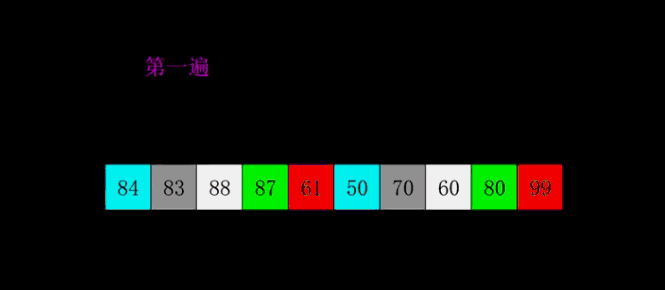
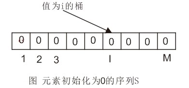
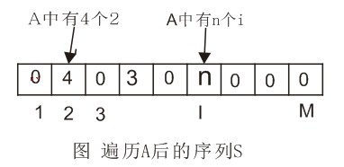
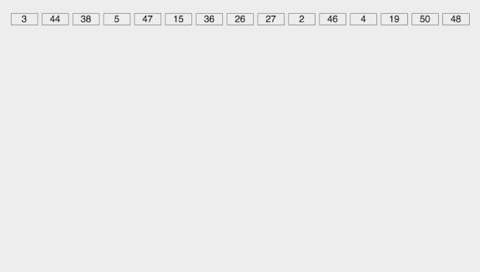
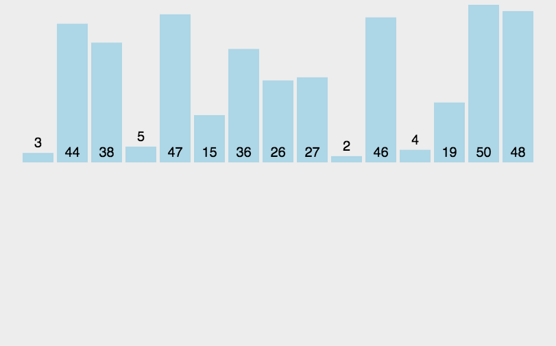
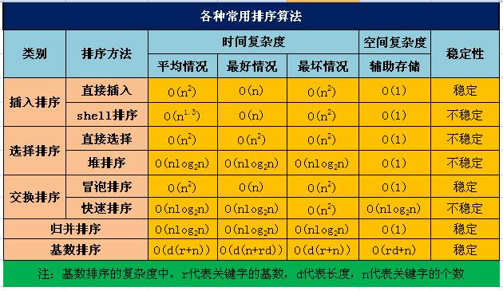
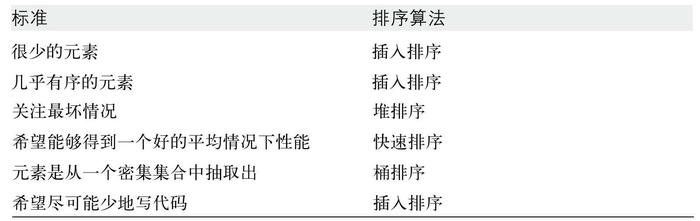

# 排序算法

### bubble冒泡排序
元素两两比较，顺序错误就交换顺序，顺序正确时使用下一个元素继续冒泡，直到最后
  

### selection （简单）选择排序
n个待排序元素，遍历0到n个元素，找到最小值，与0位置的元素交换位置，然后再遍历1到n的元素找最小值，与1交换，直到第n个

### shell 希尔排序
希尔排序属于插入类排序,是将整个有序序列分割成若干小的子序列分别进行插入排序。
排序过程：先取一个正整数d1<n，把所有序号相隔d1的数组元素放一组，组内进行直接插入排序；然后取d2<d1，重复上述分组和排序操作；直至di=1，即所有记录放进一个组中排序为止。

### insertion 插入排序
n个待排序元素，选第1个，与第0个比较，交换位置，然后第2个与第1个和第0个比较，找到合适的位置，关键点是插入，即找到比当前元素大和小的两个挨着的元素，与大的那个交换位置 

  

### 选择排序和插入排序的区别
  - 选择排序是遍历未排序的部分，找到最小值，插入是遍历已排序的部分，找到合适的位置
  - 选择排序每次都遍历未排序的所有数据，插入是遍历已排序的部分，找到合适的之后就停止，不一定会遍历所有
  - 选择排序与输入数据是否有序无关，即使是有序的输入，也会遍历，插入排序对有序输入很友好

### heap 堆排序
#### 堆
　　堆是具有以下性质的完全二叉树：每个结点的值都大于或等于其左右孩子结点的值，称为大顶堆；或者每个结点的值都小于或等于其左右孩子结点的值，称为小顶堆。如下图：
　　

同时，我们对堆中的结点按层进行编号，将这种逻辑结构映射到数组中就是下面这个样子

该数组从逻辑上讲就是一个堆结构，我们用简单的公式来描述一下堆的定义就是：
- 大顶堆：arr[i] >= arr[2i+1] && arr[i] >= arr[2i+2]  
- 小顶堆：arr[i] <= arr[2i+1] && arr[i] <= arr[2i+2]  

ok，了解了这些定义。接下来，我们来看看堆排序的基本思想及基本步骤。
#### 堆排序的基本思想
将待排序序列构造成一个大顶堆，此时，整个序列的最大值就是堆顶的根节点。将其与末尾元素进行交换，此时末尾就为最大值。然后将剩余n-1个元素重新构造成一个堆，这样会得到n个元素的次小值。如此反复执行，便能得到一个有序序列了。

#### 堆排序基本步骤
分三步：
1. 以原始数组为基础，建立大顶堆(每个根节点上的值都不小于其左右子节点上的值)
2. 经过第一步之后，该二叉树的根节点已经是为该数组的最大值了。将该根节点与二叉树末端子节点置换，然后将置换的该子节点从该二叉树中删除，这样最大值排到了最后。
3. 得到已经删除最末端子节点的二叉树，重复步骤2，直至二叉树仅仅剩下根节点，也就是最小值。
需要注意的是，数组是从0开始索引，因此该算法实现时容易在索引上出错

### quick 快速排序
快速排序是对冒泡排序的一种改进。
快速排序基本思想是，通过一趟排序将要排序的数据分割成独立的两部分，其中一部分的所有数据都比另外一部分的所有数据都要小，然后再按此方法对这两部分数据分别进行快速排序，整个排序过程可以递归进行，以此达到整个数据变成有序序列。
#### 快速排序步骤
设要排序的数组是A[0]……A[N-1]，首先任意选取一个数据（通常选用数组的第一个数）作为关键数据，然后将所有比它小的数都放到它前面，所有比它大的数都放到它后面，这个过程称为一趟快速排序。值得注意的是，快速排序不是一种稳定的排序算法，也就是说，多个相同的值的相对位置也许会在算法结束时产生变动。

一趟快速排序的算法是：
1. 设置两个变量i、j，排序开始的时候：i=0，j=N-1；
2. 以第一个数组元素作为关键数据，赋值给key，即key=A[0]；
3. 从j开始向前搜索，即由后开始向前搜索(j--)，找到第一个小于key的值A[j]，将A[j]的值赋给A[i]；
4. 从i开始向后搜索，即由前开始向后搜索(i++)，找到第一个大于key的A[i]，将A[i]的值赋给A[j]；
5. 重复第3、4步，直到i=j； (3,4步中，没找到符合条件的值，即3中A[j]不小于key,4中A[i]不大于key的时候改变j、i的值，使得j=j-1，i=i+1，直至找到为止。找到符合条件的值，进行交换的时候i， j指针位置不变。另外，i==j这一过程一定正好是i+或j-完成的时候，此时令循环结束）。
  

### bucket 桶排序
如果有一个数组A，包含N个整数，值从1到M，我们可以得到一种非常快速的排序，桶排序（bucket sort）。留置一个数组S，里面含有M个桶，初始化为0。然后遍历数组A，读入Ai时，S[Ai]增一。所有输入被读进后，扫描数组S得出排好序的表。该算法时间花费O(M+N)，空间上不能原地排序。

桶排序步骤：
1. 初始化序列S，S的长度与待排序数组一致

1. 遍历A修改序列S的项

1. 解析排序后的结果
图中的结果为2 2 2 2 4 4 4 ... n个i ...

### radix 基数排序
基数排序一般用于长度相同的元素组成的数组。首先按照最低有效数字进行排序，然后由低位向高位进行。
基数排序可以看做是进行多趟桶排序。每个有效数字都在0-9之间，很适合桶排序，建10个桶很方便。

### merge 归并排序
归并排序（MERGE-SORT）是建立在归并操作上的一种有效的排序算法,该算法是采用分治法（Divide and Conquer）的一个非常典型的应用。将已有序的子序列合并，得到完全有序的序列；即先使每个子序列有序，再使子序列段间有序。若将两个有序表合并成一个有序表，称为二路归并。

归并操作的工作原理如下：
第一步：申请空间，使其大小为两个已经排序序列之和，该空间用来存放合并后的序列
第二步：设定两个指针，最初位置分别为两个已经排序序列的起始位置
第三步：比较两个指针所指向的元素，选择相对小的元素放入到合并空间，并移动指针到下一位置
重复步骤3直到某一指针超出序列尾
将另一序列剩下的所有元素直接复制到合并序列尾
### 各种排序算法时间、空间复杂度

### 算法适用场景
