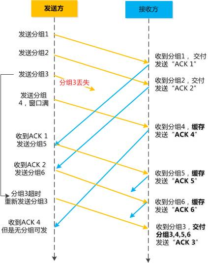

### 三次握手
三次握手是为了确认发送方和接收方的发送和接收能力都正常
1. 发送方发送连接请求，接收方收到，此时接收方确认了发送发的发送能力正常。
2. 接收方发送确认请求，此时发送放确认了自己的发送能力、发送方的接收能力和发送能力正常。
3. 发送方发送确认请求，此时接收方确认了自己的发送和接收能力，发送方的发送和接收能力都正常

### 数据发送
发送方数据分组发送，且有一个发送窗口的最大数量，当发送窗口最大数量满了之后需要等待。
如发送窗口最大数量是4，需发送报文分成了6组，此时发送流程为：
1. 发送方依次发送1 2 3 4 组数据，此时发送暂停，等待接收方确认
2. 接收方发送确认分组1 2 4 的接收，此时因为接收方未收到分组3，数据不连续，所以缓存分组4
3. 发送方收到了分组1 2 的接收确认，继续发送数据5 6
4. 接收方收到分组 5 6，缓存等待分组3，返回5 6的确认
5. 发送方等待分组3确认超时，此时重发分组3
6. 接收方收到分组3，从缓存里取出4 5 6，交付3 4 5 6 ，发送分组3的确认
7. 发送方数据发送完成，进入4次挥手流程

### 四次挥手
1. 客户端发送关闭连接请求
2. 服务端收到请求，发送一个确认收到
3. 服务端关闭连接，发送一个连接已关闭
4. 客户单发送确认关闭