### 敏捷开发模式的修炼之道
曾经我们开发项目都是采用传统的“瀑布式”流程进行开发，即需求、设计、开发、测试、上线等阶段，其中每个阶段都有明确的交付时间点，且每个阶段都依赖于它的上个阶段，一旦需求有变化，就会影响后续的每个阶段，项目管理存在一定的风险。为了避免这个风险，做到更好地拥抱变化，我们尝试使用了敏捷开发方法，最为典型的是 Scrum。我们参考Scrum 的流程结合自身的特点，总结了一套更容易落地的Scrum，后面我会跟大家讲到一些相关细节。

我理解的敏捷开发实际上是一个轻量级的项目管理规范，因为我们可以将整个大的需求范围拆分成若干迭代周期，我们为这些迭代周期设置明确的里程碑，且评估完成这些功能需要花费的成本，更重要的是，每次迭代完成以后，我们会对本次迭代进行一个回顾，取其精华，去其糟粕，不断完善，持续改进。

敏捷开发现在已经成为了主流，传统开发模式已经出现了明显的缺陷，随着互联网的发展，软件开发的节奏会越来越快，变化也会越来越频繁，需要我们能够快速地发现变化，并进行及时地调整。

敏捷开发的未来会变得更好，不仅仅在软件开发行业，而且可能会在其它行业里也会得到应用，因为从客户的角度来看，他们想要的是能通过最短的时间看到自己想要的东西，很多时候不做出一点东西出来，客户是没有任何想法的，所以需要将事情分解成多阶段，迭代完成每个阶段的里程碑，让客户满意，才是企业最大的收获。

敏捷这个话题大家一直都在谈论，也有很多关于敏捷的工具或方法，我个人比较倾向于 Scrum。我理解的敏捷其实是一种思想，Scrum 是对让这个思想落地的一个参考。也就是说，我们大可不必完全拘泥于 Scrum 定义的规范，只需要参考它并结合自身的条件做适当调整即可。比如说，每日站会这个环节就非常重要，不管是放在每天上午，还是放在每天下午，总之最好要有固定的周期。此外，每次 Sprint（迭代）结束后除了有评审会以外，Scrum Master 不要忘记对本次 Sprint 做一个回顾与总结，哪些是本次迭代中做的好的地方，哪些是做的不好的，再对比上次迭代的的结论，哪些是有改进的，哪些是新的问题。

Scrum 提供了三类角色，分别是：Product Owner（一般由产品经理担任）、Scrum Master（一般由开发经理担任）、Scrum Team（包括开发与测试人员），其中，Scrum Master 的角色至关重要，对项目的成败起决定性作用。

阿里巴巴也在广泛使用 Scrum 敏捷开发模式，而且整个项目几十人都可以用 Scrum，只是首先需要将整个团队拆分成若干小团队，保证每个小团队按照 Scrum 进行操作，此外，再将每个小团队的 Scrum Master 召集在一起，再做一轮 Scrum，这就是所谓的 Scrum of Scrum。过程稍微复杂一点，但可以将敏捷用于更大的团队规模，并能保证敏捷的效果。

敏捷开发工具“看板”,该词汇来自于岛国，当我看到看板的英文时，我真的惊呆了，看板竟然就是 Kanban？！

我们可以结合 Scrum 与 Kanban，让项目管理更加有效，让资源分配更加合理，让绩效考核更加公平！

对于项目经理而言，最担心的就是项目进度不可控，不知道每位开发人员具体的工作进度，有了 Kanban 一切都是那么地清晰。 对于开发经理而言，最担心的就是资源分配不合理，忙的人忙死，闲的人闲死，有了 Kanban 一切都是那么地自然。 对于开发人员而言，最担心的就是绩效考核不公平，“凭什么我做的比他多，拿的工资却比他少？不公平啊！”有了 Kanban 一切都是那么地公平。 可见，项目经理、开发经理、开发人员拥有了 Kanban，也就拥有了和谐与快乐！

那么 Kanban 到底是什么呢？我们先来看看这张表格吧：

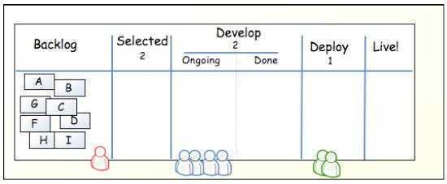

下面我们来理解一下这个表格吧！

这个表格有 5 列：Backlog（原始需求）、Selected（被选中的需求）、Develop（开发阶段）、Deploy（部署阶段）、Live（上线阶段） 其中 Develop 阶段包括 2 个子阶段：Ongoing（进行中）、Done（已完成） 包括 3 中角色：产品经理（红色小人）、开发人员（蓝色小人）、部署人员（绿色小人），其实还有项目经理，只是他/她贯穿于始终，所有就没有画出来了。 在 Backlog 中放置了许多小卡片，它们在 Kanban 中被称为 WIP（Work In Process，在制品）。对于产品经理而言，WIP 是需求，而对于开发人员与部署人员而言，WIP 却是任务。

实际这些 WIP 卡片上都带有一些文字描述，包括：标题、描述、优先级等信息。

需要注意的是，Selected、Develop、Deploy 下方有一个数字，该数字表示此阶段中最多可以放置的 WIP 数量。例如，在 Selected 中最多只能放 2 个 WIP；在 Develop 中（包括它的子阶段）最多只能放置 2 个 WIP。这里的数字只是一个示例，具体多少可根据团队实际情况而定。有一个经验公式可以参考“WIP 上限 = 团队规模 * 2 - 1”，减 1 表示大家需要协作，例如：4 人的团队，WIP 上限是 7。

也许有人会提出，为什么没有 Test 阶段？—— 这个可以有，这里只是一个示例而已，你不妨自行加上去。

对于多个项目而言，可以在这张表格中添加更多的泳道（行），每一行相当于一个项目，所有的项目进度清晰明了。

好！继续我们的 Kanban，有意思的事情即将发生！

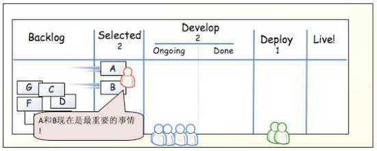

产品经理挑选了 2 个 WIP 到 Selected 中，此时，由开发经理决定该任务的技术难度，并由项目经理将任务分配到指定的开发人员，也可将同一个任务分配给两个人，让他们去结对编程。

开发人员（架构师与程序员）可对 Selected 中的需求进行工作量评估，可采用投票的方式进行，最终给出一个合理的评估值，整个估算过程，项目经理无需参与，主要是开发人员共同完成。

开发经理可以对任务设置一个“分值”，这个分值可直接影响到后续的绩效考核，所以对大家来说，这个分值是公开可见的，谁做的多，谁做得少，一目了 然。当然，开发人员也可以主动承担具有更具挑战的任务（为了锻炼自己，也为了多拿点钱），但任务分配的决定权始终在项目经理手中。

现在假设 A、B 两个任务已经分别被不同的开发人员处理了，那么这些任务就应该移动到 Ongoing 中，同时，产品经理可以从 Backlog 中挑选出 2 个优先级较高的需求到 Selected 中。这样就保证 Selected 与 Develop 都达到了 WIP 的上限。

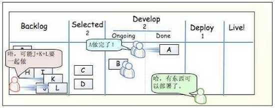

有人已经把 A 做完了，那么 A 就可以移动到 Done 中了。随后，部署人员就可以开始干活了。

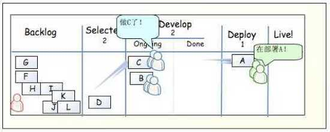

部署人员就可以将 A 从 Done 中移动到 Deploy 中，表示部署人员正在做这件事情。同时，做完了 A 任务的开发人员可以再做其它新任务，只需从 Selected 中移动到 Ongoing 中，移动这件事情不是开发人员随意操作的，而是有项目经理负责的。产品经理发现 Selected 中只有一个 D，就可以考虑放入一些新的需求了。

此时，部署人员遇到了问题，发现 A 部署的时候总是报错，跑不起来了。同时，其他开发人员也完成了 B 任务。

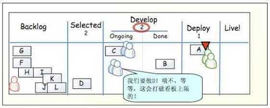

完成了 B 任务的开发人员本来是可以做新需求的，但项目经理发现 Develop 中只能放 2 个任务，所以肯定是后面的阶段出现了问题，导致整个流程受阻了。项目经理可以灵活调度人力资源，集中火力解决现在所遇到的问题。

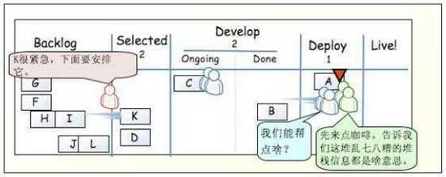

所以项目经理不得不放弃新的任务，去让开发人员去帮助部署人员来解决问题。此时，其他的开发人员还在进行 C 任务。

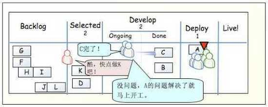

部署的问题还没来得及解决，此时 C 任务也完成了，同时，产品经理也放入了新的 K 需求，确保 Selected 这个水池是装满水的。

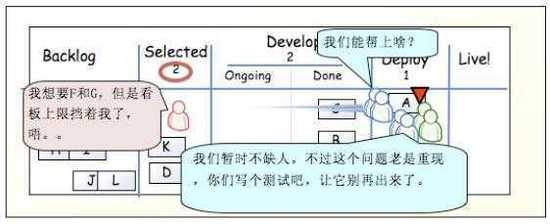

整个部署问题看起来比较搞人，所有的开发人员全都上阵了，集中更多人的智慧，解决这个棘手的问题。此时，产品经理不能放入更多的需求，由于此时 Selected 已经满额了。其实，开发人员面对太多的需求时，往往都会倍感压力，身心憔悴。

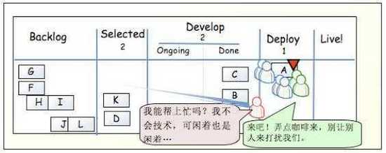

看来这个部署问题，确实够折腾的，连产品经理都过来了凑热闹了。但他或许不懂技术，但多个人多个头脑吧，正所谓“当局者迷，旁观者清”，最终经过大家的努力，肯定会攻克这座碉堡！

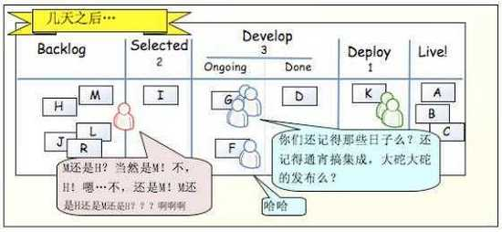

几天之后，Kanban 流程依旧是稳定的，大家分工协作，人力资源合理利用。大家是一个团队，目标就是把项目做好，不会因为自己的事情做完了就闲置了。

我们不妨将这张表格贴到墙上去吧！让每个员工都可以看到，让过路的老板们也可以看到我们的辛苦努力，这确实是一种非常好的项目管理方法！

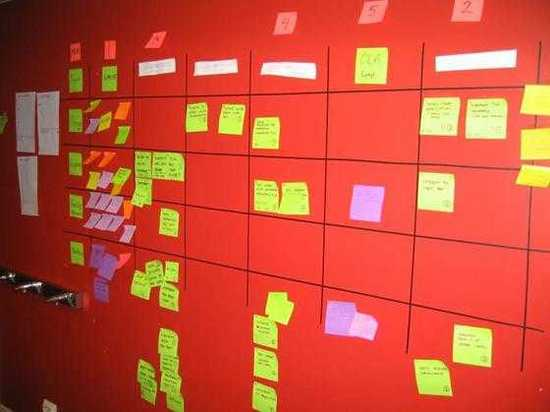

在这里给大家提供一个学习交流的平台，java架构师群：680130298

* 具有1-5工作经验的，面对目前流行的技术不知从何下手，需要突破技术瓶颈的可以加群。

* 在公司待久了，过得很安逸，但跳槽时面试碰壁。需要在短时间内进修、跳槽拿高薪的可以加群。

* 如果没有工作经验，但基础非常扎实，对java工作机制，常用设计思想，常用java开发框架掌握熟练的可以加群。

最后给大家提出以下 10 点建议及其目标：

* Sprint 第一天，需要将目标定义清楚，并让团队所有人都知道「确保建立一致的目标并使之明确」；

* 若出现需求变更，则优先排到下次迭代，特殊情况需特殊处理「确保本次迭代可以按时完工」；

* Scrum Master 将迭代中的需求分解为任务，每个任务只能有一个任务负责人，且不超过一个人天「确保每日任务可评估」；

* 让 Product Owner 直接与相关开发人员确定需求，Scrum Master 需一同参与「确保需求与实现不会发生偏差」；

* 每日定时站会，时长不超过 15 分钟，规模不要太大「确保任务完成情况与计划保持一致」；

* 每日进行一次代码评审，由 Scrum Master 负责，并在次日将评审结果通知给相关开发人员「确保代码质量不要下降」；

* 各个团队的 Scrum Master 保持每日沟通一次，时间不要超过 15 分钟「确保项目管理不会出现风险」；

* 每次迭代结束，让大家稍微放松一下，可提供一些团队活动，比如聚餐「确保团队能够更加凝聚」；

* Scrum Master 需要给团队一些承诺，比如项目奖金或特殊福利等「确保团队更加有激情」；

* 对于情绪异常的员工，Scrum Master 需及时与其沟通「确保不要让一个人的情绪影响整个团队」；

此外，作为项目管理者，需要不断在团队中加强以下 6 点文化：

* 方向一致

* 当面沟通

* 全情投入

* 充分信任

* 说到做到