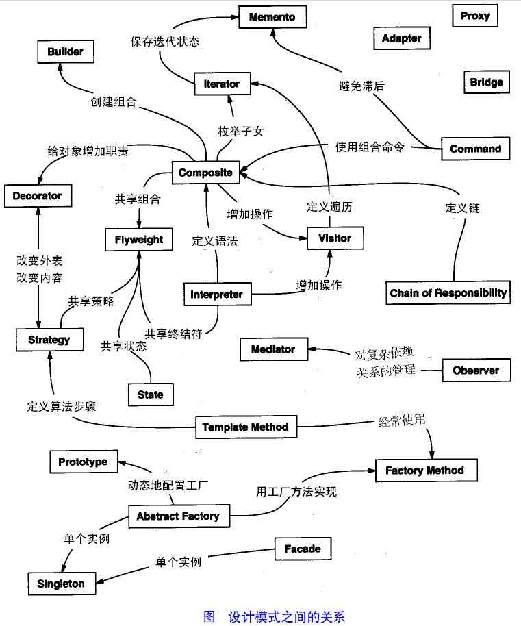

### 设计模式的类型
根据设计模式的参考书 Design Patterns - Elements of Reusable Object-Oriented Software（中文译名：设计模式 - 可复用的面向对象软件元素） 中所提到的，总共有 23 种设计模式。这些模式可以分为三大类：创建型模式（Creational Patterns）、结构型模式（Structural Patterns）、行为型模式（Behavioral Patterns）。当然，我们还会讨论另一类设计模式：J2EE 设计模式。

| 序号 | 模式 & 描述 | 包括 |
| --- | --- | --- |
| 1 | **创建型模式**这些设计模式提供了一种在创建 对象的同时隐藏创建逻辑的方式，而不是 使用 new 运算符直接实例化对象。这使得程 序在判断针对某个给定实例需要创建哪些对象 时更加灵活。|  工厂模式（Factory Pattern） 抽象工厂模式（Abstract Factory Pattern） 单例模式（Singleton Pattern） 建造者模式（Builder Pattern） 原型模式（Prototype Pattern）|
| 2 | **结构型模式**这些设计模式关注类和对象的组合。 继承的概念被用来组合接口和定义组 合对象获得新功能的方式。 |   适配器模式（Adapter Pattern） 桥接模式（Bridge Pattern） 过滤器模式（Filter、Criteria Pattern） 组合模式（Composite Pattern） 装饰器模式（Decorator Pattern） 外观模式（Facade Pattern） 享元模式（Flyweight Pattern） 代理模式（Proxy Pattern） |
| 3 | **行为型模式**这些设计模式特别关注对象之间的通信。 |   责任链模式（Chain of Responsibility Pattern） 命令模式（Command Pattern） 解释器模式（Interpreter Pattern） 迭代器模式（Iterator Pattern） 中介者模式（Mediator Pattern） 备忘录模式（Memento Pattern） 观察者模式（Observer Pattern） 状态模式（State Pattern） 空对象模式（Null Object Pattern） 策略模式（Strategy Pattern） 模板模式（Template Pattern） 访问者模式（Visitor Pattern） |
| 4 | **J2EE 模式**这些设计模式特别关注表示层。这些模式 是由 Sun Java Center 鉴定的。 |   MVC 模式（MVC Pattern） 业务代表模式（Business Delegate Pattern） 组合实体模式（Composite Entity Pattern） 数据访问对象模式（Data Access Object Pattern） 前端控制器模式（Front Controller Pattern） 拦截过滤器模式（Intercepting Filter Pattern） 服务定位器模式（Service Locator Pattern） 传输对象模式（Transfer Object Pattern）|

### 设计模式关系图

---

