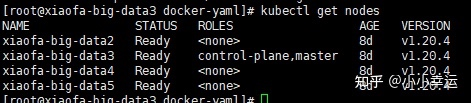

# 核心概念
参考文章:[十分钟带你理解Kubernetes核心概念](http://www.dockone.io/article/932)
## 架构图


上图可以看到如下组件，使用特别的图标表示Service和Label：
* Pod
* Container（容器）
* Label（标签）
* Replication Controller（复制控制器）
* Service（服务）
* Node（节点）
* Kubernetes Master（Kubernetes主节点）

## Pod

Pod（上图绿色方框）安排在节点上，包含一组容器和卷。同一个Pod里的容器共享同一个网络命名空间，可以使用localhost互相通信。Pod是短暂的，不是持续性实体。你可能会有这些问题：
如果Pod是短暂的，那么我怎么才能持久化容器数据使其能够跨重启而存在呢？ 是的，Kubernetes支持卷的概念，因此可以使用持久化的卷类型。
是否手动创建Pod，如果想要创建同一个容器的多份拷贝，需要一个个分别创建出来么？可以手动创建单个Pod，但是也可以使用Replication Controller使用Pod模板创建出多份拷贝，下文会详细介绍。
如果Pod是短暂的，那么重启时IP地址可能会改变，那么怎么才能从前端容器正确可靠地指向后台容器呢？这时可以使用Service，下文会详细介绍。

Pod 是 Kubernetes 抽象出来的，表示一组一个或多个应用程序容器（如 Docker），以及这些容器的一些共享资源。这些资源包括:
    * 共享存储，当作卷
    * 网络，作为唯一的集群 IP 地址
    * 有关每个容器如何运行的信息，例如容器映像版本或要使用的特定端口。
Pod 为特定于应用程序的“逻辑主机”建模，并且可以包含相对紧耦合的不同应用容器。例如，Pod 可能既包含带有 Node.js 应用的容器，也包含另一个不同的容器，用于提供 Node.js 网络服务器要发布的数据。Pod 中的容器共享 IP 地址和端口，始终位于同一位置并且共同调度，并在同一工作节点上的共享上下文中运行。

Pod是 Kubernetes 平台上的原子单元。 当我们在 Kubernetes 上创建 Deployment 时，该 Deployment 会在其中创建包含容器的 Pod （而不是直接创建容器）。每个 Pod 都与调度它的工作节点绑定，并保持在那里直到终止（根据重启策略）或删除。 如果工作节点发生故障，则会在群集中的其他可用工作节点上调度相同的 Pod。

### 常用命令

```shell
kubectl get pod my-pod
```

* NAME：Pod的名称。
* READY：Pod的准备状况，右边的数字表示Pod包含的容器总数目，左边的数字表示准备就绪的容器数目。
* STATUS：Pod的状态。
* RESTARTS：Pod的重启次数。
* AGE：Pod的运行时间。

默认情况下，kubectl get只是显示Pod的简要信息，以下方式可用于获取Pod的完整信息：

```shell
kubectl get pod my-pod --output json  #用JSON格式显示Pod的完整信息 
kubectl get pod my-pod --output yaml  #用YAML方式显示Pod的完整信息 
```

另一个命令kubectl describe支持查询Pod的状态和生命周期事件。
查询显示的字段含义如下所示。
* Name：Pod的名称。
* Namespace：Pod的Namespace。
* Image(s)：Pod使用的镜像。
* Node：Pod所在的Node。
* Start Time：Pod的起始时间。
* Labels：Pod的Label。
* Status：Pod的状态。
* Reason：Pod处于当前状态的原因。
* Message：Pod处于当前状态的信息。
* IP：Pod的PodIP。
* Replication Controllers：Pod对应的Replication Controller。
* Containers：Pod中容器的信息。
* Container ID：容器的ID。
* Image：容器的镜像。
* Image ID：镜像的ID。
* State：容器的状态。
* Ready：容器的准备状况（true表示准备就绪）。
* Restart Count：容器的重启次数统计。
* Environment Variables：容器的环境变量。
* Conditions：Pod的条件，包含Pod的准备状况（true表示准备就绪）。
* Volumes：Pod的数据卷。
* Events：与Pod相关的事件列表。

```shell
#更新pod
kubectl replace /path/to/my-pod.yaml
```
但是因为Pod的很多属性是没办法修改的，比如容器镜像，这时候可以通过kubectl replace命令设置--force参数，等效于重建Pod。


## Lable

正如图所示，一些Pod有Label。一个Label是attach到Pod的一对键/值对，用来传递用户定义的属性。比如，你可能创建了一个"tier"和“app”标签，通过Label（tier=frontend, app=myapp）来标记前端Pod容器，使用Label（tier=backend, app=myapp）标记后台Pod。然后可以使用Selectors选择带有特定Label的Pod，并且将Service或者Replication Controller应用到上面。

## Replication Controller

是否手动创建Pod，如果想要创建同一个容器的多份拷贝，需要一个个分别创建出来么，能否将Pods划到逻辑组里？

Replication Controller确保任意时间都有指定数量的Pod“副本”在运行。如果为某个Pod创建了Replication Controller并且指定3个副本，它会创建3个Pod，并且持续监控它们。如果某个Pod不响应，那么Replication Controller会替换它，保持总数为3.如下面的动画所示：


如果之前不响应的Pod恢复了，现在就有4个Pod了，那么Replication Controller会将其中一个终止保持总数为3。如果在运行中将副本总数改为5，Replication Controller会立刻启动2个新Pod，保证总数为5。还可以按照这样的方式缩小Pod，这个特性在执行滚动升级时很有用。

当创建Replication Controller时，需要指定两个东西：
1. Pod模板：用来创建Pod副本的模板
2. Label：Replication Controller需要监控的Pod的标签。

现在已经创建了Pod的一些副本，那么在这些副本上如何均衡负载呢？我们需要的是Service。

## Service

如果Pods是短暂的，那么重启时IP地址可能会改变，怎么才能从前端容器正确可靠地指向后台容器呢？

Service是定义一系列Pod以及访问这些Pod的策略的一层抽象。Service通过Label找到Pod组。因为Service是抽象的，所以在图表里通常看不到它们的存在，这也就让这一概念更难以理解。

现在，假定有2个后台Pod，并且定义后台Service的名称为‘backend-service’，lable选择器为（tier=backend, app=myapp）。backend-service 的Service会完成如下两件重要的事情：
* 会为Service创建一个本地集群的DNS入口，因此前端Pod只需要DNS查找主机名为 ‘backend-service’，就能够解析出前端应用程序可用的IP地址。
* 现在前端已经得到了后台服务的IP地址，但是它应该访问2个后台Pod的哪一个呢？Service在这2个后台Pod之间提供透明的负载均衡，会将请求分发给其中的任意一个（如下面的动画所示）。通过每个Node上运行的代理（kube-proxy）完成。这里有更多技术细节。

下述动画展示了Service的功能。注意该图作了很多简化。如果不进入网络配置，那么达到透明的负载均衡目标所涉及的底层网络和路由相对先进。如果有兴趣，这里有更深入的介绍。


有一个特别类型的Kubernetes Service，称为'LoadBalancer'，作为外部负载均衡器使用，在一定数量的Pod之间均衡流量。比如，对于负载均衡Web流量很有用。


尽管每个 Pod 都有一个唯一的 IP 地址，但是如果没有 Service ，这些 IP 不会暴露在集群外部。Service 允许您的应用程序接收流量。Service 也可以用在 ServiceSpec 标记type的方式暴露

* ClusterIP (默认) - 在集群的内部 IP 上公开 Service 。这种类型使得 Service 只能从集群内访问。
* NodePort - 使用 NAT 在集群中每个选定 Node 的相同端口上公开 Service 。使用<NodeIP>:<NodePort> 从集群外部访问 Service。是 ClusterIP 的超集。 每个node都会开启这个端口
* LoadBalancer - 在当前云中创建一个外部负载均衡器(如果支持的话)，并为 Service 分配一个固定的外部IP。是 NodePort 的超集。
* ExternalName - 通过返回带有该名称的 CNAME 记录，使用任意名称(由 spec 中的externalName指定)公开 Service。不使用代理。这种类型需要kube-dns的v1.7或更高版本。

### Service 和 Label

Service 通过一组 Pod 路由通信。Service 是一种抽象，它允许 Pod 死亡并在 Kubernetes 中复制，而不会影响应用程序。在依赖的 Pod (如应用程序中的前端和后端组件)之间进行发现和路由是由Kubernetes Service 处理的。

Service 匹配一组 Pod 是使用 标签(Label)和选择器(Selector), 它们是允许对 Kubernetes 中的对象进行逻辑操作的一种分组原语。标签(Label)是附加在对象上的键/值对，可以以多种方式使用:

指定用于开发，测试和生产的对象
嵌入版本标签
使用 Label 将对象进行分类
你也可以在创建 Deployment 的同时用 --expose创建一个 Service 。


标签(Label)可以在创建时或之后附加到对象上。他们可以随时被修改。现在使用 Service 发布我们的应用程序并添加一些 Label 。

## deployment?

https://kubernetes.io/zh/docs/concepts/workloads/controllers/deployment/

### deployment和service区别

service： 一个网络下的pod集合。service 使用labels标签来选择代理的pod。
Deployment：deployment 作用于一组pods的创建和运行
所以service 和deployment的区别，就是一个是从网络角度的抽象概念service，类型nginx做负载均衡提供的统一网络入口。而pod是最终的应用部署实体。 deoplyment 负责创建和保持pod运行状态

service 可以独立于deployment工作，但是需要一个个去创建pod，而不是像deployment那样一次性创建。

deployment也可以独立于service工作。

虽然service和deployment是有区别的，但不影响他们一同协同工作

例子：

```yml
kind: Service
apiVersion: v1

metadata:
  name: hostname-service

spec:
  type: NodePort
  selector:
    app: echo-hostname
  ports:
    - nodePort: 30163
      port: 8080
      targetPort: 80
```

解释一下 NodePort， ClusterIp， LoadBalancer
* ClusterIp： 此服务仅能在k8s集群内访问
* NodePort： 节点端口，可以让service接收来自k8s集群外的请求
* LoadBalancer：
    * Port： k8s 集群内部访问service端口， 通过clusterip:port 请求某个service
    * nodePort： 使用nodeIp：nodePort 从外部访问请求某个service
    * targetPort：是pod的端口，从port和nodePort来的流量经过kube-proxy流入到后端pod的targetPort上，最后进入容器
    * containerPort：是pod内部容器的端口，targetPort映射到containerPort


实战检验：

如果我们要提供对外服务service； 选择nodeport 类型

```yml

apiVersion: apps/v1
kind: Deployment
metadata:
 name: mysql-app
spec:
  replicas: 2
  selector:
    matchLabels:
      app: mysql-app
  template:
    metadata:
      labels:
        app: mysql-app
    spec:
      containers:
      - name: mysql-app
        image: mysql:5.7.24
        ports:
        - containerPort: 3306
        volumeMounts:
        - name: mysql-data
          mountPath: /opt/mysql-data
          readOnly: true
        command: [ "/bin/bash", "-c", "--" ]
        args: [ "while true; do sleep 30; done;" ]
      volumes:
      - name: mysql-data
        hostPath:
          path: /opt/mysql-data
---
apiVersion: v1
kind: Service
metadata:
  name: mysql-service
spec:
  type: NodePort
  ports:
  - protocol: TCP
    port: 13306
    targetPort: 3306
    nodePort: 30001
  selector:
    app: mysql-app
```
    
kubectl apply -f 此文件.yml

我们定义一个 mysql-service 类型使用nodeport，

暴露对外端口为 nodePort: 30001， 指向 container 3306

注意，这里的nodePort 指的是 master节点的 端口。


我们主节点在



注意 使用ubuntu镜像，如果不加
       
``` 
command: [ "/bin/bash", "-c", "--" ]
args: [ "while true; do sleep 30; done;" ]

```
默认执行完成就 就结束容器运行状态了。


volumes 将在node节点上创建


## Node

节点（上图橘色方框）是物理或者虚拟机器，作为Kubernetes worker，通常称为Minion。每个节点都运行如下Kubernetes关键组件：
* Kubelet：是主节点代理。
* Kube-proxy：Service使用其将链接路由到Pod，如上文所述。
* Docker或Rocket：Kubernetes使用的容器技术来创建容器。

## Kubernetes Master

集群拥有一个Kubernetes Master（紫色方框）。Kubernetes Master提供集群的独特视角，并且拥有一系列组件，比如Kubernetes API Server。API Server提供可以用来和集群交互的REST端点。master节点包括用来创建和复制Pod的Replication Controller。

# 常用命令

## 查看服务实例

```shell
 kubectl get pods -n content-middle -o wide |grep image
 
 kubectl get pods -n content-middle -l app=idata-content-etl-image -o wide
```

## 进入容器
```shell
# 先get pods找到容器名
kubectl -n content-middle exec -it idata-content-etl-image-7ff47ddcc4-4c4mr sh
```

# k8s 开发环境配置问题

## minikube start Pulling base image慢
指定镜像
minikube start --image-mirror-country='cn'

## k3s安装

### 在线安装

- server

    `curl -sfL https://get.k3s.io | sh -`
    配置文件在/etc/rancher/k3s/k3s.yaml
    
    k3s默认使用的containerd作为容器运行时，使用docker的话用
    `curl -sfL https://get.k3s.io | sh -s - server --docker`
    
- agent
    `curl -sfL https://get.k3s.io | K3S_URL=https://myserver:6443 K3S_TOKEN=XXX sh -`
    token在server的/var/lib/rancher/k3s/server/node-token

### 离线安装

[参考](https://www.cnblogs.com/k3s2019/p/14339547.html)

http://mirror.cnrancher.com 下载安装包
包括k3s-install.sh(k3s根目录下) k3s二进制文件和k3s安装依赖的镜像包

http://rancher-mirror.cnrancher.com/k3s/v1.21.5-k3s1/k3s
http://rancher-mirror.cnrancher.com/k3s/v1.21.5-k3s1/k3s-airgap-images-arm64.tar
http://rancher-mirror.cnrancher.com/k3s/k3s-install.sh

1、导入镜像到 docker 镜像列表

`sudo docker load -i /root/k3s-airgap-images-amd64.tar`

2、将 K3s 安装脚本和 K3s 二进制文件移动到对应目录并授予可执行权限

```
#注意k3s文件一定要放到/usr/local/bin/下，否则还是会在线下载安装包
sudo chmod a+x /root/k3s /root/k3s-install.sh
sudo cp /root/k3s /usr/local/bin/
```
3、安装 K3s

`INSTALL_K3S_SKIP_DOWNLOAD=true INSTALL_K3S_EXEC='--docker' /root/k3s-install.sh`


### 卸载
`sh /usr/local/bin/k3s-uninstall.sh`

# kubectl命令

```sh
#集群信息
kubectl cluster-info
#节点信息
kubectl get nodes
#创建deployment
kubectl create deployment kubernetes-bootcamp --image=gcr.io/google-samples/kubernetes-bootcamp:v1
#查看所有deployment信息
kubectl get deployments

#启动一个k8s的代理，此时可通过curl之类请求指定pod资源
kubectl proxy

#查所有pod信息
kubectl get pods
#查所有pod信息，包括ip和node -o wide宽表 还支持json和yaml，json和yaml显示pod的完整信息
kubectl get pods -o wide

kubectl get - 列出资源
kubectl describe - 显示有关资源的详细信息
kubectl logs - 打印 pod 和其中容器的日志
kubectl exec - 在 pod 中的容器上执行命令

kubectl get services

kubectl expose deployment/kubernetes-bootcamp --type="NodePort" --port 8080

#查看kubernetes-bootcamp这个service的详细信息
kubectl describe services/kubernetes-bootcamp
#查看所有service的详细信息
kubectl describe services

kubectl get services/kubernetes-bootcamp

# -l label参数 下面是查找label里app是kubernetes-bootcamp的pods
kubectl get pods -l app=kubernetes-bootcamp
# 查找label里app是kubernetes-bootcamp的services
kubectl get services -l app=kubernetes-bootcamp

# 设置test1这个pod的label属性version=v1
kubectl label pods test1 version=v1

#删除service，通过label参数匹配
kubectl delete service -l app=kubernetes-bootcamp

#删除pod，如果pod状态一直是Terminating，可以加--force强制删除
kubectl delete pod podname

#查询deployments的副本数
kubectl get rs

#修改副本数
kubectl scale deployments/kubernetes-bootcamp --replicas=4

#更新版本到v2
kubectl set image deployments/kubernetes-bootcamp kubernetes-bootcamp=jocatalin/kubernetes-bootcamp:v2

#回滚
kubectl rollout undo deployments/kubernetes-bootcamp

#使用指定的文件创建资源，可以是本地文件，也可以是url
kubectl apply -f kubernetes.yaml

#根据for条件查询服务状态，返回condition met表示查询到符合条件的
kubectl wait --for=condition=ready pod -l app=inventory

kubectl create configmap sys-app-name --from-literal name=my-system
kubectl create secret generic sys-app-credentials --from-literal username=bob --from-literal password=bobpwd

#看日志
kubectl logs -f audit-server-7c48dc54f6-dbn4x -n auto-content-middle

#查api
kubectl api-resources -o wide
```

# yaml参数

核心部分
yml 文件核心可以主要是下面的4部分，根据不同的资源类型填充即可
apiVersion: api版本
kind: 资源类型
metadata:
  。。。。。元数据
spec:
  。。。。。期望值（存储、资源、容器相关的配置等等）


具体参数：
```yaml
# yaml格式的pod定义文件完整内容：
apiVersion: v1       #必选，版本号，例如v1
kind: Pod       #必选 可以是其他的类型比如Deployment、Service 但是下面的内容要自己改变
metadata:       #必选，元数据
  name: string       #必选，Pod名称
  namespace: string    #必选，Pod所属的命名空间
  labels:      #自定义标签
    - name: string     #自定义标签名字
  annotations:       #自定义注释列表
    - name: string
spec:         #必选，Pod中容器的详细定义
  containers:      #必选，Pod中容器列表
  - name: string     #必选，容器名称
    image: string    #必选，容器的镜像名称
    imagePullPolicy: [Always | Never | IfNotPresent] #获取镜像的策略 Alawys表示下载镜像 IfnotPresent表示优先使用本地镜像，否则下载镜像，Nerver表示仅使用本地镜像
    command: [string]    #容器的启动命令列表，如不指定，使用打包时使用的启动命令
    args: [string]     #容器的启动命令参数列表
    workingDir: string     #容器的工作目录
    volumeMounts:    #挂载到容器内部的存储卷配置
    - name: string     #引用pod定义的共享存储卷的名称，需用volumes[]部分定义的的卷名
      mountPath: string    #存储卷在容器内mount的绝对路径，应少于512字符
      readOnly: boolean    #是否为只读模式
    ports:       #需要暴露的端口库号列表
    - name: string     #端口号名称
      containerPort: int   #容器需要监听的端口号
      hostPort: int    #容器所在主机需要监听的端口号，默认与Container相同
      protocol: string     #端口协议，支持TCP和UDP，默认TCP
    env:       #容器运行前需设置的环境变量列表
    - name: string     #环境变量名称
      value: string    #环境变量的值
    resources:       #资源限制和请求的设置
      limits:      #资源限制的设置
        cpu: string    #Cpu的限制，单位为core数，将用于docker run --cpu-shares参数
        memory: string     #内存限制，单位可以为Mib/Gib，将用于docker run --memory参数
      requests:      #资源请求的设置
        cpu: string    #Cpu请求，容器启动的初始可用数量
        memory: string     #内存清楚，容器启动的初始可用数量
    livenessProbe:     #对Pod内个容器健康检查的设置，当探测无响应几次后将自动重启该容器，检查方法有exec、httpGet和tcpSocket，对一个容器只需设置其中一种方法即可
      exec:      #对Pod容器内检查方式设置为exec方式
        command: [string]  #exec方式需要制定的命令或脚本
      httpGet:       #对Pod内个容器健康检查方法设置为HttpGet，需要制定Path、port
        path: string
        port: number
        host: string
        scheme: string
        HttpHeaders:
        - name: string
          value: string
      tcpSocket:     #对Pod内个容器健康检查方式设置为tcpSocket方式
         port: number
       initialDelaySeconds: 0  #容器启动完成后首次探测的时间，单位为秒
       timeoutSeconds: 0   #对容器健康检查探测等待响应的超时时间，单位秒，默认1秒
       periodSeconds: 0    #对容器监控检查的定期探测时间设置，单位秒，默认10秒一次
       successThreshold: 0
       failureThreshold: 0
       securityContext:
         privileged:false
    restartPolicy: [Always | Never | OnFailure]#Pod的重启策略，Always表示一旦不管以何种方式终止运行，kubelet都将重启，OnFailure表示只有Pod以非0退出码退出才重启，Nerver表示不再重启该Pod
    nodeSelector: obeject  #设置NodeSelector表示将该Pod调度到包含这个label的node上，以key：value的格式指定
    imagePullSecrets:    #Pull镜像时使用的secret名称，以key：secretkey格式指定
    - name: string
    hostNetwork:false      #是否使用主机网络模式，默认为false，如果设置为true，表示使用宿主机网络，此时containerPort也依旧生效
    volumes:       #在该pod上定义共享存储卷列表
    - name: string     #共享存储卷名称 （volumes类型有很多种）
      emptyDir: {}     #类型为emtyDir的存储卷，与Pod同生命周期的一个临时目录。为空值
      hostPath: string     #类型为hostPath的存储卷，表示挂载Pod所在宿主机的目录
        path: string     #Pod所在宿主机的目录，将被用于同期中mount的目录
      secret:      #类型为secret的存储卷，挂载集群与定义的secre对象到容器内部
        scretname: string  
        items:     
        - key: string
          path: string
      configMap:     #类型为configMap的存储卷，挂载预定义的configMap对象到容器内部
        name: string
        items:
        - key: string
          path: string


```