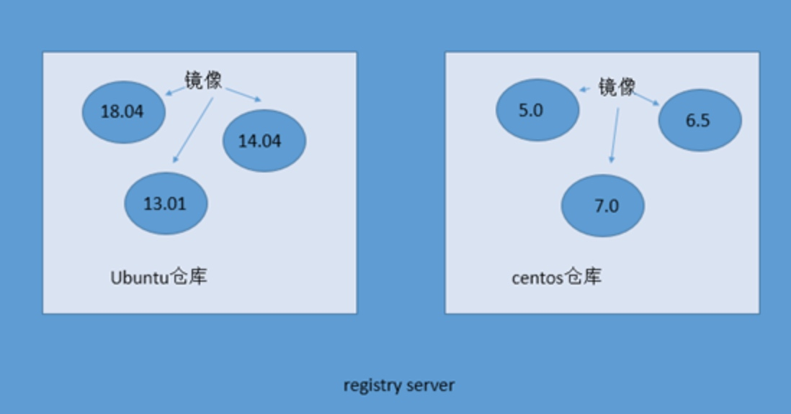
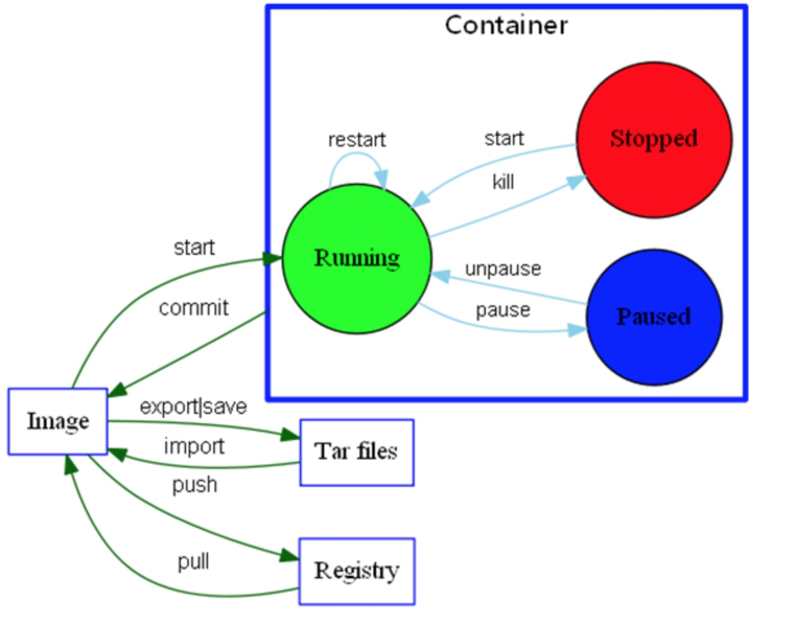
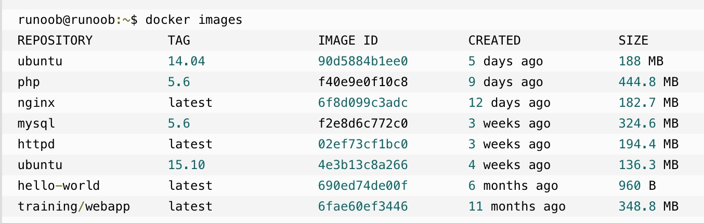
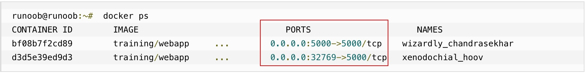
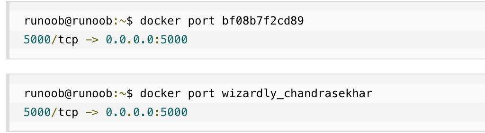

## Docker 教程
[教程](http://www.runoob.com/docker/docker-tutorial.html)
## 核心概念
* 镜像：类似虚拟机镜像
* 容器：类似linux系统环境，运行和隔离应用。容器从镜像启动的时候，docker会在镜像的最上一层创建一个可写层，镜像本身是只读的，保持不变。
* 仓库：每个仓库存放某一类镜像。



### 容器、仓库、镜像运行关系图


## MacOS Docker 安装
```shell
brew cask install docker
```

安装完后通过version命令查看版本
```shell
docker --version
```

### 镜像加速
在任务栏点击 Docker for mac 应用图标 -> Perferences... -> Daemon -> Registry mirrors。在列表中填写加速器地址即可。修改完成之后，点击 Apply & Restart 按钮，Docker 就会重启并应用配置的镜像地址了

国内镜像列表：
* http://registry.docker-cn.com 官方中国镜像，但只有流行的公有镜像。私有镜像仍需要从美国镜像库中拉取。ps:2019/03/20访问显示没有备案，大写的尴尬
* http://hub-mirror.c.163.com 网易提供的镜像，目前在用

## 常用镜像命令
### 本机docker镜像列表 images

```shell
docker images
```


各个选项说明:
* REPOSITORY：表示镜像的仓库源
* TAG：镜像的标签
* IMAGE ID：镜像ID
* CREATED：镜像创建时间
* SIZE：镜像大小

同一仓库源可以有多个 TAG，代表这个仓库源的不同个版本，如ubuntu仓库源里，有15.10、14.04等多个不同的版本，我们使用 REPOSITORY:TAG 来定义不同的镜像。
所以，我们如果要使用版本为15.10的ubuntu系统镜像来运行容器时，命令如下：

```shell
docker run -t -i ubuntu:15.10 /bin/bash
```
如果要使用版本为14.04的ubuntu系统镜像来运行容器时，命令如下：

```shell
docker run -t -i ubuntu:14.04 /bin/bash 
```

###获取一个新的镜像 pull

```shell
docker pull ubuntu:13.10
```
### 查找镜像 search

```shell
docker search httpd
```

### 创建镜像
当我们从docker镜像仓库中下载的镜像不能满足我们的需求时，我们可以通过以下两种方式对镜像进行更改。
1. 从已经创建的容器中更新镜像，并且提交这个镜像
2. 使用 Dockerfile 指令来创建一个新的镜像

#### 更新镜像
更新镜像之前，我们需要使用镜像来创建一个容器。

```shell
docker run -t -i ubuntu:15.10 /bin/bash
```
通过 -t -i来进入容器，然后按Ubuntu命令来进行更新，如安装软件或apt-get update命令更新软件等
修改完后可以通过命令 docker commit来提交容器副本

```shell
docker commit -m="has update" -a="runoob" e218edb10161 runoob/ubuntu:v2
```
各个参数说明：
* -m:提交的描述信息
* -a:指定镜像作者
* e218edb10161：容器ID
* runoob/ubuntu:v2:指定要创建的目标镜像名

可使用docker images命令来查看新镜像
注意此时只是提交到本地仓库，类似git的commit，要提交到远程仓库的话需要docker push

#### 构建镜像
构建镜像使用docker build 命令，需要先创建一个 Dockerfile 文件，其中包含一组指令来告诉 Docker 如何构建我们的镜像。

```shell
FROM    centos:6.7
MAINTAINER      Fisher "fisher@sudops.com"

RUN     /bin/echo 'root:123456' |chpasswd
RUN     useradd runoob
RUN     /bin/echo 'runoob:123456' |chpasswd
RUN     /bin/echo -e "LANG=\"en_US.UTF-8\"" >/etc/default/local
EXPOSE  22
EXPOSE  80
CMD     /usr/sbin/sshd -D
```
每一个指令都会在镜像上创建一个新的层，每一个指令的前缀都必须是大写的。
第一条FROM，指定使用哪个镜像源
RUN 指令告诉docker 在镜像内执行命令，安装了什么。。。
然后，我们使用 Dockerfile 文件，通过 docker build 命令来构建一个镜像。

```shell
docker build -t runoob/centos:6.7 .
```
参数说明：
* -t ：指定要创建的目标镜像名
* . ：Dockerfile 文件所在目录，可以指定Dockerfile 的绝对路径

### 设置镜像标签 tag

```shell
docker tag 860c279d2fec runoob/centos:dev
```
docker tag 镜像ID，这里是 860c279d2fec ,用户名称、镜像源名(repository name)和新的标签名(tag)。

### 删除镜像 rmi

```shell
docker rmi image_id
```

## 常用容器命令
### 首次启动容器 run
#### 运行容器内应用程序

```shell
docker run ubuntu:15.10 /bin/echo "Hello world"
```

>以上命令完整的意思可以解释为：Docker 以 ubuntu15.10 镜像创建一个新容器，然后在容器里执行 bin/echo "Hello world"，然后输出结果。

各个参数解析：
* docker: Docker 的二进制执行文件。
* run:与前面的 docker 组合来运行一个容器。
* ubuntu:15.10指定要运行的镜像，Docker首先从本地主机上查找镜像是否存在，如果不存在，Docker 就会从镜像仓库 Docker Hub 下载公共镜像，ubuntu是镜像名，15.10是镜像tag，不带tag的话会使用镜像的latest版本，但注意有些镜像没有latest，例如es，所以必须指定tag。
* /bin/echo "Hello world": 在启动的容器里执行的命令

**注意run命令会创建一个新容器**，如果只是使用已有容器的话先ps找到容器id，然后start id就可以了，交互模式的话加上-i
#### 运行交互式的容器

```shell
docker run -i -t ubuntu:15.10 /bin/bash
```
各个参数解析：
* -t:在新容器内指定一个伪终端或终端。
* -i:允许你对容器内的标准输入 (STDIN) 进行交互。

-i -t 可连写成-it
通过运行exit命令或者使用CTRL+D来退出容器。

#### 启动容器（后台模式）

```shell
docker run -d ubuntu:15.10 /bin/sh -c "while true; do echo hello world; sleep 1; done"
```
创建一个以进程方式运行的容器

在输出中，我们没有看到期望的"hello world"，而是一串长字符2b1b7a428627c51ab8810d541d759f072b4fc75487eed05812646b8534a2fe63,这个长字符串叫做**容器ID**，对每个容器来说都是唯一的，我们可以通过容器ID来查看对应的容器发生了什么。

### 查看docker进程 ps

```shell
docker ps
```
ps是查看正在运行的进程。
参数：
-l：可查看最后运行的一个docker，包括已经停止的
-a：查看所有状态的docker，包括已停止的


### 停止容器 stop

```shell
docker stop amazing_cori
```
>需指定docker容器id或name

### 启动已有容器 start
已经停止的容器，我们可以使用命令 docker start 来启动。
```shell
docker start amazing_cori
```
正在运行的，可以用restart命令来重启正在运行的docker

```shell
docker restart amazing_cori
```
注意start和run命令的区别，run 只在第一次运行时使用，将镜像放到容器中，以后再次启动这个容器时，只需要使用命令docker start 即可。
start命令必须知道docker的id或者name，可通过docker ps -a来查看所有状态的容器列表

### 连接正在运行的容器 exec

```shell
docker exec -it 775c7c9ee1e1 /bin/bash
```
**docker在1.3.X版本之后可用**
除了exec外，还有其他几种方法：
1. attach
    docker attach 容器ID也可以连接运行中的容器，但使用该命令有一个问题。当多个窗口同时使用该命令进入该容器时，所有的窗口都会同步显示。如果有一个窗口阻塞了，那么其他窗口也无法再进行操作。
    因为这个原因，所以docker attach命令不太适合于生产环境，平时自己开发应用时可以使用该命令
2. SSH
    在镜像（或容器）中安装SSH Server，把容器看成普通服务器ssh连接就行了 
3. 使用nsenter进入Docker容器 
    具体参考文档：[什么是nsenter](https://github.com/jpetazzo/nsenter)


### 映射本机端口 run -p
通过docker运行web服务时，可指定本机端口映射到docker容器上

```shell
docker run -d -P training/webapp python app.py
```
* -d:让容器在后台运行。
* -P:将容器内部使用的网络端口映射到我们使用的主机上。本机端口随机
* -p:指定本机端口，如-p 5000:5000，同时绑定多个用多个-p，如 -p 123:123 -p 456:456

#### 查看docker端口和本机的映射
通过docker ps命令查看PORTS列可查看本机所有docker端口映射关系



通过docker port 可以查看指定 （ID 或者名字）容器的某个确定端口映射到宿主机的端口号。



### 查看docker日志 logs
docker logs [ID或者名字] 可以查看容器内部的标准输出
```shell
docker logs 2b1b7a428627
```
>2b1b7a428627为docker容器的id，可通过docker ps查看，或者使用docker容器的name也可以

```shell
docker logs -f bf08b7f2cd89
```
* -f: 让 docker logs 像使用 tail -f 一样来输出容器内部的标准输出。

### 查看docker的底层信息 inspect

```shell
docker inspect bf08b7f2cd89
```
使用 docker inspect 来查看 Docker 的底层信息。它会返回一个 JSON 文件记录着 Docker 容器的配置和状态信息。

### 移除容器 rm

```shell
docker rm wizardly_chandrasekhar
```
删除容器时，容器必须是停止状态，否则会报错

### 重命名容器 rename

```shell
docker rename 容器id new_name
```

### 修改端口映射

容器初始化时可通过run命令带-P随机指定或者-p 8001:8000来指定具体映射端口，但如果容器已经创建了，再要修改端口的话start命令不支持-P了，可以通过以下几种方法修改：

#### 先提交镜像再设置端口
1. 提交一个运行中的容器为镜像

    ```shell
docker commit containerid foo/live
```

2. 运行镜像并添加端口

    ```shell
docker run -d -p 8000:80 foo/live /bin/bash
```

#### 通过iptable端口映射
1. 查看容器ip

    ```shell
docker inspect <container-name | id> | grep IPAddress
```
    这一步后会输出容器的ip地址，端口绑定时会使用。

2. 端口绑定

    ```shell
sudo iptables -t nat -A PREROUTING  -p tcp -m tcp --dport hostport -j DNAT --to-destination  containerip:port
```
    举个例子，使用命令

    ```shell
sudo iptables -t nat -A PREROUTING  -p tcp -m tcp --dport 9030 -j DNAT --to-destination  172.22.0.2:9090
```

    将容器的9090端口和宿主机的9030端口绑定了起来，其中172.22.0.2是容器的ip地址。

3. 保存规则

    ```shell
sudo iptables-save
```

4. 查看动态绑定的端口

    `docker port <container-name | id> `不能查看使用iptables绑定的端口，要使用命令 `iptables -t nat -nvL | grep container-ip` 来查看。
    
#### 修改配置文件
比较麻烦，参考[https://blog.csdn.net/u011241780/article/details/79457876](https://blog.csdn.net/u011241780/article/details/79457876)
