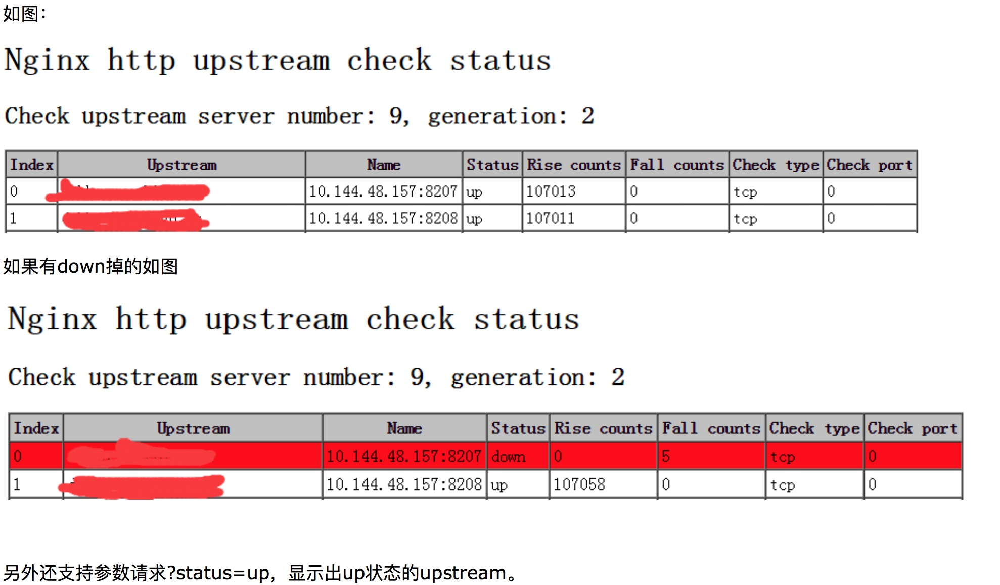

## 动态脚本
### if 语法
 
```shell
#如果请求里token参数为空
if ($arg_token = '') {
    set $token  para; 
}
```

不支持else语法，多条件只能挨个写if
注意括号前后必须有空格

#### 可用于if的全局变量

```shell
$args ： #这个变量等于请求行中的参数，同$query_string
$content_length ： 请求头中的Content-length字段。
$content_type ： 请求头中的Content-Type字段。
$document_root ： 当前请求在root指令中指定的值。
$host ： 请求主机头字段，否则为服务器名称。
$http_user_agent ： 客户端agent信息
$http_cookie ： 客户端cookie信息
$limit_rate ： 这个变量可以限制连接速率。
$request_method ： 客户端请求的动作，通常为GET或POST。
$remote_addr ： 客户端的IP地址。
$remote_port ： 客户端的端口。
$remote_user ： 已经经过Auth Basic Module验证的用户名。
$request_filename ： 当前请求的文件路径，由root或alias指令与URI请求生成。
$scheme ： HTTP方法（如http，https）。
$server_protocol ： 请求使用的协议，通常是HTTP/1.0或HTTP/1.1。
$server_addr ： 服务器地址，在完成一次系统调用后可以确定这个值。
$server_name ： 服务器名称。
$server_port ： 请求到达服务器的端口号。
$request_uri ： 包含请求参数的原始URI，不包含主机名，如：”/foo/bar.php?arg=baz”。
$uri ： 不带请求参数的当前URI，$uri不包含主机名，如”/foo/bar.html”。
$document_uri ： 与$uri相同。
```

### 获取请求参数

```shell
#获取token参数
$arg_token 
#所有请求参数
$query_string
#获取请求头参数
$http_token
```

### 获取请求地址

```shell
#请求的文件和路径，不包括“?”或者“#”之后的东西
$uri
#$request_uri则是请求的整个字符串，包含了后面的query_string
$request_uri

```
## 错误页设置
三种方式
1. 设置error_page参数
    可设置全局的，也可设置具体location的
    
    ```
    error_page 404 = https://www.baodu.com;
    ```
1. 设置error_page指向的location，然后配置location
    
    ```
    error_page  500 502 503 504 /50x.html;
    location = /50x.html {
        root  html;
    }
    ```
2. 设置try_files
    try_files指定一个本地文件链，从第一个文件开始匹配，直到找到能正常访问的文件
    
    ```shell
    # 先找uri这个变量对应的文件，然后uri这个文件夹，然后首页
    try_files $uri $uri/ /index.php?$args;
    ```
    
    注意try_files**只能对应本地文件**，无法指向远程文件


**注意设置错误页需要在配置文件中添加**：

```
proxy_intercept_errors on;
```
来开启nginx的错误代理，否则不生效
    
## nginx指令
    
### try_files
try_files指定一个调用链，从第一个开始请求，直到请求到一个能正常访问的页面为止
    
```
try_files $uri $uri/ /index.html?$query_string; 
```
先请求uri（uri参数在nginx里指的是请求路径，不带参数），然后请求uri文件夹，最后请求index.html并拼接完整参数

### upstream

```shell
upstream test {
    server 172.16.0.53:8888 max_fails=3 fail_timeout=10s;
    check interval=5000 rise=2 fall=3 timeout=1000;
}
```

### location

```shell
location ^~ /test/ {
        proxy_pass http://test/;
    }
```

#### 绝对路径和相对路径
如果在proxy_pass后面的url加/，表示绝对根路径，会把匹配的path吃掉；如果没有/，表示相对路径，把匹配的路径部分也给代理过去

### rewrite
```shell
rewrite 匹配规则 重定向地址;
```
* rewrite指令后面不能直接跟`$`变量，变通方法是常量后面拼变量，如`http://$url`
* 如果有多条rewrite规则，不同规则通过if匹配，此时rewrite最后需要加上break，否则还会执行下一条rewrite ps:试了下多个if里加break，貌似不生效，后来使用了if里定义变量，最外面rewrite时使用变量值的方式
    
```
        if ($arg_version != '2') {
            set $rw lucky.peopletech.cn/wap-news-mi/#/normal/$arg_id?lang=$arg_lang;
        }
        if ($arg_version = '2') {
            set $rw lucky.peopletech.cn/oss-mi/$arg_env/$arg_mibusinessId/$arg_id.html;
        }
        rewrite "^/(.*)$" http://$rw;
```

## nginx_heath模块
为什么会使用nginx_heath 这个模块，主要是如nginx+tomcat部署的时，tomcat挂了之后nginx->upstream 轮询是可以踢掉挂掉的tomcat服务。

实现nginx_heath目前主要有三种方法
1. ngx_http_proxy_module 模块和ngx_http_upstream_module模块（自带）
    官网地址：http://nginx.org/cn/docs/http/ngx_http_proxy_module.html#proxy_next_upstream
2. nginx_upstream_check_module模块
    官网网址：https://github.com/yaoweibin/nginx_upstream_check_module
3. ngx_http_healthcheck_module模块
    官网网址：http://wiki.nginx.org/NginxHttpHealthcheckModule

目前主要使用的是第二种解决方式

### 添加模块

首先需要添加【nginx_upstream_check_module】模块：http://pan.baidu.com/s/1caLNUe

`./nginx -V`

查看已经添加的nginx模块如：`--prefix=/opt/nginx-new --with-http_ssl_module --with-http_v2_module --with-http_stub_status_module --with-pcre`

进入nginx源码中为nginx打补丁：`patch -p0 < ../nginx_upstream_check_module-master/check_1.5.12+.patch`，这个需要合适的版本，不然会出现打补丁失败，如果提示没有patch命令的话，请先安装`yum -y install patch`

追加nginx_upstream_check_module模块：`--prefix=/opt/nginx-new --with-http_ssl_module --with-http_v2_module --with-http_stub_status_module --with-pcre --add-module=/home/software/nginx_upstream_check_module-master`

然后make

### 配置upstream加入健康检查

```shell
upstream name{
　　server 10.144.48.157:8205;
　　server 119.29.204.12:8889;
　　check interval=3000 rise=2 fall=3 timeout=3000 type=tcp;
}
```

上面配置的意思是，对name这个负载均衡条目中的所有节点，每个3秒检测一次，请求2次正常则标记 realserver状态为up，如果检测 3 次都失败，则标记 realserver的状态为down，超时时间为3秒。

指定参数的意思：
- interval：向后端发送的健康检查包的间隔。
- fall(fall_count): 如果连续失败次数达到fall_count，服务器就被认为是down。
- rise(rise_count): 如果连续成功次数达到rise_count，服务器就被认为是up。
- timeout: 后端健康请求的超时时间。
- default_down: 设定初始时服务器的状态，如果是true，就说明默认是down的，如果是false，就是up的。默认值是true，也就是一开始服务器认为是不可用，要等健康检查包达到一定成功次数以后才会被认为是健康的。
- type：健康检查包的类型，现在支持以下多种类型
- tcp：简单的tcp连接，如果连接成功，就说明后端正常。
- ssl_hello：发送一个初始的SSL hello包并接受服务器的SSL hello包。
- http：发送HTTP请求，通过后端的回复包的状态来判断后端是否存活。
- mysql: 向mysql服务器连接，通过接收服务器的greeting包来判断后端是否存活。
- ajp：向后端发送AJP协议的Cping包，通过接收Cpong包来判断后端是否存活。
- port: 指定后端服务器的检查端口。你可以指定不同于真实服务的后端服务器的端口，比如后端提供的是443端口的应用，你可以去检查80端口的状态来判断后端健康状况。默认是0，表示跟后端server提供真实服务的端口一样。该选项出现于Tengine-1.4.0。

### 配置健康检查状态查看页面

```shell
location /nstatus {
　　check_status;
　　access_log off;
}
```


