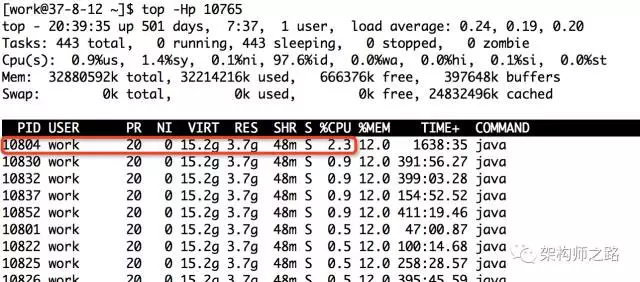
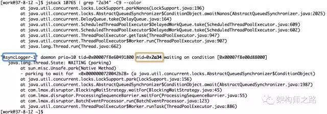
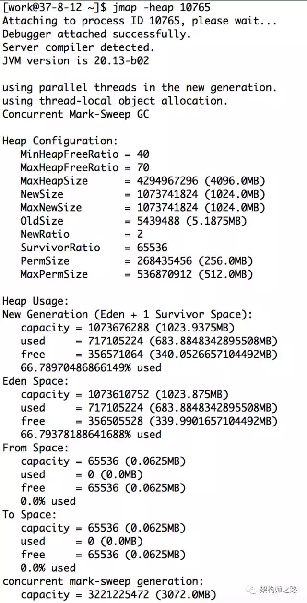
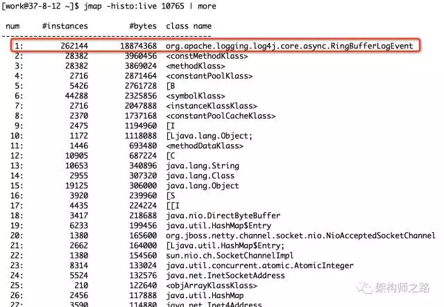
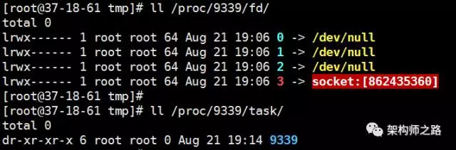

### 服务器状态查看

#### 一、了解机器连接数情况

**问题**：1.2.3.4的sshd的监听端口是22，如何统计1.2.3.4的sshd服务各种连接状态(TIME_WAIT/ CLOSE_WAIT/ ESTABLISHED)的连接数。

 

**参考答案**：

- netstat -n | grep 1.2.3.4:22 | awk '/^tcp/ {++S[$NF]} END {for(a in S) print a, S[a]}’
- netstat -lnpta | grep ssh | egrep “TIME_WAIT | CLOSE_WAIT | ESTABLISHED”
- n [仅限于阿里云] 

 

**说明**：netstat是追查网络连接问题常用工具，和grep/awk结合更是神器，当然如果在阿里云上，还有更方便的方法。

 

#### 二、从已经备份好的日志中查询数据

**问题**：从已备份的suyun.2017-06-26.log.bz2日志中，找出包含关键字1.2.3.4的日志有多少条。

 

**参考答案**：

- bzcat suyun.2017-06-26.log.bz2 | grep '1.2.3.4' | wc -l
- bzgrep '1.2.3.4' suyun.2017-06-26.log.bz2 | wc -l
- less suyun.2017-06-26.log.bz2 | grep '10.37.9.11' | wc -l

 

**说明**：线上日志文件一般以bz2 压缩之后保留，如果解压查询，非常耗空间与时间，bzcat和bzgrep是研发同学必须掌握的工具。

 

#### 三、备份服务的技巧

**问题**：打包备份/opt/web/suyun_web目录，排除掉目录中的logs和目录，打包好的文件存放在/opt/backup目录下。

 

**参考答案**：

tar -zcvf /opt/backup/shenjian.tar.gz \

​    -exclude /opt/web/suyun_web/logs \

​    /opt/web/suyun_web

 

**说明**：这个命令线上应用较为频繁，在项目需要打包迁移时，常常需要排除掉日志目录，exclude是需要掌握的参数。

 

#### 四、查询线程数

**问题**：查询服务器运行服务的总线程数，当机器线程数超报警阀值时，能快速查出相关进程及线程信息。

 

**参考答案**：

- ps -eLf | wc -l
- pstree -p | wc -l

 

#### 五、磁盘报警，清空最大文件

**问题**：找出服务器上，某个正在运行的tomcat产生的大量异常日志，找出该文件，并释放空间。不妨设该文件包含log关键字，并且大于1G。

 

**参考答案**：

**第一步，找到该文件**

- find / -type f -name "*log*" | xargs ls -lSh | more  
- du -a / | sort -rn | grep log | more
- find / -name '*log*' -size +1000M -exec du -h {} \;

 

**第二步，将文件清空**

假设找到的文件为a.log

正确的情况方式应该为：echo "">a.log，文件空间会立刻释放。

很多同学：rm -rf a.log，这样文件虽然删除，但是因tomcat服务仍在运行，空间不会立刻释放，需要重启tomcat才能将空间释放。

 

#### 六、显示文件，过滤注释

**问题**：显示server.conf 文件，屏蔽掉#号开头的注释行

 

**参考答案**：

- sed -n '/^[#]/!p' server.conf
- sed -e '/^#/d' server.conf
- grep -v "^#" server.conf

 

#### 七、磁盘IO****异常排查

**问题**：磁盘IO异常如何排查，类似写入慢或当前使用率较高，请查出导致磁盘IO异常高的进程ID。

 

**参考答案**：

第一步：iotop -o 查看当前正在写磁盘操作的所有进程ID信息。

第二步：如果此时各项写入指标都很低，基本没有大的写入操作，则需要排查磁盘自身。可以查看系统dmesg或cat /var/log/message 看看是否有相关的磁盘异常报错，同时可以在写入慢的磁盘上touch 一个空文件看看，是否磁盘故障导致无法写入。

### 线上服务CPU100%问题快速定位实战

**功能问题**，通过日志，单步调试相对比较好定位。

**性能问题**，例如线上服务器CPU100%，如何找到相关服务，如何定位问题代码，更考验技术人的功底。

**题目**

某服务器上部署了若干tomcat实例，即若干垂直切分的Java站点服务，以及若干Java微服务，突然收到运维的CPU异常告警。

问：如何定位是**哪个服务进程**导致CPU过载，**哪个线程**导致CPU过载，**哪段代码**导致CPU过载？

 #### 步骤一、找到最耗CPU的进程

**工具**：top

**方法**：

- 执行top -c ，显示进程运行信息列表
- 键入P (大写p)，进程按照CPU使用率排序

**图示**：

如上图，最耗CPU的进程PID为10765

 

#### 步骤二：找到最耗CPU的线程

**工具**：top

**方法**：

- top -Hp 10765 ，显示一个进程的线程运行信息列表
- 键入P (大写p)，线程按照CPU使用率排序

**图示**：

如上图，进程10765内，最耗CPU的线程PID为10804

 

#### 步骤三：将线程PID转化为16进制

**工具**：printf

**方法**：printf “%x\n” 10804

**图示**：

如上图，10804对应的16进制是0x2a34，当然，这一步可以用计算器。

 

之所以要转化为16进制，是因为堆栈里，线程id是用16进制表示的。

 

#### 步骤四：查看堆栈，找到线程在干嘛

**工具**：pstack/jstack/grep

**方法**：jstack 10765 | grep ‘0x2a34’ -C5 --color

- 打印进程堆栈
- 通过线程id，过滤得到线程堆栈

**图示**：

如上图，找到了耗CPU高的线程对应的线程名称“AsyncLogger-1”，以及看到了该线程正在执行代码的堆栈。

###  线上服务内存OOM问题定位三板斧 
相信大家都有感触，线上服务内存OOM的问题，是最难定位的问题，不过归根结底，最常见的原因：

- 本身资源不够
- 申请的太多
- 资源耗尽

**题目**

某服务器上部署了Java服务一枚，出现了OutOfMemoryError，请问有可能是什么原因，问题应该如何定位？

不妨设服务进程PID为10765（没错，就是CPU占用高的那个倒霉的进程《[线上服务CPU100%问题快速定位实战](http://mp.weixin.qq.com/s?__biz=MjM5ODYxMDA5OQ==&mid=2651960332&idx=1&sn=63cb23e04ac4bf926434f34001c0718a&chksm=bd2d01d08a5a88c6a01e62533162cc3535defb37cefa61a800e405edda8240ad17432e023d53&scene=21#wechat_redirect)》）。

 

**解决思路**

Java服务OOM，最常见的原因为：

- 有可能是内存分配确实过小，而正常业务使用了大量内存
- 某一个对象被频繁申请，却没有释放，内存不断泄漏，导致内存耗尽
- 某一个资源被频繁申请，系统资源耗尽，例如：不断创建线程，不断发起网络连接

 

更具体的，可以使用以下的一些工具逐一排查。

 

#### 一、确认是不是内存本身就分配过小

方法：jmap -heap 10765

如上图，可以查看新生代，老生代堆内存的分配大小以及使用情况，看是否本身分配过小。

#### 二、找到最耗内存的对象

**方法**：jmap -histo:live 10765 | more

**图示**：

如上图，输入命令后，会以表格的形式显示存活对象的信息，并按照所占内存大小排序：

- **实例数**
- **所占内存大小**
- **类名**

是不是很直观？对于实例数较多，占用内存大小较多的实例/类，相关的代码就要针对性review了。

 

上图中占内存最多的对象是RingBufferLogEvent，共占用内存18M，属于正常使用范围。

如果发现某类对象占用内存很大（例如几个G），很可能是类对象创建太多，且一直未释放。例如：

- 申请完资源后，未调用close()或dispose()释放资源
- 消费者消费速度慢（或停止消费了），而生产者不断往队列中投递任务，导致队列中任务累积过多

#### 三、确认是否是资源耗尽

工具：

- pstree
- netstat

查看进程创建的线程数，以及网络连接数，如果资源耗尽，也可能出现OOM。

 

这里介绍另一种方法，通过

- /proc/${PID}/fd
- /proc/${PID}/task

可以分别查看句柄详情和线程数。

 

例如，某一台线上服务器的sshd进程PID是9339，查看

- ll /proc/9339/fd
- ll /proc/9339/task

如上图，sshd共占用了四个句柄

- 0 -> 标准输入
- 1 -> 标准输出
- 2 -> 标准错误输出
- 3 -> socket（容易想到是监听端口）

 

sshd只有一个主线程PID为9339，并没有多线程。

所以，只要

- ll /proc/${PID}/fd | wc -l
- ll /proc/${PID}/task | wc -l （效果等同pstree -p | wc -l）

就能知道进程打开的句柄数和线程数。

 

**作业**

对线上服务器的一台tomcat，查看proc下的fd目录和task目录，特别是对于句柄fd目录的查询，有意想不到的惊喜哟，一定要动手试试哈。

转自
- [线上操作与线上问题排查实战](https://mp.weixin.qq.com/s?__biz=MjM5ODYxMDA5OQ==&mid=2651960323&idx=1&sn=e04af14d2ebf939133869e0f18bb0dd1&chksm=bd2d01df8a5a88c98c3cb94a99334a16b372fd997f36bc757a38bb44b70d977797fa840064dc&scene=21#wechat_redirect)
- [线上服务CPU100%问题快速定位实战](https://mp.weixin.qq.com/s?__biz=MjM5ODYxMDA5OQ==&mid=2651960332&idx=1&sn=63cb23e04ac4bf926434f34001c0718a&chksm=bd2d01d08a5a88c6a01e62533162cc3535defb37cefa61a800e405edda8240ad17432e023d53&scene=21#wechat_redirect)
- [线上服务内存OOM问题定位三板斧](https://mp.weixin.qq.com/s?__biz=MjM5ODYxMDA5OQ==&amp;mid=2651960342&amp;idx=1&amp;sn=9b2dbbb2cfd7710f25be1a0862a9b2be&amp;chksm=bd2d01ca8a5a88dcc14608cb00e0dbde11869d053ee8c83bc96e7b4a0fbd71d28d7fbb009c98&amp;scene=21#wechat_redirect)